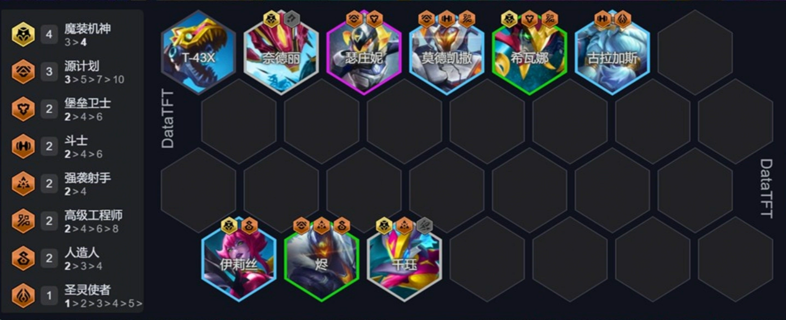
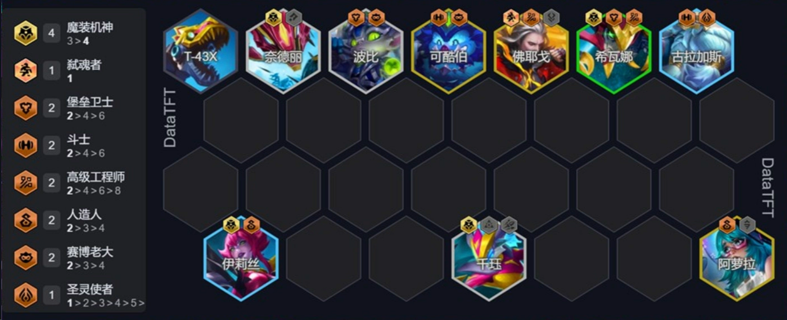

# 阵容构筑
### 8人口

### 9人口

场下拉一个厄加特

# 运营思路
1. 野怪环节最好3-魔装机神，看情况拉人口，7极小d，往8人口阵容构建，8级不d，速9.
2. 9人口来阿萝拉前蜘蛛主C,烬副C，铁男主坦，猪副坦

### 装备选择
1. 阿萝拉(头盔-大天使-鬼书),前期蜘蛛戴装备打工，需要做一个电刀
2. 豹女(偷偷)->厄加特
3. 龙女/铁男(冰甲,狂徒,王冠,薄暮等肉装功能装)->猪->可库伯

