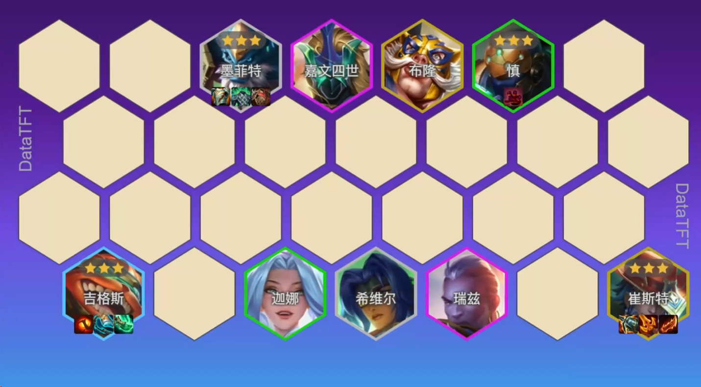

1. 优先战力海克斯(团队收益大的，不需要英雄单c的)，例如日炎棋盘、偷偷、造成小小英雄有钱的
2. 装备优先羊刀->石头装备->炸弹人装备，物理装备轮子妈->崔斯特
3. 果实轮子妈开局点金手或者随意，第二个给石头刷身体变换/抵抗，炸弹人3了给炸弹人刷减抗
4. d牌节奏，4级如果剩30以上能冲出来一个三星就冲，冲不出来就不冲，卡50经济d一个三星出来
5. 外面有同行时，1个三星后拉7，卡利息d，有牌浪就多d几次
6. 过度，前期用纳尔+轮子妈+石头，如果轮子妈牌少，就直接用2星炸弹人，下纳尔上多司令

整体挺强的

