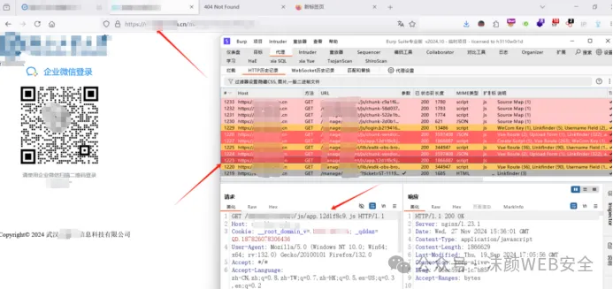

**<font style="color:rgb(64, 64, 64);">1. Webpack源码信息泄露</font>**

<font style="color:rgb(64, 64, 64);">漏洞</font><font style="color:rgb(64, 64, 64);">url：</font>

<font style="color:rgb(64, 64, 64);">https://</font><font style="color:rgb(64, 64, 64);">xxx.xxx</font><font style="color:rgb(64, 64, 64);">.cn/</font><font style="color:rgb(64, 64, 64);">xxx</font><font style="color:rgb(64, 64, 64);">/</font><font style="color:rgb(64, 64, 64);">xxx/</font><font style="color:rgb(64, 64, 64);">js/app.12d1f8c9.js.map</font>

<font style="color:rgb(64, 64, 64);">登录地址：</font><font style="color:rgb(64, 64, 64);">https://</font><font style="color:rgb(64, 64, 64);">xxx.xxx</font><font style="color:rgb(64, 64, 64);">.cn/#/home</font>

<font style="color:rgb(64, 64, 64);">扫码</font><font style="color:rgb(64, 64, 64);">抓包发现很多</font><font style="color:rgb(64, 64, 64);">js文件存在js.map泄露</font>



<font style="color:rgb(64, 64, 64);">访问</font>

<font style="color:rgb(64, 64, 64);">https://xxx.xxx.xxx.cn/xxx/xxx/js/app.12d1f8c9.js.map下载</font>

**<font style="color:rgb(51, 51, 51);">下载后使用</font>****<font style="color:rgb(51, 51, 51);">sourcemap工具进行反编译寻找源代码敏感信息</font>**

**<font style="color:rgb(51, 51, 51);">参考链接：</font>**

```plain
http://www.luckysec.cn/posts/531d91e3.html
```

**<font style="color:rgb(51, 51, 51);">sourcemap安装/还原命令（js.map所在当前目录下）</font>**

```plain
npm install --global reverse-sourcemapreverse-sourcemap -v app.12d1f8c9.js.map -o hbut
```

**<font style="color:rgb(0, 0, 0) !important;">作用</font>**<font style="color:rgba(0, 0, 0, 0.85);">：通过 npm（Node.js 包管理器）全局安装reverse-sourcemap工具，该工具可将编译后的 JavaScript 文件及其对应的 sourcemap 文件还原为原始源代码。</font>

<font style="color:rgb(0, 0, 0);">-o hbut</font><font style="color:rgba(0, 0, 0, 0.85) !important;">：将还原的源代码输出到名为</font><font style="color:rgb(0, 0, 0);">hbut</font><font style="color:rgba(0, 0, 0, 0.85) !important;">的目录中（可自行命名）。</font>


**<font style="color:rgb(51, 51, 51);">编译完后打开文件夹下的</font>****<font style="color:rgb(51, 51, 51);">xxx</font>****<font style="color:rgb(51, 51, 51);">/webpack/src/main.js</font>**


<font style="color:rgba(0, 0, 0, 0.9);">使用</font><font style="color:rgba(0, 0, 0, 0.9);">Windows PowerShell</font><font style="color:rgba(0, 0, 0, 0.9);">自带命令全局搜索当前目录下</font><font style="color:rgba(0, 0, 0, 0.9);">js</font><font style="color:rgba(0, 0, 0, 0.9);">中的关键字，这里我们直接搜索</font><font style="color:rgba(0, 0, 0, 0.9);">”</font><font style="color:rgb(255, 0, 0);">SK</font><font style="color:rgba(0, 0, 0, 0.9);">”</font><font style="color:rgba(0, 0, 0, 0.9);">关键字</font>

**<font style="color:rgba(0, 0, 0, 0.9);">命令：</font>****<font style="color:rgb(255, 0, 0);">Get-ChildItem -Recurse -Include *.js | Select-String -Pattern "SK"</font>**

<font style="color:rgba(0, 0, 0, 0.9);">可以发现成功搜索到敏感信息</font><font style="color:rgba(0, 0, 0, 0.9);">SK</font><font style="color:rgba(0, 0, 0, 0.9);">泄露，并且给出的位置在</font><font style="color:rgba(0, 0, 0, 0.9);">main.js</font><font style="color:rgba(0, 0, 0, 0.9);">中！</font>


<font style="color:rgba(0, 0, 0, 0.9);">进入查看，发现</font><font style="color:rgba(0, 0, 0, 0.9);">AKSK</font><font style="color:rgba(0, 0, 0, 0.9);">全都在</font>

**<font style="color:rgb(51, 51, 51);">发现华为云</font>****<font style="color:rgb(51, 51, 51);">AK</font>****<font style="color:rgb(51, 51, 51);">SK</font>****<font style="color:rgb(51, 51, 51);">泄露</font>**


**<font style="color:rgb(64, 64, 64);">2.华为云服务器接管</font>**

**<font style="color:rgb(51, 51, 51);">使用云资产管理工具进行接管</font>**

<font style="color:rgb(51, 51, 51);">// Vue.prototype.$OBS_AK = "C</font><font style="color:rgb(51, 51, 51);">xxxxxxxxxx</font><font style="color:rgb(51, 51, 51);">0";</font>

<font style="color:rgb(51, 51, 51);">// Vue.prototype.$OBS_SK = "k9</font><font style="color:rgb(51, 51, 51);">xxxxxxxxxxxxxxxxx</font><font style="color:rgb(51, 51, 51);">Ma";</font>


**<font style="color:rgb(51, 51, 51);">生成账号密码接管</font>**


**<font style="color:rgb(51, 51, 51);">接管服务器成功</font>****<font style="color:rgb(51, 51, 51);">！</font>**


<font style="color:rgb(51, 51, 51);">用户名：</font><font style="color:rgb(51, 51, 51);">xxxx</font><font style="color:rgb(51, 51, 51);">SRC</font>

<font style="color:rgb(51, 51, 51);">密码：</font><font style="color:rgb(51, 51, 51);">9</font><font style="color:rgb(51, 51, 51);">xxxxxx</font><font style="color:rgb(51, 51, 51);">Yfpy</font>

<font style="color:rgb(51, 51, 51);">登录地址：</font><font style="color:rgb(51, 51, 51);">https://auth.huaweicloud.com/authui/login?id=hw</font><font style="color:rgb(51, 51, 51);">xxxxx</font><font style="color:rgb(51, 51, 51);">0</font>

<font style="color:rgb(51, 51, 51);">访问登录地址使用账号密码登录成功</font>


<font style="color:rgb(51, 51, 51);">登录成功</font>


**<font style="color:rgb(51, 51, 51);">接管以后可以查看任意信息，进行任意操作</font>**


**<font style="color:rgb(64, 64, 64);">3.</font>****<font style="color:rgb(64, 64, 64);">云上服务器命令行执行命令</font>**


**<font style="color:rgb(64, 64, 64);">4.存储桶接管</font>**

<font style="color:rgb(51, 51, 51);">下载</font><font style="color:rgb(51, 51, 51);">OBS Browser+</font>

<font style="color:rgb(51, 51, 51);">https://support.huaweicloud.com/browsertg-obs/obs_03_1003.html</font>


<font style="color:rgb(51, 51, 51);">安装后</font>

<font style="color:rgb(51, 51, 51);">// Vue.prototype.$OBS_AK = "CI</font><font style="color:rgb(51, 51, 51);">xxxxxxx</font><font style="color:rgb(51, 51, 51);">Y0";</font>

<font style="color:rgb(51, 51, 51);">// Vue.prototype.$OBS_SK = "k9</font><font style="color:rgb(51, 51, 51);">xxxxxxxxxxxx</font><font style="color:rgb(51, 51, 51);">Ma";</font>


**<font style="color:rgba(0, 0, 0, 0.9);">成功接管，提交坐等拿钱即可，收工！</font>**

