1. Webpack源码信息泄露

漏洞url：

https://xxx.xxx.cn/xxx/xxx/js/app.12d1f8c9.js.map

登录地址：https://xxx.xxx.cn/#/home

扫码抓包发现很多js文件存在js.map泄露


访问https://xxx.xxx.xxx.cn/xxx/xxx/js/app.12d1f8c9.js.map下载

下载后使用sourcemap工具进行反编译寻找源代码敏感信息

参考链接：

```plain
http://www.luckysec.cn/posts/531d91e3.html
```

sourcemap安装/还原命令（js.map所在当前目录下）

```plain
npm install --global reverse-sourcemapreverse-sourcemap -v app.12d1f8c9.js.map -o hbut
```

作用：通过 npm（Node.js 包管理器）全局安装reverse-sourcemap工具，该工具可将编译后的 JavaScript 文件及其对应的 sourcemap 文件还原为原始源代码。

-o hbut：将还原的源代码输出到名为hbut的目录中（可自行命名）。

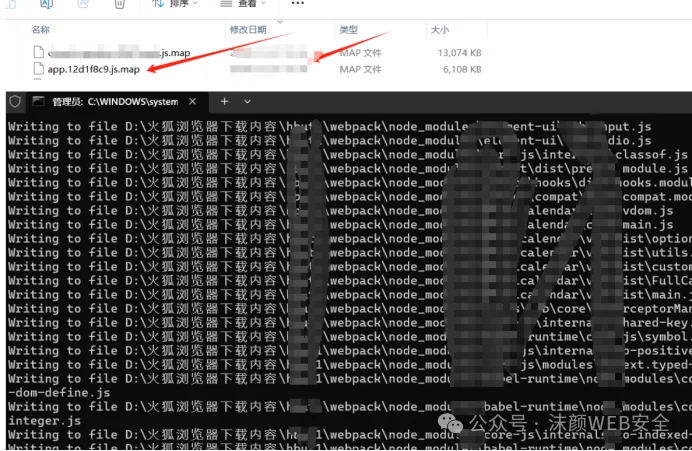

编译完后打开文件夹下的xxx/webpack/src/main.js

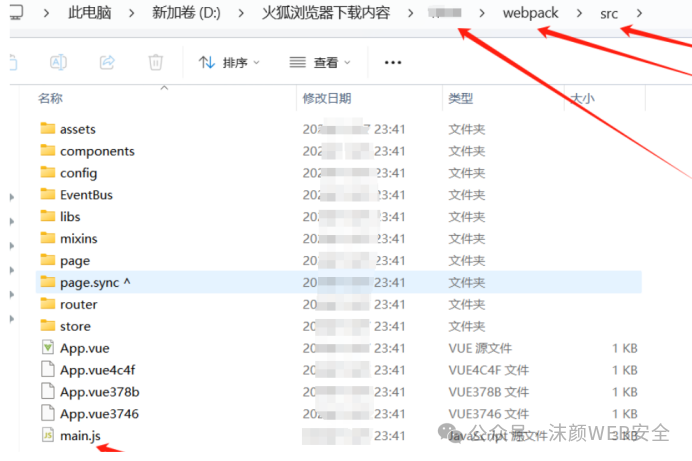

使用Windows PowerShell自带命令全局搜索当前目录下js中的关键字，这里我们直接搜索”SK”关键字

命令：Get-ChildItem -Recurse -Include *.js | Select-String -Pattern "SK"

可以发现成功搜索到敏感信息SK泄露，并且给出的位置在main.js中！

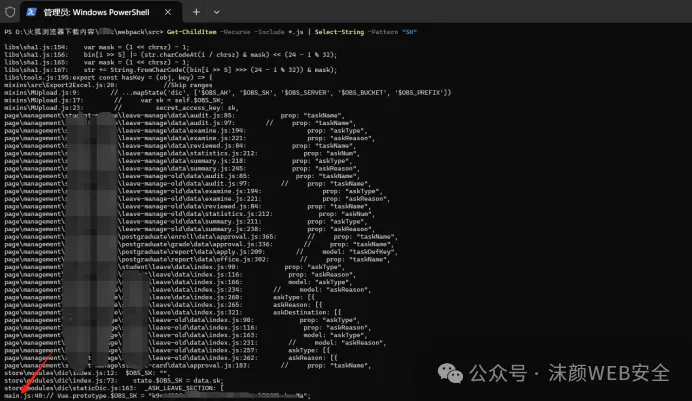

进入查看，发现AKSK全都在

发现华为云AKSK泄露

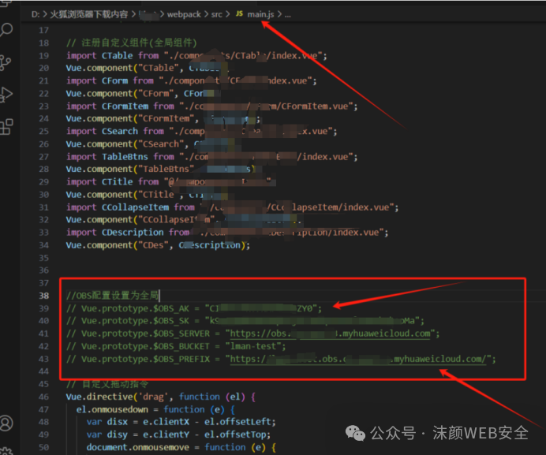

2.华为云服务器接管

使用云资产管理工具进行接管

// Vue.prototype.$OBS_AK = "Cxxxxxxxxxx0";

// Vue.prototype.$OBS_SK = "k9xxxxxxxxxxxxxxxxxMa";

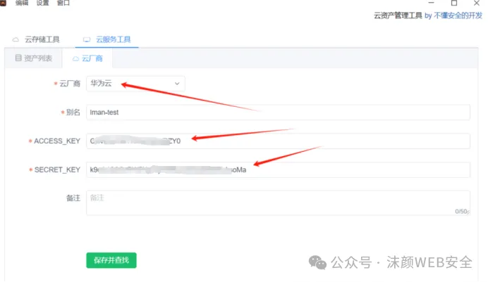

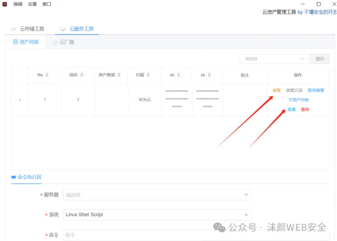

生成账号密码接管

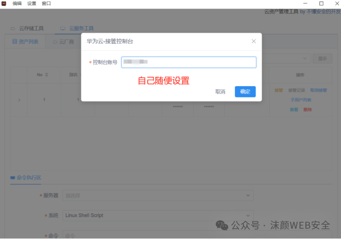

接管服务器成功！

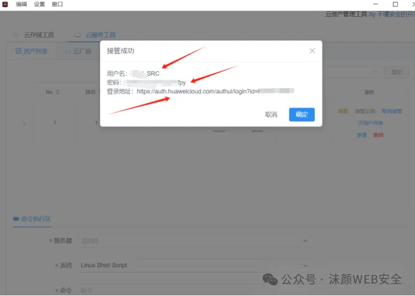

用户名：xxxxSRC

密码：9xxxxxxYfpy

登录地址：https://auth.huaweicloud.com/authui/login?id=hwxxxxx0

访问登录地址使用账号密码登录成功

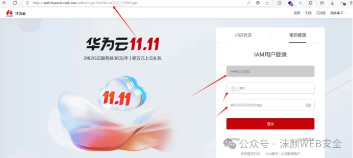

登录成功

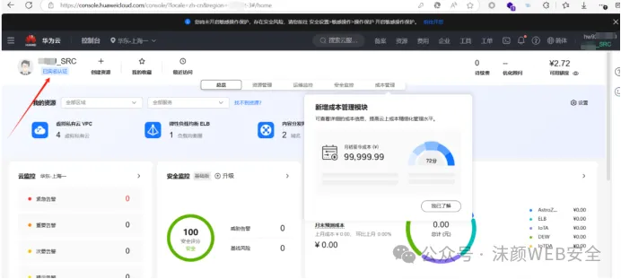

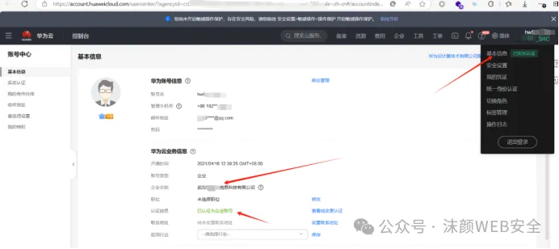

接管以后可以查看任意信息，进行任意操作

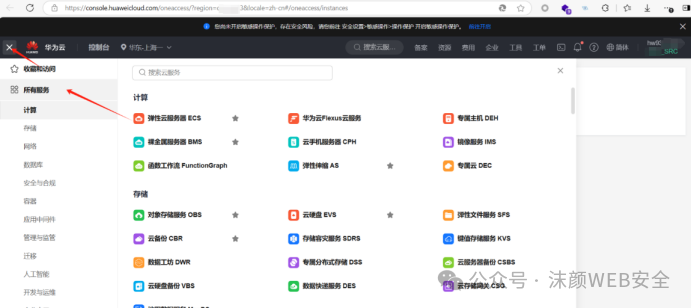

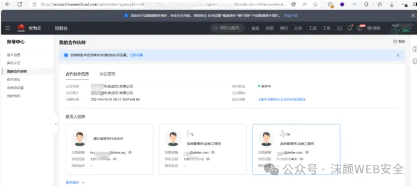

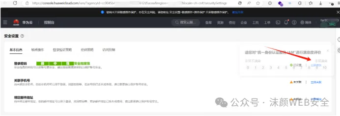

3.云上服务器命令行执行命令

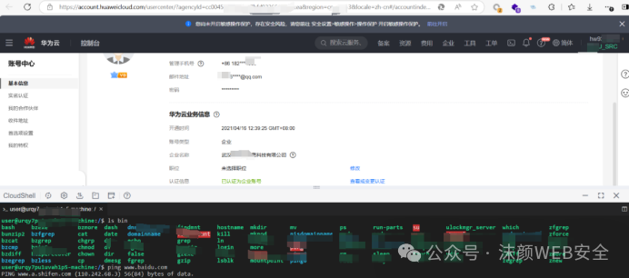

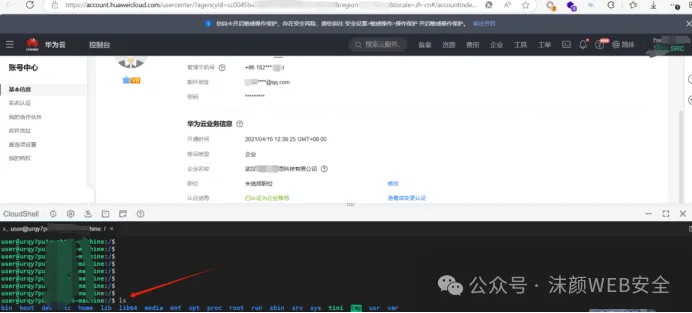

4.存储桶接管

下载OBS Browser+

https://support.huaweicloud.com/browsertg-obs/obs_03_1003.html

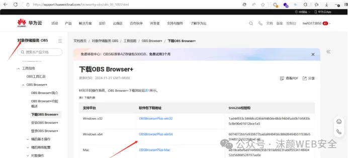

安装后

// Vue.prototype.$OBS_AK = "CIxxxxxxxY0";

// Vue.prototype.$OBS_SK = "k9xxxxxxxxxxxxMa";

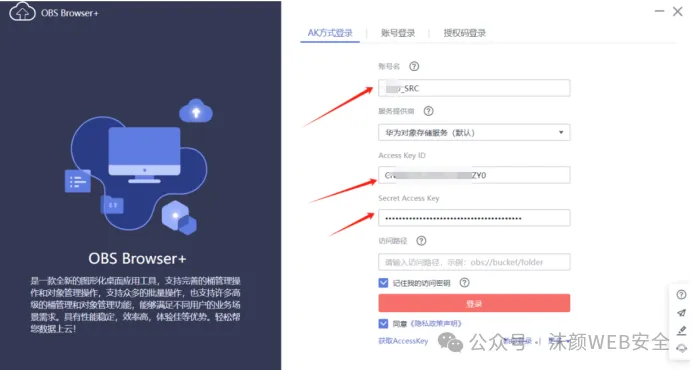

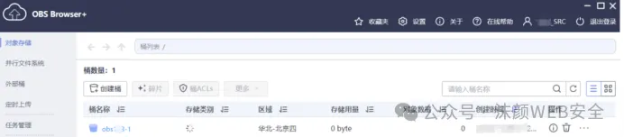

成功接管，提交坐等拿钱即可，收工！

