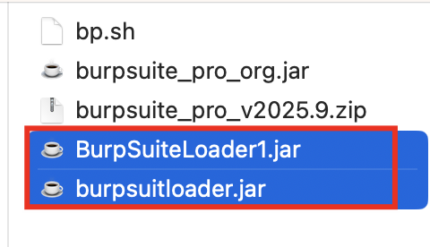
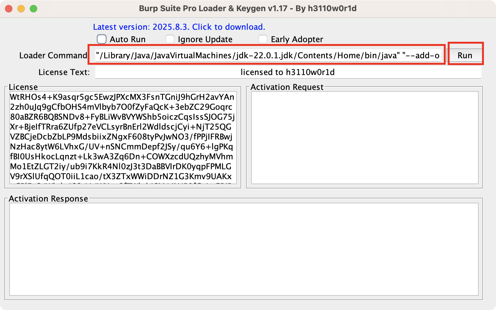

## 下载最新版burp(jar版本)
[https://portswigger.net/burp/releases#professional](https://portswigger.net/burp/releases#professional)

## 下载最新版burp对应支持的java版本
[https://www.oracle.com/java/technologies/javase/jdk22-archive-downloads.html](https://www.oracle.com/java/technologies/javase/jdk22-archive-downloads.html)

## 破解
1. 将下载下来的最新版`burp`重命名为`burpsuite_pro_org.java`
2. 将破解程序放到同级目录下

链接: [https://pan.baidu.com/s/1uip37jljnR8uO9raXsMwyQ?pwd=avsm](https://pan.baidu.com/s/1uip37jljnR8uO9raXsMwyQ?pwd=avsm) 提取码: avsm 

3. 启动`java22 -jar BurpSuiteLoader1.jar`  
  
点击run就可以运行bp了

## 快捷启动
将第一个框内的代码cv到bp.bat或者bp.sh中，去除所有双引号，保存关闭，后续通过双击bat或者sh脚本即可启动burp

## 优化
1. 字体(Menlo 18pt)
2. mingdong
3. DetSql
4. xia_yue
5. captcha-killer
6. turbo-intruder-all

