# cursor是什么?
:::tip
cursor是[openAi](https://so.csdn.net/so/search?q=openAi&spm=1001.2101.3001.7020)合作伙伴推出的，内置GPT-4的编辑器，能更好的为开发者服务。关键是是他是**免费的**。

cursor不用梯子也能用，支持多种语言：python，java，C#等等语言，也同样支持在多平台安装。可以用于聊天，辅助写代码，辅助写作等等功能。相信你试用了之后会感觉，嗯....真香。

:::

# 下载
[cursor官网](https://www.cursor.com/cn)

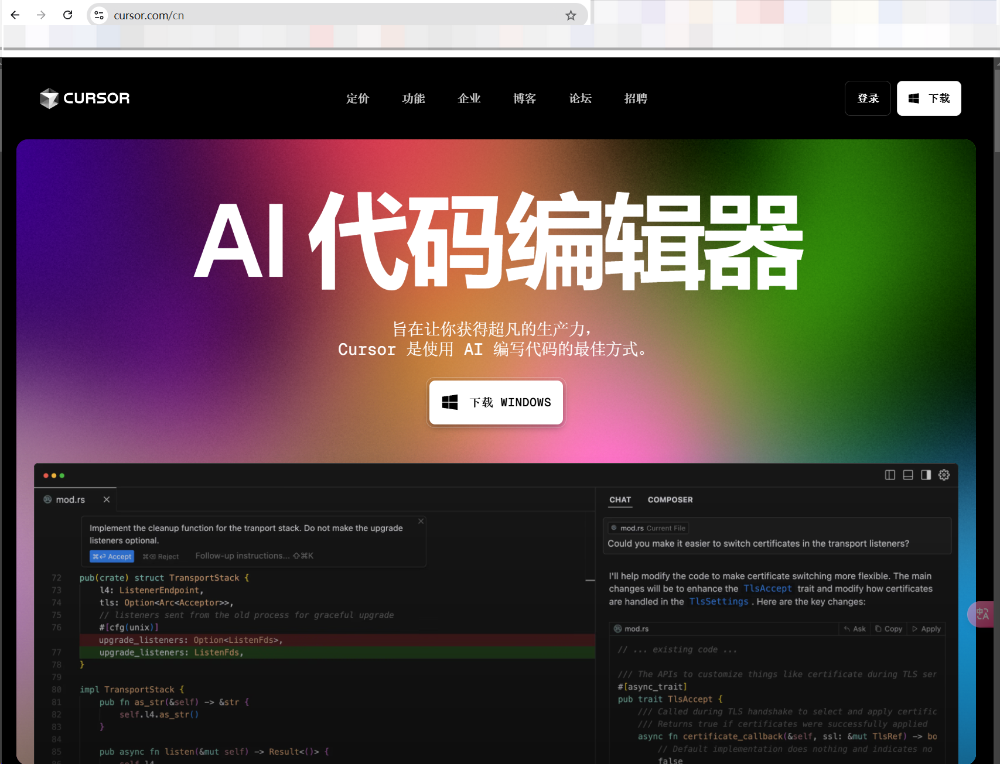

# 安装
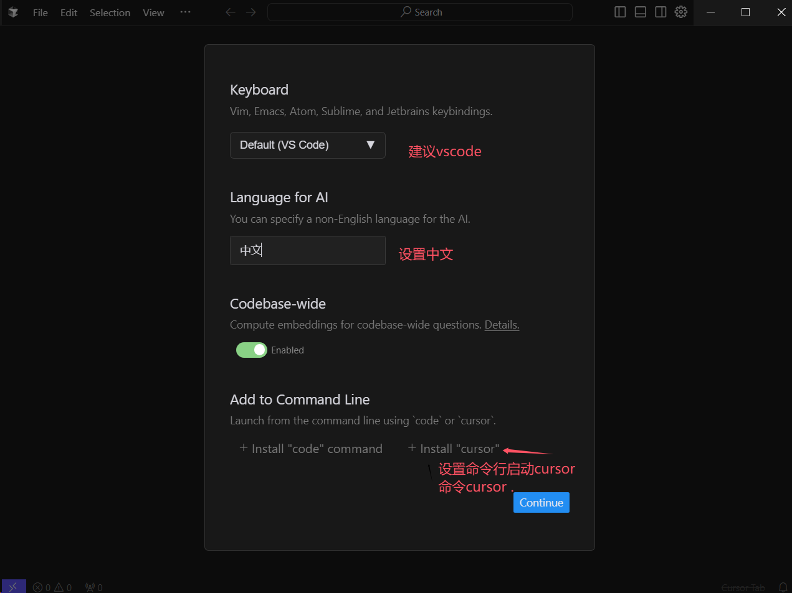

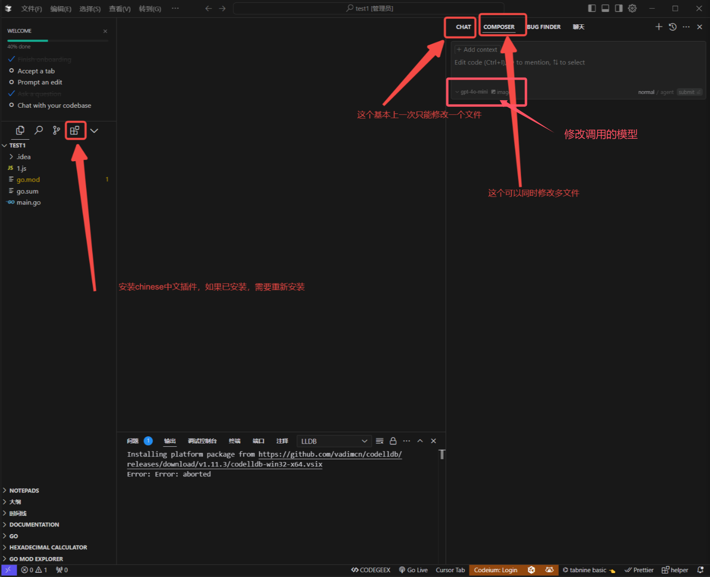

# 使用
## 导入deepseek-R1模型
### 打开cursor设置
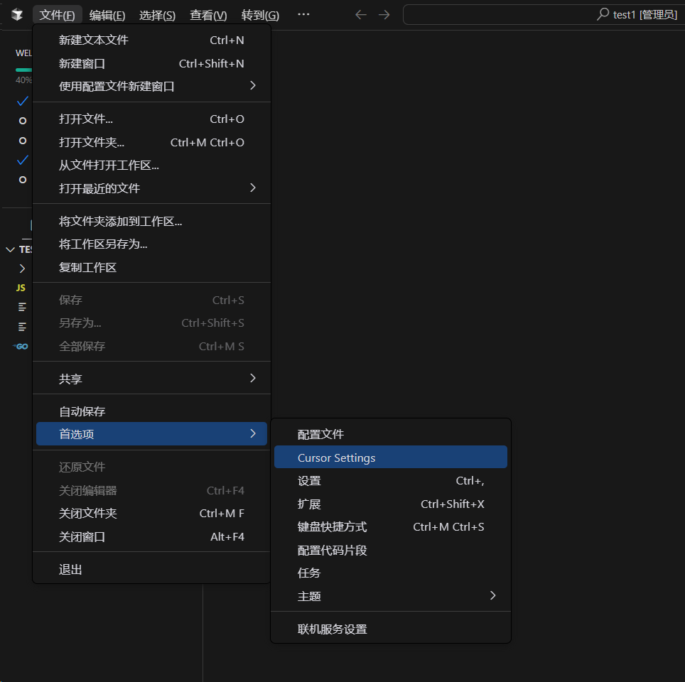

### 写入api
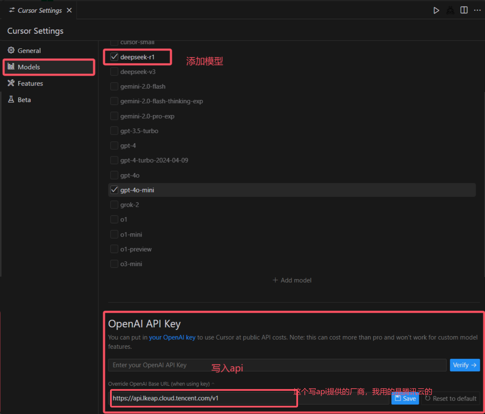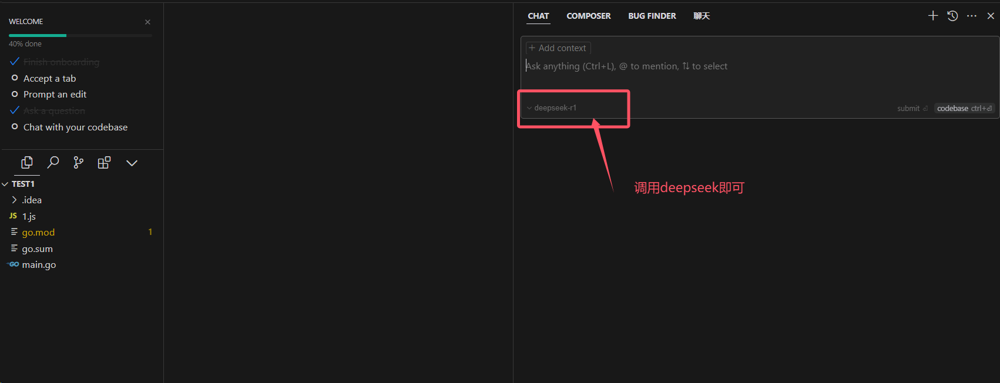

## 获取api
### 腾讯云（2025.2.25前api免费）
地址([https://console.cloud.tencent.com/lkeap](https://console.cloud.tencent.com/lkeap))

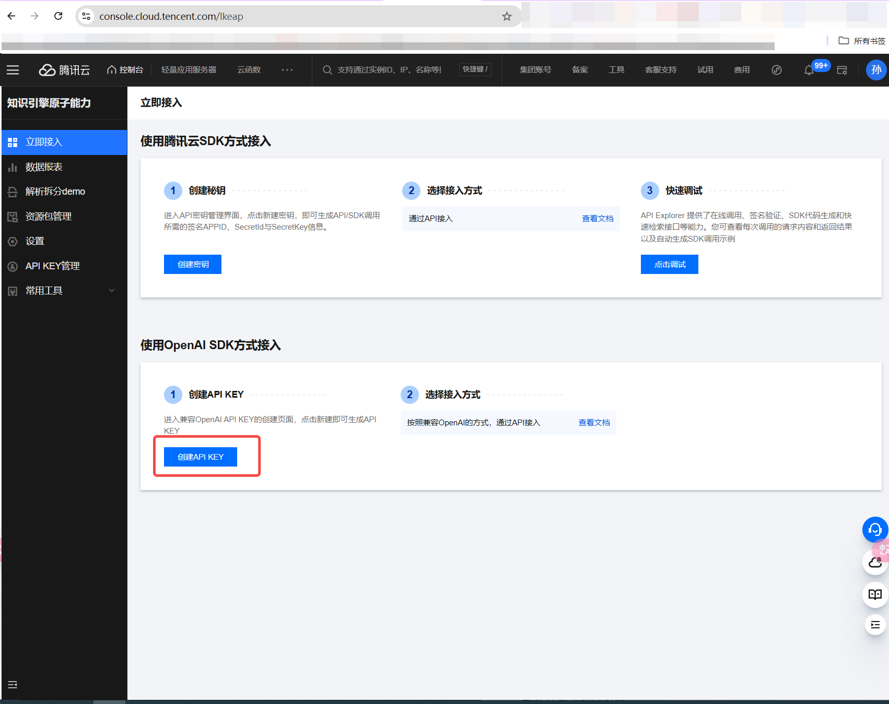

### 硅基流动（注册就送14块钱的token，约等于1400个对话）
注册地址([https://cloud.siliconflow.cn/i/PPetLNqx](https://cloud.siliconflow.cn/i/PPetLNqx))

## 项目一
### 后端接口
1. 提前配置好环境
2. 让ds生成代码

```plain
现在的环境是go需要你用gin框架帮我写三个接口 第一个是用户名密码注册第二个是用户名密码登录(需要返回 用户信息)第三个是根据用户id查询用户信息。
我的数据库连接方式是:127.0.0.1:3306,root,root
以当前目录为根目录需要执行命令的时候请告诉我让我来执行
```

3. 根据ds的指引，依次应用ds给出的文件内容和命令  
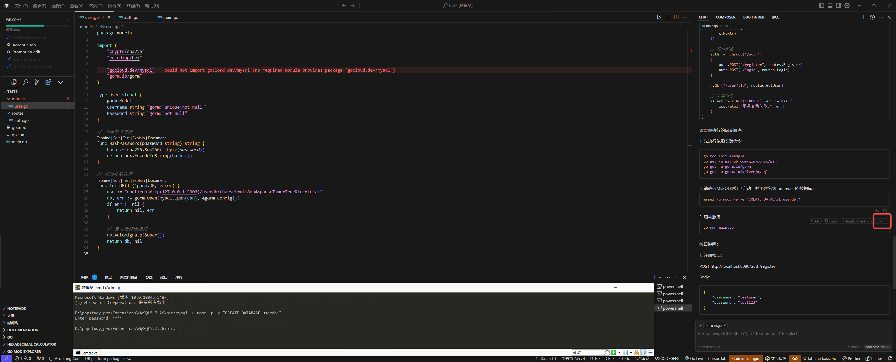
4. 根据ds的指引，生成curl测试接口的指令

```plain
生成curl测试用例并告诉我成功与不成功的返回值
```

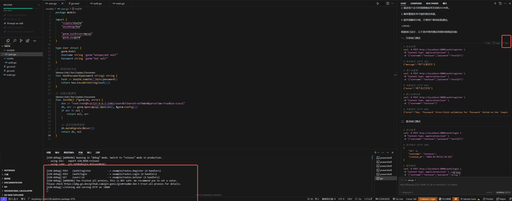

5. 执行curl命令，验证接口，后端接口就此完成

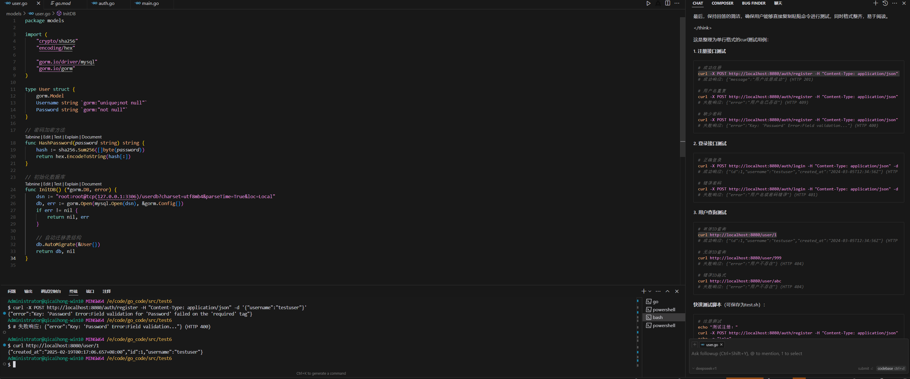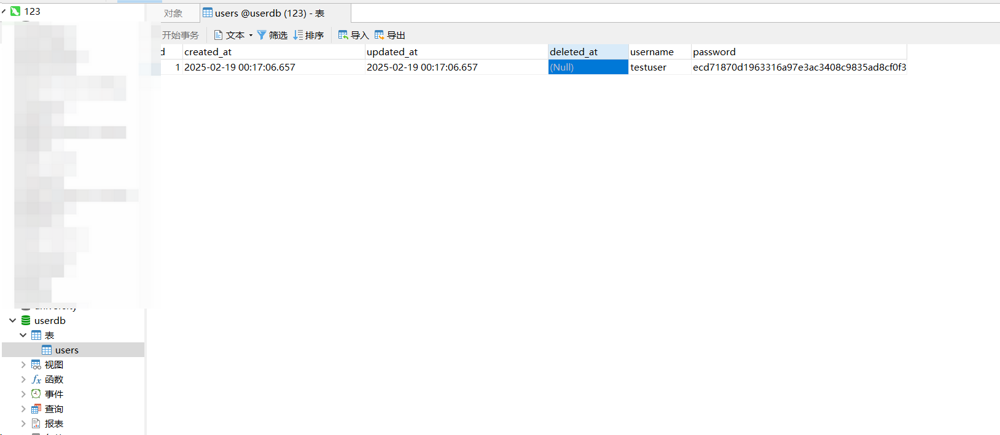

### 前端编写
#### 先用脚手架生成一个vue项目
```plain
npm create vue@latest
```

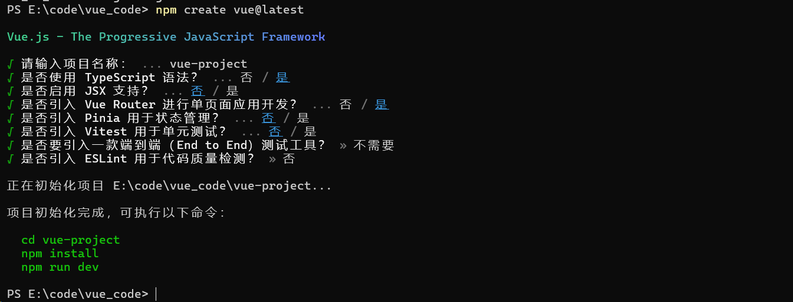

#### 新建一个项目，将登录界面丢给ds。让其进行生成


```plain
这是一个vue项目已经初始化完毕了帮我生成一个登陆页和一 个主页登陆页按照这个图片一比一还原主页需要一句欢迎语就 可以。使用vue router。
以当前目录为根目录需要执行命令的时候请告诉我让我来执行
```

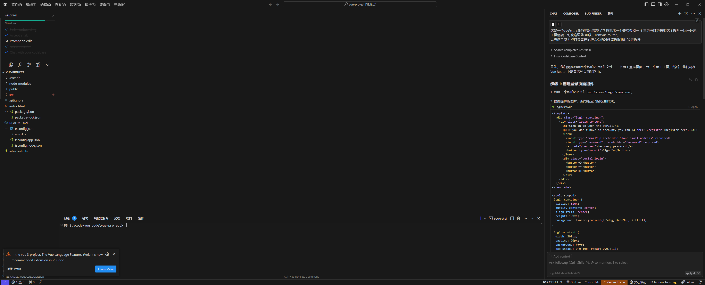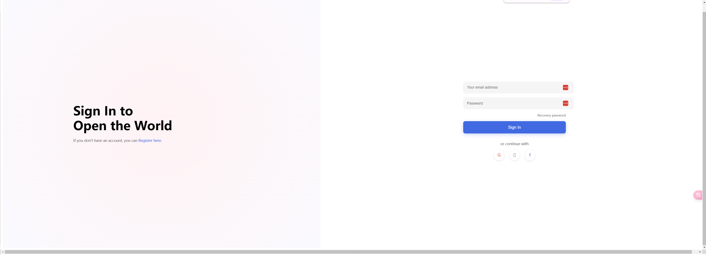

#### 发送后端的测试命令，生成前端对应的代码
```plain
# 成功注册
curl -X POST http://localhost:8080/auth/register -H "Content-Type: application/json" -d '{"username":"testuser","password":"test123"}'
# 成功响应: {"message":"用户注册成功"} (HTTP 201)

# 用户名重复
curl -X POST http://localhost:8080/auth/register -H "Content-Type: application/json" -d '{"username":"testuser","password":"test123"}'
# 失败响应: {"error":"用户名已存在"} (HTTP 409)

# 缺少密码
curl -X POST http://localhost:8080/auth/register -H "Content-Type: application/json" -d '{"username":"testuser"}'
# 失败响应: {"error":"Key: 'Password' Error:Field validation..."} (HTTP 400)
# 正确登录
curl -X POST http://localhost:8080/auth/login -H "Content-Type: application/json" -d '{"username":"testuser","password":"test123"}'
# 成功响应: {"id":1,"username":"testuser","created_at":"2024-03-05T12:34:56Z"} (HTTP 200)

# 错误密码
curl -X POST http://localhost:8080/auth/login -H "Content-Type: application/json" -d '{"username":"testuser","password":"wrong"}'
# 失败响应: {"error":"用户名或密码错误"} (HTTP 401)
# 有效ID查询
curl http://localhost:8080/user/1
# 成功响应: {"id":1,"username":"testuser","created_at":"2024-03-05T12:34:56Z"} (HTTP 200)

# 无效ID查询
curl http://localhost:8080/user/999
# 失败响应: {"error":"用户不存在"} (HTTP 404)

# 错误ID格式
curl http://localhost:8080/user/abc
# 失败响应: {"error":"用户不存在"} (HTTP 404)
# 注册测试
echo "测试注册："
curl -X POST http://localhost:8080/auth/register -H "Content-Type: application/json" -d '{"username":"testuser","password":"test123"}'
echo -e "\n\n"

# 登录测试
echo "测试登录："
curl -X POST http://localhost:8080/auth/login -H "Content-Type: application/json" -d '{"username":"testuser","password":"test123"}'
echo -e "\n\n"

# 查询测试
echo "测试查询："
curl http://localhost:8080/user/1
```

[vue-project.zip](https://www.yuque.com/attachments/yuque/0/2025/zip/26698826/1739899799686-25cb1271-7f26-468a-aac1-2e9d600f96d3.zip)                [test6.zip](https://www.yuque.com/attachments/yuque/0/2025/zip/26698826/1739899696401-51e8f697-93fa-42fa-bbb1-501b82531fa3.zip)  
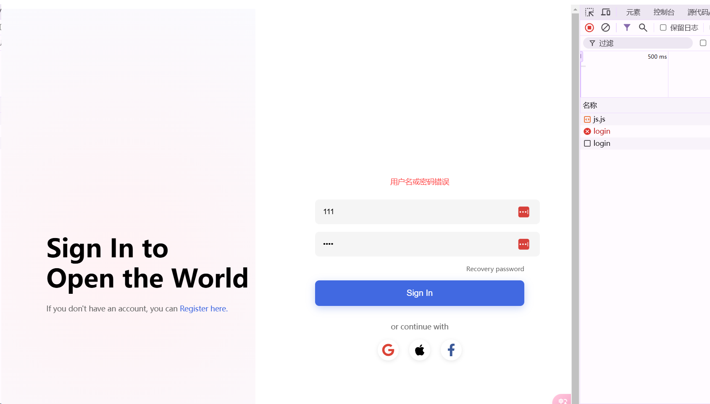

