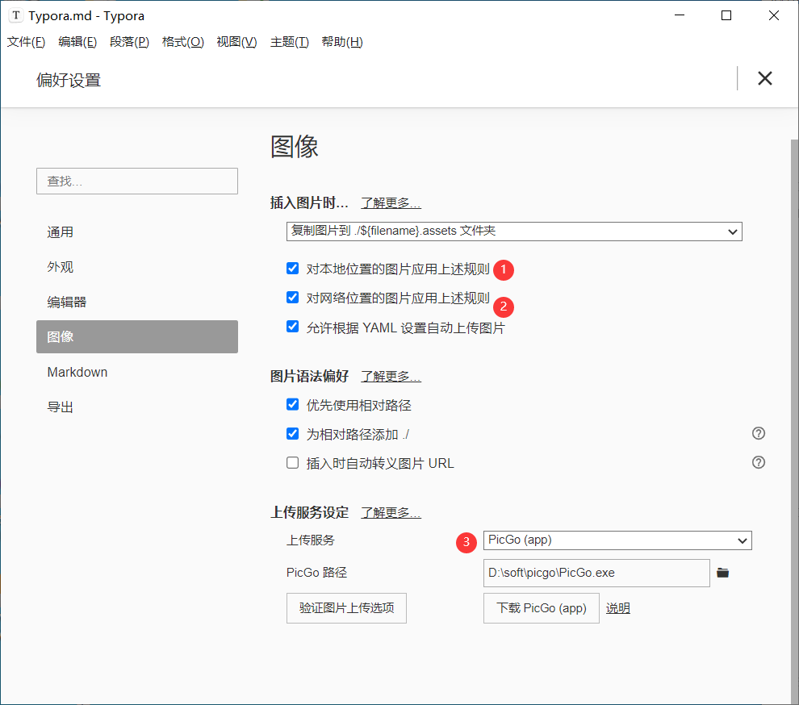
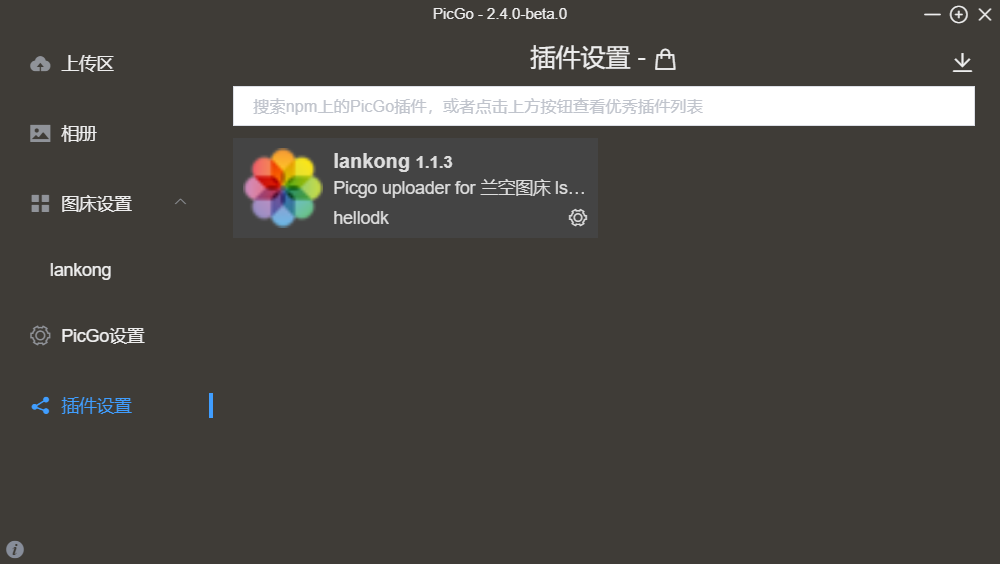
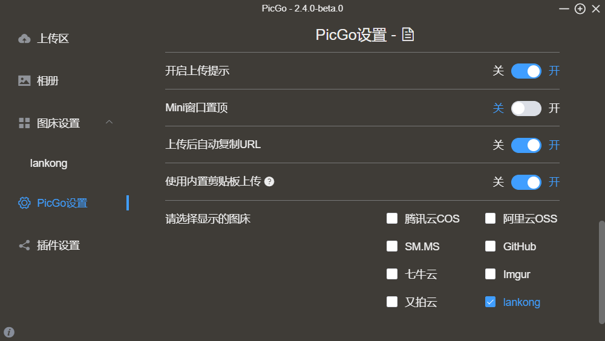
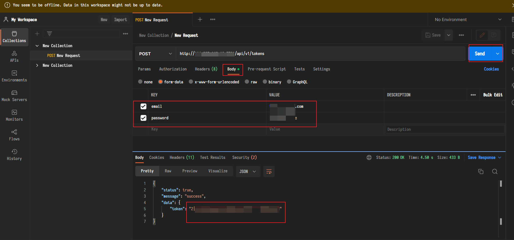
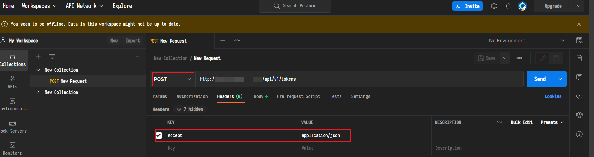
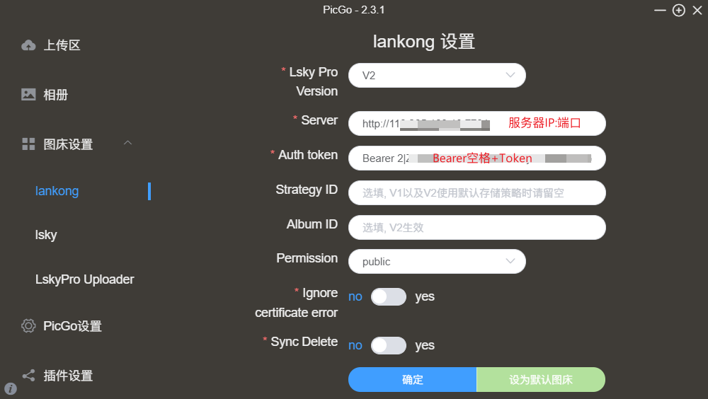
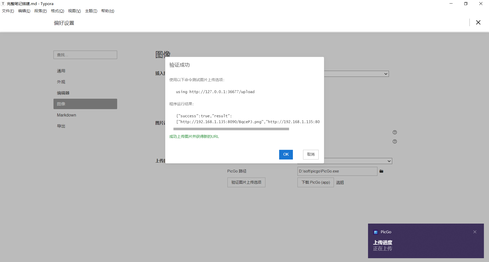
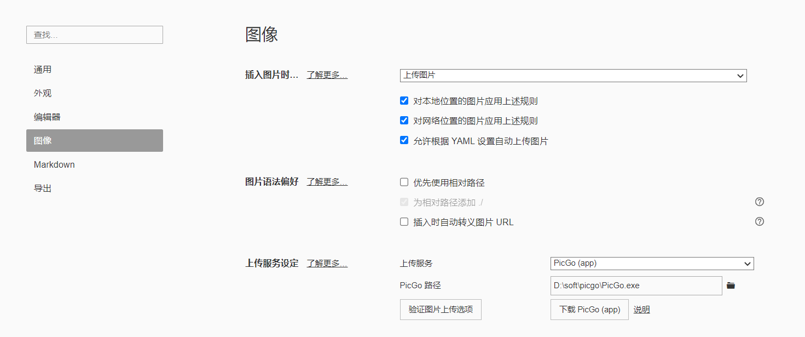
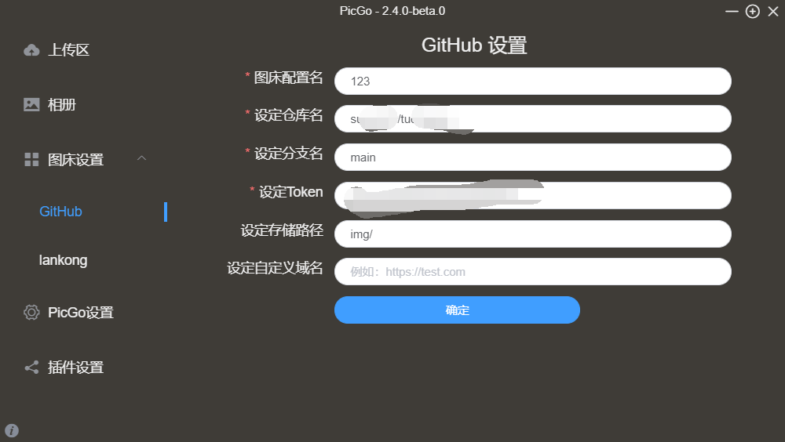

# typora+PicGo+LskyPro(github)+Obsidian


# 介绍


1. typora是一个Markdown格式的编辑器
2. PicGo是一个自动上传图片到图床的工具
3. LskyPro是一个图床
4. Obsidian是一个.md文档整理关联工具


# 参考链接


1. [Lsky Pro搭建](https://blog.csdn.net/xbd_zc/article/details/129423825)
2. [Lskypro搭建](https:_www.tqwba.com_x_d_jishu_1210032)
3. [Lsky Pro-V2-tocken获取](https://cloud.tencent.com/developer/article/2082694)
4. [typora自动上传图片](https://blog.csdn.net/qq_33957967/article/details/124572413)
5. [PicGo官网](https://molunerfinn.com/PicGo/)
6. [PicGo手册](https://picgo.github.io/PicGo-Doc/zh/guide/config.html#%E7%A6%BB%E7%BA%BF%E5%AE%89%E8%A3%85)
7. [整体流程少一截](https://blog.csdn.net/qq_33957967/article/details/124572413)
8. [功能介绍](https://www.bilibili.com/video/BV1xq4y1m7es)


# 搭建


## 图片上传的整体思路


1. typora向本地的36677端口发送图片上传的请求
2. PicGo默认监听本地36677端口，并将监听的数据以接口的形式发送到，指定Lskypro所在的图床，返回一个链接


## 搭建流程


1. 下载并安装[node.js](https://nodejs.org/en)
2. 下载并安装[PicGo](https://molunerfinn.com/PicGo/)
3. typora-偏好设置  

4. 利用docker搭建skyPro


```plain
docker run -d --name lsky -p 8090:80 -v /var/project/lsky:/var/www/html halcyonazure/lsky-pro-docker:latest
```


数据库方面可以选sqite  
5. 在PicGo中安装lankong 1.1.3  
  



6.  利用postman获取tocken  
  
获得tocken "x|xxxx……xx" 
7.   
8.  typora进行测试 





图片上传成功即可





改成这样即可成功，图片自动上传到图床


## 如果不想用自建的图床可以换成github图床


1. 上传前将picgo设置为时间戳重命名  

2. 具体操作看


[External Player - 哔哩哔哩嵌入式外链播放器](https://player.bilibili.com/player.html?bvid=BV1Ui4y1x7Cq&autoplay=0)


3. 


如果条件支持，建议在picgo上面设置代理，[http://127.0.0.1](http://127.0.0.1):xxxxx

