该漏洞点发生在一个小程序中，这个小程序没什么功能点，普通人一看可能就马上走了。我看了一眼也马上想走了，为啥？因为没功能点啊，没功能点打个锤子哦

      但是我这个人有个习惯，在每次渗透测试前我都会打开一个burpsuit抓包工具中的小开关。就是因为以下这个小细节助我拿下了这个高危以上的云存储桶接管漏洞。大伙可以看需求是否开启这个开关哈

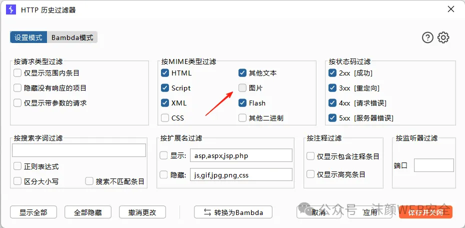

      没错！就是这个图片开关，默认是关闭状态，将其打开就能看到页面上所加载的图片链接。

      这里我们需要知道一个知识，网页上每一个页面的图像要想显示出来被我们电脑所看到，它就得被我们有网络的电脑所加载，不然我们肯定就看不到这张图片对吧？

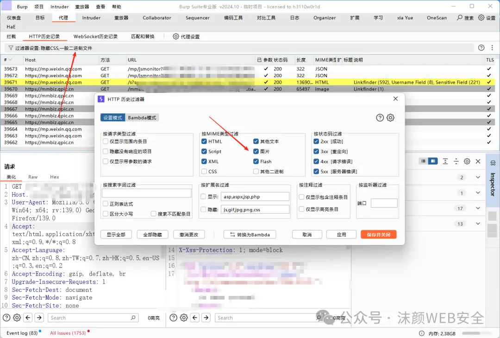

漏洞实战过程复现

很简单，打开小程序，因为看了一眼没啥功能点，直接观察加载的数据包，发现了这几个图片加载的链接（主要是我看到了minio引起了我的注意哈哈）

```plain
https://minio-xxx.qiye.com/img-uploads/1a2b3c-1a2b3c-1a2b3c-1a2b3c-1a2b3c.jpg
```

记住，看到minio那肯定和云存储有点关系了。

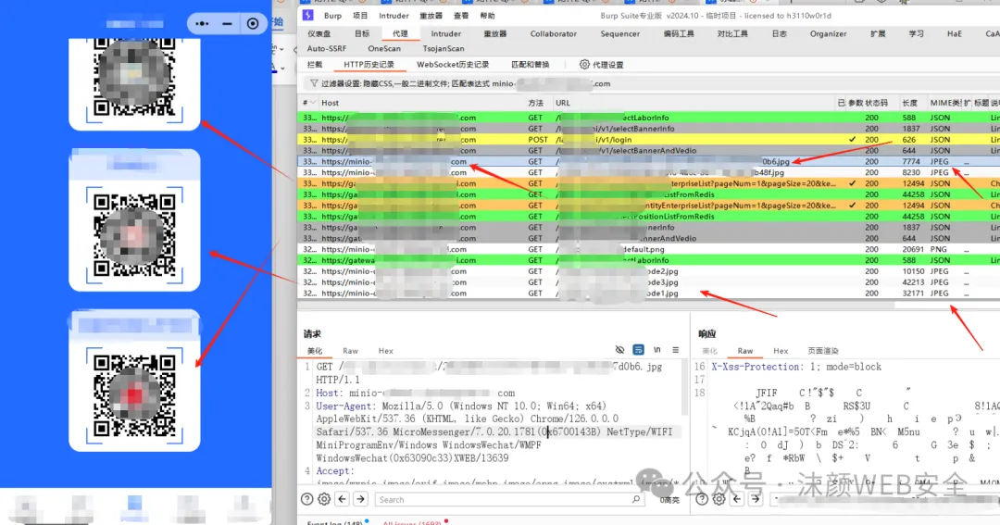

# List Objects（列出桶内该目录下所有对象）
    复制图片放入浏览器加载，删除最后图片路径，从后往前一级一级目录删，有可能在某级目录就会列桶，发现访问https://minio-xxx.qiye.com/img-uploads/成功列桶！！这时候还不是在根目录下列出，危害还不是最大化。

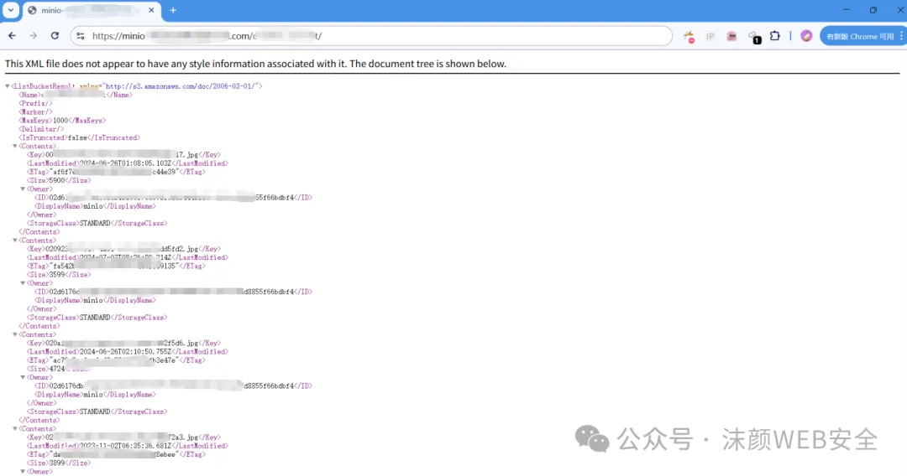

# GET Objects（从桶（Bucket）中获取对象（Object）数据）
    复制列出的<key>xxxxxx.xslx</key>值拼接到目录后面发现直接可以获取下载

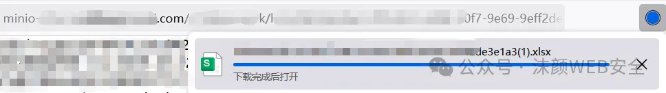

    经过多次测试发现大量身份证文件，其中一个xlsx文档中涵盖所有用户身份证。

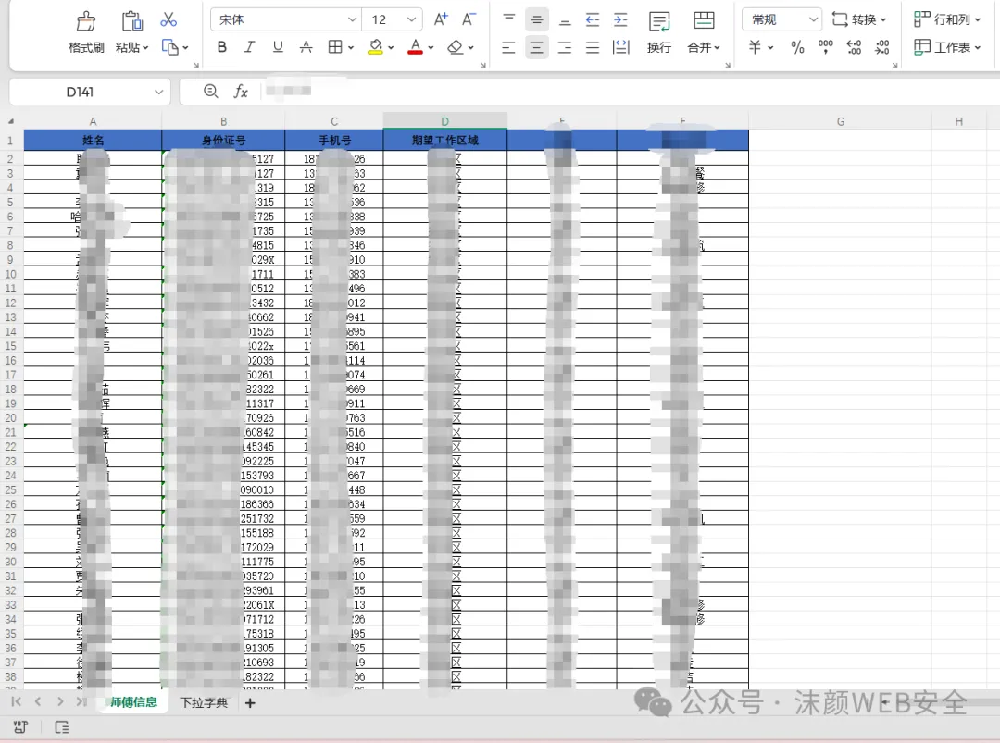

这里我直接用OSS云存储桶遍历工具（OSSFileBrowse）直接查看寻找身份证等敏感信息相对一个一个下载比较的方便

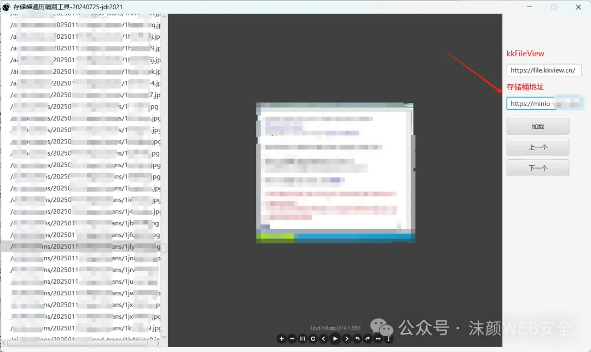

发现身份证敏感信息后就可以访问下载下来

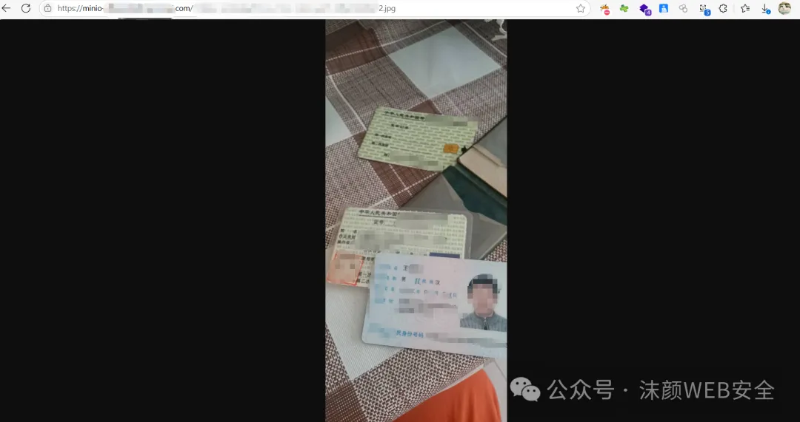

# PUT Object（向桶（Bucket）中上传或存储对象）
    测试是否能匿名用户PUT任意文件上传覆盖，发现可以，返回状态码200表示上传成功。

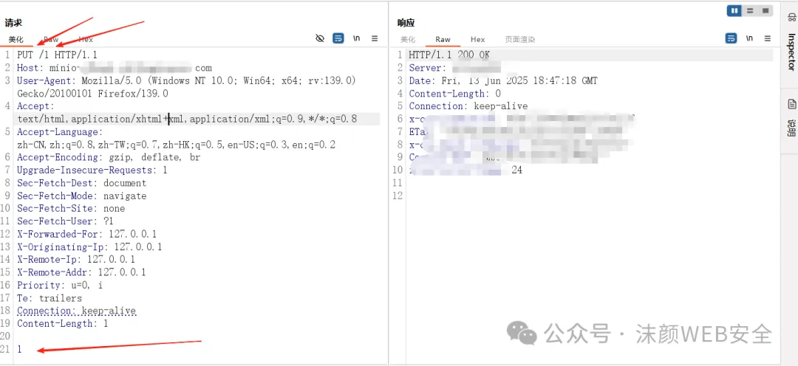

    访问上传内容为1的/1文件验证是否上传成功，访问成功下载，证明已经上传成功，可进行任意文件上传覆盖。


打开查看内容为1

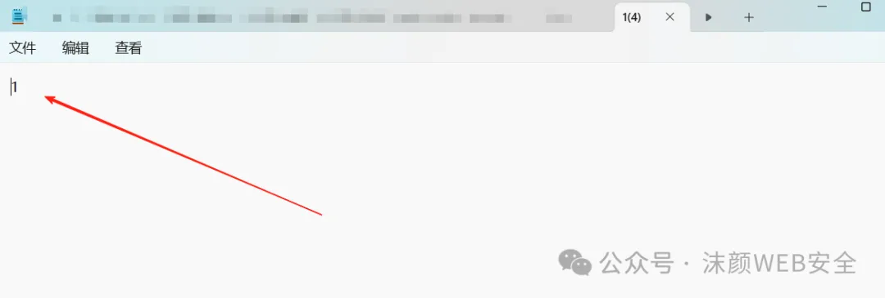

    到这其实就已经高危了，加上大量的身份证信息甚至发展到严重漏洞。

信息越多，危害越大。危害越大，评级越高。低、中、高和严重都有可能。

# PUT Policy（控制上传权限）
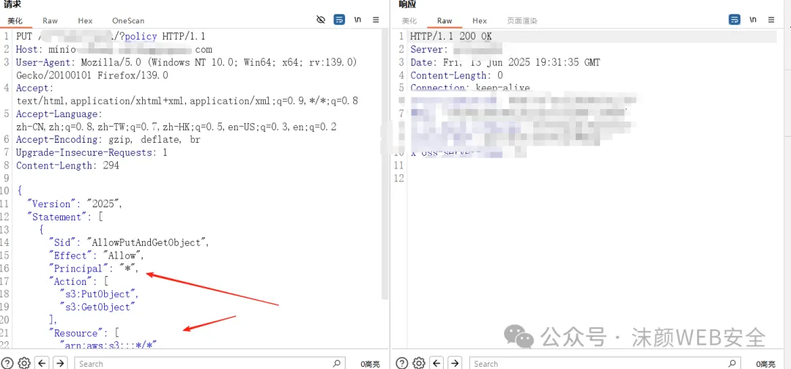

PUT上传构造好的身份的访问控制（IAM）策略，将权限给到根目录下（"arn:aws:s3:::*/*"），以及授予所有人权限访问（"Principal": "*"），这里也可以设置单独授权自己的id进行访问、上传等操作。

```plain
PUT /img-uploads/?policy HTTP/1.1
Host: minio-xxx.xxx.com
User-Agent: Mozilla/5.0 (Windows NT 10.0; Win64; x64; rv:139.0) Gecko/20100101 Firefox/139.0
Accept: text/html,application/xhtml+xml,application/xml;q=0.9,*/*;q=0.8
Accept-Language: zh-CN,zh;q=0.8,zh-TW;q=0.7,zh-HK;q=0.5,en-US;q=0.3,en;q=0.2
Accept-Encoding: gzip, deflate, br
Upgrade-Insecure-Requests: 1
Content-Length: 288

{
  "Version": "2012-10-17",
  "Statement": [
    {
      "Sid": "AllowPutAndGetObject",
      "Effect": "Allow",
      "Principal": "*",
      "Action": [
        "s3:PutObject",
        "s3:GetObject"
      ],
      "Resource": [
        "arn:aws:s3:::*/*"
      ]
    }
  ]
}
```

#### 关键字段解析：
1. Version: 策略语言版本，通常为`2012-10-17`  

2. Effect: 权限效果，`Allow`表示允许执行指定操作
3. Principal: 允许访问的主体，`*`表示所有用户，包括匿名用户
4. Action: 允许执行的操作
    - `s3:PutObject`: 上传对象（写入权限）
    - `s3:GetObject`: 下载对象（读取权限）
5. Resource

: 策略作用的资源范围

    - `arn:aws:s3:::*/*`

: 所有存储桶中的所有对象（根目录）

# 再次List Objects（列出根目录下的所有对象）
现在就能列出根目录桶下的所有<key></key>值，最后想再扩大危害到最大的话可以再找一些敏感信息。

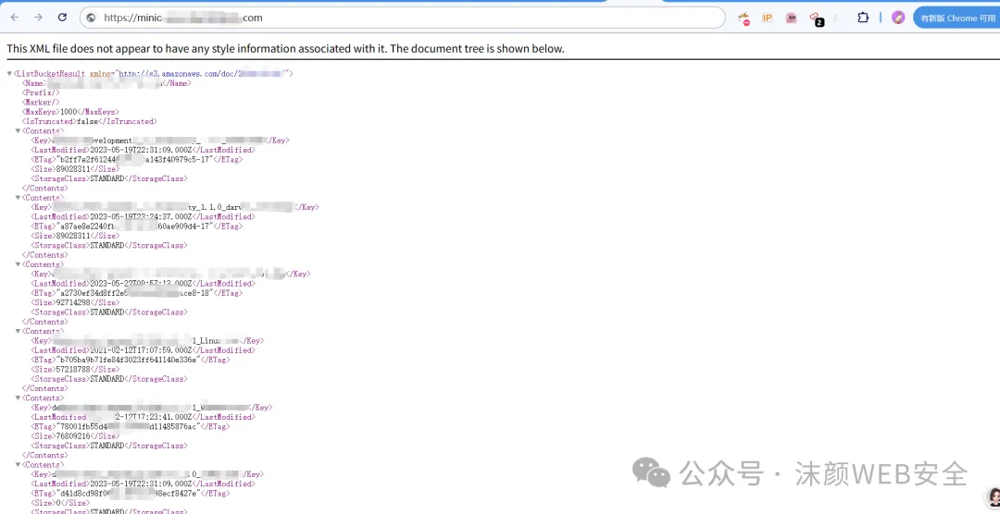

# 最后路径中有minio，顺便打一下minio的信息泄露
`/minio/bootstrap/v1/verify`成功获取敏感数据


