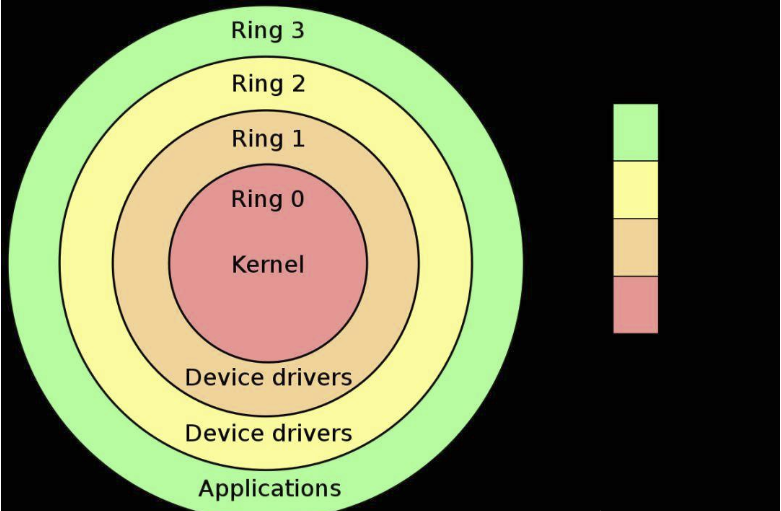
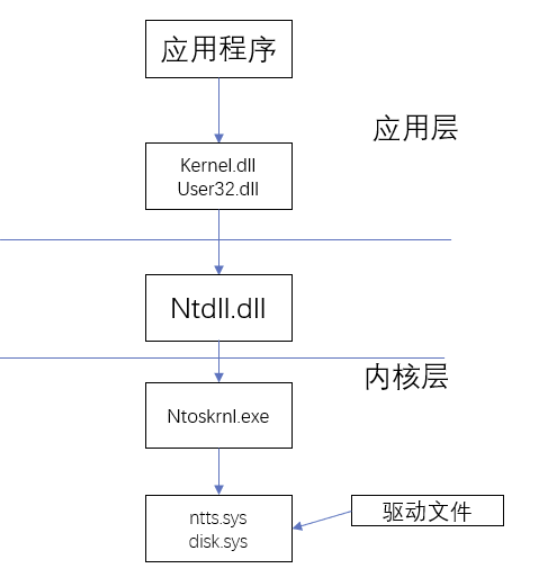

# 免杀
## 杀软介绍


### 报警层级


1. 正常
2. 可疑
3. 恶意


### 查杀方式


#### 静态查杀


1. 正则规则匹配(virtualalloc，rtlmovememory，ntcreatthread，shellcode，指令，名字等)
2. 汇编的控制流结构
3. 解释型语言下的cnn


#### 动态查杀


1. 对进程和命令的识别(下载、加密、cmd、powershell、wmi、psexec、bitsadmin、rundll)


+ 添加，删除，修改等操作**文件夹：**
+ 开机自启目录
+ tmp目录等


2. [对函数的调用](https://blog.csdn.net/qq_33526144/article/details/103503011)
3. 沙箱识别  
沙盒：也叫启发式查杀，通过模拟计算机的环境执行目标文件再观察特征行为


+  内存较小-》不影响计算机正常运行 
+  时间较快-》沙盒内置的时间速度比现实世界要快，提高查杀速度 
+  进程或文件不完整-》减少杀毒软件运行时对计算机的消耗：a.dll 
+  io设备缺失-》鼠标键盘等事件大部分沙盒都没有 
+  外网 


## 杀软监测机制(摘自[先知社区](https://xz.aliyun.com/t/11496))


`net.exe user abc 123 /add`


cmd- hook(某绒)->net.exe(System32/net.exe)    -- HOOK(某绒程序)>    net1.exe  --HOOK(某60程序)>  Kernel32.dll --> NTDLL.dll--> sysCall系统调用 -- > 内核(r0)


系统核心态指的是RO，用户态指的是R3，系统代码在核心态下运行，用户代码在用户态下运行。系统中一共有四个权限级别，R1和R2运行设备驱动，RO到R3权限依次降低，RO和R3的权限分别为最高和最低.





在用户态运行的系统要控制系统时，或者要运行系统代码就必须取得R0权限。用户从R3到R0需要借助ntdll.dll中的函数，这些函数分别以“Nt”和“Zw”开头，这种函数叫做Native API，下图是调用过程：





## 免杀思路


1. 寻找特点
2. 思考可替换的方法
3. 尝试代码


## 常见方式


### 源码免杀


1. 二开远控


### 加载器免杀


#### shellcode混淆


#### 分离免杀


1.  函数替换 
2.  aes/des 
3.  uuid 
4.  mac 
5.  隐写 
6.  异或 
7.  编码 
8.  远程加载(smb\ftp\https\区块链\tcp\grpc……) 


#### 反沙箱


1. 检测


#### 反调试


```c
#include <windows.h>
#include <stdio.h>
BOOL CheckDebug() {
    BOOL ret;
    CheckRemoteDebuggerPresent(GetCurrentProcess(), &ret);
    return ret;
    // return IsDebuggerPresent();
}
int main() {
    if (CheckDebug()) {
        printf("Debugger is present\n");
    }
    else {
        printf("Debugger is not present\n");
    }
}
```


1. CheckRemoteDebuggerPresent
2. IsDebuggerPresent
3. &debugPort
4. GetLastError() != ERROR_INVALID_HANDLE     //用户态，由于调试器会接管所有报错，不论是否出现
5. *KdDebuggerEnable                //内核态过wingdb
6. _stricmp(pe32.szEXeFile , "calc.exe")    ==0      //检测任务栏标题  

7. 利用汇编或驱动下断点
8. veil-evasion


#### 加壳


upx  
vmp


veil-evasion


建议跳过前一个小时


