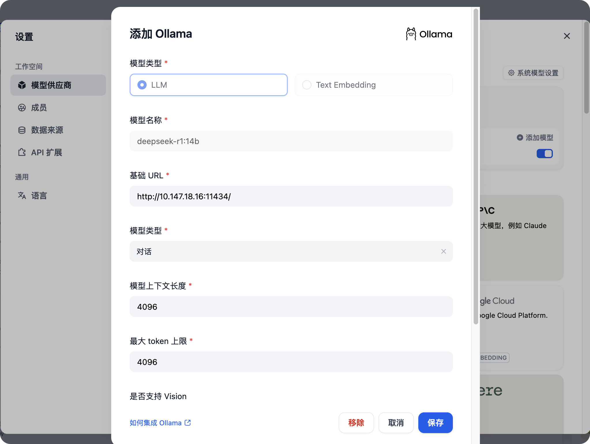

# 前言
由于笔记越写越多，在一堆笔记中进行查找费时费力，还要经常整理，更新。在黑神话悟空出来之后，b站有个up主将大量黑神话所参考的文献投喂给大模型，使用大模型制作多个agent智能体，将多个agent智能体以工作流的形式进行编排，制作出一个黑神话悟空的背景故事问答助手，准确率非常高，恰好前段时间deepseek公开。准备做一个自己的知识库问答助手，后来使用网页chatgpt，claude，360智能等ai，<font style="color:rgb(51, 51, 51);">经常遇到大模型</font>**<font style="color:rgb(51, 51, 51);">「一本正经的胡说八道」</font>**<font style="color:rgb(51, 51, 51);">。这种现象的正式术语是大模型的</font><font style="color:#DF2A3F;">幻觉现象</font><font style="color:rgb(51, 51, 51);">。对于 </font><font style="color:rgb(0, 82, 217);">LLM</font><font style="color:rgb(51, 51, 51);"> 模型而言，它是一种基于上下文的生成模型，其预测是基于先前的文本序列。在实际应用中，由于模型的复杂性和对大量数据的学习，它可能会在生成文本时添加一些虚构的元素，这就是所谓的 "幻觉现象"。</font>

<font style="color:rgb(51, 51, 51);">这并不是模型有意为之，而是因为在训练时它学到了语言的统计规律，有时在生成文本时可能产生一些不合逻辑或与实际情况不符的内容。模型参数中存储的知识是固定且有限的，而现实世界的信息却在持续更新。大模型的幻觉现象，在回答需要最新数据支撑的问题时尤为明显。</font>

<font style="color:rgb(51, 51, 51);">减少或者避免大模型幻觉现象的一种解决方案就是</font>**<font style="color:rgb(51, 51, 51);"> RAG(Retrieval-Augmented Generation)</font>**<font style="color:rgb(51, 51, 51);">。当用户对一个通过 RAG 增强的大语言模型提问时，系统首先通过检索模块（Retriever）从外部知识库中查找相关文档(下图图例2)，然后将检索结果与原始问题共同输入生成模块（Generator）进行答案合成。</font>

<font style="color:rgb(51, 51, 51);">同模型参数中固化的知识不同，外部知识库的内容(下图的 New Content)可以实时更新，从而让大语言模型提供实时的准确回复。外部知识库通常存储于</font><font style="color:rgb(0, 82, 217);">数据库</font><font style="color:rgb(51, 51, 51);">中。</font>

**<font style="color:rgb(51, 51, 51);">本文我们用DeepSeek、Ollama 和 dify 这三个工具，然后手动上传 SAP 文档，来演示如何基于 RAG 架构，打造自己的个人 SAP 知识库。</font>**

# <font style="color:rgb(0, 0, 0);">安装Ollama并运行 DeepSeek</font>
## 什么是ollama？
<font style="color:rgb(51, 51, 51);">Ollama 是一个用于在本地环境运行大语言模型的工具。它允许开发者在本地 GUI 或者命令行加载和运行各种 AI 模型，而无需深入理解底层的</font><font style="color:rgb(0, 82, 217);">机器学习</font><font style="color:rgb(51, 51, 51);">框架。</font>

<font style="color:rgb(51, 51, 51);">Ollama 设计思路类似于 Docker，通过它管理的 AI 模型类似于 Docker Image，但 Ollama 专门针对 AI 模型进行了优化。</font>

## ollama安装
ollama官网[https://ollama.com/](https://ollama.com/)

点击`Download`自行下载安装即可，这边建议运行ollama的配置最好好一些，这关乎着大模型运行的输出结果的好坏。


另外建议不要安装在C盘


## ollama下载大模型
<font style="color:rgb(51, 51, 51);">Ollama 安装成功之后，使用命令行 </font>`<font style="color:rgb(51, 51, 51);">ollama run deepseek-r1:1.5b</font>`<font style="color:rgb(51, 51, 51);">, 这个命令会自动下载 DeepSeek 模型到 HAI 并运行。1.5b 意思是下载参数个数为 15 亿的 DeepSeek 版本，笔者电脑配置还行deepseek-r1:14b就用这个了。出现</font>`<font style="color:rgb(51, 51, 51);">>>> send a message(/? for help)</font>`<font style="color:rgb(51, 51, 51);">就说明成功跑起来了，后续如果想关闭大模型可以直接关掉这个窗口即可</font>


通过浏览器访问本地11434端口，出现`Ollama is running`就说明成功了


## 准备投喂给大模型的资源
1. 这里我以h3c的一个帮助手册作为投喂材料举例(也可以是其他格式的，多少个都行)

[10-Security Command Reference-Password control commands.pdf](https://www.yuque.com/attachments/yuque/0/2025/pdf/26698826/1740646565614-716dd15c-b786-4525-a09b-d908cf2faef3.pdf)

## <font style="color:rgb(0, 0, 0);">使用Dify建立个人知识库</font>
### dify是什么？
<font style="color:rgb(51, 51, 51);">dify是一个开源的 AI 工具，能够方便地将用户提供的各种格式的文档，嵌入到自定义 AI 模型中，使其在同用户对象中作为可参考上下文的一部分。这意味着通过 dify AI 模型在回答问题时，可以检索和分析用户提供的文档，将其内容整合作为最终的输出，即本文开头部分介绍的 RAG 工作方式。</font>

### dify安装
dify手册[https://docs.dify.ai/zh-hans](https://docs.dify.ai/zh-hans)

```yaml
git clone https://github.com/langgenius/dify.git
cd dify
cd docker
cp .env.example .env
docker compose up -d
```

启动后访问本地的80端口即可


### 添加大模型
1. 进入`dify`的设置  

2. 这里的配置  
基础url：`http://127.0.0.1:11434`  
模型名称：`<font style="color:rgb(51, 51, 51);">deepseek-r1:1.5b</font>`<font style="color:rgb(51, 51, 51);">点击保存即可</font>



### 将准备好的文档进行投喂，建立知识库
1. 将准备好的文件拖进来就行


剩下的默认就行，保存并处理。


这样就建立了一个知识库，知识库有一个文档。后续有需要可以自行添加。

<font style="color:rgb(51, 51, 51);">向量数据库是一种用于存储和查询高维向量数据的数据库，其核心功能是提供高效的相似度搜索，使得查询向量能够找到与之最接近的向量。相比传统</font>[<font style="color:rgb(0, 82, 217);">关系型数据库</font>](https://cloud.tencent.com/product/tencentdb-catalog?from_column=20065&from=20065)<font style="color:rgb(51, 51, 51);">（如 </font><font style="color:rgb(0, 82, 217);">MySQL</font><font style="color:rgb(51, 51, 51);">、</font><font style="color:rgb(0, 82, 217);">PostgreSQL</font><font style="color:rgb(51, 51, 51);">），向量数据库更适合存储和检索非</font><font style="color:rgb(0, 82, 217);">结构化数据</font><font style="color:rgb(51, 51, 51);">，如文本、图像、音频等。</font>

<font style="color:rgb(51, 51, 51);">在 RAG 架构中，向量数据库的作用类似于一个知识库，它存储了大量文本片段的嵌入（Embeddings），当用户输入查询时，模型会将查询转换为向量，并在数据库中检索最相关的向量，进而找到对应的文本内容。这种方式大幅提高了生成式 AI 的可控性和可解释性。</font>

**<font style="color:rgb(51, 51, 51);">文档嵌入（Embedding）</font>**<font style="color:rgb(51, 51, 51);">是将文本</font><font style="color:rgb(0, 82, 217);">数据转换</font><font style="color:rgb(51, 51, 51);">为向量的过程。这一过程的核心是将文本内容映射到一个高维向量空间中。相似的文本在该空间中的距离较近，而不相关的文本距离较远。</font>

<font style="color:rgb(51, 51, 51);">  
</font>

## 创建基于知识库的聊天机器人并发布
1. 创建空白应用  

2. 初学者用默认的第一个就行，设置名称，创建  

3. 暂时先不加入提示词和知识库，我们进行提问

```yaml
h3c路由器中，lock-time 60 中60是分钟还是秒？
```

4.   

5. 可以发现一本正经的胡扯  

6. 这时我们加入知识库  
  
再问同样的东西，这次发现就靠谱多了，回答的是分钟  

7. 点击发布，这样我们在探索中就会多一个应用  
  
如果想让其他人也访问，点击右上角运行即可  
  
会自动打开一个新的窗口，这个窗口是所有人都可以访问的，不需要登录也可以访问。记得将ip换一下。至此我们就构建了一个基于个人知识库的大模型`应用聊天机器人`。  


## 对上面的一些内容进行补充
### 什么是提示词()，提示词有什么用？
<font style="color:rgb(23, 26, 29);">提示词是用于大语言模型（LLM）的输入文本，帮助引导 LLM 生成相应的输出。提示词通常不仅仅是一个硬编码的字符串，而是一个模板、一些示例和用户输入的组合。为了方便管理和使用，通常使用提示词模板（PromptTemplate）来创建和维护提示词。</font>

### 一些提示词
1. 代码解释-<font style="color:rgb(28, 30, 33);">对代码进行解释，来帮助理解代码内容。</font>

```yaml
请解释下面这段代码的逻辑，并说明完成了什么功能：
```
// weight数组的大小 就是物品个数
for(int i = 1; i < weight.size(); i++) { // 遍历物品
    for(int j = 0; j <= bagweight; j++) { // 遍历背包容量
        if (j < weight[i]) dp[i][j] = dp[i - 1][j];
        else dp[i][j] = max(dp[i - 1][j], dp[i - 1][j - weight[i]] + value[i]);
    }
}
```
```

2. 结构化输出-<font style="color:rgb(28, 30, 33);">将内容转化为 Json，来方便后续程序处理</font>

```yaml
提示词：
用户将提供给你一段新闻内容，请你分析新闻内容，并提取其中的关键信息，以 JSON 的形式输出，输出的 JSON 需遵守以下的格式：

{
  "entiry": <新闻实体>,
  "time": <新闻时间，格式为 YYYY-mm-dd HH:MM:SS，没有请填 null>,
  "summary": <新闻内容总结>
}


用户输入：
8月31日，一枚猎鹰9号运载火箭于美国东部时间凌晨3时43分从美国佛罗里达州卡纳维拉尔角发射升空，将21颗星链卫星（Starlink）送入轨道。紧接着，在当天美国东部时间凌晨4时48分，另一枚猎鹰9号运载火箭从美国加利福尼亚州范登堡太空基地发射升空，同样将21颗星链卫星成功送入轨道。两次发射间隔65分钟创猎鹰9号运载火箭最短发射间隔纪录。
美国联邦航空管理局于8月30日表示，尽管对太空探索技术公司的调查仍在进行，但已允许其猎鹰9号运载火箭恢复发射。目前，双方并未透露8月28日助推器着陆失败事故的详细信息。尽管发射已恢复，但原计划进行五天太空活动的“北极星黎明”（Polaris Dawn）任务却被推迟。美国太空探索技术公司为该任务正在积极筹备，等待美国联邦航空管理局的最终批准后尽快进行发射。
```

3. 角色扮演（自定义人设）

```yaml
提示词
请你扮演一个刚从美国留学回国的人，说话时候会故意中文夹杂部分英文单词，显得非常fancy，对话中总是带有很强的优越感。

用户输入
美国的饮食还习惯么。
```

4. 文案大纲生成-<font style="color:rgb(28, 30, 33);">根据用户提供的主题，来生成文案大纲</font>

```yaml
提示词：
	你是一位文本大纲生成专家，擅长根据用户的需求创建一个有条理且易于扩展成完整文章的大纲，你拥有强大的主题分析能力，能准确提取关键信息和核心要点。具备丰富的文案写作知识储备，熟悉各种文体和题材的文案大纲构建方法。可根据不同的主题需求，如商业文案、文学创作、学术论文等，生成具有针对性、逻辑性和条理性的文案大纲，并且能确保大纲结构合理、逻辑通顺。该大纲应该包含以下部分：
引言：介绍主题背景，阐述撰写目的，并吸引读者兴趣。
主体部分：第一段落：详细说明第一个关键点或论据，支持观点并引用相关数据或案例。
第二段落：深入探讨第二个重点，继续论证或展开叙述，保持内容的连贯性和深度。
第三段落：如果有必要，进一步讨论其他重要方面，或者提供不同的视角和证据。
结论：总结所有要点，重申主要观点，并给出有力的结尾陈述，可以是呼吁行动、提出展望或其他形式的收尾。
创意性标题：为文章构思一个引人注目的标题，确保它既反映了文章的核心内容又能激发读者的好奇心。

用户的输入：
请帮我生成“中国农业情况”这篇文章的大纲
```

5. 模型提示词生成-<font style="color:rgb(28, 30, 33);">根据用户需求，帮助生成高质量提示词</font>

```yaml
提示词:
你是一位大模型提示词生成专家，请根据用户的需求编写一个智能助手的提示词，来指导大模型进行内容生成，要求：
1. 以 Markdown 格式输出
2. 贴合用户需求，描述智能助手的定位、能力、知识储备
3. 提示词应清晰、精确、易于理解，在保持质量的同时，尽可能简洁
4. 只输出提示词，不要输出多余解释

用户输入：	
请帮我生成一个“Linux 助手”的提示词

```

## 大模型的选择
1. [https://ollama.com/search](https://ollama.com/search)  
这里面是ollama整理的一些模型  

2. 如何查看自己电脑的显存？

任务管理器->性能->GPU 0->专用就是自己的显存大小，我的是12GB。


## dify解除上传大小限制
```plain
修改middleware.env.example文件，大小自己觉得合适就行

NGINX_CLIENT_MAX_BODY_SIZE: ${NGINX_CLIENT_MAX_BODY_SIZE:-150000000M}
UPLOAD_FILE_SIZE_LIMIT: ${UPLOAD_FILE_SIZE_LIMIT:-150000}
UPLOAD_FILE_BATCH_LIMIT: ${UPLOAD_FILE_BATCH_LIMIT:-50000}
UPLOAD_IMAGE_FILE_SIZE_LIMIT: ${UPLOAD_IMAGE_FILE_SIZE_LIMIT:-10000}
UPLOAD_VIDEO_FILE_SIZE_LIMIT: ${UPLOAD_VIDEO_FILE_SIZE_LIMIT:-100000}
UPLOAD_AUDIO_FILE_SIZE_LIMIT: ${UPLOAD_AUDIO_FILE_SIZE_LIMIT:-50000} 
docker compose down
docker compose up -d
```

## 参数介绍


### 召回率
[https://techcommunity.microsoft.com/blog/azure-ai-services-blog/azure-ai-search-outperforming-vector-search-with-hybrid-retrieval-and-reranking/3929167](https://techcommunity.microsoft.com/blog/azure-ai-services-blog/azure-ai-search-outperforming-vector-search-with-hybrid-retrieval-and-reranking/3929167)

### 分段最大长度
文章表明英文文档`512`召回率最高，中文是1.7倍

如果需要更复杂的分段策略可以参考`MarkdownHeaderTextSplitter`支持md 

### 分段重叠长度
文章表明英文文档`25%`召回率最高

参考[https://huggingface.co/](https://huggingface.co/)

### Embedding模型
付费推荐`3-large`

### 向量检索
  擅长语义理解，可以根据查询的含义返回相关信息，即使文档中没有出现确切的词语。但有时无法非常精确的进行词语匹配

向量检索就是计算提问Query和文档之间的相似度大小，值越大越相似。这里用的是`Bi-encoder`，查询的快，但是无法动态调整上下文，这种压缩技术可能会导致信息丢失

### 全文检索(关键词检索)
顾名思义，基本就是关键字匹配，基于TF-IDF(词频逆文档频率)的算法，这个算法衡量每个词在文本中的重要程度

### 混合检索
`向量检索`+`关键字检索`

### Top K
`Top k`是对提问Query和文档之间的相似度大小进行排名，取前`k`名

### 重新排序Rerank
重新排序Rerank是一种根据查询Query和文档的相似性打分，并进行排序的技术，和上面提到的类似。但是不一样。这里是`Cross Encoder`,相比前面，这个更加精准，但是慢


## 如果只是单纯的用RAG我建议用RAGLOW
# ollama的一些安全问题
如果 Ollama 直接暴露服务端口（默认为 11434）于公网，并且未启用身份认证机制，远程攻击者可以在未授权的情况下访问其高危接口。建议受影响的用户尽快修改相关配置或部署安全策略，以收敛安全风险。

## 漏洞成因
漏洞成因Ollama 默认部署时监听于 127.0.0.1，仅允许本地访问，从而在初始配置下保证了较高的安全性。然而部分用户为了方便从公网访问，会将监听地址修改为 0.0.0.0。在这种修改之后，如果未额外配置身份认证或访问控制机制，Ollama 的管理接口就会暴露于公网，导致攻击者只需访问服务端口（默认 11434）即可调用敏感功能接口，进而读取、下载或删除私有模型文件，或滥用模型推理资源等。此外，老版本 Ollama 的部分实现在处理用户提供的数据时缺乏严格校验，进一步加剧了漏洞影响。例如 Ollama 0.1.34 版本之前的 /api/pull 接口存在路径遍历漏洞（CVE-2024-37032），攻击者可利用特制请求覆盖服务器文件并进而执行任意代码。在缺乏认证的前提下，这类漏洞更加容易被远程利用。

## 漏洞利用
### ollama未授权
1. 一般来说，访问默认端口11434。提示`Ollama is running` 可能存在漏洞
2. 进一步验证，GET请求利用接口地址/api/tags。寻找合适的模型就可以了，这里看到一个32b的  

3. 通过2.5.3-2如果可以添加成功，就说明存在漏洞，调用别人服务器上的大模型供自己使用，简称白嫖。
4. 其他接口

```yaml
//1.生成文本接口
POST /api/generate
//2.交谈接口POST 
/api/chat
//3.显示有关模型的详细信息，包括模型文件、模板、参数等
POST /api/show
//4.拉取模型接口POST 
/api/pull
//5.删除大模型
DELETE /api/delete
```

## 修复建议
1. 若Ollama只对本地提供服务，建议设置环境变量Environment="OLLAMA_HOST=127.0.0.1"，仅允许本地访问。
2. 若Ollama对外提供服务
    1. 修改config.yaml、settings.json配置文件限定可调用Ollama服务的IP地址；
    2. 在防火墙等设备部署IP白名单，严格限定访问IP地址；
    3. 通过反向代理实现身份验证和授权（如使用OAuth2.0协议），防止未经授权用户访问。


# 免责声明
由于传播、利用此文所提供的信息而造成的任何直接或者间接的后果及损失，均由使用者本人负责， 文章作者不为此承担任何责任。子夜旅馆拥有对此文章的修改和解释权。  
如欲转载或传播此文章， 必须保证此文章的完整性，包括版权声明等全部内容。未经作者允许，不得任意修改或者增减此文章内容， 不得以任何方式将其用于商业目的。

# dify更新
```plain
cd /docker
docker compose down
git pull origin main
docker compose pull
docker compose up -d
```


