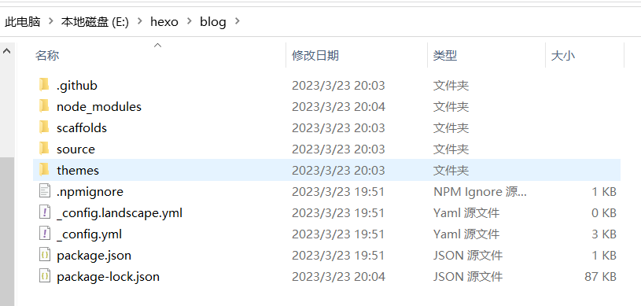
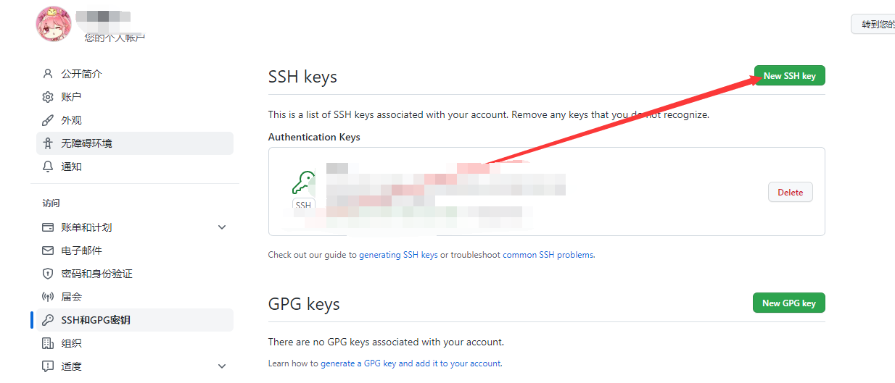
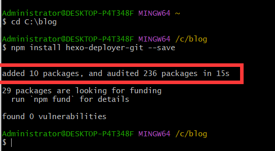
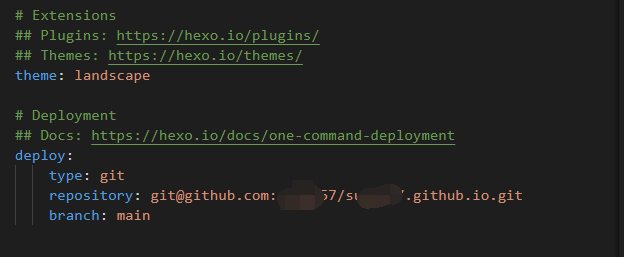
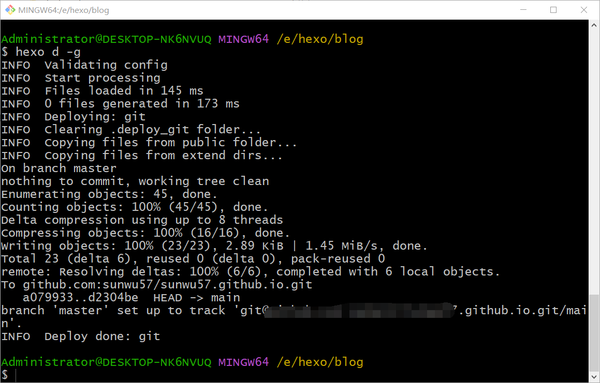
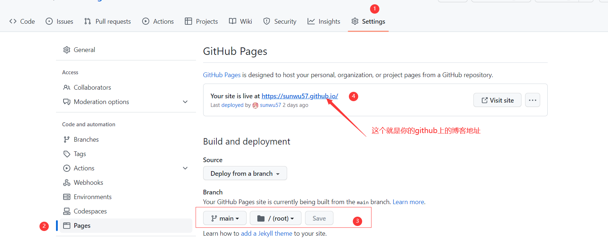

# 参考链接
[主要参考](https://cloud.tencent.com/developer/article/2235973)

# 准备前提
1. 提前安装好node.js左边的那个

https://nodejs.org/en

2. 提前安装好Git

https://git-scm.com/downloads

3. 提前注册好一个github账号
4. 如果文章图片没有显示，请自行挂代理

# 操作步骤
1. 在本地找个目录放博客源文件，路径不要有中文
2. 在选定的目录中，右键`Git Bash Here`
3. 使用npm命令安装Hexo，输入：

> npm install -g hexo-cli                     //安装hexo  
hexo init blog                                   //初始化一个名为blog的项目  
cd blog                                             //进入blog  
hexo g                                              //编译构建
>

构建好的效果:  



4. cd进入这个目录  
为了检测我们的网站雏形，分别按顺序输入以下三条命令：

```plain
hexo new test_my_site                    //博客新建一个文章
hexo g                                   //构建
hexo s                                   //启动服务
之后就可以访问127.0.0.1:4000访问blog了
```

5. <font style="color:#DF2A3F;">配置ssh</font>

> <font style="color:#DF2A3F;">cd ~/.ssh #检查本机已存在的ssh密钥</font>
>

+ <font style="color:#DF2A3F;">如果提示：No such file or directory 说明你是第一次使用git。</font>

> <font style="color:#DF2A3F;">ssh-keygen -t rsa -C "邮件地址"</font>
>

+ <font style="color:#DF2A3F;">然后连续3次回车，最终会生成一个文件在用户目录下，打开用户目录，找到.ssh\id_rsa.pub文件，记事本打开并复制里面的内容，打开你的github主页，进入个人设置 -> SSH and GPG keys -> New SSH key：</font>




+  <font style="color:#DF2A3F;">key填写C:\Users\Administrator.ssh\id_rsa.pub中的内容 </font>
+ <font style="color:#DF2A3F;"> 尝试ssh连接,测试是否成功 </font>

> <font style="color:#DF2A3F;">ssh -T </font>[<font style="color:#DF2A3F;">git@github.com</font>](mailto:git@github.com)<font style="color:#DF2A3F;"> # 注意邮箱地址不用改</font>
>

+ 如果提示Are you sure you want to continue connecting (yes/no)?，输入yes，然后会看到下面这个，就算成功：

> Hi liuxianan! You’ve successfully authenticated, but GitHub does not provide shell access.
>

+ 在选中的位置(blog目录下)打开cmd(以管理员身份)

> <font style="color:#DF2A3F;">npm install hexo-deployer-git --save</font>
>



+ 在上一个`Git Bash Here`还需要继续配置

```plain
git config --global user.name "luozhixiaowo"// 你的github用户名，非昵称
git config --global user.email  "xxx@qq.com"// 填写你的github注册邮箱
```

6. 准备上传代码
+  在github上新建一个存储库，命名为`github的用户名.github.io` 
+  编辑_config.yml文件，在最后改成这样 

```plain
deploy:
  type: git
  repository: git@github.com:luozhixiaowo/luozhixiaowo.github.io.git
  branch: main
```



+  注意保持格式，缩进不对，会导致一会儿，上传不成功 
+  最后上传 

> <font style="color:#DF2A3F;">hexo d</font>  
每次上传成功之后，需要等待1-3分钟，用来刷新页面
>



+ 在创建的存储库的设置中-pages-如图设置  

7. hexo命令介绍

```plain
hexo n "我的博客" == hexo new "我的博客" #新建文章
hexo new page "pageName" #新建页面
hexo g == hexo generate #生成
hexo s == hexo server #启动服务预览
hexo d == hexo deploy #部署

hexo server #Hexo会监视文件变动并自动更新，无须重启服务器
hexo server -s #静态模式
hexo server -p 5000 #更改端口
hexo server -i 192.168.1.1 #自定义 IP
hexo clean #清除缓存，若是网页正常情况下可以忽略这条命令
hexo version  #查看Hexo的版本
hexo generate #生成静态页面至public目录

hexo s -g #生成并本地预览
hexo d -g #生成并上传
```

8. hexo目录结构

> +-- .deploy      #hexo deploy生成的文件  
+-- node_modules  #npm组件  
+-- public        #生成的静态网页文件  
+--scaffolds      #模板  
+-- source        #博客正文和其他源文件  
|  +-- _posts    #我们自己写的文章以md结尾  
+-- themes        #主题  
+-- _config.yml  #全局配置文件  
-- package.json  #定义了hexo所需要的各种模块
>

9.  选择一个自己喜欢的主题，不知道有什么好用的主题可以直接，B站搜`HEXO主题`  
这里我用的是[3-hexo使用说明 | 叶落阁 (yelog.org)](http://yelog.org/2017/03/23/3-hexo-instruction/) 
10.  关于如何写笔记看下一篇[typora+PicGo+LskyPro+Obsidian实现文章管理](https://sunwu57.github.io/2023/03/23/typora+PicGo+LskyPro+Obsidian%E5%AE%9E%E7%8E%B0%E6%96%87%E7%AB%A0%E7%AE%A1%E7%90%86/) 
11.  [markdown语法实例](http://sunwu.world/2023/03/25/markdown%e7%9a%84%e4%bd%bf%e7%94%a8%e8%af%b4%e6%98%8e/) 

