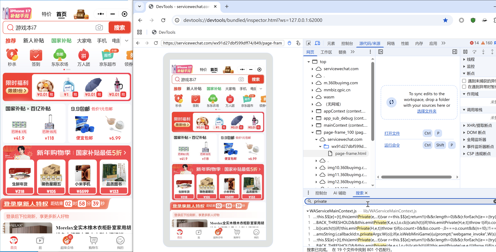
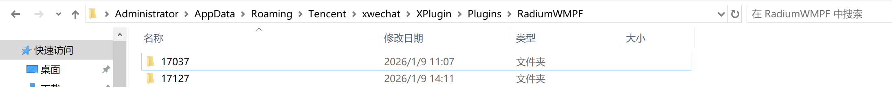
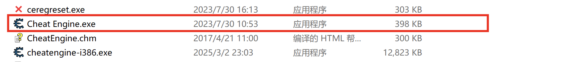
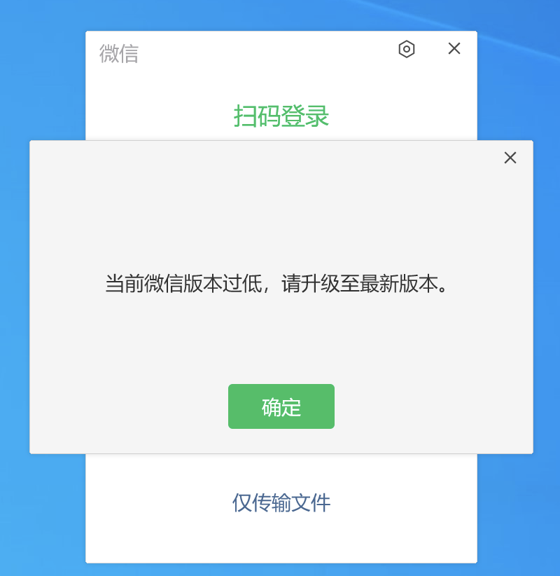
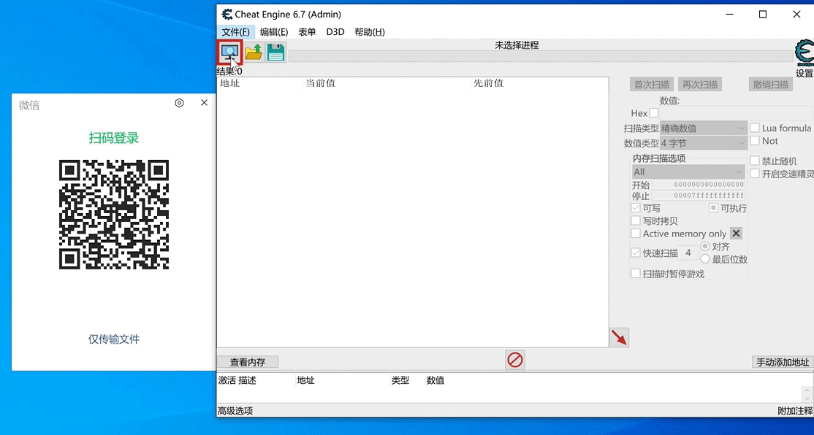

## 微信4.0以上(暂时没找到开内置浏览器的方案，只有开小程序的)
1. 微信下载地址[https://github.com/cscnk52/wechat-windows-versions/releases/download/v4.1.5.15/weixin_4.1.5.15.exe](https://github.com/cscnk52/wechat-windows-versions/releases/download/v4.1.5.15/weixin_4.1.5.15.exe)
2. 安装好微信
3. 配置fnm环境

```plain
https://github.com/Schniz/fnm/releases/download/v1.38.1/fnm-windows.zip
下载下来，并配置系统环境变量path

$env:FNM_NODE_DIST_MIRROR = "https://mirrors.tencent.com/nodejs-release"
$env:NVM_NODEJS_ORG_MIRROR = "https://mirrors.tencent.com/nodejs-release"
fnm install 24
Set-ExecutionPolicy Unrestricted -Scope CurrentUser
New-Item -Type File -Path $PROFILE -Force
notepad $PROFILE   
输入下面这一行内容，并保存
fnm env --use-on-cd | Out-String | Invoke-Expression
重新开一个powershell
```

4. 下载并运行项目

```plain
下载https://github.com/evi0s/WMPFDebugger/archive/refs/heads/main.zip
进入项目

fnm use 24
npm install -g yarn
yarn install
npx ts-node src/index.ts
出现以下两行且没有退出就可以了
[server] debug server running on ws://localhost:9421
[server] proxy server running on ws://localhost:62000
```

5. 打开小程序
6. 打开浏览器访问`devtools://devtools/bundled/inspector.html?ws=127.0.0.1:62000`即可



### 报错
#### 第四步出现以下两行但是退出了
1. 安装文章中用到的微信版本
2. 如果已经是文章中的微信版本还是退出了，打开`C:\Users\Administrator\AppData\Roaming\Tencent\xwechat\XPlugin\Plugins\RadiumWMPF`目录删除名为`18151`目录，重试



出现这个原因主要是WMPFDebugger项目，展示没有更新到`18151`版本，只更新到了`18055`

## 微信4.0以下
### 准备
#### 一键开f12项目
因为采用[https://github.com/JaveleyQAQ/WeChatOpenDevTools-Python](https://github.com/JaveleyQAQ/WeChatOpenDevTools-Python)这个项目，[WechatOpenDevTools-Python (1).zip](https://www.yuque.com/attachments/yuque/0/2026/zip/26698826/1767943330041-dc4ae504-204e-466b-b18e-d2b60f932088.zip)

#### 低版本微信
该项目只支持`<font style="color:rgb(31, 35, 40);">3.9.10.19</font>`<font style="color:rgb(31, 35, 40);">版本及以下的微信，所以我建议采用</font>`<font style="color:rgb(31, 35, 40);">3.9.10.19</font>`<font style="color:rgb(31, 35, 40);">，该版本微信通过以下地址进行获取</font>

[https://github.com/tom-snow/wechat-windows-versions/releases/tag/v3.9.10.19](https://github.com/tom-snow/wechat-windows-versions/releases/tag/v3.9.10.19)

#### CE修改器
[Cheat Engine7.6.zip](https://www.yuque.com/attachments/yuque/0/2026/zip/26698826/1767943799090-f55b70a2-c4ff-4560-b777-261df346daef.zip)

#### 微信小号(最好没啥聊天记录的，记录多会导致报错)
### 低版本微信登陆流程
#### 启动微信和ce


#### ce修改内存版本
修改前



微信版本 `<font style="color:rgb(31, 35, 41);background-color:rgba(0, 0, 0, 0);">3.9.8.25</font>` → 十六进制 `<font style="color:rgb(31, 35, 41);background-color:rgba(0, 0, 0, 0);">0x63090819</font>` → 只要`<font style="color:rgb(31, 35, 41);background-color:rgba(0, 0, 0, 0);">63090819</font>`

微信版本 `<font style="color:rgb(31, 35, 41);background-color:rgba(0, 0, 0, 0);">3.9.10.19</font>` → 十六进制 `<font style="color:rgb(31, 35, 41);background-color:rgba(0, 0, 0, 0);">0x63090A13</font>`→只要 `<font style="color:rgb(31, 35, 41);background-color:rgba(0, 0, 0, 0);">63090A13</font>`

`<font style="color:rgb(51, 51, 51);background-color:rgb(248, 248, 248);">0xf2593210</font>`<font style="color:rgb(51, 51, 51);background-color:rgb(248, 248, 248);">将其识别为无效或特殊版本，从而绕过正常的版本校验逻辑，具体操作如下</font>

<font style="color:rgb(51, 51, 51);background-color:rgb(248, 248, 248);">需要注意的是扫码记得扫两次，第一次失败是正常的，记得点</font>`<font style="color:rgb(51, 51, 51);background-color:rgb(248, 248, 248);">x</font>`<font style="color:rgb(51, 51, 51);background-color:rgb(248, 248, 248);">，而不是</font>`<font style="color:rgb(51, 51, 51);background-color:rgb(248, 248, 248);">确定</font>`



### 低版本vx开f12流程
1. 进入`WechatOpenDevTools-Python`所在文件夹
2. `.\WechatOpenDevTools-Python.exe  -all`，这时会启动一个vx扫码登陆页
3. 通过上面的低版本微信登陆流程，即可进入微信
4. 打开`内置浏览器`或者`小程序`f12即可打开

