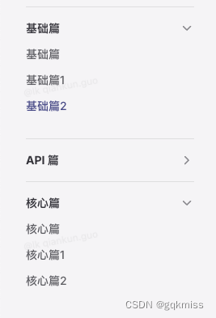
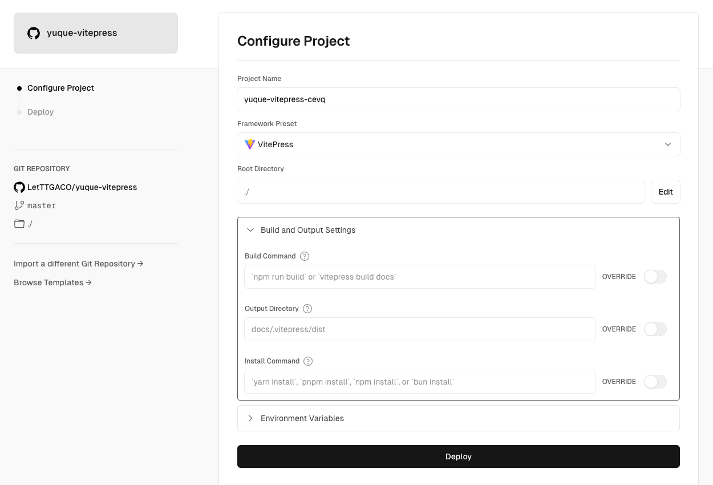

#  博客介绍
使用vitepress框架+github存储+Elog+语雀写作+vercel部署+自定义域名

[子夜旅馆](http://sunwu.world)


# 部署
## VitePress
`VitePress` 官网：[VitePress 中文版](https://vitepress.dev/zh/)

### 什么是 VitePress
> VitePress 是一个静态站点生成器 (SSG)，专为构建快速、以内容为中心的站点而设计。简而言之，VitePress 获取用 Markdown 编写的内容，对其应用主题，并生成可以轻松部署到任何地方的静态 HTML 页面。
>

### 性能
+ 快速的初始加载
+ 加载完成后可以快速切换
+ 高效的交互

## 项目构建
### 直接拉取
```plain
git clone https://github.com/elog-x/yuque-vitepress.git
cd yuque-vitepress
```

### 安装依赖
```plain
npm i
```

### <font style="color:rgb(31, 35, 40);">新建本地调试文件</font>
<font style="color:rgb(31, 35, 40);">在项目根目录中复制</font>`<font style="color:rgb(31, 35, 40);">.elog.example.env</font>`<font style="color:rgb(31, 35, 40);">文件并改名为</font>`<font style="color:rgb(31, 35, 40);">.elog.env</font>`<font style="color:rgb(31, 35, 40);">，此文件将用于本地同步文档时使用</font>

### <font style="color:rgb(31, 35, 40);">配置语雀</font>
<font style="color:rgb(31, 35, 40);">参考</font>[示例知识库](https://www.yuque.com/1874w/yuque-vitepress-template)<font style="color:rgb(31, 35, 40);"> </font><font style="color:rgb(31, 35, 40);">，选择或新建语雀文档知识库，并按照</font>[文档提示](https://elog.1874.cool/notion/gvnxobqogetukays#login)<font style="color:rgb(31, 35, 40);"> </font><font style="color:rgb(31, 35, 40);">配置语雀并获取</font><font style="color:rgb(31, 35, 40);"> </font>`<font style="color:rgb(31, 35, 40);">token login repo</font>`<font style="color:rgb(31, 35, 40);">。并在本地</font>`<font style="color:rgb(31, 35, 40);">.elog.env</font>`<font style="color:rgb(31, 35, 40);">中写入</font>

Token 模式或者账号密码模式二选一即可，默认为账号密码模式，如果需要切换为 Token 模式，则修改`elog.config.js`中的`platform`为`yuque`

```plain
# 语雀（Token方式）,关闭自动发布
YUQUE_TOKEN=获取的Token

#语雀（账号密码模式）
YUQUE_USERNAME=一般是手机号
YUQUE_PASSWORD=登录密码

# 语雀公共参数
YUQUE_LOGIN=获取的login
YUQUE_REPO=获取的repo
```


### <font style="color:rgb(31, 35, 40);">本地调试</font>
<font style="color:rgb(31, 35, 40);">在项目根目录运行同步命令，将语雀repo对应库中的文档进行拉取到本地</font>

`<font style="color:rgb(31, 35, 40);">npm run elog:sync-local</font>`

### <font style="color:rgb(31, 35, 40);">使用vitepress其他主题</font>
[escook主题](https://www.npmjs.com/package/@escook/vitepress-theme)

#### 在项目目录中执行
`npm install @escook/vitepress-theme@latest`

#### 创建<font style="color:rgb(51, 51, 51);background-color:rgb(247, 247, 247);">.vitepress/theme/index.ts</font>并写入
```typescript
// 1. 导入 vitepress 主题
import Theme from '@escook/vitepress-theme'
// 2. 导入配套的 CSS 样式（此步骤不能省略）
import '@escook/vitepress-theme/style.css'

// 3. 把“导入”的主题“默认导出”即可
export default Theme
```

#### 在<font style="color:rgb(51, 51, 51);background-color:rgb(247, 247, 247);">.vitepress/config.mts</font>添加下面内容


## <font style="color:rgb(31, 35, 40);">项目目录介绍</font>
<font style="color:rgb(31, 35, 40);">根据</font><font style="color:rgb(31, 35, 40);"> </font>[VitePress](https://vitepress.dev/)<font style="color:rgb(31, 35, 40);"> </font><font style="color:rgb(31, 35, 40);">文档，配置你的文档站点直到你满意为止。</font>

1. <font style="color:rgb(31, 35, 40);">修改 VitePress 的配置文件</font>`<font style="color:rgb(31, 35, 40);">docs/.vitepress/config.mts</font>`<font style="color:rgb(31, 35, 40);">中的导航栏、路由信息等</font>
2. <font style="color:rgb(31, 35, 40);">修改首页信息</font>`<font style="color:rgb(31, 35, 40);">docs/index.md</font>`<font style="color:rgb(31, 35, 40);">中的文字和路由</font>
3. <font style="color:rgb(31, 35, 40);">更多自定义配置请看 VitePress 文档</font>

本文档默认是按照文档目录渲染站点 URL，可能会存在中文路由，如果想要短路由模式，即站点路由全英文，可前往[进阶配置](https://yuque-vitepress.vercel.app/docs/%E8%BF%9B%E9%98%B6%E9%85%8D%E7%BD%AE/VitePress%E7%9F%AD%E8%B7%AF%E7%94%B1%E6%A8%A1%E5%BC%8F) 中阅读

### 目录结构


### <font style="color:rgb(79, 79, 79);">项目文件结构</font>
:::info
+ `<font style="color:rgb(199, 37, 78);background-color:rgb(249, 242, 244);">docs</font>`<font style="color:rgba(0, 0, 0, 0.75);"> 文件夹：</font>`<font style="color:rgb(199, 37, 78);background-color:rgb(249, 242, 244);">VitePress</font>`<font style="color:rgba(0, 0, 0, 0.75);"> 项目的</font>**<font style="color:rgba(0, 0, 0, 0.75);">根目录</font>**
    - `<font style="color:rgb(199, 37, 78);background-color:rgb(249, 242, 244);">.vitepress</font>`<font style="color:rgba(0, 0, 0, 0.75);">：项目的配置文件、开发缓存、构建 dist 输出等</font>
        * `<font style="color:rgb(199, 37, 78);background-color:rgb(249, 242, 244);">config.mts</font>`<font style="color:rgba(0, 0, 0, 0.75);">：项目配置文件</font>
    - `<font style="color:rgb(199, 37, 78);background-color:rgb(249, 242, 244);">index.md</font>`<font style="color:rgba(0, 0, 0, 0.75);">：首页入口文件</font>
    - `<font style="color:rgb(199, 37, 78);background-color:rgb(249, 242, 244);">**.md</font>`<font style="color:rgba(0, 0, 0, 0.75);">：其他页面</font>
    - `<font style="color:rgb(199, 37, 78);background-color:rgb(249, 242, 244);">public</font>`<font style="color:rgba(0, 0, 0, 0.75);">：资源存放文件夹</font>

:::

### <font style="color:rgb(79, 79, 79);">运行项目</font>
```shell
npm run docs:dev
```

## <font style="color:rgb(51, 51, 51);">vitepress项目配置</font>
### <font style="color:rgb(51, 51, 51);">首页</font>
<font style="color:rgb(51, 51, 51);">一般是指 </font>`<font style="color:rgb(51, 51, 51);background-color:rgb(243, 244, 244);">index.md</font>`<font style="color:rgb(51, 51, 51);"> 文件</font>

#### <font style="color:rgb(51, 51, 51);">Layout</font>
<font style="color:rgb(51, 51, 51);">指定页面的布局</font>

<font style="color:rgb(119, 119, 119);">VitePress 默认主题提供了一个首页布局，可以通过 frontmatter 指定 layout: home 在任何页面上使用它</font>

##### <font style="color:rgb(51, 51, 51);">类型</font>
`<font style="color:rgb(51, 51, 51);background-color:rgb(243, 244, 244);">doc | home | page</font>`

##### <font style="color:rgb(51, 51, 51);">数据值</font>
+ `<font style="color:rgb(51, 51, 51);background-color:rgb(243, 244, 244);">doc</font>`<font style="color:rgb(51, 51, 51);">：将默认文档样式应用于 </font>`<font style="color:rgb(51, 51, 51);background-color:rgb(243, 244, 244);">.md</font>`<font style="color:rgb(51, 51, 51);"> 文件内容</font>
+ `<font style="color:rgb(51, 51, 51);background-color:rgb(243, 244, 244);">home</font>`<font style="color:rgb(51, 51, 51);">：</font>**<font style="color:rgb(51, 51, 51);">主页</font>**<font style="color:rgb(51, 51, 51);">的特殊布局</font>
+ `<font style="color:rgb(51, 51, 51);background-color:rgb(243, 244, 244);">page</font>`<font style="color:rgb(51, 51, 51);">：和 </font>`<font style="color:rgb(51, 51, 51);background-color:rgb(243, 244, 244);">doc</font>`<font style="color:rgb(51, 51, 51);"> 类似，但不对内容应用任何样式</font>

##### <font style="color:rgb(51, 51, 51);">示例</font>
```plain
---
layout: home
---
```

##### <font style="color:rgb(51, 51, 51);">页面展示</font>
`<font style="color:rgb(51, 51, 51);background-color:rgb(243, 244, 244);">home</font>`<font style="color:rgb(51, 51, 51);"> 展示</font>

---

`<font style="color:rgb(51, 51, 51);background-color:rgb(243, 244, 244);">doc</font>`<font style="color:rgb(51, 51, 51);"> 展示</font>


---

`<font style="color:rgb(51, 51, 51);background-color:rgb(243, 244, 244);">page</font>`<font style="color:rgb(51, 51, 51);"> 展示</font>


#### <font style="color:rgb(51, 51, 51);">Hero</font>
`<font style="color:rgb(51, 51, 51);background-color:rgb(243, 244, 244);">hero</font>`<font style="color:rgb(51, 51, 51);"> 部分位于主页顶部。</font>**<font style="color:rgb(51, 51, 51);">当 </font>**`**<font style="color:rgb(51, 51, 51);background-color:rgb(243, 244, 244);">layout</font>**`**<font style="color:rgb(51, 51, 51);"> 设置为 </font>**`**<font style="color:rgb(51, 51, 51);background-color:rgb(243, 244, 244);">home</font>**`**<font style="color:rgb(51, 51, 51);"> 时，</font>**`**<font style="color:rgb(51, 51, 51);background-color:rgb(243, 244, 244);">hero</font>**`**<font style="color:rgb(51, 51, 51);"> 配置才会生效</font>**<font style="color:rgb(51, 51, 51);">。</font>


##### <font style="color:rgb(51, 51, 51);">类型</font>
```plain
interface Hero {
  // `text` 上方的字符，带有品牌颜色
  // 预计简短，例如产品名称
  name?: string
  // hero 部分的主要文字，
  // 被定义为 `h1` 标签
  text: string
  // `text` 下方的标语
  tagline?: string
  // text 和 tagline 区域旁的图片
  image?: ThemeableImage
  // 主页 hero 部分的操作按钮
  actions?: HeroAction[]
}
```

+ `<font style="color:rgb(51, 51, 51);background-color:rgb(243, 244, 244);">name</font>`<font style="color:rgb(51, 51, 51);">：文档标题</font>
+ `<font style="color:rgb(51, 51, 51);background-color:rgb(243, 244, 244);">text</font>`<font style="color:rgb(51, 51, 51);">：副标题/描述</font>
+ `<font style="color:rgb(51, 51, 51);background-color:rgb(243, 244, 244);">tagline</font>`<font style="color:rgb(51, 51, 51);">：文档标语</font>
+ `<font style="color:rgb(51, 51, 51);background-color:rgb(243, 244, 244);">image</font>`<font style="color:rgb(51, 51, 51);">：右侧图片</font>
+ `<font style="color:rgb(51, 51, 51);background-color:rgb(243, 244, 244);">actions</font>`<font style="color:rgb(51, 51, 51);">：操作按钮</font>
    - `<font style="color:rgb(51, 51, 51);background-color:rgb(243, 244, 244);">theme</font>`<font style="color:rgb(51, 51, 51);">：</font>`<font style="color:rgb(51, 51, 51);background-color:rgb(243, 244, 244);">brand | alt</font>`<font style="color:rgb(51, 51, 51);"> 按钮主题，只有这两种主题，默认为 </font>`<font style="color:rgb(51, 51, 51);background-color:rgb(243, 244, 244);">brand</font>`
        * `<font style="color:rgb(51, 51, 51);background-color:rgb(243, 244, 244);">brand</font>`<font style="color:rgb(51, 51, 51);">：蓝色背景按钮</font>
        * `<font style="color:rgb(51, 51, 51);background-color:rgb(243, 244, 244);">alt</font>`<font style="color:rgb(51, 51, 51);">：灰色背景按钮</font>
    - `<font style="color:rgb(51, 51, 51);background-color:rgb(243, 244, 244);">text</font>`<font style="color:rgb(51, 51, 51);">：按钮文案</font>
    - `<font style="color:rgb(51, 51, 51);background-color:rgb(243, 244, 244);">link</font>`<font style="color:rgb(51, 51, 51);">：按钮的链接</font>

##### <font style="color:rgb(51, 51, 51);">示例</font>
<font style="color:rgb(51, 51, 51);">找一张 </font>`<font style="color:rgb(51, 51, 51);background-color:rgb(243, 244, 244);">ext.svg</font>`<font style="color:rgb(51, 51, 51);"> 图标放在 </font>`<font style="color:rgb(51, 51, 51);background-color:rgb(243, 244, 244);">public</font>`<font style="color:rgb(51, 51, 51);"> 文件夹中</font>

```plain
---
layout: home

hero:
  name: "My VitePress Demo Project"
  text: "This is my VitePress demo project"
  tagline: "My great project tagline"
  image:
    src: /ext.svg
    alt: Chrome 浏览器插件
  actions:
    - theme: brand
      text: Markdown Examples
      link: /markdown-examples
    - theme: alt
      text: API Examples
      link: /api-examples
    - theme: brand
      text: extension
      link: https://18055975947.github.io/extension/
      target: _blank
      rel: external
---
```

##### <font style="color:rgb(51, 51, 51);">页面展示</font>


#### <font style="color:rgb(51, 51, 51);">Features</font>
<font style="color:rgb(51, 51, 51);">可以在 </font>`<font style="color:rgb(51, 51, 51);background-color:rgb(243, 244, 244);">Hero</font>`<font style="color:rgb(51, 51, 51);"> 部分之后列出任意数量的 </font>`<font style="color:rgb(51, 51, 51);background-color:rgb(243, 244, 244);">Feature</font>`


##### <font style="color:rgb(51, 51, 51);">类型</font>
```plain
interface Feature {
  // 在每个 feature 框中显示图标
  icon?: FeatureIcon
  // feature 的标题
  title: string
  // feature 的详情
  details: string
  // 点击 feature 组件时的链接，可以是内部链接，也可以是外部链接。
  link?: string
  // feature 组件内显示的链接文本，最好与 `link` 选项一起使用
  linkText?: string
  // `link` 选项的链接 rel 属性
  rel?: string
  // `link` 选项的链接 target 属性
  target?: string
}
```

+ `<font style="color:rgb(51, 51, 51);background-color:rgb(243, 244, 244);">icon</font>`<font style="color:rgb(51, 51, 51);">：图标</font>
+ `<font style="color:rgb(51, 51, 51);background-color:rgb(243, 244, 244);">title</font>`<font style="color:rgb(51, 51, 51);">：标题</font>
+ `<font style="color:rgb(51, 51, 51);background-color:rgb(243, 244, 244);">details</font>`<font style="color:rgb(51, 51, 51);">：描述</font>
+ `<font style="color:rgb(51, 51, 51);background-color:rgb(243, 244, 244);">link</font>`<font style="color:rgb(51, 51, 51);">：跳转链接</font>

##### <font style="color:rgb(51, 51, 51);">示例</font>
<font style="color:rgb(51, 51, 51);">找一些对应的图标放在 </font>`<font style="color:rgb(51, 51, 51);background-color:rgb(243, 244, 244);">public</font>`<font style="color:rgb(51, 51, 51);"> 文件夹中</font>

```plain
---
layout: home

features:
  - title: 什么是浏览器插件？
    icon:
      src: /ext.svg
    details: Chrome 插件可通过自定义界面、观察浏览器事件和修改网络来提升浏览体验。
  - title: Chrome 插件是如何构建的？
    icon:
      src: /develop.svg
    details: 使用与创建 Web 应用相同的 Web 技术来构建扩展程序：HTML、CSS 和 JavaScript。
  - title: Chrome 插件可以做些什么？
    icon:
      src: /ext-2.svg
    details: 设计界面、控制浏览器、管理插件、覆盖网页和设置、控制网络、注入 JS 和 CSS、录音和屏幕截图
  - title: Vue 开发插件
    icon:
      src: /vue.svg
    details: 是一个使用 Vue.js 框架开发的 Chrome 插件，旨在为开发者展示如何使用 Vue.js 构建强大的浏览器扩展。
    link: https://juejin.cn/post/7330227149177028617
    linkText: 查看详情
  - title: React 开发插件
    icon:
      src: /react.svg
    details: 是一个使用 React.js 框架开发的 Chrome 插件，旨在为开发者展示如何使用 React.js 构建强大的浏览器扩展。
    link: https://juejin.cn/post/7349936384512213027
    linkText: 查看详情
  - title: 实用插件推荐
    icon:
      src: /tj.svg
    details: 推荐一些对前端开发来说实用的 Chrome 插件。
    link: https://juejin.cn/post/7327893130572824611
    linkText: 查看详情
---
```

##### <font style="color:rgb(51, 51, 51);">页面展示</font>


#### <font style="color:rgb(51, 51, 51);">其他</font>
<font style="color:rgb(51, 51, 51);">如果到这个时候你觉得在首页 </font>`<font style="color:rgb(51, 51, 51);background-color:rgb(243, 244, 244);">md</font>`<font style="color:rgb(51, 51, 51);"> 文件中还没有满足你的其他需求，可以在分隔符下继续以 </font>`<font style="color:rgb(51, 51, 51);background-color:rgb(243, 244, 244);">md</font>`<font style="color:rgb(51, 51, 51);"> 的格式开发新内容。</font>

##### <font style="color:rgb(51, 51, 51);">添加 MD 内容</font>
```plain
## 首页模块 MD 文档

MD 文件
```


##### <font style="color:rgb(51, 51, 51);">引入 MD 文件</font>
###### <font style="color:rgb(119, 119, 119);">新建 MD 文件</font>
<font style="color:rgb(51, 51, 51);">在 </font>`<font style="color:rgb(51, 51, 51);background-color:rgb(243, 244, 244);">docs</font>`<font style="color:rgb(51, 51, 51);"> 文件夹下创建 </font>`<font style="color:rgb(51, 51, 51);background-color:rgb(243, 244, 244);">components</font>`<font style="color:rgb(51, 51, 51);"> 文件夹并创建 </font>`<font style="color:rgb(51, 51, 51);background-color:rgb(243, 244, 244);">test.md</font>`<font style="color:rgb(51, 51, 51);"> 文件，并写入以下内容</font>

```plain
---
layout: page
---

## Components

### test 模块

这个模块是 `components` 文件夹下的 `test` 模块
```

```plain
.
docs/components
└── test.md
```

###### <font style="color:rgb(119, 119, 119);">在 index.md 文件引入</font>
<font style="color:rgb(51, 51, 51);">使用</font>`<font style="color:rgb(51, 51, 51);background-color:rgb(243, 244, 244);"><!--@include: xxx.md--></font>`<font style="color:rgb(51, 51, 51);"> 的格式引入</font><font style="color:rgb(51, 51, 51);">在 </font>`<font style="color:rgb(51, 51, 51);background-color:rgb(243, 244, 244);">index.md</font>`<font style="color:rgb(51, 51, 51);"> 文件添加以下内容</font>

```plain
下面是添加 `style` 标签和引入 `md` 文件

<style module>
article>img{
  height: 48px;
}
</style>

<!--@include: ./components/test.md-->
```

###### <font style="color:rgb(119, 119, 119);">页面展示</font>
1. <font style="color:rgb(51, 51, 51);">引入 </font>`<font style="color:rgb(51, 51, 51);background-color:rgb(243, 244, 244);">MD</font>`<font style="color:rgb(51, 51, 51);"> 文件展示</font>
2. `<font style="color:rgb(51, 51, 51);background-color:rgb(243, 244, 244);">Style</font>`<font style="color:rgb(51, 51, 51);"> 标签样式展示</font>


### <font style="color:rgb(51, 51, 51);">导航栏</font>
<font style="color:rgb(119, 119, 119);">Nav 是显示在页面顶部的导航栏。它包含站点标题、全局菜单链接等。</font>

**<font style="color:rgb(51, 51, 51);">导航栏模块的配置是通过 </font>**`**<font style="color:rgb(51, 51, 51);background-color:rgb(243, 244, 244);">docs/.vitepress/config.mts</font>**`**<font style="color:rgb(51, 51, 51);"> 文件配置的</font>**

`<font style="color:rgb(51, 51, 51);background-color:rgb(243, 244, 244);">config.mts</font>`<font style="color:rgb(51, 51, 51);"> 文件内容</font>

```plain
import { defineConfig } from 'vitepress'
export default defineConfig({
  title: "My VitePress Demo Project",
  description: "This is my VitePress demo project",
  themeConfig: {
    nav: [
      { text: 'Home', link: '/' },
      { text: 'Examples', link: '/markdown-examples' }
    ],
    sidebar: [
      {
        text: 'Examples',
        items: [
          { text: 'Markdown Examples', link: '/markdown-examples' },
          { text: 'Runtime API Examples', link: '/api-examples' }
        ]
      }
    ],
    socialLinks: [
      { icon: 'github', link: 'https://github.com/vuejs/vitepress' }
    ]
  }
})
```

#### <font style="color:rgb(51, 51, 51);">站点标题和图标：sitTitle、logo</font>
##### <font style="color:rgb(51, 51, 51);">在 </font>`<font style="color:rgb(51, 51, 51);background-color:rgb(243, 244, 244);">themeConfig</font>`<font style="color:rgb(51, 51, 51);"> 中添加 </font>`<font style="color:rgb(51, 51, 51);background-color:rgb(243, 244, 244);">logo</font>`<font style="color:rgb(51, 51, 51);"> 和 </font>`<font style="color:rgb(51, 51, 51);background-color:rgb(243, 244, 244);">siteTitle</font>`<font style="color:rgb(51, 51, 51);"> 字段</font>
###### <font style="color:rgb(119, 119, 119);">类型</font>
`<font style="color:rgb(51, 51, 51);background-color:rgb(243, 244, 244);">string</font>`<font style="color:rgb(51, 51, 51);">：</font>`<font style="color:rgb(51, 51, 51);background-color:rgb(243, 244, 244);">logo</font>`<font style="color:rgb(51, 51, 51);"> 和 </font>`<font style="color:rgb(51, 51, 51);background-color:rgb(243, 244, 244);">siteTitle</font>`<font style="color:rgb(51, 51, 51);"> 都是 </font>`<font style="color:rgb(51, 51, 51);background-color:rgb(243, 244, 244);">string</font>`<font style="color:rgb(51, 51, 51);"> 类型</font>

###### <font style="color:rgb(119, 119, 119);">themeConfig 配置示例</font>
```plain
import { defineConfig } from 'vitepress'
export default defineConfig({
  title: "My VitePress Demo Project",
  description: "This is my VitePress demo project",
  themeConfig: {
    logo: '/ext.svg',
    siteTitle: 'Project SitTitle',
  }
})
```

##### <font style="color:rgb(51, 51, 51);">页面展示</font>


<font style="color:rgb(51, 51, 51);">可以看出 </font>`<font style="color:rgb(51, 51, 51);background-color:rgb(243, 244, 244);">logo</font>`<font style="color:rgb(51, 51, 51);"> 已经加上了，而且 </font>`<font style="color:rgb(51, 51, 51);background-color:rgb(243, 244, 244);">sitTitle</font>`<font style="color:rgb(51, 51, 51);"> 字段覆盖了 </font>`<font style="color:rgb(51, 51, 51);background-color:rgb(243, 244, 244);">title</font>`<font style="color:rgb(51, 51, 51);"> 字段</font>

<font style="color:rgb(51, 51, 51);">默认情况下，以 </font>`<font style="color:rgb(51, 51, 51);background-color:rgb(243, 244, 244);">config.title</font>`<font style="color:rgb(51, 51, 51);"> 作为站点的标题，但是如果想更改标题，可以设置 </font>`<font style="color:rgb(51, 51, 51);background-color:rgb(243, 244, 244);">themeConfig</font>`<font style="color:rgb(51, 51, 51);"> 中的 </font>`<font style="color:rgb(51, 51, 51);background-color:rgb(243, 244, 244);">sitTitle</font>`<font style="color:rgb(51, 51, 51);"> 字段。</font>

#### <font style="color:rgb(51, 51, 51);">搜索模块：search</font>
<font style="color:rgb(119, 119, 119);">VitePress 支持使用浏览器内索引进行模糊全文搜索。</font>

##### <font style="color:rgb(51, 51, 51);">在 </font>`<font style="color:rgb(51, 51, 51);background-color:rgb(243, 244, 244);">themeConfig</font>`<font style="color:rgb(51, 51, 51);"> 中添加 </font>`<font style="color:rgb(51, 51, 51);background-color:rgb(243, 244, 244);">search</font>`<font style="color:rgb(51, 51, 51);"> 字段</font>
###### <font style="color:rgb(119, 119, 119);">search 字段数据类型</font>
`<font style="color:rgb(51, 51, 51);background-color:rgb(243, 244, 244);">object</font>`

```plain
{ provider: 'local'; options?: LocalSearchOptions }
| { provider: 'algolia'; options: AlgoliaSearchOptions }
```

###### <font style="color:rgb(119, 119, 119);">themeConfig 配置示例</font>
```plain
import { defineConfig } from 'vitepress'
export default defineConfig({
  title: "My VitePress Demo Project",
  description: "This is my VitePress demo project",
  themeConfig: {
    logo: '/ext.svg',
    siteTitle: 'Project SitTitle',
    search: {
      provider: 'local'
    },
  }
})
```

##### <font style="color:rgb(51, 51, 51);">页面展示</font>


##### <font style="color:rgb(51, 51, 51);">搜索效果展示</font>


#### <font style="color:rgb(51, 51, 51);">导航链接：nav</font>
<font style="color:rgb(119, 119, 119);">可以定义 themeConfig.nav 选项以将链接添加到导航栏。</font>

[<font style="color:rgb(65, 131, 196);">【Chrome浏览器插件开发实践指南】</font>](https://18055975947.github.io/extension/)<font style="color:rgb(51, 51, 51);"> 文档的 </font>`<font style="color:rgb(51, 51, 51);background-color:rgb(243, 244, 244);">Nav</font>`<font style="color:rgb(51, 51, 51);"> 导航</font><font style="color:rgb(51, 51, 51);">可以看到，不仅可以配置单个链接，也可以配置下拉列表，我们就按照上面的配置来重新在我们现在的项目中配一遍</font>

##### <font style="color:rgb(51, 51, 51);">创建对应的文件夹和对应的 index.md 文件</font>
<font style="color:rgb(51, 51, 51);">创建 </font>`<font style="color:rgb(51, 51, 51);background-color:rgb(243, 244, 244);">basic</font>`<font style="color:rgb(51, 51, 51);">、</font>`<font style="color:rgb(51, 51, 51);background-color:rgb(243, 244, 244);">api</font>`<font style="color:rgb(51, 51, 51);">、</font>`<font style="color:rgb(51, 51, 51);background-color:rgb(243, 244, 244);">core</font>`<font style="color:rgb(51, 51, 51);">、</font>`<font style="color:rgb(51, 51, 51);background-color:rgb(243, 244, 244);">summarize</font>`<font style="color:rgb(51, 51, 51);">、</font>`<font style="color:rgb(51, 51, 51);background-color:rgb(243, 244, 244);">teach</font>`<font style="color:rgb(51, 51, 51);">、</font>`<font style="color:rgb(51, 51, 51);background-color:rgb(243, 244, 244);">team</font>`<font style="color:rgb(51, 51, 51);"> 文件夹，并在其中创建 </font>`<font style="color:rgb(51, 51, 51);background-color:rgb(243, 244, 244);">index.md</font>`<font style="color:rgb(51, 51, 51);"> 文件，如下：</font>

```plain
.
├── docs
│   ├── api
│   │   └── index.md
│   ├── basic
│   │   └── index.md
│   ├── core
│   │   └── index.md
│   ├── index.md
│   ├── summarize
│   │   └── index.md
│   ├── teach
│   │   └── index.md
│   └── team
│       └── index.md
```

##### <font style="color:rgb(51, 51, 51);">在</font>`<font style="color:rgb(51, 51, 51);background-color:rgb(243, 244, 244);">themeConfig</font>`<font style="color:rgb(51, 51, 51);"> 中添加 </font>`<font style="color:rgb(51, 51, 51);background-color:rgb(243, 244, 244);">nav</font>`<font style="color:rgb(51, 51, 51);"> 字段</font>
###### <font style="color:rgb(119, 119, 119);">nav 字段数据类型</font>
<font style="color:rgb(51, 51, 51);">数组：</font>`<font style="color:rgb(51, 51, 51);background-color:rgb(243, 244, 244);">NavItem[]</font>`

```plain
type NavItem = NavItemWithLink | NavItemWithChildren
interface NavItemWithLink {
  text: string
  link: string
  activeMatch?: string
  target?: string
  rel?: string
  noIcon?: boolean
}
interface NavItemChildren {
  text?: string
  items: NavItemWithLink[]
}
interface NavItemWithChildren {
  text?: string
  items: (NavItemChildren | NavItemWithLink)[]
  activeMatch?: string
}
```

###### <font style="color:rgb(119, 119, 119);">themeConfig 配置示例</font>
```plain
import { defineConfig } from 'vitepress'
export default defineConfig({
  title: "My VitePress Demo Project",
  description: "This is my VitePress demo project",
  themeConfig: {
    logo: '/ext.svg',
    siteTitle: 'Project SitTitle',
    search: {
      provider: 'local'
    },
    nav: [
      {
        text: '基础',
        link: '/basic/index'
      },
      {
        text: 'API',
        link: '/api/index'
      },
      {
        text: '核心篇',
        link: '/core/index'
      },
      {
        text: '实战教学篇',
        items: [
          {
            text: '原生 JS 开发',
            link: '/teach/index'
          },
          {
            text: 'Vue', 
            link: '/teach/index'
          },
          {
            text: 'React', 
            link: '/teach/index'
          },
          {
            text: 'CRXJS Vue', 
            link: '/teach/index'
          },
          {
            text: 'CRXJS React', 
            link: '/teach/index'
          }
        ]
      },
      {
        text: '实用插件推荐',
        link: '/summarize/index'
      },
      {
        text: '团队',
        link: '/team/index'
      }
    ],
  }
})
```

##### <font style="color:rgb(51, 51, 51);">页面效果展示</font>


#### <font style="color:rgb(51, 51, 51);">社交账户链接：socialLinks</font>
<font style="color:rgb(119, 119, 119);">可以定义此选项以在导航栏中展示带有图标的社交帐户链接。</font>

##### <font style="color:rgb(51, 51, 51);">在 </font>`<font style="color:rgb(51, 51, 51);background-color:rgb(243, 244, 244);">themeConfig</font>`<font style="color:rgb(51, 51, 51);"> 中添加 </font>`<font style="color:rgb(51, 51, 51);background-color:rgb(243, 244, 244);">socialLinks</font>`<font style="color:rgb(51, 51, 51);"> 字段</font>
###### <font style="color:rgb(119, 119, 119);">socialLinks 字段数据类型</font>
<font style="color:rgb(51, 51, 51);">数组：</font>`<font style="color:rgb(51, 51, 51);background-color:rgb(243, 244, 244);">SocialLink[]</font>`

```plain
interface SocialLink {
  icon: SocialLinkIcon
  link: string
  ariaLabel?: string
}
```

###### <font style="color:rgb(119, 119, 119);">themeConfig 配置示例</font>
```plain
export default defineConfig({
  themeConfig: {
    ...,
    socialLinks: [
      {
        icon: {
          svg: '<svg t="1713434729459" class="icon" viewBox="0 0 1024 1024" version="1.1" xmlns="http://www.w3.org/2000/svg" p-id="35275" width="64" height="64"><path d="M512 960c-246.4 0-448-201.6-448-448s201.6-448 448-448 448 201.6 448 448-201.6 448-448 448z" fill="#D81E06" p-id="35276"></path><path d="M721.664 467.968h-235.52a22.272 22.272 0 0 0-20.736 20.736v51.776c0 10.368 10.368 20.736 20.736 20.736H628.48c10.368 0 20.736 10.304 20.736 20.672v10.368c0 33.664-28.48 62.08-62.144 62.08H392.896a22.272 22.272 0 0 1-20.672-20.672V436.928c0-33.664 28.48-62.08 62.08-62.08h287.36a22.272 22.272 0 0 0 20.736-20.736v-51.84a22.272 22.272 0 0 0-20.736-20.672h-287.36A152.96 152.96 0 0 0 281.6 434.368v287.36c0 10.304 10.368 20.672 20.736 20.672h302.848c75.072 0 137.216-62.08 137.216-137.216v-116.48a22.272 22.272 0 0 0-20.736-20.736z" fill="#FFFFFF" p-id="35277"></path></svg>'
        },
        link: 'https://gitee.com/guoqiankun/my-vue3-plugin/tree/react_vite_chrome/'
      },
      {
        icon: {
          svg: '<svg t="1713408654979" class="icon" viewBox="0 0 1024 1024" version="1.1" xmlns="http://www.w3.org/2000/svg" p-id="6736" width="64" height="64"><path d="M512 1024C229.2224 1024 0 794.7776 0 512 0 229.2224 229.2224 0 512 0c282.7776 0 512 229.2224 512 512 0 282.7776-229.2224 512-512 512z m17.066667-413.525333c34.850133 4.352 68.778667 5.12 102.741333 2.0992 23.04-2.048 44.817067-8.362667 64.170667-21.9136 38.212267-26.794667 49.783467-85.1968 24.251733-123.050667-14.626133-21.7088-36.8128-30.344533-60.757333-35.498667-35.054933-7.543467-70.4512-5.751467-105.847467-3.413333-5.666133 0.3584-6.7584 3.072-7.236267 8.209067-3.072 32.682667-6.536533 65.314133-9.813333 97.962666-2.5088 24.814933-4.932267 49.629867-7.509333 75.605334z m53.4016-33.928534c1.962667-20.906667 3.6352-39.338667 5.4272-57.770666 1.553067-15.906133 3.413333-31.778133 4.727466-47.701334 0.3584-4.283733 1.553067-6.656 5.956267-6.382933 15.616 1.041067 31.709867 0.034133 46.728533 3.652267 36.488533 8.823467 48.725333 54.306133 23.3472 83.029333-15.8208 17.902933-36.7616 23.586133-59.255466 25.088-8.465067 0.546133-17.015467 0.085333-26.9312 0.085333zM512 434.295467c-2.184533-0.648533-3.5328-1.1776-4.932267-1.4336-37.717333-6.877867-75.690667-8.328533-113.646933-2.816-20.974933 3.037867-41.0112 9.489067-57.480533 23.330133-22.9888 19.319467-21.640533 46.848 4.4032 62.0032 13.056 7.594667 28.023467 12.509867 42.5984 17.288533 14.08 4.608 28.996267 6.826667 43.144533 11.264 12.5952 3.925333 14.011733 14.318933 3.584 22.306134-3.345067 2.56-7.441067 5.085867-11.537067 5.751466-11.195733 1.826133-22.698667 4.386133-33.826133 3.566934-24.098133-1.774933-48.042667-5.461333-72.5504-8.430934-1.365333 10.615467-2.935467 23.0912-4.5568 35.9424 4.181333 1.365333 7.68 2.730667 11.264 3.618134 33.9456 8.4992 68.386133 9.608533 102.912 5.12 20.087467-2.6112 39.4752-7.901867 56.695467-19.029334 28.603733-18.4832 36.693333-57.1904-4.676267-75.383466-14.506667-6.382933-30.190933-10.410667-45.482667-15.086934-11.4176-3.4816-23.313067-5.614933-34.525866-9.5232-9.7792-3.413333-11.144533-12.202667-3.037867-18.397866 4.6592-3.549867 10.717867-6.997333 16.384-7.3728a480.853333 480.853333 0 0 1 53.384533-0.853334c15.377067 0.699733 30.651733 3.549867 46.4896 5.5296L512 434.295467z m257.143467 2.048L750.933333 614.2976h54.152534c4.778667-45.636267 9.710933-90.7264 14.062933-135.8848 0.6144-6.365867 2.3552-8.840533 8.686933-9.0112 11.434667-0.273067 22.8864-1.979733 34.286934-1.570133 23.722667 0.853333 42.3936 9.728 38.4 43.264-2.901333 24.2688-5.597867 48.571733-8.2432 72.874666-1.092267 10.069333-1.826133 20.189867-2.730667 30.4128h55.330133c3.584-35.259733 7.9872-70.058667 10.496-104.994133 3.413333-47.4624-17.7664-73.3184-64.682666-80.213333-40.96-6.007467-81.339733-0.341333-121.5488 7.133866z m-483.498667 134.6048c-8.738133 1.297067-16.384 2.798933-24.098133 3.4816-25.6512 2.235733-51.319467 3.9424-76.305067-4.266667-13.909333-4.590933-24.6784-12.578133-29.7984-25.9584-7.901867-20.701867 0.887467-47.104 19.831467-60.3136 17.373867-12.117333 37.717333-15.9232 58.453333-15.9232 22.545067-0.017067 45.090133 2.423467 68.232533 3.84L307.2 432.298667c-15.069867-1.723733-29.4912-3.925333-43.997867-4.9152-41.0112-2.798933-80.64 2.6112-117.469866 20.462933-30.020267 14.557867-52.053333 36.010667-58.6752 68.130133-7.850667 38.144 11.537067 69.495467 51.7632 85.845334 19.1488 7.765333 39.287467 12.509867 60.0064 12.5952 24.746667 0.1024 49.493333-1.570133 74.205866-2.952534 3.106133-0.170667 8.311467-2.901333 8.669867-5.034666 1.979733-11.554133 2.730667-23.278933 3.9424-35.464534z" fill="#DD1700" p-id="6737"></path></svg>'
        }, 
        link: 'https://guoqiankun.blog.csdn.net/?type=blog'
      },
      {
        icon: {
          svg: '<svg t="1713408687091" class="icon" viewBox="0 0 1316 1024" version="1.1" xmlns="http://www.w3.org/2000/svg" p-id="7801" width="64" height="64"><path d="M643.181714 247.698286l154.916572-123.172572L643.181714 0.256 643.072 0l-154.660571 124.269714 154.660571 123.245715 0.109714 0.182857z m0 388.461714h0.109715l399.579428-315.245714-108.361143-87.04-291.218285 229.888h-0.146286l-0.109714 0.146285L351.817143 234.093714l-108.251429 87.04 399.433143 315.136 0.146286-0.146285z m-0.146285 215.552l0.146285-0.146286 534.893715-422.034285 108.397714 87.04-243.309714 192L643.145143 1024 10.422857 525.056 0 516.754286l108.251429-86.893715L643.035429 851.748571z" fill="#1E80FF" p-id="7802"></path></svg>'
        },
        link: 'https://juejin.cn/user/2409752520033768/posts'
      }
    ]
  }
})
```

##### <font style="color:rgb(51, 51, 51);">页面效果展示</font>


#### <font style="color:rgb(51, 51, 51);">明亮主题展示：appearance</font>
`**<font style="color:rgb(51, 51, 51);background-color:rgb(243, 244, 244);">appearance</font>**`**<font style="color:rgb(51, 51, 51);"> 配置不在 </font>**`**<font style="color:rgb(51, 51, 51);background-color:rgb(243, 244, 244);">themeConfig</font>**`**<font style="color:rgb(51, 51, 51);"> 字段里面，而是和 </font>**`**<font style="color:rgb(51, 51, 51);background-color:rgb(243, 244, 244);">themeConfig</font>**`**<font style="color:rgb(51, 51, 51);"> 同级</font>**

##### <font style="color:rgb(51, 51, 51);">数据类型</font>
boolean | 'dark' | 'force-dark' |

<font style="color:rgb(51, 51, 51);">默认值为 </font>`<font style="color:rgb(51, 51, 51);background-color:rgb(243, 244, 244);">true</font>`

##### <font style="color:rgb(51, 51, 51);">config 配置示例</font>
```plain
export default defineConfig({
  ...,
  appearance: false,
  ...,
})
```

##### <font style="color:rgb(51, 51, 51);">页面效果展示</font>
<font style="color:rgb(51, 51, 51);">当我们设置为 </font>`<font style="color:rgb(51, 51, 51);background-color:rgb(243, 244, 244);">false</font>`<font style="color:rgb(51, 51, 51);"> 的时候，就没有 </font>`<font style="color:rgb(51, 51, 51);background-color:rgb(243, 244, 244);">switch</font>`<font style="color:rgb(51, 51, 51);"> 按钮了</font>

### <font style="color:rgb(51, 51, 51);">页脚</font>
<font style="color:rgb(51, 51, 51);">页脚面配置是 </font>`<font style="color:rgb(51, 51, 51);background-color:rgb(243, 244, 244);">themeConfig.footer</font>`<font style="color:rgb(51, 51, 51);"> 字段</font>

`**<font style="color:rgb(51, 51, 51);background-color:rgb(243, 244, 244);">VitePress</font>**`**<font style="color:rgb(51, 51, 51);"> 将在全局页面底部显示页脚，当侧边栏可见时，不会显示页脚</font>**

#### <font style="color:rgb(51, 51, 51);">footer 字段类型</font>
`<font style="color:rgb(51, 51, 51);background-color:rgb(243, 244, 244);">object</font>`

```plain
export interface Footer {
  message?: string
  copyright?: string
}
```

#### <font style="color:rgb(51, 51, 51);">themeConfig 配置示例</font>
```plain
import { defineConfig } from 'vitepress'
export default defineConfig({
  title: "My VitePress Demo Project",
  description: "This is my VitePress demo project",
  appearance: false,
  themeConfig: {
    ...,
    footer: {
      message: 'Released under the MIT License.',
      copyright: 'Copyright © 2024-present gqk'
    }
  }
})
```

#### <font style="color:rgb(51, 51, 51);">页面效果展示</font>


### <font style="color:rgb(51, 51, 51);">左侧边栏</font>
<font style="color:rgb(119, 119, 119);">左侧边栏是文档的主要导航块。</font>

<font style="color:rgb(51, 51, 51);">在 </font>`<font style="color:rgb(51, 51, 51);background-color:rgb(243, 244, 244);">themeConfig.sidebar</font>`<font style="color:rgb(51, 51, 51);"> 中配置左侧边栏菜单</font>

#### <font style="color:rgb(51, 51, 51);">左侧边栏基础配置</font>
##### <font style="color:rgb(51, 51, 51);">创建 md 文件</font>
<font style="color:rgb(51, 51, 51);">把项目初始化的除了 </font>`<font style="color:rgb(51, 51, 51);background-color:rgb(243, 244, 244);">index.md</font>`<font style="color:rgb(51, 51, 51);"> 之外的另两个 </font>`<font style="color:rgb(51, 51, 51);background-color:rgb(243, 244, 244);">md</font>`<font style="color:rgb(51, 51, 51);"> 文件删除，再在之前创建的文件夹中创建对应的 </font>`<font style="color:rgb(51, 51, 51);background-color:rgb(243, 244, 244);">xxx1.md</font>`<font style="color:rgb(51, 51, 51);"> 和 </font>`<font style="color:rgb(51, 51, 51);background-color:rgb(243, 244, 244);">xxx2.md</font>`<font style="color:rgb(51, 51, 51);"> 文化，如下：</font>

```plain
.
├── docs
│   ├── api
│   │   ├── api1.md
│   │   ├── api2.md
│   │   └── index.md
│   ├── basic
│   │   ├── basic1.md
│   │   ├── basic2.md
│   │   └── index.md
│   ├── core
│   │   ├── core1.md
│   │   ├── core2.md
│   │   └── index.md
│   ├── summarize
│   │   ├── index.md
│   │   ├── summarize1.md
│   │   └── summarize2.md
│   ├── teach
│   │   ├── index.md
│   │   ├── teach1.md
│   │   └── teach2.md
│   └── team
│       ├── index.md
│       ├── team1.md
│       └── team2.md
```

##### <font style="color:rgb(51, 51, 51);">在 themeConfig 中添加 sidebar 字段</font>
```plain
import { defineConfig } from 'vitepress'
export default defineConfig({
  title: "My VitePress Demo Project",
  description: "This is my VitePress demo project",
  appearance: false,
  themeConfig: {
    ...,
    sidebar: [
      {
        text: '基础篇',
        items: [
          { text: '基础篇', link: '/basic/index' },
          { text: '基础篇1', link: '/basic/basic1' },
          { text: '基础篇2', link: '/basic/basic2' }
        ]
      },
      {
        text: 'API 篇',
        items: [
          { text: 'API篇', link: '/api/index' },
          { text: 'API篇1', link: '/api/api1' },
          { text: 'API篇2', link: '/api/api2' }
        ]
      },
      {
        text: '核心篇',
        items: [
          { text: '核心篇', link: '/core/index' },
          { text: '核心篇1', link: '/core/core1' },
          { text: '核心篇2', link: '/core/core2' }
        ]
      },
      {
        text: '教学篇',
        items: [
          { text: '教学篇', link: '/teach/index' },
          { text: '教学篇1', link: '/teach/teach1' },
          { text: '教学篇2', link: '/teach/teach2' }
        ]
      },
      {
        text: '总结篇',
        items: [
          { text: '总结篇', link: '/summarize/index' },
          { text: '总结篇', link: '/summarize/summarize1' },
          { text: '总结篇', link: '/summarize/summarize2' }
        ]
      },
      {
        text: '团队篇',
        items: [
          { text: '团队篇', link: '/team/index' },
          { text: '团队篇', link: '/team/team1' },
          { text: '团队篇', link: '/team/team2' }
        ]
      }
    ],
  }
})
```

##### <font style="color:rgb(51, 51, 51);">页面效果展示</font>


##### <font style="color:rgb(51, 51, 51);">配置注意项</font>
1. <font style="color:rgb(51, 51, 51);">基本用法是传入一个数组，</font>`<font style="color:rgb(51, 51, 51);background-color:rgb(243, 244, 244);">text</font>`<font style="color:rgb(51, 51, 51);"> 是侧边栏名词，</font>`<font style="color:rgb(51, 51, 51);background-color:rgb(243, 244, 244);">link</font>`<font style="color:rgb(51, 51, 51);"> 是链接</font>
2. <font style="color:rgb(51, 51, 51);">每个 </font>`<font style="color:rgb(51, 51, 51);background-color:rgb(243, 244, 244);">link</font>`<font style="color:rgb(51, 51, 51);"> 都是以 </font>`<font style="color:rgb(51, 51, 51);background-color:rgb(243, 244, 244);">/</font>`<font style="color:rgb(51, 51, 51);"> 开头，而且不需要加 </font>`<font style="color:rgb(51, 51, 51);background-color:rgb(243, 244, 244);">/docs</font>`<font style="color:rgb(51, 51, 51);">，直接以 </font>`<font style="color:rgb(51, 51, 51);background-color:rgb(243, 244, 244);">docs/index.md</font>`<font style="color:rgb(51, 51, 51);"> 文件配置相对路径</font>
3. <font style="color:rgb(51, 51, 51);">不需要加 </font>`<font style="color:rgb(51, 51, 51);background-color:rgb(243, 244, 244);">.md</font>`<font style="color:rgb(51, 51, 51);"> 后缀</font>
4. `<font style="color:rgb(51, 51, 51);background-color:rgb(243, 244, 244);">items</font>`<font style="color:rgb(51, 51, 51);"> 可以嵌套，最多嵌入 6 级深度，超过将被忽略，且不会显示</font>

#### <font style="color:rgb(51, 51, 51);">多左侧边栏</font>
<font style="color:rgb(51, 51, 51);">很多时候我们需要根据不同的路径显示不同的侧边栏</font>

<font style="color:rgb(51, 51, 51);">比如：我想把基础篇、</font>`<font style="color:rgb(51, 51, 51);background-color:rgb(243, 244, 244);">API</font>`<font style="color:rgb(51, 51, 51);"> 篇、核心篇用同一个侧边栏，教学篇、总结篇、团队篇用同一个侧边栏</font>

##### <font style="color:rgb(51, 51, 51);">新建 utils.ts 文件</font>
<font style="color:rgb(51, 51, 51);">在 </font>`<font style="color:rgb(51, 51, 51);background-color:rgb(243, 244, 244);">config.mts</font>`<font style="color:rgb(51, 51, 51);"> 同级创建 </font>`<font style="color:rgb(51, 51, 51);background-color:rgb(243, 244, 244);">utils.ts</font>`<font style="color:rgb(51, 51, 51);"> 文件</font>

```plain
docs/.vitepress
├── config.mts
└── utils.ts
```

##### <font style="color:rgb(51, 51, 51);">写入一下代码</font>
```plain
/**
 * @param {string} pathname pathname 值
 * @returns {SidebarItem[]} 侧边栏数组
 */
export const getSideBarList = (pathname: string) => {
  if (['/basic', '/core', '/api'].includes(pathname)) {
    return [
      {
        text: '基础篇',
        items: [
          { text: '基础篇', link: '/basic/index' },
          { text: '基础篇1', link: '/basic/basic1' },
          { text: '基础篇2', link: '/basic/basic2' }
        ]
      },
      {
        text: 'API 篇',
        items: [
          { text: 'API篇', link: '/api/index' },
          { text: 'API篇1', link: '/api/api1' },
          { text: 'API篇2', link: '/api/api2' }
        ]
      },
      {
        text: '核心篇',
        items: [
          { text: '核心篇', link: '/core/index' },
          { text: '核心篇1', link: '/core/core1' },
          { text: '核心篇2', link: '/core/core2' }
        ]
      }
    ]
  }
  return [
    {
      text: '教学篇',
      items: [
        { text: '教学篇', link: '/teach/index' },
        { text: '教学篇1', link: '/teach/teach1' },
        { text: '教学篇2', link: '/teach/teach2' }
      ]
    },
    {
      text: '总结篇',
      items: [
        { text: '总结篇', link: '/summarize/index' },
        { text: '总结篇1', link: '/summarize/summarize1' },
        { text: '总结篇2', link: '/summarize/summarize2' }
      ]
    },
    {
      text: '团队篇',
      items: [
        { text: '团队篇', link: '/team/index' },
        { text: '团队篇1', link: '/team/team1' },
        { text: '团队篇2', link: '/team/team2' }
      ]
    }
  ]
}
```

##### <font style="color:rgb(51, 51, 51);">在 config.mts 中引入</font>
```plain
import { defineConfig } from 'vitepress'
import { getSideBarList } from './utils' // 引入 getSideBarList 方法
export default defineConfig({
  title: "My VitePress Demo Project",
  description: "This is my VitePress demo project",
  appearance: false,
  themeConfig: {
    ...,
    sidebar: {
      '/basic/': getSideBarList('/basic'),
      '/api/': getSideBarList('/api'),
      '/core/': getSideBarList('/core'),
      '/teach/': getSideBarList('/teach'),
      '/summarize/': getSideBarList('/summarize'),
      '/team/': getSideBarList('/team'),
    }
  }
})
```

##### <font style="color:rgb(51, 51, 51);">页面效果展示</font>


##### <font style="color:rgb(51, 51, 51);">配置注意项</font>
1. <font style="color:rgb(51, 51, 51);">多侧边栏配置时， </font>`<font style="color:rgb(51, 51, 51);background-color:rgb(243, 244, 244);">sidebar</font>`<font style="color:rgb(51, 51, 51);"> 为对象</font>
2. `<font style="color:rgb(51, 51, 51);background-color:rgb(243, 244, 244);">key</font>`<font style="color:rgb(51, 51, 51);"> 的值为 </font>`<font style="color:rgb(51, 51, 51);background-color:rgb(243, 244, 244);">/basic/</font>`<font style="color:rgb(51, 51, 51);">、</font>`<font style="color:rgb(51, 51, 51);background-color:rgb(243, 244, 244);">/basic</font>`<font style="color:rgb(51, 51, 51);">、</font>`<font style="color:rgb(51, 51, 51);background-color:rgb(243, 244, 244);">basic</font>`<font style="color:rgb(51, 51, 51);"> 都可以，但是建议以 </font>`<font style="color:rgb(51, 51, 51);background-color:rgb(243, 244, 244);">/basic/</font>`<font style="color:rgb(51, 51, 51);"> 为 </font>`<font style="color:rgb(51, 51, 51);background-color:rgb(243, 244, 244);">key</font>`

#### <font style="color:rgb(51, 51, 51);">可折叠侧边栏：collapsed</font>
<font style="color:rgb(51, 51, 51);">默认情况下，所有的侧边栏都是展开显示的，可以设置 </font>`<font style="color:rgb(51, 51, 51);background-color:rgb(243, 244, 244);">collapsed</font>`<font style="color:rgb(51, 51, 51);"> 来控制展开和隐藏</font>

##### <font style="color:rgb(51, 51, 51);">sidebar 配置</font>
```plain
[
  {
    text: '基础篇',
    collapsed: false,
    items: [
      { text: '基础篇', link: '/basic/index' },
      { text: '基础篇1', link: '/basic/basic1' },
      { text: '基础篇2', link: '/basic/basic2' }
    ]
  },
  {
    text: 'API 篇',
    collapsed: true,
    items: [
      { text: 'API篇', link: '/api/index' },
      { text: 'API篇1', link: '/api/api1' },
      { text: 'API篇2', link: '/api/api2' }
    ]
  },
  {
    text: '核心篇',
    collapsed: false,
    items: [
      { text: '核心篇', link: '/core/index' },
      { text: '核心篇1', link: '/core/core1' },
      { text: '核心篇2', link: '/core/core2' }
    ]
  }
]
```

##### <font style="color:rgb(51, 51, 51);">页面效果展示</font>


### <font style="color:rgb(51, 51, 51);">右侧边栏</font>
<font style="color:rgb(119, 119, 119);">右侧边栏是大纲中显示的标题导航块</font>

<font style="color:rgb(51, 51, 51);">配置 </font>`<font style="color:rgb(51, 51, 51);background-color:rgb(243, 244, 244);">outline</font>`<font style="color:rgb(51, 51, 51);"> 字段可以设置渲染大纲层级</font>


#### <font style="color:rgb(51, 51, 51);">在 basic 中的 index.md 写入以下内容</font>
```plain
# BASIC

BASIC index page

## 标题1

标题1 描述

### 标题1小标题1
标题1小标题1 描述

#### 小小标题1
小小标题1 描述

##### 5级标题1
5级标题 描述

###### 6级标题1
6级标题 描述

###### 6级标题1
6级标题 描述

##### 5级标题2
5级标题 描述

###### 6级标题1
6级标题 描述

###### 6级标题1
6级标题 描述

#### 小小标题2
小小标题2 描述

### 标题1小标题2
标题1小标题2 描述

#### 小小标题1
小小标题1 描述

#### 小小标题2
小小标题2 描述

##### 5级标题1
5级标题 描述

###### 6级标题1
6级标题 描述

###### 6级标题1
6级标题 描述

##### 5级标题2
5级标题 描述

###### 6级标题1
6级标题 描述

###### 6级标题1
6级标题 描述

### 标题1小标题3
标题1小标题3 描述

#### 小小标题1
小小标题1 描述

#### 小小标题2
小小标题2 描述

## 标题2

标题2 描述

### 标题2小标题1
标题2小标题1 描述

### 标题2小标题2
标题2小标题2 描述

### 标题2小标题3
标题2小标题3 描述
```

<font style="color:rgb(51, 51, 51);">右侧边栏效果展示</font>


<font style="color:rgb(51, 51, 51);">可以看出只展示了 </font>`<font style="color:rgb(51, 51, 51);background-color:rgb(243, 244, 244);">h2</font>`<font style="color:rgb(51, 51, 51);"> 标题，</font>`<font style="color:rgb(51, 51, 51);background-color:rgb(243, 244, 244);">outline</font>`<font style="color:rgb(51, 51, 51);"> 的默认值为 2</font>

#### <font style="color:rgb(51, 51, 51);">在 themeConfig 中添加 outline 字段</font>
##### <font style="color:rgb(51, 51, 51);">false 值</font>
<font style="color:rgb(51, 51, 51);">没有 </font>`<font style="color:rgb(51, 51, 51);background-color:rgb(243, 244, 244);">true</font>`<font style="color:rgb(51, 51, 51);"> 类型，只有 </font>`<font style="color:rgb(51, 51, 51);background-color:rgb(243, 244, 244);">false</font>`<font style="color:rgb(51, 51, 51);">，设置 false 时不展示右侧边栏</font>

##### <font style="color:rgb(51, 51, 51);">单个数值</font>
```plain
export default defineConfig({
  themeConfig: {
    ...,
    outline: 3,
  }
})
```

<font style="color:rgb(51, 51, 51);">只展示 </font>`<font style="color:rgb(51, 51, 51);background-color:rgb(243, 244, 244);">h3</font>`<font style="color:rgb(51, 51, 51);"> 标题</font>

##### <font style="color:rgb(51, 51, 51);">deep 字段</font>
<font style="color:rgb(51, 51, 51);">当为字符串时，只有 </font>`<font style="color:rgb(51, 51, 51);background-color:rgb(243, 244, 244);">deep</font>`<font style="color:rgb(51, 51, 51);"> 一个字段，与 </font>`<font style="color:rgb(51, 51, 51);background-color:rgb(243, 244, 244);">[2, 6]</font>`<font style="color:rgb(51, 51, 51);"> 相同，展示 </font>`<font style="color:rgb(51, 51, 51);background-color:rgb(243, 244, 244);">h2~h6</font>`<font style="color:rgb(51, 51, 51);"> 所有标题</font>


##### <font style="color:rgb(51, 51, 51);">数组形式</font>
```plain
export default defineConfig({
  themeConfig: {
    ...,
    outline: [2,5],
  }
})
```

<font style="color:rgb(51, 51, 51);">展示 </font>`<font style="color:rgb(51, 51, 51);background-color:rgb(243, 244, 244);">h2~h5</font>`<font style="color:rgb(51, 51, 51);"> 的标题</font>

##### <font style="color:rgb(51, 51, 51);">对象形式</font>
```plain
export default defineConfig({
  themeConfig: {
    ...,
    outline: {
      level: [2,4],
      label: '当前页'
    },
  }
})
```

<font style="color:rgb(51, 51, 51);">当是对象形式的时候，有 </font>`<font style="color:rgb(51, 51, 51);background-color:rgb(243, 244, 244);">level</font>`<font style="color:rgb(51, 51, 51);"> 和 </font>`<font style="color:rgb(51, 51, 51);background-color:rgb(243, 244, 244);">label</font>`<font style="color:rgb(51, 51, 51);"> 两个字段</font>

+ `<font style="color:rgb(51, 51, 51);background-color:rgb(243, 244, 244);">level</font>`<font style="color:rgb(51, 51, 51);">: </font>`<font style="color:rgb(51, 51, 51);background-color:rgb(243, 244, 244);">number | [number, number] | 'deep'</font>`<font style="color:rgb(51, 51, 51);">，是展示标题等级</font>
+ `<font style="color:rgb(51, 51, 51);background-color:rgb(243, 244, 244);">label</font>`<font style="color:rgb(51, 51, 51);">: </font>`<font style="color:rgb(51, 51, 51);background-color:rgb(243, 244, 244);">string</font>`<font style="color:rgb(51, 51, 51);">，是 </font>`<font style="color:rgb(51, 51, 51);background-color:rgb(243, 244, 244);">outline</font>`<font style="color:rgb(51, 51, 51);"> 的标题，替换 </font>`<font style="color:rgb(51, 51, 51);background-color:rgb(243, 244, 244);">On this page</font>`<font style="color:rgb(51, 51, 51);"> 文案</font>


#### <font style="color:rgb(51, 51, 51);">在当前页面中覆盖 config.mts 中的配置</font>
<font style="color:rgb(51, 51, 51);">在 </font>`<font style="color:rgb(51, 51, 51);background-color:rgb(243, 244, 244);">basic/index.md</font>`<font style="color:rgb(51, 51, 51);"> 文件顶部写入以下内容</font>

```plain
---
outline: 'deep'
---
```

```plain
---
outline: 
  level: [1,3]
---
```

**<font style="color:rgb(51, 51, 51);">在当前页面的 </font>**`**<font style="color:rgb(51, 51, 51);background-color:rgb(243, 244, 244);">outline</font>**`**<font style="color:rgb(51, 51, 51);"> 中配置 </font>**`**<font style="color:rgb(51, 51, 51);background-color:rgb(243, 244, 244);">label</font>**`**<font style="color:rgb(51, 51, 51);"> 不生效</font>**<font style="color:rgb(51, 51, 51);">，还是会用到 </font>`<font style="color:rgb(51, 51, 51);background-color:rgb(243, 244, 244);">config</font>`<font style="color:rgb(51, 51, 51);"> 中的配置或者默认值</font>

#### <font style="color:rgb(51, 51, 51);">展示在页面内容左边</font>
<font style="color:rgb(51, 51, 51);">将 </font>`<font style="color:rgb(51, 51, 51);background-color:rgb(243, 244, 244);">aside</font>`<font style="color:rgb(51, 51, 51);"> 设置为 </font>`<font style="color:rgb(51, 51, 51);background-color:rgb(243, 244, 244);">left</font>`

```plain
---
outline: 
  level: [1,3]
  label: 基础篇
aside: left
---
```


### <font style="color:rgb(51, 51, 51);">上一页&下一页</font>
<font style="color:rgb(119, 119, 119);">可以自定义上一页和下一页的文本和链接</font>

<font style="color:rgb(51, 51, 51);">如果在 </font>`<font style="color:rgb(51, 51, 51);background-color:rgb(243, 244, 244);">xx.md</font>`<font style="color:rgb(51, 51, 51);"> 文件中不指定上一页和下一页的话，</font>`<font style="color:rgb(51, 51, 51);background-color:rgb(243, 244, 244);">vitePress</font>`<font style="color:rgb(51, 51, 51);"> 会从侧边栏配置中推断</font>

#### <font style="color:rgb(51, 51, 51);">类型</font>
string | false | { text?: string; link?: string }

#### <font style="color:rgb(51, 51, 51);">页面配置</font>
<font style="color:rgb(51, 51, 51);">在对应的 </font>`<font style="color:rgb(51, 51, 51);background-color:rgb(243, 244, 244);">md</font>`<font style="color:rgb(51, 51, 51);"> 文件顶部添加以下内容</font>

```plain
---
prev:
  text: '团队篇2'
  link: '/team/team2'
next:
  text: '教学篇'
  link: '/teach/index'
---
```

#### <font style="color:rgb(51, 51, 51);">页面效果展示</font>


### <font style="color:rgb(51, 51, 51);">配置项目 head</font>
`<font style="color:rgb(51, 51, 51);background-color:rgb(243, 244, 244);">head</font>`<font style="color:rgb(51, 51, 51);"> 模块配置的内容会添加在项目的 </font>`<font style="color:rgb(51, 51, 51);background-color:rgb(243, 244, 244);">head</font>`<font style="color:rgb(51, 51, 51);"> 标签中，在 </font>`<font style="color:rgb(51, 51, 51);background-color:rgb(243, 244, 244);">config</font>`<font style="color:rgb(51, 51, 51);"> 中配置</font>

#### <font style="color:rgb(51, 51, 51);">数据类型</font>
```plain
type HeadConfig =
  | [string, Record<string, string>]
  | [string, Record<string, string>, string]
```

#### <font style="color:rgb(51, 51, 51);">添加 favicon</font>
```plain
export default defineConfig({
  title: "My VitePress Demo Project",
  description: "This is my VitePress demo project",
  appearance: false,
  head: [
    ['link', { rel: 'icon', href: '/extension.ico'}]
  ],
  themeConfig: {
    ...
  }
})
```


#### <font style="color:rgb(51, 51, 51);">添加字体</font>
```plain
export default defineConfig({
  title: "My VitePress Demo Project",
  description: "This is my VitePress demo project",
  appearance: false,
  head: [
    ['link', { rel: 'icon', href: '/extension.ico'}],
    ['link', { rel: 'preconnect', href: 'https://fonts.googleapis.com' }]
  ],
  themeConfig: {
    ...
  }
})
```

#### <font style="color:rgb(51, 51, 51);">添加 CSS 文件</font>
```plain
export default defineConfig({
  title: "My VitePress Demo Project",
  description: "This is my VitePress demo project",
  appearance: false,
  head: [
    ['link', { rel: 'icon', href: '/extension.ico'}],
    ['link', { rel: 'preconnect', href: 'https://fonts.googleapis.com' }],
    ['link', { rel: 'stylesheet', href: 'https://xxx.com/static/layui/css/layui.css' }],
  ],
  themeConfig: {
    ...
  }
})
```

#### <font style="color:rgb(51, 51, 51);">添加 JS 文件</font>
```plain
export default defineConfig({
  title: "My VitePress Demo Project",
  description: "This is my VitePress demo project",
  appearance: false,
  head: [
    ['link', { rel: 'icon', href: '/extension.ico'}],
    ['link', { rel: 'preconnect', href: 'https://fonts.googleapis.com' }],
    ['link', { rel: 'stylesheet', href: 'https://xxx.com/static/layui/css/layui.css' }],
    ['script', { src: 'https://xxx.com/sdk.js'}]
  ],
  themeConfig: {
    ...
  }
})
```

#### <font style="color:rgb(51, 51, 51);">添加 JS 代码</font>
```plain
export default defineConfig({
  title: "My VitePress Demo Project",
  description: "This is my VitePress demo project",
  appearance: false,
  head: [
    ['link', { rel: 'icon', href: '/extension.ico'}],
    ['link', { rel: 'preconnect', href: 'https://fonts.googleapis.com' }],
    ['link', { rel: 'stylesheet', href: 'https://xxx.com/static/layui/css/layui.css' }],
    ['script', { src: 'https://xxx.com/sdk.js'}],
    ['script', {}, `
      console.log('window', window);
      console.log('document', document);
      `
    ]
  ],
  themeConfig: {
    ...
  }
})
```


#### <font style="color:rgb(51, 51, 51);">最终渲染</font>


### <font style="color:rgb(51, 51, 51);">删除 URL 中的 .html 后缀</font>
`<font style="color:rgb(51, 51, 51);background-color:rgb(243, 244, 244);">config</font>`<font style="color:rgb(51, 51, 51);"> 中配置 </font>`<font style="color:rgb(51, 51, 51);background-color:rgb(243, 244, 244);">cleanUrls</font>`<font style="color:rgb(51, 51, 51);"> 为 </font>`<font style="color:rgb(51, 51, 51);background-color:rgb(243, 244, 244);">true</font>`<font style="color:rgb(51, 51, 51);">类型：</font>`<font style="color:rgb(51, 51, 51);background-color:rgb(243, 244, 244);">boolean</font>`

```plain
export default defineConfig({
  title: "My VitePress Demo Project",
  description: "This is my VitePress demo project",
  appearance: false,
  cleanUrls: true,
  ...
})
```


### <font style="color:rgb(51, 51, 51);">图片资源</font>
#### <font style="color:rgb(51, 51, 51);">图片直接放在 public 文件夹中</font>
<font style="color:rgb(51, 51, 51);">如果图片直接放在 public 文件夹中，在项目中使用的话，直接 </font>`<font style="color:rgb(51, 51, 51);background-color:rgb(243, 244, 244);">/xxx.png</font>`<font style="color:rgb(51, 51, 51);"> 即可，</font>`<font style="color:rgb(51, 51, 51);background-color:rgb(243, 244, 244);">VitePress</font>`<font style="color:rgb(51, 51, 51);"> 会自处理</font>

#### <font style="color:rgb(51, 51, 51);">在 public 文件中创建对应模块的文件夹</font>
<font style="color:rgb(51, 51, 51);">有时候图片资源太多，想分类整理，那就在 </font>`<font style="color:rgb(51, 51, 51);background-color:rgb(243, 244, 244);">public</font>`<font style="color:rgb(51, 51, 51);"> 中创建对应模块的文件夹，把当前模块的资源放在对应的文件夹中。</font>

```plain
docs/public/basic
├── basic-desc.png
└── basic-popup.png
```

##### <font style="color:rgb(51, 51, 51);">开发引入图片 </font><font style="color:rgb(51, 51, 51);">❌</font>
``


<font style="color:rgb(51, 51, 51);">在开发的时候，你发现直接写图片名称也可以显示图片，这个时候你很高兴</font>

##### <font style="color:rgb(51, 51, 51);">build 项目</font>
`npm run docs:build`

<font style="color:rgb(51, 51, 51);">当你辛辛苦苦开发完成，</font>`<font style="color:rgb(51, 51, 51);background-color:rgb(243, 244, 244);">build</font>`<font style="color:rgb(51, 51, 51);"> 项目时，发现报错了…</font><font style="color:rgb(51, 51, 51);">所以你不能直接写图片名称，哪怕它能正确显示</font>

##### <font style="color:rgb(51, 51, 51);">正确引入图片</font><font style="color:rgb(51, 51, 51);">✅</font>
<font style="color:rgb(51, 51, 51);">要把文件夹的名称加上</font>

``

## 提交到github
<font style="color:rgb(31, 35, 40);">本地访问没问题直接提交所有文件到 Github 仓库即可</font>

```shell
git init
git add .
git commit -m "first commit2"
git remote add origin https://github.com/xxx/xxxx.git
git branch -M main
git config --global http.sslVerify "false"
git push -u origin main --force

```

## <font style="color:rgb(31, 35, 40);">部署到 Vercel</font>
<font style="color:rgb(31, 35, 40);">注册</font>[ Vercel](https://vercel.com/)<font style="color:rgb(31, 35, 40);"> 账号并绑定 Github，在 Vercel 导入 该项目，Vercel 会自动识别出该 VitePress 项目，不需要改动，直接选择 Deploy 部署。部署完成会有一个 Vercel 临时域名，你也可以绑定自己的域名。</font>



## 进行域名绑定
Domains->Add  


## 添加dns解析(使国内用户不挂代理也可以访问)


# 优化(选做)
## 使用Github图床
1. 修改`elog.config.js`内容如下(设置图床为github)，

```yaml
module.exports = {
  write: {
    platform: 'yuque',
    // Token 模式（需要语雀超级会员）
    yuque: {
      token: process.env.YUQUE_TOKEN,
      login: process.env.YUQUE_LOGIN,
      repo: process.env.YUQUE_REPO,
      onlyPublic: false,
      onlyPublished: true,
    },
    // 账号密码模式
    "yuque-pwd": {
      username: process.env.YUQUE_USERNAME,
      password: process.env.YUQUE_PASSWORD,
      login: process.env.YUQUE_LOGIN,
      repo: process.env.YUQUE_REPO,
    }
  },
  deploy: {
    platform: 'local',
    local: {
      outputDir: './docs/docs',
      filename: 'title',
      format: 'markdown',
      catalog: true,
      formatExt: './elog.format.js'
    }
  },
  image: {
    enable: true,
    platform: 'github',
    local: {
      outputDir: './docs/images',
      pathFollowDoc: true,
    },
    github: {
      token: process.env.GITHUB_TOKEN, // GitHub 的 Personal Access Token
      user: process.env.GITHUB_USER, // GitHub 用户名
      repo: process.env.GITHUB_REPO, // 仓库名
      branch: 'main', // 分支名，默认是 main
      path: 'img/', // 图片在仓库中的保存路径
    }
  }
}

```

2. 需改`.elog.env`添加相关配置api

```yaml
# 语雀（Token方式）
YUQUE_TOKEN=

#语雀账号密码模式
YUQUE_USERNAME=
YUQUE_PASSWORD=

# 语雀公共参数
YUQUE_LOGIN=sunwu-pbywz
YUQUE_REPO=cgsqv7

# 图床相关
# 腾讯云
COS_SECRET_ID=
COS_SECRET_KEY=
COS_BUCKET=
COS_REGION=
COS_HOST=

# 阿里云
OSS_SECRET_ID=
OSS_SECRET_KEY=
OSS_BUCKET=
OSS_REGION=
OSS_HOST=

# 七牛云
QINIU_SECRET_ID=
QINIU_SECRET_KEY=
QINIU_BUCKET=
QINIU_REGION=
QINIU_HOST=

# 又拍云
UPYUN_USER=
UPYUN_PASSWORD=
UPYUN_BUCKET=
UPYUN_HOST=

# Github 
GITHUB_USER=用户名                                   
GITHUB_TOKEN=你的token
GITHUB_REPO=仓库名字

```


### github的token获取


### 在项目根目录执行同步命令即可
```yaml
pnpm run elog:sync-local
```

1. 如果如图报错，请检查`.elog.env`中添加的三个参数值是否正确  

2. 记得执行后续命令，将项目上传到github

```yaml
git init
git add .
git commit -m "first commit3"
git remote add origin https://github.com/xxxxx/xxxx.git
git branch -M main
git config --global http.sslVerify "false"
git push -u origin main --force
```

