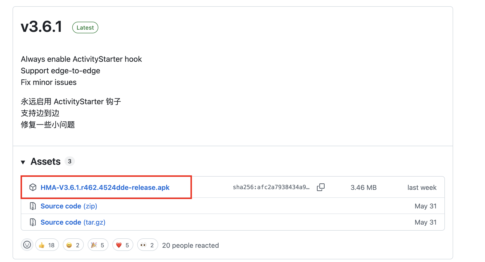
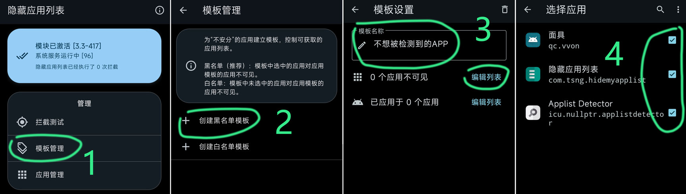
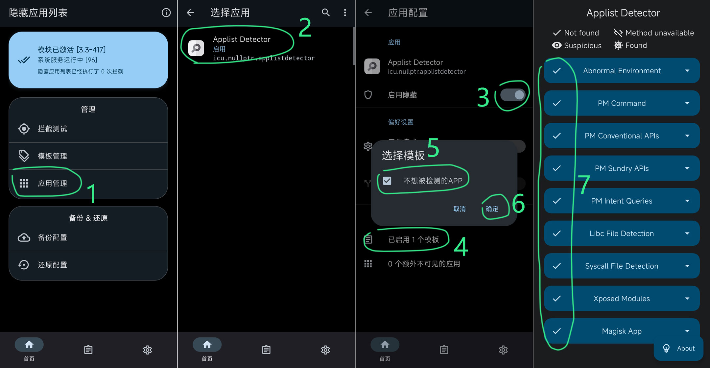

隐藏三步曲：1、随机包名 – 2、隐藏 root – 3、隐藏应用列表

---

1、安装 隐藏应用列表：[Hide My Applist install](https://github.com/Dr-TSNG/Hide-My-Applist)

2、下载安装 检测器 [**Hide-My-Applist**](https://github.com/Dr-TSNG/Hide-My-Applist)（[GitHub](https://github.com/Dr-TSNG/Hide-My-Applist)）可以用这个 APP 测试

3、打开 隐藏应用列表 `模板管理` – `创建黑名单模板`（模板名称随意）- `编辑列表` – 把 `不想被检测到的APP` 勾上（比如像 [ROOT](https://magiskcn.com/hide-my-applist.html#)、模块这些）

创建黑名单模板

4、打开 隐藏应用列表 – 应用管理  — 选择应用 — 启用隐藏（勾选模板） 确定 – 然后打开 ApplistDetector（检测器） 看看 是否隐藏好

隐藏应用列表 启用隐藏

5、测试没问题，就可以继续 设置 其他的应用。

一般对 游戏、银行支付等 APP 启用，再勾选模板，就检测不到黑名单模板里面勾选的 APP。

