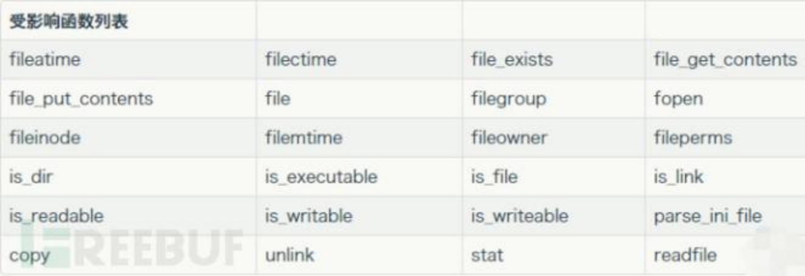

```python
类⾥⾯所有的属性的值，都是可以⾃定义的（可以定义成任何"对象"：字符串、数组、函数、另⼀
个类/对象）
利⽤pop链挖掘通法重复第⼀点
```

```python
__wakeup()  //使用unserialize时触发  ！！
__sleep()  //使用serialize时触发
__destruct()  //对象被销毁时触发    ！！
__call()  //在对象上下文中调用不可访问的方法时触发  ！！
__callStatic()  //在静态上下文中调用不可访问的方法时触发
__get()  //用于从不可访问的属性读取数据
__set()  //用于将数据写入不可访问的属性
__isset()  //在不可访问的属性上调用isset()或empty()触发
__unset()  //在不可访问的属性上使用unset()时触发
__toString()  //把类当作字符串使用时触发， file_exists()判断也会触发    ！！
__invoke()  //当脚本尝试将对象调用为函数时触发
```

网上讲php反序列化特别喜欢提的，就是php有个cve（CVE-2016-7124），就是当反序列化后的字符串中标识的成员属性数，大于实际的属性数时，会导致__wakeup方法不执行。

phar反序列化

phar反序列化就是可以在不使用php函数unserialize()的前提下，进行反序列化，从而引起的严重的php对象注入漏洞。

原理

漏洞触发点在使用phar://协议读取文件的时候，文件内容会被解析成phar对象，然后phar  对象内的Metadata信息会被反序列化。当内核调用phar_parse_metadata()解析metadata数据 时，会调用php_var_unserialize()对其进行反序列化操作，因此会造成反序列化漏洞。



[https://blog.hz2016.com/2022/04/%E3%80%90web%E3%80%91pop%E9%93%BE%E7%9A%84%E6%9E%84%E9%80%A0/](https://blog.hz2016.com/2022/04/%E3%80%90web%E3%80%91pop%E9%93%BE%E7%9A%84%E6%9E%84%E9%80%A0/)

[https://www.freebuf.com/articles/web/247930.html](https://www.freebuf.com/articles/web/247930.html)

[https://www.cnblogs.com/nice0e3/p/15395744.html](https://www.cnblogs.com/nice0e3/p/15395744.html)

[https://www.freebuf.com/articles/web/266013.html](https://www.freebuf.com/articles/web/266013.html)

[https://xz.aliyun.com/t/3674](https://xz.aliyun.com/t/3674)

