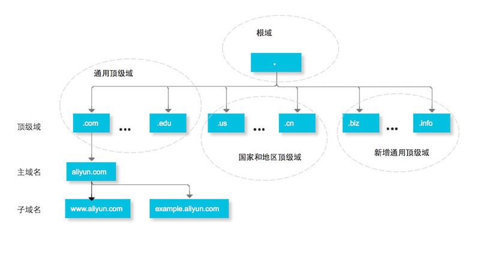
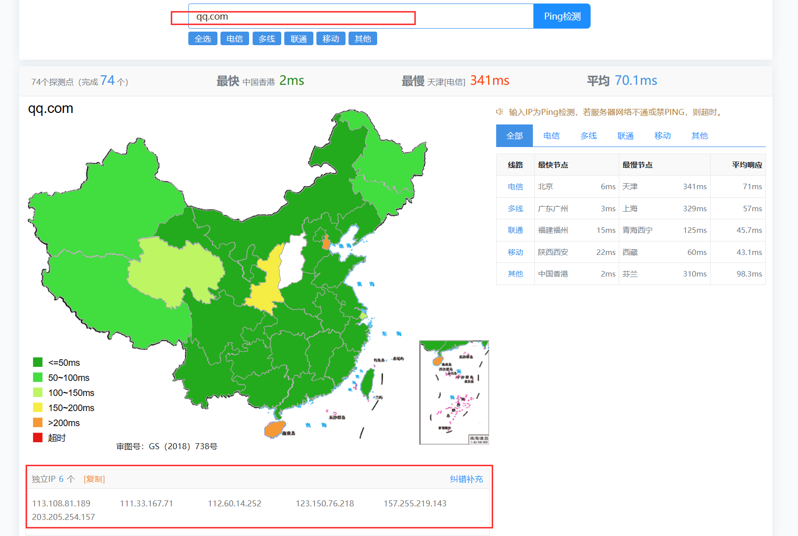
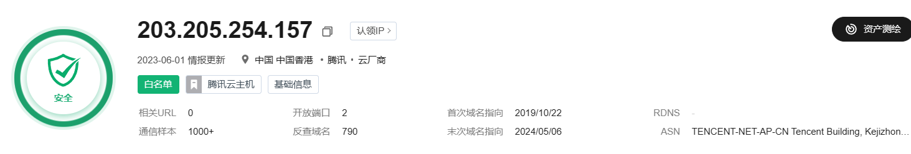
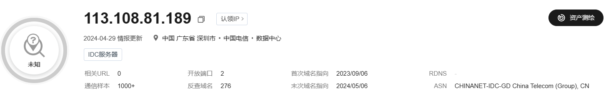

# 子域名
## 什么是子域名
<font style="color:rgb(24, 24, 24);">域名可以划分为各个子域，子域还可以继续划分为子域的子域，这样就形成了顶级域、主域名、子域名等。  
</font>

<font style="color:rgb(24, 24, 24);">举例：</font>

+ <font style="color:rgb(24, 24, 24);">“.com”是顶级域名（一级域名）；</font>
+ <font style="color:rgb(24, 24, 24);">“aliyun.com”是主域名（二级域名）；</font>
+ <font style="color:rgb(24, 24, 24);">“example.aliyun.com”是子域名（三级域名）；</font>
+ <font style="color:rgb(24, 24, 24);">“www.example.aliyun.com”是子域名的子域（四级域名）。</font>

## 如何获得子域名
### 子域名爆破(主动)
#### 子域名挖掘机
##### 下载
[http://pan.sunwu.world:5244/d/%E7%BD%91%E7%9B%98/%E7%99%BE%E5%BA%A6%E7%BD%91%E7%9B%98/%E8%BD%AF%E4%BB%B6%E5%A4%A7%E5%85%A8/%E6%B8%97%E9%80%8F%E5%B7%A5%E5%85%B7/%E5%AD%90%E5%9F%9F%E5%90%8D%E6%94%B6%E9%9B%86/Layer%E5%AD%90%E5%9F%9F%E5%90%8D%E6%8C%96%E6%8E%98%E6%9C%BA4.2%E7%BA%AA%E5%BF%B5%E7%89%88.rar](http://pan.sunwu.world:5244/d/%E7%BD%91%E7%9B%98/%E7%99%BE%E5%BA%A6%E7%BD%91%E7%9B%98/%E8%BD%AF%E4%BB%B6%E5%A4%A7%E5%85%A8/%E6%B8%97%E9%80%8F%E5%B7%A5%E5%85%B7/%E5%AD%90%E5%9F%9F%E5%90%8D%E6%94%B6%E9%9B%86/Layer%E5%AD%90%E5%9F%9F%E5%90%8D%E6%8C%96%E6%8E%98%E6%9C%BA4.2%E7%BA%AA%E5%BF%B5%E7%89%88.rar)

##### 使用
容易死机

#### subfinder
##### 下载
[https://github.com/projectdiscovery/subfinder](https://github.com/projectdiscovery/subfinder)

##### 使用
```python
Subfinder 是一个通过使用被动在线源发现网站子域的子域发现工具。

用法：
  D:\desk\subfinder.exe [选项]

选项：
输入：
   -d, -domain string[]  要查找子域的域名
   -dL, -list string     包含要进行子域发现的域名列表的文件

来源：
   -s, -sources string[]           用于发现的特定来源（-s crtsh,github）。使用 -ls 来显示所有可用来源。
   -recursive                      仅使用可以递归处理子域的来源（例如 subdomain.domain.tld vs domain.tld）
   -all                            使用所有来源进行枚举（速度较慢）
   -es, -exclude-sources string[]  从枚举中排除的来源（-es alienvault,zoomeyeapi）

过滤：
   -m, -match string[]   要匹配的子域或子域列表（文件或逗号分隔）
   -f, -filter string[]   要过滤的子域或子域列表（文件或逗号分隔）

速率限制：
   -rl, -rate-limit int      每秒发送的最大http请求数（全局）
   -rls, -rate-limits value  以键=值格式为提供程序指定每秒发送的最大http请求数（-rls hackertarget=10/m）（默认值["github=30/m", "fullhunt=60/m", "robtex=18446744073709551615/ms", "securitytrails=1/s", "shodan=1/s", "virustotal=4/m", "hackertarget=2/s", "waybackarchive=15/m", "whoisxmlapi=50/s", "securitytrails=2/s", "sitedossier=8/m", "netlas=1/s", "github=83/m"]）
   -t int                    用于解析的并发goroutines数（仅限 -active）（默认值 10）

更新：
   -up, -update                 将 subfinder 更新到最新版本
   -duc, -disable-update-check  禁用 subfinder 的自动更新检查

输出：
   -o, -output string       要将输出写入的文件
   -oJ, -json               以 JSONL(ines) 格式编写输出
   -oD, -output-dir string  要写入输出的目录（仅限 -dL）
   -cs, -collect-sources    在输出中包含所有来源（仅限 -json）
   -oI, -ip                 在输出中包含主机 IP（仅限 -active）

配置：
   -config string                标志配置文件（默认为 "C:\\Users\\Administrator\\AppData\\Roaming\\subfinder\\config.yaml"）
   -pc, -provider-config string  提供程序配置文件（默认为 "C:\\Users\\Administrator\\AppData\\Roaming\\subfinder\\provider-config.yaml"）
   -r string[]                   要使用的解析器的逗号分隔列表
   -rL, -rlist string            包含要使用的解析器列表的文件
   -nW, -active                  仅显示活动的子域
   -proxy string                 用于 subfinder 的 http 代理
   -ei, -exclude-ip              从域名列表中排除 IP

调试：
   -silent             仅在输出中显示子域
   -version            显示 subfinder 版本
   -v                  显示详细输出
   -nc, -no-color      在输出中禁用颜色
   -ls, -list-sources  列出所有可用来源
   -stats              报告来源统计信息

优化：
   -timeout int   超时前等待的秒数（默认值 30）
   -max-time int  等待枚举结果的分钟数（默认值 10）

```

`.\subfinder.exe -d jd.com -all -t 50 -o   jd.com.txt`

### 使用空间搜索引擎
#### 使用鹰图
##### 网址
`[https://hunter.qianxin.com/](https://hunter.qianxin.com/)`

##### 语法
`domain.suffix="jd.com"`搜索主域为`jd.com`的网站

##### 类似的空间搜索引擎
1. [https://quake.360.net/quake/#/index](https://quake.360.net/quake/#/index)
2. [https://fofa.info/toLogin](https://fofa.info/toLogin)
3. [https://www.zoomeye.org/](https://www.zoomeye.org/)
4. [https://x.threatbook.com/](https://x.threatbook.com/)
5. [https://0.zone/](https://0.zone/)

## CDN
### 什么是CDN
    1. <font style="color:rgb(34, 34, 34);">内容分发网络 (CDN) 是一个分布在不同地理位置的服务器群，用于缓存靠近最终用户的内容。CDN 可以快速传输加载互联网内容所需的资产，包括 HTML 网页、JavaScript 文件、样式表、图像和视频。</font>

### <font style="color:rgb(34, 34, 34);">CDN有什么优势</font>
    1. **<font style="color:rgb(34, 34, 34);">缩短网站加载时间</font>**<font style="color:rgb(34, 34, 34);"> </font><font style="color:rgb(34, 34, 34);">– 通过将内容分发到访问者附近的 CDN 服务器（以及其他优化措施），访问者体验到更快的页面加载时间。由于访问者更倾向于离开加载缓慢的网站，CDN 可以降低跳出率并增加人们在该网站上停留的时间。换句话说，网站速度越快，用户停留的时间越长。</font>
    2. **<font style="color:rgb(34, 34, 34);">减少带宽成本</font>**<font style="color:rgb(34, 34, 34);"> </font><font style="color:rgb(34, 34, 34);">– 网站托管的带宽消耗成本是网站的主要费用。通过缓存和其他优化，CDN 能够减少源服务器必须提供的数据量，从而降低网站所有者的托管成本。</font>
    3. **<font style="color:rgb(34, 34, 34);">增加内容可用性和冗余</font>**<font style="color:rgb(34, 34, 34);"> </font><font style="color:rgb(34, 34, 34);">– 大流量或硬件故障可能会扰乱正常的网站功能。由于 CDN 具有分布式特性，因此与许多源服务器相比，CDN 可以处理更多流量并更好地承受硬件故障。</font>
    4. **<font style="color:rgb(34, 34, 34);">改善网站安全性</font>**<font style="color:rgb(34, 34, 34);"> – CDN 可以通过提供 </font>[DDoS 缓解](https://www.cloudflare.com/learning/ddos/ddos-mitigation/)<font style="color:rgb(34, 34, 34);">、安全证书的改进以及其他优化措施来提高安全性。</font>

### CDN如何绕过
    1. 多地 ping 看是否有 cdn 
        1. 网站
            1. [https://ping.chinaz.com/](https://ping.chinaz.com/)
        2. 使用
            1. 发现获得多个ip，其中可能是cdn也可能是真实ip  

            2. 使用微步进行查看ip情报  

            3. 很明显`203.205.254.157`是qq.com的ip，其他的不确定
    2. ⼆级域名可能不会做 cdn 
    3. nslookup http://xxx.com 国外 dns 
    4. 查找域名历史解析记录，因为域名在上 CDN 之前⽤的 IP ，很有可能就是 CDN 的真实源 IP 地
    5. phpinfo 上显示的信息 
    6. cloudflare github 可以获取真实 IP 
    7. ⼀个⽹站有 icon 可以根据 icon hash 来查找真实 IP 
    8. ⼦域名绑定 测试⼦域可能回源  
    9. 谷歌镜像可能可以找到真实ip
    10. 等

## 泛解析
### 什么是泛解析
    1. <font style="color:rgb(25, 27, 31);">泛解析也叫“泛域名解析”，是指，利用通配符 * （星号）来做子域名以实现所有的子域名均指向同一IP地址。</font>[例如您的域名是example.com](https://link.zhihu.com/?target=http%3A//%25E4%25BE%258B%25E5%25A6%2582%25E6%2582%25A8%25E7%259A%2584%25E5%259F%259F%25E5%2590%258D%25E6%2598%25AFexample.com)<font style="color:rgb(25, 27, 31);">：做一个*.example.com的次级域名A记录指向111.111.111.111，那么生效后当访问者无论是输入“</font>[123.example.com](https://link.zhihu.com/?target=http%3A//123.example.com)<font style="color:rgb(25, 27, 31);">”还是“</font>[abc.example.com](https://link.zhihu.com/?target=http%3A//abc.example.com)<font style="color:rgb(25, 27, 31);">”抑或者“</font>[123.abc.example.com](https://link.zhihu.com/?target=http%3A//123.abc.example.com)<font style="color:rgb(25, 27, 31);">”甚至是任意字符组成的子域名均会指向到111.111.111.111这个IP地址</font>

### 泛解析处理
    1. 先访问一个不存在的域名`<font style="color:rgb(17, 124, 238);">1qaz2wsx312.example.com</font>`<font style="color:#000000;">如果可以解析，说明存在泛解析</font>
    2. <font style="color:#000000;">在爆破中遇到泛解析，需要与上面的解析出来的ip进行对比，如果一样就排除即可</font>

