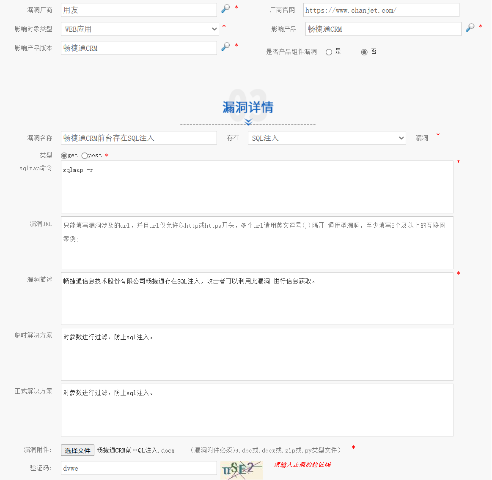

# CNVD提交地址
[https://www.cnvd.org.cn/user/mynews](https://www.cnvd.org.cn/user/mynews)

# 报告编写
[恩碩科技股份有限公司ENS610EXT存在弱口令.docx](https://www.yuque.com/attachments/yuque/0/2025/docx/26698826/1751776856924-832adfdc-3226-487a-8762-2bcb4434390c.docx)

[用友时空-SQL注入漏洞3.docx](https://www.yuque.com/attachments/yuque/0/2025/docx/26698826/1751776857172-9ab97c84-5087-4e43-a0b3-ceeffd713581.docx)

## 报告细节
### 报告命名
#### xx公司存在xx漏洞.docx
### 漏洞描述
##### xx公司xx平台存在xx漏洞，加上漏洞危害
### 漏洞影响
#### 网站标题
#### 最好可以有个截图，用于证明这个网站用的该公司的产品
### 漏洞位置
##### 完整uri
### 漏洞复现
##### ip地址
##### 漏洞poc/数据包
##### 漏洞截图
漏洞复现切记步骤越简单越好

### 其余ip地址(7个)(在审查员前三个复现失败时会被测试)
### 漏洞修复(谷歌搜一个就行)
# 漏洞提交

根据报告进行详细填写

漏洞url切记按照格式走

# 漏洞等待
漏洞一般有几个阶段

### 阶段
1. 一级审核
2. 二级审核
3. 验证
4. 处置
5. 验证
6. 处置
7. 三级审核
8. 漏洞归档

全程一般半个月一级审核，3个月内归档

