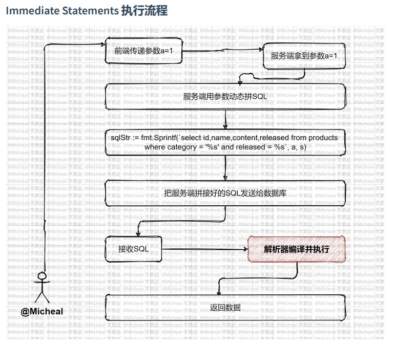
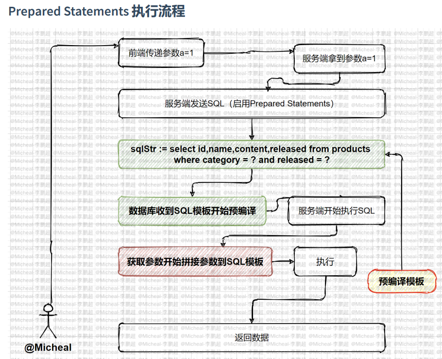

# SQL注入漏洞成因
+ 用户能控制传参
+ SQL语句中拼接了用户传参的内容、
+ 拼接后的SQL语句必须等在数据库中方执行

# 2.3.4.1 什么是预编译？
1.  普通的SQL语句执行过程: 
    1. 客户端对SQL语句进行占位符替换得到完整的SQL语句 
    2. 客户端发送完整SQL语句到MySQL服务端 
    3. MySQL服务端执行完整的SQL语句并将结果返回给客户端
    4. <font style="color:#E8323C;">一次编译，单次运行，此类普通语句被称作 Immediate Statements （即时 SQL） </font>
    5. 
2. 预编译执行过程： 
    1.  把SQL语句分成两部分，命令部分与数据部分 
    2. 先把命令部分发送给MySQL服务端，MySQL服务端进行SQL预编译
    3.  然后把数据部分发送给MySQL服务端，MySQL服务端对SQL语句进行占位符替换
    4.  MySQL服务端执行完整的SQL语句并将结果返回给客户端  
    5. <font style="color:#E8323C;"> 所谓预编译语句就是将此类 SQL 语句中的值用占位符替代，可以视为将 SQL 语句模板化或者说参数 化，一般称这类语句叫Prepared Statements  </font>
    6. 

# **<font style="color:rgb(38, 38, 38);">2.3.4.2</font>** 预编译的好处
1. 优化MySQL服务器重复执行SQL的方法，可以提升服务器性能，提前让服务器编译，一次编 译多次执行，节省后续编译的成本  
2.  避免SQL注入  

# **<font style="color:rgb(38, 38, 38);">2.3.4.3</font>**预编译如何设置
+  # 定义预编译语句 
    - PREPARE stmt_name FROM preparable_stmt; 、
+ # 执行预编译语句 
    - EXECUTE stmt_name [USING @var_name [, @var_name] ...]; 
+ # 删除(释放)定义 
    - {DEALLOCATE | DROP} PREPARE stmt_name; 

```sql
    $u = trim($_POST['username']);
    $p = trim($_POST['password']);
    $link=mysqli_connect("localhost","root","root","security") or exit ("database connect fail ! ") ;
    mysqli_query($link,"set names utf8");
    // 使用预编译语句
    $sql = "SELECT * FROM users WHERE username = ? AND password = ?";
    $stmt = mysqli_prepare($link, $sql);
    // 绑定参数
    mysqli_stmt_bind_param($stmt, "ss", $u, $p);
    // 执行查询
    mysqli_stmt_execute($stmt);
    // 获取结果集
    $result = mysqli_stmt_get_result($stmt);
    echo $select;
```

# **<font style="color:rgb(38, 38, 38);">2.3.4.4 </font>**预编译是绝对安全的吗???
一般limit后面，和order by 后面无法进行预编译

## 2.3.4.4.1 mysql中limit[后面](https://www.leavesongs.com/PENETRATION/sql-injections-in-mysql-limit-clause.html)如何进行sql注入
```sql
select * from users where id<100 order by id limit $a,$b;
0 procedure analyse(updatexml(1,concat(0x7e,version()),1),1)
1

版本mysql5.x
paylaod：
 select * from users where id<100 order by id limit 0 procedure analyse(updatexml(1,concat(0x7e,version()),1),1)#,1;
```

## **<font style="color:rgb(38, 38, 38);">2.3.4.4.1 mysql中order by后面如何注入</font>**
```sql
select * from admin order by $a;
select * from admin order by if((substr((select user()),1,1)='r1'),username,password);
```


