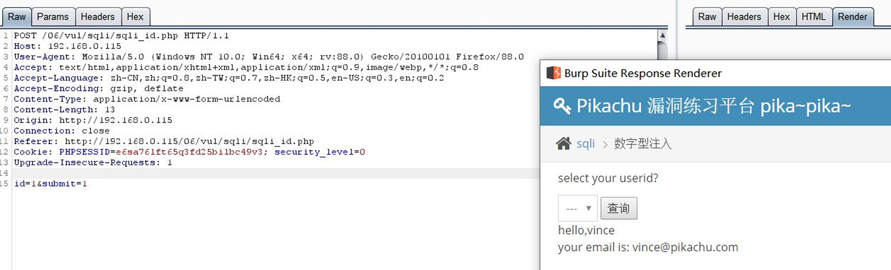
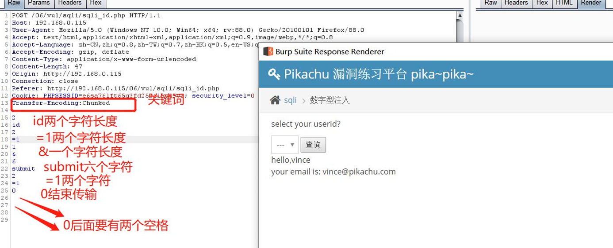
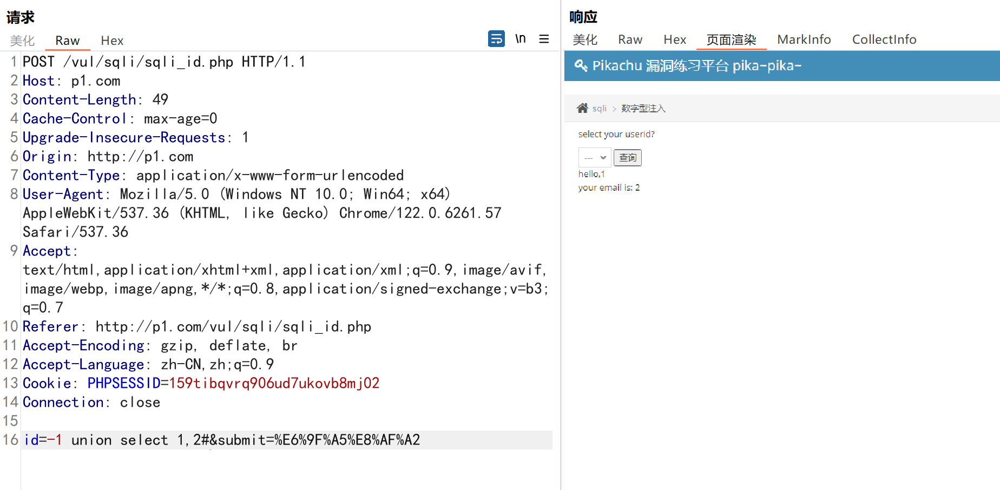
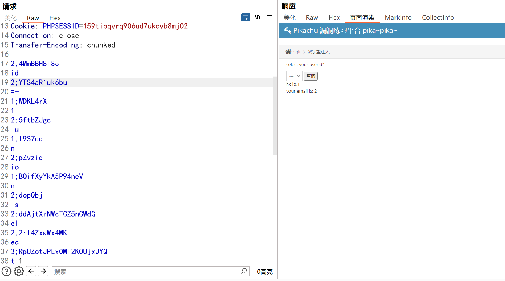

#  一、什么是chunked编码？ 
分块传输编码（Chunkedtransfer encoding）是只在 HTTP 协议 1.1版本（HTTP/1.1） 中提供的一种数据传送机制。以往HTTP的应答中数据是整个一起发送的，并在 应答头里Content-Length 字段标识了数据的长度，以便客户端知道应答消息的结 束。 

传统的Content-length 解决方案：计算实体长度，并通过头部告诉对方。浏览器 可以通过 Content-Length 的长度信息，判断出响应实体已结束 

Content-length 面临的问题：由于 Content-Length 字段必须真实反映实体长度， 但是对于动态生成的内容来说，在内容创建完之前，长度是不可知的。 

这时候要想准确获取长度，只能开一个足够大的 buffer，等内容全部生成好再计 算。这样做一方面需要更大的内存开销，另一方面也会让客户端等更久。 

我们需要一个新的机制：不依赖头部的长度信息，也能知道实体的边界——分块 编码（Transfer-Encoding: chunked）。 

对于动态生成的应答内容来说，内容在未生成完成前总长度是不可知的。因此需 要先缓存生成的内容，再计算总长度填充到Content-Length，再发送整个数据内 容。这样显得不太灵活，而使用分块编码则能得到改观。 分块传输编码允许服务器在最后发送消息头字段。例如在头中添加散列签名。

对 于压缩传输传输而言，可以一边压缩一边传输。 

# 二、如何使用chunked编码 
如果在http的消息头里Transfer-Encoding 为chunked，那么就是使用此种编码方 式。 

接下来会发送数量未知的块，每一个块的开头都有一个十六进制的数,表明这个 块的大小，然后接CRLF("\r\n")。然后是数据本身，数据结束后，还会有 CRLF("\r\n")两个字符。有一些实现中，块大小的十六进制数和CRLF之间可以 有空格。  

 最后一块的块大小为0，表明数据发送结束。最后一块不再包含任何数据，但是 可以发送可选的尾部，包括消息头字段。  

 消息最后以CRLF结尾。  

# 三、使用
1.  用burpsuite 抓包提交分析 首先原生包 id=1&submit=1查询到用户id为1的值    

2.  使用分块传输 首先在http头加上 Transfer-Encoding: chunked 表示分块传输传 送    
 第一行是长度 第二行是字符串 0表示传输结束 后面跟上两个空格。  
3.  也可以使用burpsuite的插件[chunked-coding-converter](https://github.com/c0ny1/chunked-coding-converter) 进行编码提交    
有的时候也会500报错  

