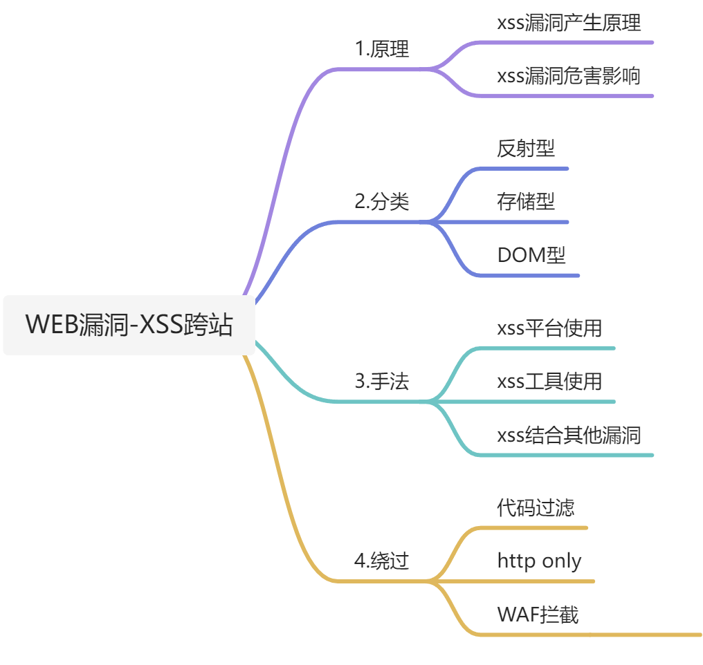
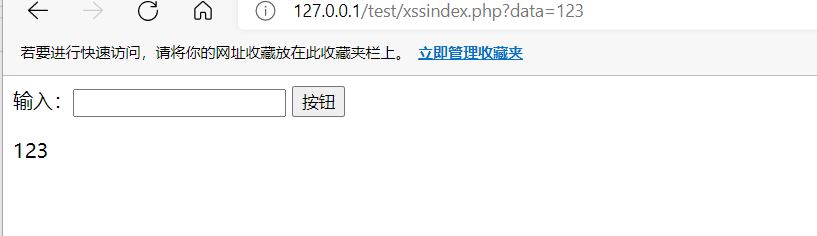
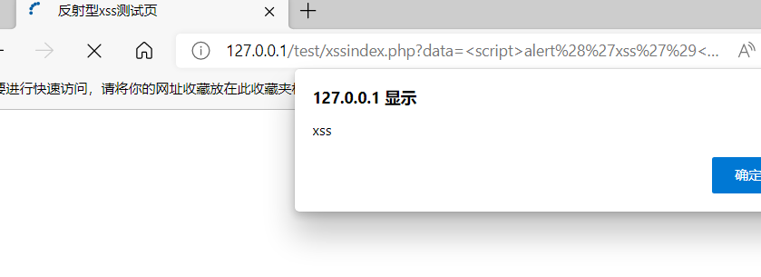
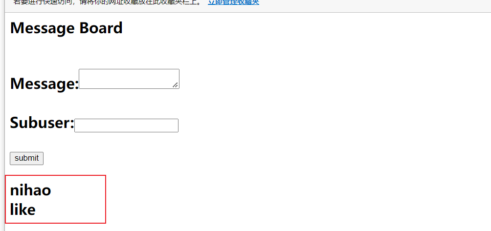
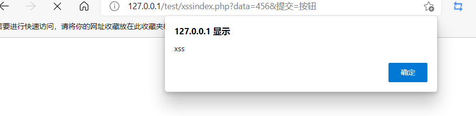
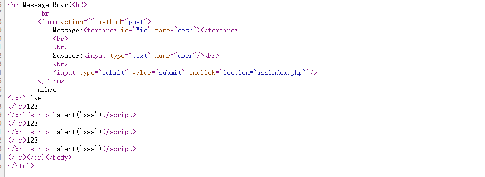
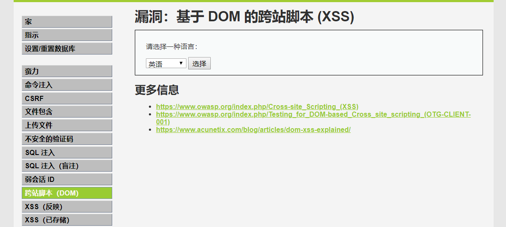
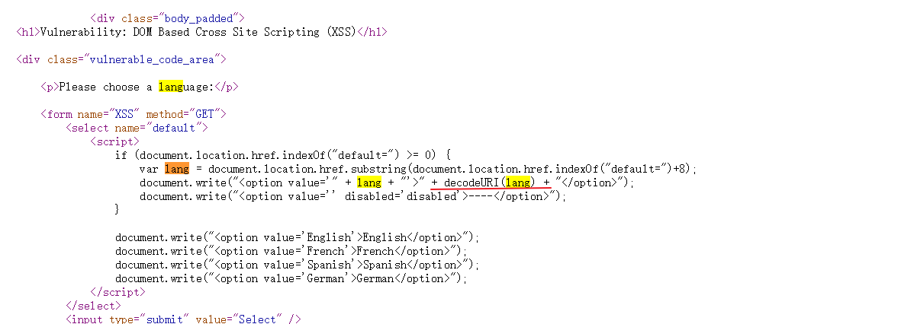
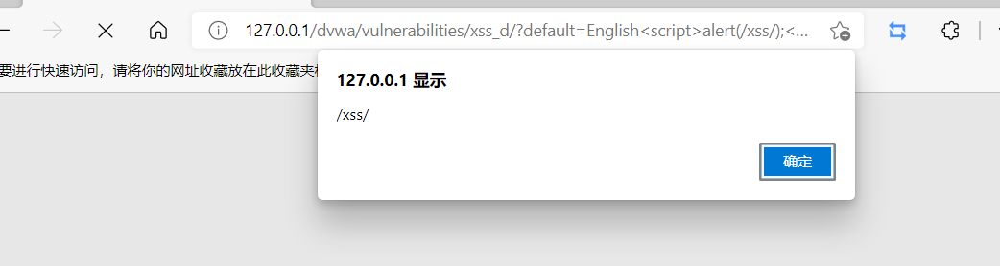

## **<font style="color:rgb(38, 38, 38);">关于XSS产生原理和分类 </font>**
<font style="color:rgb(38, 38, 38);">XSS攻击通常指的是通过利用</font>[网页](https://baike.baidu.com/item/%E7%BD%91%E9%A1%B5/99347)<font style="color:rgb(38, 38, 38);">开发时留下的漏洞，通过巧妙的方法注入恶意指令代码到网页，使用户加载并执行攻击者恶意制造的网页程序。这些恶意网页程序通常是JavaScript，但实际上也可以包括</font>`<font style="color:rgb(38, 38, 38);">Java</font>`<font style="color:rgb(38, 38, 38);">、 </font>`<font style="color:rgb(38, 38, 38);">VBScript</font>`<font style="color:rgb(38, 38, 38);">、</font>`<font style="color:rgb(38, 38, 38);">ActiveX</font>`<font style="color:rgb(38, 38, 38);">、</font>`<font style="color:rgb(38, 38, 38);">Flash</font>`<font style="color:rgb(38, 38, 38);"> 或者甚至是普通的</font>`<font style="color:rgb(38, 38, 38);">HTML</font>`<font style="color:rgb(38, 38, 38);">。  
</font><font style="color:rgb(38, 38, 38);">	当用户浏览该页之时，嵌入其中Web里面的</font>`<font style="color:rgb(38, 38, 38);">Script</font>`<font style="color:rgb(38, 38, 38);">代码会被执行，从而达到恶意攻击用户的目的。 xss漏洞通常是通过php的输出函数将</font>`<font style="color:rgb(38, 38, 38);">javascript</font>`<font style="color:rgb(38, 38, 38);">代码输出到</font>`<font style="color:rgb(38, 38, 38);">html</font>`<font style="color:rgb(38, 38, 38);">页面中，通过用户本地浏览器执行的，所以xss漏洞关键就是</font>**<font style="color:rgb(38, 38, 38);">寻找参数未过滤的输出函数</font>**<font style="color:rgb(38, 38, 38);">。</font>

### **<font style="color:rgb(38, 38, 38);">反射型XSS：</font>**
<font style="color:rgb(38, 38, 38);">又称非持续型XSS，将用户提交的而已代码(可以是参数也可以是数据)直接交给后端处理，然后返回结果给当前页面，攻击者可以事先构造好攻击连接，然后欺骗用户去点击才能触发XSS代码，（</font><font style="color:rgb(64, 64, 64);">服务器中没有这样的页面和内容），一般容易出现在搜索页面</font><font style="color:rgb(38, 38, 38);">  
</font><font style="color:rgb(64, 64, 64);">但是可能受浏览器内核，版本等限制，导致无法执行</font>

### **<font style="color:rgb(38, 38, 38);">存储型XSS：</font>**
<font style="color:rgb(38, 38, 38);">又称持续性XSS，攻击者将构造好的恶意代码或者参数，通过留言板、文章等发表内容等地方加入，此时如果没有过滤或者过滤不严谨，</font><font style="color:rgb(64, 64, 64);">那么这些代码将储存到服务器中，每当有用户访问该页面的时候都会触发代码执行，此XSS非常危险。</font><font style="color:rgb(38, 38, 38);">  
</font><font style="color:rgb(38, 38, 38);">	但存储型XSS不用考虑绕过浏览器的过滤问题，屏蔽性也要好很多。 </font>

### **<font style="color:rgb(38, 38, 38);">DOM型XSS：</font>**
<font style="color:rgb(35, 38, 59);">DOM XSS与反射性XSS、存储型XSS的主要区别在于DOM XSS的XSS代码</font><font style="color:rgb(38, 38, 38);">不需要服务端解析响应的直接参与</font><font style="color:rgb(35, 38, 59);">，触发XSS的是浏览器端的DOM解析，直接在前端解析，不需要经过后端处理。</font>

## **<font style="color:rgb(38, 38, 38);">实例演示：</font>**
### **<font style="color:rgb(38, 38, 38);">反射型XSS：</font>**
黑盒测试：比较容易通过漏洞扫描器直接发现，我们只需要按照扫描结果进行相应的验证就可以  
白盒审计：我们首先要寻找带参数的输出函数，接下来通过输出内容回溯到输入参数，观察是否过滤即可。  
这里我们选用echo()函数作为实例来分析：  
新建文件xssindex.php，写入以下代码  


```html
<html>
    <title>反射型xss测试页</title>
</html>
<body>
    <form action="" method="get" enctype="multipart/form-data">
        <label>输入：</label><input type="text" name="data">
        <input type="submit" name="提交" value="按钮">
    </form>
</body>

<?php
    $data=$_GET['data'];
    echo $data;?>
```

<font style="color:rgb(64, 64, 64);">变量</font>`<font style="color:rgb(64, 64, 64);"> $data</font>`<font style="color:rgb(64, 64, 64);"> 获取 </font>`<font style="color:rgb(64, 64, 64);">get </font>`<font style="color:rgb(64, 64, 64);">方式传递的变量名为</font>`<font style="color:rgb(64, 64, 64);">data </font>`<font style="color:rgb(64, 64, 64);">的变量值（值为一个字符串），然后直接通过</font>`<font style="color:rgb(64, 64, 64);">echo()</font>`<font style="color:rgb(64, 64, 64);">函数输出，这中间并未对用户输入进行任何过滤。</font><font style="color:rgb(38, 38, 38);">  
</font><font style="color:rgb(64, 64, 64);">就会导致，提交的恶意代码直接被执行</font><font style="color:rgb(38, 38, 38);">  
</font><font style="color:rgb(64, 64, 64);">输入</font>`<font style="color:rgb(64, 64, 64);">'123'</font>`<font style="color:rgb(64, 64, 64);">，页面echo返回</font>`<font style="color:rgb(64, 64, 64);">'123'</font>`<font style="color:rgb(38, 38, 38);">  
</font>

<font style="color:rgb(38, 38, 38);">  
</font><font style="color:rgb(38, 38, 38);">构造</font><font style="color:rgb(38, 38, 38);"><script>alert('xss')</script></font><font style="color:rgb(38, 38, 38);">JS代码，成功执行</font><font style="color:rgb(38, 38, 38);">  
</font>

<font style="color:rgb(38, 38, 38);background-color:rgb(245, 245, 245);">  
</font>

### **<font style="color:rgb(38, 38, 38);">存储型XSS：</font>**
<font style="color:rgb(38, 38, 38);">和反射性XSS的即时响应相比，存储型XSS则需要先把利用代码保存在比如数据库或文件中，当web程序读取利用代码时再输出在页面上执行利用代码。  
</font><font style="color:rgb(38, 38, 38);">再次打开</font>`<font style="color:rgb(38, 38, 38);">xssindex.php</font>`<font style="color:rgb(38, 38, 38);">，修改为以下内容</font>

```html

<html>
<head>
    <title>存储型xss测试页</title>
</head>
<body>
<h2>Message Board<h2>
        <br>
        <form action="" method="post">
            Message:<textarea id='Mid' name="desc"></textarea>
            <br>
            <br>
            Subuser:<input type="text" name="user"/><br>
            <br>
            <input type="submit" value="submit" onclick='loction="xssindex.php"'/>
        </form>
        <?php
        if(isset($_POST['user'])&&isset($_POST['desc'])){
            $log=fopen("sql.txt","a");
            fwrite($log,$_POST['user']."\r\n");
            fwrite($log,$_POST['desc']."\r\n");
            fclose($log);
        }

        if(file_exists("sql.txt"))
        {
            $read= fopen("sql.txt",'r');
            while(!feof($read))
            {
                echo fgets($read)."</br>";
            }
            fclose($read);
        }
        ?>
</body>
</html>
```

<font style="color:rgb(64, 64, 64);">存储型XSS的白盒审计同样要寻找未过滤的输入点和未过滤的输出函数。</font><font style="color:rgb(38, 38, 38);">  
</font><font style="color:rgb(64, 64, 64);">打开</font>`<font style="color:rgb(38, 38, 38);">127.0.0.1/test/xssindex.php</font>`<font style="color:rgb(38, 38, 38);">，随意输入内容  
</font>



<font style="color:rgb(38, 38, 38);">构造利用代码，在Message输入</font>`<font style="color:rgb(38, 38, 38);"><script>alert('xss')</script></font>`<font style="color:rgb(38, 38, 38);">,成功弹窗  
</font>



<font style="color:rgb(38, 38, 38);">  
</font><font style="color:rgb(38, 38, 38);">再次刷新页面，重新访问，因为利用代码已经写入数据库，仍然弹窗</font><font style="color:rgb(38, 38, 38);">  
</font><font style="color:rgb(38, 38, 38);">查看网页源代码：</font><font style="color:rgb(38, 38, 38);">  
</font>



<font style="color:rgb(38, 38, 38);">  
</font><font style="color:rgb(38, 38, 38);">持续性XSS，一次提交终生受益U•ェ•U</font>

### **<font style="color:rgb(38, 38, 38);">DOM型XSS：</font>**
<font style="color:rgb(77, 77, 77);">与普通XSS不同，</font>`<font style="color:rgb(77, 77, 77);">DOM XSS</font>`<font style="color:rgb(77, 77, 77);">是在浏览器的解析中改变页面</font>`<font style="color:rgb(77, 77, 77);">DOM树</font>`<font style="color:rgb(77, 77, 77);">，且恶意代码并不在返回页面源码中回显。所以无法通过特征匹配来检测DOM XSS，给自动化检测造成了很大困扰。</font><font style="color:rgb(38, 38, 38);">  
</font><font style="color:rgb(77, 77, 77);">本地搭建</font>`<font style="color:rgb(38, 38, 38);">dvwa</font>`<font style="color:rgb(38, 38, 38);">后，打开</font>`<font style="color:rgb(38, 38, 38);">DOM XSS</font>`<font style="color:rgb(38, 38, 38);">  
</font>



<font style="color:rgb(38, 38, 38);">  
</font><font style="color:rgb(77, 77, 77);">查看源代码，可以看到</font>`<font style="color:rgb(77, 77, 77);">indexOf</font>`<font style="color:rgb(77, 77, 77);">检索到</font>`<font style="color:rgb(77, 77, 77);">default</font>`<font style="color:rgb(77, 77, 77);">字符串后，可进行</font>`<font style="color:rgb(77, 77, 77);">document.write</font>`<font style="color:rgb(77, 77, 77);">的拼接操作</font><font style="color:rgb(38, 38, 38);">  
</font>



<font style="color:rgb(38, 38, 38);">  
</font><font style="color:rgb(38, 38, 38);">构造利用代码，</font>`[http://127.0.0.1/dvwa/vulnerabilitie](http://127.0.0.1/dvwa/vulnerabilitie)<font style="color:rgb(38, 38, 38);">s/xss_d/?default=English<script>alert(/xss/);</script></font>`<font style="color:rgb(38, 38, 38);">  
</font>



<font style="color:rgb(38, 38, 38);">  
</font>  
 


