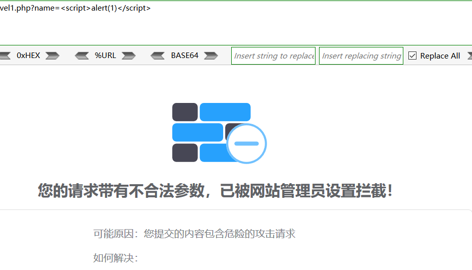
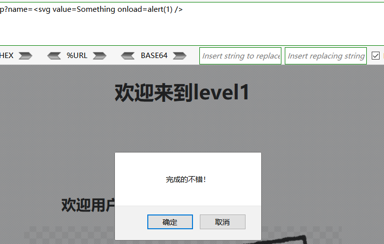
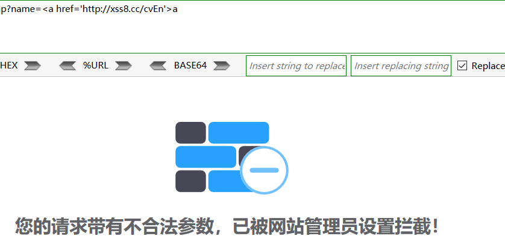
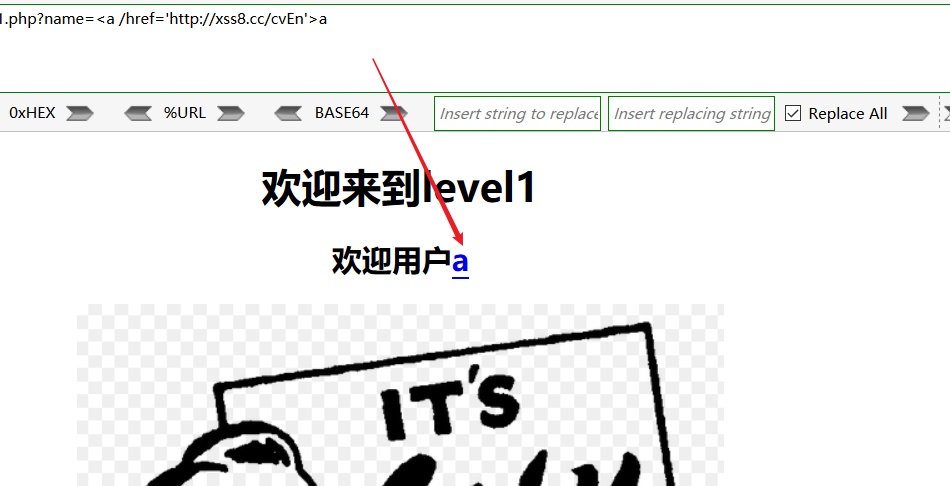
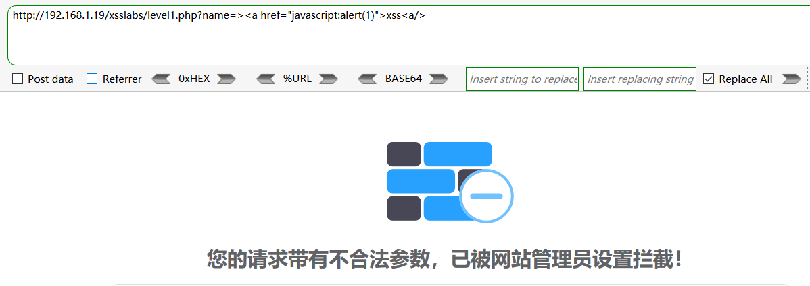
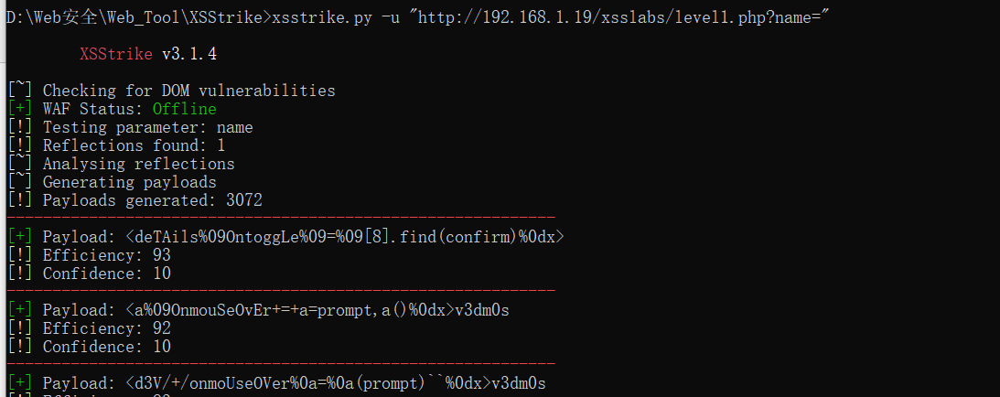
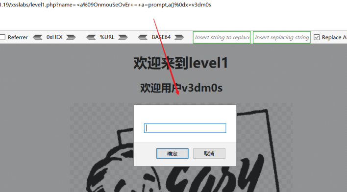
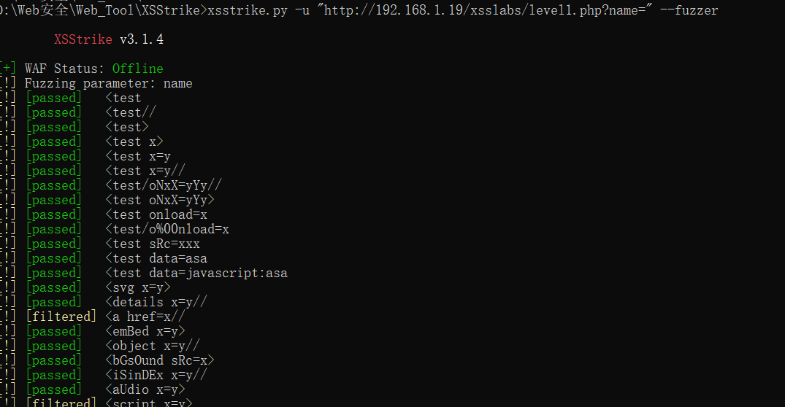
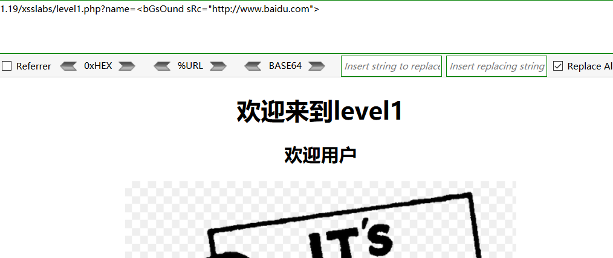
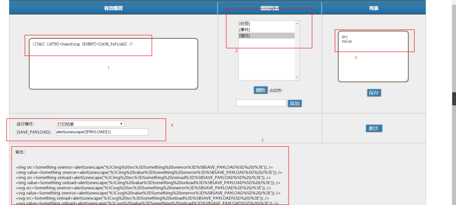

## **常规手工测试XSS绕过WAF**
1标签语法替换     
原payload：``，被WAF拦截，方式更换标签语法  

  
payload：`<svg value=Something onload=alert(1) />`，成功绕过WAF  

  
2特殊符号干扰  
原payload：`<a href='[http://xss8.cc/cvEn'>a](http://xss8.cc/cvEn'%3Ea)`，被WAF拦截，尝试增加特殊符号进行干扰  

  
WAF检测得话一般不会检测`href`里的东西，一般检测的是开头的<a>标签和href属性，我们在href前面加上`/`进行干扰，为什么是`/`呢？  
一般在javasrcipt和html中`/`代表着结束，所以让它误以为这里已经结束了  
payload：`<a /href='[http://xss8.cc/cvEn'>a](http://xss8.cc/cvEn'%3Ea)`  

  
3提交方式更改  
这个测试方法有些局限，因为有的时候管理员并没有设置`POST`方式提交的xss语句，规则只是针对于`GET`方式的检测，所以我们可以钻这个空字，更改提交方式来进行绕过  
4垃圾数据溢出  
不断添加垃圾数据 来干扰WAF的过滤  
5加密解密算法  
将`WAF`用来检测的一些关键字等，使用编码来混淆  
6配合其他漏洞绕过

## **自动化测试XSS绕过WAF**
### **XSStrike**
GitHub上一款基与`python3.x`开发工具`XSStrike`，主要正对于反射、DOM XSS扫描，资源链接下方  
靶场环境：`xsslabs`	WAF：`safedog` 系统：`win7`  
目标url：`[http://192.168.1.19/xsslabs/level1.php?name=](http://192.168.1.19/xsslabs/level1.php?name=)`  

  
在python3环境下，安装`fuzzywuzzy`后直接输入`xsstrike.py`运行工具，命令参数都有提示  

  
[~]检查DOM漏洞  
[+]WAF状态：脱机  
[!] 测试参数：name  
[!] 调查发现：1  
[!] 产生的有效载荷：3072  
我们随机抽取一个`payload`验证，Payload: `<a%09OnmouSeOvEr+=+a=prompt,a()%0dx>v3dm0s`  

  
payload的执行成功！

## **Fuzzer下XSS绕过WAF**
### **xsstrike**
还是那款工具，添加`--fuzzer`参数，可以进行模糊测试  

  
[passed]是可以执行的payload，验证payload：`<bGsOund sRc=x>`  

  
由于`bgsound`标签是音频标签，所以这里没有反应，但是绕过了WAF

### **xssfuzzer**
有网页版的，也可以下至本地，原理是根据用户需求，使用js批量生成`payload`进行fuzzer测试  
`[http://xssfuzzer.com/fuzzer.html](http://xssfuzzer.com/fuzzer.html)`

  
第一个框是显示构造的`payload`的整体样式，其实"[ ]"中大写字母是可控的变量，  
第二个框是事件类型，也就是选择事件标签  
第三个框是根据二选择的事件来选择或添加属性  
第四个框是调整`payload`的具体执行代码  
第五个框是最后穷举的输出结果  
可以手写一个脚本，或者利用burp将批量生成的`payload`进行测试

## **资源链接**
XSStrike：`[https://github.com/s0md3v/XSStrike](https://github.com/s0md3v/XSStrike)`  
XSSFuzzer：`[https://github.com/NytroRST/XSSFuzzer](https://github.com/NytroRST/XSSFuzzer)`

