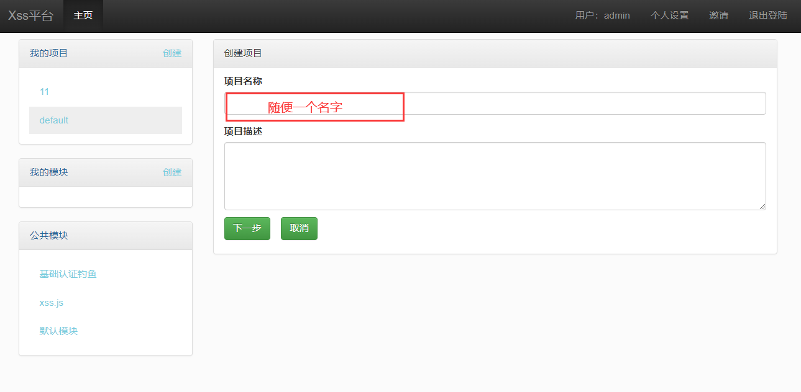
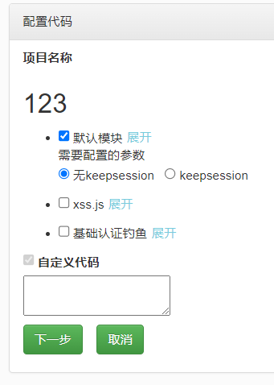
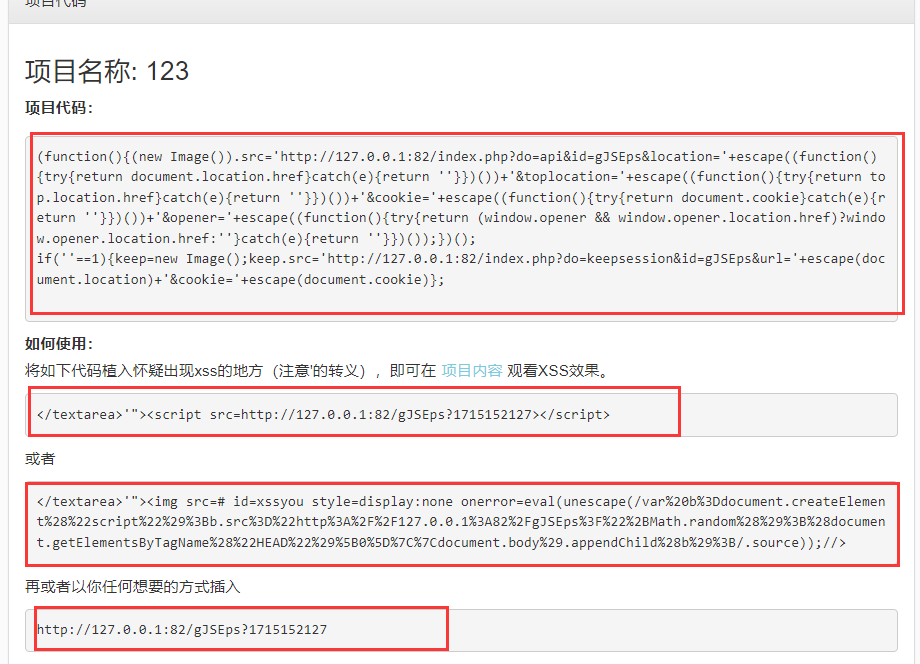
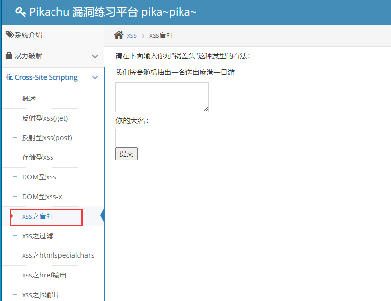
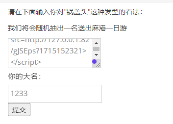
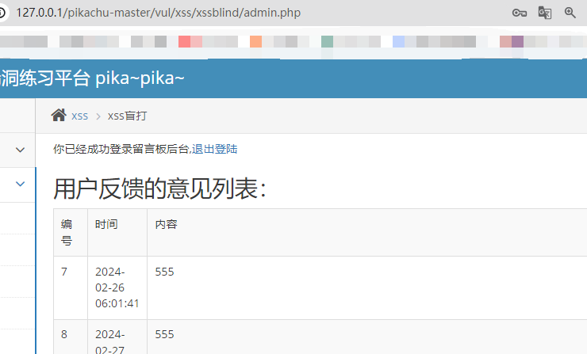
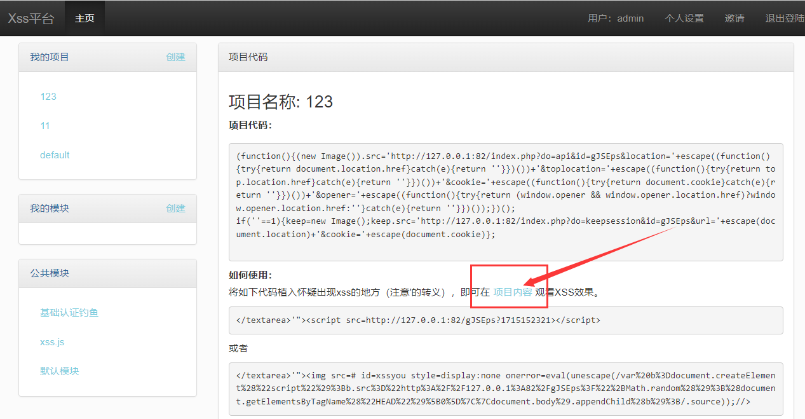
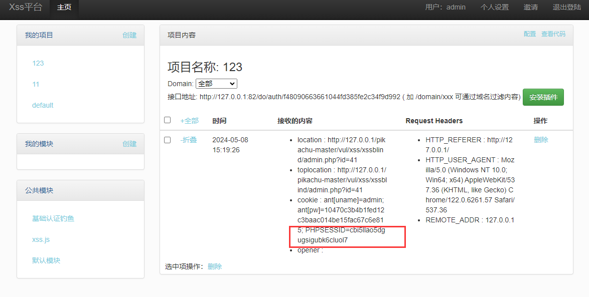

# xss平台的搭建
1. 将源码放到非中文网站目录中[www.xssme.com.zip](https://www.yuque.com/attachments/yuque/0/2025/zip/26698826/1751776858170-770cc4c2-e217-4e4e-8e84-16fe800f553c.zip)
2. 网站使用php7，apache，mysql5.7
3. 安装访问，即可

[http://127.0.0.1:82/install/step1.php](http://127.0.0.1:82/install/step1.php)

# 使用xss弹cookie
## 生成payload
1. 
2. 选第一个  

3. 复制其中随便一个payload  

## 插入payload
1. 打开pikachu靶场  

2. 插入`payload`并提交  

## 触发paylaod
1. 访问`pikachu-master/vul/xss/xssblind/admin_login.php`
2. 账号:密码= admin:123456  

## 验收cookie
1. 返回XSS平台  

2. 成功获取session值  
  
  

