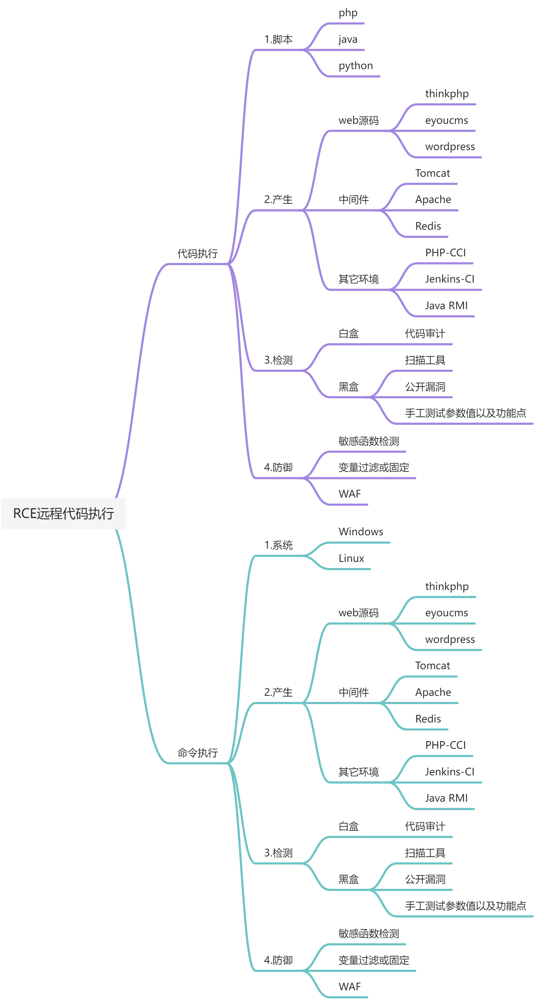

**RCE漏洞原理 **  
在一些WEB应用当中有些程序员为了考虑灵活性和简洁性，会在代码调用代码时用执行函数去处理，例如当调用一些能将字符串转化为代码的函数时，没有考虑对这个字符串做控制处理，从而导致代码执行漏洞，同样调用系统命令处理，将造成命令执行漏洞  
  
**检测和判断RCE漏洞**  
**白盒_RCE漏洞判断**  
如果是对于已知源码的检测是否存在RCE漏洞，那么只有"代码审计",重点审计可能出现代码执行漏洞的页面，功能以及参数一步步的查看、调试：  
**PHP**脚本可能造成代码执行的函数：  
1. eval()：把字符串按照PHP代码来执行，如常见的一句话木马后门。  
2. assert()：与eval()类似。  
3. preg_replace()语法：mixed preg_replace ( mixed $pattern , mixed $replacement , mixed $subject [, int $limit = -1 [, int &$count ]] )  
搜索subject中匹配pattern的部分，以replacement替换  
如果使用不当，例如@preg_replace('/abc/e',$_REQUEST['cmd'],'abcd'),原本是执行一个正则表达式的搜索和替换，但是存在危险的/e修饰符，使preg_replace()将replaceement参数当作PHP代码  
4. create_function()：主要用来创建匿名函数，如果没有严格对参数传递进行过滤，攻击者可以任意字符串传递给create_funciton()执行任意命令  
5. array_map()：函数将用户自定义函数作用到数组中的每个值上，并返回用户自定义函数作用后的带有新值的数组。 回调函数接受的参数数目应该和传递给array_map()函数的数组数目一致。  
6. call_user_func()：把第一个参数作为回调函数调用，其余参数是回调函数的参数。  
7. call_user_func_array()：调用回调函数，并把一个数组参数作为回调函数的参数  
还有调用系统命令的函数：  
system、exec、shell_exec、passthru、 pcntl_exec、popen、proc_popen  
商业应用的一些核心代码封装在二进制文件中，在web应用中通过system函数来调用：system("/bin/program --arg $arg");  
  
**Java**脚本可能造成代码执行的函数：  
在Java中能执行命令的类其实并不多,不像php那样各种的命令执行函数。在Java中目前所知的能执行命令的类也就两种,分别是Runtime和 ProcessBuilder类  
  
以及代码审计工具：  
Seay、Phpstorm、Xdebug等  
  
**黑盒_RCE漏洞判断**  
**漏扫工具**  
OpenVAS、[Tripwire IP360](https://www.tripwire.com/products/tripwire-ip360/)、[Nessus Professional](https://www.tenable.com/products/nessus/nessus-professional)、Comodo HackerProof、[Nexpose community](https://www.rapid7.com/products/nexpose/)、[Vulnerability Manager Plus](https://www.manageengine.com/vulnerability-management/)、[Nikto](https://hackertarget.com/nikto-website-scanner/)、Wiresehark、[Aircrack-ng](https://gbhackers.com/aircrack-ng-wifi-password-cracker/)、[The](https://www.beyondtrust.com/resources/datasheets/retina-network-security-scanner)[Retina](https://www.beyondtrust.com/resources/datasheets/retina-network-security-scanner)。  
利用漏洞扫描工具来探测、目标站点是否存在RCE或其他漏洞  
**手工测试**  
这个需要经验，当然没有经验有"常识"+"时间"，也是可以的，想象一下RCE漏洞可能出现的功能，对应网站是否存在这些功能，就比如一个纯展示页面的web站点，你觉得存在RCE的可能性有多大。  
当确定目标站点功能可能存在RCE执行漏洞后，就针对性查找存在的参数，查看哪些参数可变，可控等等  
**公开历史漏洞**  
从网页抓包，数据分析，或者页面来判断是何种cms，何种框架、何种中间件，然后搜索相关是否爆出过RCE漏洞，然后结合利用或复现，和前面章节思路是一样的，换了漏洞罢了。  
  
  

  
 

