**CSRF 危害：**  
●修改个人信息/帐号密码  
●发送伪造的业务请求  
●关注他人的社交帐号,推送博文  
●在用户非自愿,不知情的情况下提交请求  
●获取信用卡等信息  
**触发条件：**  
①用户某一网站处于登陆状态（即身份验证状态暂未过期）  
②用户访问了一黑客精心构造的带有特殊url访问请求的网站  
③服务器无二次身份验证机制  
  
**漏洞核心：**  
服务器对用户身份验证不够严格（即缺少二次验证（二次验证加入验证码）或者特殊的身份验证（token））  
  
**漏洞验证：**  
**一般在用户信息更新页面**，利用Burpsuite抓包，利用工具内部的功能生成CSRF的POC（这个POC也可以自定义），然后将生成的HTML代码放在一公网服务器下，由用户访问然后查看确认最后是否触发漏洞。  
  
**防御方法：**  
1设置随机Token。如果设置这个参数就不存在漏洞，一般在数据包中就可以直接判断出。（**推荐这个**）  
2检测referer来源。但是一般可伪造。

参考文章：[DVWA之CSRF(跨站请求伪造攻击)](https://blog.csdn.net/qq_36119192/article/details/82918141) | [CSRF(跨站请求伪造)](https://blog.csdn.net/qq_36119192/article/details/82820115#%EF%BC%881%EF%BC%89%E9%AA%8C%E8%AF%81%20HTTP%20Referer%20%E5%AD%97%E6%AE%B5%20%C2%A0%20%C2%A0%20%C2%A0%20%C2%A0) | [新手指南：DVWA-1.9全级别教程之CSRF](https://www.freebuf.com/articles/web/118352.html)

# **原理**
CSRF，全称Cross-site request forgery，翻译过来就是跨站请求伪造  
  
指利用受害者尚未失效的身份认证信息（cookie、会话等），诱骗其点击恶意链接或者访问包含攻击代码的页面，在受害人不知情的情况下**以受害者的身份**向（身份认证信息所对应的）服务器发送请求，从而完成非法操作(如转账、改密等）  
  
CSRF与XSS最大的区别就在于，**CSRF并没有盗取cookie而是直接利用**

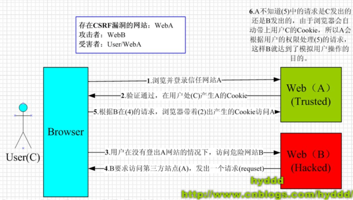

# 分析
## **Low**
先看代码，进行审计，找出为何可以CSRF  
  
$GLOBALS ：引用全局作用域中可用的全部变量。$GLOBALS 这种全局变量用于**在 PHP 脚本中的****任意位置访问全局变量**（从函数或方法中均可），PHP 在名为 $GLOBALS[index] 的数组中存储了所有全局变量。变量的名字就是数组的键  

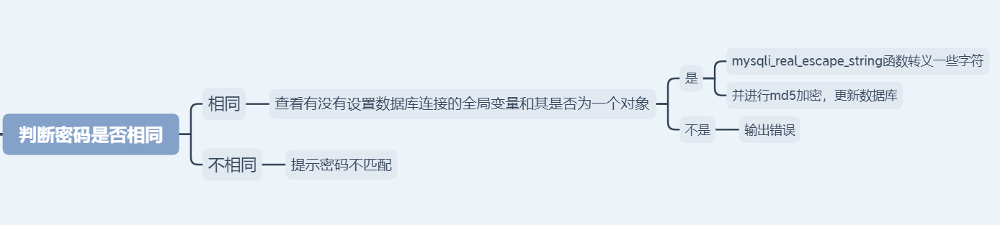

  

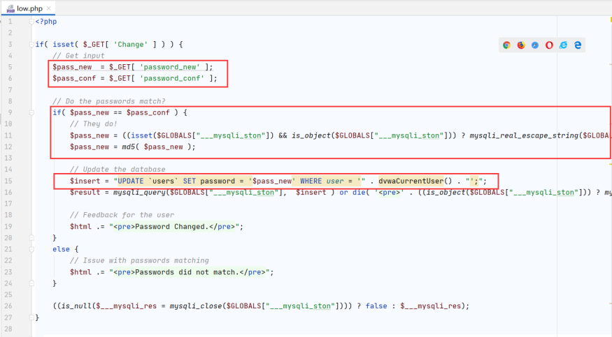

  
  
知道了上面这些信息后，直接构造链接  
[http://IP地址/dvwa/vulnerabilities/csrf/?password_new=123&password_conf=123&Change=Change#](http://192.168.10.100:81/dvwa/vulnerabilities/csrf/?password_new=123&password_conf=1223&Change=Change#)  
  
当受害者点击了这个链接，他的密码就会被改成password（这种攻击显得有些拙劣，链接一眼就能看出来是改密码的，而且受害者点了链接之后看到这个页面就会知道自己的密码被篡改了）  

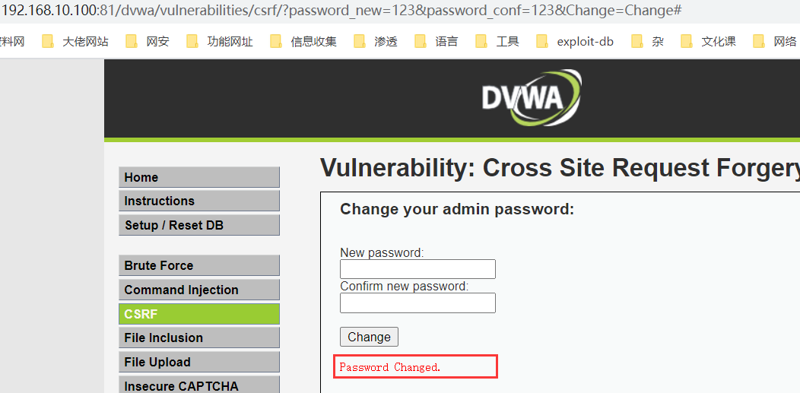

### **注意事项**
CSRF最关键的是**利用受害者的cookie向服务器发送伪造请求**  
  
所以如果受害者之前用Chrome浏览器登录的这个系统，而用火狐浏览器点击这个链接，攻击是不会触发的  
  
因为火狐浏览器**并不能利用Chrome浏览器的cookie**，所以会自动跳转到登录界面  

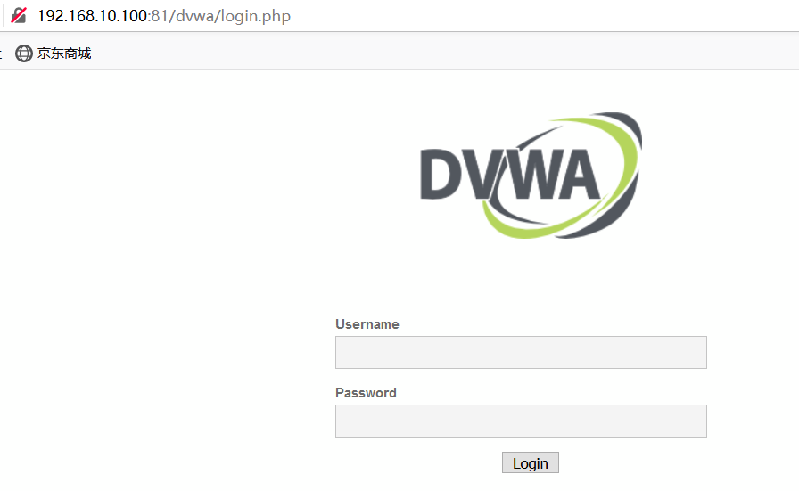

### **解决链接明显问题**
通过使用**短链接**来隐藏URL（点击短链接，会自动跳转到真实网站）：  
如[http://dwz.cn/](http://dwz.cn/)****  

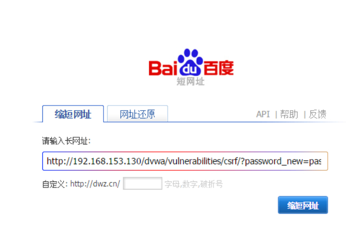

  
  
  
因为本地搭的环境，服务器域名是ip所以无法生成相应的短链接= =，实际攻击场景下**只要目标服务器的域名**不是ip，是可以生成相应短链接的  

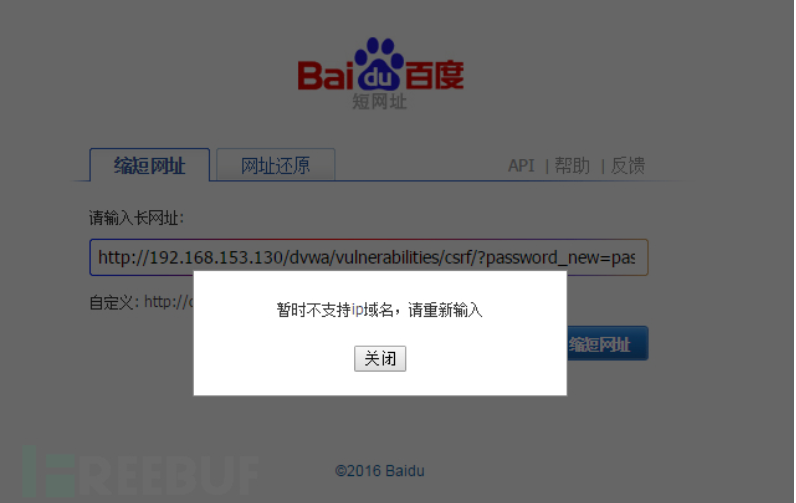

  
  
需要提醒的是，虽然利用了短链接隐藏url，但受害者**最终还是会看到密码修改成功的页面**，所以这种攻击方法也并不高明

### **解决页面显示结果问题**
通过burp自带的**csrf页面生成器**进行使用，或者自己手写个 (当然对我这种工具人来说，是不会的啦)  
  
这里就通过burp自带的csrf页面生成器做实验了  

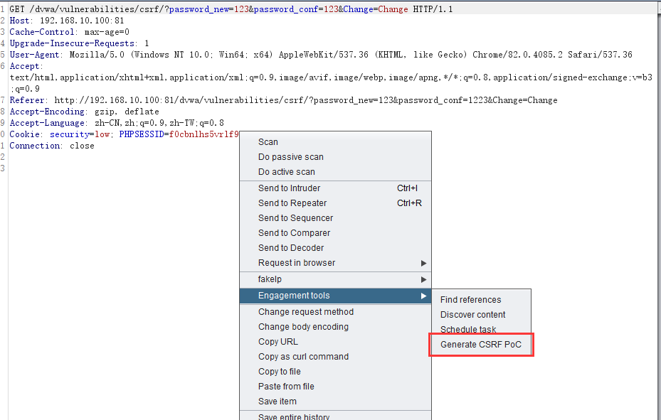

  
  
  
下面为生成的CSRF HTML，直接本地写个html，套进去打开看看（当然这里你可以选择自动提交）  

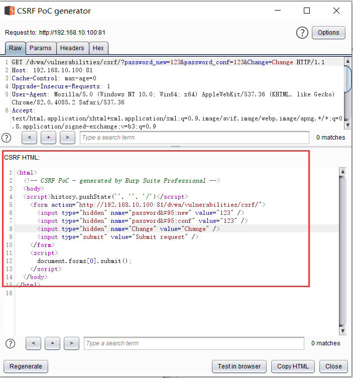

  
  
点击发送，就可以修改密码了（其实可以用CSS修改下网页，哈哈哈，我不会，就凑合着用吧）  

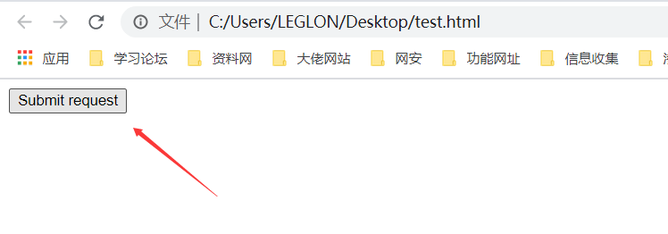

## **Medium**
老样子，先看代码，进行审计，找出为何可以CSRF  
  
其他的没怎么变，就多了个REFERER判断语句，就是说**REFERER里面必须要含有服务器名**  

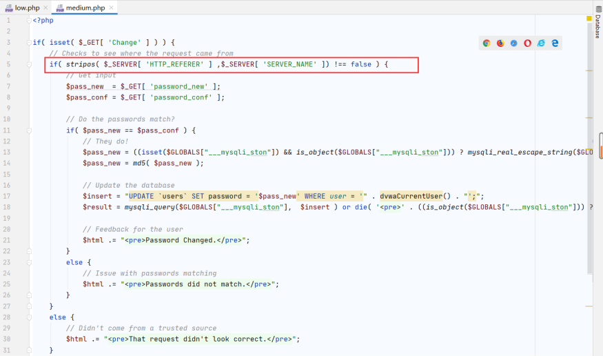

  
  
那就抓包，给它加个REFERER包，里面在含有个服务器名，就好了  

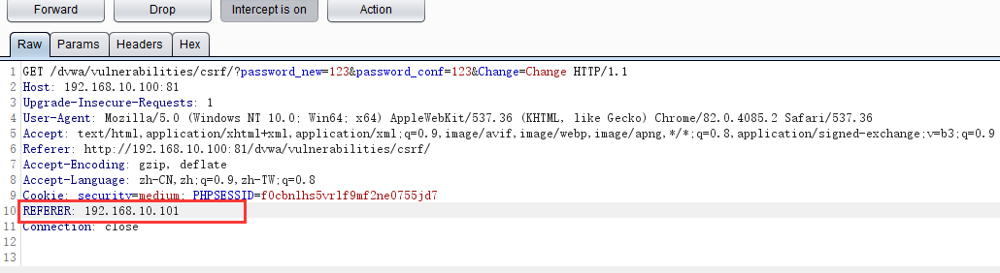

  

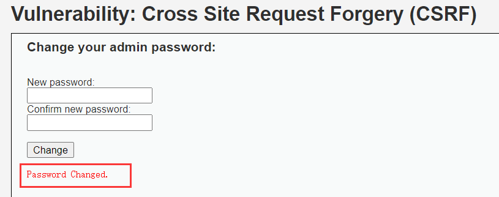

## **High**
老样子，先看代码，进行审计，找出为何可以CSRF  
  
这里添加了token值，比较安全，但是是GET请求，**token会在URL中显示**  

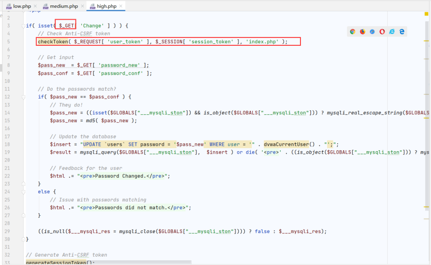  

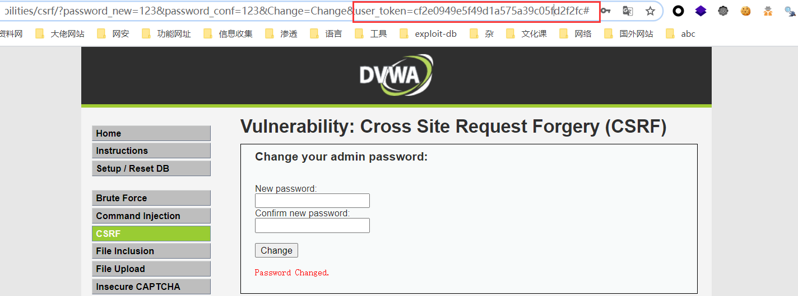  
这里写CSRF HTML的话，是修改不了用户的密码的，因为牵扯到了跨域问题  
  
大概就是执行脚本是我们自己的服务器，脚本访问的界面又是别的服务器，因为跨域原因，不能访问  

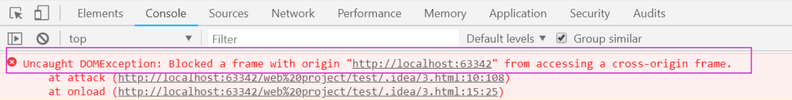  
但是可以利用存储型XSS来获取用户的token

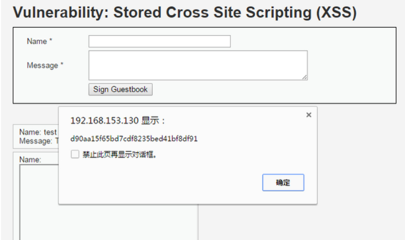  
  

### **注意事项**
这里token是**修改完密码后**才会显示的，因为跨域问题，脚本是行不通的  
所以用存储XSS来获取用户token

## **Impossible**
老样子，先看代码，进行审计，找出为何不可CSRF

通过**PDO技术**来防御SQL注入，通过**输入原密码**来防御CSRF，强！！！  

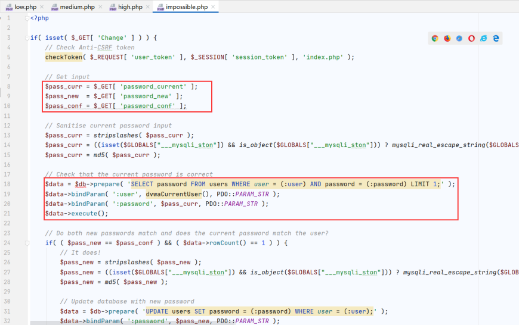

### **token讲解**
要抵御 CSRF，关键在于在请求中放入黑客所**不能伪造的信息**，并且该信息**不存在于 cookie 之中**  
  
token：访问改密页面时，**服务器返回的一个随机的值**  
  
当浏览器向服务器发起请求时，需要提交token参数，而服务器在收到请求时，**会优先检查token**，只有token正确，才会处理客户端的请求  
  
但这种方法的**难点在于如何把 token 以参数的形式加入请求**  
  
对于 **GET **请求：token 将附在请求地址之后，这样 URL 就变成 http://url?csrftoken=tokenvalue  
  
对于** POST** 请求来说，要在 form 的最后加上 ，这样就把 token 以参数的形式加入请求了  
  
 

