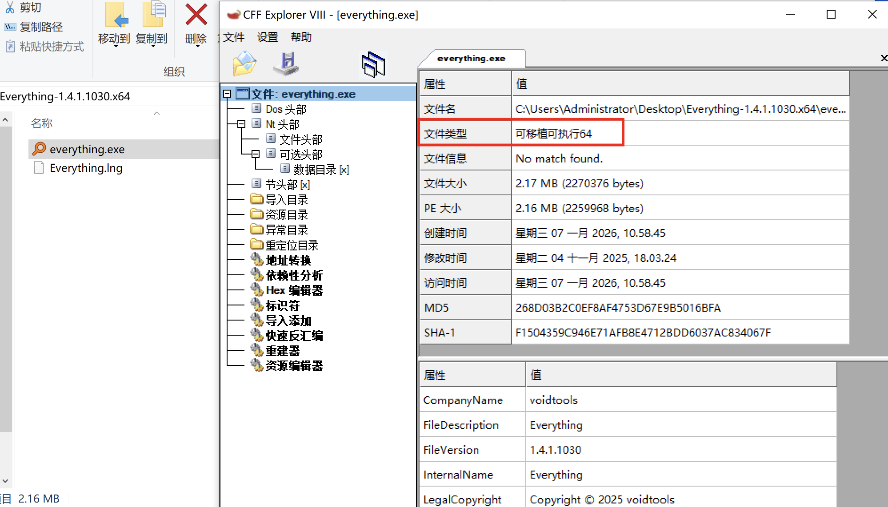
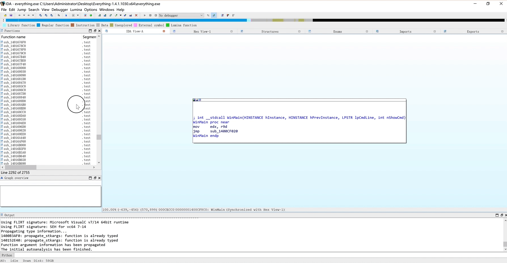
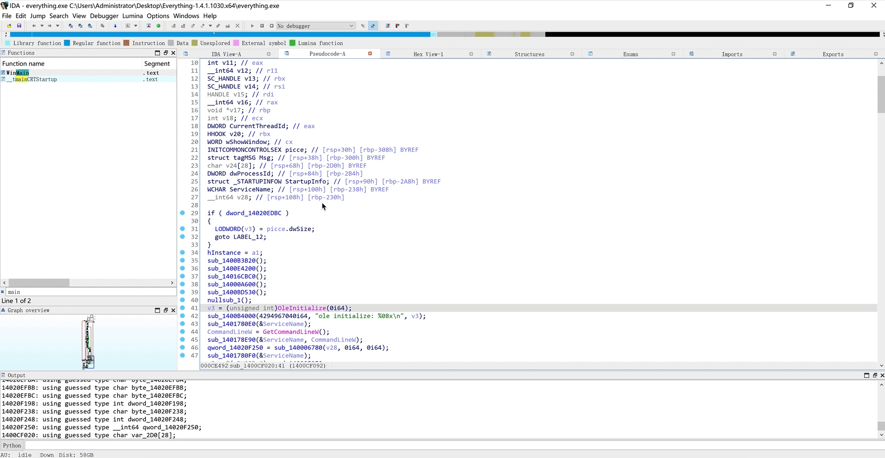
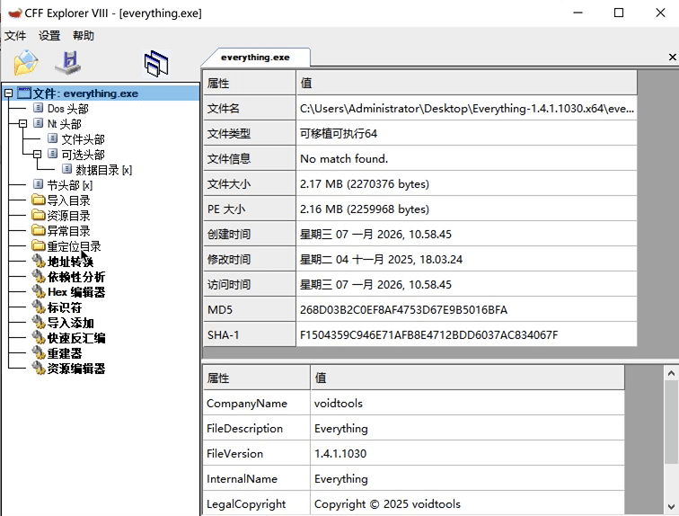
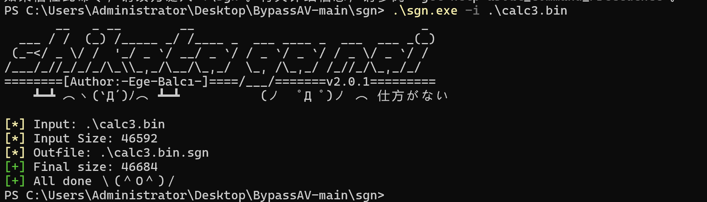
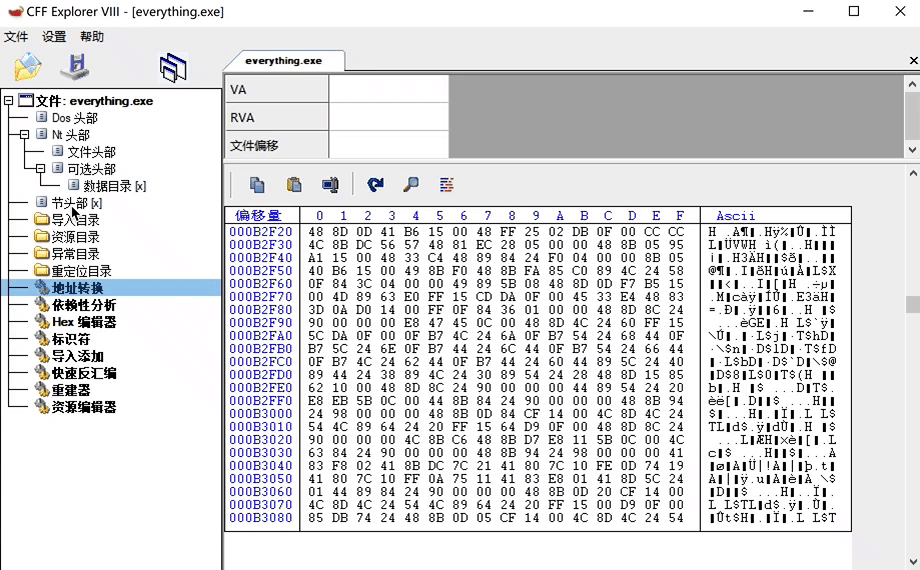

## 参考链接
[https://github.com/sunwu57/patch-study](https://github.com/sunwu57/patch-study)

[https://github.com/yinsel/BypassAV](https://github.com/yinsel/BypassAV)

[https://xz.aliyun.com/news/14518](https://xz.aliyun.com/news/14518)

[https://github.com/Neo-Maoku/expandTextSection/tree/v1.0.0](https://github.com/Neo-Maoku/expandTextSection/tree/v1.0.0)

[https://forum.butian.net/share/4085](https://forum.butian.net/share/4085)

## 大致思路
1. 通过替换 exe 文件二进制函数代码，让程序启动时执行修改后的函数代码，从而加载恶意shellcode
2. 通过修改text段，并修改OEP(程序入口点)从而免杀
3. 以上两个思路，优化可以对dll进行patch，或者是shellcode使用分离加载
4. 缺点也比较明显，虽然程序保留着原本的数字签名，但如果校验签名有效性是无法通过的
5. 优点也明显，程序有原本的数字签名、以及原本的函数

## 名词解释
### PE 文件
Windows 的可执行文件的统称，常见的 PE 文件文件拓展名有 exe、dll、sys 等，当然以它们结尾的文件不一定是 PE 文件，还需要满足一定的文件格式，这里就不细说了，上网查阅资料即可。

### VA
虚拟内存地址，即 PE 文件被操作系统加载进内存后的地址，也就是 PE 基址。

### RVA
相对虚拟地址，即加载到内存中 PE 文件的数据相对于PE 基址的距离，例如假设一个 exe 文件加载后的虚拟地址为 0x10000，exe 在内存中的某块数据地址为0x13000，则可以说这块数据的 RVA 为 0x3000。

### FOA
文件偏移地址，某块数据相对于文件头中位置。

## 工具
1. ida pro
2. CFF Explorer
3. winhex/010editor
4. Visual Studio
5. shellocde转换器
6. sgn

## 思路一实现步骤
### 寻找合适的 exe 文件
1. 打开不要求动态链接库的exe，即打开不会出现诸如此类的弹窗："由于找不到 xxx.dll，无法继续执行代码"
2. 最好64位

### 寻找可以patch 的函数
#### 将程序拖入 `IDA`，找到 `WinMain` 函数，并使用 `F5` 查看伪代码

发现有 `sub_1400B3B20();``sub_1400E4200();``sub_14016CBC0();`` sub_14000A600();``  sub_1400BD530();`等以sub开头的函数

#### 确定程序运行时，会调用以上任意一个函数
使用 `IDA` 的动态调试功能，确认`sub_1400B3B20();`是程序加载时必要的函数，其他几个都可以试试，这里以`sub_1400B3B20();`作为案例

动态调试后的函数名，无法直接进行使用，用原本的`sub_1400B3B20();`

### 获取函数对应的FOA(文件偏移)
`sub_1400B3B20();`只要`1400B3B20`填入`cff`，获得文件偏移为`B2F20`

### shellcode
#### 生成shellcode
` .\pe2shc.exe .\calc.exe  calc3.bin`

将calc转化为shellcode

`.\sgn.exe -i .\calc3.bin`

使用sgn对calc二进制文件进行混淆、进一步减少特征

### 修改段属性
修改`.text`属性为`可写入`

取消`DLL可移动`(ASLR)

记得保存文件！！！！

### 将shellcode插入程序中
使用`winhex`打开`保存后的程序`和`calc3.bin.sgn`

将`calc3.bin.sgn`二进制数据写入对应位置(文件偏移`B2F20`)

### 执行
双击`everything2.exe`弹出计算器

## 思路二实现步骤
[https://forum.butian.net/share/4085](https://forum.butian.net/share/4085)

