建议先看《js调试与jsrpc》这个

## 常⻅加密⽅式
| <font style="color:rgb(38,38,38);">加密⽅式 </font> | <font style="color:rgb(38,38,38);">对称加密 </font> | <font style="color:rgb(38,38,38);">⾮对称加密 </font> | <font style="color:rgb(38,38,38);">哈希算法</font> |
| --- | --- | --- | --- |
| 描述 | <font style="color:rgb(38,38,38);">同⼀密钥加解密</font> | <font style="color:rgb(38,38,38);">公钥加密，私钥解密</font> | 单向加密 |
| 密钥数量 | <font style="color:rgb(38,38,38);">1个（相同密钥）</font> | <font style="color:rgb(38,38,38);">2个（⼀对公钥和私钥）</font> | 无 |
| 应用场景 | <font style="color:rgb(38,38,38);">数据传输</font> | <font style="color:rgb(38,38,38);">身份认证、密钥交换、签 名</font> | <font style="color:rgb(38,38,38);">完整性校验、数字签名、密码 存储、消息认证（HMAC）、 唯⼀标识等。</font> |
| 常用算法 | <font style="color:rgb(38,38,38);">AES、DES、3DES、SM4</font> | <font style="color:rgb(38,38,38);">RSA、SM2</font> | <font style="color:rgb(38,38,38);">MD5、SHA-256、SM3</font> |


### 常⻅加密场景
1. 网站进行`RSA+AES/SM2+SM4`传输数据，其中SM4的密钥通过SM2进行加密
2. 对称加密数据包

## web端加解密函数定位
### 方法一：接口路径定位
全局搜索加密数据包对应的url

如https://

### 方法二：特殊变量名定位
### 方法三：内存漫游（主推）
#### 项目地址
[https://github.com/JSREI/ast-hook-for-js-RE](https://github.com/JSREI/ast-hook-for-js-RE)

#### 安装方法
[ast-hook-for-js-RE.zip](https://www.yuque.com/attachments/yuque/0/2025/zip/26698826/1763985677346-97272682-a7fc-4f39-9843-c87d7b788e2a.zip)

```plain
git clone https://github.com/CC11001100/ast-hook-for-js-RE.git   //windows用户建议用我的zip包，同时以管理员身份启动cmd/powershell
cd ast-hook-for-js-RE
nvm install v16.20.2
nvm use v16.20.2
npm config set strict-ssl false
npm install
npm install -g anyproxy
npm install anyproxy 
npm install -g anyproxy express body-parser shelljs crypto cheerio @babel/core @babel/types @babel/generator
npx anyproxy-ca   
安装上一步弹出的ca证书，受信任的根证书颁发机构


开俩窗口分别运行起来 
node src/api-server/api-server.js 
node src/proxy-server/proxy-server.js
浏览器流量代理到本地10086端口
```

#### 使用方法
##### 贵金属商城
[https://gjs.jybank.com.cn:58001/web/pc/#/login](https://gjs.jybank.com.cn:58001/web/pc/#/login)

1. 流量代理到本地的10086端口
2. f12进入网络，刷新页面，获取一段密文
3. 使用`hook.search("密文")`进行搜索（<font style="color:#DF2A3F;">如果没hook说明上面的流程没走成功</font>），一般第一个就是，点击链接进入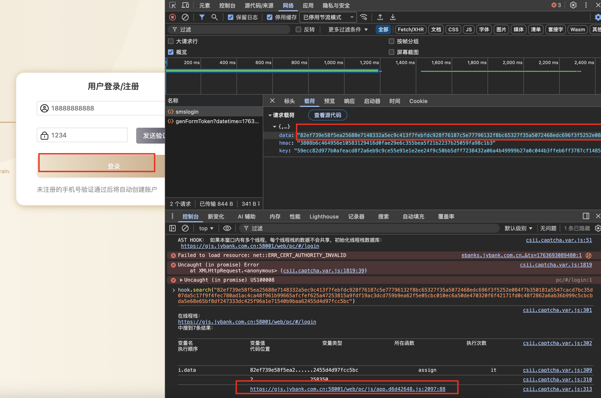
4. 跳到入图，可以发现用的关键字是`1.key``0e.doEncrypt`

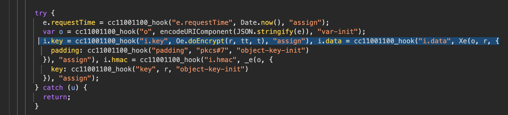

5. 取消代理，正常访问，定位关键字，断点，发包，发现成功断到明文加密位置

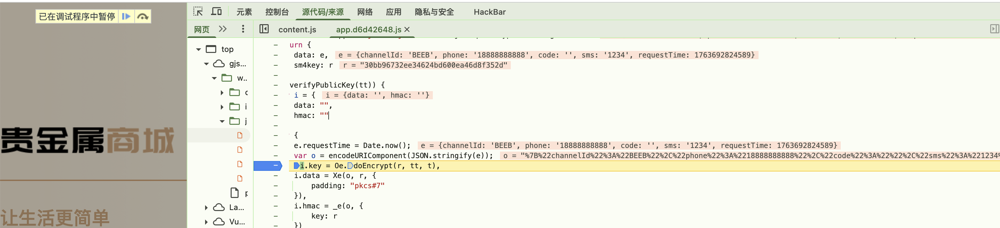

##### 集中采购管理系统
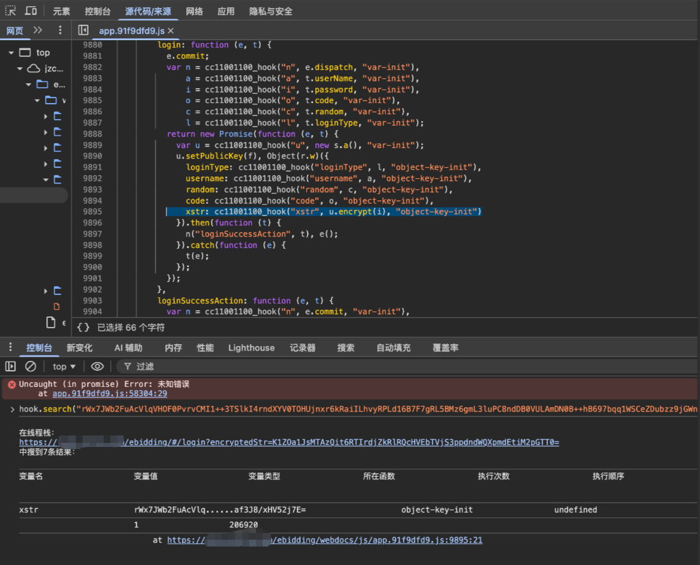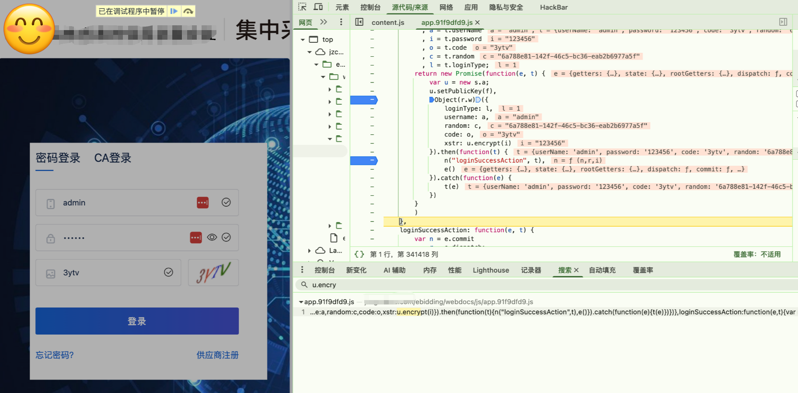

#### 方案不足
1. 环境难配
2. 如果有本地加密控件，此方法大概率失效

##### 问题排查
1. 如果控制台输入hook没动静，说明没注入成功，请检测系统代理、权限等

### 方法四-hook常见函数
#### 项目地址
[https://github.com/cilame/v_jstools](https://github.com/cilame/v_jstools)

#### 使用方法
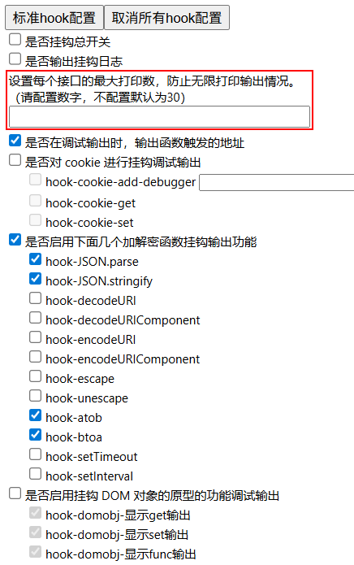

根据图中的勾选即可，由于网站开发者通常系统使用json进行数据传输，以及使用base64编码数据，这边勾上即可在编码时在浏览器控制台输出对应的加密点

1. 当提交登陆表单后，控制台打印如下内容，跟进


#### 方案不足
1. 默认只能处理最常见的编码，经常hook不到加密位置

### 方法五-栈调用
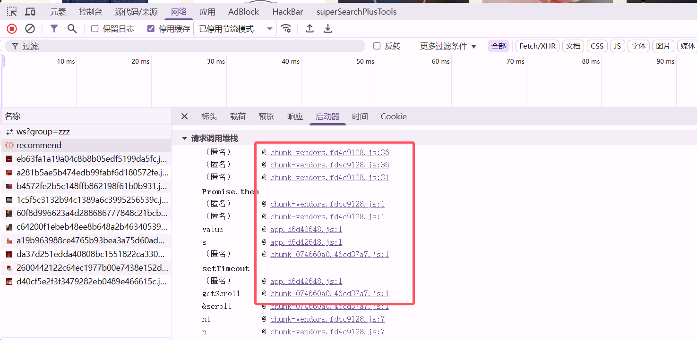

## JsRpc
#### 项目地址
[https://github.com/jxhczhl/JsRpc](https://github.com/jxhczhl/JsRpc)

JSRPC 利用 RPC 的核心思想，通过 webSocket 协议将浏览器中的 JS 函数（如加密方法）暴露为远程接口，使外部程序无需逆向分析即可直接调用。其本质是让浏览器执行原生代码，通过接口 “透传” 参数与结果，既绕过了反调试机制，又避免了重写加密逻辑，可以大大降低逆向的工作量

### 使用方法
#### 贵金属商城
##### 定位加密函数位置
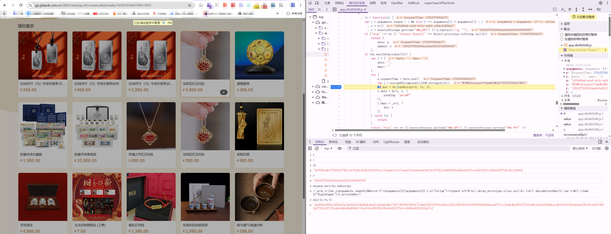

#####  简单的分析
```plain
经典sm4传输数据，sm4密钥通过sm2加密，一次一密
由于没有对sm4密钥的签名校验，这边可以固定sm4密钥，即
r = 2802575829264a2e8a92fff5d8856936
tt是sm2公钥，常量
tt = 047695c4bf78806f2790c14176d8cfb94c6cf678a11c5aa4fcc3cf1dea8110e4e0e9f9419e167921f4d50068a5454d1437bcc9d310f5c1562a2567541d511b86f4
t = 1
```

##### 使用方法
###### 启动jsrpc
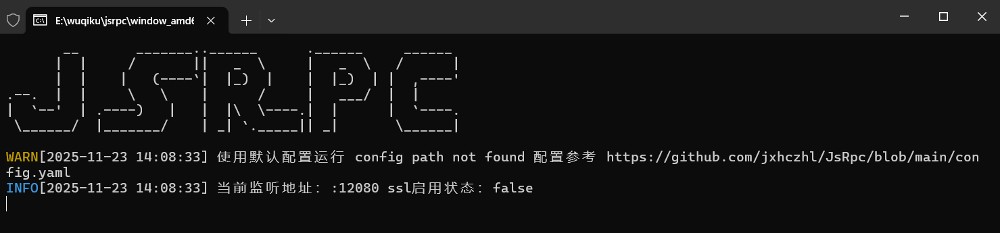

###### jsrpc注入浏览器
1. 放开断点
2. 控制台cv代码执行

```javascript
var rpc_client_id, Hlclient = function (wsURL) {
  this.wsURL = wsURL;
  this.handlers = {
    _execjs: function (resolve, param) {
      var res = eval(param)
      if (!res) {
        resolve("没有返回值")
      } else {
        resolve(res)
      }
    }
  };
  this.socket = undefined;
  if (!wsURL) {
    throw new Error('wsURL can not be empty!!')
  }
  this.connect()
}
Hlclient.prototype.connect = function () {
  if (this.wsURL.indexOf("clientId=") === -1 && rpc_client_id) {
    this.wsURL += "&clientId=" + rpc_client_id
  }
  console.log('begin of connect to wsURL: ' + this.wsURL);
  var _this = this;
  try {
    this.socket = new WebSocket(this.wsURL);
    this.socket.onmessage = function (e) {
      _this.handlerRequest(e.data)
    }
  } catch (e) {
    console.log("connection failed,reconnect after 10s");
    setTimeout(function () {
      _this.connect()
    }, 10000)
  }
  this.socket.onclose = function () {
    console.log('rpc已关闭');
    setTimeout(function () {
      _this.connect()
    }, 10000)
  }
  this.socket.addEventListener('open', (event) => {
    console.log("rpc连接成功");
  });
  this.socket.addEventListener('error', (event) => {
    console.error('rpc连接出错,请检查是否打开服务端:', event.error);
  })
};
Hlclient.prototype.send = function (msg) {
  this.socket.send(msg)
}
Hlclient.prototype.regAction = function (func_name, func) {
  if (typeof func_name !== 'string') {
    throw new Error("an func_name must be string");
  }
  if (typeof func !== 'function') {
    throw new Error("must be function");
  }
  console.log("register func_name: " + func_name);
  this.handlers[func_name] = func;
  return true
}
Hlclient.prototype.handlerRequest = function (requestJson) {
  var _this = this;
  try {
    var result = JSON.parse(requestJson)
  } catch (error) {
    console.log("请求信息解析错误", requestJson);
    return
  }
  if (result["registerId"]) {
    rpc_client_id = result['registerId']
    return
  }
  if (!result['action'] || !result["message_id"]) {
    console.warn('没有方法或者消息id,不处理');
    return
  }
  var action = result["action"], message_id = result["message_id"]
  var theHandler = this.handlers[action];
  if (!theHandler) {
    this.sendResult(action, message_id, 'action没找到');
    return
  }
  try {
    if (!result["param"]) {
      theHandler(function (response) {
        _this.sendResult(action, message_id, response);
      })
      return
    }
    var param = result["param"]
    try {
      param = JSON.parse(param)
    } catch (e) {
    }
    theHandler(function (response) {
      _this.sendResult(action, message_id, response);
    }, param)
  } catch (e) {
    console.log("error: " + e);
    _this.sendResult(action, message_id, e);
  }
}
Hlclient.prototype.sendResult = function (action, message_id, e) {
  if (typeof e === 'object' && e !== null) {
    try {
      e = JSON.stringify(e)
    } catch (v) {
      console.log(v)//不是json无需操作
    }
  }
  this.send(JSON.stringify({"action": action, "message_id": message_id, "response_data": e}));
}
var demo = new Hlclient("ws://127.0.0.1:12080/ws?group=zzz");
```

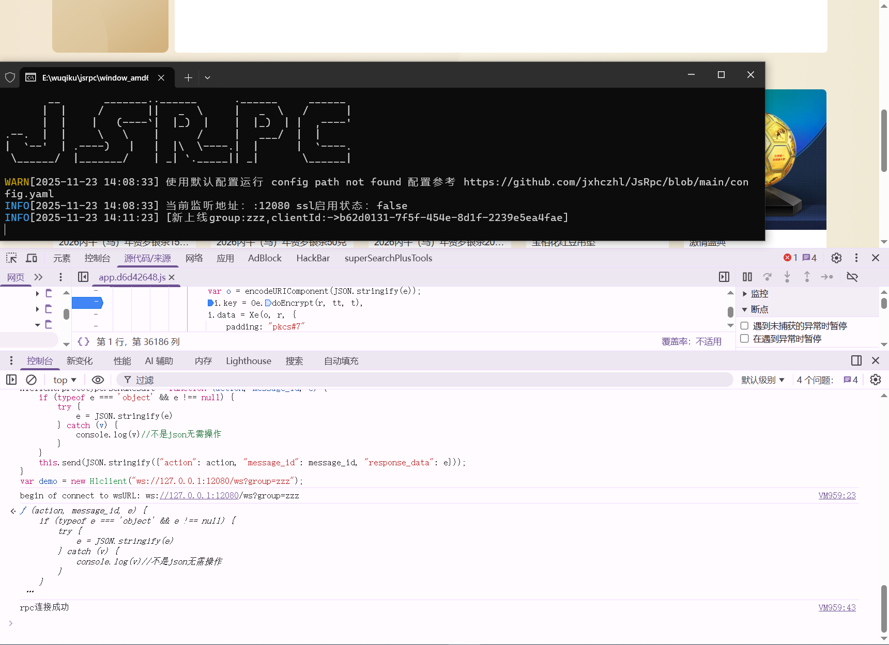

###### 编写远程调用的函数
```plain
涉及到的临时加密函数有Oe.doEncrypt、Xe、_e三个，为了全局调用这里赋值给自定义的全局变量，即
window.enc1=Oe.doEncrypt
window.data1=Xe
window.hmac1=_e
demo.regAction("getkey1", function (resolve,param) {
    r = "2802575829264a2e8a92fff5d8856936"
    tt = "047695c4bf78806f2790c14176d8cfb94c6cf678a11c5aa4fcc3cf1dea8110e4e0e9f9419e167921f4d50068a5454d1437bcc9d310f5c1562a2567541d511b86f4"
    t = "1"
    res= enc1(r, tt, t)
    resolve(res);
})
demo.regAction("getdata1", function (resolve,param) {
//由于o是需要传进来的内容，使用param["o"]接受参数
    res=data1(JSON.stringify(param["o"]), '2802575829264a2e8a92fff5d8856936', {padding: "pkcs#7"})
    resolve(res);
})
demo.regAction("gethmac1", function (resolve,param) {
    //这里还是param参数 param里面的key 是先这里写，但到时候传接口就必须对应的上
    r = "2802575829264a2e8a92fff5d8856936"
    res=hmac1(JSON.stringify(param["o"]), {key: r})
    resolve(res);
})
```

```plain
POST /go HTTP/1.1
Host: 127.0.0.1:12080
User-Agent: Mozilla/5.0 (Windows NT 10.0; Win64; x64) AppleWebKit/537.36 (KHTML, like Gecko) Chrome/83.0.4103.116 Safari/537.36
Content-Type: application/x-www-form-urlencoded
Content-Length: 24

action=getkey1&group=zzz
```

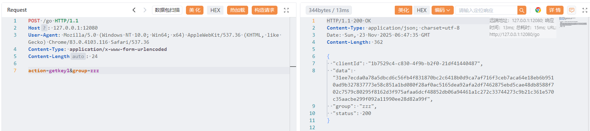

```plain
POST /go HTTP/1.1
Host: 127.0.0.1:12080
User-Agent: Mozilla/5.0 (Windows NT 10.0; Win64; x64) AppleWebKit/537.36 (KHTML, like Gecko) Chrome/83.0.4103.116 Safari/537.36
Content-Type: application/x-www-form-urlencoded
Content-Length: 24

action=gethmac1&group=zzz&param={"o":{"requestTime":1763879406185}}
```

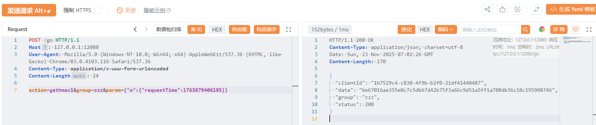

###### 编写yakit热加载，实现明文数据传输
```plain
jsrpcReq = func(a) {
    group = "zzz"
    action1 = "getkey1"
    action2 = "getdata1"
    action3 = "gethmac1"
    param1 = "{\"o\":" + a + "}"
    rsp, rep = poc.Post(
        "http://127.0.0.1:12080/go", 
        poc.replaceBody(
            "group=" + group + "&action=" + action2 + "&param=" + param1, 
            false, 
        ), 
        poc.appendHeader("Content-Type", "application/x-www-form-urlencoded"), 
    )~
    rsp1, rep1 = poc.Post(
        "http://127.0.0.1:12080/go", 
        poc.replaceBody(
            "group=" + group + "&action=" + action3 + "&param=" + param1, 
            false, 
        ), 
        poc.appendHeader("Content-Type", "application/x-www-form-urlencoded"), 
    )~
    rsp2, rep2 = poc.Post(
        "http://127.0.0.1:12080/go", 
        poc.replaceBody(
            "group=" + group + "&action=" + action1, 
            false, 
        ), 
        poc.appendHeader("Content-Type", "application/x-www-form-urlencoded"), 
    )~
    o = {
    "data": json.loads(rsp.GetBody()).data,
    "hmac": json.loads(rsp1.GetBody()).data,
    "key": json.loads(rsp2.GetBody()).data
}
b = json.dumps(o)  
    return b
}
// beforeRequest 允许在每次发送数据包前对请求做昀后的处理
beforeRequest = func(https, originReq, req) {
    body = poc.GetHTTPPacketBody(req)
    // 如果请求体不为空且长度大于0，则进行处理
    if body != nil && len(body) > 0 {
        encryptedParam = jsrpcReq(string(body))
        // 将结果添加到请求头中的"si"字段
        req = poc.ReplaceBody(req, encryptedParam, false)
    }
    

// 返回修改后的请求
    return []byte(req)
}
afterRequest = func(https, originReq, req, originRsp, rsp) {
    body = poc.GetHTTPPacketBody(rsp)  

    if body != nil && len(body) > 0 {
        parsed = json.loads(string(body))
        encData = parsed["data"]
        key = codec.DecodeHex("2802575829264a2e8a92fff5d8856936")~
        decData = codec.Sm4ECBDecryptWithPKCSPadding(key, codec.DecodeHex(encData)~, nil)~
        parsed["data"] = string(decData)
        newBody = []byte(json.dumps(parsed))
        rsp = poc.ReplaceBody(rsp, newBody, false)
    }
    return []byte(rsp)
}

```

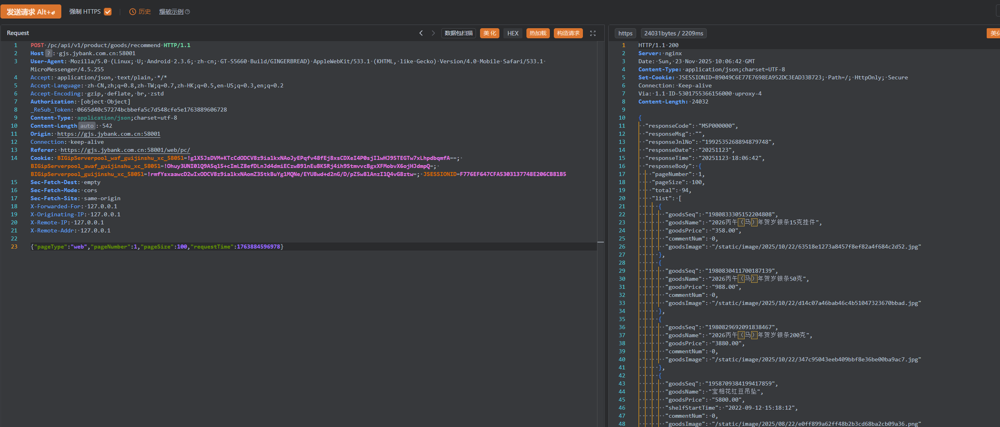

至于mitm模块的热加载需要改一下，懒得写了

## 小程序调试
#### 项目地址
1. 微信安装包(<font style="color:rgb(31,35,40);">3.9.10.19版本</font>)

[https://github.com/tom-snow/wechat-windows-versions/releases/tag/v3.9.10.19](https://github.com/tom-snow/wechat-windows-versions/releases/tag/v3.9.10.19)

2. 一键开f12

[https://github.com/JaveleyQAQ/WeChatOpenDevTools-Python](https://github.com/JaveleyQAQ/WeChatOpenDevTools-Python)

#### 使用方法
1. 安装微信
2. 下载`WechatOpenDevTools-Python.exe`
3. 启动微信
4. `WechatOpenDevTools-Python.exe -x`
5. `devtools`打开控制台

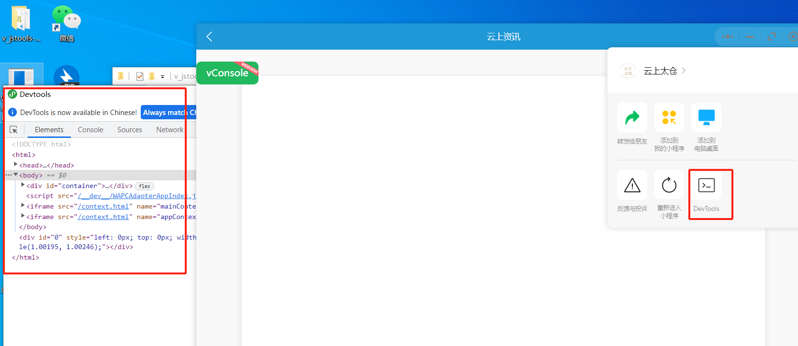

#### 补充
##### 提示微信版本过低无法登陆
先安装最新版本的微信，然后再安装`<font style="color:rgb(31,35,40);">3.9.10.19</font>`<font style="color:rgb(31,35,40);">版本，就可以使用低版本了</font>

##### <font style="color:rgb(31,35,40);">打开程序闪退</font>
请确保小程序版本为`8555`，如果有其他版本请删除

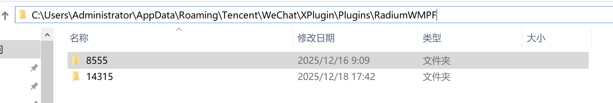

##### arm版本一键f12工具
[https://github.com/f4l1k/WeChatOpenDevTools-Python-arm](https://github.com/f4l1k/WeChatOpenDevTools-Python-arm)

##### 无法全局搜索
[https://mp.weixin.qq.com/s/vA35tVd0Ag2J-p0xjY5ZyA](https://mp.weixin.qq.com/s/vA35tVd0Ag2J-p0xjY5ZyA)

或者在appcontext/usr目录下的app-service.js中进行搜索

##### 微信jsrpc
```plain
function createRpcClient(wsURL) {
  let rpc_client_id = wx.getStorageSync('rpc_client_id');
  let socket = null;
  const handlers = {};

  if (rpc_client_id && wsURL.indexOf("clientId=") === -1) {
    wsURL += "&clientId=" + rpc_client_id;
  }

  function connect() {
    console.log("开始连接:", wsURL);
    socket = wx.connectSocket({
      url: wsURL,
      success() { console.log("连接成功"); },
      fail(err) {
        console.error("连接失败:", err);
        reconnect();
      }
    });

    wx.onSocketOpen(() => console.log("Socket 打开"));
    wx.onSocketError(err => console.error("Socket 错误:", err));
    wx.onSocketClose(() => {
      console.log("Socket 关闭");
      reconnect();
    });

    wx.onSocketMessage(res => handleRequest(res.data));
  }

  function reconnect() {
    console.log("10秒后重连...");
    setTimeout(connect, 10000);
  }

  function send(msg) {
    if (socket && socket.readyState === 1) {
      wx.sendSocketMessage({
        data: msg,
        fail(err) {
          console.error("发送失败:", err);
        }
      });
    }
  }

  function sendResult(action, message_id, data) {
    if (typeof data === 'object') {
      try { data = JSON.stringify(data); } catch (e) {}
    }
    const response = JSON.stringify({
      action, message_id, response_data: data
    });
    send(response);
  }

  function handleRequest(raw) {
    try {
      const msg = JSON.parse(raw);

      if (msg.registerId) {
        rpc_client_id = msg.registerId;
        wx.setStorageSync('rpc_client_id', rpc_client_id);
        return;
      }

      const { action, message_id, param } = msg;
      if (!action || !message_id) return;

      const handler = handlers[action];
      let parsedParam = param;
      try { parsedParam = JSON.parse(param); } catch (e) {}

      if (!handler) {
        sendResult(action, message_id, "Handler not found");
        return;
      }

      handler(res => {
        sendResult(action, message_id, res);
      }, parsedParam);

    } catch (err) {
      console.error("解析消息失败:", err);
    }
  }

  function regAction(name, func) {
    handlers[name] = func;
  }

  // 默认注册 execjs 方法
  regAction("_execjs", (resolve, param) => {
    try {
      const result = eval(param);
      resolve(result || "没有返回值");
    } catch (e) {
      resolve("执行错误：" + e.message);
    }
  });

  connect();

  return {
    regAction,
    send
  };
}

var demo = createRpcClient("ws://127.0.0.1:12080/ws?group=zzz");
globalThis.wx = wx
globalThis.test = n

demo.regAction("getData", function (resolve,param) {
    //这里还是param参数 param里面的key 是先这里写，但到时候传接口就必须对应的上
    resolve(test.encrypt(param["t"], "347830335063457247244E55686E5266"));
})
```

如果不能用就参考[https://github.com/jxhczhl/JsRpc/issues/25](https://github.com/jxhczhl/JsRpc/issues/25)

### 案例一：南京银行鑫微厅
1. 定位加密位置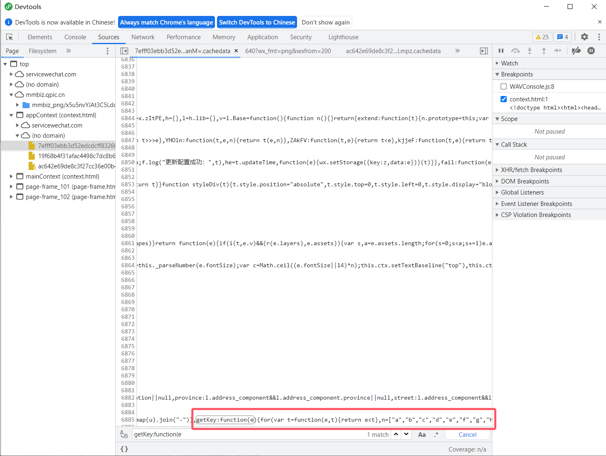

#### 方法一：ce改内存
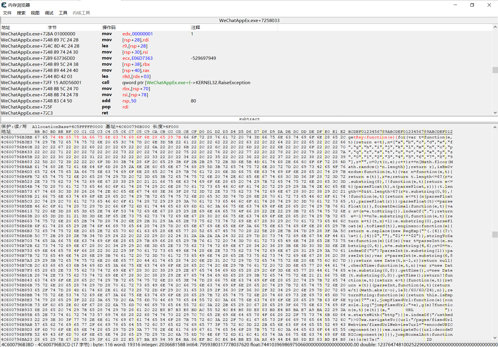

```plain
原
for(var t=function(e,t){return e<t},n=["a","b","c","d","e","f","g","h","i","j","k","l","m","n","o","p","q","r","s","t","u","v","w","x"
改成
for(var t=function(e,t){return "123123123123"/*11111111111111111111111111111111111*/

不好操作不写了,记得字符数对上，不然会报错
```

#### 方法二：改js（主推）
1. 清理掉本地所有小程序相关文件
2. bp抓包，在加密的js出现时，响应中加入固定的key，使本地保存的js是修改后的js，后面小程序优先调用本地js就可以固定密钥了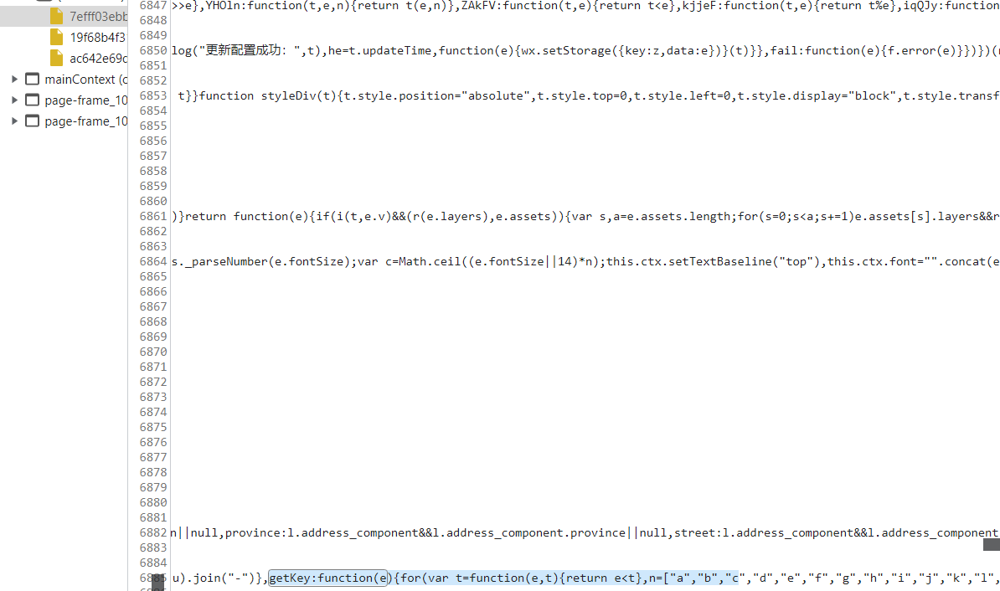

```plain
// 1. 微信小程序环境适配
const isWechatMiniProgram = typeof wx !== 'undefined' && wx.connectSocket;

// 全局变量直接挂载到globalThis
globalThis.rpc_client_id = wx && wx.getStorageSync ? wx.getStorageSync('rpc_client_id') || '' : '';

// 2. 构造函数 - 适配小程序API
globalThis.Hlclient = function (wsURL) {
    if (!wsURL) thrownewError('wsURL can not be empty!!');
    
    this.wsURL = wsURL;
    this.handlers = {
        _execjs: function (resolve, param) {
            try {
                let res = eval(param);
                resolve(res || "没有返回值");
            } catch (e) {
                resolve(`执行错误: ${e.message}`);
            }
        }
    };
    this.socket = null;
    this.isWechat = isWechatMiniProgram;
    this.connected = false;
    
    // 小程序环境初始化
    if (this.isWechat) {
        this.initWechatEvents();
    }
    
    this.connect();
};

// 3. 小程序专用事件初始化
globalThis.Hlclient.prototype.initWechatEvents = function() {
    let _this = this;
    
    // 监听WebSocket打开
    wx.onSocketOpen(function(res) {
        console.log('微信WebSocket连接已打开');
        _this.connected = true;
        // 发送注册消息
        if (globalThis.rpc_client_id) {
            _this.send(JSON.stringify({
                action: 'register',
                clientId: globalThis.rpc_client_id
            }));
        }
    });
    
    // 监听消息
    wx.onSocketMessage(function(res) {
        console.log('收到微信WebSocket消息:', res.data);
        _this.handlerRequest(res.data);
    });
    
    // 监听错误
    wx.onSocketError(function(err) {
        console.error('微信WebSocket错误:', err);
        _this.connected = false;
        _this.reconnect();
    });
    
    // 监听关闭
    wx.onSocketClose(function(res) {
        console.log('微信WebSocket连接关闭');
        _this.connected = false;
        _this.reconnect();
    });
};

// 4. 连接方法 - 小程序适配
globalThis.Hlclient.prototype.connect = function () {
    let _this = this;
    
    // 处理URL，添加clientId
    let connectURL = this.wsURL;
    if (connectURL.indexOf("clientId=") === -1 && globalThis.rpc_client_id) {
        connectURL += (connectURL.indexOf('?') === -1 ? '?' : '&') + 
                     "clientId=" + encodeURIComponent(globalThis.rpc_client_id);
    }
    
    console.log('开始连接到:', connectURL);
    
    if (this.isWechat) {
        // 微信小程序环境
        if (this.socket) {
            try {
                wx.closeSocket();
            } catch (e) {}
        }
        
        wx.connectSocket({
            url: connectURL,
            success: function() {
                console.log('微信WebSocket连接请求已发送');
            },
            fail: function(err) {
                console.error('微信WebSocket连接失败:', err);
                setTimeout(function() {
                    _this.reconnect();
                }, 3000);
            }
        });
        
        this.socket = true; // 微信环境下，socket是一个状态标识
        
    } else {
        // 浏览器环境
        try {
            this.socket = new WebSocket(connectURL);
            this.socket.onopen = function() {
                console.log("WebSocket连接成功");
                _this.connected = true;
            };
            this.socket.onmessage = function(e) {
                _this.handlerRequest(e.data);
            };
            this.socket.onclose = function() {
                console.log('WebSocket连接关闭');
                _this.connected = false;
                _this.reconnect();
            };
            this.socket.onerror = function(err) {
                console.error('WebSocket错误:', err);
                _this.connected = false;
            };
        } catch (e) {
            console.error("连接失败:", e);
            this.reconnect();
        }
    }
};

// 5. 重连方法
globalThis.Hlclient.prototype.reconnect = function () {
    let _this = this;
    console.log("5秒后尝试重连...");
    setTimeout(function() {
        _this.connect();
    }, 5000);
};

// 6. 发送消息方法
globalThis.Hlclient.prototype.send = function (msg) {
    if (this.isWechat) {
        if (this.connected) {
            wx.sendSocketMessage({
                data: msg,
                success: function() {
                    console.log('消息发送成功');
                },
                fail: function(err) {
                    console.error('消息发送失败:', err);
                }
            });
        } else {
            console.warn('连接未就绪，无法发送消息');
            setTimeout(() => {
                this.send(msg);
            }, 1000);
        }
    } else {
        if (this.socket && this.socket.readyState === WebSocket.OPEN) {
            this.socket.send(msg);
        }
    }
};

// 7. 其他方法保持不变，但需要适配globalThis.rpc_client_id
globalThis.Hlclient.prototype.regAction = function (func_name, func) {
    if (typeof func_name !== 'string') thrownewError("func_name must be string");
    if (typeof func !== 'function') thrownewError("must be function");
    console.log("注册函数:", func_name);
    this.handlers[func_name] = func;
    returntrue;
};

globalThis.Hlclient.prototype.handlerRequest = function (requestJson) {
    let _this = this;
    try {
        console.log('处理请求:', requestJson);
        let result = JSON.parse(requestJson);
        
        // 处理注册ID
        if (result["registerId"] || result["clientId"]) {
            globalThis.rpc_client_id = result["registerId"] || result["clientId"];
            console.log('收到clientId:', globalThis.rpc_client_id);
            
            // 小程序环境保存到storage
            if (this.isWechat && wx.setStorageSync) {
                wx.setStorageSync('rpc_client_id', globalThis.rpc_client_id);
            }
            
            // 发送确认消息
            _this.send(JSON.stringify({
                action: 'register_ack',
                clientId: globalThis.rpc_client_id,
                status: 'success'
            }));
            
            return;
        }
        
        // 处理常规请求
        if (!result['action'] || !result["message_id"]) {
            console.warn('无效的请求:', result);
            return;
        }
        
        let action = result["action"],
            message_id = result["message_id"],
            param = result["param"];
        
        try { 
            if (typeof param === 'string') {
                param = JSON.parse(param); 
            }
        } catch (e) { }
        
        let handler = this.handlers[action];
        if (!handler) {
            console.warn('未找到处理函数:', action);
            returnthis.sendResult(action, message_id, 'Action not found');
        }
        
        // 执行处理函数
        try {
            handler(function (response) {
                _this.sendResult(action, message_id, response);
            }, param);
        } catch (e) {
            console.error('执行处理函数出错:', e);
            _this.sendResult(action, message_id, `执行错误: ${e.message}`);
        }
        
    } catch (error) {
        console.error("处理请求出错:", error);
        if (result && result.message_id) {
            this.sendResult(result.action || '', result.message_id, error.message);
        }
    }
};

globalThis.Hlclient.prototype.sendResult = function (action, message_id, data) {
    let response;
    if (typeof data === 'object') {
        try { 
            response = JSON.stringify(data); 
        } catch (e) { 
            response = String(data); 
        }
    } else {
        response = String(data);
    }
    
    let resultMsg = JSON.stringify({
        action: action,
        message_id: message_id,
        response_data: response
    });
    
    console.log('发送响应:', resultMsg);
    this.send(resultMsg);
};
globalThis.socket = new Hlclient("ws://127.0.0.1:12080/ws?group=two");

globalThis.one = this.sm2Encode; // globalThis.【第一次无需变化】 = 要注入的方法名
globalThis.socket.regAction("two", function (resolve, param) {
try {
let result = globalThis.one(param['data']); // param 部分 填参数
  resolve(result);
 } catch (e) {
  resolve(`调用失败: ${e.message}`);
 }
});

// 第一次注册可以使用上述代码直接复制粘贴, 第二次往后需要单独注册
globalThis.two = this.tempKey; // globalThis.【需要变化】 = 要注入的方法名
globalThis.socket.regAction("one", function (resolve, param) { // 注册的第一个参数名称不能与之前相同.
try {
let result = globalThis.two(); // globalThis.two 与之前注册的一样, param 部分 填参数
  resolve(result);
 } catch (e) {
  resolve(`调用失败: ${e.message}`);
 }
});
```

## App
### 前置
1. frida(最好是过检测的)

[https://github.com/frida/frida](https://github.com/frida/frida)

2. reqable(小黄鸟)

[https://reqable.com/en-US/](https://reqable.com/en-US/)

3. jadx
4. 脱壳机/在线脱壳网站

[https://56.al/](https://56.al/)

https://mogua.co/(站已经寄了)

5. r0capture

[https://github.com/r0ysue/r0capture](https://github.com/r0ysue/r0capture)

6. 查壳工具
7. <font style="color:#DF2A3F;">没壳/脱壳后的app包</font>


