## js加解密入门-web
### 前言
#### 常见的加密方式
| <font style="color:rgb(38,38,38);">加密⽅式 </font> | <font style="color:rgb(38,38,38);">对称加密 </font> | <font style="color:rgb(38,38,38);">⾮对称加密 </font> | <font style="color:rgb(38,38,38);">哈希算法</font> |
| --- | --- | --- | --- |
| 描述 | <font style="color:rgb(38,38,38);">同⼀密钥加解密</font> | <font style="color:rgb(38,38,38);">公钥加密，私钥解密</font> | 单向加密 |
| 密钥数量 | <font style="color:rgb(38,38,38);">1个（相同密钥）</font> | <font style="color:rgb(38,38,38);">2个（⼀对公钥和私钥）</font> | 无 |
| 应用场景 | <font style="color:rgb(38,38,38);">数据传输</font> | <font style="color:rgb(38,38,38);">身份认证、密钥交换、签 名</font> | <font style="color:rgb(38,38,38);">完整性校验、数字签名、密码 存储、消息认证（HMAC）、 唯⼀标识等。</font> |
| 常用算法 | <font style="color:rgb(38,38,38);">AES、DES、3DES、SM4</font> | <font style="color:rgb(38,38,38);">RSA、SM2</font> | <font style="color:rgb(38,38,38);">MD5、SHA-256、SM3</font> |


#### 常见的加密场景
1. 网站进行`RSA+AES/SM2+SM4`传输数据，其中SM4的密钥通过SM2进行加密
2. 对称加密数据包

### 常用的js加解密函数定位方法
#### 特殊变量名定位
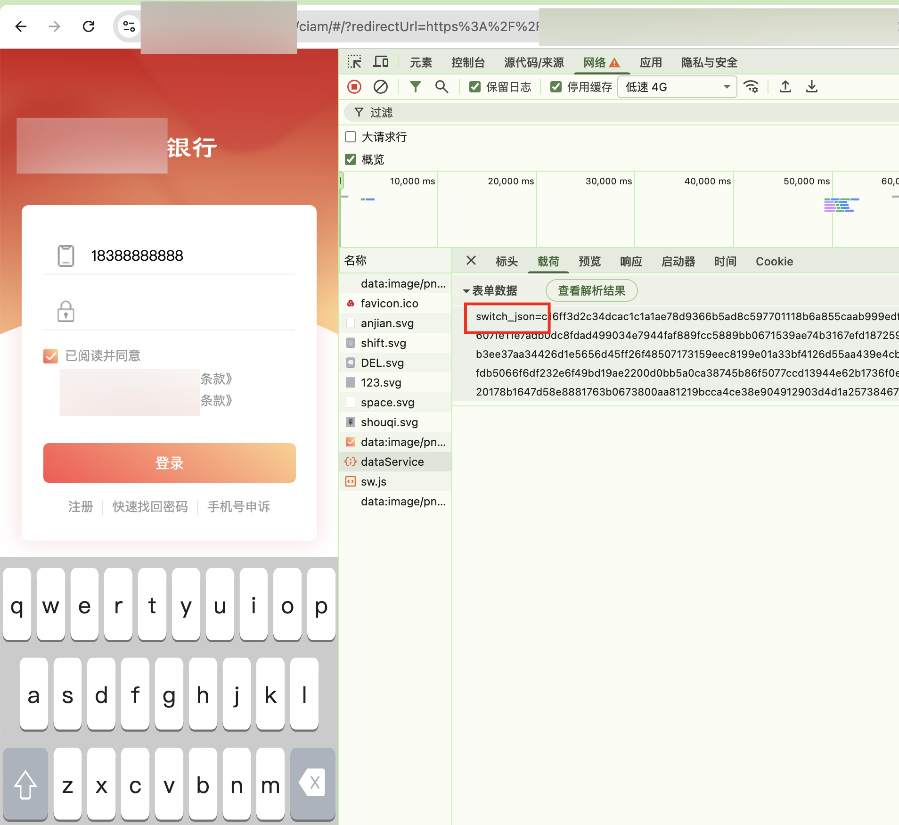

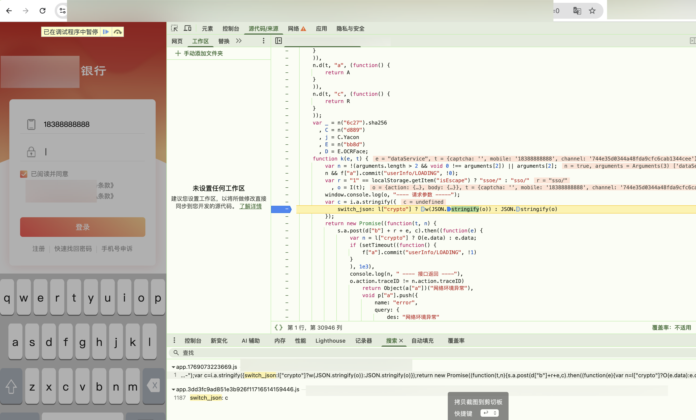

`w`就是加密函数

#### 接口路径定位
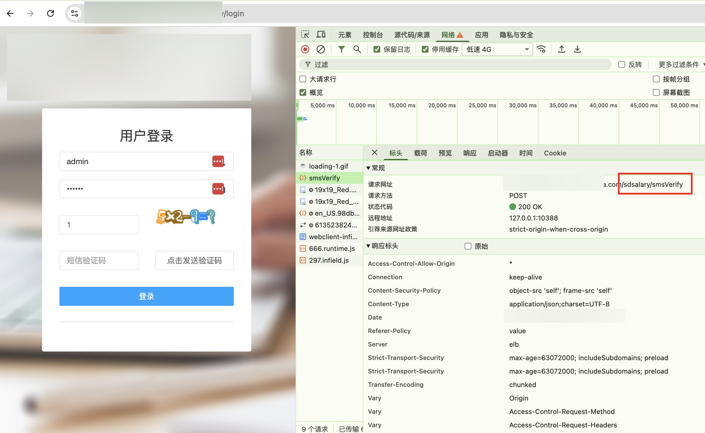

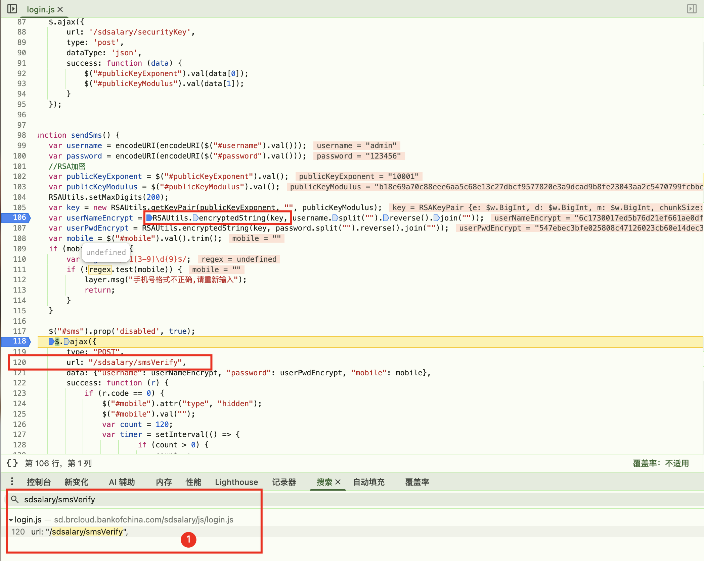

`RSAUtils.encryptedString`为加密函数

#### 内存漫游(主推)
##### 项目地址
[https://github.com/JSREI/ast-hook-for-js-RE](https://github.com/JSREI/ast-hook-for-js-RE)

##### 安装
[ast-hook-for-js-RE.zip](https://www.yuque.com/attachments/yuque/0/2026/zip/26698826/1769676425210-d5fc56ca-6704-4def-92ec-eaa9b95703fb.zip)

```powershell
git clone https://github.com/CC11001100/ast-hook-for-js-RE.git   //windows用户建议用我的zip包，同时以管理员身份启动cmd/powershell
cd ast-hook-for-js-RE
nvm install v16.20.2
nvm use v16.20.2
npm config set strict-ssl false
npm install
npm install -g anyproxy
npm install anyproxy 
npm install -g anyproxy express body-parser shelljs crypto cheerio @babel/core @babel/types @babel/generator
npx anyproxy-ca   
安装上一步弹出的ca证书，受信任的根证书颁发机构


开俩窗口分别运行起来 
node src/api-server/api-server.js 
node src/proxy-server/proxy-server.js
浏览器流量代理到本地10086端口
```

#### 方法四-hook常见函数
##### 项目地址
[https://github.com/cilame/v_jstools](https://github.com/cilame/v_jstools)

##### 使用方法


根据图中的勾选即可，由于网站开发者通常系统使用json进行数据传输，以及使用base64编码数据，这边勾上即可在编码时在浏览器控制台输出对应的加密点

1. 当提交登陆表单后，控制台打印如下内容，跟进


##### 方案不足
1. 默认只能处理最常见的编码，经常hook不到加密位置

### 站点案例
#### 一、贵金属商城
[https://gjs.jybank.com.cn:58001/web/pc/#/login](https://gjs.jybank.com.cn:58001/web/pc/#/login)

1. 流量代理到本地的10086端口
2. f12进入网络，刷新页面，获取一段密文
3. 使用`hook.search("密文")`进行搜索（<font style="color:#DF2A3F;">如果没hook说明上面的流程没走成功</font>），一般第一个就是，点击链接进入
4. 跳到入图，可以发现用的关键字是`1.key``Oe.doEncrypt`


5. 取消代理，正常访问，全局搜索，定位关键字，断点，发包，发现成功断到明文加密位置


#### 二、集中采购管理系统
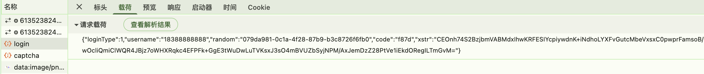

[https://jzcg.sdrcu.com/ebidding/#/login](https://jzcg.sdrcu.com/ebidding/#/login?encryptedStr=K1ZOa1JsMTAzQit6RTIrdjZkRlRQcHVEbTVjS3ppdndWQXpmdEtiM2pGTT0=)


这个密码部分用的是`rsa`加密所以无法解密，但是可以伪造公钥`<font style="color:rgb(78, 78, 78);background-color:rgb(243, 243, 243);">'MIGfMA0GCSqGSIb3DQEBAQUAA4GNADCBiQKBgQDEQvEppbMfrz7C9oL/hrb8r0PqYulc/SkgYf/e0oeS1NJXTbVORu95q+egZxzD8Hh2cx/s1BIPbcUPOzIZ0IodfJpznla422+RDQkXIuPyEuAyUQwIZqiCT7y0bFKxvN5xWyC5wFQp/9DOdTasE4Q0UzkERwzuUXF2hB73FQ46JQIDAQAB'</font>`

#### 三、后勤优管系统
[https://thgbg.cn/manage/#/login](https://thgbg.cn/manage/#/login)

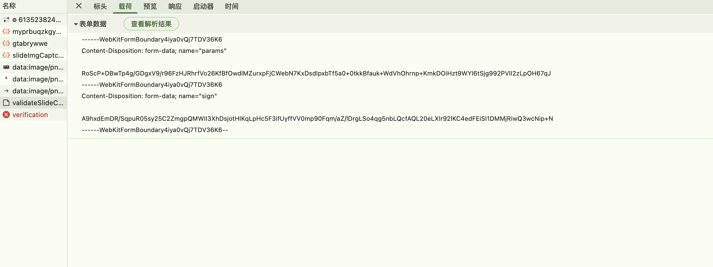

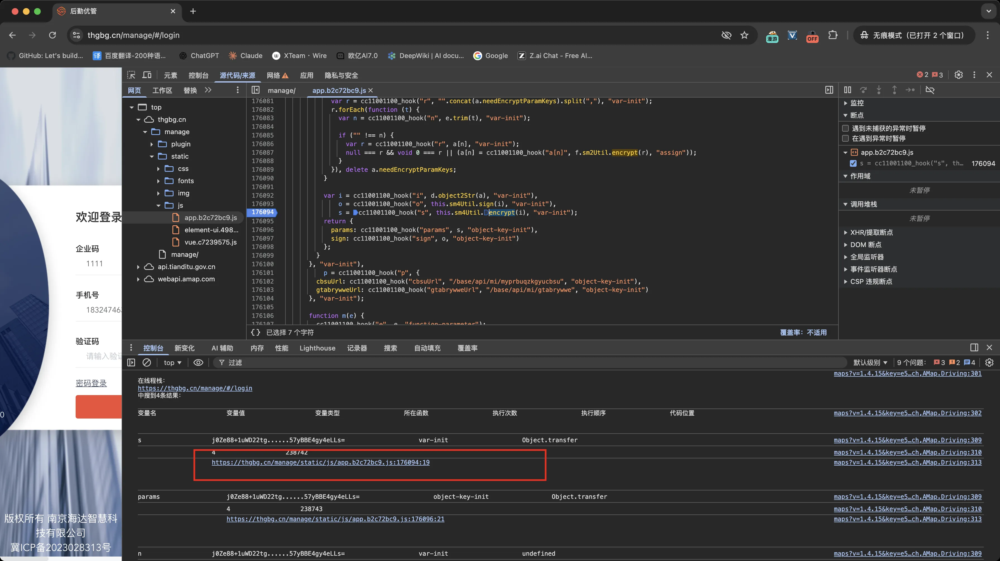

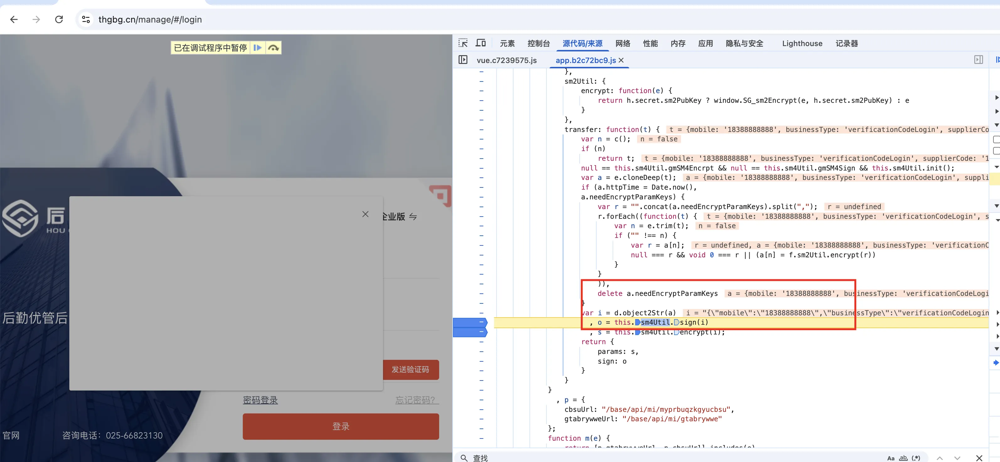

确定好加解密函数后，就可以进行jsrpc了

### JsRpc
#### 项目地址
[https://github.com/jxhczhl/JsRpc](https://github.com/jxhczhl/JsRpc)

JSRPC 利用 RPC 的核心思想，通过 webSocket 协议将浏览器中的 JS 函数（如加密方法）暴露为远程接口，使外部程序无需逆向分析即可直接调用。其本质是让浏览器执行原生代码，通过接口 “透传” 参数与结果，既绕过了反调试机制，又避免了重写加密逻辑，可以大大降低逆向的工作量

#### 使用方法-贵金属商城
##### 启动jsrpc
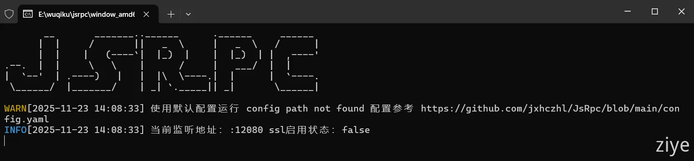

##### jsrpc注入浏览器
1. 放开断点
2. 控制台cv代码并执行，代码不用变

```powershell
var rpc_client_id, Hlclient = function (wsURL) {
  this.wsURL = wsURL;
  this.handlers = {
    _execjs: function (resolve, param) {
      var res = eval(param)
      if (!res) {
        resolve("没有返回值")
      } else {
        resolve(res)
      }
    }
  };
  this.socket = undefined;
  if (!wsURL) {
    throw new Error('wsURL can not be empty!!')
  }
  this.connect()
}
Hlclient.prototype.connect = function () {
  if (this.wsURL.indexOf("clientId=") === -1 && rpc_client_id) {
    this.wsURL += "&clientId=" + rpc_client_id
  }
  console.log('begin of connect to wsURL: ' + this.wsURL);
  var _this = this;
  try {
    this.socket = new WebSocket(this.wsURL);
    this.socket.onmessage = function (e) {
      _this.handlerRequest(e.data)
    }
  } catch (e) {
    console.log("connection failed,reconnect after 10s");
    setTimeout(function () {
      _this.connect()
    }, 10000)
  }
  this.socket.onclose = function () {
    console.log('rpc已关闭');
    setTimeout(function () {
      _this.connect()
    }, 10000)
  }
  this.socket.addEventListener('open', (event) => {
    console.log("rpc连接成功");
  });
  this.socket.addEventListener('error', (event) => {
    console.error('rpc连接出错,请检查是否打开服务端:', event.error);
  })
};
Hlclient.prototype.send = function (msg) {
  this.socket.send(msg)
}
Hlclient.prototype.regAction = function (func_name, func) {
  if (typeof func_name !== 'string') {
    throw new Error("an func_name must be string");
  }
  if (typeof func !== 'function') {
    throw new Error("must be function");
  }
  console.log("register func_name: " + func_name);
  this.handlers[func_name] = func;
  return true
}
Hlclient.prototype.handlerRequest = function (requestJson) {
  var _this = this;
  try {
    var result = JSON.parse(requestJson)
  } catch (error) {
    console.log("请求信息解析错误", requestJson);
    return
  }
  if (result["registerId"]) {
    rpc_client_id = result['registerId']
    return
  }
  if (!result['action'] || !result["message_id"]) {
    console.warn('没有方法或者消息id,不处理');
    return
  }
  var action = result["action"], message_id = result["message_id"]
  var theHandler = this.handlers[action];
  if (!theHandler) {
    this.sendResult(action, message_id, 'action没找到');
    return
  }
  try {
    if (!result["param"]) {
      theHandler(function (response) {
        _this.sendResult(action, message_id, response);
      })
      return
    }
    var param = result["param"]
    try {
      param = JSON.parse(param)
    } catch (e) {
    }
    theHandler(function (response) {
      _this.sendResult(action, message_id, response);
    }, param)
  } catch (e) {
    console.log("error: " + e);
    _this.sendResult(action, message_id, e);
  }
}
Hlclient.prototype.sendResult = function (action, message_id, e) {
  if (typeof e === 'object' && e !== null) {
    try {
      e = JSON.stringify(e)
    } catch (v) {
      console.log(v)//不是json无需操作
    }
  }
  this.send(JSON.stringify({"action": action, "message_id": message_id, "response_data": e}));
}
var demo = new Hlclient("ws://127.0.0.1:12080/ws?group=zzz");
```

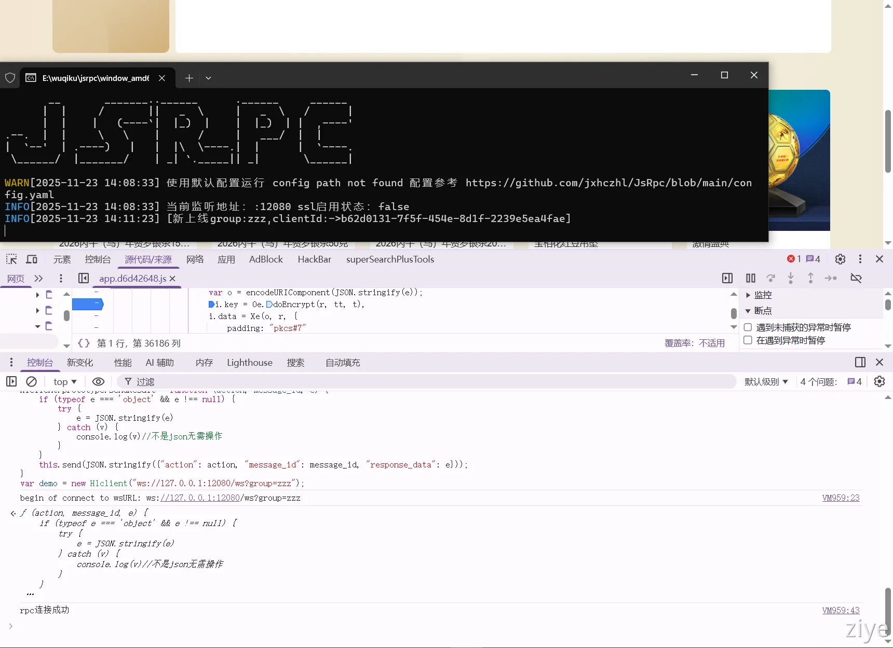

##### 加密函数的验证
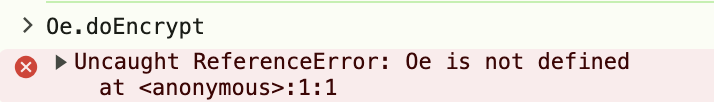

由于控制台在不断点的情况下，加密函数不存在，无法全局使用，`Oe.doEncrypt`是局部函数，我这边建议把他设置为全局函数，即在断点的情况下执行`window.enc1=Oe.doEncrypt`

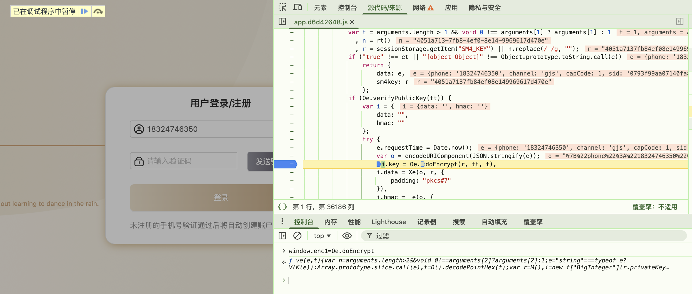

enc1是我取的全局函数名，即便不断点也可以调用，  
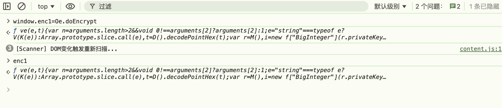

##### 加密函数的分析
```powershell
经典sm4传输数据，sm4密钥通过sm2加密，一次一密
由于没有对sm4密钥的签名校验，这边可以固定sm4密钥，即
r = 2802575829264a2e8a92fff5d8856936
tt是sm2公钥，常量
tt = 047695c4bf78806f2790c14176d8cfb94c6cf678a11c5aa4fcc3cf1dea8110e4e0e9f9419e167921f4d50068a5454d1437bcc9d310f5c1562a2567541d511b86f4
t = 1
```

##### 编写远程调用的函数
###### 如何编写远程调用函数
1. 确定加密函数
2. 确定输入，输出内容
3. 套用模版

```powershell
demo.regAction("远程调用函数的函数名字", function (resolve,param) {
//由于o是需要传进来的内容，使用param["o"]接受参数
    res=加密函数(加密函数所需的参数);
    resolve(res);//res为输出的密文
})
```

###### 编写远程调用函数
```javascript
涉及到的临时加密函数有Oe.doEncrypt、Xe、_e三个，为了全局调用这里赋值给自定义的全局变量，即
window.enc1=Oe.doEncrypt
window.data1=Xe
window.hmac1=_e
demo.regAction("getkey1", function (resolve,param) {
  r = "2802575829264a2e8a92fff5d8856936"
  tt = "047695c4bf78806f2790c14176d8cfb94c6cf678a11c5aa4fcc3cf1dea8110e4e0e9f9419e167921f4d50068a5454d1437bcc9d310f5c1562a2567541d511b86f4"
  t = "1"
  res= enc1(r, tt, t)
  resolve(res);
})
demo.regAction("getdata1", function (resolve,param) {
  //由于o是需要传进来的内容，使用param["o"]接受参数
  res=data1(JSON.stringify(param["o"]), '2802575829264a2e8a92fff5d8856936', {padding: "pkcs#7"})
  resolve(res);
})
demo.regAction("gethmac1", function (resolve,param) {
  //这里还是param参数 param里面的key 是先这里写，但到时候传接口就必须对应的上
  r = "2802575829264a2e8a92fff5d8856936"
  res=hmac1(JSON.stringify(param["o"]), {key: r})
  resolve(res);
})
```

##### 远程调用的函数可用性验证
```powershell
POST /go HTTP/1.1
Host: 127.0.0.1:12080
User-Agent: Mozilla/5.0 (Windows NT 10.0; Win64; x64) AppleWebKit/537.36 (KHTML, like Gecko) Chrome/83.0.4103.116 Safari/537.36
Content-Type: application/x-www-form-urlencoded
Content-Length: 24

action=getkey1&group=zzz
```


响应包中的`data`就是我们函数输出的密文，和浏览器端的密文保持一致就没问题

```javascript
POST /go HTTP/1.1
Host: 127.0.0.1:12080
User-Agent: Mozilla/5.0 (Windows NT 10.0; Win64; x64) AppleWebKit/537.36 (KHTML, like Gecko) Chrome/83.0.4103.116 Safari/537.36
Content-Type: application/x-www-form-urlencoded
Content-Length: 24

action=gethmac1&group=zzz&param={"o":{"requestTime":1763879406185}}
```


此时就可以用`yakit`热加载或者`mitmdump`进行加解密了

### mitmdump
#### 项目地址
[https://github.com/mocobk/mitmdump](https://github.com/mocobk/mitmdump)

`uv pip install <font style="color:rgb(31, 35, 40);background-color:rgba(129, 139, 152, 0.12);">mitmdump</font>`

#### <font style="color:rgb(31, 35, 40);background-color:rgba(129, 139, 152, 0.12);">使用案例-base64传输的网站实现全自动加解密，使bp明文测试</font>
##### 源码(php7)
```cpp
<?php
// ================= 接口逻辑（POST，整体 Base64） =================
if ($_SERVER['REQUEST_METHOD'] === 'POST') {
    header('Content-Type: text/plain; charset=utf-8');

    $correctUser = 'admin';
    $correctPass = '123456';

    // 读取原始 body（只有一段 base64）
    $raw = file_get_contents('php://input');

    // Base64 解码
    $json = base64_decode($raw, true);
    if ($json === false) {
        echo base64_encode(json_encode([
            'success' => false,
            'code' => 400,
            'msg' => '请求 Base64 解码失败'
        ], JSON_UNESCAPED_UNICODE));
        exit;
    }

    // JSON 解码
    $data = json_decode($json, true);
    if (!is_array($data)) {
        echo base64_encode(json_encode([
            'success' => false,
            'code' => 400,
            'msg' => 'JSON 解析失败'
        ], JSON_UNESCAPED_UNICODE));
        exit;
    }

    $username = $data['username'] ?? '';
    $password = $data['password'] ?? '';

    if ($username === $correctUser && $password === $correctPass) {
        $resp = [
            'success' => true,
            'code' => 0,
            'msg' => '登录成功',
            'user' => $username
        ];
    } else {
        $resp = [
            'success' => false,
            'code' => 401,
            'msg' => '用户名或密码错误'
        ];
    }

    // 整体 Base64 返回
    echo base64_encode(json_encode($resp, JSON_UNESCAPED_UNICODE));
    exit;
}
?>

<!DOCTYPE html>
<html lang="zh-CN">
<head>
<meta charset="UTF-8">
<title>整体 Base64 登录</title>
<style>
body { font-family: Arial; background: #f5f5f5; }
.box {
    width: 320px;
    margin: 100px auto;
    padding: 20px;
    background: #fff;
    box-shadow: 0 0 10px rgba(0,0,0,.1);
}
input, button {
    width: 100%;
    padding: 8px;
    margin-top: 10px;
}
pre {
    background: #eee;
    padding: 10px;
    margin-top: 10px;
    white-space: pre-wrap;
}
</style>
</head>
<body>

<div class="box">
    <h3>整体 Base64 登录</h3>
    <input id="u" placeholder="用户名">
    <input id="p" type="password" placeholder="密码">
    <button onclick="login()">登录</button>
    <pre id="result"></pre>
</div>

<script>
function login() {
    const obj = {
        username: document.getElementById('u').value,
        password: document.getElementById('p').value
    };

    const json = JSON.stringify(obj);
    const b64 = btoa(json);

    fetch('', {
        method: 'POST',
        headers: {
            'Content-Type': 'text/plain'
        },
        body: b64
    })
    .then(r => r.text())
    .then(respB64 => {
        const respJson = atob(respB64);
        document.getElementById('result').innerText =
            '请求 Base64：\n' + b64 +
            '\n\n请求解码：\n' + json +
            '\n\n响应 Base64：\n' + respB64 +
            '\n\n响应解码：\n' + respJson;
    });
}
</script>

</body>
</html>

```

##### 分析
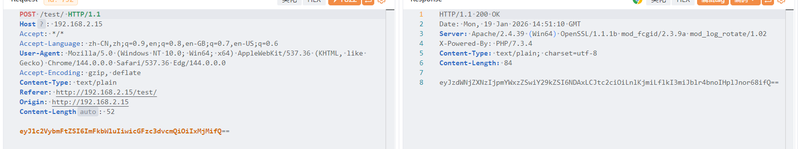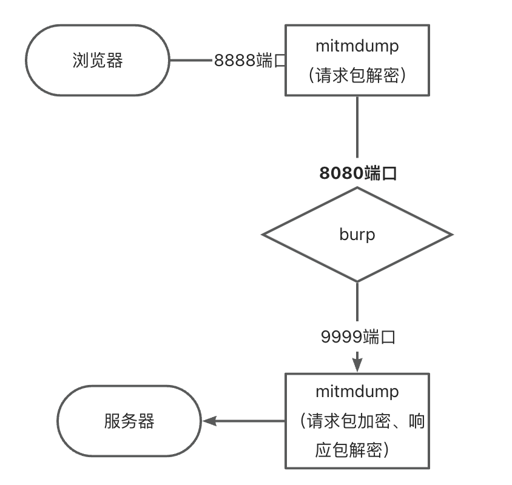

##### 脚本编写
###### 浏览器到bp端的(请求解密)
```python
from mitmproxy import http
import base64

def request(flow: http.HTTPFlow) -> None:
    """
    拦截请求，对 base64 编码的 body 进行解码
    浏览器 → mitmdump → Burp
    """
    if flow.request.method == "POST" and "/test/" in flow.request.path:
        try:
            original_body = flow.request.content

            if original_body :
                decoded_body = base64.b64decode(original_body)

                # 替换请求体
                flow.request.content = decoded_body
                flow.request.headers["Content-Length"] = str(len(decoded_body))               
                print(f"[请求] 原始 base64: {original_body.decode()}")
                print(f"[请求] 解码后: {decoded_body.decode()}")

        except Exception as e:
            print(f"[!] 请求解码失败: {e}")

```

`mitmdump.exe -s 1.py --mode upstream:http://127.0.0.1:8080 -p 8888`

###### 服务器到bp的(bp明文加密以及响应解密)
```java
from mitmproxy import http
import base64

def request(flow: http.HTTPFlow) -> None:
    """
    拦截请求，对 body 进行编码
    burp → mitmdump → 服务器
    """
    if flow.request.method == "POST" and "/test/" in flow.request.path:
        try:
            original_body = flow.request.content
            
            if original_body :
                encoded_body = base64.b64encode(original_body)
                
                # 替换请求体
                flow.request.content = encoded_body
                flow.request.headers["Content-Length"] = str(len(encoded_body))               
                print(f"[请求] 原始: {original_body.decode()}")
                print(f"[请求] 编码后: {encoded_body.decode()}")
                
        except Exception as e:
            print(f"[!] 请求编码失败: {e}")

def response(flow: http.HTTPFlow) -> None:
    """
    拦截响应，对 body 进行解码
    服务器 → mitmdump → burp
    """
    try:
        original_body = flow.response.content
        
        # 检查 Content-Type 是否为 text/plain（根据你的响应头）
        content_type = flow.response.headers.get("Content-Type", "")
        
        if original_body and "text/plain" in content_type :
            # 响应体设置为utf-8
            original_body = original_body.decode('utf-8')
            decoded_body = base64.b64decode(original_body)
            # 替换响应体
            flow.response.content = decoded_body
            flow.response.headers["Content-Length"] = str(len(decoded_body)) 
            print(f"[响应] 原始 base64: {original_body}")
            print(f"[响应] 解码后: {decoded_body}")
            
    except Exception as e:
        print(f"[!] 响应解码失败: {e}")
```

`mitmdump.exe -s test2.py -p 9999`

##### bp设置
bp监听`0.0.0.0:8080`

bp出口走`127.0.0.1:9999`

实现bp全流程明文通信

### yakit-热加载
#### 使用案例-贵金属
```python
jsrpcReq = func(a) {
    group = "zzz"
    action1 = "getkey1"
    action2 = "getdata1"
    action3 = "gethmac1"
    param1 = "{\"o\":" + a + "}"
    rsp, rep = poc.Post(
        "http://127.0.0.1:12080/go", 
        poc.replaceBody(
            "group=" + group + "&action=" + action2 + "&param=" + param1, 
            false, 
        ), 
        poc.appendHeader("Content-Type", "application/x-www-form-urlencoded"), 
    )~
    rsp1, rep1 = poc.Post(
        "http://127.0.0.1:12080/go", 
        poc.replaceBody(
            "group=" + group + "&action=" + action3 + "&param=" + param1, 
            false, 
        ), 
        poc.appendHeader("Content-Type", "application/x-www-form-urlencoded"), 
    )~
    rsp2, rep2 = poc.Post(
        "http://127.0.0.1:12080/go", 
        poc.replaceBody(
            "group=" + group + "&action=" + action1, 
            false, 
        ), 
        poc.appendHeader("Content-Type", "application/x-www-form-urlencoded"), 
    )~
    o = {
    "data": json.loads(rsp.GetBody()).data,
    "hmac": json.loads(rsp1.GetBody()).data,
    "key": json.loads(rsp2.GetBody()).data
}
b = json.dumps(o)  
    return b
}
// beforeRequest 允许在每次发送数据包前对请求做昀后的处理
beforeRequest = func(https, originReq, req) {
    body = poc.GetHTTPPacketBody(req)
    // 如果请求体不为空且长度大于0，则进行处理
    if body != nil && len(body) > 0 {
        encryptedParam = jsrpcReq(string(body))
        // 将结果添加到请求头中的"si"字段
        req = poc.ReplaceBody(req, encryptedParam, false)
    }
    

// 返回修改后的请求
    return []byte(req)
}
afterRequest = func(https, originReq, req, originRsp, rsp) {
    body = poc.GetHTTPPacketBody(rsp)  

    if body != nil && len(body) > 0 {
        parsed = json.loads(string(body))
        encData = parsed["data"]
        key = codec.DecodeHex("2802575829264a2e8a92fff5d8856936")~
        decData = codec.Sm4ECBDecryptWithPKCSPadding(key, codec.DecodeHex(encData)~, nil)~
        parsed["data"] = string(decData)
        newBody = []byte(json.dumps(parsed))
        rsp = poc.ReplaceBody(rsp, newBody, false)
    }
    return []byte(rsp)
}

```


至于mitm模块的热加载需要改一下，懒得写了，感觉不如`mitmdump`方便


## js加解密入门-微信内置浏览器/小程序
### 环境配置
#### 微信4.0以上(暂时没找到开内置浏览器的方案，只有开小程序的)
1. 微信下载地址[https://github.com/cscnk52/wechat-windows-versions/releases/download/v4.1.5.15/weixin_4.1.5.15.exe](https://github.com/cscnk52/wechat-windows-versions/releases/download/v4.1.5.15/weixin_4.1.5.15.exe)
2. 安装好微信
3. 配置fnm环境

```plain
https://github.com/Schniz/fnm/releases/download/v1.38.1/fnm-windows.zip
下载下来，并配置系统环境变量path

$env:FNM_NODE_DIST_MIRROR = "https://mirrors.tencent.com/nodejs-release"
$env:NVM_NODEJS_ORG_MIRROR = "https://mirrors.tencent.com/nodejs-release"
fnm install 24
Set-ExecutionPolicy Unrestricted -Scope CurrentUser
New-Item -Type File -Path $PROFILE -Force
notepad $PROFILE   
输入下面这一行内容，并保存
fnm env --use-on-cd | Out-String | Invoke-Expression
重新开一个powershell
```

4. 下载并运行项目

```plain
下载https://github.com/evi0s/WMPFDebugger/archive/refs/heads/main.zip
进入项目

fnm use 24
npm install -g yarn
yarn install
npx ts-node src/index.ts
出现以下两行且没有退出就可以了
[server] debug server running on ws://localhost:9421
[server] proxy server running on ws://localhost:62000
```

5. 打开小程序
6. 打开浏览器访问`devtools://devtools/bundled/inspector.html?ws=127.0.0.1:62000`即可


##### 报错
###### 第四步出现以下两行但是退出了
1. 安装文章中用到的微信版本
2. 如果已经是文章中的微信版本还是退出了，打开`C:\Users\Administrator\AppData\Roaming\Tencent\xwechat\XPlugin\Plugins\RadiumWMPF`目录删除名为`18151`目录，重试


出现这个原因主要是WMPFDebugger项目，展示没有更新到`18151`版本，只更新到了`18055`

#### 微信4.0以下
##### 准备
###### 一键开f12项目
因为采用[https://github.com/JaveleyQAQ/WeChatOpenDevTools-Python](https://github.com/JaveleyQAQ/WeChatOpenDevTools-Python)这个项目，[WechatOpenDevTools-Python (1).zip](https://www.yuque.com/attachments/yuque/0/2026/zip/26698826/1770020944933-33a4686e-3044-4011-8e79-a6352999245b.zip)

###### 低版本微信
该项目只支持`3.9.10.19`版本<font style="color:rgb(31, 35, 40);">及以下的微信，所以</font>我建议采用`3.9.10.19`，该版本微<font style="color:rgb(31, 35, 40);">信通过以下地址进行获取</font>

[https://github.com/tom-snow/wechat-windows-versions/releases/tag/v3.9.10.19](https://github.com/tom-snow/wechat-windows-versions/releases/tag/v3.9.10.19)

###### CE修改器
[Cheat Engine7.6.zip](https://www.yuque.com/attachments/yuque/0/2026/zip/26698826/1770020945229-494032a5-36b5-4525-a5b2-929748ee34a4.zip)

###### 微信小号(最好没啥聊天记录的，记录多会导致报错)
##### 低版本微信登陆流程
###### 启动微信和ce


###### ce修改内存版本
修改前


微信版本 `3.9.8.25` → 十六进制 `0x63090819` → 只要`63090819`

微信版本 `3.9.10.19` → 十六进制 `0x63090A13`→只要 `63090A13`

[vx登錄.exe.zip](https://www.yuque.com/attachments/yuque/0/2026/zip/26698826/1770021214426-84dc1055-730f-45b1-b09f-2fe5f1f8c707.zip)<-以管理员身份双击即可，扫码两次登陆目前只适配`3.9.10.19`和`3.9.8.25`

`0xf2593210`将其识别为无效或特殊版本，从而绕过正常的版本校验逻辑，具体操作如下

需要注意的是扫码记得扫两次，第一次失败是正常的，记得点`x`，而不是`确定`


##### 低版本vx开f12流程
1. 进入`WechatOpenDevTools-Python`所在文件夹
2. `.\WechatOpenDevTools-Python.exe  -all`，这时会启动一个vx扫码登陆页
3. 通过上面的低版本微信登陆流程，即可进入微信
4. 打开`内置浏览器`或者`小程序`f12即可打开

##### 报错-无法全局搜索
[https://mp.weixin.qq.com/s/vA35tVd0Ag2J-p0xjY5ZyA](https://mp.weixin.qq.com/s/vA35tVd0Ag2J-p0xjY5ZyA)

或者在appcontext/usr目录下的app-service.js中进行搜索

#### 微信jsrpc
```plain
function createRpcClient(wsURL) {
  let rpc_client_id = wx.getStorageSync('rpc_client_id');
  let socket = null;
  const handlers = {};

  if (rpc_client_id && wsURL.indexOf("clientId=") === -1) {
    wsURL += "&clientId=" + rpc_client_id;
  }

  function connect() {
    console.log("开始连接:", wsURL);
    socket = wx.connectSocket({
      url: wsURL,
      success() { console.log("连接成功"); },
      fail(err) {
        console.error("连接失败:", err);
        reconnect();
      }
    });

    wx.onSocketOpen(() => console.log("Socket 打开"));
    wx.onSocketError(err => console.error("Socket 错误:", err));
    wx.onSocketClose(() => {
      console.log("Socket 关闭");
      reconnect();
    });

    wx.onSocketMessage(res => handleRequest(res.data));
  }

  function reconnect() {
    console.log("10秒后重连...");
    setTimeout(connect, 10000);
  }

  function send(msg) {
    if (socket && socket.readyState === 1) {
      wx.sendSocketMessage({
        data: msg,
        fail(err) {
          console.error("发送失败:", err);
        }
      });
    }
  }

  function sendResult(action, message_id, data) {
    if (typeof data === 'object') {
      try { data = JSON.stringify(data); } catch (e) {}
    }
    const response = JSON.stringify({
      action, message_id, response_data: data
    });
    send(response);
  }

  function handleRequest(raw) {
    try {
      const msg = JSON.parse(raw);

      if (msg.registerId) {
        rpc_client_id = msg.registerId;
        wx.setStorageSync('rpc_client_id', rpc_client_id);
        return;
      }

      const { action, message_id, param } = msg;
      if (!action || !message_id) return;

      const handler = handlers[action];
      let parsedParam = param;
      try { parsedParam = JSON.parse(param); } catch (e) {}

      if (!handler) {
        sendResult(action, message_id, "Handler not found");
        return;
      }

      handler(res => {
        sendResult(action, message_id, res);
      }, parsedParam);

    } catch (err) {
      console.error("解析消息失败:", err);
    }
  }

  function regAction(name, func) {
    handlers[name] = func;
  }

  // 默认注册 execjs 方法
  regAction("_execjs", (resolve, param) => {
    try {
      const result = eval(param);
      resolve(result || "没有返回值");
    } catch (e) {
      resolve("执行错误：" + e.message);
    }
  });

  connect();

  return {
    regAction,
    send
  };
}

var demo = createRpcClient("ws://127.0.0.1:12080/ws?group=zzz");
globalThis.wx = wx
globalThis.test = n

demo.regAction("getData", function (resolve,param) {
    //这里还是param参数 param里面的key 是先这里写，但到时候传接口就必须对应的上
    resolve(test.encrypt(param["t"], "347830335063457247244E55686E5266"));
})
```

```plain
// 1. 微信小程序环境适配
const isWechatMiniProgram = typeof wx !== 'undefined' && wx.connectSocket;

// 全局变量直接挂载到globalThis
globalThis.rpc_client_id = wx && wx.getStorageSync ? wx.getStorageSync('rpc_client_id') || '' : '';

// 2. 构造函数 - 适配小程序API
globalThis.Hlclient = function (wsURL) {
    if (!wsURL) thrownewError('wsURL can not be empty!!');
    
    this.wsURL = wsURL;
    this.handlers = {
        _execjs: function (resolve, param) {
            try {
                let res = eval(param);
                resolve(res || "没有返回值");
            } catch (e) {
                resolve(`执行错误: ${e.message}`);
            }
        }
    };
    this.socket = null;
    this.isWechat = isWechatMiniProgram;
    this.connected = false;
    
    // 小程序环境初始化
    if (this.isWechat) {
        this.initWechatEvents();
    }
    
    this.connect();
};

// 3. 小程序专用事件初始化
globalThis.Hlclient.prototype.initWechatEvents = function() {
    let _this = this;
    
    // 监听WebSocket打开
    wx.onSocketOpen(function(res) {
        console.log('微信WebSocket连接已打开');
        _this.connected = true;
        // 发送注册消息
        if (globalThis.rpc_client_id) {
            _this.send(JSON.stringify({
                action: 'register',
                clientId: globalThis.rpc_client_id
            }));
        }
    });
    
    // 监听消息
    wx.onSocketMessage(function(res) {
        console.log('收到微信WebSocket消息:', res.data);
        _this.handlerRequest(res.data);
    });
    
    // 监听错误
    wx.onSocketError(function(err) {
        console.error('微信WebSocket错误:', err);
        _this.connected = false;
        _this.reconnect();
    });
    
    // 监听关闭
    wx.onSocketClose(function(res) {
        console.log('微信WebSocket连接关闭');
        _this.connected = false;
        _this.reconnect();
    });
};

// 4. 连接方法 - 小程序适配
globalThis.Hlclient.prototype.connect = function () {
    let _this = this;
    
    // 处理URL，添加clientId
    let connectURL = this.wsURL;
    if (connectURL.indexOf("clientId=") === -1 && globalThis.rpc_client_id) {
        connectURL += (connectURL.indexOf('?') === -1 ? '?' : '&') + 
                     "clientId=" + encodeURIComponent(globalThis.rpc_client_id);
    }
    
    console.log('开始连接到:', connectURL);
    
    if (this.isWechat) {
        // 微信小程序环境
        if (this.socket) {
            try {
                wx.closeSocket();
            } catch (e) {}
        }
        
        wx.connectSocket({
            url: connectURL,
            success: function() {
                console.log('微信WebSocket连接请求已发送');
            },
            fail: function(err) {
                console.error('微信WebSocket连接失败:', err);
                setTimeout(function() {
                    _this.reconnect();
                }, 3000);
            }
        });
        
        this.socket = true; // 微信环境下，socket是一个状态标识
        
    } else {
        // 浏览器环境
        try {
            this.socket = new WebSocket(connectURL);
            this.socket.onopen = function() {
                console.log("WebSocket连接成功");
                _this.connected = true;
            };
            this.socket.onmessage = function(e) {
                _this.handlerRequest(e.data);
            };
            this.socket.onclose = function() {
                console.log('WebSocket连接关闭');
                _this.connected = false;
                _this.reconnect();
            };
            this.socket.onerror = function(err) {
                console.error('WebSocket错误:', err);
                _this.connected = false;
            };
        } catch (e) {
            console.error("连接失败:", e);
            this.reconnect();
        }
    }
};

// 5. 重连方法
globalThis.Hlclient.prototype.reconnect = function () {
    let _this = this;
    console.log("5秒后尝试重连...");
    setTimeout(function() {
        _this.connect();
    }, 5000);
};

// 6. 发送消息方法
globalThis.Hlclient.prototype.send = function (msg) {
    if (this.isWechat) {
        if (this.connected) {
            wx.sendSocketMessage({
                data: msg,
                success: function() {
                    console.log('消息发送成功');
                },
                fail: function(err) {
                    console.error('消息发送失败:', err);
                }
            });
        } else {
            console.warn('连接未就绪，无法发送消息');
            setTimeout(() => {
                this.send(msg);
            }, 1000);
        }
    } else {
        if (this.socket && this.socket.readyState === WebSocket.OPEN) {
            this.socket.send(msg);
        }
    }
};

// 7. 其他方法保持不变，但需要适配globalThis.rpc_client_id
globalThis.Hlclient.prototype.regAction = function (func_name, func) {
    if (typeof func_name !== 'string') thrownewError("func_name must be string");
    if (typeof func !== 'function') thrownewError("must be function");
    console.log("注册函数:", func_name);
    this.handlers[func_name] = func;
    returntrue;
};

globalThis.Hlclient.prototype.handlerRequest = function (requestJson) {
    let _this = this;
    try {
        console.log('处理请求:', requestJson);
        let result = JSON.parse(requestJson);
        
        // 处理注册ID
        if (result["registerId"] || result["clientId"]) {
            globalThis.rpc_client_id = result["registerId"] || result["clientId"];
            console.log('收到clientId:', globalThis.rpc_client_id);
            
            // 小程序环境保存到storage
            if (this.isWechat && wx.setStorageSync) {
                wx.setStorageSync('rpc_client_id', globalThis.rpc_client_id);
            }
            
            // 发送确认消息
            _this.send(JSON.stringify({
                action: 'register_ack',
                clientId: globalThis.rpc_client_id,
                status: 'success'
            }));
            
            return;
        }
        
        // 处理常规请求
        if (!result['action'] || !result["message_id"]) {
            console.warn('无效的请求:', result);
            return;
        }
        
        let action = result["action"],
            message_id = result["message_id"],
            param = result["param"];
        
        try { 
            if (typeof param === 'string') {
                param = JSON.parse(param); 
            }
        } catch (e) { }
        
        let handler = this.handlers[action];
        if (!handler) {
            console.warn('未找到处理函数:', action);
            returnthis.sendResult(action, message_id, 'Action not found');
        }
        
        // 执行处理函数
        try {
            handler(function (response) {
                _this.sendResult(action, message_id, response);
            }, param);
        } catch (e) {
            console.error('执行处理函数出错:', e);
            _this.sendResult(action, message_id, `执行错误: ${e.message}`);
        }
        
    } catch (error) {
        console.error("处理请求出错:", error);
        if (result && result.message_id) {
            this.sendResult(result.action || '', result.message_id, error.message);
        }
    }
};

globalThis.Hlclient.prototype.sendResult = function (action, message_id, data) {
    let response;
    if (typeof data === 'object') {
        try { 
            response = JSON.stringify(data); 
        } catch (e) { 
            response = String(data); 
        }
    } else {
        response = String(data);
    }
    
    let resultMsg = JSON.stringify({
        action: action,
        message_id: message_id,
        response_data: response
    });
    
    console.log('发送响应:', resultMsg);
    this.send(resultMsg);
};
globalThis.socket = new Hlclient("ws://127.0.0.1:12080/ws?group=two");

globalThis.one = this.sm2Encode; // globalThis.【第一次无需变化】 = 要注入的方法名
globalThis.socket.regAction("two", function (resolve, param) {
try {
let result = globalThis.one(param['data']); // param 部分 填参数
  resolve(result);
 } catch (e) {
  resolve(`调用失败: ${e.message}`);
 }
});

// 第一次注册可以使用上述代码直接复制粘贴, 第二次往后需要单独注册
globalThis.two = this.tempKey; // globalThis.【需要变化】 = 要注入的方法名
globalThis.socket.regAction("one", function (resolve, param) { // 注册的第一个参数名称不能与之前相同.
try {
let result = globalThis.two(); // globalThis.two 与之前注册的一样, param 部分 填参数
  resolve(result);
 } catch (e) {
  resolve(`调用失败: ${e.message}`);
 }
});
```

如果不能用就参考[https://github.com/jxhczhl/JsRpc/issues/25](https://github.com/jxhczhl/JsRpc/issues/25)

### 案例-南京银行鑫微厅
1. 定位加密位置

#### 方法一：ce改内存


```plain
原
for(var t=function(e,t){return e<t},n=["a","b","c","d","e","f","g","h","i","j","k","l","m","n","o","p","q","r","s","t","u","v","w","x"
改成
for(var t=function(e,t){return "123123123123"/*11111111111111111111111111111111111*/

不好操作不写了,记得字符数对上，不然会报错
```

#### 方法二：改js（主推）
1. 清理掉本地所有小程序相关文件
2. bp抓包，在加密的js出现时，响应中加入固定的key，使本地保存的js是修改后的js，后面小程序优先调用本地js就可以固定密钥了

## js加解密入门-app
### 前置
app测试的核心在于frida以及脱壳

#### root后的手机(推荐谷歌机、小米、一加)
#### adb(电脑连手机的)
[adb.zip](https://www.yuque.com/attachments/yuque/0/2026/zip/26698826/1770022342193-7009b45b-c568-4e6d-b236-ff7ec18c3bed.zip)

#### frida(hook的)
[https://github.com/frida/frida](https://github.com/frida/frida)

#### 抓包（小黄鸟）
[https://reqable.com/zh-CN](https://reqable.com/zh-CN)

#### jadx(反编译apk看源码的)
[https://github.com/skylot/jadx](https://github.com/skylot/jadx)

#### r0capture（代理检测绕过的、单/双向证书绕过）
[https://github.com/r0ysue/r0capture](https://github.com/r0ysue/r0capture)

#### 脱壳
[https://56.al/](https://56.al/)

### 环境配置
#### frida安装
`frida`分为客户端和服务端,手机上放的是`服务端`,电脑上放的是客户端

`frida`我个人比较推荐的版本有，适配低版本的`12.8.0`,以及适配`一加手机`的`16.1.4`

[https://github.com/frida/frida/releases/tag/16.1.4](https://github.com/frida/frida/releases/tag/16.1.4)

##### 服务端配置
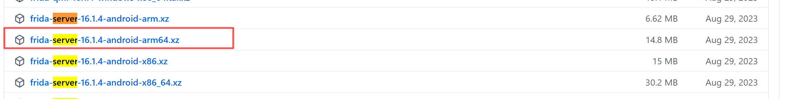

解压，手机连电脑，并选择`文件数据传输`

`adb push .\frida-server-16.1.4-android-arm64  /data/local/fs16.1.4`这里我为了辨识度我改成了`adb push .\frida-server-16.1.4-android-arm64  /data/local/tmp/fs16.1.4`这样`frida`就在这个`/data/local/tmp/fs16.1.4`路径

##### 客户端配置
这里我用习惯了`uv`

```plain
uv venv
.venv\Scripts\activate
uv pip install frida==16.1.4 frida-tools
frida --version      //显示16.1.4就说明安装成功了
```

#### jadx安装
[https://github.com/skylot/jadx/releases](https://github.com/skylot/jadx/releases)

下载这个就行


##### jadx-mcp配置
[https://github.com/zinja-coder/jadx-ai-mcp/releases/tag/v6.1.0](https://github.com/zinja-coder/jadx-ai-mcp/releases/tag/v6.1.0)

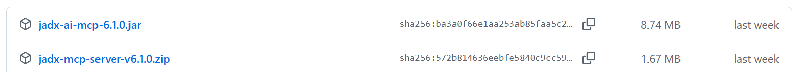

两个都下载

###### 服务端
打开`jadx`

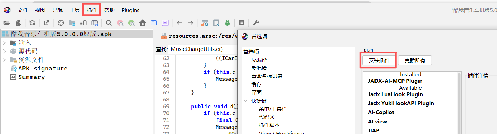

选择刚刚下载的`jadx-ai-mcp-6.1.0.jar`确认，重启jadx

###### mcp配置
进入到`<font style="color:rgb(9, 105, 218);">jadx-mcp-server-v6.1.0.zip</font>`解压后的目录

```plain
uv venv
.venv\Scripts\activate
uv pip install -r .\requirements.txt
```

在一个支持`mcp`的软件中配置，这里用的`trae`

```plain
{
  "mcpServers": {
    "jadx-mcp-server": {
      "command": "uv",
      "args": [
        "--directory",
        "E:\\code\\mcp_code\\jadx-mcp-server",
        "run",
        "jadx_mcp_server.py"
      ]
    }
  }
}
```

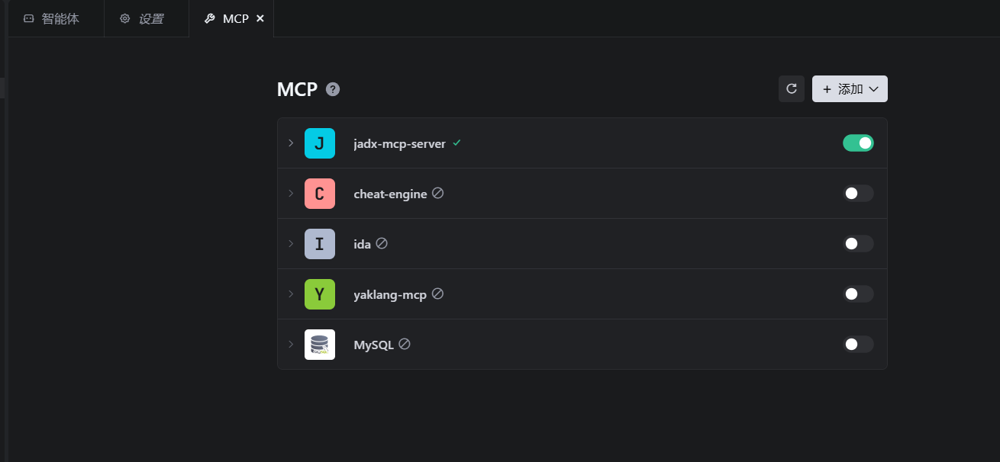

确认打勾就是没问题了，创建一个`智能体`，给智能体赋予mcp调用的功能

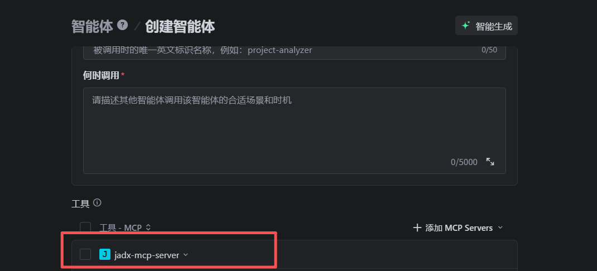

向`ai`提问`jadx mcp 现在可用吗`，得到肯定回复就说明配置完毕了

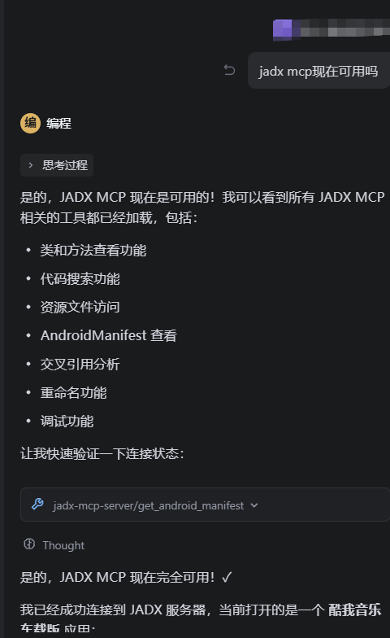

#### frida使用
##### 服务端
```plain
adb shell
su
setenforce 0
chmod +x /data/local/tmp/fs16.1.4
/data/local/tmp/fs16.1.4
```

##### 客户端
```plain
frida --version
frida-ps -Uai //显示当前安装的程序
frida -U -f 包名 -l l 1.js    //重启app并注入1.js

frida-ps -U  //显示当前运行的程序
frida -U -l 1.js [进程ID]     //将1.js注入到对应的进程中

frida -UF -l .\1.js           //将1.js注入到当前打开的页面中
```

### 案例一
#### 酷我音乐车机版5.0.0.0原版
[酷我音乐车机版5.0.0.0原版.zip](https://www.yuque.com/attachments/yuque/0/2026/zip/26698826/1770022342524-ae5c22a0-f79a-4d72-9b3a-c1e0f41593ab.zip)

##### 目的
越过`车载vip`校验

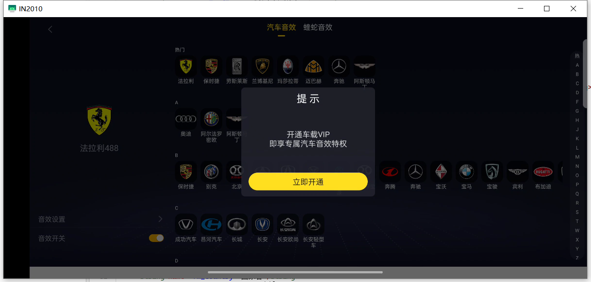

##### 确定有没有壳
这里用`app messenger pro`进行查壳

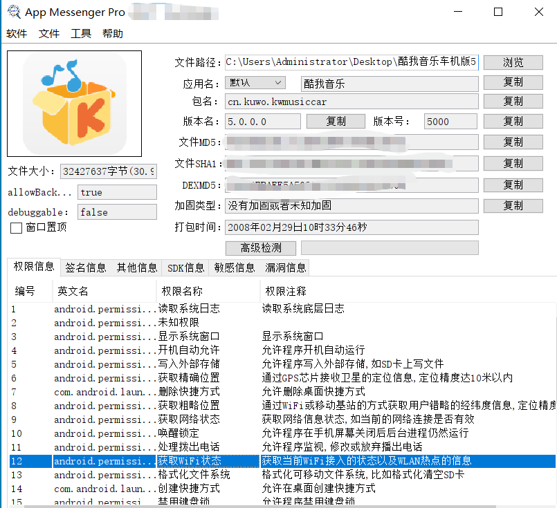

确定没有壳

##### jadx源码查看
###### jadx打开并搜索关键字
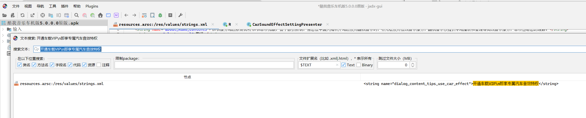

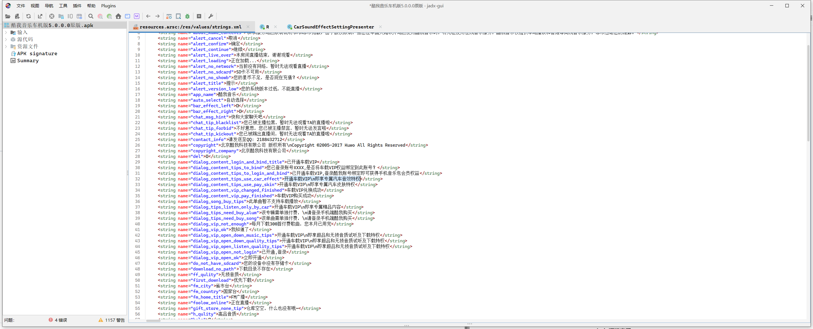

发现`dialog_content_tips_use_car_effect`是关于他的，进一步搜索

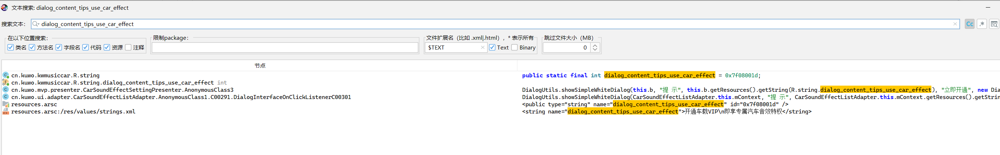

依次查看

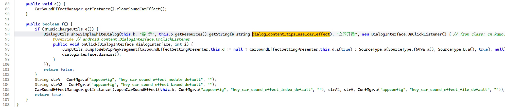

确认这个位置是关于`车载vip`判断的

##### 使用`ai`进一步确认
提问`开通车载VIP\n即享专属汽车音效特权 对应的判断逻辑`

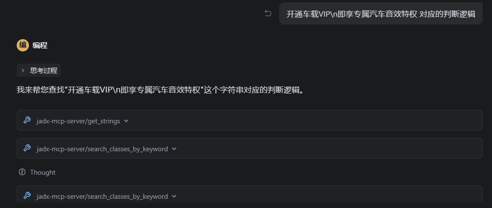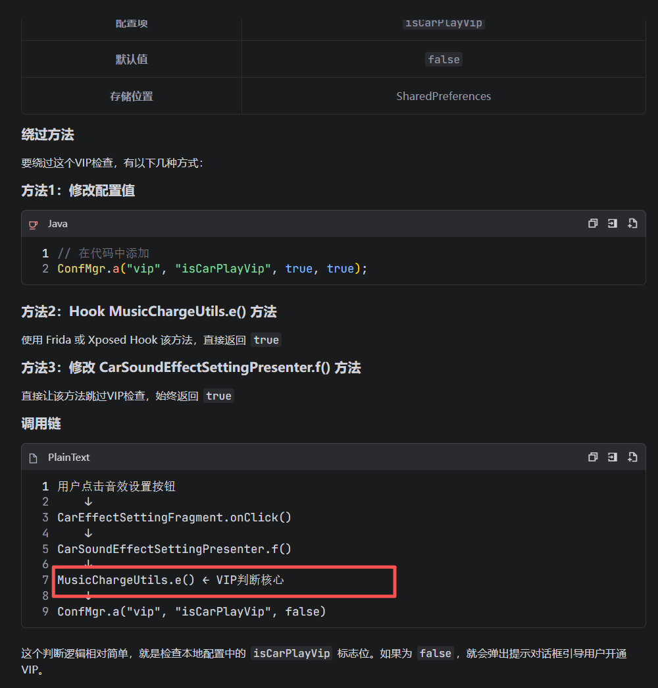

`!MusicChargeUtils.e()`是vip判断的关键逻辑

##### 编写js注入脚本
1. 选中并复制为frida脚本

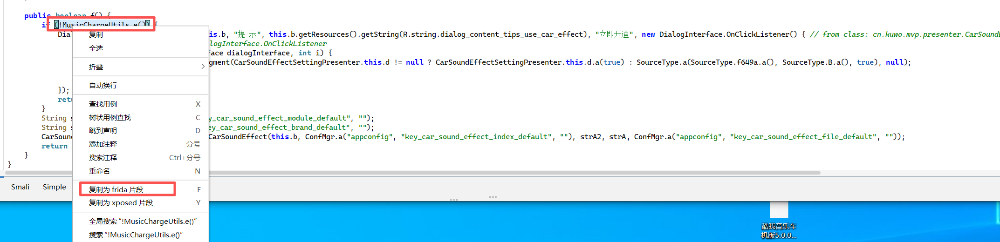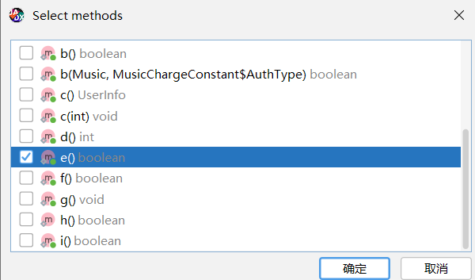

2. 编写js注入代码

```javascript
function main() {
    Java.perform(function () {
        let MusicChargeUtils = Java.use("cn.kuwo.mod.vipnew.MusicChargeUtils");
        MusicChargeUtils["e"].implementation = function () {
            console.log(`MusicChargeUtils.e is called`);
            let result = this["e"]();
            console.log(`MusicChargeUtils.e result=${result}`);
            result = true //添加我们的逻辑修改，让他判断为真
            console.log(`MusicChargeUtils.e result=${result}`);
            return result;
        };
    })
}
setTimeout(main)
```

##### 注入
`frida -UF -l .\1.js  `

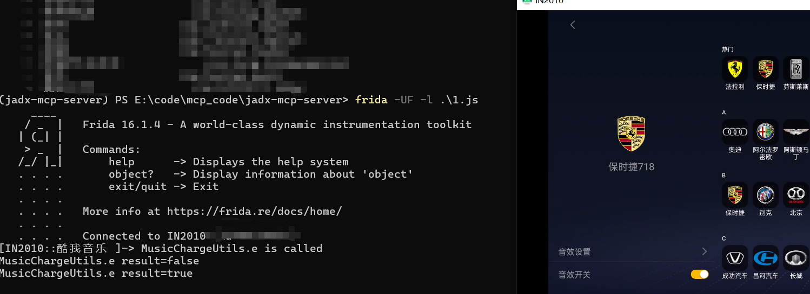

成功绕过`vip`检测


