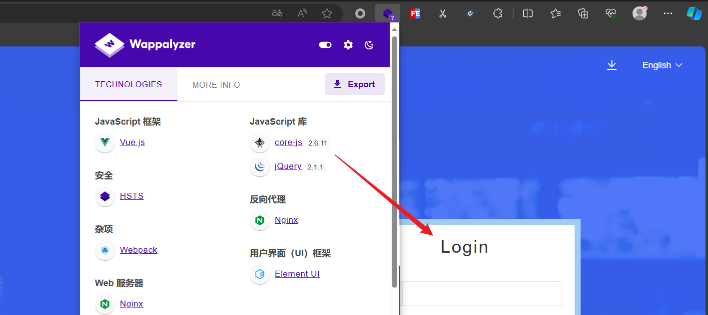
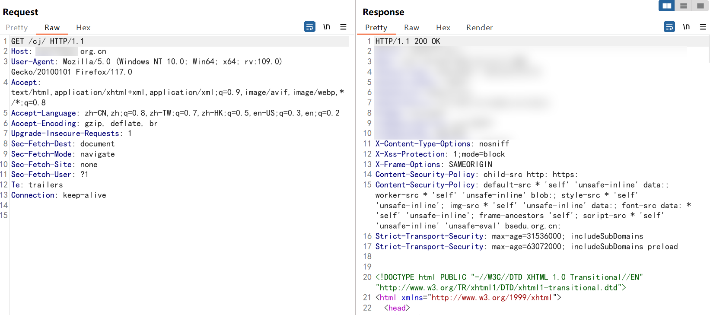
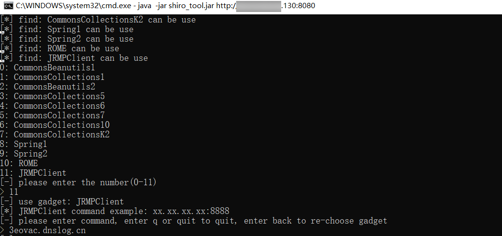
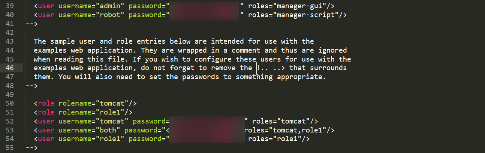

### 从最基础的登录框突破
登录框作为hw出现场次最多的角色，也是最容易出洞的，下面介绍一些自己常用的测试方法

#### 登录爆破小技巧

像这种系统的爆破我们有两种解决方法：

+ 分析前端加密算法，写脚本模拟对密码进行加密
+ 固定密码为123456 000000 使用常见的用户名作为字典进行爆破

两种方法各有优劣，我更倾向于第二种，在比赛打点效率会更高，分析加密算法更适用于红队检测项目

使用爆破的账号密码登入后台，便可以继续寻找后台上传点

看到图片类型这里限制上传的文件格式

直接添加 `aspx` 文件格式类型

成功getshell

#### 修改返回数据包参数进入后台
有些时候网站登录状态是根据前端判断的，这时候我们就可以直接修改返回包进行绕过

前端判断登录逻辑根据返回包的ret值决定，当返回值为1则成功登录

成功进入后台

#### 插件探测常见sql注入和log4j漏洞
sql注入插件推荐 [https://github.com/smxiazi/xia_sql](https://github.com/smxiazi/xia_sql)

基本原理是通过发送多个数据包，根据返回数据长度判断是否存在注入

除了被动扫描以外，我们还可以通过手动添加单引号、双引号去查看返回包，若存在类似报错则可能存在sql注入

sqlmap一把梭

log4j插件推荐 [https://github.com/TheKingOfDuck/burpFakeIP](https://github.com/TheKingOfDuck/burpFakeIP)

通过burp插件fuzz数据包的header头

成功探测出登录框的log4j漏洞

但要注意的的是很多dnslog平台已被防火墙标黑，因此推荐使用ceye或者自搭建dnslog平台

#### 系统默认口令+后台1day漏洞利用
随着攻防比赛愈发频繁，公网能直接利用的前台漏洞越来越少，大多数都被批量扫描修复过了，但我们可以利用系统的默认口令结合1day进行利用

如若依存在默认口令 

1. `admin/admin123`
2. `ry/admin123`
3. `ruoyi/admin123`
4. `admin/123456`
5. `druid/druid`

进入后台就可以通过计划任务或反序列化执行命令

很多时候我们碰到OA系统，拿OA漏洞检测工具扫一下没漏洞就放弃了，其实像这种OA系统还可能会存在默认口令的问题

# 默认口令
系统管理员：system/system  
集团管理员(A8-v5集团版) group-admin/123456  
单位管理员(A8-V5企业版) admin1/admin123456  
审计管理员(所有版本) audit-admin/seeyon123456

前台使用账号密码有时候不能登录，可发送下面数据包获取cookie

POST /seeyon/rest/authentication/ucpcLogin HTTP/1.1  
Host:  
User-Agent: Mozilla/5.0 (Windows NT 10.0; rv:78.0) Gecko/20100101 Firefox/78.0  
Content-Length: 71  
Content-Type: application/x-www-form-urlencoded  
Accept-Encoding: gzip  
  
UserAgentFrom=xx&login_username=audit-admin&login_password=seeyon123456

获取cookie之后就可以使用补丁较新的后台洞进行深入利用，这次使用copyfile这个后台洞

但实战后发现这个漏洞存在一些坑点，写入webshell时候报错了

POST /seeyon/ajax.do?method=ajaxAction&managerName=portalCssManager&rnd=111 HTTP/1.1  
Accept: */*  
Content-Type: application/x-www-form-urlencoded;charset=UTF-8  
Content-Length: 70  
Host: 192.168.91.17  
Connection: Keep-Alive  
User-Agent: Apache-HttpClient/4.5.13 (Java/1.8.0_321)  
Accept-Encoding: gzip,deflate  
  
arguments=%5B%22xxxxxx%22%5D&managerMethod=generateCssFileByCssStr

本地开环境调试一下，fuzz发现是双引号所导致，可通过前面加`\`解决，还有其他的问题总结如下：

+ 写seeyon路径下会404，可以换写到root目录下
+ webshell的双引号需要前面加入反斜杠，即`“`换成`\"`
+ 复制的文件名不能与之前的相同，否则会复制失败
+ `//`后需要进行换行

经过一首歌的时间，最终成功getshell

同样，X微OA的默认账号密码有 `sysadmin/1` `sysadmin/Weaver@2001`等等

### 差点擦肩而过的shiro漏洞
#### 被动扫描识别shiro指纹
使用`afrog`、`Wappalyzer`等指纹识别器有时候无法直接识别shiro框架

抓包使用`hae`插件被动扫描识别网站特征

[https://github.com/gh0stkey/HaE](https://github.com/gh0stkey/HaE)

#### WAF拦截绕过
使用工具检测到key，但利用链爆破时候被拦截了，访问网站发现被拦截了

换个ip继续冲，工具直接打不行，准备改用burp手动发包，但是问题又来了，挂着burp网站直接无法访问了

改用`yakit`能正常发包，猜测可能是`burp`特征被识别了，这时候想到最近看的github项目，决定尝试一下

[https://github.com/sleeyax/burp-awesome-tls](https://github.com/sleeyax/burp-awesome-tls)

未使用插件前，burp指纹特征被识别，抓包被拦截

使用插件后正常抓包

最终通过 OPTIONS 请求方式 + 静态资源 uri 路径 + 缩短payload长度成功绕过WAF

缩短payload长度可使用 `4raIn`师傅的项目 [https://github.com/antiRookit/ShortPayload](https://github.com/antiRookit/ShortPayload)

成功getshell

#### Yso重编译拿下某企业shiro系统
某个目标资产搜集到一个shiro框架系统，通过工具探测到存在默认密钥 `kPH+bIxk5D2deZiIxcaaaA==`

存在JRMP利用方式，但JRMP执行失败

可能原因：Yso自带的CB链版本和目标环境CB链版本不一致

用1.8.3重新进行编译

使用新的yso成功执行命令，另外防止其他队伍从目标得分还可以修改shiro默认key

### JS源代码抽丝剥茧从单点到逐个击破
#### fuzz未授权webpack接口
右键源代码——查看检索js——在后面添加.map

curl -O [http://xx.xx.xx.xx/\*.js.map](http://xx.xx.xx.xx/%5C*.js.map)

之后会下载一个js.map，使用`reverse-sourcemap`进行还原

npm install --global reverse-sourcemap  
reverse-sourcemap --output-dir 生成的目录 app.6804b239.js.map

可寻找各种未授权的接口进行进一步的利用

使用脚本提取路径，提取后的结果可作为字典放到burp进行fuzz

#### ueditor编辑器漏洞捡漏
查看源码，发现使用了ueditor组件

或者全局进行检索 ueditor，发现ueditor路径

构建表单上传 1.jpg?.aspx

`invalidPattern.Replace` 处通过正则替换后成为 1.jpg.aspx，后经过 `GetExtension()`得到扩展名 aspx 最后返回处理后的木马路径

#### 亚马逊S3存储桶接管
在js里翻找，发现网站背景图片来源于s3存储桶地址

访问该地址发现为 `NoSuchBucket` ，表示可以接管

亚马逊云注册相应的存储桶，填入相应的名称和区域即可，接管后再次访问会变为 `UnauthorizedAccess`

### 从任意文件读取到部署war包getshell

#### 框架识别
根据返回的 `rememberme` 判断为shiro框架

直接拿工具打一波发现找不到密钥，正常正常，毕竟现在公网的shiro经过多轮hw基本也绝迹了

#### 挖掘注释接口
问题不大，尝试从系统其他方面入手，从js里全局搜索 `download` `upload`这些字段，可能存在任意文件上传或读取漏洞

通常开发人员为了省事，可能会直接把前端功能代码注释掉，而不把相应后端接口删除，这时候就会给我们留下可乘之机

像这里我们通过检索`download`，发现一个被注释的下载接口，拼接路径尝试进行任意文件读取

#### shiro权限绕过
拼接路径后访问发现会重定向到首页，这时候开始怀疑漏洞是否存在，但转念一想可能是权限问题

这时候想到shiro框架有个容易被忽略的点，那就是权限绕过

shiro权限绕过分析 [https://xz.aliyun.com/t/12643](https://xz.aliyun.com/t/12643)

直接拼接会重定向到首页  
resources/js/xxxxxx/downloadFile?url=/../../../../etc/passwd

/..;/可绕过  
resources/js/xxxxxx/..;/../../downloadFile?url=/../../../../etc/passwd

通过`/..;/`成功读取主机文件

能读取文件那肯定是不够的，我们目标是getshell，尝试读数据库密码，但扫描端口发现未对外开放

这时候查看扫描结果发现8080端口是开放的，直接读取`/conf/tomcat-users.xml`文件，获取tomcat的密码

使用获取的账号密码登录，部署war包成功getshell

### 从旁站获取源码到任意文件上传
#### 提取网站特征
+ 查看网站特定js、开发厂商信息，如 `技术支持XXXX` `XXX公司`
+ 通过fofa、hunter测绘平台寻找旁站

#### 旁站备份文件扫描
导出同cms站点列表，扫描旁站备份文件

#### 云盘搜索泄露源码
我只能说，凌风云是个好东西

#### 代码审计
+ 获取源码后我们优先挖掘任意文件上传这类能getshell的漏洞
+ 查看 `web.xml` 搜索`.SaveAs` `upload`查找可利用的点，像下面这个代码，我们通过检索发现两处疑似上传的接口

跟进 `PreviewImageUploadServlet.class`

定义保存文件的路径，默认为 `/img/faces`，如果请求中包含名为 `path` 的参数，则将保存路径设置为该参数的值

创建一个 `MultipartRequestParser` 实例，用于解析请求，并将结果存储在 `PreviewImageInfo` 对象中

PreviewImageInfo info = (PreviewImageInfo)parser.parse(request, "com.chinasofti.ordersys.servlets.common.PreviewImageInfo");

跟进 `PreviewImageInfo.class` ，没有进行过滤，因此我们可以构建表单直接上传

### 某访客系统从actuator到百万数据泄露
查看burp历史记录发现系统会向后端请求`/gateway`接⼝

拼接路径进行目录扫描发现⼀堆`actuator`端点，使用最近新出的几个漏洞均没打成功

#### heapdump泄露
尝试从其他地方入手，发现存在 `heapdump` 泄露，使用工具查看泄露了些什么内容

[https://github.com/whwlsfb/JDumpSpide](https://github.com/whwlsfb/JDumpSpide)

发现一些账号密码，但都是在内网无法直接利用

继续从中寻找机会，把里面的接口和url拼接路径到Burp批量跑⼀下，这时候发现一个可以的注册接口，感觉有戏！

#### 创建用户获取token凭证
使用该接口创建用户

但创建后的用户不能直接登录到系统，但可以通过新增的账密获取token凭证

可结合接口文档使用token凭证调用接口查询，获取大量用户敏感数据

### 从nacos任意用户注册到接管企业云
HVV中最爱的nacos，全身上下都是价值连城的宝贝，关键是好找！

指纹特征 `HTTP Status 404 – Not Found 以及 8848端口`

直接访问404，拼接 `nacos` 路径可以看到目标系统

#### 漏洞检测
探测漏洞可使用下面脚本

[https://github.com/Pizz33/nacos_vul](https://github.com/Pizz33/nacos_vul)

nacos任意用户注册，关键在于登入后台查看配置文件里的账密信息

获取`accesskeyid`和`accesskeysecrets`后可使用工具接管云

推荐工具

[https://github.com/teamssix/cf/releases](https://github.com/teamssix/cf/releases)

[https://github.com/mrknow001/aliyun-accesskey-Tools/releases/tag/v1.3](https://github.com/mrknow001/aliyun-accesskey-Tools/releases/tag/v1.3)

获取到云数据库的账密，直接navicat连接

