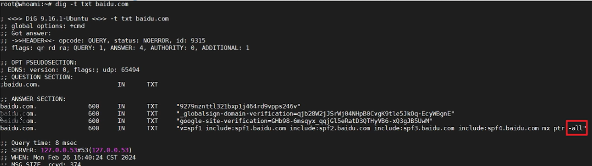

## 漏洞危害
允许攻击者伪造发件人身份，从而发送钓鱼邮件或垃圾邮件，获取接收方的信任，进而可能导致主机被控制或重要资料的泄露。

比如：[www.baidu.com](https://www.baidu.com)有这个漏洞，你就可以伪造[HR@baidu.com](mailto:HR@baidu.com)给受害人发邮件进行钓鱼

## 挖掘过程
` dig -t txt baidu.com `

如果是`-all`就是不存在，如果是`~all`就是存在

利用工具：kali自带的swaks

 swaks --body "钓鱼邮件测试" --header "Subject:钓鱼测试" -t my@163.com -f "test@baidu.com"

+ -t：后面改成自己的163邮箱
+ -f：后面改成要测试的域名邮箱

能收到邮件就说明存在此漏洞

### ✨怎么修复
把`~all`改成`-all`

