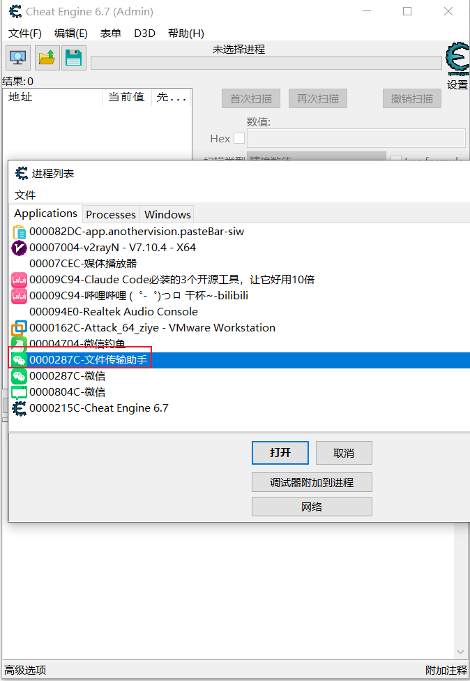
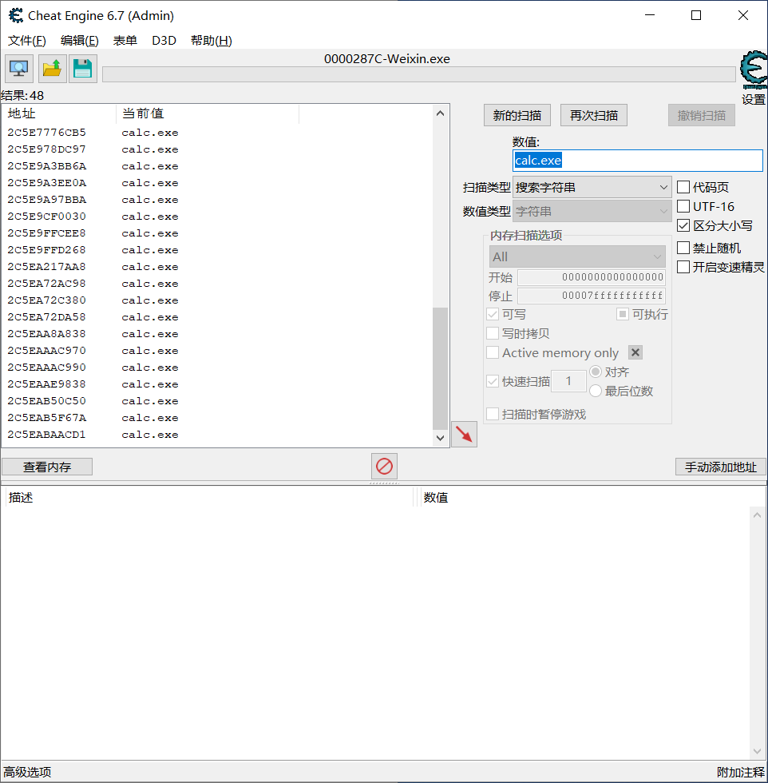
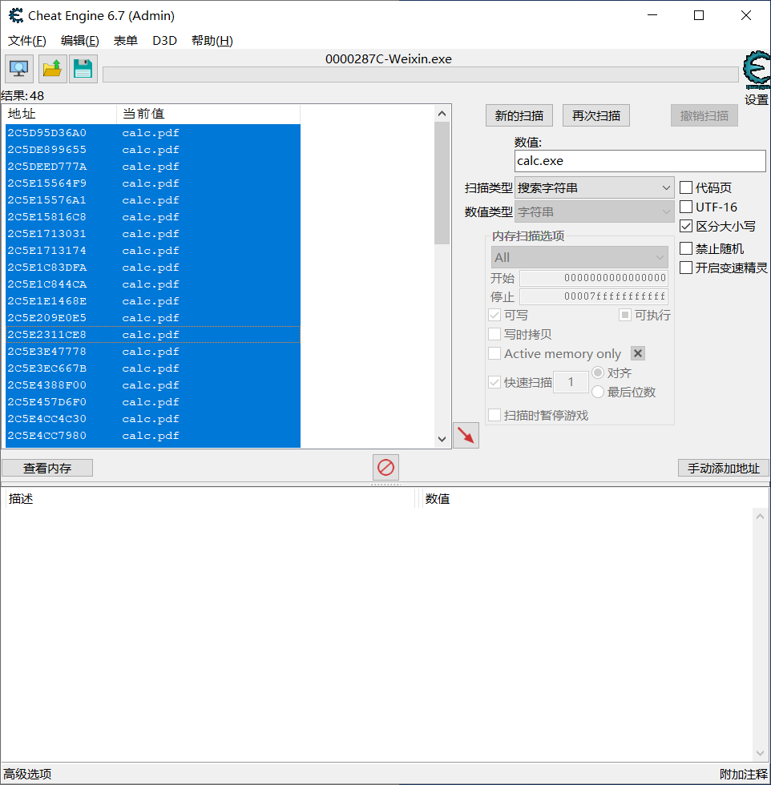

## 成品效果
### 原聊天

### 新聊天

### 落地

原

高温补贴申请表.docx.exe

内存更名

高温补贴申请表2026.docx

落地

高温补贴申请表2026.exe

## 操作过程
### 发送一个exe和随意一个消息

### 将会话单独拎出来

### 打开CE找到对应进程(进程名字和vx会话名一样)

### 全局搜索calc.exe

### 将所有的calc.exe替换为calc.pdf

### 多选消息合并转发

#### 被转发的视角

下载下来的是exe

