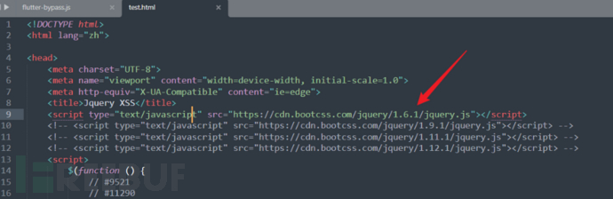
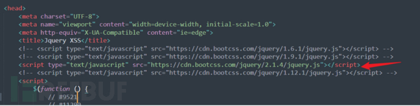
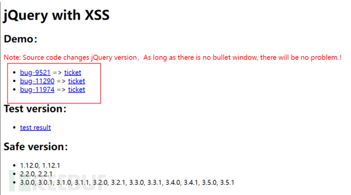
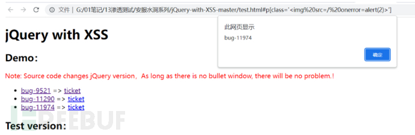
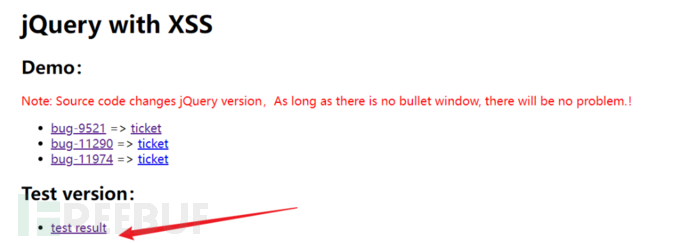
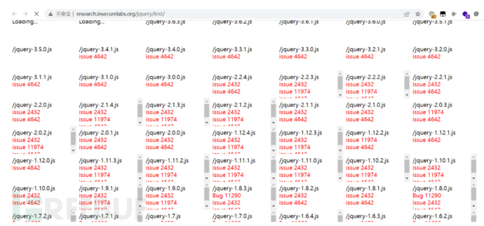

POST-xss危害基本没有

## 存在漏洞的jQuery版本
在大于或等于1.2且在3.5.0之前的jQuery。

## 漏洞存在的原因
在大于或等于1.2且在3.5.0之前的jQuery版本中，即使执行了消毒（sanitize）处理，也仍会执行将来自不受信任来源的HTML传递给jQuery的DOM操作方法（即html()、.append()等），从而导致xss漏洞。

## 利用工具
下载地址：https://github.com/mahp/jQuery-with-XSS

## 挖掘方法
1、将工具下载解压，使用编辑器打开test.html，修改第九行代码，将代码中的src=后的链接修改为要验证的jQuery链接。  

替换链接，在测试中替换的就是被测试网站的jquery  

2、保存后，使用浏览器打开，会看到3个demo。  
  
3、可以依次点击这三个Demo，看哪个会弹窗。如果弹窗，说明此版本的漏洞被验证成功了。  

4、也可以点击页面中的 test result，来判断自己版本的 jQuery 版本存在的 bug 编号。  
  

5、知道 bug 编号之后，再来到 test.html 页面点击对应的 bug编号即可。

## 修复方法
更新jQuery到3.5.0或更高版本

